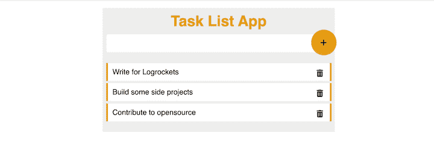

# 使用 Angular 和 NestJS 构建一个项目

> 原文：<https://blog.logrocket.com/build-project-using-angular-nestjs/>

使用 Angular 和 NestJS 构建项目是创建健壮的全栈 web 应用程序的好方法。Angular 是一个流行的前端 JavaScript 框架，它为构建丰富的交互式用户界面提供了一整套功能。相比之下，使用 Node.js 构建的后端框架 NestJS 提供了一套健壮的工具，用于构建高效且可伸缩的服务器端应用程序。

这两个框架一起为构建现代 web 应用程序提供了一个完整的解决方案，从前端用户界面到服务器端后端逻辑。在本教程中，我们将学习如何使用 Angular 和 NestJS 来构建一个项目，包括设置开发环境、创建组件和服务、处理路由以及进行 API 调用。

本教程将为您提供如何使用 Angular 和 NestJS 构建 web 应用程序的全面理解。阅读完本文后，您将能够使用这个强大的堆栈创建自己的项目。

*向前跳转:*

## 先决条件

要开始学习本教程，请确保您具备以下条件:

*   已安装 Node.js 和 npm

## Angular 和 NestJS 之间的相似性

NestJS 和 Angular 都是基于 JavaScript 的 web 应用程序框架，并且使用 JavaScript 作为它们的主要编程语言。这两个框架还共享以下特性:

*   使用基于组件的架构来组织和模块化代码
*   使用 TypeScript，JavaScript 的类型化超集。这允许在开发过程的早期捕捉错误，并使代码更易于维护
*   为构建动态的交互式用户界面提供强大的工具

但是，也有一些不同之处:

*   NestJS 构建在流行的 Node.js web 框架 ExpressJS 之上，而 Angular 使用 MVC(模型-视图-控制器)模式来构建应用程序
*   NestJS 是后端框架，Angular 是前端框架

NestJS 和 Angular 在全栈 web 开发中很好地互补。总之，他们可以创建一个完整的 web 应用程序，具有健壮的后端和动态的交互式前端。

## 建立 NestJS 项目

要设置一个 NestJS 项目，您需要首先安装 NestJS CLI 工具，如下所示:

```
 npm i -g @nestjs/cli

```

接下来，使用您选择的项目名称运行下面的命令来创建一个新项目。对于本教程，我们使用`tasks`作为项目名称:

```
nest new tasks

```

该命令将提示您选择要为您的项目管理的包。例如，可以在 npm 和 Yarn 之间进行选择。对于本教程，我们将使用 npm。一旦您选择了首选的包管理器，项目的依赖项将被安装。

现在，导航到项目目录并运行开发服务器:

```
cd tasks
npm run start:dev

```

一旦开发服务器开始运行，您应该会看到“Hello World！”通过在浏览器中导航到 [http://localhost:3000](http://localhost:3000) 发送消息。

## 设置新的角度项目

现在您的 NestJS 项目已经设置好了，您可以为应用程序的前端创建一个新的 Angular 项目。

通过在终端中运行以下命令来安装 Angular CLI:

```
npm install -g @angular/cli

```

接下来，使用您选择的项目名称运行下面的命令来创建一个新项目。在本演示中，我们使用`tasks-ui`作为项目名称:

`ng` `tasks-ui`

现在导航到项目目录并安装项目依赖项:

```
cd tasks-ui
npm install
<
```

最后，使用以下命令运行开发:

```
ng serve

```

一旦开发服务器开始运行，您应该能够通过在浏览器中导航到 [http://localhost:4200](http://localhost:4200) 来看到默认的 Angular 应用程序。

## 创建任务应用程序

既然已经设置好了后端和前端服务器，那么就该创建任务应用程序来保存和显示您的日常任务列表了。

首先，您将创建后端 API。这将包括创建路由、控制器和服务来处理任务数据，以及 CRUD 操作。

### 创建服务

首先在项目的根目录下创建一个`tasks.json`文件。这个文件将作为存储您的任务记录的数据库。

接下来，用下面的代码更新`src/app.service.ts`文件:

```
import { Injectable } from '@nestjs/common';
import * as fs from 'fs';
export interface Tasks {
  id: number;
  name: string;
  completed: boolean;
}
@Injectable()
export class AppService {
  private tasks: Array<Tasks>;
  constructor() {
    this.tasks = JSON.parse(fs.readFileSync('tasks.json', 'utf8'));
  }
  getTasks(): Tasks[] {
    return this.tasks;
  }
  createTask(name: string): Tasks[] {
    const task = { id: this.tasks.length + 1, name, completed: false };
    this.tasks = [...this.tasks, { ...task}];
    fs.writeFileSync('tasks.json', JSON.stringify(this.tasks));
    return this.tasks;
  }
  deleteTask(id: number): Tasks[] {
    const index = this.tasks.findIndex((task) => task.id === id);
    this.tasks.splice(index, 1);
    return this.tasks;
  }
}

```

这段代码实现了一个允许您管理任务列表的服务。该服务利用`@nestjs/common`模块为 NestJS 提供装饰器和实用函数，并利用`fs`模块与文件系统进行交互。

定义了一个`Tasks` `interface`来构造服务将管理的每个任务对象。`@Injectable()`装饰器被用来制造`AppService`级可注射。

私有属性`tasks`被定义为保存一组`Tasks`对象，并通过从`tasks.json`文件中读取任务并将其解析为一组任务对象，在构造函数中进行初始化。该服务有三种方法:

*   `getTasks()`:返回当前任务列表
*   `createTask(name: string)`:用给定的名称创建一个新的`task`对象，将其添加到任务列表中，然后将更新后的列表写入`tasks.json`文件
*   `deleteTask(id: number)`:根据给定的`id`从列表中删除任务

### 创建控制器

NestJS 中的控制器负责处理传入的 HTTP 请求并返回适当的响应。它充当客户端和服务之间的中介，接收来自客户端的输入，对其进行处理，然后返回响应。

要为应用程序创建控制器，您需要定义处理不同请求的路线和方法。这将允许我们的应用程序处理各种类型的客户端请求，比如 GET、POST、PUT 和 DELETE。

要为`AppService`创建控制器，用以下代码更新`src/app.controllers.ts`文件:

```
import {
  Controller,
  Get,
  Post,
  Body,
  Delete,
  Param,
  HttpException,
  HttpStatus,
} from '@nestjs/common';
import { AppService } from './app.service';
import { Tasks } from './app.service';
@Controller('api/todos')
export class AppController {
  constructor(private readonly appService: AppService) {}
  @Get()
  getTodos(): Tasks[] {
    try {
      return this.appService.getTasks();
    } catch (error) {
      throw new HttpException(error.message, HttpStatus.INTERNAL_SERVER_ERROR);
    }
  }
  @Post()
  createTodo(@Body() { name }: Tasks): Tasks[] {
    try {
      return this.appService.createTask(name);
    } catch (error) {
      throw new HttpException(error.message, HttpStatus.INTERNAL_SERVER_ERROR);
    }
  }
  @Delete(':id')
  deleteTodo(@Param('id') id: number): Tasks[] {
    try {
      return this.appService.deleteTask(id);
    } catch (error) {
      throw new HttpException(error.message, HttpStatus.INTERNAL_SERVER_ERROR);
    }
  }
}

```

这段代码定义了一个控制器，用于处理 NestJS 应用程序中与任务相关的请求。控制器用从`@nestjs/common`导入的`@Controller`装饰器来装饰。

装饰器接受一个字符串参数，它定义了控制器的端点。在这种情况下，终点是`api/tasks`。代码还导入了其他装饰器，如`@Get`、`@Post`、@ `Body`、`@Delete`和`@Param` *，它们用于处理不同类型的请求并从请求中提取数据。*

 *导入`AppService` *是因为它是一个依赖项，用于处理应用程序的逻辑。控制器有三种方法:`getTasks()`、`createTask()`和`deleteTask()`。*

 *每个方法都用一个对应于它处理的 HTTP 请求类型的装饰器来装饰。`getTasks()`方法用`@Get()`修饰，通过调用`AppService`的`getTasks()`方法返回任务列表。

* * *

### 更多来自 LogRocket 的精彩文章:

* * *

`createTasks()`方法用`@Post()`和`@Body()`修饰。它通过调用`AppService`的`createTask()`方法并传入任务名称来创建一个新任务。

`deleteTask()`方法用`@Delete()`和`@Param()`修饰。它通过调用`AppService`的`deleteTask()`方法并传入任务`id`来删除任务。

这些方法还包括使用 try-catch 块进行错误处理，并在错误发生时抛出带有`HttpStatus.INTERNAL_SERVER_ERROR`的`HttpException`。

## 创建应用程序用户界面

现在任务 API 已经完成，您已经成功地完成了应用程序后端部分的构建！

现在是时候使用 Angular 创建应用程序的 UI，然后使用 API 从用户界面管理任务了。

### 创建角度服务

首先，使用以下命令生成任务的服务:

```
ng generate service tasks

```

该命令在`src/app`目录中用服务名创建一个新的服务文件，并将其注册到`app.module.t` s 文件中。

接下来，用下面的代码片段更新`tasks.service.ts`文件，以添加使用 NestJS APIs 的服务:

```
import { Injectable } from '@angular/core';
import { HttpClient } from '@angular/common/http';
import { map } from 'rxjs';
@Injectable({
  providedIn: 'root',
})
export class TaskService {
  host = 'http://localhost:3000/api';
  // eslint-disable-next-line @typescript-eslint/no-empty-function
  constructor(private http: HttpClient) {}
  getTasks() {
    return this.http.get(`${this.host}/tasks`).pipe(map((res) => res));
  }
  addTask(todo: string) {
    return this.http.post(`${this.host}/tasks`, {
      name: todo,
      completed: false,
    });
  }
  deleteTask(id: number) {
    return this.http.delete(`${this.host}/tasks/${id}`);
  }
}

```

上面的代码在 Angular 中定义了一个服务，用于处理与功能相关的任务。服务用从`@angular/core`导入的`@Injectable`装饰器来装饰。

该服务有一个`host`属性，保存后端 API 的基本 URL。此外，还导入了`HttpClient`模块向后端发出 HTTP 请求。

该服务有三种方法:`getTasks()`、`addTask()`和`deleteTask()`。`getTasks()`方法向后端发出 GET 请求来检索任务。`addTask()`方法向后端发出一个 POST 请求来添加一个新任务。`deleteTask()`方法向后端发出删除请求，删除一个特定的任务。

每个方法都使用`HttpClient`模块向后端发出相应的 HTTP 请求并返回响应。`map`操作符从可观察的接口中提取响应。

### 更新应用程序组件

接下来，用下面的代码更新`app.components.ts`文件，以订阅您刚刚创建的服务:

```
import { Component } from '@angular/core';
import { TaskService } from './todo.service';
interface Task {
  id: number;
  name: string;
  completed: boolean;
}
@Component({
  selector: 'app-root',
  templateUrl: './app.component.html',
  styleUrls: ['./app.component.css'],
})
export class AppComponent {
  tasks: Task[];
  task: string;
  // eslint-disable-next-line @typescript-eslint/no-empty-function
  constructor(
    private taskService: TaskService,
  ) {
    this.tasks = [];
    this.task = '';
  }
  title = 'task-ui';
  ngOnInit() {
    this.taskService.getTasks().subscribe((data) => {
      console.log(data);
      this.tasks = data as Task[];
    });
  }

  addTask(task: string) {
    this.taskService.addTask(task).subscribe();
    this.task ='';
  }

  deleteTask(id: number) {
    this.taskService.deleteTask(id).subscribe((data) => {
      console.log(data);
    });
  }
}

```

上面的代码定义了一个`AppComponent`类。`AppComponent`用从`@angular/core`进口的`@Component`装饰器装饰。它有一个`selector`、`templateUrl`和`styleUrls`属性，分别用于指定组件的选择器、模板和样式。

`TaskService`被导入并注入到组件的构造函数中。

该组件有三个属性:

*   `tasks`:对象`Task`的数组
*   `task`:用于存储用户想要添加的任务
*   `title`:用于存储应用程序的标题

当初始化`TaskService`组件时，调用`ngOnInit()`方法。该组件有三种方法:

*   `getTasks()`:调用从后端检索任务
*   `addTask()`:当用户想要添加一个新任务到后台时调用
*   `deleteTask()`:当用户想要从后端删除任务时调用

### 更新应用程序模板

让我们利用`AppComponent`中定义的方法和变量来显示从 API 返回的任务，并附加事件处理程序来提交表单以添加新任务和删除现有任务。

用以下代码更新`app.component.html`文件:

```
<html lang="en">
  <head>
    <meta charset="UTF-8" />
    <meta http-equiv="X-UA-Compatible" content="IE=edge" />
    <meta name="viewport" content="width=device-width, initial-scale=1.0" />
    <link
      href="https://cdnjs.cloudflare.com/ajax/libs/font-awesome/6.2.1/css/all.min.css"
      rel= "stylesheet"
    />
    <script src="https://cdnjs.cloudflare.com/ajax/libs/angular.js/1.8.3/angular.min.js"></script>
    <title>Document</title>
  </head>
  <body>
    <div class="main" ng-app="mytodo" ng-controller="myCtrl">
      <h1>Todo List App</h1>
      <div class="search">
        <input type="text" [(ngModel)]="task" />
        <span (click)="addTask(task)"><i class="fas fa-plus"></i></span>
      </div>
      <ul>
        <li *ngFor= "let task of tasks">
          {{ task.name
          }}<i class="fas fa-trash-alt" (click)="deleteTask(task.id)"></i>
        </li>
      </ul>
      <p></p>
    </div>
  </body>
</html>

```

这段代码是`AppComponent`模板的一部分。它包括一个输入字段、一个按钮和一个无序列表。使用`ngModel`指令将输入字段绑定到组件的`task`属性。

输入字段的值双向绑定到`task`属性，因此当用户在输入字段中键入内容时，`task`属性的值会更新，当`task`属性的值更新时，输入字段也会更新。

按钮元素有一个图标和一个使用`(click)`事件绑定到`addTask()`组件方法的事件。当用户点击这个图标时，用任务文本调用`addTask()`方法。

无序列表使用`ngFor`指令遍历`tasks`数组。该指令为`tasks`数组中的每个任务创建一个新的列表项元素，并将任务数据绑定到`task`变量。每个列表项元素显示任务名称，并有一个垃圾桶图标，该图标带有一个使用`(click)`事件绑定到组件的`deleteTask()`方法的事件。当用户点击垃圾桶图标时，任务`id`调用`deleteTask()`方法。

### 更新样式

为了增强应用程序的外观，用以下样式表更新`src/styles.css`文件中的样式:

```
body{
    justify-content: center;
    display: flex;
    font-family: 'Poppins', sans-serif;
}
.main{
    width: 500px;
    padding: 15p;
    background-color: #ededed  ;
}
h1{
    text-align: center;
    color: #e69d17;
    margin: 10px;
}
input[type=text]{
    width: 90%;
    padding: 10px;
    font-size: 16px;
    margin-left: 8px;
    border-radius: 3px;
    border: none;
    outline: none;
}
.search {
    position: relative;
}
.search span{
    position: absolute;
    top: -10px;
    right: -4px;
    background: #e69d17;
    padding: 20px;
    display: flex;
    border-radius: 50%;
    width: 15px;
    height: 15px;
    cursor: pointer;

}
.search span i{
    line-height: -100%;
}
ul {
    padding: 2px;
    list-style: none;
}
ul li {
    background-color: #fff;
    margin: 5px;
    padding: 10px;
    border-right: 4px solid #e69d17;
    border-left: 4px solid #e69d17;
}
ul li i {
    padding: 4px;
    float: right;
    cursor: pointer;
}
p{
    color: red;
    text-align: center;
}

```

上面的样式表将设置输入字段的样式，并将添加按钮(+)放置在字段旁边。它还将按行格式化任务，并在每个任务项旁边添加一个删除(trash)图标。

## 测试全栈应用

现在是时候验证您的应用程序是否正常运行了。在运行应用程序之前，您需要启用一个代理来防止 CORS(跨源资源共享)问题。对于试图从其他服务器访问资源的客户端请求，代理充当中间人。这可以提高网络性能、安全性和合规性。

要启用代理，在您的`src`目录中创建一个名为`proxy.config.json`的文件，并添加以下配置:

```
{
    "/api": {
      "target": "http://localhost:3000",
      "secure": false,
      "pathRewrite": {"^/api" : ""}
    }
  }

```

现在运行后端和前端开发服务器，导航到 [http://localhost:4200/](http://localhost:4200/) 预览前端:



您可以通过点击 **+** 图标添加更多任务，并通过点击回收站图标删除任务。

## 结论

在本教程中，我们介绍了如何使用 Angular 和 NestJS 构建一个项目。我们首先解释了两个框架之间的相似之处。然后，我们为 NestJS 和 Angular 设置开发服务器。接下来，我们创建了一个将数据写入 JSON 文件的 NestJS 服务，作为应用程序的数据库。然后我们实现了一个 Angular 服务，它向 NestJS 后端发送 API 请求来执行 CRUD 操作。

最后，我们更新了 Angular App 组件类，以创建允许从 App 模板进行数据操作的方法。既然您已经学习了如何在构建全栈应用程序时集成 Angular 和 NestJS，那么您可以在下一个项目中使用这些框架。您还可以通过从 GitHub 克隆[完整项目来更新后端，以使用实际的数据库，如 MongoDB 或 MySQL。](https://github.com/Claradev32/angular-nest.js-fullstack-app)

我希望这篇教程对你有所帮助，并给你一些在下一个项目中使用 Angular 和 NestJS 的想法。编码快乐！

## 像用户一样体验 Angular 应用程序

调试 Angular 应用程序可能很困难，尤其是当用户遇到难以重现的问题时。如果您对监视和跟踪生产中所有用户的角度状态和动作感兴趣，

[try LogRocket](https://lp.logrocket.com/blg/angular-signup)

.

[](https://lp.logrocket.com/blg/angular-signup)[https://logrocket.com/signup/](https://lp.logrocket.com/blg/angular-signup)

LogRocket 就像是网络和移动应用程序的 DVR，记录你网站上发生的一切，包括网络请求、JavaScript 错误等等。您可以汇总并报告问题发生时应用程序的状态，而不是猜测问题发生的原因。

LogRocket NgRx 插件将角度状态和动作记录到 LogRocket 控制台，为您提供导致错误的环境，以及出现问题时应用程序的状态。

现代化调试 Angular 应用的方式- [开始免费监控](https://lp.logrocket.com/blg/angular-signup)。**