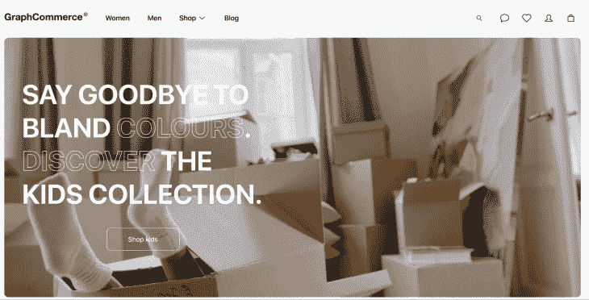
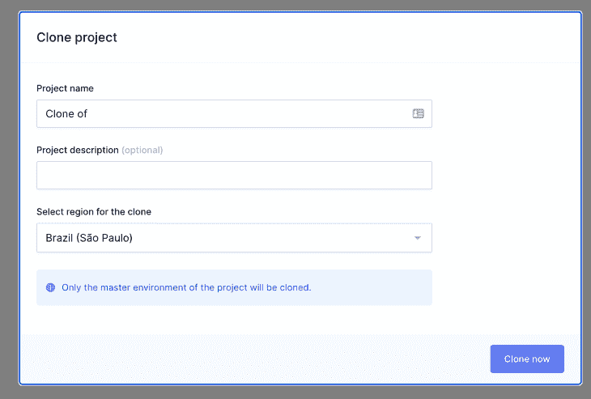
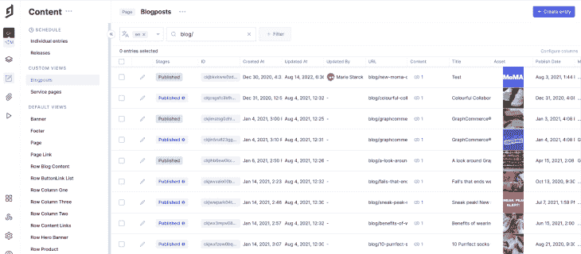
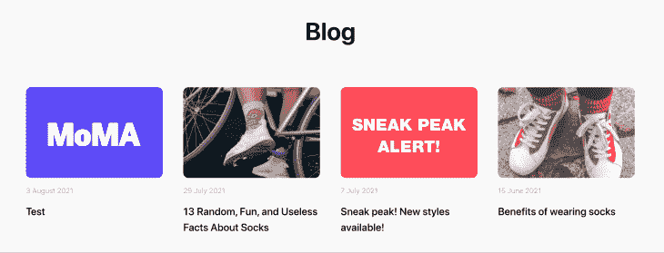

# 用 GraphCommerce 和 Next.js 建立一个 PWA

> 原文：<https://blog.logrocket.com/build-pwa-graphcommerce-nextjs/>

GraphCommerce 是一个 React 前端框架，允许开发人员创建与 Magento 连接的电子商务商店。

通过结合 Magento 的电子商务功能和 React 的便利性，开发人员可以访问许多功能，例如:

*   js 静态站点生成(又名 SSG)功能
*   PWA 支持感谢 next-pwa
*   Magento 的电子商务功能，如购物车和结账
*   从 GraphCMS 存储和获取内容的能力

在本教程中，你将学习如何用 GraphCommerce 创建一个电子商务商店。您将了解 PWA 配置和支付方式的设置位置。最后，您将创建自己的 GraphCMS 项目，并将其连接到您的 GraphCommerce 项目。您可以跳到以下任何步骤:

## 步骤 1:创建一个 GraphCommerce 项目

GraphCommerce 的启动项目位于 examples 文件夹下的 [GraphCommerce GitHub 存储库](https://github.com/graphcommerce-org/graphcommerce)中。

要获取存储库，首先要克隆它:

```
git clone https://github.com/graphcommerce-org/graphcommerce.git
```

一旦完成，你应该有一个名为`graphcommerce`的文件夹。要获得演示项目，您应该在 GraphCommerce 旁边创建一个项目(不要在它里面，因为您将删除`graphcommerce`文件夹)。

要创建该文件夹，请运行以下命令:

```
mkdir pwa-graphcommerce
```

然后，将`graphcommerce/examples/magento-graphcms/`中的 starter 项目复制到您之前创建的文件夹中。您也可以删除`graphcommerce`文件夹，因为您不再需要它。

```
cp -R graphcommerce/examples/magento-graphcms/. pwa-graphcommerce && rm -rf graphcommerce
```

新文件夹中装满了所有必需的文件，您可以在其中移动。

```
cd pwa-graphcommerce
```

在您的`pwa-graphcommerce`文件夹中，您可以创建运行您的应用程序所必需的`.env`。你可以直接从提供给你的`.env.exampl` e 文件中复制。

```
cp -R .env.example .env
```

您还应该删除项目中一些不必要的文件和文件夹。

```
rm CHANGELOG.md
rm -rf node_modules && rm -rf .next
```

## 步骤 2:启动您的 GraphCommerce 项目

完成第 1 步后，就可以启动应用程序了。为此，您应该安装以下所有依赖项:

```
yarn
```

一旦安装了依赖项，您还需要基于您的 GraphQL 模式和查询文档生成您的客户机代码。您可以通过运行以下命令来实现:

```
yarn codegen
```

最后，您可以启动开发服务器。

```
yarn dev
```

如果你访问 http://localhost:3000 ，你应该会看到这个:



以下是启动 GraphCommerce 项目时需要注意的一些事项。

### PWA 支持

PWA 功能通过库 [next-pwa](https://www.npmjs.com/package/next-pwa) 提供。当您启动开发服务器时，您应该在服务器日志中看到:

```
[next] > [PWA] PWA support is disabled
```

您可以在您的`next.config.js`中看到配置。在里面你应该看到:

```
const nextConfig = {
  ...
    pwa: {
      dest: 'public',
      disable: process.env.NODE_ENV === 'development',
  },
  ...
}
```

删除`disable`行，在本地服务器上启用 PWA 支持。

### 支付方式

GraphCommerce 项目提供了两种支付方式供您使用:

如果您想删除其中一个，您需要先将其从您的`package.json`中删除。

最后，进入您的`pages/checkout/payment.tsx`并删除它们在这个文件中的引用。

## (可选)创建一个 GraphCMS 项目

您的项目目前正在使用演示 Magento 和 GraphCMS。您可以通过在`.env`文件中配置 API 键来改变这一点。在本节中，您将发现如何创建自己的 GraphCMS 并将其链接到您的项目。

首先，注册到 [Hygraph](https://hygraph.com/) 并克隆默认的 starter 项目。要做到这一点，去这个地址克隆项目:[https://app . hy graph . com/clone/cadda a 93 CFA 9436 a 9 e 76 AE 9 c 0 f 34d 257](https://app.hygraph.com/clone/caddaa93cfa9436a9e76ae9c0F34d257)



一旦创建完成，您就可以从您的**项目设置**(左侧导航中的齿轮)和 **API 访问**中获得必要的 API 端点。在此页面中，您将看到“端点”部分。从那里，您可以复制**内容 API 端点**。

然后，转到您的`.env`文件，用您的新 URL 替换`GRAPHCMS_URL`演示 URL。

你必须关闭你的服务器并用`yarn codegen`重新生成文件。

一旦设置完成，您就可以更改内容并查看反映的更改。比如，头到**内容** > **博文**。将您的一篇文章的标题更改为`Test`。



一旦你回到你的应用程序，你应该会看到这些变化。



## 结论

GraphCommerce 是 React 内置的前端框架。它的目的是为 Magento 2 开发者提供一个 PWA。使用 GraphCommerce，开发人员可以快速轻松地创建和定制他们的店面。

在本教程中，您学习了如何使用演示数据设置和启动 GraphCommerce 应用程序。然后，您发现了如何创建自己的 GraphCMS 实例并将其链接到您的 GraphCommerce 应用程序。享受测试新应用的乐趣。

## [LogRocket](https://lp.logrocket.com/blg/nextjs-signup) :全面了解生产 Next.js 应用

调试下一个应用程序可能会很困难，尤其是当用户遇到难以重现的问题时。如果您对监视和跟踪状态、自动显示 JavaScript 错误、跟踪缓慢的网络请求和组件加载时间感兴趣，

[try LogRocket](https://lp.logrocket.com/blg/nextjs-signup)

.

[](https://lp.logrocket.com/blg/nextjs-signup)[](https://lp.logrocket.com/blg/nextjs-signup)

LogRocket 就像是网络和移动应用的 DVR，记录下你的 Next.js 应用上发生的一切。您可以汇总并报告问题发生时应用程序的状态，而不是猜测问题发生的原因。LogRocket 还可以监控应用程序的性能，报告客户端 CPU 负载、客户端内存使用等指标。

LogRocket Redux 中间件包为您的用户会话增加了一层额外的可见性。LogRocket 记录 Redux 存储中的所有操作和状态。

让您调试 Next.js 应用的方式现代化— [开始免费监控](https://lp.logrocket.com/blg/nextjs-signup)。