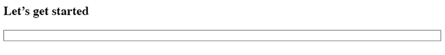
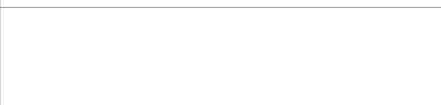
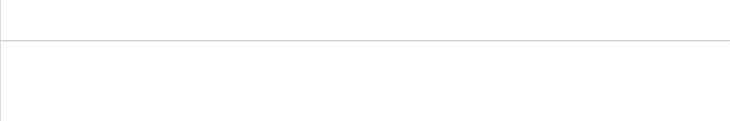
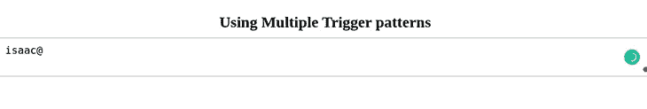
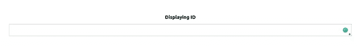
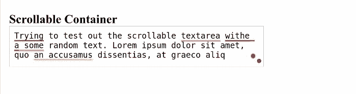
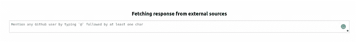
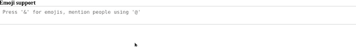
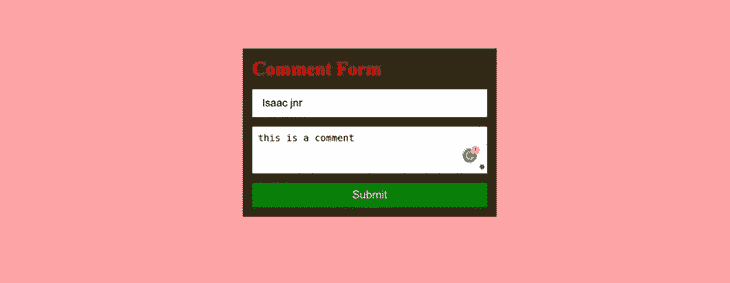

# 构建一个带有@提及功能的 React 评论表单

> 原文：<https://blog.logrocket.com/build-react-comment-form-mention-functionality/>

在引入`@mention`功能之前，评论线程和消息曾经是相当混乱的。虽然你可以在一个线程中发送消息，但通常没有办法知道消息是给谁的，也没有办法让那些没有参与到对话中的人参与进来。

有了`@mention`的介绍，你可以提到朋友(或者善意的社交媒体专家)，邀请他们加入讨论。

你还可以在脸书、Dropbox、WhatsApp 和 Gmail 等各种应用程序中找到带有`@mention`功能的表单。

本文将研究如何使用 React 中包含的`@mention`功能构建一个表单。我们将特别使用 [`react-mentions`](https://www.npmjs.com/package/react-mentions) 包。

你可以在 [my Github repo](https://github.com/IsaacThaJunior/Handling-React-mention-functionality) 中找到本教程的完整代码。我们开始吧！

让我们用下面的命令创建一个新的 React 应用程序:

```
npx create-react-app react-mentions

```

如果您使用 Yarn，运行以下命令:

```
yarn create react-app react-mentions

```

在本教程的剩余部分，我将使用 Yarn。

接下来，安装`react-mentions`包，如下所示:

```
yarn add react-mentions

```

`react-mentions`包为渲染引用导出了两个 React 组件:`MentionsInput`组件和`Mention`组件。`MentionsInput`是用于呈现文本区域控件的主要组件，可以将一个或多个`Mention`组件作为子组件。

`Mention`组件表示一类可提及对象的数据源，包括用户、问题等等。

## 使用`MentionsInput`和`Mention`组件

让我们在应用程序中实现`react-mentions`。转到`App.js`文件，用下面的代码块替换整个代码:

```
import { Mention, MentionsInput } from "react-mentions";

function App() {
  return (
    <div>
      <h2>Let's get started</h2>
      <MentionsInput>
        <Mention />
      </MentionsInput>
    </div>
  );
}
export default App;

```

当我们用`yarn start`启动开发服务器时，我们应该会看到如下图所示的输入框:



接下来，我们将创建一个伪数据数组，提供给`Mention`组件。数据必须有`id`和`display`作为特定的关键字。

我们还需要创建一个状态事件。这将用于将应用程序的状态绑定到来自数据的值，然后将其传递给`MentionsInput`组件。

将以下代码复制并粘贴到`App.js`文件中:

```
function App() {
  const [value, setValue] = useState("");

  const users = [
    {
      id: "isaac",
      display: "Isaac Newton",
    },
    {
      id: "sam",
      display: "Sam Victor",
    },
    {
      id: "emma",
      display: "e[email protected]",
    },
  ];

  ...
}

```

我们基于上面的代码块创建了一个状态变量和用户数组。用户数组包含带有`id`和`display`参数的对象。这些是填充`react-mentions`组件所需的参数。

现在，让我们用下面的代码更新`return()`语句:

```
  return (
    <div className="App">
      <MentionsInput
        value={value}
        onChange={(e) => setValue(e.target.value)}>

        <Mention
          data={users} />
      </MentionsInput>
    </div>
  );

```

我们使用了接受`value`属性的`MentionsInput`标签。然后我们用`onChange`道具设置状态值。完成所有这些工作后，我们应该能够实现以下目标:



## 造型`react-mentions`组件

看着我们上面的进展，你可能会注意到我们的组件看起来有点不合适。我们可以通过定制款式来解决这个问题。

在`src`文件夹中创建一个`mentionStyles.js`文件，并粘贴以下代码:

```
export default {
  backgroundColor: "#cee4e5",
};

```

在`src`文件夹中创建一个`mentionsInputStyles.js`文件，并将下面的代码块粘贴到其中:

```
export default {
  control: {
    backgroundColor: '#fff',
    fontSize: 16,
    // fontWeight: 'normal',
  },
  '&multiLine': {
    control: {
      fontFamily: 'monospace',
      minHeight: 63,
    },
    highlighter: {
      padding: 9,
      border: '1px solid transparent',
    },
    input: {
      padding: 9,
      border: '1px solid silver',
    },
  },
  '&singleLine': {
    display: 'inline-block',
    width: 180,
    highlighter: {
      padding: 1,
      border: '2px inset transparent',
    },
    input: {
      padding: 1,
      border: '2px inset',
    },
  },
  suggestions: {
    list: {
      backgroundColor: 'white',
      border: '1px solid rgba(0,0,0,0.15)',
      fontSize: 16,
    },
    item: {
      padding: '5px 15px',
      borderBottom: '1px solid rgba(0,0,0,0.15)',
      '&focused': {
        backgroundColor: '#cee4e5',
      },
    },
  },
}

```

返回`App.js`并导入样式:

```
import mentionStyle from "./mentionStyle";
import mentionsInputStyle from "./mentionsInputStyle";

```

现在，更新组件:

```
    <div className="App">
      <MentionsInput
        style={mentionsInputStyle} 
        value={value}
        onChange={(e) => setValue(e.target.value)}>

        <Mention
          style={mentionStyle}
          data={users}
        />
      </MentionsInput>
    </div>

```

我们通过添加 style prop 并将其设置为导入的样式来更新组件。

随着我们迄今为止的进展，我们已经在我们的应用程序中实现了一个不错的定制`Mention`功能！



## 探索`react-mentions`中的其他功能

这个`react-mentions`包提供了许多可定制的特性，所以让我们来看看其中的一些吧！

### `singleLine`输入

当我们希望我们的输入是单行文本而不是默认的文本区域时，就调用 input。您可以在下面的代码中看到这一点:

```
return (
 <div className="App">
  ...
  <h2>Using a Single line Input</h2>
      <MentionsInput
        singleLine  //this sets the single line input to true
        style={mentionsInputStyle}
        value={value}
        onChange={(e) => setValue(e.target.value)}
      >

    </div>
  );

```


### 多种触发模式

我们也可以决定使用多个触发模式，而不是默认的`@`触发模式。幸运的是，`react-mention`包支持这一点。

让我们启动第二个触发模式。在`App.js`文件中导入`useCallback`钩子。`useCallback`钩用于阻止`Mention`组件不必要的重新渲染；

```
import { useState, useCallback } from "react";

```

接下来，创建一个电子邮件验证正则表达式。这将作为检测输入是否是电子邮件的附加触发器。然后，它会将其突出显示为提及。

```
function App() {
  const [value, setValue] = useState("");
  const emailRegex = /(([^\[email protected]][email protected][^\[email protected]]+\.[^\[email protected]]+))$/;

  ...
  return (
    <div className="App">
      <h2>Using Multiple trigger patterns</h2>  
      <MentionsInput
        style={mentionsInputStyle}
        value={value}
        onChange={(e) => setValue(e.target.value)}
        >

        <Mention style={mentionStyle} data={users} />

        <Mention
          trigger={emailRegex}
          data={(search) => [{ id: search, display: search }]}
          onAdd={useCallback((...args) => {
            console.log(...args);
          }, [])}
          style={{ backgroundColor: "#d1c4e9" }}
        />
      </MentionsInput>
    </div>
  );

```



### 修改显示`id`

`react-mentions`库还允许我们将默认显示`id`更改为我们喜欢的显示。我们可以通过使用`displayTransform`参数来实现。

```
   <h2>Displaying ID</h2>
      <MentionsInput
        style={mentionsInputStyle}
        value={value}
        onChange={(e) => setValue(e.target.value)}
      >
        <Mention
          displayTransform={(id) => `<!--${id}-->`}
          style={mentionStyle}
          data={users}
        />
      </MentionsInput>

```

在上面的代码块中，我们从用户对象返回`id`并呈现它。



### 可滚动文本区

文本区域是响应式输入字段，可根据多个用户输入调整高度。这个特性可能会导致扭曲的 UI，并且适用于我们的`react-mentions`组件。我们将使我们的文本区域可滚动，以避免这种失真，并创建一个更好的用户界面。

首先，我们将把`lodash`库中的`merge`函数导入到`App.js`文件中:

```
import merge from 'lodash/merge';

```

`merge`函数将负责将我们的`mentionsInputStyle`与我们新的定制样式合并。

```
function App() {
  let customStyle = merge({}, mentionsInputStyle, {
    input: {
      height: 80,
      overflow: "auto",
    },
    highlighter: {
      height: 80,
      overflow: "hidden",
      boxSizing: "border-box",
    },
  });

  ...
  return (
      <MentionsInput
        value={value}
        onChange={(e) => setValue(e.target.value)}
        style={customStyle}
        placeholder={"Mention people using '@'"}
        a11ySuggestionsListLabel={"Suggested mentions"}
      >
        <Mention
          trigger="@"
          data={users}
          style={mentionStyle}
        />
  );
}

```

在上面的代码块中，我们将`mentionsInputStyle`合并到新更新的样式中。我们还将文本区域的高度和宽度设置为固定值，并自动设置溢出。

完成后，我们将有一个更好的 UI 和一个可滚动的组件，如下所示:



### 从外部来源获取响应

在这一节中，我们将看看如何在表单中使用来自 API 的数据。在许多情况下，我们的数据可能来自外部来源。让我们看看如何处理我们的响应并将它们添加到`react-mentions`数据属性中。

在这个演示中，我们将使用并从 [JSON 占位符 API](https://jsonplaceholder.typicode.com/users) 中获取用户。将下面的代码块复制并粘贴到`App.js`文件中:

```
  function fetchUsers(query, callback) {
    if (!query) return;
    fetch(`https://jsonplaceholder.typicode.com/users?q=${query}`, {
      json: true,
    })
      .then((res) => res.json())
      // Transform the users to what react-mentions expects
      .then((res) => 
        res.map((user) => ({ display: user.username, id: user.name }))
      )

      .then(callback);
  }

```

基于上面的代码块，我们正在对`jsonplaceholder`服务器进行 API 调用。我们向`fetch`函数传递了两个参数:`query`和`callback`。

`query`参数保存来自`mentionInput`的输入，而`callback`参数在我们准备好响应时被调用。

接下来，我们将返回一个用户列表，遍历它，并将用户名和用户名作为`display`和`id`的对象返回。

最后，我们在`MentionsInput`组件的数据属性中调用我们的函数，并显示`id`:

```
   <MentionsInput
        value={value}
        onChange={(e) => setValue(e.target.value)}
        style={mentionsInputStyle}
        placeholder="Mention any JsonPlaceholder username by typing `@` followed by at least one character"
        a11ySuggestionsListLabel={"Suggested JsonPlaceholder username for mention"}
      >
        <Mention
          displayTransform={(id) => `@${id}`}
          trigger="@"
          data={fetchUsers}
          style={mentionStyle}
        />
      </MentionsInput>

```



### 获取表情符号

使用`react-mentions`包，不仅可以引用和提及姓名，还可以提及表情符号！

让我们来看看如何从外部 API 获取表情符号，并在搜索时将它们显示在输入字段中。

```
function App() {
  const [emojiValue, setEmojiValue] = useState([]);
  const notMatchingRegex = /($a)/;

  useEffect(() => {
    fetch(
      "https://gist.githubusercontent.com/oliveratgithub/0bf11a9aff0d6da7b46f1490f86a71eb/raw/d8e4b78cfe66862cf3809443c1dba017f37b61db/emojis.json"
    )
      .then((data) => {
        return data.json();
      })
      .then((jsonData) => {
        setEmojiValue(jsonData.emojis);
      });
  }, []);
  const queryEmojis = (query, callback) => {
    if (query.length === 0) return;
    const filterValue = emojiValue
      .filter((emoji) => {
        return emoji.name.indexOf(query.toLowerCase()) > -1;
      })
      .slice(0, 10);
    return filterValue.map(({ emoji }) => ({ id: emoji }));
  };

  ...
  return (
      <h3>Emoji support</h3>
      <MentionsInput
        value={value}
        onChange={(e) => setValue(e.target.value)}
        style={mentionsInputStyle}
        placeholder={"Press '&' for emojis, mention people using '@'"}
      >
        <Mention
          trigger="@"
          displayTransform={(username) => `@${username}`}
          markup="@__id__"
          data={users}
          regex={/@(\S+)/}
          style={mentionStyle}
          appendSpaceOnAdd
        />
        <Mention
          trigger="&"
          markup="__id__"
          regex={notMatchingRegex}
          data={queryEmojis}
        />
      </MentionsInput>
  );
}

```

基于上面的代码块，页面一加载，我们就从我们的 API 获取表情符号并存储在我们的`emojiValue`中。每当用户搜索特定的关键词时，我们就使用`useEffect`钩子并显示表情符号。

这里，我们使用双触发模式，用符号`&`表示表情符号，用符号`@`表示用户数组。`notMatchingRegex`可以过滤不匹配的表情符号。



## 创建具有`@mention`功能的自定义表单

在这一节中，我们将把我们所了解到的关于`react-mentions`库的所有东西放在一起，构建一个评论表单。

首先，在`src`目录下创建一个`CustomForm.jsx`文件，并粘贴以下代码:

```
// CustomForm.jsx

import { useState } from 'react';
import { Mention, MentionsInput } from 'react-mentions';
import styles from './FormInputStyle.module.css';
import mentionsInputStyle from './mentionsInputStyle';
import mentionStyle from './mentionStyle';
const CustomForm = () => {
  const [formState, setFormState] = useState({
    username: '',
    comment: '',
  });
  const [comments, setComments] = useState([]);
  const users = [
    {
      id: 'isaac',
      display: 'Isaac Newton',
    },
    {
      id: 'sam',
      display: 'Sam Victor',
    },
    {
      id: 'emma',
      display: '[email protected]',
    },
  ];
  const submit = () => {
    if (formState.username === '' || formState.comment === '') {
      alert('Please fill in all fields');
      return;
    }
    setComments((comments) => [
      ...comments,
      {
        username: formState.username,
        comment: formState.comment,
      },
    ]);
    setFormState({
      username: '',
      comment: '',
    });
  };
  const current = new Date();
  const date = `${current.getDate()}/${
    current.getMonth() + 1
  }/${current.getFullYear()}`;

```

在上面的代码中，我们将从`react-mentions`导入我们将使用的包，以及用于处理表单的注释和状态的`useState`钩子。

表单和注释状态也已经设置好，并为应用程序提供虚拟数据。我们的`submit`函数检查字段是否被填充，并设置注释状态。我们现在有一个`date`变量来获取评论的日期。

现在，用下面的代码更新返回值:

```
return (
    <div className={styles.form}>
      <section className={styles.formCard}>
        <h2 className={styles.formTitle}>Comment Form</h2>
        <input
          type="text"
          value={formState.username}
          onChange={(e) =>
            setFormState({ ...formState, username: e.target.value })
          }
          placeholder="Input Your Name"
        />
        <MentionsInput
          placeholder="Add Comment. Use '@' for mention"
          value={formState.comment}
          onChange={(e) =>
            setFormState({ ...formState, comment: e.target.value })
          }
          style={mentionsInputStyle}
        >
          <Mention style={mentionStyle} data={users} />
        </MentionsInput>
        <button onClick={submit}>Submit</button>
      </section>
      {comments.length === 0 ? (
        null
      ) : (
        <section>
          {comments.map((comment, i) => (
            <div className={styles.commentCard} key={i}>
              <p className={styles.username}>
                {comment.username} on {date}
              </p>
              <h2>{comment.comment}</h2>
            </div>
          ))}
        </section>
      )}
    </div>
  );
};
export default CustomForm;

```

我们将适当的道具传递给`Mention`和`MentionInput`组件，并在表单下面显示评论(如果有的话)。

太好了！接下来，创建一个`FormInputStyle.module.css`用于样式化，并将以下代码粘贴到其中:

```
* {
  margin: 0;
  padding: 0;
  box-sizing: border-box;
}
.form {
  display: flex;
  flex-direction: column;
  align-items: center;
  justify-content: center;
  width: 100%;
  height: 100vh;
  background-color: #ffa5a5;
}
.formTitle {
  font-size: 2rem;
  color: red;
  margin-bottom: 1rem;
}
input {
  height: 3rem;
  width: 25rem;
  margin-bottom: 1rem;
  padding: 1rem;
  font-size: 18px;
  border: 1px solid silver;
}
.formCard {
  width: 27rem;
  display: flex;
  flex-direction: column;
  background-color: rgb(54, 44, 24);
  padding: 1rem;
}
button {
  border: none;
  border-radius: 3px;
  color: white;
  background-color: green;
  font-size: 1.2rem;
  padding: 10px;
  margin-top: 1rem;
}
.commentCard {
  margin: 1.5rem;
  color: rgb(173, 173, 173);
  font-size: 1rem;
  background-color: #444;
  padding: 1rem;
  width: 27rem;
}
.username {
  color: white;
  font-size: 1.3rem;
}

```

至此，我们完成了表单的创建！您应该会看到类似这样的内容:



## 结论

在本文中，我们学习了`react-mentions`，这是一个易于使用的库，用于构建具有`@mention`功能的表单。我们还研究了`react-mentions`包的不同功能以及如何使用它们。我们还使用`react-mention`包构建了一个具有`@mention`功能的评论表单。

感谢阅读！

## [LogRocket](https://lp.logrocket.com/blg/react-signup-general) :全面了解您的生产 React 应用

调试 React 应用程序可能很困难，尤其是当用户遇到难以重现的问题时。如果您对监视和跟踪 Redux 状态、自动显示 JavaScript 错误以及跟踪缓慢的网络请求和组件加载时间感兴趣，

[try LogRocket](https://lp.logrocket.com/blg/react-signup-general)

.

[ ](https://lp.logrocket.com/blg/react-signup-general) [](https://lp.logrocket.com/blg/react-signup-general) 

LogRocket 结合了会话回放、产品分析和错误跟踪，使软件团队能够创建理想的 web 和移动产品体验。这对你来说意味着什么？

LogRocket 不是猜测错误发生的原因，也不是要求用户提供截图和日志转储，而是让您回放问题，就像它们发生在您自己的浏览器中一样，以快速了解哪里出错了。

不再有嘈杂的警报。智能错误跟踪允许您对问题进行分类，然后从中学习。获得有影响的用户问题的通知，而不是误报。警报越少，有用的信号越多。

LogRocket Redux 中间件包为您的用户会话增加了一层额外的可见性。LogRocket 记录 Redux 存储中的所有操作和状态。

现代化您调试 React 应用的方式— [开始免费监控](https://lp.logrocket.com/blg/react-signup-general)。