# 构建一个带震颤的 React 仪表板

> 原文：<https://blog.logrocket.com/build-react-dashboard-tremor/>

仪表板是现代企业和管理员的必备工具。它们提供有洞察力的数据，有助于监控企业的量化绩效和指标。

在一个充斥着用于构建仪表板应用程序的高级库的生态系统中，人们可能会认为不可能满足于低级库。但事实是，与提供原始性能的低级库相比，大多数高级库往往很慢。

在本文中，我们将介绍用于在 React 中构建仪表板的底层库震颤，并演示如何使用震颤在 React 中创建交互式仪表板应用程序。

*向前跳转:*

## 先决条件

要学习本教程，您需要具备 React 和以下内容的基础知识:

*   系统上安装的 Node.js
*   顺风 CSS 的工作知识

## 什么是震颤？

震颤是一个开源的低级库，用于在 React 中构建仪表板。该库是基于组件的，提供了几个组件，如卡片、文本和图表，用于设置仪表板或分析界面。

震颤利用引擎盖下的顺风；它的组件是灵活和漂亮的开箱即用。然而，该库也允许使用原生 CSS 和 Tailwind 作为可选的附加组件来处理较小的布局因素。

虽然震颤是一个低级的库，但它的组件是非常高级的。仪表板布局可以通过原型制作和按正确顺序排列组件来快速组装，不太需要精确校准。

以下面的代码为例:

```
<Card maxWidth="max-w-lg">
  <Flex alignItems="items-start">
    <Block>
      <Text>Sales</Text>
      <Metric>$ 20,699</Metric>
    </Block>
    <BadgeDelta deltaType="moderateDecrease" text="13.2%" />
  </Flex>
  <Flex marginTop="mt-4">
    <Text truncate={true}>50% ($ 110,250)</Text>
    <Text> $ 220,500 </Text>
  </Flex>
  <ProgressBar percentageValue={50} marginTop="mt-2" />
</Card>

```

当渲染到浏览器时，它将转换为下图中的性能指标卡:

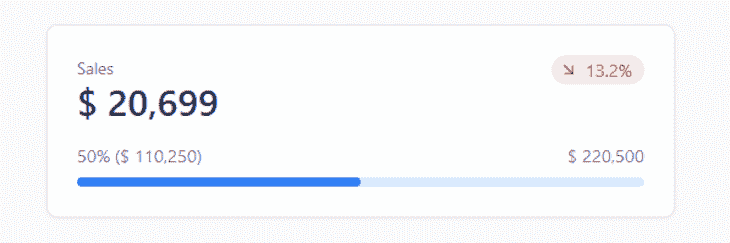

我们所做的只是导入每个组件，并按照个性化的顺序排列它们，以创建一个漂亮的性能指标卡。

## 震颤入门

首先，我们将使用 Vite 建立一个 React 项目，并安装震颤、 [Heroicons](https://heroicons.com/) 和 Tailwind 作为依赖项。

首先，打开你的命令行工具并`cd`到一个首选文件夹。接下来，运行以下代码来初始化 Vite 的 CLI 安装提示符:

```
npm create [email protected]

```

该命令将提示您为项目选择一个框架和您的首选项。从选项中选择以继续:

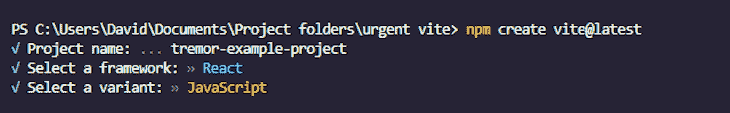

安装完成后，`cd`进入`tremor-example-project`文件夹，运行以下命令安装震颤、Heroicons 和顺风。

```
npm i [email protected] @tremor/react

```

这就是项目设置。接下来，我们将看看如何在我们的项目中设置顺风环境。

## 配置顺风

第一步是在项目的根文件夹中创建一个 Tailwind 和 PostCSS 配置文件。Tailwind 提供了一个 CLI 工具来自动完成这项工作:

```
npx tailwindcss init -p

```

该命令将在项目的根文件夹中创建`tailwind.config.js` *和`postcss.config.cjs`文件。*

 *打开`tailwind.config.js`文件，在`content`数组值中添加以下代码:

```
"./index.html", "./src/**/*.{js,ts,jsx,tsx}"

```

这些是我们项目中所有模板文件的路径。

添加路径后，`tailwind.config.js`文件中的内容应该类似于下图:

```
/** @type {import('tailwindcss').Config} */
module.exports = {
  content: ["./index.html", "./src/**/*.{js,ts,jsx,tsx}"],
  theme: {
    extend: {},
  },
  plugins: [],
};

```

接下来，导航到`src` *文件夹，打开`index.css`文件，用 Tailwind 的指令替换里面的 CSS 代码:*

```
@tailwind base;
@tailwind components;
@tailwind utilities;

```

现在我们可以在项目中使用 Tailwind 实用程序类。

要启动开发服务器，运行以下命令来安装 Vite 的依赖项并启动服务器:

```
npm install

```

然后:

```
npm run dev

```

后者将启动开发服务器，并自动在默认浏览器上预览应用程序。如果没有，请打开浏览器并导航至`[http://localhost:5173](http://localhost:5173)`。

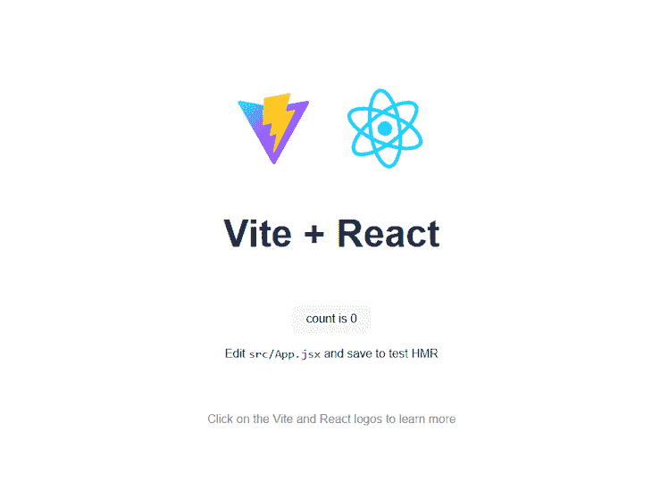

即使在安装了 Tailwind 之后，如果你试图使用震颤的任何组件，它们将在没有样式的情况下进行渲染。

```
<Card maxWidth="max-w-lg">
  <Flex alignItems="items-start">
    <Block>
      <Text>Sales</Text>
      <Metric>$ 20,699</Metric>
    </Block>
    <BadgeDelta deltaType="moderateDecrease" text="13.2%" />
  </Flex>
  <Flex marginTop="mt-4">
    <Text truncate={true}>50% ($ 110,250)</Text>
    <Text> $ 220,500 </Text>
  </Flex>
  <ProgressBar percentageValue={50} marginTop="mt-2" />
</Card>

```

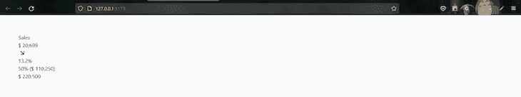

这是因为震颤的顺风包是在内部设置的，所以要在我们的应用程序中使用它，我们必须导入 CSS 文件，其中的指令是在`App.js`****或**** `main.jsx`文件内。

为此，转到`App.jsx`或`main.jsx`文件并添加以下代码路径:

```
import "@tremor/react/dist/esm/tremor.css";

```

如果保存进度并返回浏览器，组件应该会按预期呈现。

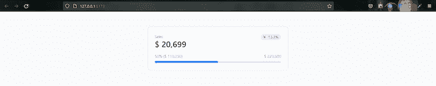

## 了解震颤的构成要素

在这一节中，我们将深入了解震颤的构建模块及其工作原理。

组件是震颤的组成部分。它们是预先设计的元素，使用一组可配置的属性来可视化数据。每个组件都包含几个用于配置其内部功能和可视组成的属性。

以下是对震颤的`AreaChart`组件的一个简单剖析:

```
<AreaChart
  data={[{}]}
  categories={[]}
  dataKey=""
  colors={["blue"]}
  valueFormatter={undefined}
  startEndOnly={false}
  showXAxis={true}
  showYAxis={true}
  yAxisWidth="w-14"
  showTooltip={true}
  showLegend={true}
  showGridLines={true}
  showAnimation={true}
  height="h-80"
  marginTop="mt-0"
  />

```

`data`、`categories`和`dataKey`道具解析并控制要可视化的数据，而其余的则配置组件的可视组成。

与`AreaChart`组件不同，大多数震颤组件接受数据作为`children`道具。以下面的代码为例:

```
<Text>Sales</Text>

```

标签之间的文本将被传递给组件的子属性:

```
function Text({ children }) {
  return (
    <p className="tr-shrink-0 tr-mt-0 tr-text-left tr-text-gray-500 tr-text-sm tr-font-normal">
      {children}
    </p>
  );
} 

```

div 上的实用程序类用于底层的 Tailwind 包。通过在浏览器的开发工具中检查呈现的元素，可以查看每个组件上的实用程序类。


访问[文档](https://www.tremor.so/docs/getting-started/introduction)以了解更多关于震颤组件的信息。

现在我们已经了解了震颤的工作原理，让我们来构建我们的第一个仪表板。

## 创建仪表板布局

震颤提供了被称为页面外壳块的示例布局。这些 shell 块是样板文件，允许我们快速将可视化和指标包装到视觉上引人注目的仪表板界面中，而不用担心布局约束，例如响应性。

访问[震颤的外壳页面](https://www.tremor.so/blocks/page-shells)查看可用外壳块列表。

对于本教程，我们将使用下图所示的 shell 块:

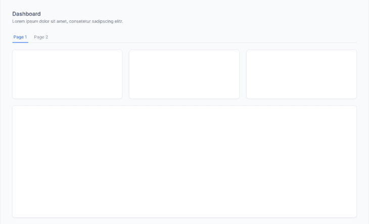

这个布局有两个选项卡:第一个包含三列性能指标卡和一个大容器。第二个选项卡只包含一个大容器。

第一步，在`src`文件夹中创建一个`components`子文件夹，并添加一个`example.jsx`文件。

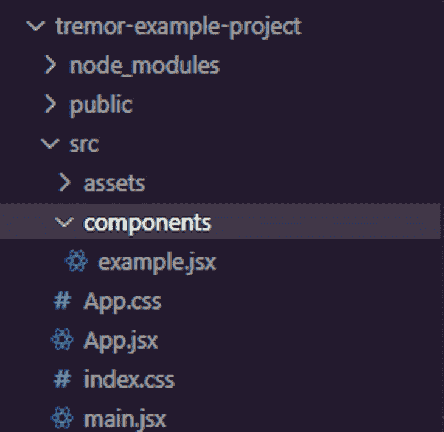

接下来，将以下代码添加到`example.jsx`文件中:

```
import {
  Card,
  Title,
  Text,
  Tab,
  TabList,
  ColGrid,
  Block,
} from '@tremor/react';

import { useState } from 'react';

export default function Example() {
const [selectedView, setSelectedView] = useState(1);
return (
<main>
    <Title>Dashboard</Title>
    <Text>Sales and growth stats for anonymous inc.</Text>
    <TabList defaultValue={ 1 } handleSelect={ (value) => setSelectedView(value) } marginTop="mt-6">
        <Tab value={ 1 } text="Page 1" />
        <Tab value={ 2 } text="Page 2" />
    </TabList>

    { selectedView === 1 ? (
        <>
            <ColGrid numColsMd={ 2 } numColsLg={ 3 } gapX="gap-x-6" gapY="gap-y-6" marginTop="mt-6">
                <Card>
                    { /* Placeholder to set height */ }
                    <div className="h-28" />
                </Card>
                <Card>
                    { /* Placeholder to set height */ }
                    <div className="h-28" />
                </Card>
                <Card>
                    { /* Placeholder to set height */ }
                    <div className="h-28" />
                </Card>
            </ColGrid>

            <Block marginTop="mt-6">
                <Card>
                    <div className="h-80" />
                </Card>
            </Block>
        </>
    ) : (
        <Block marginTop="mt-6">
            <Card>
                <div className="h-96" />
            </Card>
        </Block>
    ) }
</main>
  );
}

```

这个 shell 的结构非常简单；唯一突出的是代码的动态呈现部分。

```
{ selectedView === 1 ? (
  <>
      <ColGrid numColsMd={ 2 } numColsLg={ 3 } gapX="gap-x-6" gapY="gap-y-6" marginTop="mt-6">
          <Card>
              { /* Placeholder to set height */ }
              <div className="h-28" />
          </Card>
          <Card>
              { /* Placeholder to set height */ }
              <div className="h-28" />
          </Card>
          <Card>
              { /* Placeholder to set height */ }
              <div className="h-28" />
          </Card>
      </ColGrid>

      <Block marginTop="mt-6">
          <Card>
              <div className="h-80" />
          </Card>
      </Block>
  </>
) : (
  <Block marginTop="mt-6">
      <Card>
          <div className="h-96" />
      </Card>
  </Block>
) }

```

`selectedView`状态变量控制这个部分。如果它的值是`1`，它将显示第一个选项卡部分。否则，它将显示第二个选项卡部分。

`TabList`组件设置状态值。它包装了两个`Tab`组件，它们的值分别是`1`和`2`。

```
<TabList
  defaultValue={1}
  handleSelect={(value) => setSelectedView(value)}
  marginTop="mt-6"
>
  <Tab value={1} text="Overview" />
  <Tab value={2} text="Performance" />
</TabList>;

```

`TabList`组件上有两个功能道具:`defaultValue`和`handleSelect`。

`defaultValue`属性设置组件的默认值，在本例中是`1`。`handleSelect` prop 获取组件的当前值，并使用`setSelectedView`函数将其传递给状态。

```
handleSelect={(value) => setSelectedView(value)}

```

因此在初始加载时，`TabList`组件会将状态设置为默认值:`1`。因此，第一个选项卡部分显示在仪表板上。

当选择第二个选项卡时，`TabList`组件的值变成`2`，从而触发条件语句在仪表板上显示第二个选项卡部分。

最后，返回到`App.jsx`文件，像这样导入`example.jsx`文件:

```
import Example from  "./components/example";

function App() {
  return (
    <div className="p-14 bg-[#F9FAFB]">
      <Example />
    </div>
  );
}

export default App;

```

如果您保存您的进度，并在浏览器上查看页面外壳，您将了解所有这些是如何工作的。

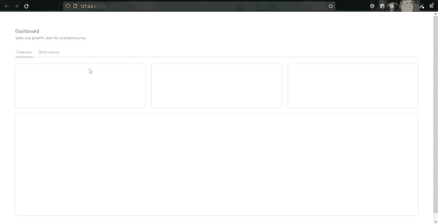

既然已经解决了这个问题，接下来，我们将用数据填充仪表板的卡片和容器。

## 添加卡片

为了填充我们的仪表板，我们需要一个可以从中获取信息的数据源。它可能来自 REST 或 GraphQL API。震颤与大多数数据提供者一起开箱即用，但为了简单起见，本教程将使用来自给定对象数组的硬编码数据。

但是首先，让我们把页面外壳分解成小块的组件，让代码尽可能的简洁。

首先，在`components`子文件夹中创建`Cards.jsx`、`firstContainer.jsx`和`secondContainer.jsx`文件。


接下来，将卡和两个大容器的代码块分别移动到`Cards.jsx`、`firstContainer.jsx`和`secondContainer.jsx`文件中。

`Cards.jsx`文件如下所示:

```
//src/cards.jsx

import React from "react";
import { Block, Card, ColGrid } from "@tremor/react";

export default function Cards() {
  return (
  <ColGrid numColsMd={ 2 } numColsLg={ 3 } gapX="gap-x-6" gapY="gap-y-6" marginTop="mt-6">
            <Card>
              { /* Placeholder to set height */ }
              <div className="h-28" />
            </Card>
            <Card>
               { /* Placeholder to set height */ }
               <div className="h-28" />
            </Card>
            <Card>
               { /* Placeholder to set height */ }
               <div className="h-28" />
            </Card>
         </ColGrid>

         <Block marginTop="mt-6">
            <Card>
               <div className="h-80" />
            </Card>
         </Block>
  );
}

```

而`firstContainer.jsx`看起来是这样的:

```
//src/firstContainer.jsx

import React from "react";
import { Block, Card } from "@tremor/react";

export default function FirstContainer() {
  return (
      <Block marginTop="mt-6">
        <Card>
          <div className="h-80" />
        </Card>
      </Block>
  );
}

```

并且`secondContainer.jsx`看起来是这样的:

```
//src/secondContainer.jsx

import React from "react";
import { Block, Card } from "@tremor/react";

export default function SecondContainer() {
  return (
      <Block marginTop="mt-6">
        <Card>
          <div className="h-80" />
        </Card>
      </Block>
  );
}

```

最后，将所有三个组件导入到`example.jsx`文件中，并将它们添加到各自的位置。

```
import Cards from "./cards";
import FirstContainer from "./firstContainer";
import SecondContainer from "./secondContainer";

export default function Example() {

    ...

      {selectedView === 1 ? (
        <>
          <Cards />
          <FirstContainer />
        </>
      ) : (
        <SecondContainer />
      )}
    </main>
  );
}

```

如果您做的一切都是正确的，那么当您保存您的进度时，您不应该在您的页面外壳上看到任何差异。

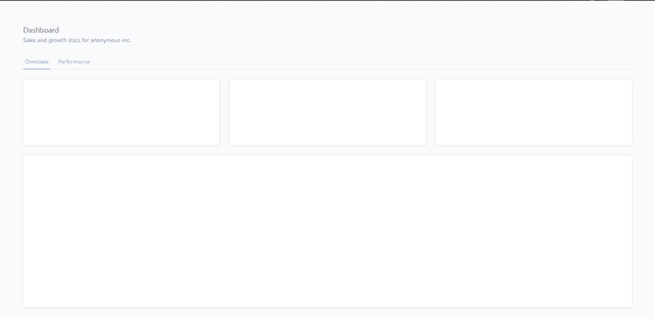

要填充我们的卡，进入`Cards.jsx`文件并在组件函数的顶部添加以下代码:

```
const data = [
  {
    title: "Sales",
    metric: "$ 12,699",
    progress: 15.9,
    target: "$ 80,000",
    delta: "13.2%",
    deltaType: "moderateIncrease",
  },
  {
    title: "Profit",
    metric: "$ 45,564",
    progress: 36.5,
    target: "$ 125,000",
    delta: "23.9%",
    deltaType: "increase",
  },
  {
    title: "Customers",
    metric: "1,072",
    progress: 53.6,
    target: "2,000",
    delta: "10.1%",
    deltaType: "moderateDecrease",
  },
];

```

这是我们从震颤的文档中得到的硬编码数据。这是一个对象数组，我们可以循环遍历它，并将其用作我们的卡的数据。

在页面外壳中有多张卡片的情况下，就像我们的例子一样，我们可以使用`map`数组方法，仅用一张卡片组合遍历数据。

为此，从`Cards`组件中移除两个卡片组合，并用 map 方法包装最后一个，如下所示:

```
{data.map((item) => (
<Card>
    <div className="h-28" />
  </Card>;
))}

```

接下来，在`Cards`组件中导入以下组件:

```
import {
  BadgeDelta,
  Block,
  Card,
  ColGrid,
  Flex,
  Metric,
  ProgressBar,
  Text,
} from "@tremor/react";

```

然后，将以下代码添加到卡中:

```
<Card key={item.title}>
  <Flex alignItems="items-start">
    <Block truncate={true}>
      <Text>{item.title}</Text>
      <Metric truncate={true}>{item.metric}</Metric>
    </Block>
    <BadgeDelta deltaType={item.deltaType} text={item.delta} />
  </Flex>
  <Flex marginTop="mt-4" spaceX="space-x-2">
    <Text truncate={true}>{`${item.progress}% (${item.metric})`}</Text>
    <Text>{item.target}</Text>
  </Flex>
  <ProgressBar percentageValue={item.progress} marginTop="mt-2" />
</Card>

```

卡片组合中的代码分为三个部分。第一部分有一个`Flex`组件，该组件有两个嵌套组件:`Block`和`BadgeDelta`。

```
<Flex alignItems="items-start">
  <Block truncate={true}>
    <Text>{item.title}</Text>
    <Metric truncate={true}>{item.metric}</Metric>
  </Block>
  <BadgeDelta deltaType={item.deltaType} text={item.delta} />
</Flex>

```

在`Block`组件中有两个嵌套组件:一个`Text`组件和一个`Metric`组件。我们使用了`Text`和`Metric`组件来呈现数据中的`title`和`metric`属性。

另一方面，`BadgeDelta`组件用于呈现`delta`属性。我们还将`deltaType`属性的值传递给`deltaType`属性来设置组件的类型。

```
<BadgeDelta deltaType={item.deltaType} text={item.delta} />

```

注意:`Flex`组件是一个为其所有子组件启用 flex 上下文的容器。在这种情况下，它会将`Block`和`BadgeDelta`组件并排放置在水平轴上。

卡片的第二部分也有一个`Flex`组件，其中嵌套了两个`Text`组件。

```
<Flex marginTop="mt-4" spaceX="space-x-2">
  <Text truncate={true}>{`${item.progress}% (${item.metric})`}</Text>
  <Text>{item.target}</Text>
</Flex>

```

我们使用了两个`Text`组件来呈现`progress`和`target`属性，指示进度条的进度和目标值。

`ProgressBar`组件是卡片组合中的最后一个元素。我们用它来可视化数据数组中的`progress`属性，方法是将属性值传递给`percentageValue`属性。

```
<ProgressBar percentageValue={item.progress} marginTop="mt-2" />

```

现在，保存您的进度并返回浏览器。您的卡片应该呈现如下图所示:

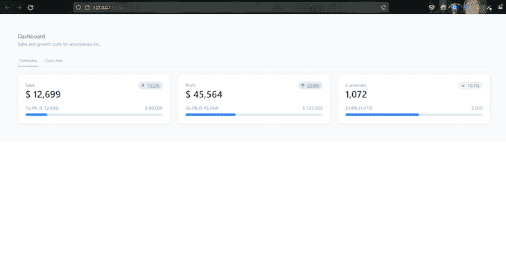

接下来，我们将使用震颤的条形图和折线图组件填充两个大容器。

## 添加图表

震颤提供了三个图表组件:`LineChart`、`BarChart`和`AreaChart`。每个组件都独特地可视化定量数据。

在本节中，我们将使用`BarChart`和`LineChart`组件来填充仪表板上的第一个和第二个大容器。

### 条形图

首先，转到`firstContainer.jsx`文件，从震颤导入以下组件:

```
import { Block, Card, Title, BarChart} from "@tremor/react";

```

接下来，在组件中添加以下代码:

```
const data = [
  {
    state: "Alaska",
    "Store A": 890,
    "Store B": 338,
    "Store C": 538,
    "Store D": 396,
    "Store E": 138,
    "Store F": 436,
  },
  {
    state: "Michigan",
    "Store A": 289,
    "Store B": 233,
    "Store C": 253,
    "Store D": 333,
    "Store E": 133,
    "Store F": 533,
  },
  {
    state: "New York",
    "Store A": 389,
    "Store B": 233,
    "Store C": 653,
    "Store D": 533,
    "Store E": 233,
    "Store F": 733,
  },
];

const dataFormatter = (number) => {
  return "$ " + Intl.NumberFormat("us").format(number).toString();
};

export default function FirstContainer() {
  return (
    <div>
      <Block marginTop="mt-6">
        <Card>
          <Title>Sales: Entries</Title>
          <BarChart
            data={data}
            dataKey="state"
            categories={[
              "Store A",
              "Store B",
              "Store C",
              "Store D",
              "Store E",
              "Store F",
            ]}
            colors={["blue", "teal", "amber", "rose", "indigo", "emerald"]}
            valueFormatter={dataFormatter}
            marginTop="mt-6"
            yAxisWidth="w-12"
          />
        </Card>
      </Block>
    </div>
  );
}

```

这里，我们添加了一个包含几个状态组的对象数组。每个组包含几个带有数值的`store`类别。

为了可视化每个州的每个商店的统计数据，我们首先创建一个`dataFormatter`函数来控制图表 y 轴上的值的文本格式。我们将这些值转换成一个字符串，并在它们前面加上`$`符号。

```
const dataFormatter = (number) => {
return "$ " + Intl.NumberFormat("us").format(number).toString();
};

```

接下来，我们将`Title`和`BarChart`组件添加到容器的卡中。我们使用`Title`组件显示图表的标题，使用`BarChart`组件呈现图表。

在`BarChart`组件上，我们将数据数组传递给了`data`属性，将`state`属性传递给了`dataKey`属性，并将可用商店的数组传递给了`categories`属性。

```
<BarChart
  data={chartdata2}
  dataKey="state"
  categories={[
    "Store A",
    "Store B",
    "Store C",
    "Store D",
    "Store E",
    "Store F",
  ]}
  colors={["blue", "teal", "amber", "rose", "indigo", "emerald"]}
  valueFormatter={dataFormatter}
  marginTop="mt-6"
  yAxisWidth="w-12"
/>

```

`colors`道具设置每个商店的独立颜色。颜色是按照排列顺序设置的。最后，我们将`dataFormatter`函数传递给了`valueFormatter`道具。

第一个集装箱到此为止。保存您的进度并返回浏览器。您应该会看到一个条形图，在性能指标卡下面呈现了不同的组。

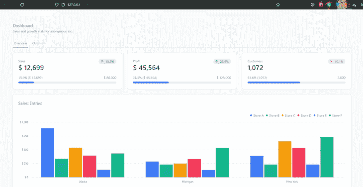

### 折线图

对于第二个容器，我们将使用一个`LineChart`组件。震颤的图表组件共享相似的解剖结构，所以我们的工作流程将与前一节的相同。

首先转到`secondContainer.jsx`文件，导入以下组件:
导入{
区块、
卡牌、
Toggle、
ToggleItem、
Text、
LineChart、
Title、
}来自“@震颤/反应”；

接下来，在组件中添加以下代码:

```
const data = [
  {
    date: "2021-01-01",
    Sales: 900.73,
    Profit: 173,
    Customers: 73,
  },
  {
    date: "2021-01-02",
    Sales: 300.74,
    Profit: 174.6,
    Customers: 74,
  },
  {
    date: "2021-03-13",
    Sales: 882,
    Profit: 682,
    Customers: 582,
  },
  {
    date: "2021-05-07",
    Sales: 582,
    Profit: 382,
    Customers: 662,
  },
  {
    date: "2021-07-10",
    Sales: 752,
    Profit: 942,
    Customers: 282,
  },
];

const dollarFormatter = (value) =>
  `$ ${Intl.NumberFormat("us").format(value).toString()}`;

const numberFormatter = (value) =>
  `${Intl.NumberFormat("us").format(value).toString()}`;

export default function SecondContainer() {
  const [selectedKpi, setSelectedKpi] = React.useState("Sales");

  const formatters = {
    Sales: dollarFormatter,
    Profit: dollarFormatter,
    Customers: numberFormatter,
  };

  return (
    <Block marginTop="mt-6">
      <Card>
        <div className="md:flex justify-between">
          <Block>
            <Title> Performance History </Title>
            <Text> Daily increase or decrease per domain </Text>
          </Block>
          <div className="mt-6 md:mt-0">
            <Toggle
              color="zinc"
              defaultValue={selectedKpi}
              handleSelect={(value) => setSelectedKpi(value)}
            >
              <ToggleItem value="Sales" text="Sales" />
              <ToggleItem value="Profit" text="Profit" />
              <ToggleItem value="Customers" text="Customers" />
            </Toggle>
          </div>
        </div>
        <LineChart
          data={data}
          dataKey="date"
          categories={[selectedKpi]}
          colors={["blue"]}
          valueFormatter={formatters[selectedKpi]}
          marginTop="mt-6"
          yAxisWidth="w-10"
        />
      </Card>
    </Block>
  );
}

```

这段代码与上一节中的代码的唯一区别是`formatters`对象、`selectedKpi`状态和`Toggle`组件。

在`formatters`对象中，我们为数据中的每个类别创建了三个键，并将`dollarFormatter`和`numberFormatter`函数作为值传递给它们。

```
const formatters = {
    Sales: dollarFormatter,
    Profit: dollarFormatter,
    Customers: numberFormatter,
  }; 

```

`formatters`对象将让我们根据`selectedKpi`状态的值为`LineChart`组件动态设置一个文本格式化程序。

`Toggle`组件的行为与`TabList`组件完全一样。它包含三个`ToggleItem`组件，它们的值分别是`sales`、`Profit`和`Customers`。

```
<Toggle
    color="zinc"
    defaultValue={selectedKpi}
    handleSelect={(value) => setSelectedKpi(value)}
  >
    <ToggleItem value="Sales" text="Sales" />
    <ToggleItem value="Profit" text="Profit" />
    <ToggleItem value="Customers" text="Customers" />
</Toggle>

```

这里，我们使用`handleSelect`属性将活动的`ToggleItem`组件的值设置为 state。然后我们将`selectedKpi`状态的当前值传递给`Toggle`组件的`defaultValue`属性。

与我们在上一节中创建的条形图不同，我们希望`LineChart`组件为每个类别呈现单独的数据。

因此，我们没有一次将所有三个类别传递给`categories`属性，而是传递给它`selectedKpi`状态并呈现当前值。

```
  <LineChart
    data={data}
    dataKey="date"
    categories={[selectedKpi]}
    colors={["blue"]}
    valueFormatter={formatters[selectedKpi]}
    marginTop="mt-6"
    yAxisWidth="w-10"
  />

```

由于`Toggle`组件设置状态的值，活动的`ToggleItem`将决定一次呈现的类别。

我们为`valueFormatter`道具做了类似的事情:

```
valueFormatter={formatters[selectedKpi]}

```

我们使用状态的值通过方括号语法从`formatters`对象中访问相应的属性。

例如，如果选择了`customers`切换项，其值(也是一个`'Customers'`字符串)将通过状态传递给`valueFormatter`属性上的方括号语法。

然后语法将访问`formatters`对象并将`Customers`属性传递给`valueFormatter`作为回报。

这就对了。我们有一个功能齐全的控制面板，具有动态呈现的分析界面。保存你的代码并返回到浏览器，马上就能好好看看我们用震颤组装起来的东西。

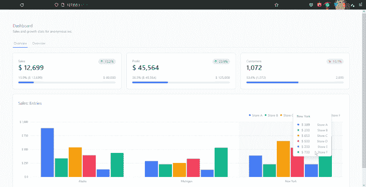

## 结论

在本文中，我们介绍了震颤，并查看了构建模块及其组件如何在幕后工作。我们还研究了如何合并不同的块组合来创建一个页面外壳样板和一个完全交互式的仪表板。

在撰写本文时，震颤仍处于测试阶段，这意味着在未来的更新中可能会有突破性的变化。尽管如此，震颤是准备生产。访问[震颤的文档](https://www.tremor.so/docs/getting-started/installation)来学习如何创建一个更复杂的仪表板。

## [LogRocket](https://lp.logrocket.com/blg/react-signup-general) :全面了解您的生产 React 应用

调试 React 应用程序可能很困难，尤其是当用户遇到难以重现的问题时。如果您对监视和跟踪 Redux 状态、自动显示 JavaScript 错误以及跟踪缓慢的网络请求和组件加载时间感兴趣，

[try LogRocket](https://lp.logrocket.com/blg/react-signup-general)

.

[ ](https://lp.logrocket.com/blg/react-signup-general) [](https://lp.logrocket.com/blg/react-signup-general) 

LogRocket 结合了会话回放、产品分析和错误跟踪，使软件团队能够创建理想的 web 和移动产品体验。这对你来说意味着什么？

LogRocket 不是猜测错误发生的原因，也不是要求用户提供截图和日志转储，而是让您回放问题，就像它们发生在您自己的浏览器中一样，以快速了解哪里出错了。

不再有嘈杂的警报。智能错误跟踪允许您对问题进行分类，然后从中学习。获得有影响的用户问题的通知，而不是误报。警报越少，有用的信号越多。

LogRocket Redux 中间件包为您的用户会话增加了一层额外的可见性。LogRocket 记录 Redux 存储中的所有操作和状态。

现代化您调试 React 应用的方式— [开始免费监控](https://lp.logrocket.com/blg/react-signup-general)。**