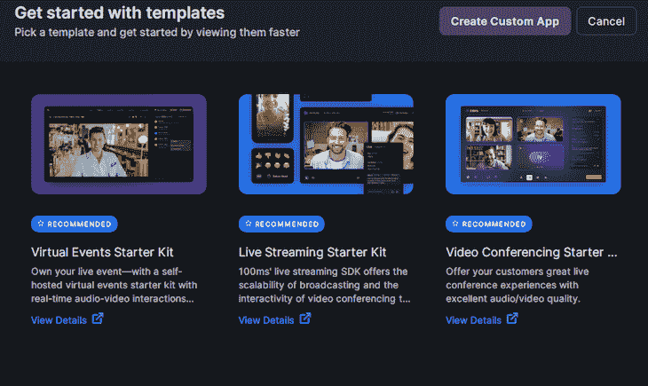
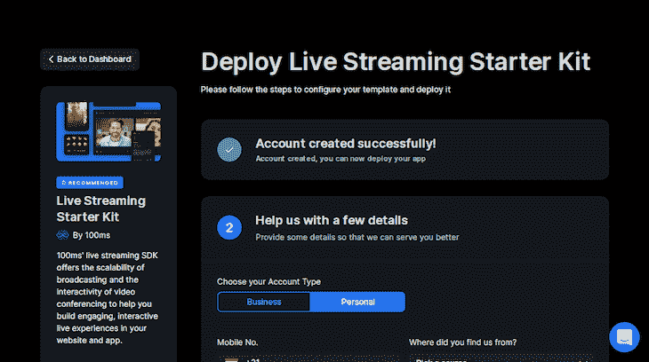
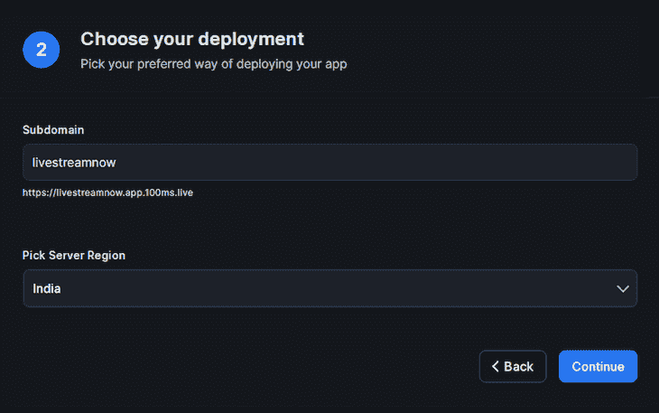
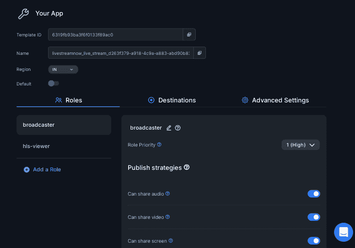
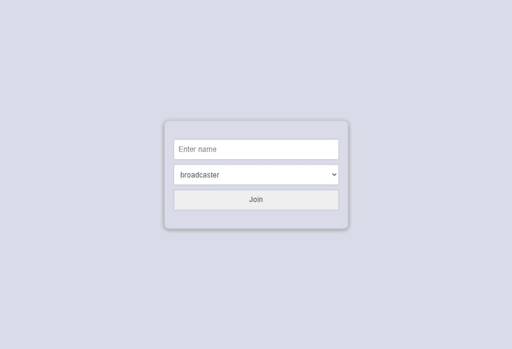
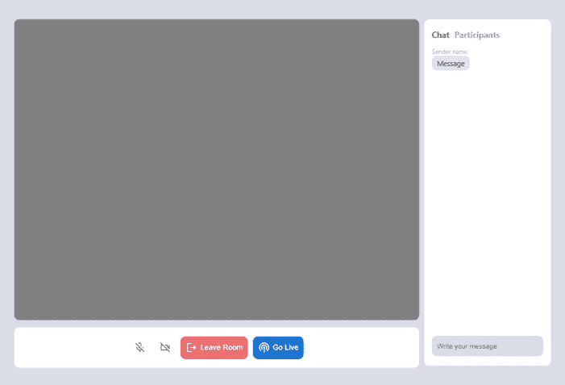
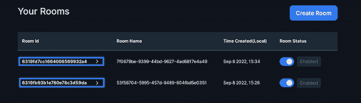
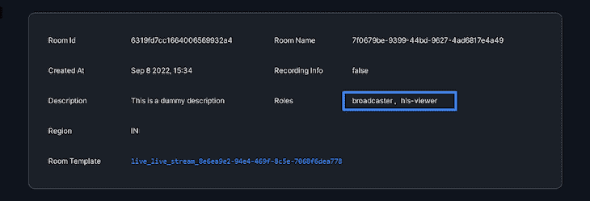
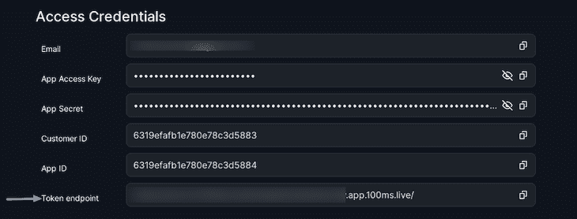
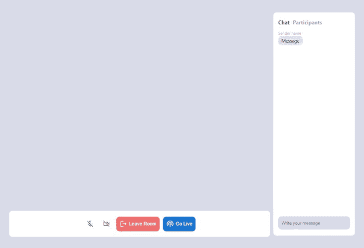

# 使用 100ms 构建 React 直播应用程序

> 原文：<https://blog.logrocket.com/build-react-live-streaming-app-100ms/>

直播是与从一个人到数百万观众实时互动的好方法。与任何人都可以随时共享屏幕或发言的视频会议不同，在直播中，观众的权限有限。从头开始实现直播将非常耗时，但我们可以使用一些服务来添加这一功能，只需几个步骤，其中之一就是[100 毫秒](https://www.100ms.live/)。

在本教程中，我们将通过构建一个具有互动功能的直播流应用程序来了解 100 毫秒，广播公司和观众可以使用聊天进行交流。

要学习本教程，您应该熟悉 React 和 React 钩子。您还应该在系统中安装 Node.js。

本教程的完整代码可在 GitHub 上获得。我们开始吧！

## 100ms 简介

100ms 是一个云平台，允许开发者将视频和音频会议添加到 web、Android 和 iOS 应用程序中。它提供了 REST APIs、SDK 和一个仪表板，使捕获、分发、记录和呈现实时交互式音频和视频变得简单。

使用 100ms 构建一个实时应用程序非常简单，只需要两个主要步骤。第一个是在仪表盘中创建和配置一个[模板](https://www.100ms.live/docs/javascript/v2/foundation/templates-and-roles)，为应用程序及其用户设置角色和设置。

模板配置会有所不同，这取决于您正在构建的应用程序类型——视频会议、虚拟活动或直播。例如，在直播应用程序中，流媒体或广播公司可以共享视频、音频或他们的屏幕，而观众不能做上述任何事情。我们将在模板中设置所有这些。

我们可以从[可用的初学者工具包](https://www.100ms.live/examples/virtual-events-starter-kit)中选择已经为不同类型的实时应用程序提供了适当配置的模板，然后对它们进行微调，而不是创建自定义模板。设置好模板后，我们将在客户端使用 SDK 及其直观的方法、挂钩和选择器来集成和处理 100ms。

在开始之前，您应该熟悉下面的 100ms 概念:

*   房间:当我们加入音频或视频通话时，参与者被称为在一个房间中
*   对等方:音频或视频呼叫中的参与者。您是本地对等方，而其他人是远程对等方
*   音轨:有两种类型的音轨，音频和视频

## 设置 100 毫秒

要设置直播模板，请导航至[100 毫秒](https://dashboard.100ms.live/register?pathname=/)，并在浏览器中设置用户帐户。登录后，点击仪表板上的**创建您的第一个应用**，会出现一个模式，我们可以在其中创建一个自定义模板或选择一个已经创建的模板:



我们将使用直播应用初学者工具包，而不是创建新模板。将鼠标悬停在 **Live Streaming Starter Kit** 模板上，然后单击出现的**立即部署**按钮。您将看到以下内容:



在**选择您的账户类型**区，选择**个人**，然后点击**下一步**，您会看到以下内容:



我们需要输入一个唯一的子域。为此，我将输入`livestreamnow`，但是您可以使用任何其他名称。之后，点击**继续。**现在，我们已经创建了一个实时流媒体初学者工具包，当我们导航到我们的控制面板时，您将会看到它:


要查看启动器模板的配置，将鼠标悬停在模板上并点击出现的**设置图标**。您将看到以下屏幕:



请注意，已经创建了两个适合直播应用程序的角色，`broadcaster`和`hls-viewer`。

角色代表发布他们的音频或视频的流媒体工具。他们打开了所有权限，允许他们执行所有可用的操作，如共享音频和视频、静音和取消静音房间中的任何参与者、停止和开始直播流等。我们可以编辑该角色或任何其他角色允许的操作，只需切换我们想要禁用或启用的操作旁边的开关。

`hls-viewer`角色代表加入直播流并可以使用消息进行交互的观众成员。他们的权限都没有打开，对于直播流中的观众来说通常是这样。

我们可以通过点击屏幕右侧的**添加角色**来创建其他角色，然后编辑权限以满足我们的需求。然而，由于我们的用例所需的角色已经为我们创建好了，所以我们不会这样做。

## 构建 100 毫秒的直播应用程序

100ms 包括对用于直播流的 [HLS](https://www.100ms.live/blog/hls-101-beginners-guide) 的支持，这使得能够扩展到数百万观众，这主要是由于其受到操作系统和 cdn 的支持。然而，与其他协议相比，通过 HLS 的实时流传输速度较慢，并且延迟较高。

在本节中，我们将使用 100ms SDK 来构建直播应用程序。在继续之前，您应该熟悉以下内容:

*   `hmsStore`:包含房间在任何给定时间的完整状态，包括例如参与者详细信息、消息和跟踪状态
*   `hmsActions`:用于执行加入、静音、发送消息等操作

## 设置 React

我已经创建了一个初学者模板，我们将在本教程中使用，所以我们可以专注于使用 100ms。使用以下命令克隆 GitHub repo:

```
$ git clone -b starter https://github.com/Tammibriggs/LiveStreaming-100ms.git

$ cd LiveStreaming-100ms

$ npm install

```

现在，当我们使用`npm start`命令启动应用程序时，我们将看到以下页面:



在上面的页面中，我们可以输入姓名，并选择加入房间时要使用的角色。

在教程的这一点上，当我们点击**加入**按钮时，我们不会被带到不同的页面；我们以后再研究这个。相反，点击**加入**按钮后，页面看起来会如下图所示:



## 将 100ms 集成到我们的应用中

为了将 100ms 集成到我们的 React 应用程序中，首先，我们将安装构建应用程序所需的 SDK。我们将安装一个额外的依赖项， [HLS.js](https://github.com/video-dev/hls.js/) ，来帮助我们为不支持 HLS 的浏览器显示 HLS 流:

```
$ npm i @100mslive/[email protected] hls.js

```

接下来，为了初始化 SDK，我们需要用`<HMSRoomProvider />`组件包装整个应用程序。在 starter 应用程序中，转到`src`目录中的`index.js`文件，将其修改为如下代码:

```
// src/index.js
import React from 'react';
import ReactDOM from 'react-dom/client';
import './index.css';
import App from './App';
import { HMSRoomProvider } from '@100mslive/react-sdk';

const root = ReactDOM.createRoot(document.getElementById('root'));
root.render(
  <React.StrictMode>
    <HMSRoomProvider>
      <App />
    </HMSRoomProvider>
  </React.StrictMode>
);

```

现在，让我们继续检索构建我们的应用程序所需的凭证，`room_id`和`token_endpoint`。要获得`room_id`，请导航至您的 100 毫秒仪表盘。在侧边栏中，点击**房间**，你将进入以下页面:



上面的两个房间已经为我们创建，这是在部署 live streaming starter kit 时完成的。要验证房间是否具有我们的应用程序所需的`broadcaster`和`hls-viewer`角色，请单击`Room Id`表格标题下的任意 id 进行检查:



现在，复制其中一个 id，并将其粘贴到 starter 应用程序的`.env`文件的适当变量中。

要获得侧边栏上的`token_endpoint`，首先点击**开发者**。在下一页，复制`token_endpoint`并将其粘贴到`.env`文件的适当变量中:



## 加入房间

现在，我们将在下面的页面上工作:


在我们可以通过 HLS 开始流式传输之前，我们首先需要在`hmsActions`上使用`join`方法加入一个房间，这需要我们传递一个`config`对象。`config`对象必须有以下字段:

*   `userName`:连接到房间的每个人都可以看到的用户名
*   `authToken`:我们将用来验证用户身份的客户端令牌

如果我们正在[建立视频会议、虚拟会议或任何其他视频通话应用](https://blog.logrocket.com/remotion-a-framework-for-making-videos-in-react/)，我们可以通过加入房间来发布我们的视频，房间中的其他同事或参与者可以看到我们的视频。然而，由于我们将通过 HLS 进行直播，因此流程有所不同。

转到`src/JoinRoom.js`并添加以下导入:

```
// src/JoinRoom.js
import { useHMSActions } from "@100mslive/react-sdk";

```

接下来，在`selectedRole`状态后添加以下代码行:

```
// src/JoinRoom.js
const hmsActions = useHMSActions()

```

接下来，让我们创建生成`authToken`的函数并加入房间。在`hmsActions`变量后添加以下代码行:

```
// src/JoinRoom.js
const handleSubmit = async (e) => {
  e.preventDefault()
  const response = await fetch(`${ENDPOINT}api/token`, {
    method: "POST",
    body: JSON.stringify({
      user_id: `${Date.now()}`,
      role: selectedRole, //broadcaster, hls-viewer
      type: "app",
      room_id: ROOM_ID,
    }),
  })
  const { token } = await response.json()
  // Joining the room
  hmsActions.join({
    userName: username,
    authToken: token,
  })
}

```

在上面的代码中，我们使用我们在`.env`文件中提供的端点发送一个生成认证令牌的请求。该请求将选定的角色和房间 ID 作为参数。生成令牌后，我们使用它和输入字段中输入的用户名，通过`join`方法加入房间。

要在提交表单时调用此函数，请修改开始的表单标记`<form>`,如下所示:

```
// src/JoinRoom.js
<form className="join" onSubmit={handleSubmit}>

```

现在，当我们在浏览器中导航到`[http://localhost:3000/](http://localhost:3000/)`，输入用户名，并点击**加入**按钮，我们将加入房间。但是，用户界面不会有任何变化。要解决这个问题，我们需要一种方法来知道房间的连接状态，并在连接后隐藏表单。我们可以使用`selectIsConnectedToRoom`选择器和`useHMSStore`挂钩来完成。

转到`src/App.js`并添加以下导入:

```
// src/App.js
import { useHMSStore, selectIsConnectedToRoom } from '@100mslive/react-sdk';

```

接下来，在`App`组件中添加以下代码行:

```
// src/App.js  
const isConnected = useHMSStore(selectIsConnectedToRoom)

```

接下来，修改`App`组件中的 return 语句，如下所示:

```
// src/App.js
return (
  <div className="App wrapper"> 
    {isConnected
      ? <Room />
      : <JoinRoom />
    }
  </div>
);

```

有了这个，加入房间后，我们会看到下面的页面:



## 显示视频图片

加入房间后，我们的视频和音频将被发布，这意味着房间中的其他同事也可以查看。然而，由于我们是通过 HLS 直播的，其他观众应该看不到这个。对于加入房间的每个广播公司，我们只希望向其他广播公司显示他们发布的视频的视频块。

为此，我们将使用`useVideo`钩子，它接收一个视频轨道 ID 并返回一个`videoRef`以传递给一个视频元素。为了获得视频轨道 ID，我们首先需要获得房间中对等方的列表。我们可以使用`useHMSStore`钩和`selectPeers`选择器来完成。

修改`src`目录中的`Stream.js`文件，如下所示:

```
// src/Stream.js
import VideoTile from "./VideoTile";
import HlsView from "./HlsView";
import { selectLocalPeer, selectPeers, useHMSStore } from "@100mslive/react-sdk";

function Stream() {
  const peers = useHMSStore(selectPeers)
  const localPeer = useHMSStore(selectLocalPeer)

  return (
    <div className="stream">
      {localPeer.roleName === 'broadcaster' &&
        peers.filter((peer) => peer.roleName === 'broadcaster')
        .map((peer) => (
          <VideoTile key={peer.id} peer={peer} peers={peers} />
        )) 
      }
    </div>
  )
}

export default Stream

```

在上面的代码中，我们获得了房间中的对等体列表以及本地对等体，即`you`。只有当`localPeer`的`roleName`字段等于`broadcaster`时，我们才会有条件地呈现`VideoTile`组件。

这样做将使视频块仅对广播公司可见，因为我们还没有开始流式播放。之后，使用`filter`方法，我们可以创建一个新的数组，只包含作为广播者的对等体，然后映射它并将每个对等体传递给`VideoTile`组件。

现在，转到`src/VideoTile.js`文件。让我们使用`useVideo`开始显示房间内广播公司发布的视频。修改`VideoTile.js`文件，看起来像下面的代码:

```
// src/VideoTile.js
import { useVideo } from "@100mslive/react-sdk";

function VideoTile({ peer, peers }) {
  const { videoRef } = useVideo({
    trackId: peer.videoTrack
  })

  const numberOfBroadCasters = () => {
    const broadcasters = peers.filter((peer) => {
      return peer.roleName === 'broadcaster'
    })
    return broadcasters.length
  }

  return (
    <video
      ref={videoRef}
      className={numberOfBroadCasters() >= 2 ? 'video' : ''}
      autoPlay
      muted
      playsInline
    />
  )
}

export default VideoTile

```

这样，当我们作为广播者加入房间时，我们应该可以看到我们发布的视频和房间中其他广播者的视频。

## 通过 HLS 直播并向观众显示

要通过 HLS 启动[流，我们只需要调用`hmsActions`中的`startHLSStreaming`。要停止流，我们可以调用`stopHLSStreaming`方法，要获得 HLS 状态，我们可以使用`selectHLSState`选择器。就这么简单。](https://www.100ms.live/docs/javascript/v2/features/hls)

转到`src/Controls.js`并添加以下导入:

```
// src/Controls.js
import { selectHLSState, useHMSActions, useHMSStore } from '@100mslive/react-sdk'

```

接下来，在`Controls`组件中添加以下代码行:

```
// src/Controls.js
const hmsActions = useHMSActions()
const hlsState = useHMSStore(selectHLSState)

```

接下来，在`hlsState`变量后添加以下函数，用于启动和停止直播流:

```
// src/Controls.js
const startHLSStreaming = async () => {
  try {
    await hmsActions.startHLSStreaming()
  } catch (err) {
      alert(`failed to start hls ${err}`)
  }
}

const stopHLSStreaming = async () => { 
  try {
    await hmsActions.stopHLSStreaming()
  } catch (err) {
      alert(`failed to stop hls ${err}`)
  }
}

```

要调用上述函数，请用以下代码替换 return 语句中`{/* HLS stream button */}`注释下的按钮组件:

```
// src/Controls.js
{hlsState.running
  ? <Button 
      variant="contained" 
      disableElevation
      className='leave'
      onClick={stopHLSStreaming}
    >
      <StopCircleOutlined /> Stop Streaming
    </Button>
  : <Button 
      variant="contained"
      disableElevation
      onClick={startHLSStreaming}
    >
      <PodcastsOutlined /> Go Live 
    </Button>
}

```

现在，为了向查看者显示 HLS 流，我们将使用之前安装的 HLS.js。更多的用户界面定制，你可以查看 [V](https://videojs.com/) [ideo](https://videojs.com/) [。](https://videojs.com/) [js](https://videojs.com/) ，内部使用 HLS.js。

当使用 HLS.js 显示流时，我们需要将流 URL 传递给它的`loadSource`方法，并使用`attachMedia`方法将一个视频元素传递给它。我们可以从`hls`状态获得流 URL，我们可以使用`selectHLSState`选择器来检索它。

* * *

### 更多来自 LogRocket 的精彩文章:

* * *

转到`src/Stream.js`，在`div`的结束标签`</>`前添加以下代码，将`stream`作为`className`:

```
// src/Stream.js
{localPeer.roleName === 'hls-viewer' &&
  <HlsView/>
}

```

接下来，转到`src/HlsView`并修改文件，看起来像下面的代码:

```
// src/HlsView
import { selectHLSState, useHMSStore } from '@100mslive/react-sdk'
import Hls from 'hls.js'
import { useEffect, useRef } from 'react'

function HlsView() {
    const videoRef = useRef(null)
    const hlsState = useHMSStore(selectHLSState)
    const hlsUrl = hlsState.variants[0]?.url
    useEffect(() => {
        if (videoRef.current && hlsUrl) {
            const browserHasNativeHLSSupport = videoRef.current.canPlayType(
                'application/vnd.apple.mpegurl'
            );
            if (Hls.isSupported()) {
                let hls = new Hls()
                hls.loadSource(hlsUrl)
                hls.attachMedia(videoRef.current)
            }
            else if (browserHasNativeHLSSupport) {
                videoRef.current.src = hlsUrl
            }
        }
    }, [hlsUrl])
    return <video ref={videoRef} autoPlay controls></video>;
}

export default HlsView

```

这样，观众现在就可以看到来自广播公司的视频流了。

## 添加房间控制功能

让我们添加静音和取消静音音频和视频以及离开房间的功能。转到`src/Controls.js`并添加以下导入:

```
// src/Controls.js
import { selectIsLocalAudioEnabled, selectIsLocalVideoEnabled, selectLocalPeer } from '@100mslive/react-sdk'

```

接下来，在`hlsState`变量后添加以下代码行:

```
// src/Controls.js
const audioEnabled = useHMSStore(selectIsLocalAudioEnabled)
const videoEnabled = useHMSStore(selectIsLocalVideoEnabled)
const localPeer = useHMSStore(selectLocalPeer)

```

我们使用`selectIsLocalAudioEnabled`和`selectIsLocalVideoEnabled`选择器来获取音频和视频各自的布尔状态，并确定它们当前是静音还是未静音。然后我们将切换当前状态，并在 UI 中显示适当的图标。我们也可以使用`selectLocalPeer`选择器得到`localPeer`。

要静音和取消静音音频和视频，我们可以使用`hmsActions`中的`setLocalVideoEnabled`和`setLocalAudioEnabled`，它们接收一个布尔值作为参数。在`Controls`组件中，在`stopHLSStreaming`功能后增加以下功能:

```
// src/Controls.js
const toggleAudio = async () => {
  await hmsActions.setLocalAudioEnabled(!audioEnabled);
}

const toggleVideo = async () => {
  await hmsActions.setLocalVideoEnabled(!videoEnabled);
}

```

现在，要调用上面的函数，请在 return 语句中找到以下代码行:

```
<IconButton>
  <MicOffOutlined />
</IconButton>
<IconButton>
  <VideocamOffOutlined />
</IconButton>

```

将上面的代码修改为以下代码:

```
// src/Controls.js
<IconButton onClick={toggleAudio}>
  {audioEnabled
    ? <MicNoneOutlined />
    : <MicOffOutlined />
  }
</IconButton>
<IconButton onClick={toggleVideo}>
  {videoEnabled
    ? <VideocamOutlined />
    : <VideocamOffOutlined />
  }
</IconButton>

```

要离开房间，我们需要调用`hmsActions`中的`leave()`方法。在`toggleVideo`函数之后，我们需要添加以下几行代码:

```
// src/Controls.js
const leaveRoom = async () => {
  if(localPeer.roleName === 'broadcaster'){
    hmsActions.leave()
    await hmsActions.stopHLSStreaming()
  }else{
    hmsActions.leave()
  }
}

```

在上面的代码中，如果`localPeer`的`roleName`字段等于`broadcaster`，随着离开房间，我们也结束了 HLS 流，以防它正在进行。

为了调用上面的`return`语句中的函数，我们将看到下面几行代码:

```
<Button 
  variant="contained" 
  disableElevation
  className='leave'
>
  <LogoutOutlined /> Leave Room
</Button> 

```

将其修改为以下内容:

```
// src/Controls.js
&lt;Button 
  variant="contained" 
  disableElevation
  className='leave'
  onClick={leaveRoom}
>
  <LogoutOutlined /> Leave Room
</Button>

```

这样，静音、取消静音和离开功能应该可以正常工作。

但是，您会注意到，即使当我们作为观众加入房间时，所有旨在仅供广播公司查看或使用的 UI 组件都将是可见的，这是不应该的。观众应该只能看到`leave`按钮。

要解决这个问题，请修改`Controls`组件的`return`语句，如下所示:

```
// src/Controls.js
return (
  <div className='controls'>
    {localPeer.roleName === 'broadcaster'
      ? <>
          <IconButton onClick={toggleAudio}>
            {audioEnabled
              ? <MicNoneOutlined />
              : <MicOffOutlined />
            }
          </IconButton>
          <IconButton onClick={toggleVideo}>
            {videoEnabled
              ? <VideocamOutlined />
              : <VideocamOffOutlined />
            }
          </IconButton>
          <Button 
            variant="contained" 
            disableElevation
            className='leave'
            onClick={leaveRoom}
          >
            <LogoutOutlined /> Leave Room
          </Button>
          {hlsState.running
            ? <Button 
                variant="contained" 
                disableElevation
                className='leave'
                onClick={stopHLSStreaming}
              >
                <StopCircleOutlined /> Stop Streaming
              </Button>
            : <Button 
                variant="contained"
                disableElevation
                onClick={startHLSStreaming}
              >
                <PodcastsOutlined /> Go Live 
              </Button>
          }
        </>
      : <Button 
          variant="contained" 
          disableElevation
          className='leave'
          onClick={leaveRoom}
        >
          <LogoutOutlined /> Leave Room
        </Button>
    }
  </div>
)

```

## 添加聊天功能并显示所有参与者

有三种不同的方法可以发送聊天消息，它们有不同的使用案例。

*   `sendBroadcastMessage('message')`:房间里的每个人都会收到的信息
*   `sendGroupMessage('message', ['role1'])`:对于将由作为传入角色的一部分的每个对等方接收的消息
*   `sendDirectMessage('message', peer.id)`:仅由 ID 被传递的对等方接收的消息

在我们的应用程序中，我们将只使用`sendBroadcastMessage()`，但如果你愿意，你可以为其余部分添加功能。

转到`src/ChatNdParticipants.js`并添加以下代码行:

```
// src/ChatNdParticipants.js
import { selectHMSMessages, useHMSActions, useHMSStore } from "@100mslive/react-sdk"

```

接下来，在`message`状态后添加以下代码行:

```
// src/ChatNdParticipants.js
const messages = useHMSStore(selectHMSMessages)
const hmsActions = useHMSActions()

const handleSubmit = (e) => {
  e.preventDefault();
  hmsActions.sendBroadcastMessage(message)
  setMessage('')
}

```

我们已经创建了一个`handleSubmit`，它将发送消息。我们还使用`selectHMSMessages`选择器检索所有发送的消息。

当提交`send-message`表单时，我们需要调用`handleSubmit`并循环检索到的消息并显示它们。要调用`handleSubmit`，将名为`send-message`的表单的开始标记`<form>`修改为下面的代码:

```
// src/ChatNdParticipants.js
<form name='send-messge' onSubmit={handleSubmit}>

```

接下来，用以下内容替换`{/* Messages */}`注释下的`Message`组件:

```
// src/ChatNdParticipants.js
{messages.map((msg) => (
  <Message key={msg.id} message={msg} />
))}

```

接下来，修改`src`目录中的`Message.js`文件，如下所示:

```
// src/ChatNdParticipants.js
import { selectLocalPeer, useHMSStore } from '@100mslive/react-sdk'

function Message({message}) {
  const localPeer = useHMSStore(selectLocalPeer)

  return (
    <div 
      className={`message ${message.senderUserId === localPeer.customerUserId && 'myMessage'}`}
    >
      <span>{message.senderName}</span>
      <p>{message.message}</p>
    </div>
  )
}

export default Message

```

现在，聊天功能应该可以工作了。为了显示参与者，我们将使用`selectPeers`选择器获取房间中的所有同伴，遍历他们，并显示他们的姓名和角色。

在`ChatNdParticipants.js`中，添加以下导入:

```
// src/ChatNdParticipants.js
import { selectPeers } from "@100mslive/react-sdk"

```

接下来，在`hmsActions`变量后添加以下代码行:

```
// src/ChatNdParticipants.js
const peers = useHMSStore(selectPeers)

```

现在，在`{/* Participants */}`注释后添加以下代码行:

```
// src/ChatNdParticipants.js
{peers.map((peer) => (
  <div className='rightBox__participant'>
    {peer.name}
    <p>{peer.roleName}</p>
  </div>
))}

```

这样，我们就完成了直播应用的构建。

## 结论

在本教程中，我们学习了如何使用 100ms 构建直播应用程序。除了本教程中涵盖的功能，我们还可以添加许多其他功能，如 YouTube、Twitch、脸书等使用 [RTMP 流媒体](https://www.100ms.live/docs/javascript/v2/features/rtmp-recording)的流媒体，显示房间内发生的活动的[通知](https://www.100ms.live/docs/javascript/v2/features/notifications)，等等。

我希望你喜欢这个教程，如果你有任何问题，一定要留下评论。编码快乐！

## [LogRocket](https://lp.logrocket.com/blg/react-signup-general) :全面了解您的生产 React 应用

调试 React 应用程序可能很困难，尤其是当用户遇到难以重现的问题时。如果您对监视和跟踪 Redux 状态、自动显示 JavaScript 错误以及跟踪缓慢的网络请求和组件加载时间感兴趣，

[try LogRocket](https://lp.logrocket.com/blg/react-signup-general)

.

[ ](https://lp.logrocket.com/blg/react-signup-general) [](https://lp.logrocket.com/blg/react-signup-general) 

LogRocket 结合了会话回放、产品分析和错误跟踪，使软件团队能够创建理想的 web 和移动产品体验。这对你来说意味着什么？

LogRocket 不是猜测错误发生的原因，也不是要求用户提供截图和日志转储，而是让您回放问题，就像它们发生在您自己的浏览器中一样，以快速了解哪里出错了。

不再有嘈杂的警报。智能错误跟踪允许您对问题进行分类，然后从中学习。获得有影响的用户问题的通知，而不是误报。警报越少，有用的信号越多。

LogRocket Redux 中间件包为您的用户会话增加了一层额外的可见性。LogRocket 记录 Redux 存储中的所有操作和状态。

现代化您调试 React 应用的方式— [开始免费监控](https://lp.logrocket.com/blg/react-signup-general)。