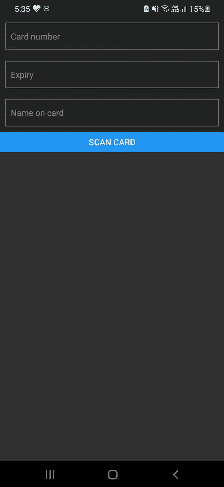

# 为无芯片卡构建一个 React 原生信用卡扫描仪

> 原文：<https://blog.logrocket.com/build-react-native-credit-card-scanner-chipless-cards/>

无线通信不断发展和改进，带来了更常见、更先进的功能，如用信用卡点击支付。如今，几乎在任何一家商店，你只要在他们的机器上刷一下信用卡就可以立即付款。

我们可以在手机中使用同样的技术，这样我们就不必手动将信用卡信息输入支付系统。NFC，或[近场通信](https://blog.logrocket.com/using-nfc-tags-react-native/)，允许我们以类似的方式读取卡的细节。在本教程中，我们将学习如何通过在支持 NFC 的智能手机上点击信用卡来收集卡的详细信息。

请注意，在撰写本文时，您无法在苹果 iPhone 设备上通过 NFC 收集卡的详细信息。苹果已经将这项功能限制在 Apple Pay 上，无论何时你打算将 NFC 用于支付以外的功能，都需要获得批准。因此，您应该在任何支持 NFC 的 Android 设备上尝试本教程。

要跟随本教程，您需要以下内容:

*   React Native 的工作知识
*   支持 NFC 的 Android 设备:本教程不能在 Android Studio 模拟器上运行，因为它们不能模拟 NFC，所以您需要一个物理设备
*   用于测试的具有 NFC 功能的信用卡:任何最近发行的信用卡都将内置该功能

一旦满足了这些要求，就可以开始构建应用程序了！

## 目录

NFC 是一种使用无线电波在两个设备之间建立联系的技术，以便它们可以相互通信和共享信息。

支持 NFC 的设备也可以使用 NFC 标签进行通信。NFC 标签没有电源，但是，当靠近支持 NFC 的设备时，NFC 标签会发射无线电波，允许设备与 NFC 标签通信。

NFC 标签有许多实际应用。例如，当开车到另一个城市时，NFC 读取器用于检测附在您车辆上的 NFC 标签，然后它会向您收取通行费，而您不必手动支付给工作人员。

信用卡也是如此。现在的信用卡读卡器都自带 NFC 读卡器，可以通过嵌入信用卡的 NFC 标签读取卡的详细信息。因此，您可以快速轻松地支付，而无需与读卡器进行任何身体接触。

## 创建一个 React 本机应用程序

要创建新的 React 本机应用程序，请打开终端，导航到一个安全目录，然后运行以下命令:

```
npx react-native init <project-name>

```

您可以用任何字母数字名称替换`<project-name>`，例如`nfccardreader123`。运行上面的命令后，React 本机安装工具将开始下载模板并创建您的 React 本机应用程序。根据您的系统和互联网连接速度，这可能需要一些时间。

应用程序安装完成后，导航到您的项目目录。通过进入 Android 目录并检查`build.gradle`文件来检查你的 Gradle 版本。Gradle 版本影响您将用于安装 [`react-native-nfc-card-reader`](https://www.npmjs.com/package/react-native-nfc-card-reader) 包的命令，这将帮助我们读取卡的详细信息。

如果您使用的是 Gradle ≤v7.0，请运行以下命令:

```
npm install react-native-nfc-card-reader

```

如果您使用的是 Gradle ≥7.0，请运行以下命令:

```
npm install "https://github.com/jackbayliss/react-native-nfc-card-reader.git#gradle7.0" --save

```

你可以在这个 GitHub 库的 [README.md 文件中找到更多关于不同 Gradle 版本的安装步骤的信息。此页面会定期更新，以防将来的 Gradle 版本需要任何新命令。](https://github.com/jackbayliss/react-native-nfc-card-reader)

## 在 Android 上使用 NFC

现在，您需要向 Android 添加提及，您将在该应用程序中使用 NFC。为此，导航到`android/app/src/main`，打开`AndroidManifest.xml`文件，并添加以下活动:

```
<activity android:name="com.jackbayliss.nfcreader.NfcCardReaderActivity"/>

```

您的`AndroidManifest.xml`文件应该看起来像下面的代码，但是，基本布局可能会因为 React 本机更新而改变:

```
<manifest xmlns:android="http://schemas.android.com/apk/res/android"
  package="com.e">
    <uses-permission android:name="android.permission.INTERNET" />
    <application
      android:name=".MainApplication"
      android:label="@string/app_name"
      android:icon="@mipmap/ic_launcher"
      android:roundIcon="@mipmap/ic_launcher_round"
      android:allowBackup="false"
      android:theme="@style/AppTheme">
      <activity
        android:name=".MainActivity"
        android:label="@string/app_name"
        android:configChanges="keyboard|keyboardHidden|orientation|screenLayout|screenSize|smallestScreenSize|uiMode"
        android:launchMode="singleTask"
        android:windowSoftInputMode="adjustResize"
        android:exported="true">
        <intent-filter>
            <action android:name="android.intent.action.MAIN" />
            <category android:name="android.intent.category.LAUNCHER" />
        </intent-filter>
      </activity>
      <activity android:name="com.jackbayliss.nfcreader.NfcCardReaderActivity"/>
    </application>
</manifest>

```

现在，使用以下命令运行应用程序:

```
npx react-native run-android

```

确保您的 Android 设备已接通电源，并打开了 USB 调试功能。您可以在开发人员设置中添加这个配置，您应该会看到基本的 React 本机样板文件。

## 设计布局

转到项目根目录中的`App.js`并创建以下布局:

```
import React, {useState} from 'react';
import {
  Button,
  SafeAreaView,
  ScrollView,
  StatusBar,
  TextInput,
  useColorScheme,
  View,
} from 'react-native';
import {Colors} from 'react-native/Libraries/NewAppScreen';
const App = () => {
  const [cardNumber, setCardNumber] = useState('');
  const [expiry, setExpiry] = useState('');
  const [name, setName] = useState('');
  const isDarkMode = useColorScheme() === 'dark';
  const backgroundStyle = {
    backgroundColor: isDarkMode ? Colors.darker : Colors.lighter,
  };
  const scanCard = async () => {};
  return (
    <SafeAreaView style={backgroundStyle}>
      <StatusBar
        barStyle={isDarkMode ? 'light-content' : 'dark-content'}
        backgroundColor={backgroundStyle.backgroundColor}
      />
      <ScrollView
        contentInsetAdjustmentBehavior="automatic"
        style={backgroundStyle}>
        <View
          style={{
            flex: 1,
          }}>
          <TextInput
            style={{
              margin: 10,
              padding: 10,
              borderWidth: 1,
              borderColor: 'gray',
            }}
            placeholder="Card number"
            value={cardNumber}
            onChangeText={t => setCardNumber(t)}
          />
          <TextInput
            style={{
              margin: 10,
              padding: 10,
              borderWidth: 1,
              borderColor: 'gray',
            }}
            placeholder="Expiry"
            value={expiry}
            onChangeText={t => setExpiry(t)}
          />
          <TextInput
            style={{
              margin: 10,
              padding: 10,
              borderWidth: 1,
              borderColor: 'gray',
            }}
            placeholder="Name on card"
            value={name}
            onChangeText={t => setName(t)}
          />
          <Button title="Scan Card" onPress={scanCard} />
        </View>
      </ScrollView>
    </SafeAreaView>
  );
};
export default App;

```

在上面的代码块中，我们已经创建了基本的布局并将输入映射到一个状态，这样我们就可以在以后扫描卡片时更改它们。我们还创建了一个名为`scanCard`的空函数，我们现在将对其进行处理。您生成的布局应该如下图所示:



现在，在这个文件的顶部导入`react-native-nfc-card-reader`:

```
import NfcCardReader from 'react-native-nfc-card-reader';

```

在`scanCard()`函数中，我们只需要调用一个函数来调用设备的 NFC 读卡器，这样我们就可以读取卡的详细信息:

```
NfcCardReader.startNfc(function(cardDetails){
     setCardNumber(cardDetails.cardNumber)
     setExpiry(cardDetails.expiryDate)
     setName(cardDetails.firstName + cardDetails.lastName)
 })

```

这样做应该映射状态并在文本框中显示数据。现在，您的`App.jsx`文件应该看起来像下面的代码:

```
import React, {useState} from 'react';
import {
  Button,
  SafeAreaView,
  ScrollView,
  StatusBar,
  TextInput,
  useColorScheme,
  View,
} from 'react-native';
import {Colors} from 'react-native/Libraries/NewAppScreen';
import NfcCardReader from 'react-native-nfc-card-reader';
const App = () => {
  const [cardNumber, setCardNumber] = useState('');
  const [expiry, setExpiry] = useState('');
  const [name, setName] = useState('');
  const isDarkMode = useColorScheme() === 'dark';
  const backgroundStyle = {
    backgroundColor: isDarkMode ? Colors.darker : Colors.lighter,
  };
  const scanCard = () => {
    NfcCardReader.startNfc(function (cardDetails) {
      setCardNumber(cardDetails.cardNumber);
      setExpiry(cardDetails.expiryDate);
      setName(cardDetails.firstName + cardDetails.lastName);
    });
  };
  return (
    <SafeAreaView style={backgroundStyle}>
      <StatusBar
        barStyle={isDarkMode ? 'light-content' : 'dark-content'}
        backgroundColor={backgroundStyle.backgroundColor}
      />
      <ScrollView
        contentInsetAdjustmentBehavior="automatic"
        style={backgroundStyle}>
        <View
          style={{
            flex: 1,
          }}>
          <TextInput
            style={{
              margin: 10,
              padding: 10,
              borderWidth: 1,
              borderColor: 'gray',
            }}
            placeholder="Card number"
            value={cardNumber}
            onChangeText={t => setCardNumber(t)}
          />
          <TextInput
            style={{
              margin: 10,
              padding: 10,
              borderWidth: 1,
              borderColor: 'gray',
            }}
            placeholder="Expiry"
            value={expiry}
            onChangeText={t => setExpiry(t)}
          />
          <TextInput
            style={{
              margin: 10,
              padding: 10,
              borderWidth: 1,
              borderColor: 'gray',
            }}
            placeholder="Name on card"
            value={name}
            onChangeText={t => setName(t)}
          />
          <Button title="Scan Card" onPress={scanCard} />
        </View>
      </ScrollView>
    </SafeAreaView>
  );
};
export default App;

```

现在，我们可以开始测试了！打开手机上的 app，让 React 原生捆绑 JavaScript，然后点击**扫卡**。您可能不会收到任何提示，但当您将嵌入 NFC 的信用卡带到附近时，您会看到您的卡详细信息自动输入到字段中！

## 结论

NFC 带来的机会是无限的。在本教程中，我们学习了如何使用 NFC 在我们的 Android 设备中实现点击支付功能。我们探讨了 NFC 标签的工作原理，然后设置了 React Native 项目，以便在我们的 Android 设备中使用 NFC。

在本教程中，我们没有看到如何使用卡的详细信息进行支付，但是您可以使用 [any provider，例如 Stripe](https://blog.logrocket.com/react-stripe-payment-system-tutorial/) 来实现这一目的。我希望你喜欢这个教程，如果你有任何问题，一定要留下评论。

## [LogRocket](https://lp.logrocket.com/blg/react-native-signup) :即时重现 React 原生应用中的问题。

[](https://lp.logrocket.com/blg/react-native-signup)

[LogRocket](https://lp.logrocket.com/blg/react-native-signup) 是一款 React 原生监控解决方案，可帮助您即时重现问题、确定 bug 的优先级并了解 React 原生应用的性能。

LogRocket 还可以向你展示用户是如何与你的应用程序互动的，从而帮助你提高转化率和产品使用率。LogRocket 的产品分析功能揭示了用户不完成特定流程或不采用新功能的原因。

开始主动监控您的 React 原生应用— [免费试用 LogRocket】。](https://lp.logrocket.com/blg/react-native-signup)