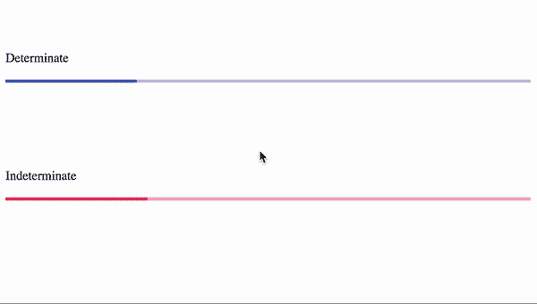
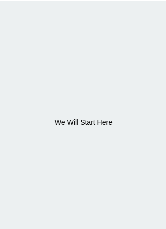
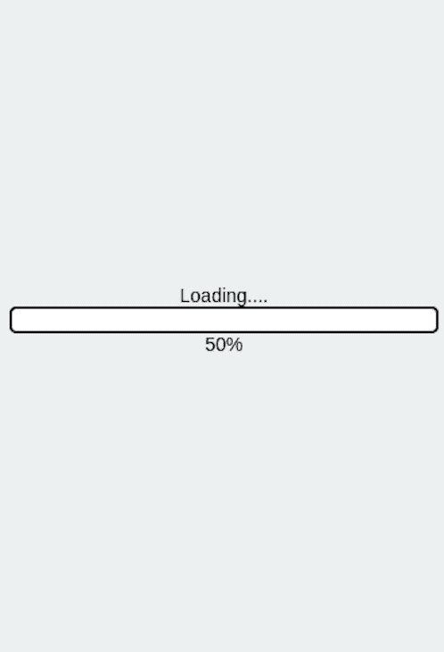
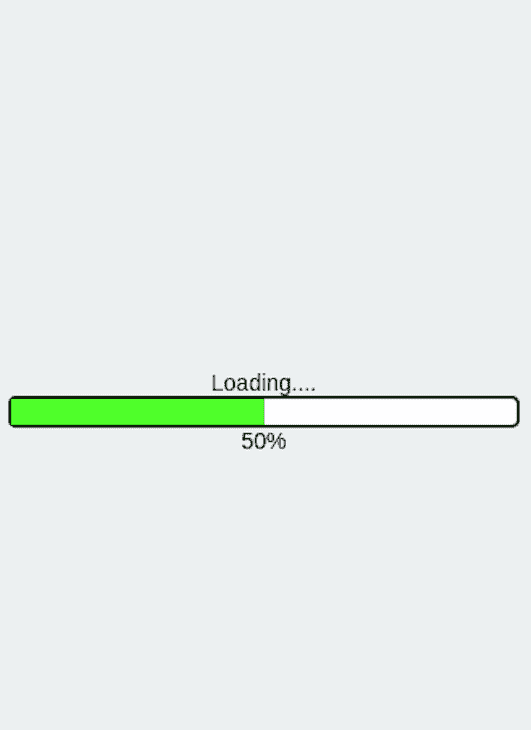
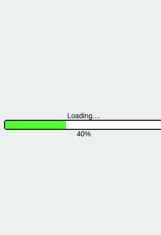

# 构建一个 React 本地进度条

> 原文：<https://blog.logrocket.com/build-react-native-progress-bar/>

***编者按**:这篇文章最后一次更新是在 2021 年 8 月 30 日，以改进代码、图像和任何过时的信息。但是，它可能仍然包含过时的信息。*

进度条有时也称为进度指示器，是任务进度的可视化表示。这可能包括下载、文件传输或上传、安装、程序执行或配置文件设置中的完整步骤等操作。

带有集成进度条的 UX 的软件让用户知道是否有进程正在运行、预期的运行时间以及部分工作何时完成。

进度条可以是确定的，也可以是不确定的。确定的进度条显示已完成和未完成的数据，而不确定的进度条用于无法立即确定指标的情况。



在本文中，我们将学习如何为 React Native 构建一个确定的进度条。

虽然已经有一些针对进度条的 React 原生包，如`[react-native-progress-bar-animated](https://www.npmjs.com/package/react-native-progress-bar-animated)`和`[react-native-progress](https://www.npmjs.com/package/react-native-progress)`，但最终，它归结为个人偏好，并创建一些您可以调整以满足您需求的东西。

React Native 还有一个进度条组件，`ProgressBarAndroid`，只有 Android 才有。如果你想让你的 iOS 应用有一个进度条，你必须使用一个现有的 npm 包或者自己构建一个。

## 开始构建进度条

本文假设你[熟悉 React Native](https://blog.logrocket.com/whats-new-in-react-native-0-64/) 或者至少熟悉 React，以及 [React Hooks](https://blog.logrocket.com/react-hooks-the-good-the-bad-and-the-ugly/) 。

首先，使用 Expo CLI 或 React Native CLI 引导您的项目。出于本文的目的，我们将使用 [Snack](https://snack.expo.io/) ，它允许我们在 web 浏览器中直接尝试 React Native。

我们将在`App.js`文件中进行修改。让我们清除我们已经拥有的，并将下面的代码添加到`App.js`:

```
import React, { useEffect, useState, useRef } from 'react';
import { Text, View, StyleSheet } from 'react-native';
import Constants from 'expo-constants';

const App = () => {
 return (
   <View style={styles.container}>
     <Text>
       We Will Start Here
     </Text>
   </View>
 );
}

export default App;

const styles = StyleSheet.create({
 container: {
   flex: 1,
   justifyContent: 'center',
   alignItems: 'center',
   paddingTop: Constants.statusBarHeight,
   backgroundColor: '#ecf0f1',
   padding: 8,
 },
});
```

这将呈现带有一些文本的`View`组件。设备模拟器应该会自动更新。



## 构建进度条

在我们开始构建进度条之前，我们必须确定进度条的外观以及我们需要显示的内容。一个简单的进度条通常有描述性的文本，比如**加载**，实际的进度条代表操作的进度。

我们还必须添加一些文本来显示操作完成的百分比。让我们创建进度条的框架。在我们的`App.js`中，将我们的`Text`组件中的文本更改为`Loading.....`:

```
<Text>
  Loading.....
</Text>
```

### 设置 React 本机进度条的样式

我们希望`Loading.....`文本在进度条之上，完成百分比在进度条之下。因此，更改容器样式来对齐列中的子组件。

让我们将`flexDirection: 'Column'`属性添加到容器样式中。在此之下，向名为`progressBar`的新`styles`对象添加以下样式:

```
<View style={styles.container}>
  <Text>
    Loading.....
  </Text>
  <View style={styles.progressBar}></View>
</View>

const styles = StyleSheet.create({
  container: {
   flex: 1,
   flexDirection: "column", //column direction
   justifyContent: 'center',
   alignItems: 'center',
   paddingTop: Constants.statusBarHeight,
   backgroundColor: '#ecf0f1',
   padding: 8,
 },
  progressBar: {
   height: 20,
   width: '100%',
   backgroundColor: 'white',
   borderColor: '#000',
   borderWidth: 2,
   borderRadius: 5
 }
});
```

要显示任务执行的当前进度，请在进度条下方添加一个带有完成百分比的文本字段。我们现在可以将它硬编码为 50%:

```
<View style={styles.container}>
  <Text>
    Loading.....
  </Text>
  <View style={styles.progressBar}></View>
  <Text>50%</Text>
</View>
```

到目前为止，我们的进度条应该是这样的:



我们现在可以开始制作真正的进度条了。通过在`View`进度条容器中添加一个孩子`View`，孩子`View`显示进度的百分比。因为我们必须在水平面上对齐子节点`View`，所以进度条容器需要样式属性`flexDirection:"Row"`。

将该属性添加到`progressBar`样式中。最后，你的`progressBar`风格应该是这样的:

```
progressBar: {
   height: 20,
   flexDirection: "row",
   width: '100%',
   backgroundColor: 'white',
   borderColor: '#000',
   borderWidth: 2,
   borderRadius: 5
 }

```

我们的目标是拥有一个使用`StyleSheet.absoluteFill`对象的动画视图。这将创建一个覆盖图，位置`absolute`为零。

此外，我们必须给`View`一个填充颜色。我们将使用绿色阴影，并添加 50%的宽度:

```
<View style={styles.progressBar}>
  <Animated.View style={[StyleSheet.absoluteFill], {backgroundColor: "#8BED4F", width: “50%”}}/>
</View>
```

这里，我们使用了`Animated.View`组件，这意味着这个元素可以执行动画。

我们的应用程序现在看起来像这样:



### 添加进度计数器

为了让进度条显示变化的完成情况，我们必须添加一个计数器。最简单的方法是使用`setInterval`:

```
const countInterval = useRef(null);
  const [count, setCount] = useState(0);

  useEffect(() => {
    countInterval.current = setInterval(() => setCount((old) => old + 5), 1000);
    return () => {
      clearInterval(countInterval); //when user exits, clear this interval.
    };
  }, []);

```

在这段代码中，我们告诉 React 每秒钟将`count`钩子增加 5。一旦组件挂载到 DOM，就会发生这种情况。

## 如何在 React Native 中制作进度条动画？

为了开始动画我们的进度条，我们必须使用 useRef 钩子通过[创建一个动画值。这将有助于动画显示我们的装载机价值:](https://blog.logrocket.com/usestate-vs-useref/)

```
const loaderValue = useRef(new Animated.Value(0)).current;
const load = (count) => {
    Animated.timing(loaderValue, {
      toValue: count, //final value
      duration: 500, //update value in 500 milliseconds
      useNativeDriver: true,
    }).start();
};

```

在这段代码中，我们使用动画 API 在半秒钟内将`loaderValue`的值更改为`count`。`Animated.timing()`方法获取动画引用的当前值和一个配置对象。然后通过调用`start()`运行动画。此外，我们还使用了`useNativeDriver`属性，它提供了更平滑的用户界面。
接下来，添加以下代码片段:

```
useEffect(() => {
    load(count)
    if (count >= 100) {
      setCount(100);
      clearInterval(countInterval);
    }
  }, [count]);

```

从这段代码中可以得出一些推论:

*   当`count`的值改变时，调用`load`方法来运行动画
*   我们检查了`count`挂钩是否超过 100。如果这个条件为真，React 将删除这个间隔，并停止递增状态变量

接下来，通过从动画创建插值来设置进度条的宽度:

```
const width = animation.current.interpolate({
  inputRange: [0, 100],
  outputRange: ["0%", "100%"],
  extrapolate: "clamp"
})
```

属性表示我们从进度中获得的值的范围。`outputRange`定义了输出值的范围。

通常，插值使用线性插值将输入范围映射到输出范围。默认情况下，它会将曲线外推至给定范围之外。为了确保输出值不会超出所提供的范围，我们将属性 extrapolate `"clamp"`传递给配置对象。

现在，将插值后的宽度传递给动画进度条:

```
<View style={styles.progressBar}>
  <Animated.View style={[StyleSheet.absoluteFill], {backgroundColor: "#8BED4F", width }}/>
</View>
```

我们之前硬编码的进度百分比值现在必须与更新进度条相匹配。因为我们的值范围是从 0 到 100，所以让我们使用模板字符串来构造文本:

```
<View style={styles.container}>
  ...
  <View style={styles.progressBar}>
    ...
  </View>
  <Text>{`${progress}%`}</Text>
</View>
```

这就是我们拥有的。我们的进度条完成了！

[在这里找到最终产品。](https://staging.snack.expo.dev/@hussainarifkl/supportive-soylent)

## 结论

这绝不是一个完美的进度条，还有很多可以改进的地方，尤其是在动画方面。为了进一步挑战自己，你可以试着上传一个文件并显示进度。

如果您有任何问题、意见或反馈，请告诉我。你可以在推特上找到我。

## [LogRocket](https://lp.logrocket.com/blg/react-native-signup) :即时重现 React 原生应用中的问题。

[](https://lp.logrocket.com/blg/react-native-signup)

[LogRocket](https://lp.logrocket.com/blg/react-native-signup) 是一款 React 原生监控解决方案，可帮助您即时重现问题、确定 bug 的优先级并了解 React 原生应用的性能。

LogRocket 还可以向你展示用户是如何与你的应用程序互动的，从而帮助你提高转化率和产品使用率。LogRocket 的产品分析功能揭示了用户不完成特定流程或不采用新功能的原因。

开始主动监控您的 React 原生应用— [免费试用 LogRocket】。](https://lp.logrocket.com/blg/react-native-signup)