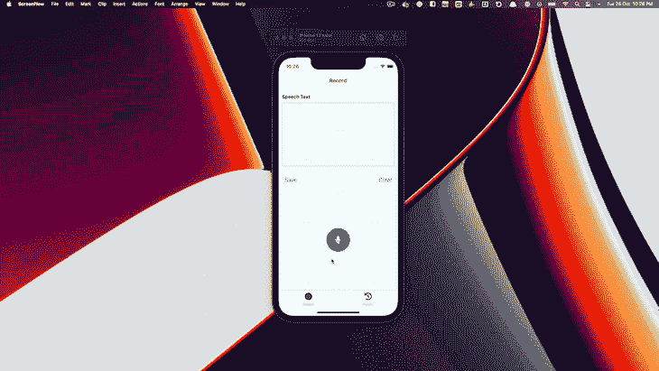
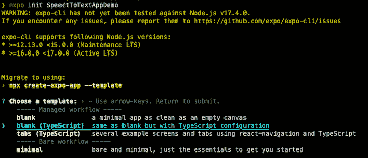
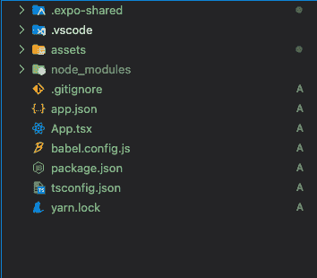
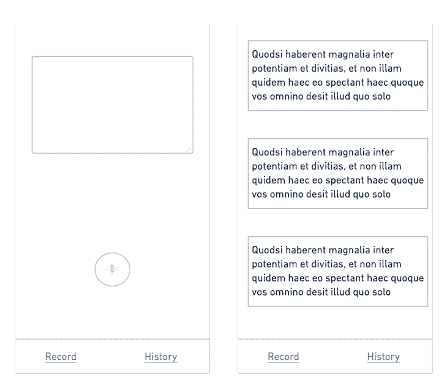
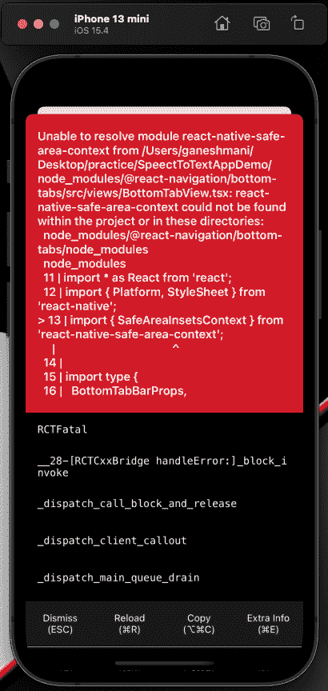
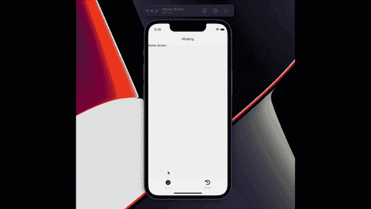
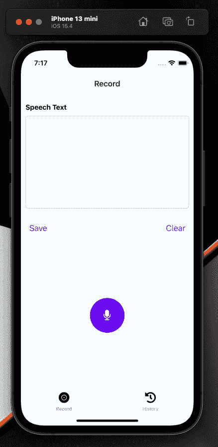

# 构建 React 原生语音转文本听写应用程序

> 原文：<https://blog.logrocket.com/build-react-native-speech-to-text-dictation-app/>

React 本机语音到文本功能是当今开发人员的常见用例。无论是一般用途还是可访问性，您的项目中对语音转文本的需求都很可能在某个时候出现，并且是我们作为开发人员应该准备在我们的应用程序中实现的功能。

本文将向您展示如何使用 [React Native](https://blog.logrocket.com/tag/react-native/) 构建一个语音到文本的听写应用程序。

## 最终演示



## 先决条件

要在 iOS 上运行你的应用，你需要 macOS 和 [Xcode](https://blog.logrocket.com/xcode-for-react-native-developers-tutorial-and-best-practices/) 来编译和运行模拟器。

对于 Android，您可以使用 Android Studio 中的 Android Emulator 或简单地连接一个 Android 设备来运行它。此外，我们还将使用 VS 代码来构建应用程序。

## 安装和设置

当使用 React Native 构建移动应用程序时，有两种典型的方法。

一种是使用 Expo——一套围绕 React Native 构建的工具，旨在提高开发效率。另一种方法是使用 React Native CLI，这基本上就像从零开始，没有任何一组支持 React Native 开发的工具。

在本教程中，我们将使用 Expo，因此开发过程更易于管理。

让我们开始吧:

```
npm install -g expo-cli

```

一旦全局安装了 Expo CLI，就可以使用以下命令初始化项目:

```
expo init <Name of Project>

```



这里，我们将选择一个带有 TypeScript 配置的空白项目。如果您愿意，还可以创建一个带有一些预定义功能的 JavaScript 版本。

一旦它搭建了项目，你就可以在 Android 或 iOS 上运行应用程序了。导航到目录并运行以下 npm 命令之一:

```
- cd SpeechToTextAppDemo
- npm run android
- npm run ios
- npm run web

```



正如您在文件夹结构中看到的，`App.tsx`是应用程序的入口点。`app.json`是一个 Expo 配置，配置项目如何加载和生成 Android 和 iOS 的重建。

## 构建用户界面



上面显示的是一个简单的线框，我们将使用它来构建应用程序的 UI。

我们把它做得很简单，因为我们想把重点放在功能上——一旦我们构建了应用程序，您可以根据自己的喜好定制它，并在它的基础上进行实践。

让我们从在应用程序中构建导航开始。

要在 React 本地应用中实现导航，我们需要安装以下软件包:

```
npm install @react-navigation/bottom-tabs @react-navigation/native @expo/vector-icons

```

由于我们将在底层实现导航，我们需要安装`@react-navigation/bottom-tabs`和`@react-navigation/native`核心包。

此外，为了增加对图标和文本的支持，我们需要`@expo/vector-icons`包。

导航有三个组件:

1.  `NavigationContainer`
2.  `Tab.Navigator`
3.  `Tab.Screen`

把所有东西都包在里面。`Tab.Navigator`帮助在不同的组件之间导航，而`Tab.Screen`呈现组件本身。

现在，我们将更改`App.tsx`，包括导航功能:

```
import { StatusBar } from "expo-status-bar";
import { FontAwesome5 } from "@expo/vector-icons";
import { StyleSheet, Text, View } from "react-native";
import { createBottomTabNavigator } from "@react-navigation/bottom-tabs";
import { NavigationContainer } from "@react-navigation/native";
import Home from "./components/Home";
import Notes from "./components/Notes";
const Tab = createBottomTabNavigator();
export default function App() {
  return (
    <NavigationContainer>
      <Tab.Navigator
        screenOptions={({ route }) => ({
          tabBarIcon: () => {
            let iconName = "record";
            if (route.name === "Record") {
              iconName = "record-vinyl";
            } else if (route.name === "History") {
              iconName = "history";
            }
            return <FontAwesome5 name={iconName} size={24} color="black" />;
          },
        })}
      >
        <Tab.Screen name="Record" component={Home} />
        <Tab.Screen name="History" component={Notes} />
      </Tab.Navigator>
    </NavigationContainer>
  );
}
const styles = StyleSheet.create({
  container: {
    flex: 1,
    backgroundColor: "#fff",
    alignItems: "center",
    justifyContent: "center",
  },
});

```

通过添加以下代码创建`Home`和`Notes`组件:

### `Home/index.tsx`

```
import { useState, useEffect } from "react";
import {
  View,
  Text,
  TextInput,
  StyleSheet,
  Button,
  Pressable,
} from "react-native";
export default function Home() {
  return (
    <View style={styles.container}>
      <Text>Home Screen</Text>
    </View>
  );
}
const styles = StyleSheet.create({
  container: {},
});

```

### `Notes/index.tsx`

```
import { useState, useEffect } from "react";
import {
  View,
  Text,
  TextInput,
  StyleSheet,
  Button,
  Pressable,
} from "react-native";
export default function Notes() {
  return (
    <View style={styles.container}>
      <Text>Notes Screen</Text>
    </View>
  );
}
const styles = StyleSheet.create({
  container: {},
});

```

现在，我们在应用程序的底部有一个导航栏。让我们运行应用程序，看看它是如何工作的。要运行应用程序，请执行以下一项操作:

1.  使用命令`expo start`，它将在 iOS 和 Android 模拟器中构建和运行应用程序
2.  使用命令`npx expo run:<ios| Android>`，它将为 iOS 和 Android 构建项目，在项目目录中创建本机代码，并运行它

这里，我们将遵循第二种方法，因为我们有一个`voice`库需要与定制的本地代码进行交互。当您没有这样的需求时，使用`expo start`命令会更加容易和简单，因为我们不需要自己管理本地代码构建。

当您使用`npx expo run:ios`命令运行应用程序时，您会看到以下错误:



这个错误是因为`Navigation`使用了一些我们在设置`Navigation`时跳过安装的核心实用程序。因此，让我们安装它们并重新运行应用程序:

```
npm install react-native-safe-area-context react-native-gesture-handler react-native-screens react-native-web

```



现在，我们的应用程序中有了屏幕导航。因此，让我们在应用程序中集成一个用于语音到文本功能的`voice`库。

## 集成语音识别库

首先，在应用程序中安装`react-native-voice`库，就像这样:

```
npm i @react-native-voice/voice --save

```

安装 npm 包后，在`app.json`的插件数组中添加 config 插件:

```
{
  "expo": {
    "plugins": ["@react-native-voice/voice"]
  }
}

```

然后，在`app.json`配置中添加权限:

```
"ios": {
      "supportsTablet": true,
      "bundleIdentifier": "com.anonymous.SpeectToTextApp",
 "infoPlist": {
        "NSSpeechRecognitionUsageDescription": "This app uses speech recognition to convert your speech to text.",
        "NSCameraUsageDescription": "This app uses the camera to let user put a photo in his profile page."
      }
    },
    "android": {
      "adaptiveIcon": {
        "foregroundImage": "./assets/adaptive-icon.png",
        "backgroundColor": "#FFFFFF"
      },
      "permissions": ["android.permission.RECORD_AUDIO"],
      "package": "com.anonymous.SpeectToTextApp"
    },

```

让我们在`Home`组件中构建一个与`react-native-voice`库集成的 UI。

在我们开始之前，UI 需要一些动画来实现记录/停止功能。所以，让我们安装`react-native-reanimated`和`@motify/components`来实现它:

```
npm i @motify/components react-native-reanimated

```

在巴别塔配置中添加`react-native-reanimated`插件:

```
module.exports = function (api) {
  api.cache(true);
  return {
    presets: ["babel-preset-expo"],
    plugins: ["react-native-reanimated/plugin"],
  };
};

```

安装`react-native-reanimated`后，在`Record/index.tsx`中实现语音识别功能:

```
import React, { Component } from "react";
import { FontAwesome } from "@expo/vector-icons";
import { MotiView } from "@motify/components";
import {
  StyleSheet,
  Text,
  View,
  Image,
  TouchableHighlight,
} from "react-native";
import Voice, {
  SpeechRecognizedEvent,
  SpeechResultsEvent,
  SpeechErrorEvent,
} from "@react-native-voice/voice";
import { Easing } from "react-native-reanimated";
type Props = {
  onSpeechStart: () => void;
  onSpeechEnd: (result: any[]) => void;
};
type State = {
  recognized: string;
  pitch: string;
  error: string;
  end: string;
  started: boolean;
  results: string[];
  partialResults: string[];
};
class VoiceTest extends Component<Props, State> {
  state = {
    recognized: "",
    pitch: "",
    error: "",
    end: "",
    started: false,
    results: [],
    partialResults: [],
  };
  constructor(props: Props) {
    super(props);
    Voice.onSpeechStart = this.onSpeechStart;
    Voice.onSpeechRecognized = this.onSpeechRecognized;
    Voice.onSpeechEnd = this.onSpeechEnd;
    Voice.onSpeechError = this.onSpeechError;
    Voice.onSpeechResults = this.onSpeechResults;
    Voice.onSpeechPartialResults = this.onSpeechPartialResults;
    Voice.onSpeechVolumeChanged = this.onSpeechVolumeChanged;
  }
  componentWillUnmount() {
    Voice.destroy().then(Voice.removeAllListeners);
  }
  onSpeechStart = (e: any) => {
    console.log("onSpeechStart: ", e);
    this.setState({
      started: true,
    });
  };
  onSpeechRecognized = (e: SpeechRecognizedEvent) => {
    console.log("onSpeechRecognized: ", e);
    this.setState({
      recognized: "√",
    });
  };
  onSpeechEnd = (e: any) => {
    console.log("onSpeechEnd: ", e);
    this.setState({
      end: "√",
      started: false,
    });
    this.props.onSpeechEnd(this.state.results);
  };
  onSpeechError = (e: SpeechErrorEvent) => {
    console.log("onSpeechError: ", e);
    this.setState({
      error: JSON.stringify(e.error),
    });
  };
  onSpeechResults = (e: SpeechResultsEvent) => {
    console.log("onSpeechResults: ", e);
    this.setState({
      results: e.value!,
    });
  };
  onSpeechPartialResults = (e: SpeechResultsEvent) => {
    console.log("onSpeechPartialResults: ", e);
    this.setState({
      partialResults: e.value!,
    });
  };
  onSpeechVolumeChanged = (e: any) => {
    console.log("onSpeechVolumeChanged: ", e);
    this.setState({
      pitch: e.value,
    });
  };
  _startRecognizing = async () => {
    this.setState({
      recognized: "",
      pitch: "",
      error: "",
      started: false,
      results: [],
      partialResults: [],
      end: "",
    });
    try {
      await Voice.start("en-US");
      this.props.onSpeechStart();
    } catch (e) {
      console.error(e);
    }
  };
  _stopRecognizing = async () => {
    try {
      await Voice.stop();
    } catch (e) {
      console.error(e);
    }
  };
  _cancelRecognizing = async () => {
    try {
      await Voice.cancel();
    } catch (e) {
      console.error(e);
    }
  };
  _destroyRecognizer = async () => {
    try {
      await Voice.destroy();
    } catch (e) {
      console.error(e);
    }
    this.setState({
      recognized: "",
      pitch: "",
      error: "",
      started: false,
      results: [],
      partialResults: [],
      end: "",
    });
  };
  render() {
    return (
      <View style={styles.container}>
        {this.state.started ? (
          <TouchableHighlight onPress={this._stopRecognizing}>
            <View
              style={{
                width: 75,
                height: 75,
                borderRadius: 75,
                backgroundColor: "#6E01EF",
                alignItems: "center",
                justifyContent: "center",
              }}
            >
              {[...Array(3).keys()].map((index) => {
                return (
                  <MotiView
                    from={{ opacity: 1, scale: 1 }}
                    animate={{ opacity: 0, scale: 4 }}
                    transition={{
                      type: "timing",
                      duration: 2000,
                      easing: Easing.out(Easing.ease),
                      delay: index * 200,
                      repeatReverse: false,
                      loop: true,
                    }}
                    key={index}
                    style={[
                      StyleSheet.absoluteFillObject,
                      { backgroundColor: "#6E01EF", borderRadius: 75 },
                    ]}
                  />
                );
              })}
              <FontAwesome name="microphone-slash" size={24} color="#fff" />
            </View>
          </TouchableHighlight>
        ) : (
          <TouchableHighlight onLongPress={this._startRecognizing}>
            <View
              style={{
                width: 75,
                height: 75,
                borderRadius: 75,
                backgroundColor: "#6E01EF",
                alignItems: "center",
                justifyContent: "center",
              }}
            >
              <FontAwesome name="microphone" size={24} color="#fff" />
            </View>
          </TouchableHighlight>
        )}
      </View>
    );
  }
}
const styles = StyleSheet.create({
  button: {
    width: 50,
    height: 50,
  },
  container: {},
  welcome: {
    fontSize: 20,
    textAlign: "center",
    margin: 10,
  },
  action: {
    textAlign: "center",
    color: "#0000FF",
    marginVertical: 5,
    fontWeight: "bold",
  },
  instructions: {
    textAlign: "center",
    color: "#333333",
    marginBottom: 5,
  },
  stat: {
    textAlign: "center",
    color: "#B0171F",
    marginBottom: 1,
  },
});
export default Record;

```

`@react-native-voice`提供了一个`Voice`类，具有开始和停止语音记录和识别的功能。一些重要的方法是:

1.  `Voice.start("en-US");`
2.  `Voice.stop();`
3.  `Voice.cancel();`
4.  `Voice.destroy();`

这里，我们有两个主要函数:`_startRecognizing`和`_stopRecognizing`——它们处理语音识别功能的启动和停止。

另一个需要注意的重要函数是`onSpeechEnd`，它通过 props 将语音结果作为文本传递给函数。

```
onSpeechEnd = (e: any) => {
    console.log("onSpeechEnd: ", e);
    this.setState({
      end: "√",
      started: false,
    });
    this.props.onSpeechEnd(this.state.results);
  };

```

在这之后，我们将语音组件`Record`导入到`Home/index.tsx`中:

```
import { useState, useEffect } from "react";
import {
  View,
  Text,
  TextInput,
  StyleSheet,
  Button,
  Pressable,
} from "react-native";
import Record from "../Record";
export default function Home() {
  const [speechText, setSpeechText] = useState("");
  return (
    <View style={styles.container}>
      <View style={styles.inputContainer}>
        <Text style={styles.label}>Speech Text</Text>
        <TextInput
          multiline
          style={styles.textInput}
          numberOfLines={6}
          value={speechText}
          maxLength={500}
          editable={true}
        />
        <View
          style={{
            alignItems: "flex-end",
            flex: 1,
            flexDirection: "row",
            justifyContent: "space-between",
          }}
        >
          <Button
            title="Save"
            color={"#007AFF"}
            onPress={async () => {
              console.log("save");
            }}
          />
          <Button
            title="Clear"
            color={"#007AFF"}
            onPress={() => {
              setSpeechText("");
            }}
          />
        </View>
      </View>
      <View style={styles.voiceContainer}>
        <Record
          onSpeechEnd={(value) => {
            setSpeechText(value[0]);
          }}
          onSpeechStart={() => {
            setSpeechText("");
          }}
        />
      </View>
    </View>
  );
}
const styles = StyleSheet.create({
  container: {
    flex: 1,
    flexDirection: "column",
    justifyContent: "center",
    alignItems: "center",
    width: "100%",
    backgroundColor: "#F5FCFF",
  },
  label: {
    fontWeight: "bold",
    fontSize: 15,
    paddingTop: 10,
    paddingBottom: 10,
  },
  inputContainer: {
    height: "50%",
    width: "100%",
    flex: 1,
    padding: 10,
    justifyContent: "center",
  },
  textInput: {
    padding: 10,
    borderColor: "#d1d5db",
    borderWidth: 1,
    height: 200,
    borderRadius: 5,
  },
  saveButton: {
    right: 0,
  },
  voiceContainer: {
    height: "50%",
    width: "100%",
    alignItems: "center",
    justifyContent: "space-around",
  },
});

```



现在，我们可以在`Home/index.tsx`中访问`speechText`中的结果。让我们实现保存功能，将它存储在数据库中。我们将通过使用以下命令，使用一个假的 JSON 服务器进行 API 模拟:

```
json-service -watch db.json

```

创建`db.json`并为其添加结构:

```
{
  "notes": []
}

```

我们将在应用程序中使用`react-query`进行数据获取和 API 调用。

```
npm install react-query axios

```

为了创建和获取注释，我们可以创建定制的钩子来处理查询和变异:

### `hooks/useCreateNote.ts`

```
import { QueryClient, useMutation } from "react-query";
import axios from "axios";
const createNote = async (note: string) => {
  const { data } = await axios.post("http://localhost:3000/notes", {
    note,
  });
  return data;
};
const useCreateNote = () =>
  useMutation(createNote, {
    onSuccess: (response) => {
    },
  });
export default useCreateNote;

```

### `hooks/useNotes.ts`

```
import { useQuery } from "react-query";
import axios from "axios";
const fetchNotes = async () => {
  const { data } = await axios.get("http://localhost:3000/notes");
  return data;
};
const useNotes = () => useQuery("notes", fetchNotes);
export default useNotes;

```

在`Home/index.tsx`内增加`useCreateNote`挂钩。

```
import { useState, useEffect } from "react";
import {
  View,
  Text,
  TextInput,
  StyleSheet,
  Button,
  Pressable,
} from "react-native";
import { useMutation, useQueryClient } from "react-query";
import useCreateNote from "../../hooks/useCreateNote";
import Record from "../Record";
export default function Home() {
  const [speechText, setSpeechText] = useState("");
  const { mutate, isError, isLoading, isSuccess } = useCreateNote();
  const queryClient = useQueryClient();
  useEffect(() => {
    if (isSuccess) {
      setSpeechText("");
      queryClient.invalidateQueries(["notes"]);
    }
  }, [isSuccess]);
  return (
    <View style={styles.container}>
      <View style={styles.inputContainer}>
        <Text style={styles.label}>Speech Text</Text>
        <TextInput
          multiline
          style={styles.textInput}
          numberOfLines={6}
          value={speechText}
          maxLength={500}
          editable={true}
        />
        <View
          style={{
            alignItems: "flex-end",
            flex: 1,
            flexDirection: "row",
            justifyContent: "space-between",
          }}
        >
          <Button
            title="Save"
            color={"#007AFF"}
            onPress={async () => {
              console.log("save");
              try {
                await mutate(speechText);
              } catch (e) {
                console.log(e);
              }
            }}
          />
          <Button
            title="Clear"
            color={"#007AFF"}
            onPress={() => {
              setSpeechText("");
            }}
          />
        </View>
      </View>
      <View style={styles.voiceContainer}>
        <Record
          onSpeechEnd={(value) => {
            setSpeechText(value[0]);
          }}
          onSpeechStart={() => {
            setSpeechText("");
          }}
        />
      </View>
    </View>
  );
}
const styles = StyleSheet.create({
  container: {
    flex: 1,
    flexDirection: "column",
    justifyContent: "center",
    alignItems: "center",
    width: "100%",
    backgroundColor: "#F5FCFF",
  },
  label: {
    fontWeight: "bold",
    fontSize: 15,
    paddingTop: 10,
    paddingBottom: 10,
  },
  inputContainer: {
    height: "50%",
    width: "100%",
    flex: 1,
    padding: 10,
    justifyContent: "center",
  },
  textInput: {
    padding: 10,
    borderColor: "#d1d5db",
    borderWidth: 1,
    height: 200,
    borderRadius: 5,
  },
  saveButton: {
    right: 0,
  },
  voiceContainer: {
    height: "50%",
    width: "100%",
    alignItems: "center",
    justifyContent: "space-around",
  },
});

```

在`Note/index.tsx`中添加以下代码:

```
import React from "react";
import {
  View,
  StyleSheet,
  FlatList,
  TouchableOpacity,
  Text,
} from "react-native";
import useNotes from "../../hooks/useNotes";
export const Posts = ({}) => {
  const { data, isLoading, isSuccess } = useNotes();
  console.log(data);
  return (
    <View style={styles.container}>
      {isLoading && (
        <React.Fragment>
          <Text>Loading...</Text>
        </React.Fragment>
      )}
      {isSuccess && (
        <React.Fragment>
          <Text style={styles.header}>All Notes</Text>
          <FlatList
            data={data}
            style={styles.wrapper}
            keyExtractor={(item) => `${item.id}`}
            renderItem={({ item }) => (
              <TouchableOpacity onPress={() => {}} style={styles.post}>
                <View style={styles.item}>
                  <Text style={styles.postTitle}>{item.note}</Text>
                </View>
              </TouchableOpacity>
            )}
          />
        </React.Fragment>
      )}
    </View>
  );
};
const styles = StyleSheet.create({
  container: {
    flex: 1,
    // backgroundColor: colors.white,
    padding: 10,
  },
  wrapper: {
    flex: 1,
    paddingVertical: 30,
  },
  item: {
    paddingVertical: 10,
    paddingHorizontal: 20,
  },
  header: {
    textAlign: "center",
    textTransform: "capitalize",
    fontWeight: "bold",
    fontSize: 30,
    // color: colors.primary,
    paddingVertical: 10,
  },
  post: {
    // backgroundColor: colors.primary,
    padding: 15,
    borderRadius: 10,
    marginBottom: 20,
  },
  postTitle: {
    color: "#000",
    textTransform: "capitalize",
  },
});
export default Posts;

```

这里，我们使用`useNotes`钩子获取数据，并在`FlatList`中呈现它们。

## 结论

在本文中，我们介绍了如何使用 React Native 构建语音到文本的听写应用程序。

当您构建需要硬件访问或核心库访问的移动应用程序时，了解如何使用 React Native 这样的移动框架访问这些资源非常重要。

我们在本文中详细研究了这些，我希望您现在对如何在您的项目中实现它们有了更好的理解。你可以在这里找到完整的源代码[。](https://github.com/ganeshmani/SpeechToTextApp)

## [LogRocket](https://lp.logrocket.com/blg/react-native-signup) :即时重现 React 原生应用中的问题。

[](https://lp.logrocket.com/blg/react-native-signup)

[LogRocket](https://lp.logrocket.com/blg/react-native-signup) 是一款 React 原生监控解决方案，可帮助您即时重现问题、确定 bug 的优先级并了解 React 原生应用的性能。

LogRocket 还可以向你展示用户是如何与你的应用程序互动的，从而帮助你提高转化率和产品使用率。LogRocket 的产品分析功能揭示了用户不完成特定流程或不采用新功能的原因。

开始主动监控您的 React 原生应用— [免费试用 LogRocket】。](https://lp.logrocket.com/blg/react-native-signup)