# 用 Aspect 构建 React 可重用组件

> 原文：<https://blog.logrocket.com/build-react-reusable-components-faster-aspect/>

方面是一个新的开发工具，允许你在浏览器中创建虚拟的 React 组件。它消除了为应用程序创建和设置 React 项目的压力。

Aspect 提供了一个带有 HTML 拖放功能的仪表板，大大简化了创建 React 组件的过程，从而节省了开发时间。Aspect 还将您的设计与您的代码库同步，并提供了一个将它们导出为 zip 文件的选项。

在[未来版本](https://twitter.com/aspectdotapp)中承诺了许多额外的、很酷的功能，比如对 MaterialUI 和 Tailwind CSS 等库的支持，以及 Sketch 和 AdobeXD。

在本教程中，我们将演示如何使用方面来更快地构建可重用组件。我们将构建如下所示的简单产品页面:

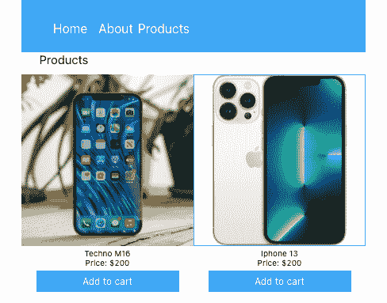

*向前跳转:*

## 入门指南

要开始使用 Aspect，[在这里注册](https://aspect.app/signup)。

然后，使用以下命令全局安装方面 CLI:

```
npm install @metacode-inc/aspect -g    

```

一旦你注册了，Aspect 将会创建一个新的项目，并带有一个空的视图来帮助你开始。

## 项目 UI 概述

在我们继续之前，让我们快速看一下 Aspect 项目的 UI，以便更熟悉如何导航和使用该工具。

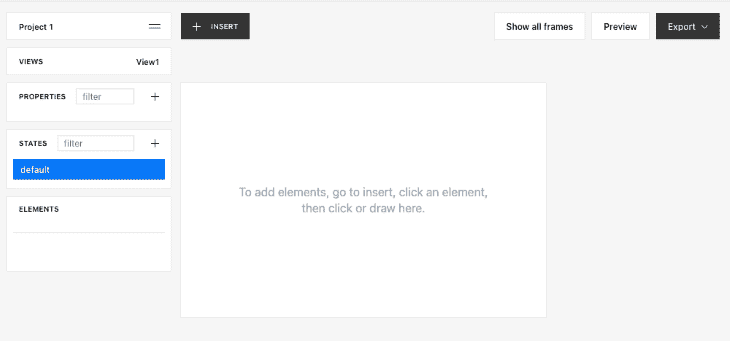

下面是 Aspect 用户界面不同部分的总结:

*   **项目**:查看您项目的详细信息列表，如产品 ID；您还可以从这里使用项目的 API 密匙来生成、查看和同步您的代码库
*   **视图**:为你的项目创建不同的视图；双击视图以更改其默认名称
*   **属性**:定义项目的自定义属性
*   **STATES** :为项目中的元素创建定制状态并设置条件
*   **元素**:管理项目中的元素，并定义它们的层次结构
*   CSS :定义你的项目的风格；使用快速布局来组织元素；当元素部分展开时，CSS 部分可见
*   **+ INSERT** :添加一个过滤器并将元素添加到您的项目中

现在我们对 Aspect 的特性有了更多的了解，让我们开始构建我们的产品页面。

## 创建视图

我们已经有了一个由方面创建的视图。要创建一个新视图，点击**视图**选项卡上的 **+** 符号。然后，双击**视图 2** ，将其重命名为“产品”。

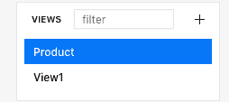

## 添加元素

现在，让我们给视图添加一些元素。

### 创建父布局

我们将通过点击 **+ INSERT** 并从下拉菜单中选择 **div** 来添加一个父节点`div`。当您将鼠标悬停在视图上时，您应该会看到一个 **+** 符号出现。这表示已经选择了一个元素。右键单击元素并拖动它，将元素放大到所需的大小。

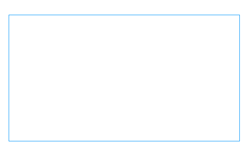

### 创建导航栏

现在我们有了一个父布局，让我们为导航栏再添加一个`div`。重复添加父节点`div`的相同步骤。然后，转到 **CSS** 选项卡，将**宽度**设置为 **100%** ，将**最小高度**设置为 **63** 。

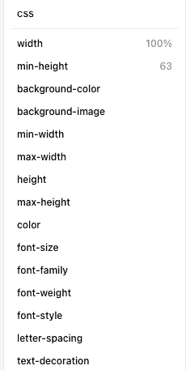

最终的布局应该如下所示:

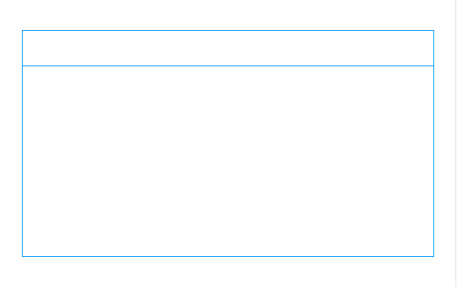

接下来，让我们使用一个`ul`元素将一些导航栏列表添加到项目中。点击**插入**，选择 **ul** ，将其拖放到父`div`、 **div-0** 中。

现在，在`ul`元素中添加三个`li`列表项元素。在`li`元素中，将`p`元素以及“Home”、“About”和“Products”添加到**属性**选项卡中的**文本**属性中。

将文本添加到`p`元素中，然后点击 **CSS** > **快速布局**标签中的第一个布局来添加样式。选择第一个布局以内嵌方式显示内容。

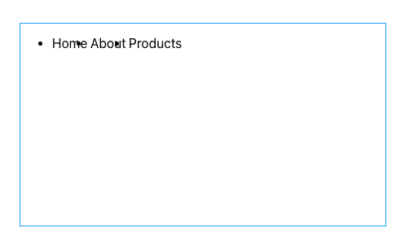

要删除项目符号，请将`ul`元素中的**列表样式的**属性更改为**无**。通过为 **div-0** 指定 **#42a7f5** 的**背景色**来添加黑色背景。

接下来，对齐元素，并通过给每个`li`元素添加 **7px** 的**右边距**和 **#fff** 的颜色，将字体更改为白色。

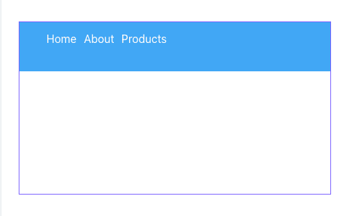

### 创造产品

现在，让我们为产品做一个布局。我们将使用一个`p`元素来描述产品。然后，我们将为产品创建一个子布局。

插入一个`div`，在里面插入另一个`div`和一个`p`在 **div-1** 里面。现在，将 **p-2** 的**文本**属性改为“产品”。

要样式化子布局，点击 **div-1** 并转到 **CSS >快速布局**选项卡。选择第二个布局，将 **div-2** 的**宽度**属性改为 **100%** 。您的项目应该如下所示:

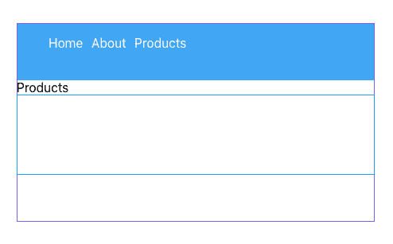

接下来，在 **div-2** 中插入另一个`div`来保存产品细节。在 **div-3** 内插入两个`p`，一个`img`，一个`button`。将 **p-3** 元素的 **text** 属性修改为“Techno m16”，将 **p-4** 元素的 **text** 属性修改为 **Price: $200** 。接下来，给**按钮**添加一个`p`，并将**文本**属性设置为“添加到购物车”。

现在，将 **div-3** 中所有`p`元素的**字体大小**属性更改为 **12px** ，并将**对齐**属性设置为**居中**。

将图像的 **src** 属性设置为`[https://tslnigeria.tv/wp-content/uploads/2021/05/mobile-phone.jpg](https://tslnigeria.tv/wp-content/uploads/2021/05/mobile-phone.jpg)`。

接下来，点击 **div-3** ，按 **Ctrl + D** 复制 div，创建 **div-4** 。继续修改 **div-4** 中每个元素的**文本**和 **src** 属性。

现在，点击 **div-2** ，进入 **CSS >快速布局**，选择第一个布局。

您应该得到类似如下的输出:


## 导出组件

我们已经使用 Aspect UI 构建器完成了组件 UI 的创建，现在，让我们使用下面的命令获取设计并将其与我们的代码库同步:

```
aspect fetch --project <projectId> --out <outputDirectory> --key <apiKey>

```

您可以通过点击**项目**下拉列表中的项目名称来获取项目 ID 和 API 密钥。

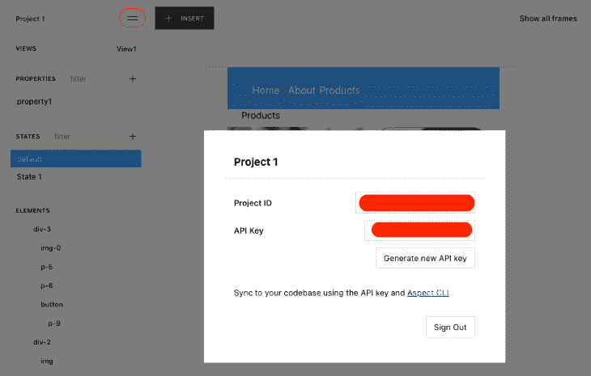

***注意，***T5`<apiKey>`*默认不生成，你需要* *点击* ***生成新的 API 键*** *按钮*

成功获取和同步设计后，您应该会看到以下输出:

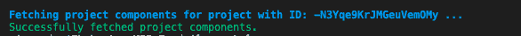

Aspect 将生成一个`component.tsx`和`components.css`文件。现在，您可以在项目中导入和使用该视图。

## 结论

在本教程中，我们演示了如何使用 Aspect 来减少与创建可重用的 React 组件相关的开发时间。

请按照本教程中概述的步骤向应用程序添加更多的功能。

## 使用 LogRocket 消除传统反应错误报告的噪音

[LogRocket](https://lp.logrocket.com/blg/react-signup-issue-free)

是一款 React analytics 解决方案，可保护您免受数百个误报错误警报的影响，只针对少数真正重要的项目。LogRocket 告诉您 React 应用程序中实际影响用户的最具影响力的 bug 和 UX 问题。

[ ](https://lp.logrocket.com/blg/react-signup-general) [  ](https://lp.logrocket.com/blg/react-signup-general) [LogRocket](https://lp.logrocket.com/blg/react-signup-issue-free)

自动聚合客户端错误、反应错误边界、还原状态、缓慢的组件加载时间、JS 异常、前端性能指标和用户交互。然后，LogRocket 使用机器学习来通知您影响大多数用户的最具影响力的问题，并提供您修复它所需的上下文。

关注重要的 React bug—[今天就试试 LogRocket】。](https://lp.logrocket.com/blg/react-signup-issue-free)