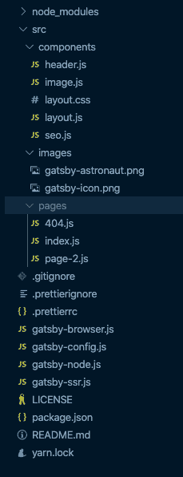
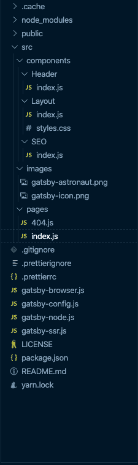
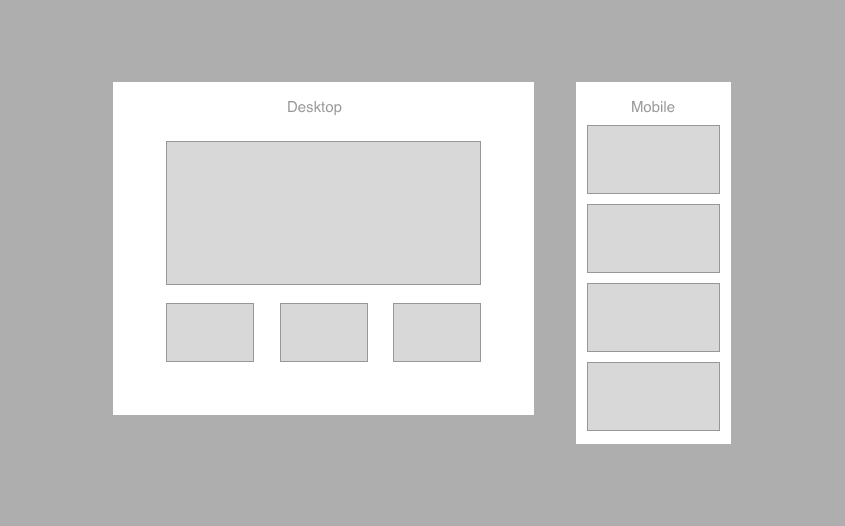
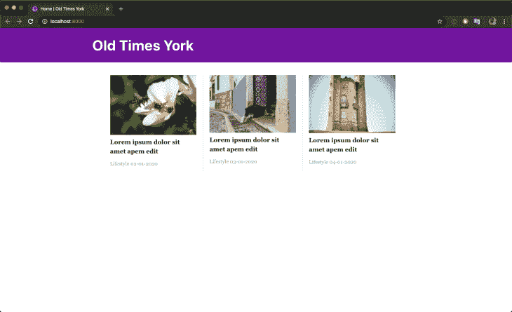
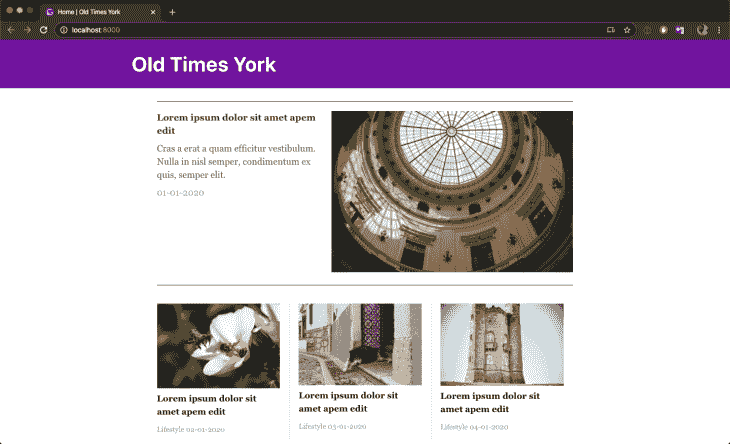
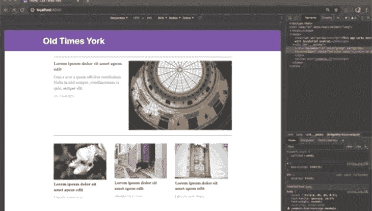
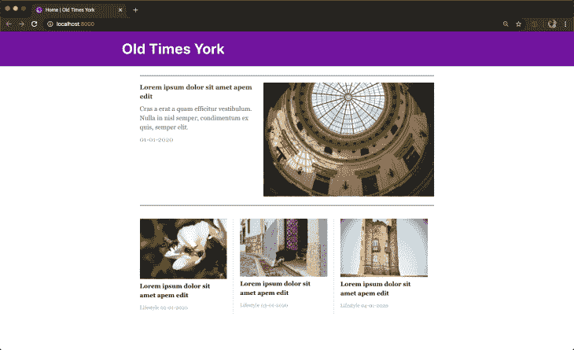

# 用 artsy/fresnel - LogRocket 博客在 Gatsby 中构建响应式组件

> 原文：<https://blog.logrocket.com/build-responsive-components-gatsby-artsy-fresnel/>

现代 web 开发的一个特点是能够根据用户设备的屏幕大小显示特定的页面或页面的一部分。这就是所谓的响应式网页设计。

响应式网页设计使我们能够确保用户获得最佳版本的网页，而不管他们的设备、平台、屏幕大小和屏幕方向如何。

在本文中，我们将学习如何使用 [@artsy/fresnel](https://github.com/artsy/fresnel) 包在 React 中构建响应式组件。

## 什么是 artsy/fresnel 软件包？

[@artsy/fresnel](https://github.com/artsy/fresnel#at) 是 React 中响应组件的 SSR 方法。

通过使用`<Media />`组件，您可以指定组件在一系列断点之间的特定断点处显示什么。`<Media />`组件接受帮助您确定应用程序响应性的道具。其中一些是:

### 在

仅当当前视区与特定断点集匹配时，此属性才显示组件。

```
<Media at="sm" />
```

### 不到

该属性仅在当前视区小于设置的特定断点时显示组件。

```
<Media lessThan="md" />
```

### 大于

该属性仅在当前视区大于设置的特定断点时显示组件。

```
<Media greaterThan="lg" />
```

### 更大的

仅当当前视口大于或等于特定断点集时，此属性才显示组件。

```
<Media greaterThanOrEqual="md" />

```

### 在...之间

当当前视区与指定的断点范围匹配时，此属性显示组件。

```
<Media between={['md', 'lg']} />
```

为了了解 artsy/fresnel 包是如何工作的，我们将把它添加到 Gatsby 站点，然后用它来构建响应式组件。Gatsby 网站将是一个展示文章列表的杂志。

## 创建盖茨比网站

要创建一个 Gatsby 站点，您需要安装 [Gatsby CLI](https://www.gatsbyjs.org/docs/gatsby-cli/) 。Gatsby CLI 工具允许您快速创建新的 Gatsby 支持的站点，并运行命令来开发 Gatsby 站点。它可以通过运行以下命令进行全局安装:

```
yarn global add gatsby-cli
```

一旦完成，下一步就是创建一个 Gatsby 网站。如上所述，我们将使用 Gatsby CLI 工具创建您的第一个 Gatsby 站点，我们将从其中一个启动项目开始——Gatsby 默认启动项目:

```
gatsby new artsy-fresnel-example
```

一旦上面的命令完成，您应该有一个名为`artsy-fresnel-example`的新目录，其中包含所有需要的文件，如下所示:



Before moving on to the meat of this article, let’s move things around and reorganize the components in the `artsy-fresnel-example` directory.

我们将使用[按特性或路径分组](https://reactjs.org/docs/faq-structure.html)的方法，本质上是将 CSS、JS 和测试放在按特性或组件分组的文件夹中。

这意味着对于`src/components`中的每一个组件，我们都会有一个对应的文件夹，例如`header.js`文件现在会在一个名为`Header`的文件夹中，并重命名为`index.js`。对其余组件进行同样的操作。您的目录应该类似于下面的目录:



确保根据需要更新各种文件导入的路径。

因此，为了给出我们在这里试图构建的内容的概述，我们将构建一个正好显示四篇文章的杂志页面。第一篇文章将是一篇特色文章，其余三篇将在它的下面排成三行。那是桌面视图。

对于移动视图，所有文章都将列在一个列中，没有特色文章。为了帮助形象化上面描述的内容，请看下图。



让我们在`src/components`目录下创建一个名为`Articles`的新目录，然后在新目录下创建两个文件——`index.js`和`styles.js`。

我们正在创建一个`styles.js`文件，因为我们将使用`styled-components`来样式化我们的组件，所以继续使用下面的命令安装这个包:

```
yarn add styled-components
```

接下来，打开`src/components/Articles/index.js`文件并将这段代码添加到文件中:

```
// src/components/Articles/index.js
import React from "react"

const articles = []

const Articles = () => {
  return <p>Articles</p>
}

export default Articles
```

`index.js`文件是负责显示文章的组件，因此我们需要文章的数据源。您可以获取下面代码片段的内容，并使用它来替换代码的`const articles = []`行:

```
const articles = [
  {
    id: "1",
    date: "01-01-2020",
    headline: "Lorem ipsum dolor sit amet apem edit",
    category: "Lifestyle",
    snippet:
      "Cras a erat a quam efficitur vestibulum. Nulla in nisl semper, condimentum ex quis, semper elit.",
    image:
      "https://images.unsplash.com/photo-1579541707963-368970b955b7?ixlib=rb-1.2.1&ixid=eyJhcHBfaWQiOjEyMDd9&auto=format&fit=crop&w=1050&q=80",
  },
  {
    id: "2",
    date: "02-01-2020",
    headline: "Lorem ipsum dolor sit amet apem edit",
    category: "Lifestyle",
    snippet:
      "Cras a erat a quam efficitur vestibulum. Nulla in nisl semper, condimentum ex quis, semper elit.",
    image:
      "https://images.unsplash.com/photo-1579571076332-acc4483d3eb8?ixlib=rb-1.2.1&ixid=eyJhcHBfaWQiOjEyMDd9&auto=format&fit=crop&w=1023&q=80",
  },
  {
    id: "3",
    date: "03-01-2020",
    headline: "Lorem ipsum dolor sit amet apem edit",
    category: "Lifestyle",
    snippet:
      "Cras a erat a quam efficitur vestibulum. Nulla in nisl semper, condimentum ex quis, semper elit.",
    image:
      "https://images.unsplash.com/photo-1579617881900-fe2590bc8384?ixlib=rb-1.2.1&ixid=eyJhcHBfaWQiOjEyMDd9&auto=format&fit=crop&w=1050&q=80",
  },
  {
    id: "4",
    date: "04-01-2020",
    headline: "Lorem ipsum dolor sit amet apem edit",
    category: "Lifestyle",
    snippet:
      "Cras a erat a quam efficitur vestibulum. Nulla in nisl semper, condimentum ex quis, semper elit.",
    image:
      "https://images.unsplash.com/photo-1579626349272-8ecb1eba0421?ixlib=rb-1.2.1&ixid=eyJhcHBfaWQiOjEyMDd9&auto=format&fit=crop&w=1050&q=80",
  },
]
```

接下来，打开`styles.js`文件并添加下面的代码:

```
// src/components/Articles/styles.js

import styled from "styled-components"

export const Articles = styled.div`
  display: grid;
  grid-template-columns: repeat(auto-fill, minmax(235px, 1fr));
  gap: 1rem;
  margin-top: 2rem;
  @media (min-width: 720px) {
    grid-template-columns: repeat(3, minmax(235px, 1fr));
  }
`
export const Card = styled.div`
  padding-right: 0;
  border-right: none;
  img {
    margin-bottom: 0;
  }
  &:last-child {
    border-right: none;
  }
  @media (min-width: 720px) {
    border-right: 1px solid rgb(226, 226, 226);
    padding-right: 1rem;
  }
`
export const Headline = styled.p`
  font-weight: 600;
  color: #121212;
  font-size: 0.95rem;
`
export const FooterText = styled.p`
  color: #999999;
  font-size: 0.8rem;
`
```

上面的代码有助于构建将在文章页面上显示的文章行。我们所要做的就是在`index.js`文件中使用它们:

```
// src/components/Articles/index.js

import React from "react"

import * as Styles from "./styles"

const articles = [...] // articles from https://gist.github.com/yomete/53be226f779d4d1ebd3ed85b8fa5672a

const Articles = () => {

  const featuredArticle = articles.slice(0, 1)
  const desktopArticleGrids = articles.slice(1, 4)
  const mobileArticleGrids = articles.slice(0, 4)

  return (
    <Styles.Articles>
      {desktopArticleGrids.map(article => (
        <Styles.Card>
          </img>
          <Styles.Headline>{article.headline}</Styles.Headline>
          <Styles.FooterText>
            {article.category} {article.date}
          </Styles.FooterText>
        </Styles.Card>
      ))}
    </Styles.Articles>
  )
}
export default Articles
```

在上面的代码块中，我们将文章的来源分配给一个名为`articles`的`const`变量。然后我们使用`articles`的内容来创建我们需要的数据:

1.  用于专题文章的文章，`featuredArticle`。在本例中，它是数组中的第一篇文章
2.  桌面上文章行使用的文章列表，`desktopArticleGrids`。这是一系列四篇文章中的最后三篇
3.  在手机上使用的物品列表，`mobileArticleGrids`

接下来，让我们使用 Gatsby 站点主页上的`Articles`组件。导航到`src/pages/index.js`文件，用下面的代码块编辑它:

```
import React from "react"

import Articles from "../components/Articles/index"
import Layout from "../components/Layout/index"
import SEO from "../components/SEO/index"

const IndexPage = () => (
  <Layout>
    <Articles />
    <SEO title="Home" />
  </Layout>
)

export default IndexPage
```

我们现在可以查看 Gatsby 站点，看看文章列表是否出现。您可以通过运行以下命令来实现:

```
yarn start
```



至此，我们已经整理好了文章行，接下来让我们为特色文章构建组件。

在`src/components`目录下创建一个名为`FeaturedArticle`的新目录，之后在新目录下创建两个文件——`index.js`和`styles.js`:

```
// src/components/FeaturedArticle/index.js

import React from "react"
import * as Styles from "./styles"

const FeaturedArticle = ({ article }) => {
  return (
    <Styles.FeaturedArticleWrapper>
      <Styles.ArticleDetails>
        <Styles.Headline>{article.headline}</Styles.Headline>
        <Styles.Snippet>{article.snippet}</Styles.Snippet>
        <Styles.Date>{article.date}</Styles.Date>
      </Styles.ArticleDetails>
      <Styles.ImageWrapper>
        </img>
      </Styles.ImageWrapper>
    </Styles.FeaturedArticleWrapper>
  )
}
export default FeaturedArticle
```

`FeaturedArticle`是一个功能组件，它接受`article`作为属性，然后用`article`对象提供构建组件所需的信息。

接下来，打开`styles.js`文件，用下面的代码块进行编辑:

```
// src/components/FeaturedArticle/styles.js
import styled from "styled-components"

export const FeaturedArticleWrapper = styled.div`
  display: flex;
  border-top: 1px solid #121212;
  border-bottom: 1px solid #121212;
  padding: 18px 0;
`
export const ImageWrapper = styled.div`
  img {
    margin-bottom: 0;
  }
`
export const Headline = styled.p`
  font-weight: 600;
`
export const Snippet = styled.p`
  color: #555555;
`
export const Date = styled.p`
  color: #999999;
`
export const ArticleDetails = styled.div`
  display: flex;
  flex-direction: column;
`
```

在上面的代码中，我们添加了构建特色文章组件所需的样式。

接下来，我们将在`Article`组件中使用`<FeaturedArticle />`组件。打开`src/components/Articles/index.js`文件，用下面的代码块编辑:

```
// src/components/Articles/index.js
import React from "react"

import FeaturedArticle from "../FeaturedArticle/index"
import * as Styles from "./styles"

const articles = [...] // articles from https://gist.github.com/yomete/53be226f779d4d1ebd3ed85b8fa5672a

const Articles = () => {

  const featuredArticle = articles.slice(0, 1)
  const desktopArticleGrids = articles.slice(1, 4)
  const mobileArticleGrids = articles.slice(0, 4)

  return (
    <>
      <FeaturedArticle article={featuredArticle[0]} />

      <Styles.Articles>
        {desktopArticleGrids.map(article => (
          <Styles.Card>
            </img>
            <Styles.Headline>{article.headline}</Styles.Headline>
            <Styles.FooterText>
              {article.category} {article.date}
            </Styles.FooterText>
          </Styles.Card>
        ))}
      </Styles.Articles>
    </>
  )
}

export default Articles
```

在上面的代码块中，`FeaturedArticle`组件被导入，然后在`Articles`组件中使用。我们还将文章数组中的第一项传递给它，这将用于填充特色文章组件。

现在，您可以检查 Gatsby 站点，它看起来应该类似于下图:



## 添加 artsy/fresnel 包

要安装`artsy/fresnel`包，请在终端中运行以下命令:

```
yarn add @artsy/fresnel
```

为了开始使用`artsy-fresnel`包，我们需要做一些设置。

首先，我们需要将@artsy/fresnel 风格注入网站 index.html 的头部。这不是一个在 Gatsby 设置中容易获得的文件。您需要在`src`文件夹中创建一个`html.js`文件，Gatsby 知道将它用作定制的`index.html`文件。创建`html.js`文件，并用下面的代码块进行编辑:

```
import React from "react"
import PropTypes from "prop-types"
import { mediaStyles } from "./Media"
export default function HTML(props) {
  return (
    <html {...props.htmlAttributes}>
      <head>
        <title>Old Times York</title>
        <meta charSet="utf-8" />
        <meta httpEquiv="x-ua-compatible" content="ie=edge" />
        <meta
          name="viewport"
          content="width=device-width, initial-scale=1, shrink-to-fit=no"
        />
        {/* Inject @artsy/fresnel styles in to the head */}
        <style>{mediaStyles}</style>
        {props.headComponents}
      </head>
      <body {...props.bodyAttributes}>
        {props.preBodyComponents}
        <noscript key="noscript" id="gatsby-noscript">
          This app works best with JavaScript enabled.
        </noscript>
        <div
          key={`body`}
          id="___gatsby"
          dangerouslySetInnerHTML={{ __html: props.body }}
        />
        {props.postBodyComponents}
      </body>
    </html>
  )
}
HTML.propTypes = {
  htmlAttributes: PropTypes.object,
  headComponents: PropTypes.array,
  bodyAttributes: PropTypes.object,
  preBodyComponents: PropTypes.array,
  body: PropTypes.string,
  postBodyComponents: PropTypes.array,
}
```

上面的代码块是 Gatsby 推荐的定制的 [html.js](https://www.gatsbyjs.org/docs/custom-html/) ,增加了一些内容。`mediaStyles`是从我们接下来要创建的`Media.js`文件中导入的，它的内容被注入到`html.js`文件的`head`中。

接下来要做的是在一个可以在整个应用程序中使用的文件中配置@artsy/fresnel。创建一个`src/Media.js`文件，并用下面的代码进行编辑:

```
// src/Media.js
import { createMedia } from "@artsy/fresnel"
const QueryBreakpoints = createMedia({
  breakpoints: {
    sm: 0,
    md: 768,
    lg: 1024,
    xl: 1192,
  },
})
// Generate CSS to be injected into the head
export const mediaStyles = QueryBreakpoints.createMediaStyle()
export const { Media, MediaContextProvider } = QueryBreakpoints
```

在上面的文件中，我们定义了您的设计所需的断点，以生成您可以在整个应用程序中使用的媒体组件集。

`@artsy/fresnel`包的工作方式是，所有断点都由服务器呈现，每个`Media`组件都由普通 CSS 包装，只有当断点与用户当前的浏览器大小匹配时，CSS 才会显示断点。这就是为什么我们需要定义上面的断点。

接下来要做的是把盖茨比应用包在`MediaContextProvider`周围。`MediaContextProvider`组件影响了`Media`组件的渲染方式。

在 Gatsby 应用程序中，这可以使用`wrapRootElement` API 来完成。wrapRootElement 允许插件包装根元素。这对于设置任何将包装您的应用程序的提供者组件非常有用，在本例中是`MediaContextProvider`。

这样做的地方应该在`gatsby-browser.js`和`gatsby-ssr.js`文件中。打开每个文件，并在下面添加相应的代码:

```
// gatsby-browser.js
import * as React from "react"
import { MediaContextProvider } from "./src/Media"

export const wrapRootElement = ({ element }) => (
  {element}
)
```

```
// gatsby-ssr.js
import * as React from "react"
import { MediaContextProvider } from "./src/Media"

export const wrapRootElement = ({ element }) => (
  {element}
)
```

我们在两个文件中重复上面的代码，因为如果您使用`wrapRootElement`或`wrapPageElement`API，您需要在`gatsby-ssr.js`和`gatsby-browser.js`文件中添加它，以便通过 SSR 和 Node.js 生成的页面在与浏览器 JavaScript 混合后是相同的。

这就是我们需要的所有设置，我们现在可以开始在我们的应用程序中使用`<Media />`组件。导航到`src/components/Articles/index.js`文件，用下面的代码进行编辑:

```
import React from "react"

import { Media } from "../../Media"
import FeaturedArticle from "../FeaturedArticle/index"
import * as Styles from "./styles"

const articles = [...] // articles from https://gist.github.com/yomete/53be226f779d4d1ebd3ed85b8fa5672a

const Articles = () => {
  const featuredArticle = articles.slice(0, 1)
  const desktopArticleGrids = articles.slice(1, 4)
  const mobileArticleGrids = articles.slice(0, 4)
  return (
    <>
      <Media lessThan="md">
        <Styles.Articles>
          {mobileArticleGrids.map(article => (
            <Styles.Card>
              </img>
              <Styles.Headline>{article.headline}</Styles.Headline>
              <Styles.FooterText>
                {article.category} {article.date}
              </Styles.FooterText>
            </Styles.Card>
          ))}
        </Styles.Articles>
      </Media>
      <Media greaterThanOrEqual="md">
        <FeaturedArticle article={featuredArticle[0]} />
        <Styles.Articles>
          {desktopArticleGrids.map(article => (
            <Styles.Card>
              </img>
              <Styles.Headline>{article.headline}</Styles.Headline>
              <Styles.FooterText>
                {article.category} {article.date}
              </Styles.FooterText>
            </Styles.Card>
          ))}
        </Styles.Articles>
      </Media>
    </>
  )
}
export default Articles
```

在上面的代码块中，我们利用`lessThan`属性在没有特色文章的列表中一次显示所有文章，只要当前屏幕大小小于在`md`设置的断点。

`greaterThanOrEqual`道具是用来先显示特色文章，再显示下面一排文章，只要当前屏幕尺寸大于`md`设置的断点即可。

现在，如果你相应地调整浏览器的大小，你应该会得到你想要的结果，一个带有响应式组件的 React 应用程序。



我们甚至可以通过创建一个显示文章行的迷你组件来使`src/components/Articles/index.js`文件变得更好。现在，用于显示行的代码块在用于`md`屏幕和大于`md`屏幕的`<Media />`组件中重复了两次。

让我们遵循 [DRY](https://en.wikipedia.org/wiki/Don%27t_repeat_yourself) 原则，为它创建一个组件:

```
import React from "react"
import { Media } from "../../Media"
import FeaturedArticle from "../FeaturedArticle/index"
import * as Styles from "./styles"

const articles = [...] // articles from https://gist.github.com/yomete/53be226f779d4d1ebd3ed85b8fa5672a

const ArticleGrid = ({ articles }) => (
  <Styles.Articles>
    {articles.map(article => (
      <Styles.Card>
        </img>
        <Styles.Headline>{article.headline}</Styles.Headline>
        <Styles.FooterText>
          {article.category} {article.date}
        </Styles.FooterText>
      </Styles.Card>
    ))}
  </Styles.Articles>
)

const Articles = () => {
  const featuredArticle = articles.slice(0, 1)
  const desktopArticleGrids = articles.slice(1, 4)
  const mobileArticleGrids = articles.slice(0, 4)
  return (
    <>

      <Media lessThan="md">
        <ArticleGrid articles={mobileArticleGrids} />
      </Media>

      <Media greaterThanOrEqual="md">
        <FeaturedArticle article={featuredArticle[0]} />
        <ArticleGrid articles={desktopArticleGrids} />
      </Media>

    </>
  )
}

export default Articles
```

让我们再次运行`yarn start`命令，以确保一切仍按预期运行。你的页面应该如下图所示。


## 结论

在本文中，您已经看到了如何使用 [@artsy/fresnel](https://github.com/artsy/fresnel) 库构建响应式 React 组件。你也看到了 [@artsy/fresnel](https://github.com/artsy/fresnel) 包相对于其他库的一些优势。

你用过哪些响应式组件库？

上面构建的示例的完整代码可以在 [GitHub](https://github.com/yomete/artsy-fresnel-example) 上看到。

## 使用 [LogRocket](https://lp.logrocket.com/blg/signup) 消除传统错误报告的干扰

[](https://lp.logrocket.com/blg/signup)

[LogRocket](https://lp.logrocket.com/blg/signup) 是一个数字体验分析解决方案，它可以保护您免受数百个假阳性错误警报的影响，只针对几个真正重要的项目。LogRocket 会告诉您应用程序中实际影响用户的最具影响力的 bug 和 UX 问题。

然后，使用具有深层技术遥测的会话重放来确切地查看用户看到了什么以及是什么导致了问题，就像你在他们身后看一样。

LogRocket 自动聚合客户端错误、JS 异常、前端性能指标和用户交互。然后 LogRocket 使用机器学习来告诉你哪些问题正在影响大多数用户，并提供你需要修复它的上下文。

关注重要的 bug—[今天就试试 LogRocket】。](https://lp.logrocket.com/blg/signup-issue-free)