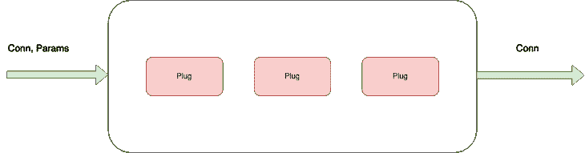
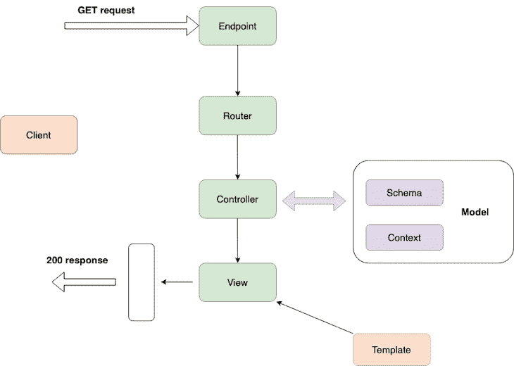
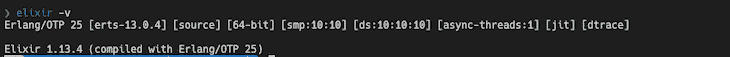
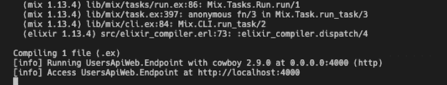

# 用 Elixir 和 Phoenix 构建 REST API

> 原文：<https://blog.logrocket.com/build-rest-api-elixir-phoenix/>

Phoenix 是 2022 年最受开发人员喜爱的框架，而且是遥遥领先。作为 Elixir 生态系统的一部分，它非常适合 web 开发，它的可靠性和可伸缩性使它成为任何项目的好选择。

在本教程中，我们将探索什么是 Elixir，Phoenix web 框架，以及如何使用 Elixir 和 Phoenix 为您的项目构建 REST API。

*向前跳过*

## 什么是仙丹和凤凰网框架？

Elixir 是一种构建在 Erlang 之上的功能性动态类型语言。开发 Elixir 的 Jose Valim 在 Ruby on Rails 团队工作，当他试图用 Ruby on Rails 和 Erlang 解决性能瓶颈时，他创建了这个程序。

因此，Elixir 的语法与 Ruby on Rails 的语法有许多相似之处。

Elixir 主要用于创建高度可伸缩的应用程序，这些应用程序具有容错性且易于维护。酏剂的一些主要特征是:

1.  它将代码编译成运行在 Erlang VM 上的字节码
2.  它强调高阶函数和递归
3.  强大的模式匹配
4.  它是一种动态类型语言，所以它在运行时而不是编译时检查所有类型

## 长生不老药的好处

由于 Elixir 构建于 Erlang VM BEAM 之上，因此它具有一些有助于构建优秀应用程序的关键特性。这些特征是:

1.  **并发** : Elixir 使用进程线程来执行。这些线程是隔离的、基于 CPU 的，并通过消息进行通信
2.  **可伸缩性**:伸缩一个 Elixir 应用程序很简单，因为它使用轻量级线程，可以用很少的进程运行
3.  **可靠性**:构建容错应用是 Elixir 的主要特性之一。当 Elixir 应用程序在生产中失败时，监管系统会快速重启轻量级流程，从而减少停机时间

当构建 web 应用程序时，每次都很难从零开始构建基本功能，这就是 Phoenix web framework 的用武之地。

## 凤凰城简介

[Phoenix](https://blog.logrocket.com/create-graphql-api-react-phoenix-2/) 是 Elixir 生态系统中的一个 web 框架。它带有开箱即用的模块，有助于构建高度可伸缩和容错的应用程序。Phoenix 是一个模型-视图-控制器(MVC)框架，类似于 Ruby on Rails 和 Django。

Phoenix framework 的杀手锏之一是 [LiveView](https://hexdocs.pm/phoenix_live_view/Phoenix.LiveView.html) 。Phoenix LiveView 是一个构建在 Phoenix 之上的库，有助于构建实时应用程序，而无需编写客户端 JavaScript。它计算页面变化并通过 WebSocket 推送更新。

## 菲尼克斯是如何工作的

[插头](https://hexdocs.pm/plug/readme.html)是凤凰的基本元素。插件是一种用功能组成 web 应用程序的规范——Phoenix 接收一个传入的请求，并将其转换为 [Conn](https://hexdocs.pm/plug/Plug.Conn.html) ，这是一种处理 HTTP 连接中的请求和响应的数据结构。



数据结构通过几个插件来完成功能并返回响应。为了简化它:

1.  收到请求
2.  将其转换为`conn`
3.  穿过几个塞子
4.  返回响应

## 凤凰请求的生命周期

正如我们已经注意到的，phoenix 中的传入请求要经过几个插件才能返回所需的响应——让我们来看看插件和流程的细节:



Phoenix 在端点接收一个请求，端点将它转换成一个`Conn`数据结构，转发给路由器。

路由器将`Conn`数据结构通过管道传输到控制器，控制器与模型进行交互，从数据库中获取数据，并使用模板进行渲染。模板可以是 HTML 或 JSON 文件。在这里，端点、路由器和控制器是插件 Phoenix 中的一切都是可组合的函数，将数据转换成不同的结构。

## 使用 Elixir 和 Phoenix 创建 REST API

现在我们已经熟悉了 Phoenix web 框架，让我们用 Elixir 和 Phoenix 构建一个 REST API 用于一个项目。这里，我们将创建一个 REST API，它将`users`信息传递给 Postgres 数据库。

API 将在`/api/users`下提供用户信息，包括 GET、PUT、POST、DELETE 请求。

为此，我们需要使用存储在数据库中的必需字段创建数据库模式:

1.  `id` →表中主键。
2.  `name` →字符串包含用户名。
3.  `email` →邮箱字段，应该是唯一的。
4.  `role` →用户角色。
5.  `address` →用户地址。

## 先决条件

在您继续之前，我建议您满足以下先决条件:

1.  对 Elixir 语法的基本理解。你可以参考[官方文档](https://elixir-lang.org/getting-started/introduction.html)来开始使用语法
2.  在你的机器上安装药剂。我们将在下一节讨论如何安装 Elixir
3.  在你的机器上安装 Postgres。或者，您可以使用 Docker 运行 Postgres(这是我们将在本教程中做的)
4.  使用 Postman 客户端或替代方法来测试 API

## 入门指南

首先，让我们在您的机器上安装 Elixir。要在 macOS 上安装 elixir，可以使用家酿软件包管理器。

**在** **macOS 上安装仙丹**

安装前，使用以下工具更新 Homebrew:

```
$ brew update

```

此后，您可以使用以下方法安装 Elixir:

```
$ brew install elixir

```

你还需要安装药剂包管理器 [Hex](https://hex.pm/) 。运行以下命令安装 Hex:

```
$ mix local.hex

```

要验证安装是否成功，您可以运行以下命令来检查版本:

```
$ elixir -v

```



(注:对于其他操作系统，您可以参考 [Elixir 官方指南](https://elixir-lang.org/install.html)，它提供了简单的安装分步指南)

**安装凤凰**

现在我们已经安装了 Elixir，让我们使用 Phoenix 框架启动一个项目来构建一个 REST API。

```
$ mix archive.install hex phx_new 1.5.3

```

这将在您的计算机上安装 Phoenix 1.5.3。要创建一个新项目，您需要在终端中运行以下命令:

```
$ mix phx.new users_api --no-html --no-webpack --binary-id 

$ cd users_api

```

这将创建一个 users_api 目录，其中包含 Phoenix 应用程序的所有样板文件。它遵循这样的目录结构:

```
├── _build
├── assets
├── config
├── deps
├── lib
│   ├── hello
│   ├── hello.ex
│   ├── hello_web
│   └── hello_web.ex
├── priv
└── test

```

(注:凤凰官方文档详细解释了目录结构，可以参考[这里](https://hexdocs.pm/phoenix/directory_structure.html))

`--no-html`和`--no-webpack`参数指示命令不要生成 HTML 文件和静态资产，因为我们只构建了一个 REST API。

`--binary-id`将配置 Ecto 对数据库模式(如主键值)使用 UUID。

现在，我们将用样板代码搭建应用程序。让我们运行 Postgres 数据库，并将应用程序连接到数据库。

## 设置和配置数据库

首先，确保你在你的机器上安装了 [Docker](https://docs.docker.com/engine/install/) 。通过 Docker 运行 Postgres 很简单；只需要运行以下命令:

```
$ docker run --name phoenix-postgres -e POSTGRES_USER=postgres -e POSTGRES_PASSWORD=postgres -p 5500:5432 -d postgres

```

这里，我们为 Docker 容器指定了`--name`，为`POSTGRES_USER`和`POSTGRES_PASSWORD`指定了环境。我们还需要通过指定`-p`来映射端口。最后，我们以分离模式提取 Docker 图像。

* * *

### 更多来自 LogRocket 的精彩文章:

* * *

Postgres 启动并运行后，我们在 Phoenix 应用程序中配置数据库。Phoenix 提供了一个配置目录来设置应用程序中的数据库、cron 作业、记录器和堆栈跟踪。

要在开发环境中配置数据库，请用 Postgres 数据库凭证更改`config/dev.exs`。

```
# Configure your database
config :users_api, UsersApi.Repo,
  username: "postgres",
  password: "postgres",
  database: "users_api_dev",
  hostname: "localhost",
  port: "5500",
  show_sensitive_data_on_connection_error: true,
  pool_size: 10

```

之后，您可以为开发环境创建一个数据库，如下所示:

```
$ mix ecto.create

```

您可以使用以下命令删除数据库:

```
$ mix ecto.drop

```

## 模式和迁移

创建数据库并在应用程序中进行配置后，您需要对数据进行建模，以便在应用程序中访问它。

**凤凰语境**

在我们开始模式设计之前，了解 Phoenix [上下文](https://hexdocs.pm/phoenix/contexts.html)很重要。上下文是将相关功能组合在一起的模块。当你设计一个应用程序时，Phoenix 会帮助你根据上下文对模块进行分组。把它想象成领域驱动设计中的领域。

上下文将根据功能将不同的模块组合在一起。

举个例子，Elixir `Logger.info/1`由几个模块组成，但是我们可以在单个`Logger`模块上下文中访问这些模块。

要为建模创建上下文，您可以在应用程序中使用 Phoenix generator 命令:

```
$ mix phx.gen.context Admin User users 
  name:string email:string:unique role:string address:string

```

在这里，我们有:

*   `Admin`，作为上下文的模块名
*   `User`，作为模式的模块名
*   `Users`，作为数据库表名

要在生成数据库表时定义`users`字段及其类型，可以参考[十六进制文档](https://hexdocs.pm/phoenix/Mix.Tasks.Phx.Gen.Schema.html)中的 schema 字段定义。

一旦运行该命令，它将创建包含模式定义的`lib/admin/user.ex`。

```
defmodule UsersApi.Admin.User do
  use Ecto.Schema
  import Ecto.Changeset
  @primary_key {:id, :binary_id, autogenerate: true}
  @foreign_key_type :binary_id
  schema "users" do
    field :address, :string
    field :email, :string
    field :name, :string
    field :role, :string
    timestamps()
  end
  @doc false
  def changeset(user, attrs) do
    user
    |> cast(attrs, [:name, :email, :role, :address])
    |> validate_required([:name, :email, :role, :address])
    |> unique_constraint(:email)
  end
end

```

它还为`users_api/admin.ex`中的`users`模块搭建了 REST API。

```
defmodule UsersApi.Admin do
  @moduledoc """
  The Admin context.
  """
  import Ecto.Query, warn: false
  alias UsersApi.Repo
  alias UsersApi.Admin.User
  @doc """
  Returns the list of users.
  ## Examples
      iex> list_users()
      [%User{}, ...]
  """
  def list_users do
    Repo.all(User)
  end
  @doc """
  Gets a single user.
  Raises `Ecto.NoResultsError` if the User does not exist.
  ## Examples
      iex> get_user!(123)
      %User{}
      iex> get_user!(456)
      ** (Ecto.NoResultsError)
  """
  def get_user!(id), do: Repo.get!(User, id)
  @doc """
  Creates a user.
  ## Examples
      iex> create_user(%{field: value})
      {:ok, %User{}}
      iex> create_user(%{field: bad_value})
      {:error, %Ecto.Changeset{}}
  """
  def create_user(attrs \\ %{}) do
    %User{}
    |> User.changeset(attrs)
    |> Repo.insert()
  end
  @doc """
  Updates a user.
  ## Examples
      iex> update_user(user, %{field: new_value})
      {:ok, %User{}}
      iex> update_user(user, %{field: bad_value})
      {:error, %Ecto.Changeset{}}
  """
  def update_user(%User{} = user, attrs) do
    user
    |> User.changeset(attrs)
    |> Repo.update()
  end
  @doc """
  Deletes a user.
  ## Examples
      iex> delete_user(user)
      {:ok, %User{}}
      iex> delete_user(user)
      {:error, %Ecto.Changeset{}}
  """
  def delete_user(%User{} = user) do
    Repo.delete(user)
  end
  @doc """
  Returns an `%Ecto.Changeset{}` for tracking user changes.
  ## Examples
      iex> change_user(user)
      %Ecto.Changeset{data: %User{}}
  """
  def change_user(%User{} = user, attrs \\ %{}) do
    User.changeset(user, attrs)
  end
end

```

## 运行迁移

要为定义的数据模式运行迁移，您需要运行以下命令:

```
$ mix ecto.migrate

```

一旦您运行迁移，它将在数据库中创建一个包含已定义字段的表，就像模式中一样。

## 脚手架控制器和视图

现在，我们已经在应用程序中定义了数据库模式和模型，我们需要将它与控制器和视图连接起来以返回响应。

为了生成特定模块的控制器和视图，Phoenix 提供了一个生成器命令，可以生成样板代码:

```
$ mix phx.gen.json Admin User users 
  name:string email:string:unique role:string address:string --no-context --no-schema

```

上述命令会生成:

*   在`lib/users_api_web/controllers/users_controller.ex`为用户提供 CRUD 控制器
*   查看，在`lib/users_api_web/view/users_view.ex`呈现用户的 JSON

我们还提到了`--no-context`和`--no-schema`，因为我们已经在创建数据库模式时生成了它们。

Phoenix 还提供了`users_api_web/controllers/fallback_controller.ex`来处理错误和任何故障的回退。我们可以编辑它们来处理不同的错误代码。例如，您可以编辑回退控制器来处理`UnAuthorized`错误。

```
defmodule MyFallbackController do
  use Phoenix.Controller

  def call(conn, {:error, :not_found}) do
    conn
    |> put_status(:not_found)
    |> put_view(MyErrorView)
    |> render(:"404")
  end

  def call(conn, {:error, :unauthorized}) do
    conn
    |> put_status(403)
    |> put_view(MyErrorView)
    |> render(:"403")
  end
end

```

默认情况下，Phoenix 在主控制器中配置后备控制器——您可以在`users_api_web/controllers/user_controller.ex`中更改它们。

```
  action_fallback UsersApiWeb.FallbackController

```

一旦创建了控制器和视图，就需要在`lib/users_api_web/router.ex`中为控制器添加一条路线。

```
defmodule UsersApiWeb.Router do
  use UsersApiWeb, :router
  pipeline :api do
    plug :accepts, ["json"]
  end
  scope "/api", UsersApiWeb do
    pipe_through :api
    get "/users", UserController, :index
    put "/users", UserController, :edit
    post "/users", UserController, :create
    delete "/users", UserController, :delete
  end
  # Enables LiveDashboard only for development
  #
  # If you want to use the LiveDashboard in production, you should put
  # it behind authentication and allow only admins to access it.
  # If your application does not have an admins-only section yet,
  # you can use Plug.BasicAuth to set up some basic authentication
  # as long as you are also using SSL (which you should anyway).
  if Mix.env() in [:dev, :test] do
    import Phoenix.LiveDashboard.Router
    scope "/" do
      pipe_through [:fetch_session, :protect_from_forgery]
      live_dashboard "/dashboard", metrics: UsersApiWeb.Telemetry
    end
  end
end

```

如您所见，您可以将不同的路由组合成一个端点。在这里，我们将所有的`/users`路由嵌套在`/api`范围内。在`/api`范围内，我们为`Users` API 配置 CRUD。

还有另一个为模块配置 CRUD 请求的简化版本。我们可以使用 Phoenix 路由器模块中的`resources`:

```
resources "/users", UserController

```

通过这样配置它的`resources`;它简化了一行中的所有请求。

```
 scope "/api", UsersApiWeb do
    pipe_through :api
    resources "/users", UserController, except: [:new, :edit]

```

现在，您可以使用以下代码运行应用程序:

```
$ mix phx.server

```



## 结论

你完了！感谢跟随本教程，我希望你觉得有用，并随时在下面的评论中发布你的发现。可以在 [http://localhost:4000](http://localhost:4000) 测试 API，这里可以参考本教程[的完整代码。](https://github.com/ganeshmani/phoenix-rest-api-tutorial)

## 使用 [LogRocket](https://lp.logrocket.com/blg/signup) 消除传统错误报告的干扰

[](https://lp.logrocket.com/blg/signup)

[log 火箭](https://lp.logrocket.com/blg/signup)是一款数字体验分析解决方案，只需几个真正重要的项目，便可保护您免受数百次假阳性错误警报的影响。LogRocket 告诉您在应用程序中实际影响用户的最具影响力的 bug 和 UX 问题。

然后，使用具有深层技术遥测的会话重放来确切地查看用户看到了什么以及是什么导致了问题，就像你在他们身后看一样。

LogRocket 自动聚合客户端错误、JS 异常、前端性能指标和用户交互。然后 LogRocket 使用机器学习来告诉你哪些问题正在影响大多数用户，并提供你需要修复它的上下文。

关注重要的 bug—[今天就试试 LogRocket】。](https://lp.logrocket.com/blg/signup-issue-free)