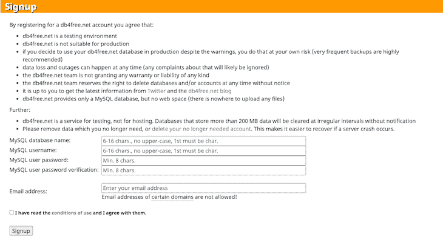
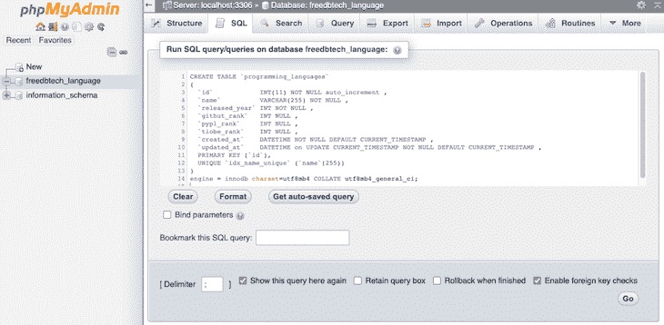
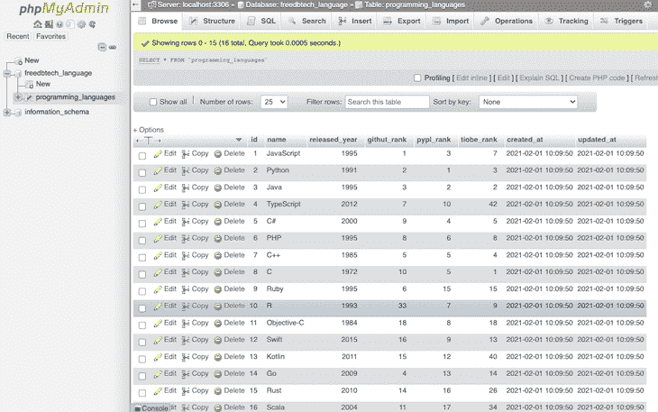
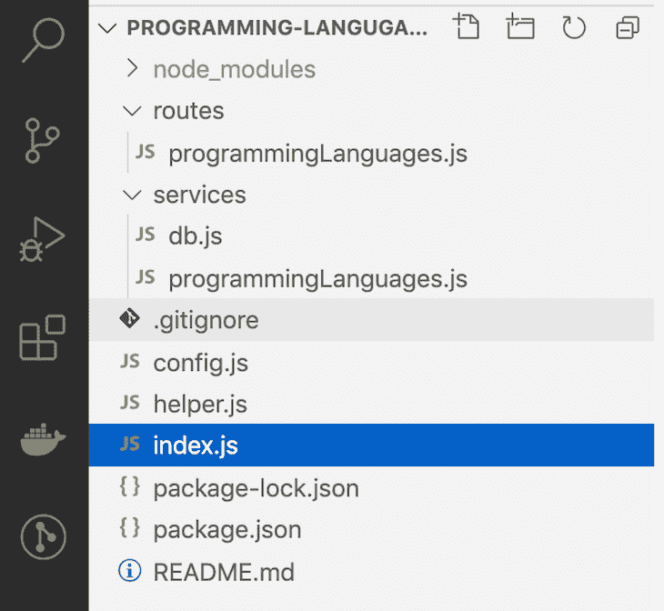
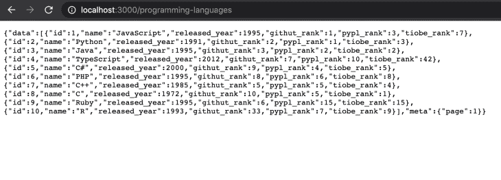

# 用 Node.js、Express 和 MySQL - LogRocket Blog 构建 REST API

> 原文：<https://blog.logrocket.com/build-rest-api-node-express-mysql/>

***编者按**:本教程最后一次更新是在 2022 年 2 月 1 日，用来替换已经过时的工具。*

通常，Node.js 与 MongoDB 和其他 NoSQL 数据库耦合，但是 Node.js 与 MySQL 等关系数据库也能很好地运行。如果你想用 Node.js 为现有数据库编写一个新的微服务，你很可能会使用 [MySQL，](https://www.mysql.com)世界上最流行的开源数据库之一。

在本教程中，我们将学习如何使用 MySQL 作为我们的数据库和 Node.js 作为我们的语言来构建一个 REST API。我们还将使用 Express.js 框架来简化我们的任务。我们的示例 REST API 将跟踪最流行的编程语言。

### 先决条件

要阅读本文，您应该具备以下条件:

*   了解 MySQL 和关系数据库的一般工作方式
*   Node.js 和 Express.js 的基础知识
*   了解什么是 [REST(表述性状态转移)API](https://blog.logrocket.com/nodejs-expressjs-postgresql-crud-rest-api-example/#whatisarestfulapi)以及它们如何工作
*   了解什么是 CRUD(创建、读取、更新、删除)以及它与 HTTP 方法`GET`、`POST`、`PUT`和`DELETE`的关系

本教程中的代码是在安装了节点 14 LTS 的 Mac 上执行的。如果愿意，可以尝试使用 [Node.js、Docker、Docker Compose](https://blog.logrocket.com/node-js-docker-improve-dx/) 来提升开发者体验。你也可以在 [GitHub 库](https://github.com/atharvadeosthale/rest-api-mysql-article)获得完整的代码。我们开始吧！

### 目录

## 什么是 MySQL？

MySQL 是世界上最流行的数据库之一，如果不是最流行的话。根据 2020 年[栈溢出调查](https://insights.stackoverflow.com/survey/2020#technology-databases-all-respondents4)，MySQL 是最受欢迎的数据库，超过 55%的受访者使用它。[社区版](https://www.mysql.com/products/community/)是免费提供的，由一个庞大而活跃的社区支持。

MySQL 是一个功能丰富的关系数据库，于 1995 年首次发布。MySQL 运行在所有主流操作系统上，如 Linux、Windows 和 macOS。由于 MySQL 的特性和成本效益，它被大企业和新创企业广泛使用。

对于我们的示例 REST API，我们将使用免费的 MySQL 服务，而不是设置本地 MySQL 服务器。为了托管我们的测试 MySQL 数据库，我们将使用 db4free.net。

### 在 db4free.net 注册

要启动并运行你的免费 MySQL 8.0 数据库，你可以在[db4free.net](https://db4free.net/)上注册。首先，转到[db4 免费注册页面](https://www.db4free.net/signup.php)，然后通过选择您的数据库名称和用户名来填写所需的详细信息:



点击**注册**，你会收到一封确认邮件。点击电子邮件中的链接确认您的帐户。接下来，在侧边栏上，点击 **phpMyAdmin。**在 phpMyAdmin 登录中，输入您选择的用户名和密码，然后点击 **Go** :


### 创建编程语言表

现在，我们有一个空的数据库。让我们添加`programming_languages`表。首先，点击左边的数据库名称；对我来说，这是**餐馆。然后，单击顶部菜单上的 **SQL** ，这是**结构**之后的第二个链接，并将下面的`CREATE TABLE`代码放入文本区域:**

```
CREATE TABLE `programming_languages`
(
  `id`            INT(11) NOT NULL auto_increment ,
  `name`          VARCHAR(255) NOT NULL ,
  `released_year` INT NOT NULL ,
  `githut_rank`   INT NULL ,
  `pypl_rank`     INT NULL ,
  `tiobe_rank`    INT NULL ,
  `created_at`    DATETIME NOT NULL DEFAULT CURRENT_TIMESTAMP ,
  `updated_at`    DATETIME on UPDATE CURRENT_TIMESTAMP NOT NULL DEFAULT CURRENT_TIMESTAMP ,
  PRIMARY KEY (`id`),
  UNIQUE `idx_name_unique` (`name`(255))
)
engine = innodb charset=utf8mb4 COLLATE utf8mb4_general_ci;

```

点击 **Go** 按钮，如下图:



代码将返回一个绿色的复选框和一条类似于`MySQL returned an empty result set (i.e. zero rows)`的消息。

这样，我们创建了一个名为`programming_languages`的表，有八列和一个名为`id`的主键，这是一个互联网和自动增量。`name`栏是独一无二的，我们还为编程语言添加了`released_year`。我们有三列来输入编程语言的等级，它们来自以下资源:

`created_at`和`updated_at`列存储日期，以跟踪行的创建和更新时间。

### 添加编程语言的演示行

接下来，我们将向我们的`programming_languages`表中添加 16 种流行的编程语言。单击页面顶部的同一个 **SQL** 链接，复制并粘贴下面的代码:

```
INSERT INTO programming_languages(id,name,released_year,githut_rank,pypl_rank,tiobe_rank) 
VALUES 
(1,'JavaScript',1995,1,3,7),
(2,'Python',1991,2,1,3),
(3,'Java',1995,3,2,2),
(4,'TypeScript',2012,7,10,42),
(5,'C#',2000,9,4,5),
(6,'PHP',1995,8,6,8),
(7,'C++',1985,5,5,4),
(8,'C',1972,10,5,1),
(9,'Ruby',1995,6,15,15),
(10,'R',1993,33,7,9),
(11,'Objective-C',1984,18,8,18),
(12,'Swift',2015,16,9,13),
(13,'Kotlin',2011,15,12,40),
(14,'Go',2009,4,13,14),
(15,'Rust',2010,14,16,26),
(16,'Scala',2004,11,17,34);

```

您应该会收到类似“插入了 16 行”的消息。

从我们的三个来源收集的数据由`INSERT`语句收集并批量添加到表中，创建 16 行，每种编程语言一行。稍后，当我们为`GET` API 端点获取数据时，我们将回到这个问题。

如果我们点击左侧可见的 **programming_languages** 表，我们将看到我们刚刚添加的行:



接下来，我们将使用 Node.js 和 MySQL 为 REST API 设置 Express.js。

## 为 REST API 设置 Express.js

要使用 Express.js 服务器设置 Node.js 应用程序，我们将首先为我们的项目创建一个目录:

```
mkdir programming-languages-api && cd programming-languages-api

```

然后，我们可以用`npm init -y`创建一个`package.json`文件，如下所示:

```
{
  "name": "programming-languages-api",
  "version": "1.0.0",
  "description": "",
  "main": "index.js",
  "scripts": {
    "test": "echo \"Error: no test specified\" && exit 1"
  },
  "keywords": [],
  "author": "",
  "license": "ISC"
}

```

要安装 Express，我们将运行`npm i` `express`，在`package.json`文件中添加 Express 作为依赖项。接下来，我们将在`index.js`文件中创建一个瘦服务器。它将在主路径`/`上打印一条`ok`消息:

```
const express = require("express");
const app = express();
const port = 3000;
app.use(express.json());
app.use(
  express.urlencoded({
    extended: true,
  })
);
app.get("/", (req, res) => {
  res.json({ message: "ok" });
});
app.listen(port, () => {
  console.log(`Example app listening at http://localhost:${port}`);
});

```

在上面的代码中有一些重要的事情需要注意。首先，我们将在接下来的步骤中使用内置的 Express JSON 解析器中间件来解析 JSON。我们还将利用`express.urlencoded()`中间件来解析 URL 编码的主体。

如果`PORT`没有作为环境变量提供，我们的应用程序将在`port 3000`上运行。我们可以用`node index.js`运行服务器，点击`[http://localhost:3000](http://localhost:3000)`来查看`{message: "ok"}`的输出。

## REST API 项目结构

我们将按照以下方式构建我们的项目，以便在文件夹中对文件进行逻辑排列:



`config.js`将包含数据库凭证等信息的配置，以及我们对结果分页时希望每页显示的行数。`helper.js`是任何辅助函数的家，比如计算分页的偏移量。

`routes/programmingLanguages.js`文件将作为 URI 和`services/programmingLanguages.js`服务中相应函数之间的粘合剂。这个`services`文件夹将存放我们所有的服务。其中一个是`db.js`，我们用它与 MySQL 数据库对话。

另一个服务是`programmingLanguages.js`，它会有类似`getMultiple`、`create`等方法。获取并创建编程语言资源。URI 和相关服务函数的基本映射将类似于下面的代码:

```
GET /programming-languages → getMultiple()
POST /programming-languages → create()
PUT /programming-languages/:id → update()
DELETE /programming-languages/:id → remove()

```

现在，让我们用分页来编写我们的`GET`编程语言 API。

## `GET`流行的编程语言

为了创建我们的`GET`编程语言 API，我们需要将 Node.js 服务器与 MySQL 连接起来。为此，我们将使用来自 npm 的`mysql2`包，我们可以在项目根目录下用`npm i mysql2`命令安装它。

接下来，我们将在项目的根目录下创建包含以下内容的`config`文件:

```
const config = {
  db: {
    /* don't expose password or any sensitive info, done only for demo */
    host: "db4free.net",
    user: "restapitest123",
    password: "restapitest123",
    database: "restapitest123",
  },
  listPerPage: 10,
};
module.exports = config;

```

因此，我们将使用下面的代码创建`helper.js`文件:

```
function getOffset(currentPage = 1, listPerPage) {
  return (currentPage - 1) * [listPerPage];
}

function emptyOrRows(rows) {
  if (!rows) {
    return [];
  }
  return rows;
}

module.exports = {
  getOffset,
  emptyOrRows
}

```

对于有趣的部分，我们将添加路线并将其链接到服务。首先，我们将连接到数据库，并在数据库的`services/db.js`文件中启用运行查询:

```
const mysql = require('mysql2/promise');
const config = require('../config');

async function query(sql, params) {
  const connection = await mysql.createConnection(config.db);
  const [results, ] = await connection.execute(sql, params);

  return results;
}

module.exports = {
  query
}

```

现在，我们将编写起路径和数据库之间桥梁作用的`services/programmingLanguage.js`文件:

```
const db = require('./db');
const helper = require('../helper');
const config = require('../config');

async function getMultiple(page = 1){
  const offset = helper.getOffset(page, config.listPerPage);
  const rows = await db.query(
    `SELECT id, name, released_year, githut_rank, pypl_rank, tiobe_rank 
    FROM programming_languages LIMIT ${offset},${config.listPerPage}`
  );
  const data = helper.emptyOrRows(rows);
  const meta = {page};

  return {
    data,
    meta
  }
}

module.exports = {
  getMultiple
}

```

之后，我们将在`routes/programmingLanguages.js`中创建`routes`文件，如下所示:

```
const express = require('express');
const router = express.Router();
const programmingLanguages = require('../services/programmingLanguages');

/* GET programming languages. */
router.get('/', async function(req, res, next) {
  try {
    res.json(await programmingLanguages.getMultiple(req.query.page));
  } catch (err) {
    console.error(`Error while getting programming languages `, err.message);
    next(err);
  }
});

module.exports = router;

```

对于我们的`GET`端点的最后一部分，我们需要如下连接`index.js`文件中的路线:

```
const express = require("express");
const app = express();
const port = 3000;
const programmingLanguagesRouter = require("./routes/programmingLanguages");
app.use(express.json());
app.use(
  express.urlencoded({
    extended: true,
  })
);
app.get("/", (req, res) => {
  res.json({ message: "ok" });
});
app.use("/programming-languages", programmingLanguagesRouter);
/* Error handler middleware */
app.use((err, req, res, next) => {
  const statusCode = err.statusCode || 500;
  console.error(err.message, err.stack);
  res.status(statusCode).json({ message: err.message });
  return;
});
app.listen(port, () => {
  console.log(`Example app listening at http://localhost:${port}`);
});

```

我们在入口点`index.js`文件中做了两个重要的修改。首先，我们添加了以下代码:

```
const programmingLanguagesRouter = require('./routes/programmingLanguages');

```

其次，我们将`/programming-languages`路由链接到我们刚刚创建的路由器，如下所示:

```
app.use('/programming-languages', programmingLanguagesRouter);

```

我们还添加了一个错误处理中间件来处理任何错误，并提供适当的状态代码和消息。

添加了`GET`端点后，当我们用`node index.js`再次运行我们的应用程序并使用`[http://localhost:3000/programming-languages](http://localhost:3000/programming-languages)`点击浏览器时，我们将看到如下输出:



根据您在浏览器上安装的扩展，您的输出可能会有所不同。

注意，我们已经为我们的`GET` API 实现了分页，这是可能的，因为`helper.js`中的`getOffset`函数和我们在`services/programmingLanguage.js`中运行`SELECT`查询的方式。尝试`[http://localhost:3000/programming-languages?page=2](http://localhost:3000/programming-languages?page=2)`查看语言 11–16。

## 一种新的编程语言

我们的`POST` API 将允许我们在表格中创建一种新的编程语言。

为了在`/programming-languages`端点中创建一个`POST`编程语言 API，我们将向`service`和`routes`文件添加代码。在服务方法中，我们将从请求体中获取名称、发布年份和其他等级，然后将它们插入到`programming_languages`表中。

将以下代码附加到`services/programmingLanguages.js`文件中:

```
async function create(programmingLanguage){
  const result = await db.query(
    `INSERT INTO programming_languages 
    (name, released_year, githut_rank, pypl_rank, tiobe_rank) 
    VALUES 
    (${programmingLanguage.name}, ${programmingLanguage.released_year}, ${programmingLanguage.githut_rank}, ${programmingLanguage.pypl_rank}, ${programmingLanguage.tiobe_rank})`
  );

  let message = 'Error in creating programming language';

  if (result.affectedRows) {
    message = 'Programming language created successfully';
  }

  return {message};
}

```

确保您还导出了以下函数:

```
module.exports = {
  getMultiple,
  create
}

```

为了能够访问上面的函数，我们需要在`routes/programmingLanguages.js`文件中添加一个连接它的路径，如下所示:

```
/* POST programming language */
router.post('/', async function(req, res, next) {
  try {
    res.json(await programmingLanguages.create(req.body));
  } catch (err) {
    console.error(`Error while creating programming language`, err.message);
    next(err);
  }
});

```

## 更新现有的编程语言

为了更新现有的编程语言，我们将使用`/programming-languages/:id`端点，在这里我们将获得更新语言的数据。为了更新编程语言，我们将根据请求中获得的数据运行`UPDATE`查询。

`PUT`是一个幂等操作，这意味着如果一次又一次地进行相同的调用，它将产生完全相同的结果。为了能够更新现有记录，我们将向编程语言服务添加以下代码:

```
async function update(id, programmingLanguage){
  const result = await db.query(
    `UPDATE programming_languages 
    SET name="${programmingLanguage.name}", released_year=${programmingLanguage.released_year}, githut_rank=${programmingLanguage.githut_rank}, 
    pypl_rank=${programmingLanguage.pypl_rank}, tiobe_rank=${programmingLanguage.tiobe_rank} 
    WHERE id=${id}` 
  );

  let message = 'Error in updating programming language';

  if (result.affectedRows) {
    message = 'Programming language updated successfully';
  }

  return {message};
}

```

确保像我们之前一样导出这个函数:

```
module.exports = {
  getMultiple,
  create,
  update,
};

```

为了将代码与`PUT`端点连接起来，我们将把下面的代码添加到编程语言路由文件中，就在`module.exports = router;`的上面:

```
/* PUT programming language */
router.put('/:id', async function(req, res, next) {
  try {
    res.json(await programmingLanguages.update(req.params.id, req.body));
  } catch (err) {
    console.error(`Error while updating programming language`, err.message);
    next(err);
  }
});

```

现在，我们有能力更新任何现有的编程语言。例如，如果我们看到一个错别字，我们可以更新一种语言的名称。

## `DELETE`一种编程语言

我们将使用带有 HTTP `DELETE`方法的`/programming-languages/:id`路径来添加删除编程语言的功能。继续运行下面的代码:

```
async function remove(id){
  const result = await db.query(
    `DELETE FROM programming_languages WHERE id=${id}`
  );

  let message = 'Error in deleting programming language';

  if (result.affectedRows) {
    message = 'Programming language deleted successfully';
  }

  return {message};
}

```

不要忘记导出这个函数。同样，为了将服务与路线链接起来，我们将把以下代码添加到`routes/programmingLanguages.js`文件中:

```
/* DELETE programming language */
router.delete('/:id', async function(req, res, next) {
  try {
    res.json(await programmingLanguages.remove(req.params.id));
  } catch (err) {
    console.error(`Error while deleting programming language`, err.message);
    next(err);
  }
});

```

## 测试我们的 API

在 Node.js Express 服务器运行了`node index.js`之后，您就可以测试所有的 API 端点了。要创建一种新的编程语言，让我们使用 Dart，运行下面的 cURLcommand。或者，您可以使用 Postman 或任何其他 HTTP 客户端:

```
curl -i -X POST -H 'Accept: application/json' \
    -H 'Content-type: application/json' http://localhost:3000/programming-languages \
    --data '{"name":"dart", "released_year": 2011, "githut_rank": 13, "pypl_rank": 20, "tiobe_rank": 25}'

```

上面的代码将产生以下输出:

```
HTTP/1.1 200 OK
X-Powered-By: Express
Content-Type: application/json; charset=utf-8
Content-Length: 55
ETag: W/"37-3mETlnRrtfrms6wlAjdgAXKq9GE"
Date: Mon, 01 Feb 2021 11:20:07 GMT
Connection: keep-alive

{"message":"Programming language created successfully"}

```

您可以使用 [Express.js 头盔](https://github.com/helmetjs/helmet)移除`X-Powered-By`头并添加其他安全响应头，这将是提高 API 安全性的一个很好的补充。现在，让我们把`Dart`的 GitHut 排名从 13 更新到 12:

```
curl -i -X PUT -H 'Accept: application/json' \
    -H 'Content-type: application/json' http://localhost:3000/programming-languages/17 \
    --data '{"name":"dart", "released_year": 2011, "githut_rank": 12, "pypl_rank": 20, "tiobe_rank": 25}'

```

上面的代码将生成如下所示的输出:

```
HTTP/1.1 200 OK
X-Powered-By: Express
Content-Type: application/json; charset=utf-8
Content-Length: 55
ETag: W/"37-0QPAQsRHsm23S9CNV3rPa+AFuXo"
Date: Mon, 01 Feb 2021 11:40:03 GMT
Connection: keep-alive

{"message":"Programming language updated successfully"}

```

为了测试`DELETE` API，您可以使用下面的 cURL 来删除带有`ID 17`的 Dart:

```
curl -i -X DELETE -H 'Accept: application/json' \
    -H 'Content-type: application/json' http://localhost:3000/programming-languages/17

```

上面的代码将产生以下输出:

```
HTTP/1.1 200 OK
X-Powered-By: Express
Content-Type: application/json; charset=utf-8
Content-Length: 55
ETag: W/"37-aMzd+8NpWQ09igvHbNLorsXxGFo"
Date: Mon, 01 Feb 2021 11:50:17 GMT
Connection: keep-alive

{"message":"Programming language deleted successfully"}

```

如果你更习惯于测试的可视化界面，比如 Postman，你可以[将 cURL 命令](https://www.quora.com/How-can-I-convert-cURL-code-to-Postman)导入 Postman。

## 进一步的考虑

为了在本教程中简单起见，我们保持我们的例子相当简单。然而，如果这是一个真实的 API，而不是一个演示，我强烈推荐以下内容:

*   使用像 [Joi](https://github.com/sideway/joi) 这样的健壮的验证库来精确地验证输入，例如，确保编程语言的名称是必需的，并且在数据库中还不存在。
*   通过将 Helmet.js 添加到 Express.js 来提高安全性
*   使用像 Winston 这样的 Node.js 日志库以更易于管理的方式简化日志
*   对 Node.js 应用程序使用 Docker

## 结论

我们现在有了一个使用 Node.js 和 MySQL 的正常运行的 API 服务器。在本教程中，我们学习了如何在免费服务上设置 MySQL。然后，我们创建了一个 Express.js 服务器，它可以处理各种 HTTP 方法，并将其转换为 SQL 查询。

本教程中的示例 REST API 是构建现实世界中生产就绪的 REST API 的良好起点和基础，您可以在其中实践上述其他注意事项。我希望你喜欢这篇文章，快乐编码！

## 200 只显示器出现故障，生产中网络请求缓慢

部署基于节点的 web 应用程序或网站是容易的部分。确保您的节点实例继续为您的应用程序提供资源是事情变得更加困难的地方。如果您对确保对后端或第三方服务的请求成功感兴趣，

[try LogRocket](https://lp.logrocket.com/blg/node-signup)

.

[](https://lp.logrocket.com/blg/node-signup)[https://logrocket.com/signup/](https://lp.logrocket.com/blg/node-signup)

LogRocket 就像是网络和移动应用程序的 DVR，记录下用户与你的应用程序交互时发生的一切。您可以汇总并报告有问题的网络请求，以快速了解根本原因，而不是猜测问题发生的原因。

LogRocket 检测您的应用程序以记录基线性能计时，如页面加载时间、到达第一个字节的时间、慢速网络请求，还记录 Redux、NgRx 和 Vuex 操作/状态。

[Start monitoring for free](https://lp.logrocket.com/blg/node-signup)

.