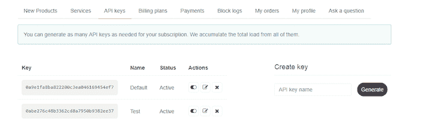

# 如何用 JavaScript 代理构建 REST 客户端

> 原文：<https://blog.logrocket.com/build-rest-client-javascript-proxies/>

元编程是一种编程技术，它允许一个程序像对待自己的数据一样对待另一个程序的数据。例如，一个程序可以被设计成在运行时读取、生成、分析或修改其他程序，以及修改自身。代理是元编程的一个特性，它通过将不同的函数作为参数传递来增强函数的行为，本质上允许开发人员欺骗 JavaScript 语言。

在本文中，我们将了解 JavaScript 代理是如何工作的，然后我们将使用 JavaScript 代理对象构建一个天气预报应用程序。要跟随本教程，您需要 JavaScript 的基础知识。我们开始吧！

## 什么是代理？

代理充当操作对象或`handler`和`target`对象之间的一层，用于拦截和重定义[基本操作或`traps`](https://developer.mozilla.org/en-US/docs/Web/JavaScript/Reference/Global_Objects/Proxy#a_complete_traps_list_example) ，如获取、设置和定义属性。代理对象通常用于记录属性访问、验证、格式化、净化输入等。

`proxy()`对象是`target`对象的包装器，通过它可以在`traps`的帮助下访问和修改`target`对象的属性。代理用于两个主要目标，这两个目标指导如何实际使用代理对象:

*   代理在修改`target`对象的属性之前控制数据
*   当访问`target`对象的属性时，代理执行附加功能

## 为什么应该使用代理？

我们可以使用代理进行以下操作:

*   完全控制数据
*   确保对象或函数的正确行为
*   用于 REST API 调用、数据验证和监控异步函数
*   在类型检查和可撤销引用中
*   为了在 JavaScript 中实现 DOM(文档对象模型)

## 代理是如何工作的？

### 代理语法

```
let proxy = new Proxy(target, handler);

```

`target`和`handler`是传递给`proxy()`对象的两个参数:

*   `target`:您想要代理的原始对象
*   `handler`:包含控制`target`对象行为的方法

`target`对象是被包装的对象，`handler`是在`target`对象上使用的函数，`traps`方法在`handler`内部使用，对`target`对象执行操作。

## `traps`方法

`traps`是通过`proxy()`对象在`target`对象上执行一些动作时触发的处理程序方法。`traps`方法可以从 RESTful API 中检索数据，然后用于验证、格式化和存储 RESTful 数据响应到`target`对象中。让我们简单看看一些常见的`traps`方法，以及我们如何使用`traps`来验证 RESTful API 响应:

### `set()`陷阱

每当使用`proxy()`对象修改`target`对象的属性时，就会触发`set()`陷阱。它可以用来控制`target`对象的行为。

让我们学习如何使用`set()`陷阱从 API 获取数据，然后在将数据存储到`target`对象之前验证响应数据。作为一个例子，我们将演示如何在 JavaScript 代理对象中使用 [genderize.io API](https://genderize.io/) ，这是一个免费的 API，它使用现有的人口比例统计预测给定姓名的男性或女性性别关联:

```
let person = {
        name: "",
             gender: "",
        probability: "",
        count: ""
}

const handler = {
   set(target, property, value) {

     fetch('https://api.genderize.io/?name='+value)
     .then(response => (response.json()))
    .then(data => {
     if (typeof value === 'string') {
       if(data.name !=='undefined'){
            target['name']=data.name
            target['gender']=data.gender
            target[probability]=data.probability
            target[count]=data.count
       }else {
          target['name']=''
          target['gender']=''
          target[probability]=''
          target[count]=''
      }
 }else{
               throw new TypeError('The value of "name" must be a string.')
 }
    });

    }
};

const proxyPerson = new Proxy(person, handler);
proxyPerson.name ="popoola"

```

在上面的例子中，`set()`陷阱用于验证名称，获取性别，然后用我们从 API 中检索的数据更新`person`对象的属性。

### `get()`陷阱

当通过`proxy()`对象访问`target`对象的属性时，触发`get()`陷阱。使用这个陷阱的方法有很多；首先，我们可以用它来限制对某些属性的访问，或者只返回部分值。

让我们演示如何使用`get()`陷阱从`target`对象返回一个自定义值:

```
let person = {
                 name: "",
                  gender: "",
                  probability: "",
                  count: ""
}

const handler = {
     get(target, property) {
         if(property==='userDetails'){
                return`${target.name} is a ${target.gender}`
         }elseif(property==='userInfo'){
                If (target.name==="Male"){
Return  "the user is a man"
              }else{
Return  " the user is a woman"
         }
         }else{

                return target[property]
        }

       console.log(target[property])
     return target[property];

    }
}

const proxyPerson = new Proxy(person, handler);

console.log(proxyPerson.userDetails);
console.log(proxyPerson.gender);

```

`person`对象没有属性`userDetails`和`userInfo`。因此，我们使用`get()`陷阱根据`person`对象的属性返回一个定制值。

### 更多`traps`

下面的列表包括从`proxy()`对象中可用的其他`traps`:

*   `construct`:新运算符的陷阱用法
*   `getPrototypeOf`:捕获对`[[GetPrototypeOf]]`的内部呼叫
*   `setPrototypeOf`:将呼叫拦截到`Object.setPrototypeOf`
*   `isExtensible`:将呼叫拦截到`Object.isExtensible`
*   `preventExtensions`:将呼叫拦截到`Object.preventExtensions`
*   `getOwnPropertyDescriptor`:将呼叫拦截到`Object.getOwnPropertyDescriptor`

## 使用代理构建天气预报应用程序

### 要求

要获取您的 API 密钥，请访问`[https://openweathermap.org/api](https://openweathermap.org/api)`并注册。如果您点击 **API 键**，您应该会看到类似下图的内容:



为了演示如何使用 JavaScript 代理对象构建 REST 客户端应用程序，让我们创建一个天气预报应用程序，它允许用户搜索任何地址，然后提供该地址的天气详细信息。

### 正在创建`index.html`

创建`index.html`页面，并向其中添加以下 HTML 代码:

```
<!DOCTYPE html>
<html>
<head>
<title></title>
</head>
<style>
table {
  font-family: arial, sans-serif;
  border-collapse: collapse;
  width: 100%;
}

td, th {
  border: 1px solid #dddddd;
  text-align: left;
  padding: 8px;
}

tr:nth-child(even) {
  background-color:#dddddd;
}
</style>

<body>
<h1 style="text-align:center;"> Weather forecast </h1>
<div style="float:left;width:300px;height:200px;background-coor:red;margin-left:50px">        <label>enter city name</label>
          <input type="text" value="" id="city" onchange="check('state')"><br>
            <label>enter state name</label>
          <input type="text" value="" id="state"onchange="check('country')"><br>
          <label>enter country name</label>
            <input type="text" value="" id="country"onchange="{proxyPerson.name ='load'}"> <br>

                  <input type="submit" id="load" onclick ="{proxyPerson.name}" value="weather forecast">
</div>
<div style="float:right;width:300px;height:200px;background-coor:red;margin-right:50px;">

<table>
  <tr>
    <td>location</td>
    <td><span id="location"></span></td>
  </tr>
  <tr>
  <td>Status</td>
  <td><span id="status"></span></td>
  </tr>
  <tr>
  <td>Description</td>
  <td><span id="description"></span></td>
  </tr>
  <tr>
  <td>Pressure</td>
  <td><span id="pressure"></span></td>
  </tr>
  <tr>
  <td>Humidity</td>
  <td><span id="humidity"></span></td>
  </tr>
  <tr>
  <td>temperature </td>
  <td><span id="temperature"></span></td>
  </tr>
</table>
</div>
</body>

<script type="text/javascript" src="proxy.js"></script>
</html>

```

上面的代码是接口；它有三个输入字段，用户将输入一个`city`、`state`和`country`来检索城市的天气预报。

### 正在创建`proxy.js`

现在我们的接口已经准备好了，让我们创建一个`proxy.js`文件，它将包含应用程序的所有功能。将以下代码添加到`proxy.js`:

```
function check(id){
document.getElementById(id).value ="";
}

let location = {
    name: "",
    lat: "",
    lon: ""
}

const handler = {

   set(target, property, value) {

       let apikey  = '0abe276c48b3362cd8a7950b9382ee37'
       let city = document.getElementById("city").value;
       let state = document.getElementById("state").value;
       let country = document.getElementById("country").value;

       if(city!="" && state!="" && country !=""){

     fetch('https://api.openweathermap.org/geo/1.0/direct?q='+city+','+state+','+country+'&limit=1&appid='+apikey )
     .then(response => (response.json()))
    .then(data => {

       target\['name'] = data[0\]['name']
       target\['lat'] = data[0\]['lat']
       target\['lon'] = data[0\]['lon']
       console.log(target['lat'])

    });

     }else {

     alert("please enter a valid location ")
     }
    }, 

    get(target, property) {
    let apikey  = '0abe276c48b3362cd8a7950b9382ee37'
    let lat = target['lat'];
    let lon = target['lon'];
    if(lat!=""&& lon!=""){
    fetch('https://api.openweathermap.org/data/2.5/weather?lat='+lat+'&lon='+lon+'&appid='+apikey)
    .then(response => (response.json()))
    .then(data => {
    document.getElementById("location").innerHTML = data['name'];
   document.getElementById("description").innerHTML = data\['weather'\][0]['description']
   document.getElementById("status").innerHTML =  data\['weather'\][0]['main']
   let  icon = data\['weather'\][0]['icon']

   document.getElementById("temperature").innerHTML = data\['main'\]['temp']
   document.getElementById("pressure").innerHTML =  data\['main'\]['pressure']
    document.getElementById("humidity").innerHTML = data\['main'\]['humidity']

    });

    }else{
    alert("please enter a valid location")
    }
    }

};
const proxyPerson = new Proxy(location, handle)

```

当创建`proxyPerson`对象时，我们传入`location`对象作为我们想要代理的原始对象。然后我们传入一个`handler`对象作为第二个参数，它控制`location`对象的行为。

我们使用`set()`陷阱从城市中检索用户的地址，以及州和国家的输入字段。然后，我们向`openweathermap.org`端点发送请求，以获取地址的`latitude`和`longitude`。最后，我们用城市`name`、`latitude`和`longitude`更新`location`对象的属性。我们使用`get()`陷阱从`location`对象获取`latitude`和`longitude`，然后从`openweathermap.org`端点获取天气细节，最后在页面上显示天气细节。

## 结论

在本文中，我们学习了什么是代理以及它们是如何工作的，探索了一些典型的代理陷阱，最后使用 JavaScript 代理对象构建了一个天气预报应用程序。希望您能更好地理解 JavaScript 中的代理对象如何改进您的代码。我希望你喜欢这个教程！如果你有任何问题，请留下评论。

## 通过理解上下文，更容易地调试 JavaScript 错误

调试代码总是一项单调乏味的任务。但是你越了解自己的错误，就越容易改正。

LogRocket 让你以新的独特的方式理解这些错误。我们的前端监控解决方案跟踪用户与您的 JavaScript 前端的互动，让您能够准确找出导致错误的用户行为。

[](https://lp.logrocket.com/blg/javascript-signup)

LogRocket 记录控制台日志、页面加载时间、堆栈跟踪、慢速网络请求/响应(带有标题+正文)、浏览器元数据和自定义日志。理解您的 JavaScript 代码的影响从来没有这么简单过！

[Try it for free](https://lp.logrocket.com/blg/javascript-signup)

.