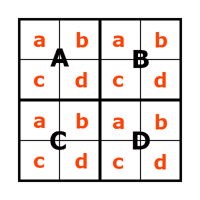

# 如何构建丰富的、可访问的 JavaScript 界面

> 原文：<https://blog.logrocket.com/build-rich-accessible-javascript-interfaces/>

所以你是一个 JavaScript 高手，几乎可以构建任何东西——但是每个人都可以使用它吗？在本文中，我们将研究一些制作丰富的、可访问的 JavaScript 界面的方法。我们将通过构建一个简单的[数独](https://en.wikipedia.org/wiki/Sudoku)谜题来说明我们的策略，这个谜题适用于所有人，甚至是盲人或弱视者。

## 目录

## 从一开始就规划可访问性

改进界面的可访问性可能是困难且耗时的；如果您从一开始就计划好可访问性，那么您总是会得到更好的结果。你可能听说过缩写词 POUR，这是一个很好的方法来规划可访问性。

POUR 代表:

*   可感知:所有用户都应该能够感知界面。视觉元素应该有等价的文本选择，配色方案应该对色觉不好的人友好
*   可操作:所有用户都应该能够操作界面。确保一切都可以在没有鼠标的情况下操作，并且触摸或点击目标对于所有用户来说都足够大
*   可理解的:界面应该尽可能简单和直观
*   健壮:界面应该能够在当前所有的浏览器和辅助技术上工作。这可能意味着只使用成熟的技术，而不是那些提供“最新最棒”功能的技术

对于像数独这样的基于网格的游戏，关于可访问性的最大挑战是使界面可理解。数独游戏要求玩家知道每个格子中输入了哪些数字。为了便于访问，数独游戏需要将这些信息传达给可能看不到游戏板的用户。

一个有 81 个格子的经典九位数数独游戏对大多数人来说太大了，如果棋盘不可见的话，他们就无法解决。所以，我的第一个决定是简化事情，用 16 个单元格做一个四位数的数独。

接下来，需要有一个一致的方式来描述游戏板——一个符号系统。我的第一直觉是使用简单的 XY 坐标系，就像在国际象棋中一样。然而，数独网格比棋盘更复杂，它实际上是一个更大的网格中的一组网格。

以下是我选定的符号系统:



Notation system for accessible Sudoku.

游戏板由排列成 2×2 网格的四个方块组成。

顶行中的正方形被指定为正方形 A 和正方形 b。底行中的正方形被指定为正方形 C 和正方形 d。

每个正方形包含四个排列成 2×2 网格的单元格。每个正方形的顶行中的单元格被指定为单元格 a 和单元格 b。底行中的单元格被指定为单元格 c 和单元格 d。

这种符号可以描述棋盘上的任何单元格，并传达玩家解谜所需的位置信息。因此，如果我们加入一些机制来宣布屏幕阅读器用户在棋盘上的当前位置，并在相应的行、列和方块中列出数字，这个游戏应该是可以理解的。

## 牢记浇注原则的建筑

现在是时候开始建造了，记住倒酒的原则。构建可访问界面的一个关键策略是避免重复发明轮子。如果一个历史悠久的标准 HTML 控件可以用来做一些事情，那么就根据它的规范来使用它，应用 CSS 来创建任何想要的视觉效果。

这个微型数独游戏由 16 个格子组成，每个格子可以容纳一个数字。所以，我用了 16 个`<input type="number>`元素。这些元素实际上是为这项工作而设计的，另外它们还有一个`readonly`属性来标记需要包含的固定值单元格，以使数独可解。

我使用`<div>`标签将单元格分成正方形，使用 [CSS 网格布局](https://developer.mozilla.org/en-US/docs/Web/CSS/CSS_Grid_Layout)来组织事情。使用 CSS 网格布局代替 HTML `<table>`允许我根据我的符号系统(Aa、Ab、Ac、ad、Ba、Bb 等)对代码中的单元格进行排序。).页面的 tab 键顺序与其底层结构相协调，因此当键盘用户使用 **tab 键**从一个`<input>`移动到另一个【】时，这将有助于保持界面的可理解性。

```
<div class="board">
  <div class="square">
    <input type="number" min="0" max="4" length="1" value="">
    <input type="number" min="0" max="4" value="2" readonly>
    <input type="number" min="0" max="4" value="">
    <input type="number" min="0" max="4" value="">
  </div>
  <div class="square">
    <input type="number" min="0" max="4" value="3" readonly>
    <input type="number" min="0" max="4" value="">
    <input type="number" min="0" max="4" value="">
    <input type="number" min="0" max="4" value="1" readonly>
  </div>
  <div class="square">
    <input type="number" min="0" max="4" value="2" readonly>
    <input type="number" min="0" max="4" value="">
    <input type="number" min="0" max="4" value="">
    <input type="number" min="0" max="4" value="4" readonly>
  </div>
  <div class="square">
    <input type="number" min="0" max="4" value="">
    <input type="number" min="0" max="4" value="">
    <input type="number" min="0" max="4" value="1" readonly>
    <input type="number" min="0" max="4" value="">
  </div>
</div>
```

```
*, *:before, *:after {
  box-sizing: border-box;
}
body {
  font-size: 1.25rem;
  line-height: 1.35;
}
.board {
  width: 40vh;
  max-width: 90vw;
  height: 40vh;
  max-height: 90vw;
  padding: 0;
  border: 2px solid black;
  display: grid;
  grid-template: repeat(2,1fr) / repeat(2,1fr);
}
.square {
  width: 100%;
  height: 100%;
  margin: 0;
  padding: 0;
  border: 2px solid black;
  display: grid;
  grid-template: repeat(2,1fr) / repeat(2,1fr);
}
.square input {
  display: block;
  color: black;
  width: 100%;
  height: 100%;
  margin: 0;
  padding: 0;
  text-align: center;
  font-size: 7vh;
  border: 1px solid black;
  -moz-appearance: textfield;
}
/* Hide HTML5 Up and Down arrows. */
.square input::-webkit-outer-spin-button, .square input::-webkit-inner-spin-button {
  -webkit-appearance: none;
  margin: 0;
}

```

## 选择颜色和尺寸

web 界面在可访问性方面面临的一些常见问题是文本太小，UI 颜色没有提供足够的对比度，不容易看到。

就大小而言，一个好的经验法则是文本显示的有效字体大小不小于 16 [CSS 像素](https://hacks.mozilla.org/2013/09/css-length-explained/)(不同于设备像素)。对于数独游戏，我使用了最少 20 个像素(指定为`1.25rem`，其中`1rem`是 16 个像素)，并且还将标准的`line-height`增加到 1.35，以使内容间隔更大，更容易阅读。

我已经使用`vh`单位(`1vh`是视口高度的 1%)指定了游戏板的整体大小，试图使它尽可能大，同时也保持游戏控件在同一个视口中可见。

这个游戏主要使用黑白来最大化对比度。然而，我还需要显示哪些单元格是只读的，我想用颜色来显示键盘焦点当前在游戏板中的位置，并(可选地)高亮显示正确和不正确的单元格。

这带来了另一个常见的问题——处理色觉低下。用绿色来突出正确的细胞，用红色来突出不正确的细胞，这似乎是本能的，但对于大多数色觉低下的人来说，红色和绿色是非常差的选择。

相反，我选择使用天蓝色来指定正确的单元格，红紫色来指定不正确的单元格，黄色来突出显示位置。确切的色调是从[黄调色板](https://www.nature.com/articles/nmeth.1618)中选择的。对于只读(`readonly`)单元格，我在深灰色背景上使用了白色文本。所有这些颜色组合也提供了足够的对比度，使用 [WebAIM 对比度检查器](https://webaim.org/resources/contrastchecker/)进行测量。

```
.correct {
  background-color: #56B4E9;
}
.incorrect {
  background-color: #CC79A7;
}
.square input:focus {
  background-color: #F0E442;
}
.square input:read-only {
  background-color: #333;
  color: white;
}

```

## 增加对 WAI-ARIA 的援助

它可能还没有发挥作用，但我们现在有了一个看起来像微型数独游戏的东西。使用鼠标，我们可以轻松地点击在网格的每个单元格中输入数字，而且只使用键盘也可以。

我们仍然需要能够看到棋盘，以便在其中导航，这对视力有限或没有视力的人来说没有用。幸运的是，Web Accessibility Initiative-Accessible Rich Internet Applications([WAI-ARIA](https://developer.mozilla.org/en-US/docs/Learn/Accessibility/WAI-ARIA_basics))可以提供更多的帮助。

属性用于向表单元素添加额外的文本，当用户关注这些文本时，屏幕阅读器软件会大声读出这些文本。我已经使用这个属性为每个单元格添加了符号。

```
<div class="board">
    <div aria-label="Square A" class="square">
      <input aria-label="Square A, Cell A." type="number" min="0" max="4" length="1" value="">
      <input aria-label="Square A, Cell B. The value of this cell is fixed." type="number" min="0" max="4" value="2" readonly>
      <input aria-label="Square A, Cell C." type="number" min="0" max="4" value="">
      <input aria-label="Square A, Cell D." type="number" min="0" max="4" value="">
    </div>
    ...
</div>

```

我不需要将单元格的值添加到`aria-label`中，因为该值是默认读出的。但是，我碰巧知道有些屏幕阅读器不会通知用户什么时候`<input>`元素是只读的，所以我包含了这个信息。

## 添加交互性

现在是时候让游戏真正有所作为了。

* * *

### 更多来自 LogRocket 的精彩文章:

* * *

我们希望能够:

*   检查游戏板是否正确完成
*   向在完成拼图时遇到困难的玩家显示完整的解决方案
*   从头开始重新开始游戏
*   让玩家选择突出显示哪些单元格是正确的，哪些是不正确的

为了实现这些目标，我们需要在某个地方存储每个单元格的正确答案，并在游戏板下面添加控件来触发每个动作。

有几种方法可以存储正确答案。我选择给每个单元格添加一个`data`属性，如下所示:

```
<input aria-label="Square A, Cell A." data-correct="1" type="number" min="0" max="4" length="1" value="">

```

游戏控件需要是可访问的，所以我将应用和以前一样的设计原则，并以`<button>`和`<input type="checkbox">`元素的形式使用普通的 HTML。

每个元素都需要一个唯一的`id`，这样我就可以将事件监听器附加到元素上。我将使用标准的`<label>`元素来确保高亮切换复选框是可访问的。我还将添加一个空的`<div>`，我可以用它向玩家显示公告。

```
<div class="controls">
    <label><input id="highlight" type="checkbox">&nbsp;HIGHLIGHT</label>
    <button id="check">CHECK YOUR ANSWER</button>
    <button id="show">SHOW SOLUTION</button>
    <button id="restart">RESTART</button>
</div>
<div id="announcement-all-users"></div>

```

四个简单的 JavaScript 函数是使游戏在基本水平上运行所需要的:

```
let lang = "en";
const messages = {
  en: {
    boardCorrect: "Congratulations, you completed the Sudoku correctly!",
    boardIncorrect: "Hmmm... Not quite correct! Try again. Check 'HIGHLIGHT' to see where you went wrong."
  },
  announcementAllUsersDisplayed: false
}

function highlightCells(e){
  document.querySelectorAll('.square input:read-write').forEach( (cell) => { // toggle correct and incorrect classes for each non read-only cell
    if(document.querySelector('#highlight').checked){
      if(cell.value === cell.dataset.correct){
        cell.classList.add("correct");
        cell.classList.remove("incorrect");
      } else {
        cell.classList.add("incorrect");
        cell.classList.remove("correct");
      }
    } else {
      cell.classList.remove("correct","incorrect");
    }  
  } );
}
document.querySelector('#highlight').addEventListener('change', highlightCells );

function checkAnswer(e) {
  let allCorrect = true;
  document.querySelectorAll('.square input').forEach( (cell) => { // check each cell to see if it is correct
    if( cell.value !== cell.dataset.correct){
      allCorrect = false;
    }  
  } );
  // make general announcement of success/failure
  if(allCorrect){ 
    document.querySelector('#announcement-all-users').innerHTML = messages[lang].boardCorrect;
  } else {
    document.querySelector('#announcement-all-users').innerHTML = messages[lang].boardIncorrect;    
  }
  messages.announcementAllUsersDisplayed = true;  
}
document.querySelector('#check').addEventListener('click', checkAnswer );

function showSolution(e){
  if(messages.announcementAllUsersDisplayed){// remove any existing general annoucements
    document.querySelector('#announcement-all-users').innerHTML = "";
    messages.announcementAllUsersDisplayed = false;
  }
  document.querySelectorAll('.square input').forEach( (cell) => { // set the value of each cell to the correct value
    cell.value = cell.dataset.correct;
  } );  
}
document.querySelector('#show').addEventListener('click', showSolution );

function restartGame(e){
  if(messages.announcementAllUsersDisplayed){ // remove any existing general annoucements
    document.querySelector('#announcement-all-users').innerHTML = "";
    messages.announcementAllUsersDisplayed = false;
  }
  document.querySelectorAll('.square input:read-write').forEach( (cell) => { // reset each non read-only cell to be empty
    if(!cell.classList.contains("readonly")){
      cell.value = "";
    }
  } );  
}
document.querySelector('#restart').addEventListener('click', restartGame );

```

我们现在有了一个可感知的、可操作的、健壮的数独游戏，但是我们仍然需要做一些工作来使它完全可理解。

此外，一些更新可以使游戏更容易操作。例如，`highlightCells`函数只在视觉层面上起作用。为了对屏幕阅读器用户有用，我们需要稍微扩展一下。游戏板的每个`<input>`元素都已经有了一个`aria-label`属性，所以当高亮复选框被切换时，我们可以操作它来添加或删除正确或不正确的信息:

```
let lang = "en";
const messages = {
  en: {
    cellCorrect: "This cell is correct",
    cellIncorrect: "This cell is incorrect",
    boardCorrect: "Congratulations, you completed the Sudoku correctly!",
    boardIncorrect: "Hmmm... Not quite correct! Try again. Check 'HIGHLIGHT' to see where you went wrong."
  },
  announcementAllUsersDisplayed: false
}

function highlightCells(e){
  if(document.querySelector('#highlight').checked){
    document.querySelector('#highlight-help').classList.remove('v-hidden');
  } else {
    document.querySelector('#highlight-help').classList.add('v-hidden');    
  }
  document.querySelectorAll('.square input:read-write').forEach( (cell) => {
    let ariaLabelSplit = cell.ariaLabel.split('.');
    if(document.querySelector('#highlight').checked){
      if(cell.value === cell.dataset.correct){
        cell.classList.add("correct");
        cell.classList.remove("incorrect");
        cell.ariaLabel = ariaLabelSplit[0] + ". " + messages[lang].cellCorrect;
      } else {
        cell.classList.add("incorrect");
        cell.classList.remove("correct");
        cell.ariaLabel = ariaLabelSplit[0] + ". " + messages[lang].cellIncorrect;
      }
    } else {
      cell.classList.remove("correct","incorrect");
      cell.ariaLabel = ariaLabelSplit[0];
    }  
  } );
}
document.querySelector('#highlight').addEventListener('change', highlightCells ); 

```

高亮显示功能现在只需要很小的调整就可以为每个人工作了。尽管如此，仍缺少一大块拼图(请原谅我的双关语)。

当每一行、每一列和每一个方块恰好包含一次数字 1 到 4 时，数独游戏就解决了。因此，屏幕阅读器用户需要一种快速简单的非可视化方法来找出特定行、列或方块中的数字。在这个项目中，我们第一次需要为这个用户群在游戏中加入额外的功能。

我决定通过在游戏中添加一个由键盘快捷键触发的`'read'`功能来解决这个问题。这就是`[aria-live](https://developer.mozilla.org/en-US/docs/Web/Accessibility/ARIA/Attributes/aria-live)`属性的用武之地。如果我们将这个属性添加到一个元素中(例如，一个简单的`<div>`)，那么当这个元素的内容改变时，它将被屏幕阅读器软件读出。

通过用 JavaScript 改变元素的内容，这个函数可以用来向屏幕阅读器用户发出通知。我们将为现有的 general announcement 元素添加一个`aria-live`属性，并为专门面向屏幕阅读器用户的消息元素添加另一个属性。在游戏的最终版本中，这最后一条消息可能会出现在屏幕之外。

```
<div id="announcement-sr-only" aria-live="polite"></div>
<div id="announcement-all-users" aria-live="polite"></div>

```

`"polite"`值意味着当 live 元素的内容发生变化时，屏幕阅读器将在阅读公告之前完成当前正在阅读的内容。这对于数独游戏来说效果很好，但是如果我们需要提醒用户一些更紧急的事情，我们可以设置`aria-live="assertive"`,这将导致我们的公告被直接读出。

下面是阅读功能在数独游戏中的工作原理:

*   当用户的键盘焦点在游戏的一个单元格中时，他们按下 **R** (read)，然后是 **R** (row)、 **C** (column)或 **S** (square)
*   当前行、列或方块的内容摘要显示在`announcement-sr-only`元素中

对于屏幕阅读器来说，键盘快捷键可能有点像雷区，因为许多键已经分配了快捷键，并且这些分配可能会根据屏幕阅读器的模式而改变。所以尽量少用键盘快捷键，只在需要的地方将监听器附加到元素上，并做大量的测试！

为了让 reading 函数工作，我添加了一个`id`属性来帮助我遍历单元格，一个`data-id`元素用于遍历正方形，还有一个额外的类给`readonly`单元格，这样我就可以很容易地定位这些单元格。

```
<div class="board">
    <div data-id="A" class="square">
      <input id="11" data-id="A" aria-label="Square A, Cell A." data-correct="1" type="number" min="0" max="4" length="1" value="">
      <input id="12" data-id="B" aria-label="Square A, Cell B. The value of this cell is fixed." data-correct="2" type="number" min="0" max="4" value="2" class="readonly">
      <input id="21" data-id="C" aria-label="Square A, Cell C." data-correct="4" type="number" min="0" max="4" value="">
      <input id="22" data-id="D" aria-label="Square A, Cell D." data-correct="3" type="number" min="0" max="4" value="">
    </div>
    <div data-id="B" class="square">
      <input id="13" data-id="A" aria-label="Square B, Cell A. The value of this cell is fixed." data-correct="3" type="number" min="0" max="4" value="3" class="readonly">
      <input id="14" data-id="B" aria-label="Square B, Cell B." data-correct="4" type="number" min="0" max="4" value="">
      <input id="23" data-id="C" aria-label="Square B, Cell C." data-correct="2" type="number" min="0" max="4" value="">
      <input id="24" data-id="D" aria-label="Square B, Cell D. The value of this cell is fixed." data-correct="1" type="number" min="0" max="4" value="1" class="readonly">
    </div>
    ...
</div>

```

下面的代码演示了我如何设置读取行的交互性。读取列和正方形的过程是相似的。

```
const size = 4;
let lang = "en";
const messages = {
  en: {
    cellValue: "The value of this cell is ",
    cellEmpty: "This cell is empty.",
    cellEmptyShort: "Empty",
    cellCorrect: "This cell is correct",
    cellCorrectShort: "correct",
    cellIncorrect: "This cell is incorrect",
    cellIncorrectShort: "incorrect",
    cellFixedShort: "fixed value",
    boardCorrect: "Congratulations, you completed the Sudoku correctly!",
    boardIncorrect: "Hmmm... Not quite correct! Try again. Check 'HIGHLIGHT' to see where you went wrong.",
    reading: "Reading",
    currentRow: "current row",
    currentColumn: "current column",
    currentSquare: "square"
  },
  announcementScreenreaderOnlyDisplayed: false,
  announcementAllUsersDisplayed: false
}

let keyboardNavCapture = 0;
let capturedKeys = "";

document.querySelector('.board').addEventListener('keydown', (e) => { // The keyboard focus needs to be within the gameboard for the shortcut to function 
  if (e.defaultPrevented) {
    return; // Do nothing if the event was already processed. This helps avoids interfering with existing screen reader keyboard shortcuts
  }
  if(e.key === "Escape"){ // allow the user to cancel a partially captured action
    keyboardNavCapture = 0;
    capturedKeys = "";
  } else if(keyboardNavCapture === 0){    
    if(e.key === "r" || e.key === "R"){ // READ action. Capture the next key press to determine what to read
      keyboardNavCapture = 1;
      capturedKeys = "R";
      e.preventDefault();
    }
  } else {
    capturedKeys += e.key.toUpperCase();
    keyboardNavCapture = keyboardNavCapture - 1;
    e.preventDefault();
    if(keyboardNavCapture == 0){
      let actionType = capturedKeys[0];
      let actionDetails = capturedKeys.substring(1); 
      capturedKeys = "";
      if(actionType === "R"){ // READ action
        let activeCellId = parseInt(document.activeElement.id);
        if( (actionDetails === "R" || actionDetails === "C" || actionDetails === "S") && !Number.isNaN(activeCellId) ){
          let row = parseInt(document.activeElement.id[0]) * 10;
          let column = parseInt(document.activeElement.id[1]);
          let cellValue = "";
          let announcementScreenreaderOnly = messages[lang].reading + " ";
          switch (actionDetails){
            case "R": // Read out the current row
              announcementScreenreaderOnly += messages[lang].currentRow + ":";
              for (let col = 1; col < (size + 1); col++) {
                cellValue = document.getElementById("" + (row + col)).value;
                if(cellValue === ""){
                  cellValue = messages[lang].cellEmptyShort;
                } else if(document.getElementById("" + (row + col)).classList.contains('readonly')){
                  cellValue += " (" + messages[lang].cellFixedShort + ")";
                } else if(document.querySelector('#highlight').checked){
                  if(cellValue === document.getElementById("" + (row + col)).dataset.correct){
                    cellValue += " (" + messages[lang].cellCorrectShort + ")";  
                  } else {
                    cellValue += " (" + messages[lang].cellIncorrectShort + ")";
                  }                  
                }
                announcementScreenreaderOnly += " " + cellValue;
                if(col < size){
                  announcementScreenreaderOnly += ",";
                }
              }
              break;
              // switch statement continues for reading columns C and squares S
          }
          document.querySelector("#announcement-sr-only").innerText = announcementScreenreaderOnly;
        }
      }
    }
  }

});

```

构建了键盘导航的基础之后，我还为每个游戏控件添加了键盘快捷键。这些由后面跟有代表控制的字符的 **C** 键触发。比如 **CR** 重启游戏 **CS** 揭晓解决方案。

我还加了一句“我在哪里？”功能(由 **W** 键触发)和“go”功能(由 **G** 键触发，后跟特定单元格的符号)，允许在游戏板上快速移动。你可以在最终的[代码笔](https://codepen.io/MeesterPaul/pen/QWQEOeQ)中看到这些是如何实现的。

## 测试测试测试！

理论上，我们现在应该有一个完全可访问的数独难题！尽管如此，实践和理论并不总是一致的，所以用几种方法测试游戏是很重要的。

作为第一项测试，请始终检查界面是否可以在没有鼠标的情况下完全运行。我们的游戏成功通过了！我们可以使用**标签**键或键盘快捷键在网格中移动，游戏控件也可以使用键盘触发。

***注意**，游戏的任何最终版本都需要足够的文档来告知用户任何键盘快捷键*

通过了基本的仅使用键盘的测试之后，是时候继续使用屏幕阅读器进行测试了。

Windows PC 上的 NVDA 是开发者测试的可靠选择，而且是免费的。如果你有足够的资金来获取副本，你也应该使用 [JAWS](https://www.freedomscientific.com/products/software/jaws/) 。 [WebAIM 的概述](https://webaim.org/articles/nvda/)涵盖了使用 NVDA 进行测试所需的基础知识。如果你在 Mac 上，并且有 VoiceOver 屏幕阅读器可用，WebAIM 有一个很好的介绍[使用 VoiceOver 来评估 Web 可访问性](https://webaim.org/articles/voiceover/)。

***注意:**，在 CodePen 上使用屏幕阅读器相当棘手；将代码导出并放在您自己的服务器上进行测试会得到更好的结果*

我用 NVDA 测试了数独游戏，几乎一切正常。然而，有一个意想不到的项目。原来，当 NVDA 进入一个`readonly`细胞时，它会从`'focus'`模式切换回`'browse'`模式。这种模式切换取消了键盘快捷键，使得游戏使用起来非常不直观。尽管发现这个错误令人恼火，但它清楚地表明了测试的必要性。

我试着用`disabled`属性来代替，但是 NVDA 甚至不把键盘焦点放在禁用的单元格上，所以没用。相反，我修改了代码，完全删除了`readonly`属性，然后使用 JavaScript 在这些单元格上强制执行只读行为。

在理想情况下，我们的数独游戏现在应该在其他屏幕阅读器上进行测试，并且应该从真实用户那里获得反馈。只要有可能，您应该总是将这最后一步包含在您的开发过程中。

## 结论

网络上的一切都可以被访问。通过从一开始就规划可访问性，并在整个设计和构建过程中遵循 POUR 原则，您可以创建每个人都可以使用的丰富的 JavaScript 界面。

在 CodePen 或这个[独立页面](https://puzzletrail.games/puzzles/a9-sudoku/)上为自己检查最终代码[(用于屏幕阅读器测试)。我还包括了一些额外的控件，这样你就可以在不使用 NVDA 的情况下模拟屏幕阅读器输出，并了解如果你部分失明或完全失明，游戏会如何运行。让我知道你的想法！](https://codepen.io/MeesterPaul/pen/QWQEOeQ)

## 通过理解上下文，更容易地调试 JavaScript 错误

调试代码总是一项单调乏味的任务。但是你越了解自己的错误，就越容易改正。

LogRocket 让你以新的独特的方式理解这些错误。我们的前端监控解决方案跟踪用户与您的 JavaScript 前端的互动，让您能够准确找出导致错误的用户行为。

[](https://lp.logrocket.com/blg/javascript-signup)

LogRocket 记录控制台日志、页面加载时间、堆栈跟踪、慢速网络请求/响应(带有标题+正文)、浏览器元数据和自定义日志。理解您的 JavaScript 代码的影响从来没有这么简单过！

[Try it for free](https://lp.logrocket.com/blg/javascript-signup)

.