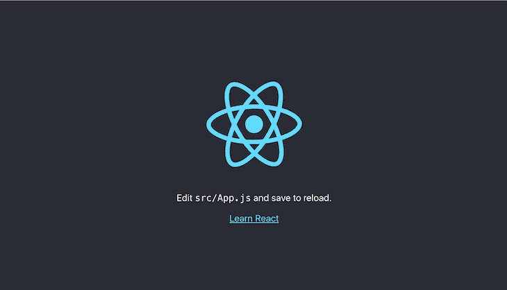
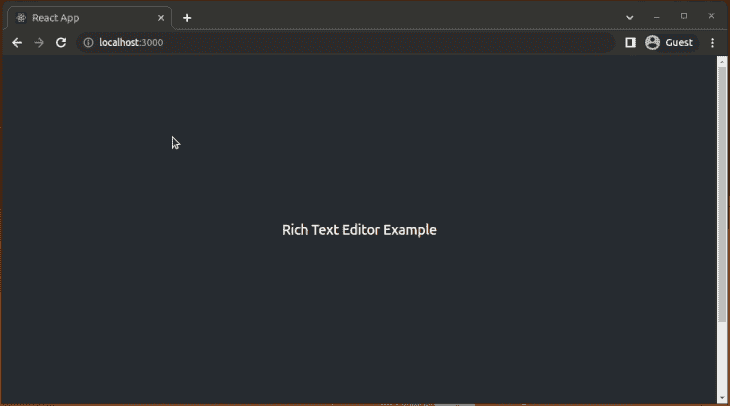
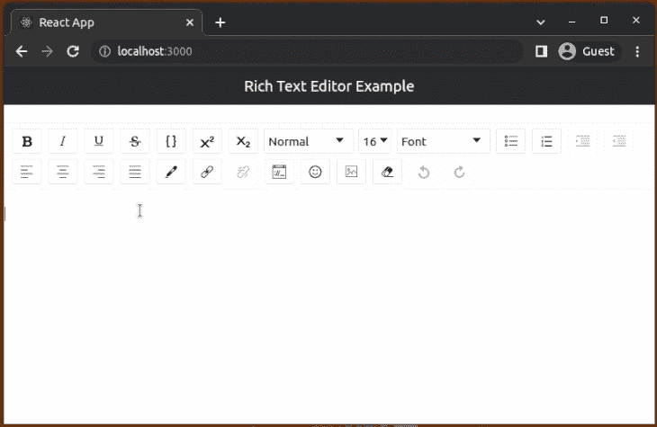
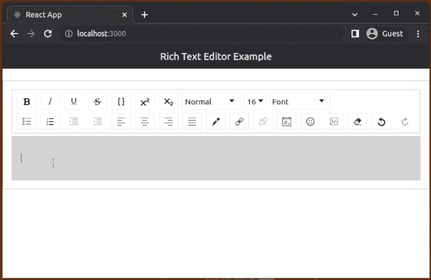
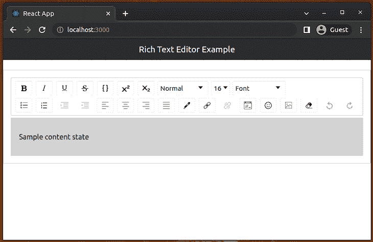
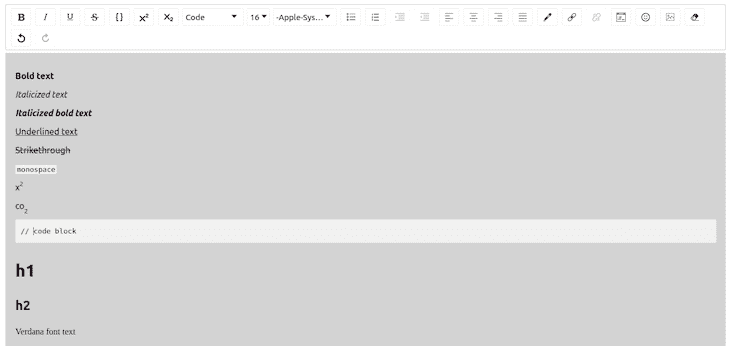
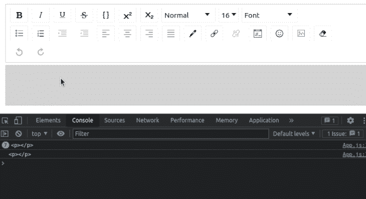
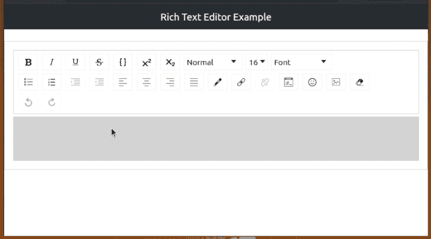
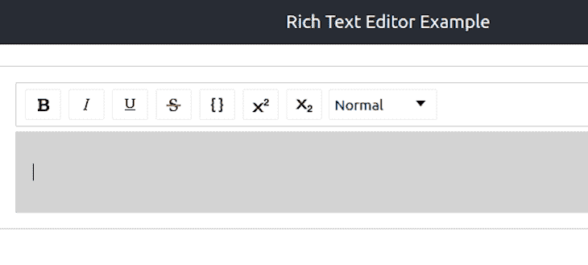
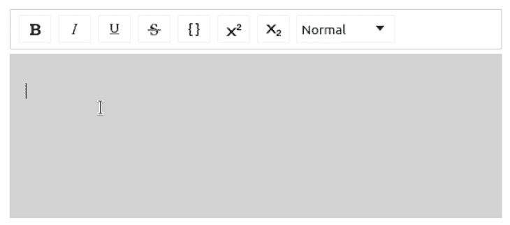

# 使用 Draft.js 和 react-draft-wysiwyg - LogRocket 博客在 React 中构建富文本编辑器

> 原文：<https://blog.logrocket.com/build-rich-text-editors-react-draft-js-react-draft-wysiwyg/>

***编者按:**这份在 React 中构建富文本编辑器的指南是由 [Shalitha Suranga](https://blog.logrocket.com/author/shalithasuranga/) 于 2022 年 12 月 1 日最后一次更新的，以反映 React 的更新。这次更新增加了关于 react-draft-wysiwyg 的好处的部分，关于 Draft.js 和 react-draft-wysiwyg 的更多信息，以及关于使用`UseEffect`钩子的部分。要了解更多关于 React 挂钩的信息，请查看我们的 [React 挂钩参考指南](https://blog.logrocket.com/react-reference-guide-hooks-api/)和[备忘单](https://blog.logrocket.com/react-hooks-cheat-sheet-unlock-solutions-to-common-problems-af4caf699e70/)。*

前端开发人员通常使用明文输入或`textarea`元素来捕获小尺寸的文本段，例如用户名、地址或城市。在某些情况下，他们需要让用户在 web 应用程序中输入带有多媒体项目的格式化文本。然而，明文输入不能满足这些需求，所以开发人员倾向于使用富文本编辑器的概念。

富文本编辑器已经成为我们与 web 应用程序交互方式中不可或缺的一部分，尤其是在内容生成方面。基于 Web 的富文本编辑器通常是 [WYSIWYG HTML](https://blog.logrocket.com/build-a-wysiwyg-text-editor-using-quill/) 编辑器，提供样式化和格式化的文本片段的实时预览。富文本编辑器使您能够控制文本的外观，并为内容创建者提供了一种在任何地方创建和发布 HTML 的强大方法。

在本文中，我们将使用 [Draft.js](https://draftjs.org/) 和 [react-draft-wysiwyg](https://www.npmjs.com/package/react-draft-wysiwyg) 来构建一个富文本编辑器，并显示我们使用该编辑器创建的文本。

*向前跳转:*

## 什么是 Draft.js？

[Draft.js](https://draftjs.org/) 是 React 的一个富文本编辑器框架，为开发者提供 API 来构建自己的富文本编辑器实现。它提供了一个预先开发的 React 组件，用于生成和呈现富文本。Draft.js 通过提供一个声明性 API，支持从简单的文本格式到嵌入媒体项(如超链接、图像、提及等)的各种功能，让开发人员能够为各种用例构建富文本编辑器。

Draft.js 不提供预建的工具栏元素。它提供了原子富文本编辑器构建块作为框架，所以如果我们需要创建一个带工具栏的富文本编辑器，我们必须使用基于 Draft.js 的包装器库或者从头构建一个。

## 什么是反应-草稿-所见即所得？

[react-draft-wysiwyg](https://www.npmjs.com/package/react-draft-wysiwyg) 库是一个使用 react 和 Draft.js 库构建的 wysiwyg(所见即所得)编辑器。它带有许多可定制的内置功能，这些功能是现代 HTML 编辑器组件所期望的，例如文本样式按钮、键盘快捷键支持、嵌入媒体项目、表情符号支持等等。

## 反应-草稿-所见即所得的好处

### 功能齐全的套装

[react-draft-wysiwyg](https://www.npmjs.com/package/react-draft-wysiwyg) 库提供了一个丰富的文本编辑器组件，它具有所有通用的 wysiwyg 特性和一些高级特性，包括提及和标签支持。您可以将预构建的编辑器安装到您的应用程序中，并拥有您需要的所有功能！

### 可定制性和灵活性

这个库没有通过提供一个严格的特性集来限制开发者的特性范围。它允许开发者通过各种组件道具定制工具栏和特性。您甚至可以轻松添加自定义工具栏项目！

### 快速设置和可用集成

react-draft-wysiwyg 库还附带了一个简单的 API、自解释的组件道具和编写良好的文档。这允许您在创纪录的时间内为 React 应用程序设置一个富文本编辑器。此外，您可以在富文本编辑器组件中使用 Draft.js 核心 API 和一些流行的 Draft.js 社区库。

## Draft.js 和 react-draft-wysiwyg 入门

本教程假设您已经掌握了 [React](https://reactjs.org/) 的工作知识。此外，确保您的机器上安装了 [Node.js](https://nodejs.org/en/) 、 [Yarn](https://yarnpkg.com/) 或 [npm](https://npmjs.com/) 。我们将使用 [Create React App](https://github.com/facebook/create-react-app) 来引导我们的项目。

让我们在您选择的目录中创建我们的项目。可以在命令行中键入下面突出显示的任何命令来完成您的项目。

npx: `npx create-react-app draft-js-example`

npm ( `npm init <initializer>`在 npm v6+中可用):`npm init react-app draft-js-example`

纱线(`[yarn create](https://yarnpkg.com/lang/en/docs/cli/create/)`在 v0.25+中可用):`yarn create react-app draft-js-example`

这将生成一个新的 React 项目，其目录结构如下:

```
draft-js-example-|
      |__node_mudles/
      |__public/
      |__src/
      |__.gitignore
      |__pacakge.json
      |__README.md
      |__yarn.lock

```

导航到项目文件夹的根目录并运行它:

```
cd draft-js-example

npm start
# --- or ---
yarn start

```

这将在开发模式下运行应用程序，您可以使用 [`http://localhost:3000/`](http://localhost:3000/) 在浏览器中查看它:



### 安装所需的依赖项

以下命令将 Draft.js 和 react-draft-wysiwyg 包安装到 react 项目中:

```
npm install install draft-js react-draft-wysiwyg
# --- or ---
yarn add draft-js react-draft-wysiwyg

```

## 设置编辑器

开始之前，我们需要对`src/App.js`文件进行一些编辑。我们将从`react-draft-wysiwyg`引进`editor`组件和样式，从`draft-js`引进`EditorState`。

`editor`使用默认的 Draft.js 编辑器，没有任何样式。Draft.js 编辑器是作为基于 React 的受控输入 API 的受控`ContentEditable`组件构建的。`EditorState`提供了`EditorState`的快照。这包括撤消/重做历史、内容和光标。

让我们添加一些代码来显示一个富文本编辑器。将以下代码添加到您的`App.js`文件中:

```
import React, { useState } from 'react';
import { EditorState } from 'draft-js';
import { Editor } from 'react-draft-wysiwyg';

import 'react-draft-wysiwyg/dist/react-draft-wysiwyg.css';
import './App.css';

function App() {
  const [editorState, setEditorState] = useState(
    () => EditorState.createEmpty(),
  );

  return (
    <div className="App">
      <header className="App-header">
        Rich Text Editor Example
      </header>

      <Editor
        editorState={editorState}
        onEditorStateChange={setEditorState}
      />
    </div>
  )
}

export default App;

```

我们将从使用`EditorState`的`createEmpty`方法创建的空状态开始。`editor`以`EditorState`为道具。您会注意到在保存更改和显示更新后，视图看起来不太好:



需要对`App.css`文件进行一些修改。将其内容替换为以下内容:

```
.App-header {
  background-color: #282c34;
  min-height: 5vh;
  display: flex;
  flex-direction: column;
  align-items: center;
  justify-content: center;
  font-size: calc(10px + 2vmin);
  color: white;
  margin-bottom: 5vh;
  text-align: center;
  padding: 12px;
 }

```

现在，`editor`已经在浏览器视图中定位好了。通过点击**工具栏图标**或按键盘快捷键如 **`Control + B`** 来输入一些文本并改变样式以显示粗体文本:



## 样式编辑器

如果你看我们上面渲染的编辑器，很难判断应该在哪里输入文本。使用样式道具可以使编辑器的不同部分更加明显。道具可以是应用于特定部分的类，也可以是包含样式的对象:

*   `wrapperClassName` = `"wrapper-class"`
*   `editorClassName` = `"editor-class"`
*   `toolbarClassName` = `"toolbar-class"`
*   `wrapperStyle` = `{<wrapperStyleObject>}`
*   `editorStyle` = `{<editorStyleObject>}`
*   `toolbarStyle` = `{<toolbarStyleObject>}`

向`Editor`组件添加`className`道具，向`App.css`添加相关样式，如下所示，为编辑器设置样式:

### `App.js`:

```
<Editor
  editorState={editorState}
  onEditorStateChange={setEditorState}
  wrapperClassName="wrapper-class"
  editorClassName="editor-class"
  toolbarClassName="toolbar-class"
/>

```

### `App.css`:

```
.wrapper-class {
  padding: 1rem;
  border: 1px solid #ccc;
}
.editor-class {
  background-color:lightgray;
  padding: 1rem;
  border: 1px solid #ccc;
}
.toolbar-class {
  border: 1px solid #ccc;
}

```

现在，富文本编辑器应该是这样的:



> 注意:在开发模式下，您可能会注意到一个警告，上面写着“`Can’t call setState on a component`”。React 显示此警告消息是因为 react-draft-wysiwyg 中存在问题。希望库的维护者能尽快发布这个问题的修复程序。现在，您可以禁用本教程的[反应严格模式](https://reactjs.org/docs/strict-mode.html)，如下所示:

```
import React from 'react';
import ReactDOM from 'react-dom/client';
import './index.css';
import App from './App';

const root = ReactDOM.createRoot(document.getElementById('root'));
root.render(<App />);

```

在 GitHub 上看到关于这个问题[的更多细节。](https://github.com/jpuri/react-draft-wysiwyg/issues?q=Can%27t+call+setState)

## 与`EditorState`一起工作

编辑器可以是受控制的组件[或不受控制的组件](https://blog.logrocket.com/controlled-vs-uncontrolled-components-in-react/)。使用编辑器的顶层状态对象`EditorState`实现受控编辑器。

而不受控制的编辑器可以使用 [`EditorState`](https://draftjs.org/docs/api-reference-editor-state) 或 [`RawDraftContentState`](https://github.com/facebook/draft-js/blob/main/src/model/encoding/RawDraftContentState.js) 创建，这是表示内容的原始格式的预期结构的流程类型。如果我们想创建一个受控编辑器，我们将向它传递以下道具:

*   `editorState`:支持以受控方式更新编辑器状态
*   `onEditorStateChange`:当编辑器状态发生变化时调用的函数，该函数采用`EditorState`类型的对象参数

在将这些添加到我们的`editor`组件中之后，它将看起来像这样:

```
function App() {
  const [editorState, setEditorState] = useState(
    () => EditorState.createEmpty(),
  );

  return (
    <div className="App">
      <header className="App-header">
        Rich Text Editor Example
      </header>
      <Editor
        editorState={editorState}
        onEditorStateChange={setEditorState}
        wrapperClassName="wrapper-class"
        editorClassName="editor-class"
        toolbarClassName="toolbar-class"
      />
    </div>
  )
}

```

`EditorState`也可以通过传递`defaultEditorState`来创建一个不受控制的编辑器。这是一个类型为`EditorState`的对象，一旦它被创建，就用它来初始化编辑器状态:

```
function App() {
  const [editorState, setEditorState] = useState(
    () => EditorState.createEmpty(),
  );

  return (
    <div className="App">
      <header className="App-header">
        Rich Text Editor Example
      </header>
      <Editor
        defaultEditorState={editorState}
        onEditorStateChange={setEditorState}
        wrapperClassName="wrapper-class"
        editorClassName="editor-class"
        toolbarClassName="toolbar-class"
      />
    </div>
  )
}

```

另一种实现不受控制的编辑器的方法是使用`RawDraftContentState`。不受控制的编辑器采用以下道具:

*   `defaultContentState`:类型为`RawDraftContentState`的对象，用于在创建编辑器后初始化编辑器状态
*   `onContentStateChange`:当编辑器状态发生变化时调用的函数，该函数采用`RawDraftContentState`类型的对象参数

使用`RawDraftContentState`实现的不受控制的编辑器如下所示:

```
import React, { useState } from 'react';
import { ContentState, convertToRaw } from 'draft-js';
import { Editor } from 'react-draft-wysiwyg';
import 'react-draft-wysiwyg/dist/react-draft-wysiwyg.css';
import './App.css';

function App() {
  const _contentState = ContentState.createFromText('Sample content state');
  const raw = convertToRaw(_contentState);  // RawDraftContentState JSON
  const [contentState, setContentState] = useState(raw); // ContentState JSON

  return (
    <div className="App">
      <header className="App-header">
        Rich Text Editor Example
      </header>
      <Editor
        defaultContentState={contentState}
        onContentStateChange={setContentState}
        wrapperClassName="wrapper-class"
        editorClassName="editor-class"
        toolbarClassName="toolbar-class"
      />
    </div>
  )
}

export default App;

```

呈现后，将会显示这样的富文本编辑器，其中包含预加载的文本:



## 使用数据转换功能

作为与富文本编辑器交互的用户，您无疑需要保存文本或编辑保存的文本。这意味着您应该能够将`ContentState`转换为原始 JavaScript，反之亦然——或者将`ContentState`转换为 HTML，反之亦然。Draft.js 提供了三个函数来实现这一点:

*   `[ContentFromRaw](https://draftjs.org/docs/api-reference-data-conversion#convertfromraw)`:将原始状态(`RawDraftContentState`)转换为`ContentState`。您可以使用这个函数将保存在数据库中原始 JSON 结构加载到富文本编辑器实例中
*   `[ContentToRaw](https://draftjs.org/docs/api-reference-data-conversion#converttoraw)`:将`ContentState`转换为原始状态。您可以使用这个函数将当前的富文本编辑器状态转换为原始的 JSON 结构，以便存储在数据库中
*   `[ContentFromHTML](https://draftjs.org/docs/api-reference-data-conversion#convertfromhtml)`:将一个 HTML 片段转换成一个带有两个键的对象，其中一个键保存一个 [`ContentBlock`](https://draftjs.org/docs/api-reference-content-block/) 对象的数组，另一个键保存一个对`entityMap`的引用。然后，该对象可用于从 HTML 文档构造内容状态

对于我们的特定用例，我们希望将编辑器状态转换为 HTML 以便存储和显示。我们可以使用像 [draftjs-to-html](https://www.npmjs.com/package/draftjs-to-html) 或者 [draft-convert](https://www.npmjs.com/package/draft-convert) 这样的库来实现。我们将使用 draft-convert，因为它比 draftjs-to-html 拥有更多的功能。

在您的终端中运行以下命令进行安装:

```
npm install draft-convert
# --- or ---
yarn add draft-convert

```

让我们使用 draft-convert 包从编辑器状态生成 HTML！

## 为转换后的`EditorState`创建预览

我们的富文本编辑器已经准备好创建一些富文本，但是还不能保存或预览我们输入的内容。您可以使用编辑器和不同的工具栏选项，看看如何创建富文本。以下是我在这个阶段能够用编辑器做的不同事情的例子:



下一步是将这个富文本转换成 HTML。我们将使用 draft-convert 中的`convertToHTML`函数来转换它，但是首先，我们需要获取编辑器中输入的当前内容。

`EditorState`提供了一个方法`getCurrentContent`，它返回编辑器的当前`ContentState`，然后我们可以将它转换成 HTML。

我们处理`EditorState`变化的方式将不得不有所改变。将调用一个处理程序来更新`EditorState`，组件将转换后的`HTML`存储在一个 JavaScript 变量中。

### 使用`useEffect`挂钩

让我们添加一个组件，它将获取`editor`内容，将其转换为 HTML，并在浏览器控制台上打印原始的`HTML`字符串:

```
import React, { useState, useEffect } from 'react';
import { EditorState } from 'draft-js';
import { Editor } from 'react-draft-wysiwyg';
import { convertToHTML } from 'draft-convert';

import 'react-draft-wysiwyg/dist/react-draft-wysiwyg.css';
import './App.css';

function App() {
  const [editorState, setEditorState] = useState(
    () => EditorState.createEmpty(),
  );
  const [convertedContent, setConvertedContent] = useState(null);

  useEffect(() => {
    let html = convertToHTML(editorState.getCurrentContent());
    setConvertedContent(html);
  }, [editorState]);

  console.log(convertedContent);

  return (
    <div className="App">
      <header className="App-header">
        Rich Text Editor Example
      </header>
      <Editor
        editorState={editorState}
        onEditorStateChange={setEditorState}
        wrapperClassName="wrapper-class"
        editorClassName="editor-class"
        toolbarClassName="toolbar-class"
      />
    </div>
  )
}

export default App;

```

> 请注意，`draft-convert`可能不支持某些编辑器格式，这可能会导致错误。

上面的代码使用 [`useEffect`钩子](https://blog.logrocket.com/guide-to-react-useeffect-hook/)和`[editorState]`依赖数组来更新`convertedContent`状态值。运行上述代码并输入一些带有样式的文本后，您可以在浏览器控制台上看到当前编辑器状态的原始 HTML 内容，如下所示:



既然编辑器中输入的文本在呈现 [JSX](https://blog.logrocket.com/million-js-build-apps-jsx-faster-react-preact/) 结构之前已经被转换，我们就可以显示它了。我们将创建一个`div`来显示输入的文本。

所以，为了显示文本，我们将使用 [`dangerouslySetInnerHTML`](https://reactjs.org/docs/dom-elements.html#dangerouslysetinnerhtml) 。你可能会问自己，为什么是`dangerously`？通过从代码中设置 HTML，您将自己暴露在[跨站脚本(XSS)](https://en.wikipedia.org/wiki/Cross-site_scripting) 攻击之下。这个名字微妙地提醒了我们这样做的危险性。

### 净化你的 HTML

你必须确保你的 [HTML 在被添加到你的页面之前已经被适当地组织和净化了。一个简单的方法是使用](https://blog.logrocket.com/what-you-need-know-inbuilt-browser-html-sanitization/) [dompurify](https://www.npmjs.com/package/dompurify) 库。

使用以下命令安装此软件包:

```
npm install dompurify
# --- or ---
yarn add dompurify

```

`dangerouslySetInnerHTML`接收一个带有`__html`键(两个下划线)的对象。这把钥匙将保存消毒过的`HTML`。我们现在可以添加方法来净化`HTML`和元素来保存它。添加`import DOMPurify from 'dompurify';`。

接下来，使用以下函数实现代替现有的`console.log`语句:

```
function createMarkup(html) {
  return {
    __html: DOMPurify.sanitize(html)
  }
}

```

现在，在一个`div`中渲染净化后的`HTML`，如下所示:

```
<div className="App">
  <header className="App-header">
    Rich Text Editor Example
  </header>
  <Editor
    editorState={editorState}
    onEditorStateChange={setEditorState}
    wrapperClassName="wrapper-class"
    editorClassName="editor-class"
    toolbarClassName="toolbar-class"
  />
  <div
    className="preview"
    dangerouslySetInnerHTML={createMarkup(convertedContent)}>
  </div>
</div>

```

`createMarkup`函数接收一个`HTML`字符串作为参数，并返回一个带有净化过的`HTML`的对象。这个方法由`dangerouslySetInnerHTML`调用，内容被转换为`HTML`。

### 向`HTML`容器添加样式

最后，为`HTML`容器添加一些样式:

```
.preview {
  padding: 1rem;
  margin-top: 1rem;
}

```

现在，我们可以在编辑器中输入文本，并在富文本编辑器下方看到它的显示，就像我们格式化它一样:



就是这样！我们完了。我们构建了一个富文本编辑器，使我们能够以各种方式格式化文本。`App.js`文件的最终代码应该是:

```
import React, { useState, useEffect } from 'react';
import { EditorState } from 'draft-js';
import { Editor } from 'react-draft-wysiwyg';
import { convertToHTML } from 'draft-convert';
import DOMPurify from 'dompurify';

import 'react-draft-wysiwyg/dist/react-draft-wysiwyg.css';
import './App.css';

function App() {
  const [editorState, setEditorState] = useState(
    () => EditorState.createEmpty(),
  );
  const [convertedContent, setConvertedContent] = useState(null);

  useEffect(() => {
    let html = convertToHTML(editorState.getCurrentContent());
    setConvertedContent(html);
  }, [editorState]);

  function createMarkup(html) {
    return {
      __html: DOMPurify.sanitize(html)
    }
  }

  return (
    <div className="App">
      <header className="App-header">
        Rich Text Editor Example
      </header>
      <Editor
        editorState={editorState}
        onEditorStateChange={setEditorState}
        wrapperClassName="wrapper-class"
        editorClassName="editor-class"
        toolbarClassName="toolbar-class"
      />
      <div
        className="preview"
        dangerouslySetInnerHTML={createMarkup(convertedContent)}>
      </div>
    </div>
  )
}

export default App;

```

## 自定义富文本编辑器组件

当您使用没有定制的`Editor`组件时，该库默认呈现一般的 WYSIWYG 特征。例如，默认情况下，您会得到一个工具栏，它具有您在富文本编辑器中期望的特性，比如文本样式和添加嵌入项。react-draft-wysiwyg 库非常灵活且功能全面，它提供了自定义工具栏、行为和启用附加功能的道具。

例如，您可以使用`toolbar`属性创建一个最小工具栏，如下所示:

```
<Editor
  editorState={editorState}
  onEditorStateChange={setEditorState}
  wrapperClassName="wrapper-class"
  editorClassName="editor-class"
  toolbarClassName="toolbar-class"
  toolbar={{
    options: ['inline', 'blockType']
  }}
/>

```

看下面的预告:



此外，您可以使用以下道具启用`hashtags`和`mentions`支持:

```
hashtag={{
  separator: ' ',
  trigger: '#',
}}
mention={{
  separator: ' ',
  trigger: '@',
  suggestions: [
    { text: 'JavaScript', value: 'javascript', url: 'js' },
    { text: 'Golang', value: 'golang', url: 'go' },
  ],
}}

```

上述道具支持以下功能:



你可以在[官方库文档](https://jpuri.github.io/react-draft-wysiwyg/#/docs)中看到所有支持的特性。

## 结论

在本文中，我们研究了如何创建一个富文本编辑器，它已经有了一个工具栏，工具栏上有几个用于输入和显示文本的选项。我们仅仅触及了使用“反应-草稿-所见即所得”创建的体验的表面。

您可以在 [react-draft-wysiwyg 文档](https://jpuri.github.io/react-draft-wysiwyg/#/docs?_k=jjqinp)中找到其他选项和功能，并探索如何构建功能更加丰富的编辑器。如果您希望更有挑战性，您可以添加将文本保存到数据库、检索文本和更新文本的功能。这篇文章的代码可以在 [GitHub](https://github.com/codezri/react-draft-wysiwyg-demo) 上找到。我迫不及待地想看看你做了什么。

## [LogRocket](https://lp.logrocket.com/blg/react-signup-general) :全面了解您的生产 React 应用

调试 React 应用程序可能很困难，尤其是当用户遇到难以重现的问题时。如果您对监视和跟踪 Redux 状态、自动显示 JavaScript 错误以及跟踪缓慢的网络请求和组件加载时间感兴趣，

[try LogRocket](https://lp.logrocket.com/blg/react-signup-general)

.

[ ](https://lp.logrocket.com/blg/react-signup-general) [](https://lp.logrocket.com/blg/react-signup-general) 

LogRocket 结合了会话回放、产品分析和错误跟踪，使软件团队能够创建理想的 web 和移动产品体验。这对你来说意味着什么？

LogRocket 不是猜测错误发生的原因，也不是要求用户提供截图和日志转储，而是让您回放问题，就像它们发生在您自己的浏览器中一样，以快速了解哪里出错了。

不再有嘈杂的警报。智能错误跟踪允许您对问题进行分类，然后从中学习。获得有影响的用户问题的通知，而不是误报。警报越少，有用的信号越多。

LogRocket Redux 中间件包为您的用户会话增加了一层额外的可见性。LogRocket 记录 Redux 存储中的所有操作和状态。

现代化您调试 React 应用的方式— [开始免费监控](https://lp.logrocket.com/blg/react-signup-general)。