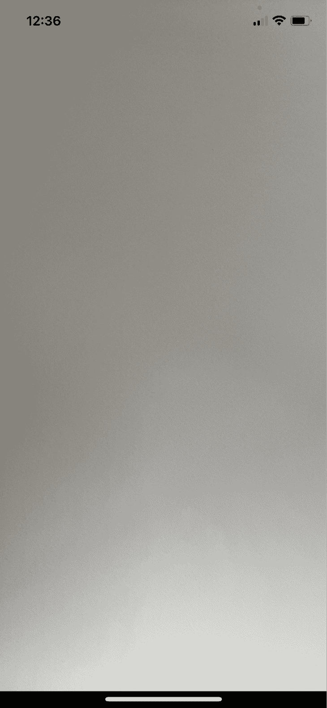
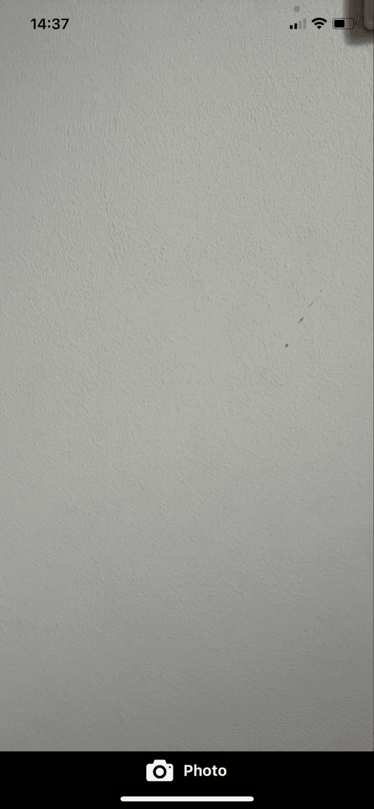
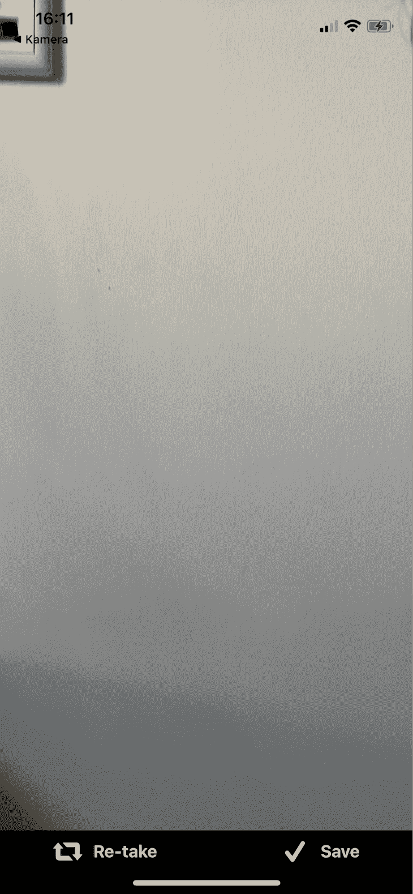
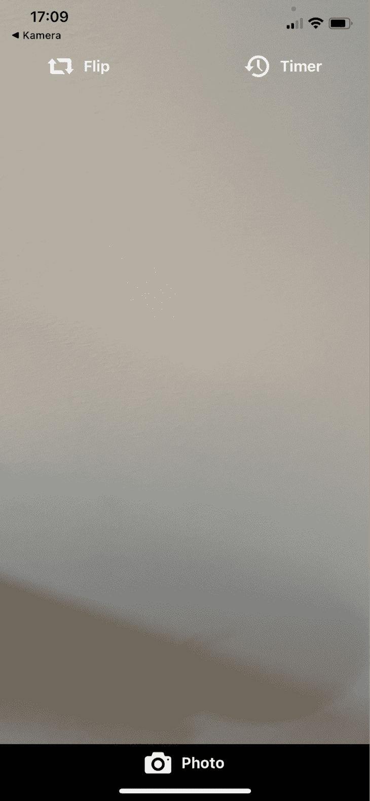
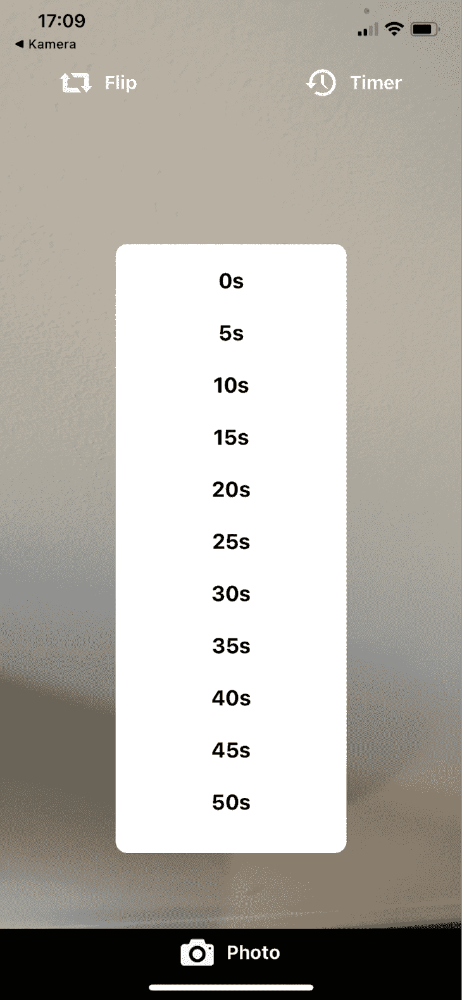

# 构建自拍相机定时器:React 本机秒表示例

> 原文：<https://blog.logrocket.com/build-selfie-camera-timer-react-native-stopwatch-example/>

在本文中，我们将在 React Native 中构建一个秒表，并将其连接到设备的摄像头，以从头开始创建自拍相机定时器。为了增加复杂性，用户有机会创建和保存自定义持续时间作为他们的计时器。[在这里](https://youtube.com/shorts/FusTDvc0BXE?feature=share)，你可以找到一个视频链接，展示演示应用的功能和外观。这个项目的[源代码可以在我的 GitHub 上找到。](https://github.com/kevintomas1995/logrocket_camera)

*向前跳转:*

## 先决条件

为了跟随本教程，一些 JavaScript 和 React Native 的基础知识会很有帮助。我用 [Expo](https://expo.dev/) 开发了这个 app。这是一个开源平台，旨在通过提供最常见用例所需的所有 JavaScript APIs 来增强 React Native。

要在您的机器上安装 Expo 客户端，请在您的 shell 中运行以下命令:

```
npm i -global expo-cli
```

## 正在初始化项目

导航到您想要存储这个项目的地方，并运行`expo init my-project`来初始化这个项目。然后，用`cd my-project`转到新创建的项目。

作为第一步，让我们安装一些依赖项来帮助我们开发这个应用程序:`[expo-camera](https://docs.expo.dev/versions/latest/sdk/camera/)`和`[expo-media-library](https://docs.expo.dev/versions/latest/sdk/media-library/)`。在 expo-camera 的帮助下，我们可以访问设备的摄像头并拍照。世博媒体图书馆负责保存图片。

在您的终端中运行`npm i expo-media-library expo-camera`来安装这些依赖项。然后，运行`npx expo start`启动开发服务器。

## 使用`expo-camera`访问设备的摄像头

我们需要解决的第一件事是访问设备的摄像头和用户的媒体库。为此，我在新创建的目录`src`中创建了一个名为`usePermission`的定制钩子。在`src`目录中，我创建了`usePermission.jsx`文件:

```
// scr/usePermission.jsx
import { useEffect, useState } from "react";
import * as MediaLibrary from "expo-media-library";

const usePermission = (Camera) => {
 const [hasCameraPermissions, setHasCameraPermissions] = useState(null);

 useEffect(() => {
   (async () => {
     MediaLibrary.requestPermissionsAsync();
     const cameraStatus = await Camera.requestCameraPermissionsAsync();
     setHasCameraPermissions(cameraStatus.status === "granted");
   })();
 }, []);

 return hasCameraPermissions;
};

export default usePermission;
```

在[的 useEffect 钩子](https://blog.logrocket.com/guide-to-react-useeffect-hook/)中，我们首先通过调用 `MediaLibrary.requestPermissionsAsync()`请求访问媒体的许可。其次，我们要求用户通过调用`Camera`对象上的`requestCameraPermissionsAsync()`来授予我们的应用程序访问摄像头的权限，这个对象作为参数传递给这个自定义钩子。我们一会儿将看一看`Camera`物体。

最后，我们返回`hasCameraPermissions`状态，这是一个布尔值，可以保存`true`或`false`作为一个值。

在`App.js`文件中，我们现在可以使用`usePermission`钩子开始在屏幕上渲染摄像机。用以下代码替换`App.js`文件中的代码:

```
import { Camera } from "expo-camera";
import { Image, StyleSheet, Text, View } from "react-native";
import { useState, useRef, useEffect } from "react";
import usePermission from "./src/usePermisson";

export default function App() {
 const hasCameraPermissions = usePermission(Camera);
 const [type, setType] = useState(Camera.Constants.Type.front);
 const cameraRef = useRef(null);

 if (hasCameraPermissions === false) {
   return <Text>No permission to access camera</Text>;
 }

 return (
   <View style={styles.container}>
     <Camera style={styles.camera} type={type} ref={cameraRef}></Camera>
   </View>
 );
}

const styles = StyleSheet.create({
 container: {
   flex: 1,
   backgroundColor: "#000",
   justifyContent: "center",
   paddingBottom: 20,
 },
 camera: {
   flex: 1,
   position: "relative",
 },
});
```

让我们先来看看我们在`App`函数的前三行中声明的变量。

`hasCameraPermissions`保存从我们刚刚看过的`usePermission`钩子返回的值。请注意，我们正在将从`expo-camera`包中导入的`Camera`对象传递给我们的钩子。

在下一行中，我们定义摄像机的类型。由于我们正在构建一个自拍相机，我最初将其设置为使用前置相机，并将此状态传递给相机组件。最后，我们创建一个`ref`,并将其传递给`camera`组件，以创建一个继承了`camera`属性的可变对象。这将允许我们稍后对`camera`组件进行更改。

如果`usePermission`钩子返回`false`，我们不会渲染摄像头，而是显示一个文本框，说明我们无权访问摄像头。如果我们成功获准访问设备的摄像头，应用程序现在应该会在整个屏幕上显示前置摄像头，如下所示:



## 拍摄和保存照片

现在，我们将实现拍摄和保存图片的功能。为此，我在`src`目录中创建了一个`components`目录，并在那里添加了一个定制的`Button`组件:

```
import { Text, TouchableOpacity, StyleSheet } from "react-native";
import React from "react";
import { Entypo } from "@expo/vector-icons";

export default function Button({ title, onPress, icon, color }) {
 return (
   <TouchableOpacity onPress={onPress} style={styles.button}>
     <Entypo name={icon} size={28} color={color ? color : "#f1f1f1"} />
     <Text style={styles.text}>{title}</Text>
   </TouchableOpacity>
 );
}

const styles = StyleSheet.create({
   button: {
       height: 40,
       flexDirection: "row",
       justifyContent: "center",
       alignItems: "center",
   },
   text: {
       fontWeight: "bold",
       fontSize: 16,
       color: "#f1f1f1",
       marginLeft: 10,
   },
 });
```

这个组件被设计成可以修改标题、`onPress`功能、图标和按钮的颜色。

让我们在`App.js`文件中导入`Button`组件，并使用这个组件:

```
return (
   <View style={styles.container}>
     <Camera style={styles.camera} type={type} ref={cameraRef}></Camera>
     <View>
       <Button title={"Photo"} icon={"camera"}/>
     </View>
   </View>
 );
```

这将在我们的应用程序底部添加一个按钮。这导致了我们的应用程序的如下外观:



到目前为止，一切顺利。

### 管理图像状态

现在让我们实现一个函数，它将确保我们可以实际拍摄照片并将其保存到我们的设备:

```
const [image, setImage] = useState(null);

const takePicture = async () => {
   if (cameraRef) {
     try {
       const data = await cameraRef.current.takePictureAsync();
       setImage(data.uri);
     } catch (error) {
       console.log(error);
     }
   }
 };
```

首先，我们需要创建一个管理图像的新状态。然后，我们创建`takePicture`函数，在这里我们调用我们的`cameraRef`对象上的`takePictureAsync()`方法，它拍摄一张照片并保存到应用程序的`cache`目录中。

这里我们需要做的最后一件事是将函数分配给自定义`Button`组件的`onPress`属性:

```
<Button title={"Photo"} icon={"camera"} onPress={takePicture}/>
```

这种方法的缺点是拍摄的照片还没有显示在应用程序中。让我们改变这一切！

### 在应用程序中显示拍摄的照片

```
<View style={styles.container}>
     {!image ? (
       <Camera style={styles.camera} type={type} ref={cameraRef}></Camera>
     ) : (
       <Image style={styles.camera} source={{ uri: image }} />
     )}

     <View>
       <Button title={"Photo"} icon={"camera"} onPress={takePicture} />
     </View>
</View>
```

这种有条件的呈现确保了如果我们在`image`状态下存储了一个图像，那么它将呈现`<Image style={styles.camera} source={{ uri: image }} />`组件；否则它会渲染摄像机。

### 将图片保存到设备

接下来，我们希望让用户有机会将图片保存到设备:

```
import * as MediaLibrary from "expo-media-library";

const savePicture = async () => {
   if (image) {
     try {
       const asset = await MediaLibrary.createAssetAsync(image);
       alert("Image saved!");
       setImage(null);
     } catch (error) {
       console.log(error);
     }
   }
 };
```

在`savePicture`函数中，我们调用`MediaLibrary.createAssetAsync(image)`方法，该方法从图像中创建一个资产，并将其存储在我们的设备上。请注意，在成功保存后，我们将图像设置为`null`。这对于条件渲染很重要，因为如果图像状态中没有存储真值，我们就要渲染摄像机。

让我们用两个按钮来扩展我们的应用程序:一个用于保存图片，一个用于重新拍照:

```
return (
   <View style={styles.container}>
     {!image ? (
       <Camera style={styles.camera} type={type} ref={cameraRef}></Camera>
     ) : (
       <Image style={styles.camera} source={{ uri: image }} />
     )}

     <View>
       {image ? (
         <View style={styles.takenImage}>
           <Button
             title={"Re-take"}
             icon="retweet"
             onPress={() => setImage(null)}
           />
           <Button title={"Save"} icon="check" onPress={savePicture} />
         </View>
       ) : (
         <Button title={"Photo"} icon={"camera"} onPress={takePicture} />
       )}
     </View>
   </View>
 );
```

这将导致拍照后出现以下结果:



当点击**重新拍摄**按钮时，我们执行`onPress={() => setImage(null)}`以再次渲染摄像机。

最后，让我们添加一个按钮，允许用户根据需要翻转相机。在`camera`组件中，我们将简单地添加一个额外的按钮:

```
<Camera style={styles.camera} type={type} ref={cameraRef}>
         <View style={styles.buttonContainer}>
           <Button
             icon={"retweet"}
             title="Flip"
             onPress={() =>
               setType(
                 type === Camera.Constants.Type.back
                   ? Camera.Constants.Type.front
                   : Camera.Constants.Type.back
               )
             }
             color="#f1f1f1"
           />
         </View>
</Camera>
```

## 将计时器添加到我们的应用程序

现在剩下的唯一事情就是实现定时器功能，并将其连接到我们的相机。我在`src/components`目录中创建了另一个名为`Timer.jsx`的组件。该组件的代码如下所示:

```
import {
 View,
 Text,
 FlatList,
 StyleSheet,
 TouchableOpacity,
} from "react-native";
import { data } from "../data";

export default function Timer({ onPress }) {
 const onClick = (time) => {
   onPress(time);
 };
 return (
   <View style={styles.timerContainer}>
     <FlatList
       data={data}
       style={styles.timerList}
       renderItem={({ item }) => (
         <TouchableOpacity onPress={() => onClick(item.time)}>
           <Text style={styles.item}>{item.key}</Text>
         </TouchableOpacity>
       )}
     />
   </View>
 );
}

const styles = StyleSheet.create({
 timerContainer: {
   position: "absolute",
   width: "50%",
   top: "25%",
   right: "25%",
   backgroundColor: "white",
   zIndex: 1,
   borderRadius: 10,
   padding: 10,
 },
 timerList: {
   paddingTop: 10,
 },
 item: {
   fontSize: 18,
   textAlign: "center",
   height: 44,
   fontWeight: "bold",
 },
});
```

最后，`Timer`组件由一个[平面列表](https://blog.logrocket.com/deep-dive-react-native-flatlist/)组成，它呈现这样的键值对:

```
{key: "5s", time: 5}

```

回到我们的`App.js`，我们现在可以导入`Timer`组件并添加以下代码:

```
const [timerClicked, setTimerClicked] = useState(false);

const onPressTimerItem = () => {
   setTimerClicked((prevState) => !prevState);
 };

return (
   <View style={styles.container}>
     {timerClicked && <Timer onPress={onPressTimerItem} />}
     {!image ? (
       <Camera style={styles.camera} type={type} ref={cameraRef}>
         <View style={styles.buttonContainer}>
           <Button
             icon={"retweet"}
             title="Flip"
             onPress={() =>
               setType(
                 type === Camera.Constants.Type.back
                   ? Camera.Constants.Type.front
                   : Camera.Constants.Type.back
               )
             }
             color="#f1f1f1"
           />
           <Button
             icon={"back-in-time"}
             title="Timer"
             onPress={() => setTimerClicked((prevState) => !prevState)}
           />
         </View>
       </Camera>
………
```

`timerClicked`状态和`onPressTimerItem`功能的目的是检查定时器组件是否应该被渲染。在`camera`组件中，我为计时器功能添加了另一个按钮。下图显示了点击**定时器**按钮前后的布局。





从计时器背后的逻辑开始，我们首先需要添加一个新的状态来保存所需计时器的当前值。另外，我们会在`onPressTimerItem`函数内部调用`setTimer`。此外，我们希望在右上角的图标旁边显示计时器的当前值。为此，我们将计时器按钮包装在一个额外的`View`中，并添加一个新的`Text`元素:

```
<View style={styles.timerContainer}>
             <Button
               icon={"back-in-time"}
               title="Timer"
               onPress={() => setTimerClicked((prevState) => !prevState)}
             />
           <Text style={styles.timerText}>{timer}s</Text>
</View>
```

下一步，我们可以再次查看`takePicture`功能，并将计时器和拍照之间的功能联系起来。为此，我们可以将函数体包装在一个`setTimeout`方法中，如下所示:

```
const [timerOn, setTimerOn] = useState(false);

const takePicture = async () => {
 setTimerOn(true);
 setTimeout(async function () {
   if (cameraRef) {
     try {
       const data = await cameraRef.current.takePictureAsync();
       setImage(data.uri);
       setTimerOn(false);
     } catch (error) {
       console.log(error);
     }
   }
 }, timer * 1000);
};
```

实现新的状态`timerOn`来跟踪定时器是否仍在运行。这将与创建秒表的最后一步相关。

如果您现在运行应用程序，为您的计时器选择一个持续时间，然后单击**拍照**按钮，照片应该会以与您选择的计时器相同的秒数延迟拍摄。

### 实施倒计时定时器

完成这个应用程序的最后一步是实现一个元素，显示计时器倒计时，以增强用户友好性。我们不会使用`timer`状态来显示递减计数，而是使用另一个名为`displayTimer`的变量，因为我们希望保持`timer`状态的值不变。

```
const [displayTimer, setDisplayTimer] = useState(timer);

useEffect(() => {
 if (!timerOn) {
   return;
 }
 setDisplayTimer(timer);

 const interval = setInterval(() => {
   setDisplayTimer((prevTimer) =>
     prevTimer > 0 ? prevTimer - 1 : clearInterval(interval)
   );
 }, 1000);
}, [timerOn, setTimerOn, timer]);
```

在上面的`useEffect`钩子中，我们使用的是`setInterval`方法，每秒钟将`displayTimer`的值减少`1`。如果`displayTimer`达到值`0`，我们想要调用 `clearInterval(interval)`来停止函数的执行。

## 结论

在这篇文章中，我们介绍了如何在 React Native 中创建一个秒表，并将其连接到设备的摄像头，以从头开始创建自拍相机定时器。如果您在某个时候迷失了方向，请在我的 GitHub 上查看相应的 [repo 以获得完整的源代码。](https://github.com/kevintomas1995/logrocket_camera)

## [LogRocket](https://lp.logrocket.com/blg/react-native-signup) :即时重现 React 原生应用中的问题。

[](https://lp.logrocket.com/blg/react-native-signup)

[LogRocket](https://lp.logrocket.com/blg/react-native-signup) 是一款 React 原生监控解决方案，可帮助您即时重现问题、确定 bug 的优先级并了解 React 原生应用的性能。

LogRocket 还可以向你展示用户是如何与你的应用程序互动的，从而帮助你提高转化率和产品使用率。LogRocket 的产品分析功能揭示了用户不完成特定流程或不采用新功能的原因。

开始主动监控您的 React 原生应用— [免费试用 LogRocket】。](https://lp.logrocket.com/blg/react-native-signup)