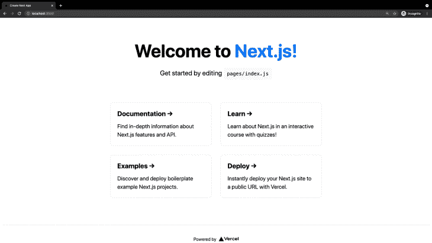
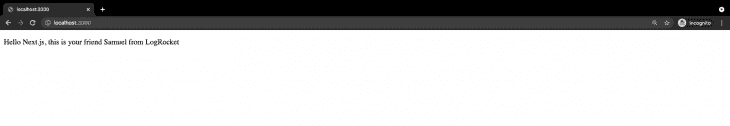

# 用 Next.js 和 Express - LogRocket Blog 构建一个服务器渲染的 React 应用程序

> 原文：<https://blog.logrocket.com/build-server-rendered-react-app-next-express/>

***编者按:**这篇文章于 2022 年 10 月 4 日更新，其中包括为什么要使用 Express with Next、Express 是否优于 Next.js 的自定义服务器、使用 Express 和 Next 的优势、服务器端渲染的示例以及文本的其他一般更新。*

不言而喻，React 是构建高质量 web 应用程序的绝佳选择。然而，随着项目变得越来越复杂，您需要了解客户端路由、页面布局等等，以扩展您的应用程序。例如，在某些时候，您会希望页面加载得更快。通常，这是事情变得困难的地方。

[Next.js](https://learnnextjs.com/) 是一个通用的 JavaScript 框架，可以在浏览器和服务器上运行。它为开发人员提供了一种简单的入门方式，并且，因为它使用 React 作为模板，所以对于拥有 React 经验的开发人员来说，这也是一种快速高效的[方式。](https://blog.logrocket.com/creating-website-next-js-react/)

它的一个优点是很好地处理了服务器端渲染，并且很好地集成了 [Express](https://expressjs.com/) 。哦，我多么喜欢快递。

但是我们太超前了。先说说为什么需要服务器端渲染吧。然后我们开始建造东西。

## Next.js 是什么？

Next.js 是构建在 Node.js 之上的开源开发框架，支持基于 React 的 web 应用功能，如服务器端渲染，并允许生成静态网站。它最初于 2016 年 10 月 25 日发布，但很快成为开发人员寻求构建高质量 web 应用程序时的首选 JavaScript 框架之一。

Next.js 为您提供了最佳的开发人员体验，包括生产所需的所有功能，如混合静态和服务器渲染、类型脚本支持、智能绑定、路由预取、快速刷新和内置 CSS 支持，完全不需要特殊配置。

它的一个优点是可以很好地处理服务器端渲染，并且可以很好地与 Express 集成。为了充分利用 Next，我们需要了解什么是服务器端呈现，它是如何工作的，然后开始构建我们的示例服务器端呈现 React 和 Express web 应用程序。

## 确切地说，什么是服务器端渲染？

服务器端呈现是将 HTML 显示在屏幕上的传统方法。这指的是使用服务器环境让你的 HTML 到达浏览器。如果这是一种由来已久的传统方法，又何必大惊小怪呢？

还记得引起一些关注的 [MVC](https://en.wikipedia.org/wiki/Model%E2%80%93view%E2%80%93controller) (模型、视图、控制器)概念的引入吗？基本上，有些分歧最终导致了用于呈现视图的 JavaScript 框架的兴起。

那么这有什么关系呢？很快，一个问题出现了:现代 JavaScript 框架只在浏览器中显示一堆 div，使用 DOM 操纵在浏览器中完成工作。这意味着用户必须等待更长时间才能看到任何东西。如果爬虫不能快速看到页面的内容，也会影响 SEO。

一种解决方案是在将输出返回给服务器之前，从服务器呈现 JavaScript 文件。

### 服务器端渲染示例

当使用服务器端呈现时，页面的 HTML 直接从服务器呈现。在客户端，HTML 用于显示快速的非交互式页面，而 JavaScript 用于使页面具有交互性。为了利用服务器端渲染，我们将使用`getServerSideProps`。

`getServerSideProps`只在服务器端运行，不会在浏览器中运行。如果您需要呈现页面，并且还需要在请求时获取数据，那么应该使用它。

```
export async function getServerSideProps(context) {
  return {
    props: {}, // will be passed to the page component as props
  }
}

```

当您从一个页面中导出一个名为`getServerSideProps`的函数时，Next.js 将在每次请求时使用由`getServerSideProps`返回的数据预呈现这个页面。

## Next.js 入门

开始使用 Next 很简单。因为它构建在 Node 之上，所以继续安装 Node v10.13 或更高版本。在本教程中，您还将使用文本编辑器和终端应用程序。

有两种方法可以创建我们的应用程序。

### 选项 1:

第一种方法是我在本教程中推荐的，因为它是现成的。

```
npx create-next-app logrocket-nextjs --use-npm --example
# https://github.com/vercel/next-learn/tree/master/basics/learn-starter

```

上面的命令使用了名为`create-next-app`的工具，它会为您启动一个 Next.js 应用程序。它使用通过`--example`标志指定的默认学习模板。完成后，运行开发服务器:

```
# change to the project directory
cd logrocket-nextjs
# start the development server
npm run dev

```

完成后，导航到 [http://localhost:3000](http://localhost:3000) ，在这里您应该会看到示例 web 应用程序正在运行:



### 选项 2:

首先，使用下面的代码开始:

```
# make a directory
mkdir logrocket-nextjs
# change to the new directory
cd logrocket-nextjs
# init a new node project
npm init -y 
# install react, react-dom and next
npm install --save react react-dom next

```

接下来，打开您的`package.json`,将您的脚本部分替换为:

```
"scripts": {
        "dev": "next",
        "build": "next build",
        "start": "next start"
    }

```

运行`npm run dev`命令，您应该会得到如下错误:

```
next > Couldn't find a `pages` directory. Please create one under the project root

```

这是因为`Next`使用`pages`目录和其中的文件来映射它的路径。这意味着如果我们的 pages 文件夹中有一个名为`index.js`的文件，Next 将尝试使用其中的组件作为我们的入口点。让我们创建 pages 文件夹和`index.js`文件:

```
#create pages directory
mkdir pages
#create file for base route
touch pages/index.js

```

接下来，让我们向`pages/index.js`文件添加一些代码:

```
const Index = () => (

Hello Next.js, this is your friend Brian from logrocket

)
export default Index

```

保存上面的文件，并在您的终端中运行命令`npm run dev`。如果你打开你的浏览器，你会看到“Hello Next.js，这是你在 LogRocket 的朋友 Samuel”的文本打印出来。



注意到这有多简单了吗？不需要挂载 React 到一个`div`，不需要导入 React，不需要设置路由。在我们通常的 React 应用程序中，我们需要进行其他配置，以允许代码分割和服务器端呈现。但是，嘿，看看你的页面来源。你会惊讶的。都是开箱即用的。

## 为什么要在 Next.js 中使用 Express？

Next.js 本身就是一个强大的工具。当与 Express 结合时，它构成了一个神圣的组合。使用 Express 和 Next.js，您可以:

*   在您的应用程序中轻松构建 web 套接字功能
*   为您的 Next.js 路线开发自定义或额外的逻辑
*   构建 Express 中间件，并在呈现 Next.js 页面之前获取数据
*   轻松构建后端功能，如文件上传、媒体文件压缩等

## Express 比 Next.js 的自定义服务器好吗？

根据 Next.js 的官方文档，定制的 Next.js 服务器允许您完全以编程方式启动服务器，以便使用定制的服务器模式。

使用定制服务器将会失去某些特性，例如性能优化、自动静态优化、无服务器功能等，但是如果您有定制需求和定制基础设施，那么为 Next.js 拥有自己的定制服务器将是一个很好的选择。

* * *

### 更多来自 LogRocket 的精彩文章:

* * *

使用 Express 作为您的服务器只允许您做更多的后端任务。

## 在 Next.js 中使用 Express 的优势

Next.js 的伟大之处在于它有很多优势，不仅对开发人员，而且对在技术栈中使用 Next.js 的用户和企业所有者都是如此。

对于开发者来说，Next.js 有:

*   一个由经验丰富的开发人员和贡献者组成的不断增长的社区，因此很容易被其他开发人员采用，并且很容易找到您在学习和使用 Next.js 时可能遇到的任何问题的解决方案
*   一种自动功能，可帮助您优化图像，并具有自动延迟加载、预加载关键图像、跨设备正确调整大小以及支持现代格式的功能。
*   开发过程中更快的浏览器刷新速度
*   对 TypeScript 的现成支持
*   自动编译和捆绑，这样您就不会浪费时间进行大量配置来运行您的应用程序
*   在应用程序开发过程中轻松创建 API 路由或端点
*   以多种方式呈现内容。您可以使用服务器端呈现或静态站点生成进行预呈现，也可以使用增量静态重新生成在运行时更新或创建您的应用程序内容

在 Next.js 中使用 Express 的其他一些优点还包括:

*   数据安全性:使用 Next.js 创建的网站是静态的，与您的应用程序数据库、用户信息、第三方集成密钥和任何其他敏感信息没有直接联系
*   搜索引擎友好性:因为 Next.js 网站加载速度快，容易被搜索引擎机器人扫描，这提高了网站的有机流量，可以转化为网站所有者的转化和销售
*   交叉部署:您可以使用 Next.js 跨多个平台进行构建。您可以使用 Next.js 构建静态 web 应用程序、渐进式 Web 应用程序(PWA ),甚至移动应用程序

## 使用 Next 和 Express

我打赌你认为这就是 Next.js 的全部魅力。但是 Next 更进了一步，允许在更困难的情况下使用 Express 进行更好的服务器端渲染。

首先，将 Express 添加到您的应用程序中:

```
npm install --save express

```

然后在你的 app 里创建一个名为`ssr-server.js`的文件，添加以下内容:

```
const express = require('express')
const next = require('next')

const dev = process.env.NODE_ENV !== 'production'
const app = next({ dev })
const handle = app.getRequestHandler()

app.prepare()
.then(() => {
  const server = express()

  server.get('*', (req, res) => {
    return handle(req, res)
  })

  server.listen(3000, (err) => {
    if (err) throw err
    console.log('> Ready on http://localhost:3000')
  })
})
.catch((ex) => {
  console.error(ex.stack)
  process.exit(1)
})

```

在上面的代码块中，我们导入了 Express 和 Next 库，并创建了一个实例，根据环境传入一个布尔值来检测是在开发模式还是生产模式下启动 Next.js。

`app.getRequestHandler`返回一个请求处理程序，我们可以用它来解析所有的 HTTP 请求。prepare 函数返回一个承诺，因此我们可以向它添加一个`.then`管道。在`.then`调用中，我们启动 Express，并使用通配符路由来捕获所有路由，并将它们返回给处理函数。

现在更新您的 npm 开发脚本以运行服务器端呈现应用程序入口点:

```
{ "scripts": { "dev": "node ssr-server.js" } }

```

如果你运行`npm run dev`，你的页面会旋转起来，看起来和原来一样，但是我们现在可以很容易地实现干净的应用程序路由，如下所示:

```
server.get('/p/:id', (req, res) => {
    const actualPage = '/post'
    const queryParams = { id: req.params.id } 
    app.render(req, res, actualPage, queryParams)
})

```

在上面的代码中，我们使用流行的 express routing 来定义这样的路线，然后我们将应该加载的页面和`id`作为查询参数传递给主 Next 应用程序。在这里，调用`/p?id=2`发生在引擎盖下，没有人能看到发生了什么。

普通用户看到的 URL 是`/p/2/`。

## 服务和导出应用程序

现在我们已经开发了我们的应用程序，我们需要将它部署到生产环境中。首先，我们必须构建应用程序。然后，我们可以使用下面的命令提供服务:

```
#build the app
npm run build
#serve the application in a production environment
npm run serve

```

哇，太酷了。如果要将应用程序导出为静态 HTML 文件，该怎么办？问得好。

首先，在您的应用程序的根目录中创建一个名为`next.config.js`的文件，并添加以下内容:

```
module.exports = {
  exportPathMap: function () {
    return {
      '/': { page: '/' }
    }
  }
}

```

> **注意:**在上面的设置中，只有索引页面会被导出，因为这是我们在`PathMap`中指定的唯一路径。

如果需要，添加更多页面也很容易。你可以像`'/about': { page: '/about' }`一样在`PathMap`的返回对象中添加一个新的键和值。

接下来，将以下内容添加到您的`package.json`的脚本部分:

```
"export": "next export"

```

最后，构建并导出您的应用程序。

```
#build app
npm run build
#export app
npm run export

```

## 结论

Next.js 为我们提供了大量易于使用和配置的特性，比如干净的路由、更快的加载时间、改进的 SEO 等等。可以从官方文档中了解更多关于 [Next.js 的内容。](https://nextjs.org/)