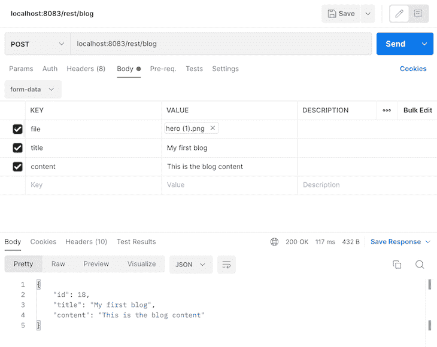
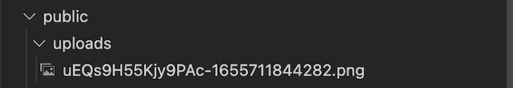
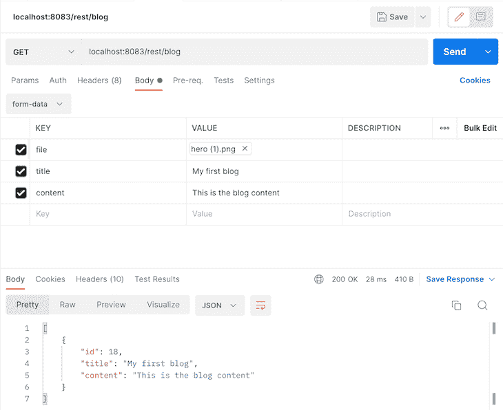

# 如何使用 Ts 构建服务器端应用？ED 和 MySQL 

> 原文：<https://blog.logrocket.com/build-server-side-application-ts-ed-mysql/>

Ts。ED 是一个 Node.js 框架，用于通过简单的设置构建可伸缩的服务器端应用程序。用 TypeScript， [Ts 开发。ED](https://tsed.io/) 允许你用面向对象编程、函数式编程或者装饰器来构建你的应用。您可以选择完整的现成项目，也可以自己定制项目。

在本文中，我们将学习如何用 Ts 构建一个服务器端应用程序。通过构建一个简单的博客文章数据库。要完成本教程，您需要在您的计算机上安装以下软件:

*   Node.js v14.x
*   MySQL 数据库
*   邮递员

Ts 的开发者。ED 提供了丰富的文档来帮助您快速入门。我绝对推荐在开始学习教程之前先检查一下。此外，本教程的完整代码可从 Git [H](https://github.com/icode247/Ts.ed-serverside-application) [ub](https://github.com/icode247/Ts.ed-serverside-application) 上获得。你可以随意克隆它来跟随。我们开始吧！

## 目录

## Ts。ED 福利

在我们开始编码之前，让我们考虑一下 Ts。对于 web 开发人员来说，ED 是一个很好的 Node.js 框架。首先，它允许您使用 OpenSpec 和 JSON 模式投诉更快地创建 REST APIs。丰富的 CLI 工具允许您创建一个预配置的服务器，为您节省一些时间，它有许多插件，您可以从中选择来创建您的堆栈。

Ts。ED 是一个基于类的框架，因此，控制器、管道和中间件是作为一个类创建的。最后，它有一些嵌入式功能，使测试您的应用程序更加容易。当我们浏览教程时，我们将看到这些功能的实际应用。我们开始吧！

## 资助一项新工程

为了建立我们的新项目，我们首先需要安装 [Ts。使用以下命令编辑 CLI](https://cli.tsed.io/) :

```
npm install -g @tsed/cli

```

安装完成后，使用以下命令创建一个文件夹并初始化一个新项目:

```
mkdir tsed-demo && cd tsed-demo
tsed init .

```

上面的命令将创建一个名为`tsed-demo`的新文件夹。`tsed init .`命令将提示您选择所需的配置。选择以下选项:

*   目标平台:**快递**
*   项目架构: **Ts。埃德**
*   约定文件样式:选择 **Ts。埃德**
*   您的项目所需的功能:**数据库**
*   数据库的表单:**类型表单**
*   要安装的类型: **MySQL**
*   包装经理:**纱**

Ts。ED 将在文件夹的根目录下创建一个新项目，在 init 命令中用`.`表示。Yarn 正在安装运行应用程序所需的包，请稍候；一旦安装完成，Ts。ED 将创建以下文件夹结构:

```
tsed-demo
┣ node_modules
┣ src
┃ ┣ config
┃ ┃ ┣ envs
┃ ┃ ┃ ┗ index.ts
┃ ┃ ┣ logger
┃ ┃ ┃ ┗ index.ts
┃ ┃ ┗ index.ts
┃ ┣ controllers
┃ ┃ ┗ rest
┃ ┃ ┃ ┣ HelloWorldController.ts
┃ ┃ ┃ ┗ index.ts
┃ ┣ datasources
┃ ┃ ┗ MysqlDatasource.ts
┃ ┣ Server.ts
┃ ┗ index.ts
┣ .DS_Store
┣ .barrelsby.json
┣ .dockerignore
┣ .gitignore
┣ Dockerfile
┣ README.md
┣ docker-compose.yml
┣ package.json
┣ processes.config.js
┣ tsconfig.compile.json
┣ tsconfig.json
┗ yarn.lock

```

让我们回顾一下最重要的文件:

*   `Server.ts`:主服务器配置文件，其中配置了运行应用程序所需的所有配置
*   `index.ts`:引导应用程序的根文件
*   `src/config`:每个 Ts 的配置文件夹。ED 项目
*   `src/datasource`:所选数据库管理系统的配置
*   `src/controllers/rest`:控制器文件夹。默认情况下，Ts。ED 监听`/rest`端点以访问控制器中的路由

## 更新数据源

创建项目后，让我们创建并连接到数据库。用下面的命令打开 MySQL shell:

```
mysql -u root -p

```

然后，使用下面的命令创建一个博客数据库:

```
CREATE DATABASE blog;

```

现在，打开`src/datasources/MysqlDatasource.ts`文件，用下面的代码片段更新数据源:

```
...
export const MysqlDataSource = new DataSource({
  type: "mysql",
  entities: [],
  host: "localhost",
  port: 3306,
  username: "YOUR DATABASE USERNAME",
  password: "YOUR DATABASE USERNAME",
  database: "blog",
  synchronize: true,
});
...

```

在上面的配置中，我们将数据源的值修改为数据库的值。我们包含了`synchronize: true`来允许 Ts。为我们的数据库生成表格。

## 创建实体模型

让我们为我们的博客数据库创建一个实体模型。我们可以使用下面的命令轻松做到这一点:

```
tsed generate

```

从提供商列表中选择`**model**`。该命令应该在`src`文件夹中生成一个`models/BlogService.ts`文件。接下来，使用下面的代码片段创建一个模型:

```
import {Property} from "@tsed/schema";
import {Column, Entity, PrimaryGeneratedColumn, CreateDateColumn, UpdateDateColumn} from "typeorm";

@Entity()
export class BlogModel {
  @Property()
  @PrimaryGeneratedColumn()
  id: string;

  @Column()
  title: string;

  @Column()
  content: string;

  @Column()
  coverImage: string;

  @Column()
  @CreateDateColumn()
  createdAt: Date;

  @Column()
  @UpdateDateColumn()
  updatedAt: Date;
}

```

为了创建一个实体，我们导入了`Entity`和`Column`装饰器。`PrimaryGeneratedColumn`将为实体生成一个主键，`CreateDateColumn`和`UpdateDateColumn`将创建、自动生成、标注日期并更新日期。

接下来，您需要使数据源中的`entities`数组中的`BlogModel`可用:

```
export const MysqlDataSource = new DataSource({
  ...
  entities: [BlogModel],
  ...
});

```

## 配置乘法器

现在，让我们配置 Multer，允许用户上传保存在数据库中的每个博客的封面图片。Ts。ED 已经有了这个设置的配置。只需转到`Server.ts`文件，[用下面的代码片段将 Multer 添加到配置](https://blog.logrocket.com/multer-nodejs-express-upload-file/)中:

```
...
import { diskStorage } from "multer";

...
@Configuration({
  ...
  multer: {
    storage: diskStorage({
      destination: join(process.cwd(), "./public/uploads"),
      filename: (req, file, cb) => {
        const ext = file.mimetype.split('/')[1];
        cb(null, `${generateName(15)}-${Date.now()}.${ext}`);
      }
    })
  },
  ...

```

使用 Multer 上传文件有几种方法。在本演示中，我们将文件存储在磁盘存储器中。我们从 Multer 导入了`diskStorage`，Ts 已经自动为我们安装好了。在项目设置期间。

然后，我们在文件系统中指定文件将存储在服务器中的位置，并通过创建一个`generateName`函数来修改文件的文件名。`generateName`函数将为每个上传的文件生成 15 个随机字符串，并将文件上传的日期附加到文件名中。

现在，用下面的代码片段创建`generateName`函数:

```
function generateName(length: number) {
  let str = '';
  const characters = 'ABCDEFGHIJKLMNOPQRSTUVWXYZabcdefghijklmnopqrstuvwxyz0123456789';
  const charactersLength = characters.length;
  for (let i = 0; i < length; i++) {
    str += characters.charAt(Math.floor(Math.random() * charactersLength));
  }
  return str;
}

```

您可以在 [Ts 中看到其他 Multer 选项。ED 文档](https://tsed.io/docs/upload-files.html#options)。

## 创建应用服务

创建了模型实体后，让我们使用下面的 generate 命令生成一个服务:

```
tsed generate service

```

然后，命名服务博客并点击**回车**键。Ts。ED 将用一个`BlogService.ts`文件创建另一个名为`services`的文件夹。现在，用下面的代码片段更新文件:

```
import { Injectable } from "@tsed/di";
import { Inject } from "@tsed/di";
import { MYSQL_DATA_SOURCE } from "../datasources/MySqlDataSource";
import { DataSource } from "typeorm";
import { BlogModel } from "../models/BlogModel";

@Injectable()
export class BlogService {
    constructor(@Inject(MYSQL_DATA_SOURCE) private dataSource: DataSource) { }

    async getAll(): Promise<BlogModel[]> {
        return await this.dataSource.getRepository(BlogModel).find();
    }

    async create(blog: BlogModel): Promise<BlogModel> {
        return await this.dataSource.getRepository(BlogModel).save(blog);
    }

    async getById(id: string): Promise<any> {
        return await this.dataSource.getTreeRepository(BlogModel).findOne({ where: { id } });
    }

    async update(id: string, blog: BlogModel): Promise<any> {
        return await this.dataSource.getRepository(BlogModel).update(id, blog);
    }

    async delete(id: string): Promise<any> {
        return await this.dataSource.getRepository(BlogModel).delete(id);
    }

}

```

在上面的代码片段中，我们使用`Inject`装饰器将数据源注入到构造函数中。在那里，我们从`DataSource`类创建了一个实例变量，提供了对`getRepository`方法的访问，该方法提供了我们在数据库上执行 CRUD 操作所需的方法。

## 创建应用控制器

现在，我们需要我们的 API 路由来使用我们为这个应用程序创建的 CRUD 服务。为此，我们需要用下面的命令生成一个控制器:

```
tsed generate controller

```

命名控制器`blog`，选择`**rest**`作为首选控制器，选择 **`/blog`** 作为根端点，点击**回车**按钮。Ts。ED 将在控制器的文件夹中创建一个`BlogService`文件。

接下来，用下面的代码片段为`BlogService`创建控制器:

```
import { Controller, Inject } from "@tsed/di";
import { Get, Post, Put, Delete } from "@tsed/schema";
import { BlogService } from "src/services/BlogService";
import { BlogModel } from "src/models/BlogModel";
import { BodyParams, PathParams } from "@tsed/platform-params";
import { MultipartFile, PlatformMulterFile } from "@tsed/common";

@Controller("/blog")
export class BlogController {
  constructor(@Inject(BlogService) private blogService: BlogService) { }

  @Get("/")
  get(): Promise<BlogModel[]> {
    return this.blogService.getAll();
  }

  @Post("/")
  create(@MultipartFile("file") file: PlatformMulterFile, @BodyParams() blog: BlogModel): Promise<BlogModel> {
    blog.blogImage = file.filename;
    return this.blogService.create(blog);
  }

  @Get("/:id")
  getOne(@PathParams("id") id: string): Promise<BlogModel> {
    return this.blogService.getById(id);
  }

  @Put("/:id")
  update(@PathParams("id") id: string, @BodyParams() blog: BlogModel): Promise<BlogModel> {
    return this.blogService.update(id, blog);
  }

  @Delete("/:id")
  delete(@PathParams("id") id: string): Promise<BlogModel> {
    return this.blogService.delete(id);
  }
}

```

在上面的代码片段中，我们在我们的`BlogController`构造函数中注入了`BlogService`类，并为该类创建了一个私有实例，从而能够访问在`BlogService`中定义的方法。

然后，我们使用`GET`、`POST`、`PUT`和`DELETE`装饰器定义了应用程序的 CRUD 路径。Ts。艾德为我们提供了另外两个装饰师，`PathParams`和`BodyParams`。这两个装饰器使我们能够解析来自请求体和请求参数的数据。

然后，用 Multer 上传文件，我们导入了 Ts.ED 提供的`MultipartFile`和`PlatformMulterFile`decorator。

## 提供静态文件

为了在我们的应用程序中提供封面图像和文件，我们需要配置应用程序来提供静态文件。我们还将在`Server.ts`文件中使用下面的代码片段来完成这项工作:

```
...
@Configuration({
  ...
  statics: {
    "/static": [
      {
        root: `./public`,
        // Optional
        hook: "$beforeRoutesInit" // Load statics on the expected hook. Default: $afterRoutesInit
        // ... statics options
      }
    ]
  }
  ...

```

Ts。ED 使用`statics`对象来配置静态文件。该对象将 URL 路径作为必需的参数。因此，我们从`/static`路径访问静态文件。URL 路径也接受一个数组作为键值对。在这个数组中，我们指定了静态文件的位置。在本演示中，我们希望它们位于 public 文件夹中，我们将很快创建该文件夹。

现在，在项目的根目录下创建一个`public`文件夹。你可以在文档中找到更多的[静态选项。](https://tsed.io/docs/serve-files.html#statics-options)

## 测试应用程序

现在，让我们使用 Postman 测试我们的应用程序。在此之前，使用下面的命令启动服务器:

```
yarn start

```

上面的命令将在端口`8083`上启动服务器，这是为 Ts 配置的默认端口。ED 项目。接下来，打开 Postman 并测试创建路由，如下图所示:



如果您打开`public`和`uploads`文件夹，您应该会看到上传的封面图像:



然后，测试`get-all`路线以获取所有博客，如下所示:



请随意测试其他路线。

## 结论

在本教程中，我们探讨了 Ts。通过构建一个简单的博客数据库应用程序。Ts。ED 是一个现代的 Node.js 框架，用于创建可伸缩的服务器端应用程序。

带 Ts。ED，您可以轻松快速地开发服务器端应用程序。您可以构建和管理像网站和博客这样的小规模应用程序，而无需进行任何初始服务器配置。请随意阅读更多关于 Ts 的内容。编辑自[官方文件](https://tsed.io/)。编码快乐！

## 200 只显示器出现故障，生产中网络请求缓慢

部署基于节点的 web 应用程序或网站是容易的部分。确保您的节点实例继续为您的应用程序提供资源是事情变得更加困难的地方。如果您对确保对后端或第三方服务的请求成功感兴趣，

[try LogRocket](https://lp.logrocket.com/blg/node-signup)

.

[](https://lp.logrocket.com/blg/node-signup)[https://logrocket.com/signup/](https://lp.logrocket.com/blg/node-signup)

LogRocket 就像是网络和移动应用程序的 DVR，记录下用户与你的应用程序交互时发生的一切。您可以汇总并报告有问题的网络请求，以快速了解根本原因，而不是猜测问题发生的原因。

LogRocket 检测您的应用程序以记录基线性能计时，如页面加载时间、到达第一个字节的时间、慢速网络请求，还记录 Redux、NgRx 和 Vuex 操作/状态。

[Start monitoring for free](https://lp.logrocket.com/blg/node-signup)

.