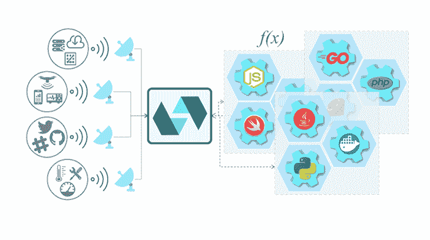
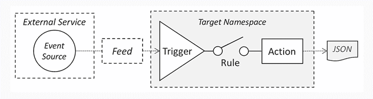
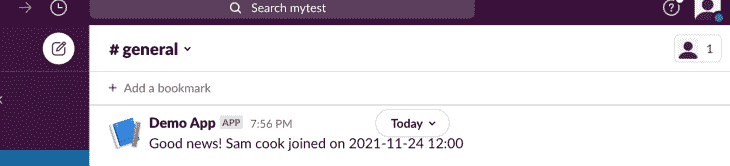

# 用 Node.js 和 OpenWhisk - LogRocket Blog 构建一个无服务器应用

> 原文：<https://blog.logrocket.com/build-serverless-app-node-js-openwhisk/>

无服务器架构意味着我们可以在无需管理服务器的情况下构建和部署应用，并为开发人员提供高可扩展性、快速发布和更低的成本。

Apache OpenWhisk 是最成熟、功能最丰富的无服务器框架之一。它允许我们用简单的无状态函数构建一个复杂的应用程序。

由于它是一个开源平台，开发人员可以在本地运行整个平台，这使得开发、故障排除和测试更加容易。

本文将探讨如何在本地设置 OpenWhisk 并开发一个无服务器的 Node.js 应用程序。我们将使用每次向 Slack 通道添加新用户时发送消息的例子来演示 OpenWhisk 的特性。

## 什么是 Apache OpenWhisk？

OpenWhisk 由 [Apache 软件基金会](https://www.apache.org/)开发，因此被称为 *Apache* OpenWhisk。它支持广泛的编程语言，如 [Node.js](https://blog.logrocket.com/tag/node) 、Swift、Java、Go 和 Scala *。*

与 AWS Lambda 或 Azure Functions 等其他主流无服务器平台相比，OpenWhisk 提供了类似的功能，如丰富的编程模型、广泛的语言支持、可伸缩性和效率。

AWS 和 Azure 的无服务器功能是它们自己生态系统的一部分，这使得将无服务器功能集成到它们的其他服务(如云存储或监控服务)变得更加容易。OpenWhisk 的主要优势是它是一个开源平台，因此我们可以在本地或云提供商处部署 OpenWhisk，并避免供应商锁定。

如下图所示，OpenWhisk 支持事件驱动的编程模型。



Source: [Apache OpenWhisk](https://openwhisk.apache.org/)

以下是 OpenWhisk 的核心概念:

*   动作:也称为函数，这些是运行在平台上响应事件的代码片段
*   触发器:定义命名事件流
*   规则:用于将触发器与一个或多个操作相关联—每次触发触发器事件时，都会调用该操作



Source: [Apache OpenWhisk](https://openwhisk.apache.org)

## 在本地设置 OpenWhisk

要设置本地 OpenWhisk 开发环境，我们需要一些东西。

本地运行 OpenWhisk 最简单的方法是使用 Docker 并启用 [Kubernetes](https://github.com/apache/openwhisk-deploy-kube/blob/master/README.md#kubernetes) 。在[安装 Docker](https://docs.docker.com/desktop/mac/install/) 后，按照这个逐步指南[在 Docker](https://docs.docker.com/desktop/mac/) 内启用 Kubernetes。

我们还需要使用 [Helm](https://helm.sh/) 作为本地 Kubernetes 集群的包管理器。要安装 Helm，请运行以下命令:

```
brew install helm
```

### 在本地 Kubernetes 集群上设置 OpenWhisk

克隆[Apache open whish Kubernetes 部署存储库](https://github.com/apache/openwhisk-deploy-kube.git)，其中包含用于部署配置的`mycluster.yaml`文件。

```
git clone https://github.com/apache/openwhisk-deploy-kube.git
```

现在，从 Helm 存储库中部署[图表](https://helm.sh/docs/topics/charts/)——Helm 的打包格式。打开您的终端并运行以下命令:

```
cd openwhisk-deploy-kube
helm repo add openwhisk https://openwhisk.apache.org/charts
helm repo update
helm install owdev openwhisk/openwhisk -n openwhisk --create-namespace -f /deploy/docker-macOS/mycluster.yaml
```

请注意，我们使用`owdev`作为发布名称，使用`openwhisk`作为图表资源将被部署到的名称空间。

安装过程将需要一些时间。要检查其状态，请使用以下命令:

```
kubectl get pods -n openwhisk -- watch
```

当您看到`owdev-install-packages-xxx`的状态是`Completed`时，那么您的 OpenWhisk 部署就准备好了！


现在，安装并配置 OpenWhisk CLI。为了管理和开发 OpenWhisk 实体，我们需要如下设置 OpenWhisk CLI ( `wsk`)。

```
brew install wsk
// To verify the installation
Wsk -help
```

最后一步是将您的 CLI 配置为指向我们的本地 OpenWhisk 平台 API 端点，并提供相关的身份验证凭据。

```
wsk property set --apihost localhost:31001
wsk property set --auth 23bc46b1-71f6-4ed5-8c54-816aa4f8c502:123zO3xZCLrMN6v2BKK1dXYFpXlPkccOFqm12CdAsMgRU4VrNZ9lyGVCGuMDGIwP
```

要验证 CLI 配置，请使用以下命令:

```
wsk list -v
```

这个命令向 OpenWhisk API 端点发送一个`READ` HTTP 请求。

```
[GET]    https://localhost:31001/api/v1/namespaces/_/actions?limit=0&skip=0
```

如果您看到屏幕上打印的 http 请求和响应，那么恭喜您，您已经准备好了！

## 无服务器 OpenWhisk 项目结构

[无服务器框架](https://www.serverless.com/)是一个开源的 npm 包，可以更容易地将无服务器功能部署到各种平台中。它的 YAML 配置提供了对无服务器应用程序结构、环境和资源的标准抽象。

首先，让我们安装无服务器框架和 OpenWhisk [provider 插件](https://github.com/serverless/serverless-openwhisk)。

```
npm install --global serverless serverless-openwhisk
```

为了创建 Node.js 应用程序框架，我们使用来自 Serverless 的预定义模板。

```
serverless create --template openwhisk-nodejs --path nodeWhiskService
Cd nodeWhiskService
npm install
```

项目框架已经生成。项目中的重要文件有:

*   `serverless.yml`–无服务器配置文件
*   `handler.js`–node . js 的主入口点

`serverless.yml`文件如下所示:

```
service: nodewhiskservice

provider:
 name: openwhisk
 ignore_certs: true

functions:
 hello:
   handler: handler.hello
   events:
     - http: GET hello

plugins:
 - serverless-openwhisk
```

配置文件包括以下部分:

*   提供者:定义无服务器提供者。`ignore_certs`属性被设置为`true`,因为我们想要在本地托管的 OpenWhisk 平台上运行服务
*   功能:包含服务中的所有功能:
    *   生成的样本`hello`是默认`handler.js`文件中唯一的函数
    *   `handler`属性指向处理函数；在这种情况下，`handler.hello`被映射到`handler.js`中的`hello()`函数
*   插件:包含项目的插件列表

因为我们要为不同的动作创建多个处理程序，所以让我们添加一个`source`文件夹来更好地构建项目。

```
    - src
          |-- handler
             |-- createHandler.js
             |-- updateHandler.js
             |-- listHandler.js
             |-- deleteHandler.js
    - package.json
    - ....
    -serverless.yml
```

## 使用 web 操作添加新用户

首先，让我们创建一个`userCreate`动作来添加一个新用户。

```
// JavaScript
// createHandler.js
'use strict';

function createUser(user){
 console.log('create user');
 const newUser = {name: user.name || 'Peter', age: user.age || 20};
 // Save user to database ....
 return newUser;
}

exports.user = createUser;
```

为了简单起见，上面的函数只是返回一个`newUse` r JSON 对象，而不是实现将它保存到数据库的逻辑。

* * *

### 更多来自 LogRocket 的精彩文章:

* * *

然后，我们更新`serverless.yml`来添加新功能的配置。我们在配置文件中设置了注释`web-export: true`，这使得该功能成为一个 web 动作。

```
functions:
 userCreate:
   handler: src/handler/createHandler.user
   events:
     - http: POST user
   annotations:
     web-export: true
```

让我们部署服务并测试它。

```
// deploy all the functions and resources in the serverless.yml
serverless deploy -v
// only update the function
serverless deploy function -f createUser
```

输出如下所示:

```
endpoints (web actions):
https://localhost:31001/api/v1/web/23bc46b1-71f6-4ed5-8c54-816aa4f8c502/userCreate
```

我们可以使用下面的无服务器`invoke`函数来测试它。或者，我们也可以使用工具如 [cURL](https://curl.se/) 或 [Postman](https://www.postman.com/) 来调用动作。

```
serverless invoke --function userCreate --data '{"name": "test","age":30}'
```

如果一切正常，将显示以下结果。

```
Serverless:  
{
    "age": 30,
    "name": "test"
}
```

## 使用动作调用外部 API

下一个任务是从 OpenWhisk 动作调用外部 API。在本例中，我们将向 Slack 应用程序通道发送 Slack 消息。

发布 Slack 消息最简单的方法是使用[Slack incoming web hook](https://api.slack.com/messaging/webhooks)，你可以在他们的文档中读到更多。

设置好传入的 webhook 后，我们可以在`slackHandler.js`文件中使用它。

```
// JavaScript
function postMessage(channel, text, callback) {
 var options = {
   'method': 'POST',
   'url': 'https://hooks.slack.com/services/[SLACK_WEB_HOOK_URL]',
   'headers': {
     'Content-Type': 'application/json'
   },
   body: JSON.stringify({
     "text": text
   })
  };
 request(options, function (error, response) {
   if (error) {
     throw new Error(error);
   }
   console.log(response.body);
 });
}
```

然后我们需要修改`serverless.yml`来添加 Slack 动作。

```
 slack:
   handler: src/handler/slackHander.sendMessage
   events:
      - trigger: newUserTrigger
```

您可能会注意到`events`部分下的`trigger`设置。这是因为我们希望通过规则而不是 HTTP 请求来触发它。

## 配置触发器和规则

OpenWhisk 触发器类似于事件，规则用于将触发器与操作相关联。

当一个触发器被调用时，所有通过规则与其相关联的操作也将被调用。

添加上述触发器配置后，还会自动生成一个触发器及其规则。新规则将`newUserTrigger`与`slack`动作相关联。如果您列出所有规则，您可以在下面看到新生成的规则。

```
userservice_newUserTrigger_to_slack              private              active
```

这里我们想要实现的是在新用户创建后发布一个 Slack 消息。让我们将`createUser`函数修改如下:

```
// JavaScript
const openwhisk = require('openwhisk');

const triggerSlack = async params => {
 const name = 'newUserTrigger';
 const ow = openwhisk();
 await ow.triggers.invoke({name, params});
}

async function createUser(user){
 console.log('create user');
 const newUser = {name: user.name || 'Peter', age: user.age || 20};
 // Save user to database ....
 await triggerSlack(newUser);

 return newUser;
}

exports.user = createUser;
```

在上面的代码中，我们使用 OpenWhisk JavaScript SDK 以编程方式调用`newuserTrigger`。现在，如果我调用`userCreate`动作，Slack 通道中将出现一条 Slack 消息。松弛通道在[松弛引入网钩](https://api.slack.com/messaging/webhooks)中定义。



触发器可以将多个松散耦合的动作连接在一起。它还可以使您的应用程序更容易扩展——例如，如果我需要在用户创建后发送 Twitter 消息，Twitter 处理程序可以很容易地与新的 Twitter 触发器连接，我们可以将其与`userCreate`操作相关联，这样两个操作都可以执行。

## 创建执行多项任务的动作序列

在前面的步骤中，我们创建了单个 web 操作来执行单个任务。但是我们可以一个接一个地执行多个任务，并将一个任务的输出传递给下一个任务的输入吗？

open 晶须提供了[序列特征](https://github.com/apache/openwhisk/blob/master/docs/actions.md#creating-action-sequences)来实现这一点。

让我们根据这个例子添加一个序列。在上一步中，我们构建了一个`userCreate` web 动作。在我们创建一个用户之后，我们想要调用一个`listUser`动作。此操作会将新用户添加到现有用户列表中，并返回该列表。我们希望这两个操作将按顺序执行。

```
// listHandler.js

function listUser(params) {
 return new Promise((resolve, reject) => {
   setTimeout(() => {
     console.log("get list of users from a repository...");
     const result = { users: [{ name: "John", age: 40 }] };
     if (params && params.name) {
       const newUser = { name: params.name, age: params.age };
       result.users.push(newUser);
     }
     resolve(result);
   }, 1000);
 });
}

exports.user = listUser;
```

在`listUser`函数中，我们将`userCreate`的输出作为输入，并将其添加到现有的用户列表中。

我们如何将这两个动作联系在一起，形成一个序列？无服务器框架让它变得非常简单。

```
// Serverless.yml 
userCreateAndList:
   sequence: # Use sequences rather than handlers to handle events. handler and sequence properties are mutually exclusive.
     - userCreate
     - userList
   events:
     - http: POST createList
```

在上面的配置中，我们定义了一个序列`userCreateAndList`。它由两个动作组成:`userCreate`和`userList`。这个序列可以被 HTTP post 端点`createList`调用。

最后一步是再次部署服务，以使新创建的操作和序列生效。然后我们可以使用 cURL 或 Postman 测试我们的第一个序列。示例 cURL 命令如下所示。

```
curl --request POST '[Your Local createUser url]' \
--header 'Content-Type: application/json' \
--data-raw '{
    "name": "Sam cook",
    "age": 23
}'
```

输出将是这样的:

```
{
  "users": [{
    "age": 40,
    "name": "John"
  }, {
    "age": 23,
    "name": "Sam cook"
  }]
}
```

作为输出的一部分，我们还收到了一条 Slack 消息。

## 摘要

在本文中，我们介绍了如何设置本地 OpenWhisk 环境。然后，我们使用无服务器框架开始一个新的服务项目。我们还演示了如何创建 web 操作、触发器、规则和序列。下图说明了我们构建的用户服务。


OpenWhisk provides a solid open source option in the serverless world. You have the flexibility to deploy it on-premises or via a cloud provider, as well as avoid vendor lock-in.

无服务器框架使得编写可以部署到任何供应商的无服务器应用成为可能。有了 OpenWhisk 的无服务器框架插件，部署和管理 web 动作、触发器、规则和序列变得相当简单。

希望这篇文章对你有用。示例源代码可以在[这里](https://github.com/sunnyy02/nodeOpenwhisk)找到。

## 200 只显示器出现故障，生产中网络请求缓慢

部署基于节点的 web 应用程序或网站是容易的部分。确保您的节点实例继续为您的应用程序提供资源是事情变得更加困难的地方。如果您对确保对后端或第三方服务的请求成功感兴趣，

[try LogRocket](https://lp.logrocket.com/blg/node-signup)

.

[](https://lp.logrocket.com/blg/node-signup)[https://logrocket.com/signup/](https://lp.logrocket.com/blg/node-signup)

LogRocket 就像是网络和移动应用程序的 DVR，记录下用户与你的应用程序交互时发生的一切。您可以汇总并报告有问题的网络请求，以快速了解根本原因，而不是猜测问题发生的原因。

LogRocket 检测您的应用程序以记录基线性能计时，如页面加载时间、到达第一个字节的时间、慢速网络请求，还记录 Redux、NgRx 和 Vuex 操作/状态。

[Start monitoring for free](https://lp.logrocket.com/blg/node-signup)

.