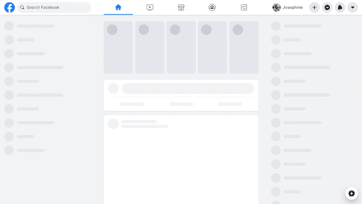
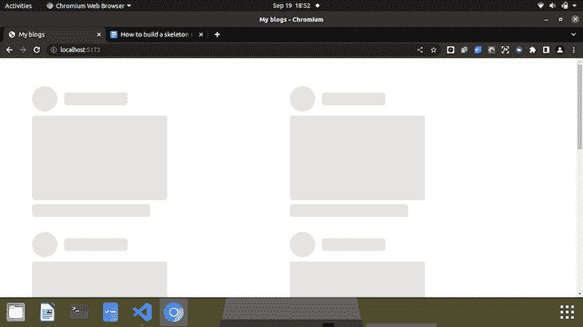
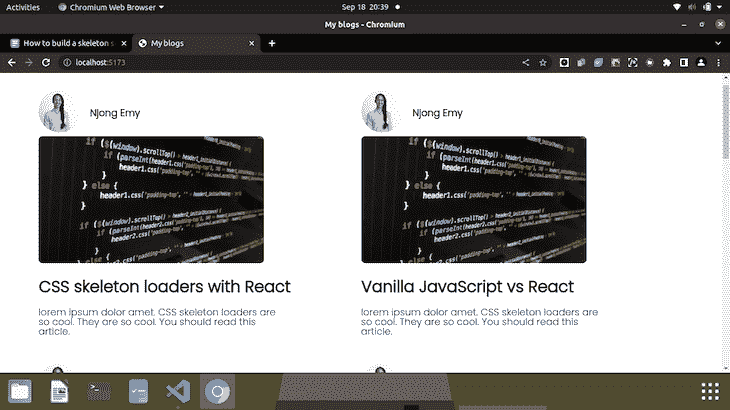
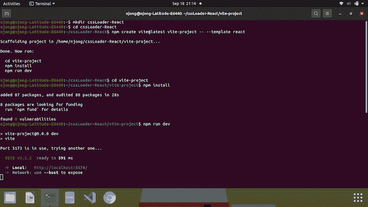
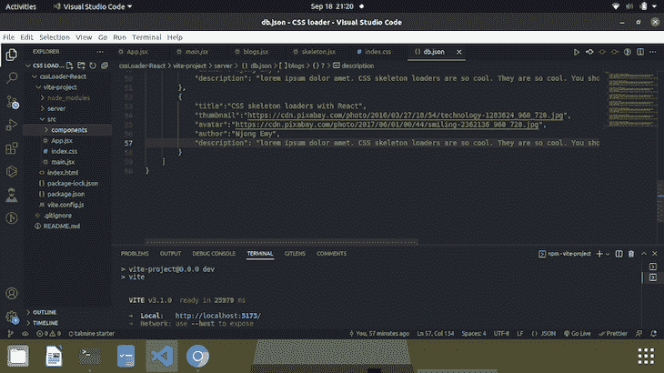
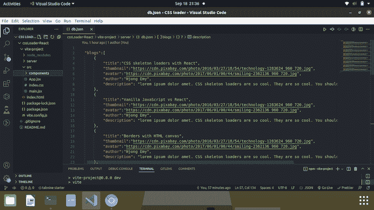
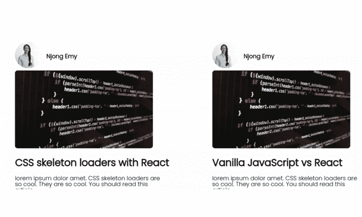

# 如何用 CSS 和 React 构建骨架屏幕

> 原文：<https://blog.logrocket.com/build-skeleton-screen-css/>

随着最近网络的发展，对开发者和用户来说事情都变得更好了。用户体验是一个超出当前衡量标准的巨大话题，因为改善用户体验的新方法会随着时间的推移而不断发展。

改善 UX 的一部分是骨架屏幕。在本文中，我们将探索骨架加载器，它们的重要性，以及如何使用 React 和 vanilla CSS 为您的站点构建一个骨架加载器。

向前跳:

## 什么是 CSS 框架？

让我们检查一个案例研究，然后是三个场景。

**案例分析:**您看到这篇文章的链接，并决定点击它。数据需要一段时间才能到达。

**场景 1:** 当你等待网站显示文章时，你看到的只是一个空白的屏幕。你不知道加载的时候屏幕会怎么显示，你也不知道什么时候。

**场景 2:** 当数据加载时，你所看到的只是一个旋转器，表示数据正在传输中。你知道货物后面有东西要来，但是你也不知道它会是什么样子或者什么时候到达。

**场景 3:** 当页面加载时，你会注意到这些灰色的形状呈现出页面应该呈现的结构。在您等待的过程中，您已经知道页面可能是什么样子了。你不知道数据什么时候会到来，但是这种情况让你期待它会比实际到来的时间更早。

最后一个场景是所谓的感知性能的一部分。这给人的印象是，网站的加载速度比实际速度要快，因为用户已经对网站的外观有了概念。

下面是一个脸书骨架装载机的例子。



如您所见，灰色形状代表数据加载后的显示方式。当数据最终从服务器到达时，它会取代屏幕上的灰色形状。

骨架式装载机并不能完全提高性能或装载速度。它们只是在页面加载时给用户一些东西看，让他们觉得页面加载得更快了。

## 为什么骨架装载机很重要？

现在，让我们看看为什么骨架加载器很重要，以及什么时候应该使用它们。

*   用户希望快速和优化的网站。加载器带来了很好的用户体验，因为它们让用户知道数据已经被获取并且正在传输中
*   它们旨在让用户感觉数据加载速度比实际速度要快

现在的问题是，你什么时候应该为你的站点使用框架加载器？

## 何时使用骨架加载器

在下列情况下，您可以选择使用骨架装入程序:

*   你的网站处理太多的流量。如果有太多的用户一直在使用你的网站，那么在某些时候你会感觉很慢。加载器是让用户留在网站上的好方法
*   有些过程需要一段时间才能完成。例如，从某个数据库或服务器获取数据
*   您的站点位于互联网连接不太好的偏远地区。有些人认为，当数据加载时间低于 3s 时，不应该使用加载器

## 用 React 和 CSS 构建骨架加载器

对于这篇文章的教程，我们将创建一个简单的页面，以卡片的形式显示某个特定博主的文章。我们的最终结果将看起来如下。

骨架视图:



实际站点:



### 先决条件

本教程对初学者非常友好，但有一些细节需要检查，以便你可以自由跟随。

*   在您的计算机上安装节点。你可以点击这里的获得最新版本，如果你没有的话也可以下载
*   文本编辑器。我使用 VS 代码
*   React 中概念的基本知识，如组件
*   一台有可用浏览器的电脑…因为如果没有，我们在这里做什么？

## 设置 React 应用程序

在本教程中，我们将非常不同地设置 React 应用程序。但是首先，让我们把目录设置好。

*   运行`mkdir cssLoader-React`然后运行`cd cssLoader-React`导航到新创建的目录
*   代替传统的`npx create-react-app`，我们将使用一个叫做 [Vite](https://vitejs.dev/) 的工具来设置它。Vite 是一个帮助您优化开发环境的构建工具。它重量轻，速度非常快
*   要设置 Vite，请在终端中键入`npm create [[email protected]](/cdn-cgi/l/email-protection) vite-project -- --template react`。`npm create [[email protected]](/cdn-cgi/l/email-protection)`将 Vite 添加到我们的项目中，它后面的几行描述了我们项目的名称，并为我们安装了 React



以下指令要求我们运行`cd vite-project`来导航到新创建的目录，`npm install`来添加 node_modules 以便安装我们的依赖项，以及`npm run dev`来启动服务器。

如果你使用过 Vite 来设置这个，那么你会意识到从头开始创建一个 React 应用程序有多快。

在您选择的任何文本编辑器中打开该文件夹。我们的应用程序已经设置好了，现在是时候从样板文件中添加和删除我们不需要的内容了。我们首先清除 App 组件和默认 index.css 文件中的所有内容。我们想要创建两个新文件夹:一个名为`components`的文件夹在`/src`文件夹中，另一个名为`server`的文件夹在根目录中。我们的新项目结构如下所示:



我们有一个服务器文件夹的原因是我们要建立一个类似数据库的结构，在那里我们可以存储关于博客的数据。别担心，我们不会进入任何后端。我们将用 [JSON 服务器](https://www.npmjs.com/package/json-server)设置一个假的 REST API。

因此，在`/server`文件夹中，让我们创建一个名为`db.json`的文件，并用一些您通常会在博客上看到的随机数据填充它，如头像、作者姓名、缩略图、标题和描述。注意，`/server`文件夹是在顶层目录或根目录下创建的。

回到我们的`db.json`文件，内容应该是这样的:



每个顶级属性都被视为一种资源，并且为每个资源创建端点。

使用 JSON 服务器包，我们需要监视这个文件，这样我们就可以创建它的端点，以及 POST、GET、DELETE 等其他操作。，这是我们可能想要执行的(本文未涉及)。

为此，打开一个新的终端并运行`npx json-server -watch server/db.json -port 5000`。如果运行成功，那么终端应该在端口 5000 上启动服务器，并开始观察任何变化。

如果您在浏览器中复制并粘贴 [http://localhost:5000](http://localhost:5000) ，您会看到 JSON 文件已经托管在 localhost 上。您还应该将[http://localhost:5000/blogs](http://localhost:5000/blogs)作为参考资料。

做完这些，我们就可以开始编码了。为了跟踪代码，你可以在这里查看完整的文件和文件夹。

### HTML/CSS 并为站点做出反应

首先，让我们先从本地服务器获取数据。成功提取并处理任何提取错误后，我们将创建一个模板来显示数据。

所以，在我们的`app.jsx`:

```
import { useState, useEffect } from 'react';

const App = () => {
   const [blogs, setBlogs] = useState(null);
   const [error, setError] = useState(false);
   const [loading, setLoading] = useState(true);
   useEffect(() => {
       setTimeout(() => {
           fetch(' http://localhost:5000/blogs')
           .then(response => {
               if(!response.ok){
                   throw Error('Sorry, some error occurred while fetching your blogs.');
               }
               return response.json();
           })
           .then(data => {
               setBlogs(data);
               setLoading(false);
               setError(false);
           })
           .catch(err => {
               console.log(err.message);
               setError(true);
           })

       }, 4000)
   })

   return(
       <div>
          {blogs && <Blogs blogs = {blogs} /> }
          {error && <div className='container'><span className='error'>Error connecting to the server. Connection failed.</span></div>}
       </div>
   )
}

export default App;

```

当我们获取和显示数据时，页面上会有一些元素发生变化，因此我们需要`useState`钩子来跟踪这些元素。我们首先将我们的博客初始化为空。如果数据没有返回，那么我们需要得到一个错误。再次使用`useState`，我们将 `error`的初始状态设置为假。我们需要初始化的另一件事是`loading`状态。这是预先设置为真的，因为数据在返回给我们之前需要被加载。

一旦页面第一次呈现，我们就使用`useEffect`钩子获取数据。我们将所有东西包装在一个`setTimeOut` 函数中，以便模拟获取过程。通常，在现实生活中你不会这样做。我们需要 4 秒钟的时间来查看骨骼装载器。

我们使用传统的 fetch 从资源中获取数据，如果状态代码不是 200，就处理一个错误。如果数据格式良好，我们解析对 JSON 的响应。既然这个‌is 是另一个承诺，我们需要用另一个`.**then**`方法来解决它。这里，我们将博客的状态从 null 更改为从服务器接收的实际数据。由于数据已经被接收并且不再“加载”，我们将`loading`的状态从真改为假。如果数据被返回，那么就没有错误，所以 `error` 的状态也会改变。

在组件的 return()中，我们有:

```
<div>
        {blogs && <Blogs blogs = {blogs} /> }
        {error && <div className='container'><span    className='error'>Error connecting to the server. Connection failed.</span></div>}
 </div>

```

第一行仅仅意味着，如果`blogs`已经被返回并且为真，那么呈现组件`<Blogs />`,将返回的数据(在本例中是博客)传递给它。逻辑 AND ( & &)确保只有当第一条语句为真时才执行第二条语句。第二行也是如此。如果`error`的状态为真，我们有一个显示错误消息的 div。

我们很快就会回到`loading`这个方面。

现在，我们将创建一个实际的`Blogs`组件。在 `/components`文件夹中，创建一个名为`blogs.jsx`的新组件文件。

```
const Blogs = ({blogs}) => {
   return(
       <div className="container">
           {blogs.map(blog => (
               <div className="blog">
                   <header>
                       <div className="avatar">
                           
                       </div>

                       <div className="author">
                           <p className="name">{blog.author}</p>
                       </div>
                   </header>

                   <main className="image">
                       
                   </main>

                   <footer>
                       <p className="title">{blog.title}</p>
                       <p className="text">{blog.description}</p>
                   </footer>
               </div>
           ))}
       </div>

   );
}

export default Blogs;

```

在这个组件中，我们将`blogs`作为道具传入，并进一步为我们博客的不同属性创建一个模板，如`blog.title`、`blog.description`等。

我们去掉了`index.css`中的样式，所以我们可以用下面的代码来代替:

```
@import url('https://fonts.googleapis.com/css2?family=Poppins:[email protected]&display=swap');

/* blogs display */
.container{
 display: grid;
 grid-template-columns: 6fr 6fr;
 margin: 4em;
 font-family: 'Poppins', sans-serif;
}
.blog{
 margin-bottom: 2em;
}
header{
 display:flex;
 align-items: center;
}
.author .name{
 font-weight: bold;
 font-size: large;
 margin-left: 1rem;
}
.title{
 font-weight:bold;
 font-size:30px;
}
.text{
 font-weight: lighter;
 font-size: large;
 line-height:1em;
 width: 25em;

}
footer{
 line-height: 1rem;
}
.avatar img{
  height: 80px;
  width: 80px;
  border-radius: 50%;
  object-fit: cover;
}

.image img{
 height: 70%;
 width: 70%;
 border-radius: 8px;
}
.error{
 color: red;
}

```

这不过是一个网格布局和字体。在`App`组件中导入`Blog`组件，我们的博客站点现在应该是这样的:


### 骨架装载机

对于骨架加载器，我们需要首先创建一个骨架结构。在`/components`文件夹中，让我们创建一个名为`skeleton.jsx`的新组件。

```
const Skeleton = () => {
   return(
           <div className="skeleton-blog">
               <header>
                   <div className="skeleton-avatar">
                   </div>

                   <div className="skeleton-author">
                   </div>
               </header>

               <main className="skeleton-image">
               </main>

               <footer className="skeleton-footer">
               </footer>
           </div>  

);
};

export default Skeleton;

```

这些都只是空的 div，我们将样式采取我们的实际网站的形状。

还在我们的 `index.css`:

```
/* Skeleton styles*/
.skeleton-blog{
 margin-bottom: 2em;
 animation: scale 4s infinite;
}
.skeleton-avatar{
 background: #E5E4E2;
 height: 60px;
  width: 60px;
  border-radius: 50%;
}
.skeleton-author{
 background: #E5E4E2;
 height: 30px;
 width: 150px;
 margin-left: 1rem;
 border-radius: 6px;
}
.skeleton-image{
 height: 200px;
 width: 320px;
 border-radius: 6px;
 background: #E5E4E2;
 margin-top: 10px;
}
.skeleton-footer{
 height: 30px;
 width: 280px;
 border-radius: 6px;
 background: #E5E4E2;
 margin-top: 10px;
}

```

回到我们的`App`组件，我们想做两件事。第一件事是在顶部导入骨骼组件，接下来是找到添加骨骼的位置和方式。

```
<div className="container">
               {loading && [1,2,3,4,5,6,7].map((n) => <Skeleton    key={n}/>)}
</div>

```

正如我们之前实现了`AND`操作符一样，我们将在这里做同样的事情。记住`loading`最初被设置为真。因此，尽管`loading`为真，我们还是希望在等待数据到达时显示骨架。我们用一个容器类将它包装在一个 div 中，这样它就链接到我们的 index.css 中的`.container`,并为我们的骨架卡提供相同的网格布局。

你会注意到，我们有一个阵列的情况正在进行。您的数组可以包含任意数量的元素。在我们的例子中，我们希望在加载数据时显示七张骨架卡。请注意，框架加载器并不是用来准确替换页面上的元素的——它们只是临时的占位符。如果你的网站获取了 1000 篇文章，展示 1000 张卡片看起来很有野心。

实际上，在页面加载时，我们的框架加载器应该是这样的:


在 4000 毫秒(4 秒)后，正如我们的`setTimeOut`函数所设置的，实际的博客应该从服务器加载并显示出来。

### 骨架加载器动画

一些框架加载器有漂亮的、闪烁的动画，在页面上快速掠过。让我们试着给加载器添加一个简单的缩放动画，给它一个漂亮的放大和缩小效果。

我们可以通过向我们的`.skeleton-blog`类添加一行 CSS，然后添加一个`@keyframe`来实现这一点。

```
.skeleton-blog{
    animation: scale 4s infinite;
}

```

上面将用一些叫做`scale`的动画来制作每个骨骼卡的动画，我们在下面已经定义了。

```
/* Skeleton animation*/
@keyframes scale {
    0% {transform: scale(0.9)}
    100% {transform: scale(1)}
 }

```

这些组合将无限地创建缩放动画(只要您等待数据)，持续时间为四秒。

所有这些加在一起给我们以下结果:



## 结论

我希望这篇文章能让创建一个框架加载器变得更容易、更容易理解。我们已经讨论了什么是加载器，为什么它们很重要，以及一个很好的简单方法来制作自己的加载器。

你可以在这里查看这个教程的代码。您可以随意进行定制，随心所欲地设计风格，并对代码进行改进。

## 你的前端是否占用了用户的 CPU？

随着 web 前端变得越来越复杂，资源贪婪的特性对浏览器的要求越来越高。如果您对监控和跟踪生产环境中所有用户的客户端 CPU 使用、内存使用等感兴趣，

[try LogRocket](https://lp.logrocket.com/blg/css-signup)

.

[](https://lp.logrocket.com/blg/css-signup)[https://logrocket.com/signup/](https://lp.logrocket.com/blg/css-signup)

LogRocket 就像是网络和移动应用的 DVR，记录你的网络应用或网站上发生的一切。您可以汇总和报告关键的前端性能指标，重放用户会话和应用程序状态，记录网络请求，并自动显示所有错误，而不是猜测问题发生的原因。

现代化您调试 web 和移动应用的方式— [开始免费监控](https://lp.logrocket.com/blg/css-signup)。