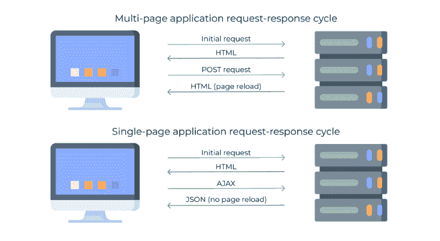
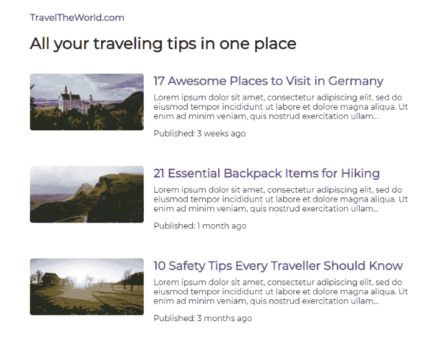

# 用 svelte-spa-router 构建一个单页应用程序

> 原文：<https://blog.logrocket.com/build-spa-svelte-svelte-spa-router/>

如今，web 应用程序的两种主要设计模式是多页面应用程序(MPAs)和单页面应用程序(spa)。每一种都有显著的生命周期差异。

每次有新数据请求时，MPAs 都会重新加载整个页面。在 SPAs 中，页面永远不会重新加载，因为所有静态文件都在初始加载时加载，并且只在必要时在视图中提取数据更新。



spa 通常比多页方法更快，并且它们显著改善了 UX。然而，它们的动态行为也有一个缺点。因为应用程序的状态没有分配给 URL，所以在下一次加载时检索视图很有挑战性。

在本文中，我们将在 [Svelte](https://svelte.dev) 中创建一个单页面应用程序，并用 [svelte-spa-router](https://www.npmjs.com/package/svelte-spa-router) 实现一个路由机制，该机制由 [Alessandro Segala](https://github.com/ItalyPaleAle) 和其他[贡献者](https://github.com/ItalyPaleAle/svelte-spa-router/graphs/contributors)开发和维护。

我们将构建一个博客应用程序，它将包括直接路由、带参数的路由和通配符来处理其余的路由。作为参考，这里是期末项目的[演示](https://codesandbox.io/s/svelte-spa-router-5ing8)。

## 为什么要用 svelte-spa-router？

[svelte-spa-router](https://www.npmjs.com/package/svelte-spa-router) 路径是基于散列的。这意味着应用程序视图存储在以散列符号(#)开始的 URL 片段中。

例如，如果 SPA 位于`App.svelte`文件中，URL `[https://mywebsite.com/#/profile](https://mywebsite.com/#/profile)`可能会访问用户配置文件。

以散列(`#/profile`)开始的片段永远不会被发送到服务器，这意味着用户不需要在后端拥有服务器来处理请求。像`/profile`这样的传统路线总是需要一台服务器。

Svelte-spa-router 易于使用，对所有现代浏览器都有强大的支持，并且由于其基于哈希的路由，针对单页面应用程序的使用进行了优化。

## 设置苗条应用程序

我们将使用[svelite](https://svelte.dev)的官方模板通过 [degit](https://github.com/Rich-Harris/degit) 搭建一个示例应用程序。打开您的终端并运行以下命令:

```
npx degit sveltejs/template svelte-spa-router-app

```

然后，通过运行`cd svelte-spa-router-app`将当前工作目录更改为新创建的文件夹。运行`npm install`安装所有的包。

安装完包之后，通过运行`npm run dev`启动开发服务器。

默认情况下，苗条的应用程序运行在`port 5000`上，所以在你的浏览器中导航到 [localhost:5000](http://localhost:5000/) ，在那里你应该能够看到新创建的应用程序:


我们将使用 [svelte-spa-router](https://www.npmjs.com/package/svelte-spa-router) 包(60.9KB 未打包)作为路由器的基础。通过运行以下命令安装它:`npm install svelte-spa-router`。

我们还需要几个小的 [npm](https://www.npmjs.com/) 助手包，比如 [url-slug](https://www.npmjs.com/package/url-slug) 来创建文章的 url，以及 [timeago.js](https://www.npmjs.com/package/timeago.js) 来帮助计算文章发表后的时间。

您可以通过运行一个命令来安装这两个命令:`npm install url-slug timeago.js`。

## 向 Svelte 项目添加示例数据

为了简单起见，我们将模拟通常来自数据库的博客数据，将它存储到变量`blogs`中。

导航到项目根目录，创建一个新文件`data.js`，并包含以下代码:

```
export const blogs = [
  {
    title: "17 Awesome Places to Visit in Germany",
    content:
      "Lorem ipsum dolor sit amet, consectetur adipiscing elit, sed do eiusmod tempor incididunt ut labore et dolore magna aliqua. Ut enim ad minim veniam, quis nostrud exercitation ullamco laboris nisi ut aliquip ex ea commodo consequat. Duis aute irure dolor in reprehenderit in voluptate velit esse cillum dolore eu fugiat nulla pariatur. Excepteur sint occaecat cupidatat non proident, sunt in culpa qui officia deserunt mollit anim id est laborum.",
    image: "https://picsum.photos/id/1040/800/400",
    publishDate: "2021/12/12"
  },
  {
    title: "21 Essential Backpack Items for Hiking",
    content:
      "Lorem ipsum dolor sit amet, consectetur adipiscing elit, sed do eiusmod tempor incididunt ut labore et dolore magna aliqua. Ut enim ad minim veniam, quis nostrud exercitation ullamco laboris nisi ut aliquip ex ea commodo consequat. Duis aute irure dolor in reprehenderit in voluptate velit esse cillum dolore eu fugiat nulla pariatur. Excepteur sint occaecat cupidatat non proident, sunt in culpa qui officia deserunt mollit anim id est laborum.",
    image: "https://picsum.photos/id/1018/800/400",
    publishDate: "2021/11/17"
  },
  {
    title: "10 Safety Tips Every Traveler Should Know",
    content:
      "Lorem ipsum dolor sit amet, consectetur adipiscing elit, sed do eiusmod tempor incididunt ut labore et dolore magna aliqua. Ut enim ad minim veniam, quis nostrud exercitation ullamco laboris nisi ut aliquip ex ea commodo consequat. Duis aute irure dolor in reprehenderit in voluptate velit esse cillum dolore eu fugiat nulla pariatur. Excepteur sint occaecat cupidatat non proident, sunt in culpa qui officia deserunt mollit anim id est laborum.",
    image: "https://picsum.photos/id/206/800/400",
    publishDate: "2021/09/06"
  }
];
```

注意，我们在数组常量前面使用了`export`。这样，我们将在应用程序的任何文件中导入数组，并在必要时使用其数据。

## 创建组件

接下来，在项目的根目录下创建一个名为`components`的新文件夹，并在其中添加单独的文件:`Card.svelte`、`Home.svelte`、`Article.svelte`和`NotFound.svelte`。

打开文件`Card.svelte`并包含以下代码:

```
<script>
import { link } from "svelte-spa-router";
import urlSlug from "url-slug";
export let title, description, image, publishDate;
</script>

<div class="wrapper">
  <a href={image} target="_blank">
    
  </a>
    <div>
        <h2 class="title"><a href={`/article/${urlSlug(title)}`} use:link>{title}</a></h2>
        <p class="description">{description.substring(0, 180)}...</p>
        <p>Published: {publishDate}</p>
    </div>
</div>

<style>
  .wrapper {
    display: grid;
    grid-template-columns: repeat(2, auto);
    gap: 20px;
    padding: 20px 0;
  }

  .title,
  .description {
    margin: 0 0 10px 0;
  }

  img {
    border-radius: 5px;
    max-width: 230px;
    cursor: pointer;
  }

  @media only screen and (max-width: 600px) {
    .wrapper {
      grid-template-columns: 1fr;
    }

    img {
      max-width: 100%;
    }
  }
</style>
```

`Card`组件将在登陆区显示文章。我们首先导入必要的助手，然后使用 app 内的组件导出道具`title`、`description`、`image`、`publishDate`一次传入。

然后我们为卡片创建了一个两列布局，封面`image`显示在左边，封面`title`、`description`和`publishDate`显示在右边。我们在卡片上加了填充物，并在两列之间加了一个空隙。

当光标悬停在`image`上时，我们将光标设置为`pointer`,并在单击后在一个新标签中打开它。我们还将布局切换为一列布局，当视口的`width`小于等于`600px`时,`image`将占用父视图的所有可用`width`。

接下来，打开`Home.svelte`并包含以下代码:

```
<script>
import urlSlug from "url-slug";
import { format } from "timeago.js";
import Card from "./Card.svelte";
import { blogs } from "../data.js";
</script>

<h1>All your traveling tips in one place</h1>
{#each blogs as blog, i}
    <Card title={blog.title} description={blog.content} image={blog.image} publishDate={format(blog.publishDate)}/>
{/each}
```

我们首先导入了用于从文章标题创建 URL slugs 的`urlSlug`帮助器、`format`用于测量自发布以来经过的时间、我们刚刚创建的`Card`组件和`blogs`数据数组。然后我们通过为`Card`提供必要的道具来循环每个帖子。

现在，打开文件`Article.svelte`并包含以下代码:

```
<script>
    import urlSlug from "url-slug";
    import { format } from "timeago.js";
    import { blogs } from "../data.js";
    import NotFound from "../components/NotFound.svelte";

    export let params = {};
    let article;

    blogs.forEach((blog, index) => {
      if (params.title === urlSlug(blog.title)) {
        article = blog;
      }
    });
</script>

{#if article}
    <div>
        <h1>{article.title}</h1>
        <p>Published: {format(article.publishDate)}</p>
        
        <p>{article.content}</p>
    </div>
{:else}
    <NotFound/>
{/if}

<style>
    img {
      max-width: 100%;
    }

    p {
      text-align: justify;
    }
</style>
```

同样，我们首先导入了两个助手来处理 slugs 和 date，导入了数据的`blogs`数组，还导入了我们将在下一步创建的`NotFound`组件，以便在文章不可用时使用。

在`script`标签中，我们遍历了`blogs`数组中的每篇文章，并检查文章的`title`是否等于 URL 中的当前`:title`参数(例如，如果文章的标题是“我的文章标题 1”，那么 URL 中的参数应该是“我的文章标题 1”)。

如果`:title`参数与`title`匹配，则文章可用，我们呈现它。如果它不可用，我们转而渲染`NotFound`组件。

我们还设置了`Article`的封面图像来填充父对象的所有`width`，并使`text`的侧面对齐。

最后，打开`NotFound.svelte`并包含以下代码:

```
<script>
import { link } from "svelte-spa-router";
</script>

<h1>We are sorry!</h1>
<p>The travel tips you are looking for do not exist.</p>

<p>We still have other travel tips you might be interested in!</p>
<a href="/" use:link>
    <h2>Take me home →</h2>
</a>

<style>
    img {
      width: 100%;
    }
</style>
```

我们将对所有未定义的路线使用`NotFound`组件。例如，如果有人试图访问`article/aa-bb-cc-dd`，用户将会看到`NotFound`视图。

我们从 svelte-spa-router 导入了`link`,这样我们以后就可以在`use:link`动作中使用它。然后，我们呈现了一条文本消息来通知用户路线不可用，并包含了一个图像来使错误屏幕在视觉上更具吸引力。

## 在 svelte-spa-router 中创建路由文件

在[svelete-spa-router](https://www.npmjs.com/package/svelte-spa-router)中，路由被定义为对象，包括路由的`keys`和组件的`values`。我们将有目的地构建一个路由器来涵盖所有用例:直接路由、包含参数的路由和通配符来捕获其余的路由。

直接路由的语法是`/path`。为了本教程的简单起见，我们将只使用一条直接路线`/`将用户带回家，但是您可以根据自己的需要包含任意多的路线— `/about`、`about-us`、`/contact`等等。

接下来，在视图中包含一些特定的参数来获取数据。这个的语法是`/path/:parameter`。

在我们的应用程序中，我们将通过`/article/:title`使用参数为文章视图加载正确的内容。甚至可以链多个参数:`/article/:date/:author`。

最后，用户可以使用通配符来控制所有路线。我们将使用通配符`*`来捕捉所有不存在的路由，为用户显示一个`NotFound`视图。您还可以在已定义路线的路径中包含通配符，例如`/article/*`。

* * *

### 更多来自 LogRocket 的精彩文章:

* * *

现在，让我们在项目根目录中创建一个单独的`routes.js`文件，导入组件，并将它们分配给 routes:

```
import Home from "./components/Home.svelte";
import Article from "./components/Article.svelte";
import NotFound from "./components/NotFound.svelte";

export const routes = {
  "/": Home,
  "/article/:title": Article,
  "*": NotFound
};
```

请记住，`Router`将在对象中第一个匹配的路线上工作，所以`routes`对象中的顺序很重要。确保您总是在最后包含一个通配符。

## 使用应用程序中的超薄路由器

如果您完成了之前设置应用程序、建模数据和创建组件的所有步骤，那么在应用程序中使用路由器的最后阶段将非常简单。

打开`src`文件夹中的`App.svelte`，包含以下代码:

```
<script>
  import Router, { link } from "svelte-spa-router";
  import { routes } from "./routes.js";
</script>

<main>
  <h3><a href="/" use:link>TravelTheWorld.com</a></h3>
  <Router {routes}/>
</main>

<style>
  @import url("https://fonts.googleapis.com/css2?family=Montserrat&display=swap");

  :global(body) {
    margin: 0;
    padding: 20px;
  }

  :global(a) {
    text-decoration: none;
    color: #551a8b;
  }

  main {
    max-width: 800px;
    margin: 0 auto;
    font-family: "Montserrat", sans-serif;
  }
</style>
```

我们从 `svelte-spa-router`包中导入了`Router`本身和`link`组件，以及我们之前自己创建的`routes`对象。

然后我们包含了一个在所有路径中都可见的`h3` home route(这样用户可以从任何地方访问主页)，然后我们包含了一个`Router`组件，它决定基于活动的 URL 呈现什么。

对于样式，我们创建了几个全局样式规则。对于`body`，我们重置了`margin`,使其在所有浏览器上看起来都一样，并添加了一些`padding`,使其在响应屏幕上看起来很漂亮。对于`link`元素，我们去掉了所有的修饰规则，设置了一个共同的颜色。

最后，对于`main`包装器，我们设置了`max-width`，将其水平居中，并为文章的文本设置了 [Montserrat](https://fonts.google.com/specimen/Montserrat) 字体。

## 测试苗条应用程序

首先，检查您的开发服务器是否还在您的终端上运行。如果没有，运行`npm run dev`命令并在浏览器中导航到 [localhost:5000](http://localhost:5000/) ，在这里您应该可以看到博客的登陆视图。



这是运行中的`Router`,将`/`路由匹配到循环通过`blogs`数组的`Home`组件，并使用`Card`组件显示所有文章。

现在，点击主页上的任何一篇文章。根据您点击的文章，您应该看到该文章本身的单独视图。


请注意，URL 从`/`更改为`/#/article/17-awesome-places-to-visit-in-germany`，并且应用程序在请求过程中没有刷新。

复制 URL，在浏览器中打开新标签，粘贴并执行。您将看到与前一个选项卡中相同的视图。

最后，让我们测试不存在的路线。将 URL 更改为任意值，比如说`/#/random`或`/#/article/random`，然后执行。


您应该会看到一个自定义错误屏幕。例如，如果一些文章被删除，您可以使用它作为所有不存在的链接的后备。

恭喜你，做得很好！所有上述测试都返回了预期的行为，这意味着我们的 SPA 路由器按预期工作。

## 结论

在这篇博文中，我们学习了单页面应用程序需要的所有基本路由功能:创建静态路由，创建带参数的路由，以及使用通配符处理不存在的路由。

您可以通过添加新组件并将其分配给新路线来扩展应用程序。如果您计划扩展应用程序，我建议使用 CMS 或单独的数据库和身份验证系统。

最后，svelte-spa-router 是 GitHub 上的[开源](https://github.com/ItalyPaleAle/svelte-spa-router),所以来看看吧，贡献你自己的想法和改进，让它对未来的用户更好。

## 使用 [LogRocket](https://lp.logrocket.com/blg/signup) 消除传统错误报告的干扰

[](https://lp.logrocket.com/blg/signup)

[LogRocket](https://lp.logrocket.com/blg/signup) 是一个数字体验分析解决方案，它可以保护您免受数百个假阳性错误警报的影响，只针对几个真正重要的项目。LogRocket 会告诉您应用程序中实际影响用户的最具影响力的 bug 和 UX 问题。

然后，使用具有深层技术遥测的会话重放来确切地查看用户看到了什么以及是什么导致了问题，就像你在他们身后看一样。

LogRocket 自动聚合客户端错误、JS 异常、前端性能指标和用户交互。然后 LogRocket 使用机器学习来告诉你哪些问题正在影响大多数用户，并提供你需要修复它的上下文。

关注重要的 bug—[今天就试试 LogRocket】。](https://lp.logrocket.com/blg/signup-issue-free)