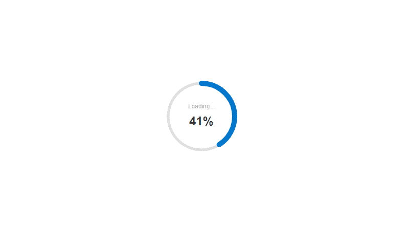
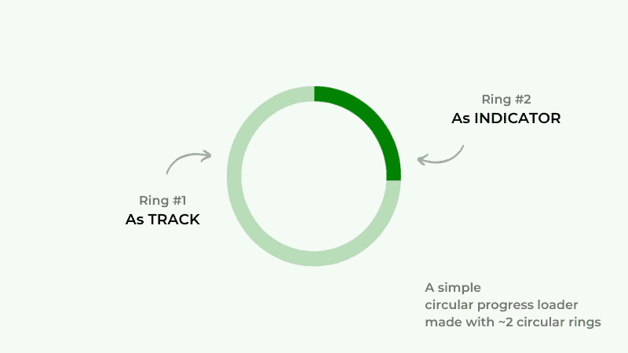
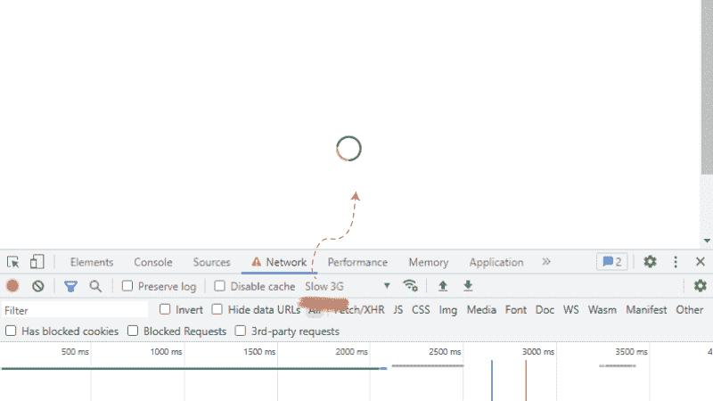

# 如何使用 React 和 React Hooks 构建 SVG 循环进度组件

> 原文：<https://blog.logrocket.com/build-svg-circular-progress-component-react-hooks/>

***编者按:**本文最后一次更新是在 2022 年 7 月 22 日，通过 React 的最新版本来更新代码和示例。*

进度条指示 web 和移动应用程序上的活动，如文件上传、下载、数据加载等。这种视觉表现对增强应用程序的 UX 大有帮助。

在本教程中，我们将演示使用 SVG 为 React 创建一个简单的、可定制的、易于使用的循环进度指示器。我们将在不依赖外部的情况下这样做。

下面是我们将构建的循环进度组件的可视化表示:



由于这个项目与圆有很大关系，所以我将其命名为 SVG Pi。你可以在 [this GitHub repo](https://github.com/c99rahul/SVG-Pi) 中参考本教程的完整源代码。

让我们开始吧！

### 内容

## 嘿，美国 SVG？

缩写“SVG”的阐述揭示了这个问题的正确答案。SVG 代表可缩放矢量图形，无论屏幕分辨率如何，它都能提供完美的像素渲染。

在现代前端开发中，png 和 gif 被认为不适合图标和加载器等应用资产。SVGs 可以完美地完成这项工作；这里有一些支持这一观点的要点。

### 可量测性

矢量图形与分辨率无关，并提供完美的像素体验。

### 交互性

使用 CSS 和 JavaScript 向 SVG 添加无限的交互效果和动画是可能的。

### 展开性

因为 SVG 是基于 XML 的，所以我们可以在任何需要的时候向 SVG 添加不同的外来元素，包括 HTML。

### 可嵌入

SVG 很容易嵌入到 HTML 文档中。甚至 CSS 也支持各种几何和表示属性作为属性。

### 轻量级选手

尽管 SVG 具有可伸缩性和交互性，但文件大小通常很小。

### 搜索引擎优化友好

因为 SVG 是基于 XML 的，所以它们支持在任何合适的地方添加关键字和描述，这比 HTML 图像通常的 alt 标记好得多。

### 易于编辑

一旦理解了 SVG 的基础，就可以像编辑 XML 文件一样编辑它们了。

### 受到广泛支持

几乎所有现代网络和移动浏览器都支持 SVG。点击了解更多关于支持和兼容性的信息[。](https://caniuse.com/svg)

从图像到交互性，现代前端开发广泛使用了 SVG。考虑到它们的灵活性和广泛的应用领域，为您的项目学习和采用 SVG 也是一个不错的主意。

## 用 SVG 构建圆形进度条指示器

在我们深入 JavaScript 部分之前，让我们先来看看 SVG 解决循环进度指示器问题的技术细节。

我们可以用两个重叠的圆环状形状来制作这样的指示器，其中一个作为轨道，另一个作为进度指示器。

请看下图，它展示了这两个圆圈的作用。



让我们尝试用一些简单的 SVG 元素和它们不同的属性创建类似的东西。从标记开始，添加两个圆形元素，如下所示:

```
<svg class="svg-indicator">
  <circle class="svg-indicator-track" />
  <circle class="svg-indicator-indication" />
</svg>

```

我在这两个圆圈中添加了一些 CSS 类，因为它们的大多数表示属性在 CSS 中作为属性可用。我们现在只打算用 CSS 来操作这两个元素。

我们需要确保以下几点，使这些圈像进度指示器一样协同工作:

1.  两个看起来都像戒指
2.  两者共享同一个中心
3.  两者半径相同
4.  第一个环充当轨道
5.  第二个表现为进度指示，看起来更像一个环的一部分

透明填充加上一些笔画颜色和宽度会让圆圈看起来像圆环。

注意，`cx`和`cy`属性共同定义了 SVG 圆的中心，而`r`属性定义了它的半径。这两个 circle 元素应该以完全相同的方式应用这三个值。

一旦我们定义了圆的大小和笔画宽度，我们就可以很容易地确定它们的中心和半径。以下是基于这一理论的一些计算:

```
size = 100
strokeWidth = 10
center = size / 2
       = 100 / 2 = 50
radius = center - strokeWidth 
       = 50 - 10 = 40

```

简单的[圆数学](https://en.wikipedia.org/wiki/Circle)。让我们根据前面的计算为我们的指示器环编写一些 CSS 样式:

```
/* Define the size */
.svg-indicator {
  width: 100px;
  height: 100px;
}

/* 
 * Add the center and the radius using the size 
 * and `stroke-width` values.
 */
.svg-indicator-track,
.svg-indicator-indication {
  cx: 50px;
  cy: 50px;
  r: 40px;
  fill: transparent;
  stroke-width: 10px;
}

/* Some color to highlight the rings */
.svg-indicator-track {
  stroke: #ddd;
}

.svg-indicator-indication {
  stroke: #07c;
}
```

> 添加外部样式表/笔此处添加的任何 URL 都将按顺序添加，并放在编辑器中的 CSS 之前。通过使用其 URL 和适当的 URL 扩展名，您可以使用另一个笔中的 CSS。JavaScript 预处理器巴贝尔包括 JSX 处理。

正如你在上面看到的，我们的指示器只显示指示器环，而轨迹环隐藏在它的后面。只有当进度达到 100%时，它才会看起来像这样。

为了准备好任何给定的进度值，让我们利用`stroke-dasharray`和`stroke-dashoffset`属性。

### `stroke-dasharray`

属性允许我们给 SVG 笔画一个类似破折号的外观。更高的`dasharray`值表示笔画中虚线之间的空间更大，直到它达到等于相关形状周长的值。

> 添加外部样式表/笔此处添加的任何 URL 都将按顺序添加，并放在编辑器中的 CSS 之前。通过使用其 URL 和适当的 URL 扩展名，您可以使用另一个笔中的 CSS。JavaScript 预处理器巴贝尔包括 JSX 处理。

如上所示，笔画中的破折号根据提供给`stroke-dasharray`属性的值而变化。

### `stroke-dashoffset`

`stroke-dashoffset`属性与`stroke-dasharray`一起指定破折号在 SVG 路径上的开始位置。随着这个数字的增加，破折号将出现在路径的更远处。

> 添加外部样式表/笔此处添加的任何 URL 都将按顺序添加，并放在编辑器中的 CSS 之前。通过使用其 URL 和适当的 URL 扩展名，您可以使用另一个笔中的 CSS。JavaScript 预处理器巴贝尔包括 JSX 处理。

上面的演示显示虚线笔画的起点与`stroke-dashoffset`属性的值成比例移动。

### 带有`dasharray`和`dashoffset`的指示逻辑

基本的圆几何学认为一个环的弧的长度等于它的周长。在将周长作为值提供给`stroke-dasharray`属性后，您将观察到[没有变化](https://codepen.io/_rahul/pen/xxWwBLL)。

但是你会注意到，如果你给属性`stroke-dashoffset`相同的值，虚线笔画会从视图中消失。这就是我们希望进度指示器显示零进度的方式。

让我们重新审视我们的圆形计算，并添加一些数据，以便我们可以评估任何给定进度值所需的移动:

```
size = 100
strokeWidth = 10
center = size / 2
       = 100 / 2 = 50
radius = center - strokeWidth 
       = 50 - 10 = 40
progress = 0
arcLength = 2 * π * radius 
          = 2 * 3.14 * 40 = 251.2
arcOffset = arcLength * ((100 - progress)/100) 
          = 251.2 * ((100 - 0)/100) = 251.2

```

假设我们的进度指示器显示 25%的进度。以下是如何计算该数字的适当指示值:

```
progress = 25
arcOffset = arcLength * ((100 - progress)/100) 
          = 251.2 * ((100 - 25)/100) = 188.4

```

将如此获得的移位值添加到指示环的`stroke-dashoffset`属性，我们得到以下输出。

> 添加外部样式表/笔此处添加的任何 URL 都将按顺序添加，并放在编辑器中的 CSS 之前。通过使用其 URL 和适当的 URL 扩展名，您可以使用另一个笔中的 CSS。JavaScript 预处理器巴贝尔包括 JSX 处理。

这看起来就像我们戒指的四分之一，或者 25 %!让我们也逆时针旋转它，像时钟一样将指示原点移动到顶部。

> 没有描述

以上是我们通过不同进度值的战略转移得到的 SVG 进度指标。我使用了`stroke-linecap`属性使进度环看起来是圆形的。

添加我们的进度组件进行反应

## 第一步是创建一个以节点为主要需求的 React app。

打开一个终端，cd 进入您想要添加项目的目录。现在，键入以下命令:

如果`npx`命令花费太多时间，你也可以考虑使用 yarn。安装完成后，使用您选择的任何 IDE 打开项目。

```
npx create-react-app react-progress-bar

```

我们的 React 项目有一个包含所有组件的`src`目录。目前，我们只有内部的`App`组件。

使用`npm start`命令运行应用程序时，您会在浏览器窗口中看到虚拟应用程序，这是我们不想要的。

下一部分包括清除所有虚拟数据和添加我们的默认设置。

清除默认值

### `index.css`文件携带了全局应用的样式。清除其内容并添加新内容，以便更好地重新启动到默认样式:

与`App.css`文件相同，用这些新的 CSS 样式替换所有内容，使应用程序与屏幕中间对齐:

```
:root {
  box-sizing: border-box;
}

*,
*:after,
*:before {
  box-sizing: inherit;
}

body {
  margin: 0;
  font: 1em/1.618 sans-serif;
  background-color: #fff;
}

svg {
  max-width: 100%;
  vertical-align: middle;
}

```

我不是在这里硬衬东西；如果您对 CSS 布局和对齐属性感到满意，可以随意自定义 CSS 文件。

```
.App {
  max-width: 800px;
  margin: 0 auto;
}

.App-content {
  padding: 3em;
}

.App-loading,
.App-content-loading {
  min-height: 100vh;
  display: flex;
  align-items: center;
  justify-content: center;
}

```

从`App.js`开始清除所有看起来不必要的东西。这里的要点是在我们开始描绘我们的 React 应用程序之前有一个清晰的画布:

如上面的代码所示，我们使用了功能组件，当与不同的 React 挂钩配对时，这些功能组件使事情变得容易得多。

```
import "./App.css"

const App = () => {
  return (
    <div class="App">
      ...
    </div>
  )
}

export default App

```

随着开发的深入，我们将会在这些文件中添加更多的内容。

进度组件设置

### 是时候在 React 中实现我们用 SVG 做的任何事情了。让我们在 src 目录中创建一个名为`components`的子目录，以保持井然有序。

同样，在我们的组件目录中创建另一个名为`ProgressBar`的文件，包含两个名为`ProgressBar.js`和`ProgressBar.css`的文件。

让我们开始制作`ProgressBar`组件，添加常规的 React 和样式表导入、组件定义，然后是导出语句:

从形状和大小到标签和动画，我们的`ProgressBar`组件中会有很多道具。以下是所有这些属性的列表:

```
import "./ProgressBar.css"

const ProgressBar = () => {
  ...
}

export default ProgressBar

```

`label`定义指标组件中除数字进度数据以外的文本信息

*   `labelColor`控制由标签定义的信息的颜色
*   `spinnerMode`是一个布尔值，通过将 CSS 关键帧动画类切换到 ProgressBar 组件来控制不确定行为；它默认为假
*   `spinnerSpeed`管理循环动画的速度
*   `progress`采用数字数据以百分比方式显示进度信息
*   `indicatorColor`是进度指示的颜色
*   `indicatorCap`控制进度指示的圆形和平滑形状；它接受对`stroke-linecap` SVG 属性有效的所有三个值
*   `size`向组件添加尺寸
*   `trackColor`负责轨道环的着色
*   `indicatorWidth`管理指示环的厚度
*   `trackWidth`负责轨道环的厚度
*   与其将它们逐个定义为参数，不如使用 JavaScript 的对象析构，如下所示。如果你愿意，你也可以根据需要用 React `propTypes`对它们进行类型检查和标记:

是时候对我们的组件应用圆计算了。稍后返回 SVG 指示器元素时，将进一步使用这些计算:

```
...

const ProgressBar = (props) => {
  let {
    size = 150,
    progress = 0,
    trackWidth = 10,
    trackColor = `#ddd`,
    indicatorWidth = 10,
    indicatorColor = `#07c`,
    indicatorCap = `round`,
    label = `Loading...`,
    labelColor = `#333`,
    spinnerMode = false,
    spinnerSpeed = 1
  } = props

...

```

我们的指示器组件的结构类似于我们前面的例子。将它包装在 division 中是一个好主意，这样可以防止我们应用于 SVG 元素的转换与标签信息的对齐发生冲突。

```
...

const ProgressBar = props => {
  ...

  const center = size / 2,
        radius = center - (trackWidth > indicatorWidth ? trackWidth : indicatorWidth),
        dashArray = 2 * Math.PI * radius,
        dashOffset = dashArray * ((100 - progress) / 100)}

...

```

为了更好的控制和实用，现在最好使用 SVG 属性而不是 CSS 属性。注意，JSX 支持用 camelCase 而不是 kebab-case 编写的 HTML 和 SVG 属性。

除了包装器大小调整和 SVG 属性处理，我还为不确定进度指示器变化的指示环添加了一些旋转动画逻辑:

条件标签信息将是一个不错的小补充。我们还要注意当指示器尺寸太小或旋转动画被钩住时没有意义的百分比加载:

```
...

const ProgressBar = props => {
  ...

  return (
    <>
      <div
        className="svg-pi-wrapper"
        style={{ width: size, height: size }}
      >
        <svg
          className="svg-pi" 
          style={{ width: size, height: size }}
        >
          <circle
            className="svg-pi-track"
            cx={center}
            cy={center}
            fill="transparent"
            r={radius}
            stroke={trackColor}
            strokeWidth={trackWidth}
          />
          <circle
            className={`svg-pi-indicator ${
              spinnerMode ? "svg-pi-indicator--spinner" : ""
            }`}
            style={{ animationDuration: spinnerSpeed * 1000 }}
            cx={center}
            cy={center}
            fill="transparent"
            r={radius}
            stroke={indicatorColor}
            strokeWidth={indicatorWidth}
            strokeDasharray={dashArray}
            strokeDashoffset={dashOffset}
            strokeLinecap={indicatorCap}
          />
        </svg>
      </div>
    </>
  )
}

```

最后，让我们给`ProgressBar.css`添加一些 CSS，其中大部分取自我们之前的例子。这段 CSS 的关键作用是正确对齐事物，固定指示器的方向，并添加旋转动画支持，为此我们在上面的代码中制作了一个可切换的控件:

```
...

const ProgressBar = props => {
  ...

  let hideLabel = (size < 100 || !label.length || spinnerMode) ? true : false

  return (
    <>
      <div
        className="svg-indicator-wrapper"
        ...
      >
        <svg
          ...
        >
          ...
        </svg>

        {!hideLabel && (
          <div 
            className="svg-pi-label" 
            style={{ color: labelColor }}
          >
            <span className="svg-pi-label__loading">
              {label}
            </span>

            {!spinnerMode && (
              <span className="svg-pi-label__progress">
                {`${
                  progress > 100 ? 100 : progress
                }%`}
              </span>
            )}
          </div>
        )}
      </div>
    </>
  )
}

export default ProgressBar

```

使用 React 挂钩的`ProgressBar`组件

```
.svg-pi-wrapper {
  position: relative;
}

.svg-pi {
  transform: rotate(-90deg); /* Fix the orientation */
}

/* Animated spinner version */
.svg-pi-indicator--spinner {
  animation: spinner .75s linear infinite;
  transform-origin: center;
}

.svg-pi-label {
  position: absolute;
  top: 50%;
  left: 50%;
  transform: translate(-50%, -50%);
  text-align: center;
}

.svg-pi-label__loading {
  opacity: .5;
  font-size: 0.75em;
}

.svg-pi-label__progress {
  font-size: 1.5em;
  font-weight: bold;
}

.svg-pi-label__loading,
.svg-pi-label__progress {
  display: block;
}

/* Spinner animation */
@keyframes spinner {
  0% {
    transform: rotate(0)
  }
  100% {
    transform: rotate(360deg)
  }
}

```

## 是时候将新鲜出炉的`ProgressBar`组件导入到我们的空白`App.js`中，并为其设置动作了。

让我们在所需组件完成加载之前，在应用程序开始时显示进度指示器。这里最好使用两个广泛使用的 React 钩子来控制加载显示以及进度指示器的数字数据。

您可能已经知道，`useEffect`钩子负责在 React 中执行不同的副作用，而不会影响组件渲染。

在这种情况下，`useState`钩子保持加载和进度状态，我们在`useEffect`的帮助下根据计时功能和最大进度值来操作这些状态。

因此，进度和加载状态自动成为`useEffect`钩子的两个依赖项。

将`loadingDuration`除以 100 可确保进度指示器正确显示，并以受控的方式显示确定的指示器:

最后，让我们根据当前的加载状态返回适当的组件。当`loading`设置为真时，我们返回`ProgressBar`组件。当它改变时，我们返回一个不同的组件给 DOM:

```
import {useState, useEffect} from 'react'
import ProgressBar from "./components/ProgressBar/ProgressBar"
import "./App.css"

const App = () => {
  const [loading, setLoading] = useState(true)
  const [progress, setProgress] = useState(0)
  const loadingDuration = 3000 // 3 seconds

  useEffect(() => {
    let loadingTimeout = setTimeout(() => {
      if (loading >= 100) return
      setProgress(progress + 1)
    }, loadingDuration/100)
    if (progress === 100) {
      setLoading(false)
    }
    return () => {
      clearTimeout(loadingTimeout)
    }
  }, [progress, loading])

  return (
    ...
  )
}

export default App

```

没有描述

```
...

const App = () => {
  ...

  return (
    <div className="App">
      {loading ? (
        <ProgressBar progress={progress} trackWidth={5} indicatorWidth={10} />
      ) : (
        <div
          className="App-content"
        >
          <p>...</p>
        </div>
      )}
    </div>
  )
}

...
```

> 注意，如果你从上面的代码中删除了`loadingDuration`逻辑，进度指示器仍然会显示出来，但是[会有点难以注意到](https://codepen.io/_rahul/pen/GRxpadM)。

获取数据时显示`ProgressBar`组件

让我们在网络呼叫期间使用 ProgressBar 组件。大部分实现保持不变，但是我们将在前面的例子中添加数据获取逻辑。

## 我正在使用[假的 JSON 占位符 API](https://jsonplaceholder.typicode.com/) 来获取一些数据到我们的应用程序中。同样，我们将使用`useEffect`钩子访问 API，并在我们的应用程序中显示获取的数据。目标是同时显示一个进度指示器:

让我们也加入从 API 获取的数据。我们将在这里使用`postData`的当前状态，如果那里有任何数据，我们将列出它，否则将显示一个`ProgressBar`。

这是最终结构的样子:

```
...

// The fake JSON Placeholder API url
const postUrl = `https://jsonplaceholder.typicode.com/posts`

const App = () => {
  const [postData, setPostData] = React.useState(true)
  const postUrl = `https://jsonplaceholder.typicode.com/posts`

  // Network call
  useEffect(() => {
    const getUsers = async () => {
      try {
        await fetch(postUrl)
          .then((res) => res.json())
          .then((data) => {
            setPostData(data)
          })
      } catch (e) {
        console.log(e)
      }
    }
    getUsers()
  }, [])

  return (
    ...  
  )
}

...

```

没有描述

要更清楚地注意旋转进度指示器，请在浏览器的开发工具中进入**网络**标签，选择一个较慢的连接。

```
...

const App = () => {
  ...

  return (
    <div className="App">
      {postData.length ? (
        <div className="App-content">
          <h2>Dummy posts</h2>
          <ul className="App-post-list">
            {postData.map(({ id, title, body }) => (
              <li key={id} className={id}>
                <h3>{title}</h3>
                <p>{body}</p>
              </li>
            ))}
          </ul>
        </div>
      ) : (
        <ProgressBar
          trackColor="#333"
          indicatorColor="#f7c"
          size={50}
          progress={25}
          trackWidth={5}
          indicatorWidth={5}
          spinnerMode={true}
        />
      )}
    </div>
  )
}

export default App

```

> 

结论

现在，您应该很好地理解了如何使用 SVG 创建一个定制的循环进度指示器，然后使用`useState`和`useEffect`钩子在 React 应用程序中实现它。

这些指示器在 React 页面转换时看起来很棒，但是我们将在另一篇文章中讨论。或者随意尝试一下。我建议您将 CSS 转换添加到指示器中，然后尝试在 React 实现中修复它所添加的延迟。

## 在这个 [GitHub repo](https://github.com/c99rahul/SVG-Pi) 中，您可以随意使用本教程中示例的完整源代码。感谢你从头到尾的阅读！

[LogRocket](https://lp.logrocket.com/blg/react-signup-general) :全面了解您的生产 React 应用

调试 React 应用程序可能很困难，尤其是当用户遇到难以重现的问题时。如果您对监视和跟踪 Redux 状态、自动显示 JavaScript 错误以及跟踪缓慢的网络请求和组件加载时间感兴趣，

.

## LogRocket 结合了会话回放、产品分析和错误跟踪，使软件团队能够创建理想的 web 和移动产品体验。这对你来说意味着什么？

LogRocket 不是猜测错误发生的原因，也不是要求用户提供截图和日志转储，而是让您回放问题，就像它们发生在您自己的浏览器中一样，以快速了解哪里出错了。

[try LogRocket](https://lp.logrocket.com/blg/react-signup-general)

不再有嘈杂的警报。智能错误跟踪允许您对问题进行分类，然后从中学习。获得有影响的用户问题的通知，而不是误报。警报越少，有用的信号越多。

[ ](https://lp.logrocket.com/blg/react-signup-general) [](https://lp.logrocket.com/blg/react-signup-general) 

LogRocket Redux 中间件包为您的用户会话增加了一层额外的可见性。LogRocket 记录 Redux 存储中的所有操作和状态。

现代化您调试 React 应用的方式— [开始免费监控](https://lp.logrocket.com/blg/react-signup-general)。

No more noisy alerting. Smart error tracking lets you triage and categorize issues, then learns from this. Get notified of impactful user issues, not false positives. Less alerts, way more useful signal.

The LogRocket Redux middleware package adds an extra layer of visibility into your user sessions. LogRocket logs all actions and state from your Redux stores.

Modernize how you debug your React apps — [start monitoring for free](https://lp.logrocket.com/blg/react-signup-general).