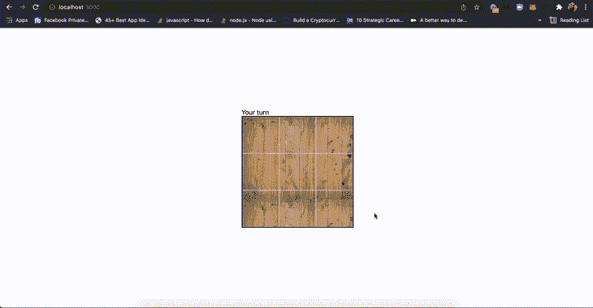

# 用 React Hooks 构建井字游戏

> 原文：<https://blog.logrocket.com/build-tic-tac-toe-game-react-hooks/>

井字游戏是世界上最古老、最受欢迎的棋类游戏之一。我们可以用木板、鹅卵石、棍子等和朋友玩井字游戏。但是我们也可以在网络浏览器上和我们的朋友玩游戏。在本教程中，我们将使用 React Hooks 从头开始构建一个井字游戏，学习如何编写计算机程序来与我们对战。

你可以在 GitHub 库看到 [`TicTacToe`游戏的完整代码。我们开始吧！](https://github.com/nextjs-prj/tictactoe)

### 目录

## 井字游戏的逻辑

井字游戏是在 3×3 的格子上玩的。先出手的玩家是`X`。第二个出场的选手是`O`。第一个在行、列或对角线上占据三个空间的玩家获胜。没有规则规定谁先开始，然而，决定谁先开始的一个流行惯例是掷骰子或掷硬币。

井字游戏很容易导致平局，在这种情况下，玩家必须重新开始游戏。在接下来的章节中，我们将学习如何在浏览器中实现井字游戏逻辑。

## 装置

我们需要在机器上安装最新版本的 Node.js、Yarn 或 npm。请记住，npm 是与 Node.js 捆绑在一起的，但是如果您使用的是 Yarn，您可以通过运行以下命令来安装最新版本:

```
npm i -g yarn

```

我们可以从[https://nodejs.org/download](https://nodejs.org/download)下载最新版本的 Next.js。

## 资助这个项目

我们将使用 Yarn 来搭建我们的 Next.js 项目。从计算机上的任何文件夹运行以下命令:

```
yarn create next-app tictactoe
cd tictactoe

```

在`pages`文件夹中，我们将创建一个名为`components`的文件夹，它将存放我们的游戏。我们将在这个文件夹中创建一个`TicTacToe`组件，如下所示:

```
mkdir components

mkdir components/TicTacToe

touch components/TicTacToe/index.js components/TicTacToe/TicTacToe.module.css

```

`components/TicTacToe/index.js`包含游戏及其逻辑，而`components/TicTacToe/TicTacToe.module.css:`包含游戏造型。

## 构建井字游戏

进入`styles/Home.module.css`文件并粘贴以下代码:

```
.container {
  padding: 0 2rem;
}

.main {
  min-height: 100vh;
  flex: 1;
  display: flex;
  flex-direction: column;
  justify-content: center;
  align-items: center;
}

```

接下来，我们将进入`pages/index.js`并粘贴以下代码:

```
import Head from "next/head";
import styles from "../styles/Home.module.css";
import TicTacToe from "../components/TicTacToe";

export default function Home() {
  return (
    <div className={styles.container}>
      <Head>
        <title>Tic Tac Toe game</title>
        <meta name="description" content="Generated by create next app" />
        <link rel="icon" href="/favicon.ico" />
        <style>
          @import url('https://fonts.googleapis.com/css2?family=Indie+Flower');
        </style>
      </Head>

      <main className={styles.main}>
        <TicTacToe />
      </main>
    </div>
  );
}

```

组件将加载到我们项目的每条路线上。注意，我们导入了我们的`TicTacToe`组件和样式表`Home.module.css`。

在`Home`组件内部，我们设置了一个`Head`。在这个`Head`里面，我们有`title`和`meta`标签。我们还有一个`style`标签来加载字体。我们加载`Indie Flower`字体来显示棋盘上的`X`和`O`。最后，在`main`标签中，我们呈现了`TicTacToe`组件。

## `TicTacToe`组件

让我们转到`TicTacToe`组件。我们的棋盘将是一个 3×3 单元的正方形，玩家将在单元内竞争。为了定义我们的纸板，我们将使用一个多维数组:

```
[
  ["", "", ""],
  ["", "", ""],
  ["", "", ""],
];

```

第一个维度是行，第二个维度是列。从`0`到`2`对行和列进行编号。第一排是`0`，第二排是`1`，第三排是`2`。第一列是`0`，第二列是`1`，第三列是`2`。

第一行是顶行，第二行是中间行，第三行是底行。第一列是左列，第二列是中间列，第三列是右列。

我们将从这个数组中在 DOM 上绘制棋盘。第一个单元格位于第一行第一列，第二个单元格位于第一行第二列，第三个单元格位于第一行第三列。它遵循这种模式，直到最后一个单元格。

首先，我们从`TicTacToe.module.css`文件导入 React 库和样式:

```
// TickTacToe/index.js
import styles from "./TicTacToe.module.css";
import { useEffect, useState } from "react";

```

接下来，我们将创建一个对象来保存游戏中每个玩家的名字和符号。在本教程中，我们将对抗计算机:

```
// TickTacToe/index.js
// previous code here

const players = {
  CPU: {
    SYM: "O",
    NAME: "CPU",
  },
  HUMAN: {
    SYM: "X",
    NAME: "You",
  },
};

```

对象保存玩家的名字和符号。`CPU`是电脑的名字，`O`是电脑的符号。`You`是人类的名字，`X`是人类的象征。

接下来，我们将创建一个函数`sleep`，我们将使用它来模拟计算机思维:

```
// TickTacToe/index.js
// previous code here

function sleep(milliseconds) {
  const date = Date.now();
  let currentDate = null;
  do {
    currentDate = Date.now();
  } while (currentDate - date < milliseconds);
}

```

上面的代码将在释放 CPU 之前等待指定的毫秒数。
现在，我们创建`TicTacToe`组件:

```
// TickTacToe/TicTacToe.js
//  previous code here

export default function TicTacToe() {}

```

为了抓住板子，我们创建了一个`useState`钩子。我们将创建额外的钩子来抓住转牌圈和赢家:

```
// TickTacToe/TicTacToe.js
// previous code here
export default function TicTacToe() {
  const [board, setBoard] = useState([
    ["", "", ""],
    ["", "", ""],
    ["", "", ""],
  ]);
  const [isCPUNext, setIsCPUNext] = useState(false);
  const [winner, setWinner] = useState(null);
}

```

*   `board`状态:保存棋盘的多维数组
*   `setBoard`功能:设置板子
*   `isCPUNext`状态:持有玩家的回合
*   `setIsCPUNext`功能:设置转弯
*   `winner`状态:持有游戏的获胜者
*   `setWinner`功能:设置获胜者

接下来，我们将用户界面渲染如下:

```
// TickTacToe/TicTacToe.js
// previous code here
export default function TicTacToe() {
  // code here

  return (
    <div className={styles.container}>
      <div className={styles.col}>
        <span onClick={() => playFn(0, 0)} className={styles.cell}>
          {board\[0\][0]}
        </span>
        <span onClick={() => playFn(0, 1)} className={styles.cell}>
          {board\[0\][1]}
        </span>
        <span onClick={() => playFn(0, 2)} className={styles.cell}>
          {board\[0\][2]}
        </span>
      </div>
      <div className={styles.col}>
        <span onClick={() => playFn(1, 0)} className={styles.cell}>
          {board\[1\][0]}
        </span>
        <span onClick={() => playFn(1, 1)} className={styles.cell}>
          {board\[1\][1]}
        </span>
        <span onClick={() => playFn(1, 2)} className={styles.cell}>
          {board\[1\][2]}
        </span>
      </div>
      <div className={styles.col}>
        <span onClick={() => playFn(2, 0)} className={styles.cell}>
          {board\[2\][0]}
        </span>
        <span onClick={() => playFn(2, 1)} className={styles.cell}>
          {board\[2\][1]}
        </span>
        <span onClick={() => playFn(2, 2)} className={styles.cell}>
          {board\[2\][2]}
        </span>
      </div>
    </div>
  );
}

```

在上面的代码中，我们有一个包含每个`cell`和`cols`的`container`。每个`col`都是棋盘的一排。每个`cell`都是棋盘上的一个单元格。当点击`cell`时，会调用`playFn`功能。

看到在第一个`cell`中，我们显示了值，从而得到了`board`数组中的第一个数组和数组中的第一个元素。同样，我们对第二个`cell`也做了同样的事情，最终对其余的细胞也做了同样的事情。

我们还使用`board`中数组的适当索引和同一个数组中的索引调用了`playFn`函数，使我们能够捕获我们将在其中放置符号的`board`。

然而，我们遗漏了一些东西。例如，我们需要指示轮到谁了，显示游戏的获胜者，并添加一个按钮，以便在游戏结束时重新开始:

```
// TickTacToe/TicTacToe.js
// previous code here
export default function TicTacToe() {
  // code here
  return;
  <div>
    <div>{!winner && displayTurn()}</div>
    {/** previous JSX code here **/}
    {winner && <h2>{displayWinner()}</h2>}
    {winner && (
      <button className={styles.video_game_button} onClick={playAgainFn}>
        Play Again
      </button>
    )}
  </div>;
}

```

我们将创建函数`playFn`。当用户点击它时，它会玩游戏:

```
function playFn(arrayIndex, index) {
  if (isCPUNext) return;
  if (winner) return;
  board\[arrayIndex\][index] = players?.HUMAN?.SYM;
  setBoard((board) => [...board]);
  checkWinner();
  setIsCPUNext(true);
}

```

`playFn`函数将检查游戏是否结束。如果是，它将显示获胜者。如果不是，它将检查玩家是否是下一个。如果是，它会将玩家的符号设置到`board`数组中该数组的特定索引，并调用`setBoard`函数来设置棋盘状态。然后，它会调用`checkWinner`函数来检查游戏是否结束。最后，它将设置`isCPUNext`为真。

接下来，我们将设置一个`useEffect`钩子:

```
useEffect(() => {
  if (winner) return;
  if (isCPUNext) {
    cPUPlay();
  }
}, [isCPUNext]);

```

这个`useEffect`钩子在组件安装后运行，检查游戏是否结束。如果是，它将返回。如果不是，它将检查 CPU 是否是下一个。如果是，它会调用`cPUPlay`函数来玩游戏。

接下来，我们将创建`cPUPlay`函数:

```
function cPUPlay() {
  if (winner) return;
  sleep(1000);

  const cPUMove = getCPUTurn();

  board\[cPUMove.arrayIndex\][cPUMove.index] = players?.CPU?.SYM;

  setBoard((board) => [...board]);
  checkWinner();
  setIsCPUNext(false);
}

```

`cPUPlay`函数检查游戏是否结束。如果是，它将返回。如果不是，它会调用 sleep 10 秒，然后调用`getCPUTurn`函数来获取 CPU 的 move。它会将 CPU 的符号设置为`board`数组中该数组的特定索引，并调用`setBoard`函数来设置板卡状态。然后，它会调用`checkWinner`函数来检查游戏是否结束。最后，它会将`isCPUNext`设置为假。

接下来，我们将创建`getCPUTurn`函数，它将返回 CPU 的移动:

```
function getCPUTurn() {
  const emptyIndexes = [];
  board.forEach((row, arrayIndex) => {
    row.forEach((cell, index) => {
      if (cell === "") {
        emptyIndexes.push({ arrayIndex, index });
      }
    });
  });
  const randomIndex = Math.floor(Math.random() * emptyIndexes.length);
  return emptyIndexes[randomIndex];
}

```

该函数将遍历`board`数组并找到所有的空单元格，然后，它将随机选择一个空单元格。

接下来，我们将创建`checkWinner`函数，它将检查游戏是否结束。如果是，它将返回。如果不是，它会检查是播放器还是 CPU 赢了。如果玩家赢了，它会将`winner`状态设置为`HUMAN`。如果 CPU 赢了，它将把`winner`状态设置为`CPU`。如果是平局，它会将`winner`状态设置为`draw`。如果不是平局，它将返回:

```
function checkWinner() {
  // check same row
  for (let index = 0; index < board.length; index++) {
    const row = board[index];
    if (row.every((cell) => cell === players?.CPU?.SYM)) {
      setWinner(players?.CPU?.NAME);
      return;
    } else if (row.every((cell) => cell === players?.HUMAN?.SYM)) {
      setWinner(players?.HUMAN?.NAME);
      return;
    }
  }

  // check same column
  for (let i = 0; i < 3; i++) {
    const column = board.map((row) => row[i]);
    if (column.every((cell) => cell === players?.CPU?.SYM)) {
      setWinner(players?.CPU?.NAME);
      return;
    } else if (column.every((cell) => cell === players?.HUMAN?.SYM)) {
      setWinner(players?.HUMAN?.NAME);
      return;
    }
  }

  // check same diagonal
  const diagonal1 = \[board[0\][0], board\[1\][1], board\[2\][2]];
  const diagonal2 = \[board[0\][2], board\[1\][1], board\[2\][0]];
  if (diagonal1.every((cell) => cell === players?.CPU?.SYM)) {
    setWinner(players?.CPU?.NAME);
    return;
  } else if (diagonal1.every((cell) => cell === players?.HUMAN?.SYM)) {
    setWinner(players?.HUMAN?.NAME);
    return;
  } else if (diagonal2.every((cell) => cell === players?.CPU?.SYM)) {
    setWinner(players?.CPU?.NAME);
    return;
  } else if (diagonal2.every((cell) => cell === players?.HUMAN?.SYM)) {
    setWinner(players?.HUMAN?.NAME);
    return;
  } else if (board.flat().every((cell) => cell !== "")) {
    setWinner("draw");
    return;
  } else {
    setWinner(null);
    return;
  }
}

```

代码非常简单。它遍历`board`数组，检查相同的行、列或对角线是否有相同的符号。如果是，它会将`winner`状态设置为玩家的名字。如果所有的棋盘上都没有找到匹配的符号，那么这个游戏就是平局。然后它会将`winner`状态设置为`draw`。

让我们创建`displayWinner`函数:

```
function displayWinner() {
  if (winner === "draw") {
    return "It's a draw!";
  } else if (winner) {
    return `${winner} won!`;
  }
}

```

如果`winner`状态为`draw`，则返回`It's a draw!`。如果`winner`状态不是`draw`，则返回`${winner} won!`。现在，我们将创建`displayTurn`函数:

```
function displayTurn() {
  if (isCPUNext) {
    return "CPU's turn";
  } else {
    return "Your turn";
  }
}

```

`displayTurn`函数将检查 CPU 是否是下一个。如果是，则返回`CPU's turn`。如果不是，它将返回`Your turn`。

我们将创建`playAgainFn`函数:

```
function playAgainFn() {
  setBoard([
    ["", "", ""],
    ["", "", ""],
    ["", "", ""],
  ]);
  setWinner(null);
  setIsCPUNext(false);
}

```

该功能会将`board`状态设置为初始板卡状态，并将`winner`状态设置为`null`。然后，它会将`isCPUNext`状态设置为`false`。

## 设计应用程序

打开`TicTacToe.module.css`文件，添加以下样式:

```
.container {
  display: flex;
  flex-direction: column;
  background-image: url(https://i.imgur.com/OVBsgc1.jpg);
  border: 2px solid black;
  font-family: "Indie Flower", cursive;
}

.col {
  display: flex;
}

.cell {
  width: 89px;
  height: 89px;
  border: 1px solid lightgray;
  text-align: center;
  display: flex;
  justify-content: center;
  align-items: center;
  font-size: xxx-large;
  text-transform: capitalize;
  cursor: pointer;
  color: white;
  font-weight: 900;
}

.video_game_button {
  text-shadow: 1px 1px pink, -1px -1px maroon;

  line-height: 1.5em;
  text-align: center;
  display: inline-block;
  width: 4.5em;
  height: 4.5em;
  border-radius: 50%;
  background-color: red;
  box-shadow: 0 0.2em maroon;
  color: red;
  margin: 5px;
  background-color: red;
  background-image: linear-gradient(left top, pink 3%, red 22%, maroon 99%);
  cursor: pointer;
  padding-left: 5px;
}

.video_game_button:active {
  box-shadow: none;
  position: relative;
  top: 0.2em;
}

```

## 按章办事



## 结论

在本教程中，我们解释了井字游戏的玩法。然后，我们搭建了一个 Next.js 项目，继续展示我们如何在电脑上编码和玩井字游戏。

我们的电脑游戏有最少或神秘的逻辑。如果能增加逻辑的趣味性，让计算机能像人一样思考和游戏，那就太好了。我们还可以通过添加一些有趣的功能，如聊天、排行榜和游戏历史，使游戏更有趣。

我等不及要看你想出什么了！编码快乐！

## [LogRocket](https://lp.logrocket.com/blg/react-signup-general) :全面了解您的生产 React 应用

调试 React 应用程序可能很困难，尤其是当用户遇到难以重现的问题时。如果您对监视和跟踪 Redux 状态、自动显示 JavaScript 错误以及跟踪缓慢的网络请求和组件加载时间感兴趣，

[try LogRocket](https://lp.logrocket.com/blg/react-signup-general)

.

[ ](https://lp.logrocket.com/blg/react-signup-general) [](https://lp.logrocket.com/blg/react-signup-general) 

LogRocket 结合了会话回放、产品分析和错误跟踪，使软件团队能够创建理想的 web 和移动产品体验。这对你来说意味着什么？

LogRocket 不是猜测错误发生的原因，也不是要求用户提供截图和日志转储，而是让您回放问题，就像它们发生在您自己的浏览器中一样，以快速了解哪里出错了。

不再有嘈杂的警报。智能错误跟踪允许您对问题进行分类，然后从中学习。获得有影响的用户问题的通知，而不是误报。警报越少，有用的信号越多。

LogRocket Redux 中间件包为您的用户会话增加了一层额外的可见性。LogRocket 记录 Redux 存储中的所有操作和状态。

现代化您调试 React 应用的方式— [开始免费监控](https://lp.logrocket.com/blg/react-signup-general)。