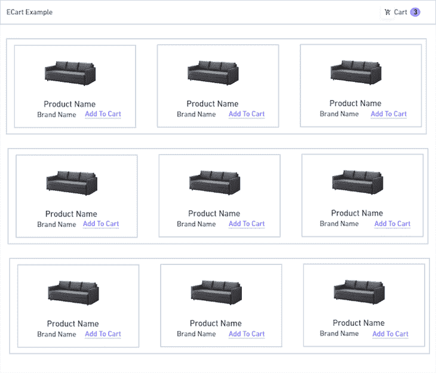
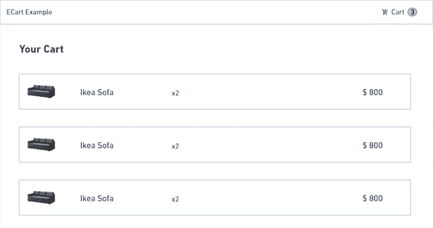
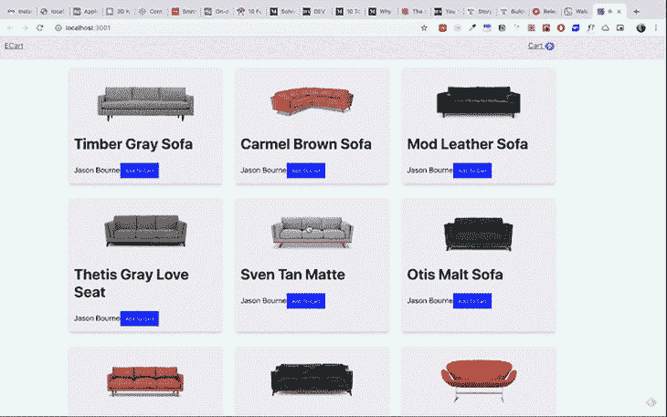
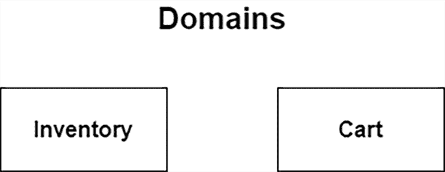
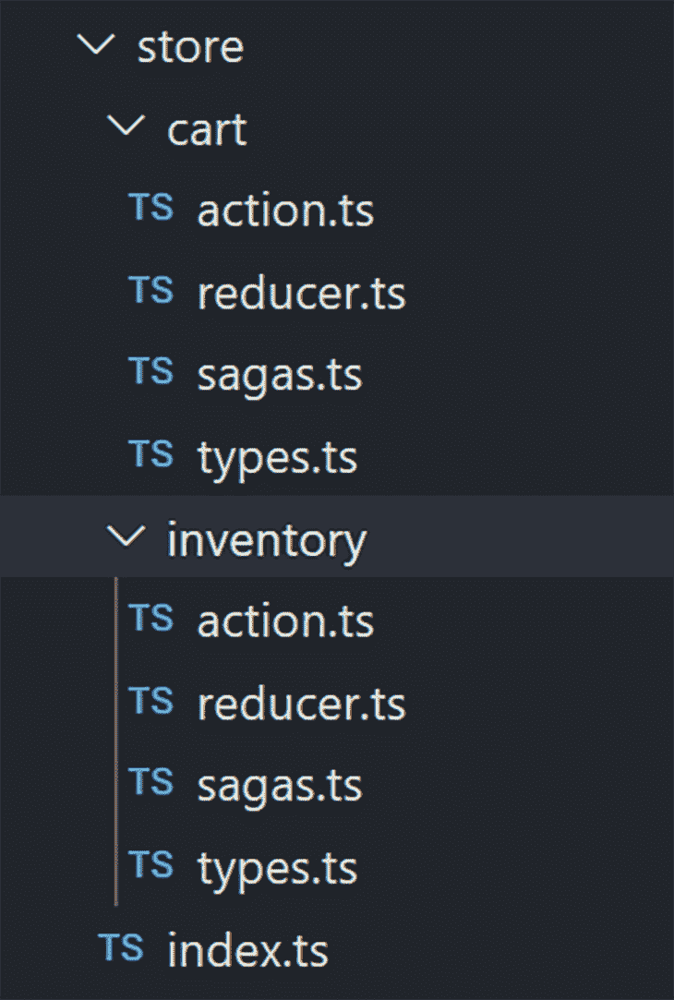
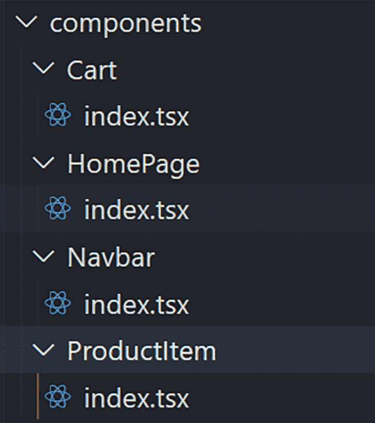

# 如何构建一个类型安全的 React Redux 应用程序

> 原文：<https://blog.logrocket.com/build-type-safe-react-redux-app/>

***编者按*** *:这篇文章更新于 2021 年 12 月 8 日，以反映 Redux 的更新并提高教程的整体清晰度。*

向 React 应用程序添加类型检查功能可以帮助您在编译时捕获大量错误。在本教程中，我们将通过研究一个真实世界的例子来演示如何构建一个类型安全的 React Redux 应用程序。

为了说明这些概念，我们将创建一个示例电子商务应用程序，如下所示。







我们还将讨论以下几点:

事不宜迟，我们开始吧！

## 构建类型安全的 Redux 应用程序

React 是一个组件库，我们用它来构建应用程序的现代前端。随着应用程序的扩展，管理数据变得越来越困难。

这就是 [Redux](https://redux.js.org/) 的用武之地。Redux 是一个状态管理库，在 React 生态系统中很流行。如果你不熟悉 React Redux 的概念，我建议在继续本教程之前阅读[官方文档](https://redux.js.org/basics/example/)。

让我们从构建一个电子商务应用程序工作流开始。这里，我们在线框图中有两个重要的域:库存和购物车。



首先，我们将创建基本的 Redux 构建块——即动作创建器、缩减器和存储。如果您不熟悉这些构建块，Redux 将应用程序的状态保存在一个名为 store 的全局 JS 对象中。在整个应用程序中，商店中进行的所有更改都是通过操作生成的，并通过 reducers 执行。你可以在[官方文件](https://redux.js.org/tutorials/fundamentals/part-3-state-actions-reducers)中了解更多信息。

因为我们知道应用领域，我们将基于它来构建我们的应用。使用以下命令创建一个 React 应用程序:

```
npx create-react-app react-redux-example --template typescript

```

这将创建一个带有类型脚本文件的 React 应用程序样板。接下来，安装 React Redux 及其类型的依赖项。

```
npm i react-redux redux redux-thunk
npm i --save-dev @types/react-redux 

```

上面的命令应该安装`redux`和`react-redux`库，它们处理 React 和 Redux 连接。接下来，安装 [redux-thunk](https://github.com/reduxjs/redux-thunk) ，这是一个中间件，用于处理动作创建器中的异步数据获取。

## 创建 React Redux 类型脚本文件夹结构

现在是时候为我们的 Redux 存储创建文件结构了。



应用程序商店是基于域构建的。您可以看到 inventory 域的所有操作、缩减器和类型都保存在一个文件夹中，而 cart 域的操作、缩减器和类型保存在另一个文件夹中。

这种模式通常被称为“功能文件夹”，它使应用程序更具可扩展性，因为与每个功能相关的商店更新彼此之间更接近。使用 feature folder，可以更容易地将与特定功能相关的单元和集成测试保存在具有 Redux 构件的同一个目录中。

如果管理如此多的文件让你感到力不从心，Redux ToolKit 引入了`dux pattern`，允许你在单个文件中保持完整的特性实现。 [Redux ToolKit 拥有惊人的类型脚本支持](https://blog.logrocket.com/using-typescript-with-redux-toolkit/)，可以提高你的开发速度。

## 将商店用于我们的库存域

让我们从库存域开始。我们需要为库存域创建操作、减少器和类型。我总是从域类型开始，因为这样，我可以在早期定义指定域的结构。

该类型将包含 Redux 状态、动作类型和域。

```
 export interface Inventory {
  id: string;
  name: string;
  price: string;
  image: string;
  description: string;
  brand?: string;
  currentInventory: number;
}
export enum InventoryActionTypes {
  FETCH_REQUEST = "@@inventory/FETCH_REQUEST",
  FETCH_SUCCESS = "@@inventory/FETCH_SUCCESS",
  FETCH_ERROR = "@@inventory/FETCH_ERROR"
}
export interface InventoryState {
  readonly loading: boolean;
  readonly data: Inventory[];
  readonly errors?: string;
}

```

关于上述代码的几点注意事项:

*   `Inventory`接口确定指定的域数据
*   `InventoryActionTypes`枚举决定了动作类型
*   `Inventory`状态处理域状态的类型

现在，该为库存商店创建一个动作了。

## 将 TypeScript 与 Redux Thunk 一起使用

我们将使用 Redux Thunk 作为中间件来进行 API 调用。

到底什么是 Redux Thunk？基本上，动作创建者返回一个具有动作类型和有效负载的对象。`redux-thunk`将动作转换成一个函数，在中间进行 API 调用，并通过调度动作返回数据。

```
import { InventoryActionTypes } from "./types";
import { ActionCreator, Action, Dispatch } from "redux";
import { ThunkAction } from "redux-thunk";
import { ApplicationState } from "../index";
import inventory from "../../mockdata";

export type AppThunk = ActionCreator<
  ThunkAction<void, ApplicationState, null, Action<string>>
>;

export const fetchRequest: AppThunk = () => {
  return (dispatch: Dispatch): Action => {
    try {
      return dispatch({
        type: InventoryActionTypes.FETCH_SUCCESS,
        payload: inventory
      });
    } catch (e) {
      return dispatch({
        type: InventoryActionTypes.FETCH_ERROR
      });
    }
  };
};

```

这里，我们有一个动作`fetchRequest`，它返回一个函数。该函数进行 API 调用(这里，我们模拟库存数据，而不是 API 调用)。之后，它会分派一个动作。

我们还应该简单提一下动作的类型检查。每个动作的类型都应该是`ActionCreator` **。**因为我们使用了 Redux Thunk，所以每个`ActionCreator`返回一个类型为`ThunkAction`的函数。

如果您是 Redux Thunk 的新手，请查看优秀的[文档](https://github.com/reduxjs/redux-thunk)进行深入了解。或者，如果您正在寻找一个更强大的工具作为 Redux 中间件，请查看 Redux Saga，它使用生成器函数，允许开发人员轻松管理应用程序的复杂异步操作。

库存商店的最后一部分是减速器。让我们创建该文件。

```
import { Reducer } from "redux";
import { InventoryActionTypes, InventoryState } from "./types";
export const initialState: InventoryState = {
  data: [],
  errors: undefined,
  loading: false
};
const reducer: Reducer<InventoryState> = (state = initialState, action) => {
  switch (action.type) {
    case InventoryActionTypes.FETCH_REQUEST: {
      return { ...state, loading: true };
    }
    case InventoryActionTypes.FETCH_SUCCESS: {
      console.log("action payload", action.payload);
      return { ...state, loading: false, data: action.payload };
    }
    case InventoryActionTypes.FETCH_ERROR: {
      return { ...state, loading: false, errors: action.payload };
    }
    default: {
      return state;
    }
  }
};
export { reducer as InventoryReducer };

```

首先，定义一个类型为`InventoryState`的初始状态。

* * *

### 更多来自 LogRocket 的精彩文章:

* * *

```
export const initialState: InventoryState = {
  data: [],
  errors: undefined,
  loading: false
};

```

之后，创建一个状态类型为`InventoryState`的 reducer。定义每个缩减器的类型非常重要，因为您希望在编译时而不是运行时识别问题。

```
const reducer: Reducer<InventoryState> = (state = initialState, action) => {
  switch (action.type) {
    case InventoryActionTypes.FETCH_REQUEST: {
      return { ...state, loading: true };
    }
    case InventoryActionTypes.FETCH_SUCCESS: {
      console.log("action payload", action.payload);
      return { ...state, loading: false, data: action.payload };
    }
    case InventoryActionTypes.FETCH_ERROR: {
      return { ...state, loading: false, errors: action.payload };
    }
    default: {
      return state;
    }
  }
};

```

在这里，我们处理库存域的所有操作并更新状态。

是时候为购物车实现 Redux 功能了。cart 域的功能类似于 inventory 域的功能。

首先，创建一个名为`types.ts`的文件，并添加以下代码。

```
import { Inventory } from "../inventory/types";
export interface Cart {
  id: number;
  items: Inventory[];
}
export enum CartActionTypes {
  ADD_TO_CART = "@@cart/ADD_TO_CART",
  REMOVE_FROM_CART = "@@cart/REMOVE_FROM_CART",
  FETCH_CART_REQUEST = "@@cart/FETCH_CART_REQUEST",
  FETCH_CART_SUCCESS = "@@cart/FETCH_CART_SUCCESS",
  FETCH_CART_ERROR = "@@cart/FETCH_CART_ERROR"
}
export interface cartState {
  readonly loading: boolean;
  readonly data: Cart;
  readonly errors?: string;
}

```

这表示 Redux 的购物车域属性、购物车动作类型和购物车状态。
接下来，为购物车域创建`action.ts`。

```
import { CartActionTypes, Cart, cartState } from "./types";
import { Inventory } from "../inventory/types";
import { ActionCreator, Action, Dispatch } from "redux";
import { ThunkAction } from "redux-thunk";
import { ApplicationState } from "../index";
export type AppThunk = ThunkAction<
  void,
  ApplicationState,
  null,
  Action<string>
>;
export const fetchCartRequest: AppThunk = () => {
  return (dispatch: Dispatch, state: ApplicationState): Action => {
    try {
      return dispatch({
        type: CartActionTypes.FETCH_CART_SUCCESS,
        payload: state.cart
      });
    } catch (e) {
      return dispatch({
        type: CartActionTypes.FETCH_CART_ERROR
      });
    }
  };
};
export const addToCart: ActionCreator<ThunkAction<
  void,
  ApplicationState,
  Inventory,
  Action<string>
>> = item => {
  return (dispatch: Dispatch): Action => {
    try {
      return dispatch({
        type: CartActionTypes.ADD_TO_CART,
        payload: item
      });
    } catch (e) {
      return dispatch({
        type: CartActionTypes.ADD_TO_CART_FAILURE,
        payload: null
      });
    }
  };
};
action.ts contains all the actions that handle the cart domain functionalities.

```

这里，我们使用`redux-thunk`进行 API 获取调用。出于本教程的目的，我们嘲笑了它，但是在生产中，您可以在动作创建器中获取 API。

最后，编写 cart 域缩减器的代码。创建一个文件，将其命名为`reducer.ts`，并添加以下代码。

```
import { Reducer } from "redux";
import { CartActionTypes, cartState } from "./types";
export const initialState: cartState = {
  data: {
    id: 0,
    items: []
  },
  errors: undefined,
  loading: false
};
const reducer: Reducer<cartState> = (state = initialState, action) => {
  switch (action.type) {
    case CartActionTypes.FETCH_CART_REQUEST: {
      return { ...state, loading: true };
    }
    case CartActionTypes.FETCH_CART_SUCCESS: {
      return { ...state, loading: false, data: action.payload };
    }
    case CartActionTypes.FETCH_CART_ERROR: {
      return { ...state, loading: false, errors: action.payload };
    }
    case CartActionTypes.ADD_TO_CART: {
      return {
        errors: state.errors,
        loading: state.loading,
        data: {
          ...state.data,
          id: state.data.id,
          items: [...state.data.items, action.payload]
        }
      };
    }
    case CartActionTypes.REMOVE_FROM_CART: {
      return {
        errors: state.errors,
        loading: state.loading,
        data: {
          ...state.data,
          id: state.data.id,
          items: state.data.items.filter(item => item !== action.payload.id)
        }
      };
    }
    default: {
      return state;
    }
  }
};
export { reducer as cartReducer };

```

现在是时候为我们的应用程序配置商店了。

## **配置商店**

在根目录下创建一个名为`configureStore.ts`的文件，并添加以下代码。

```
import { Store, createStore, applyMiddleware } from "redux";
import thunk from "redux-thunk";
import { routerMiddleware } from "connected-react-router";
import { History } from "history";
import { ApplicationState, createRootReducer } from "./store";
export default function configureStore(
  history: History,
  initialState: ApplicationState
): Store<ApplicationState> {
  const store = createStore(
    createRootReducer(history),
    initialState,
    applyMiddleware(routerMiddleware(history), thunk)
  );
  return store;
}

```

我们创建了一个名为`configureStore`的函数，它将`history`和`initialState`作为参数。

我们需要定义参数的类型，比如`history`和`initialState`。`initialState`要有`ApplicationStore`的类型，店内定义。`configureStore`函数返回包含`ApplicationState`的类型`Store`。

之后创建一个商店，里面有 root reducer、`initialStore`和中间件，这里是`routerMiddleware`和`redux-thunk`。

我们终于完成了冗余部分。接下来，我们将演示如何实现它的组件。

## 组件结构

让我们放大我们的组件。



*   `HomePage`处理主页面，呈现`ProductItem`组件
*   `Navbar`显示导航栏和购物车中的商品数量
*   `Cart`包含添加到购物车的列表项目

一旦你知道如何构造一个类型安全的 Redux 应用程序，实现组件就相当简单了。将组件部分作为一个练习，并在下面留下你的 GitHub 链接评论。

你可以在 [GitHub](https://github.com/ganeshmani/react-redux-typescript-example) 上找到完整的源代码供参考。

## 下一步是什么？

现在您已经知道了如何使用 React Redux、Redux 和 Redux Thunk 构建一个类型安全的 Redux 应用程序，您可能会注意到仅仅是在应用程序中设置 Redux 就需要大量的代码。幸运的是，这个问题有一个解决方案: [Redux Toolkit](https://redux-toolkit.js.org/introduction/quick-start) 。这个包旨在简化 Redux 的实现过程。

以下是 Redux Toolkit 的简要概述:

*   `[configureStore()](https://redux-toolkit.js.org/api/configurestore/)`就像 Redux 中的`creatorStore()`的包装器，附带一些现成的 Redux 开发工具，消除了设置它的需要
*   `[createReducer()](https://redux-toolkit.js.org/api/createreducer/)`是一个实用函数，它取代了 Redux 应用程序中传统的 reducers 样板文件
*   `[createAction()](https://redux-toolkit.js.org/api/createaction/)`基本上是一个帮助器函数，用于定义 Redux 动作类型和创建者
*   `[createSlice()](https://redux-toolkit.js.org/api/createslice/)`是基于`initialState`和 reducer 函数自动生成动作创建者和动作类型的函数

## 摘要

添加类型检查可以帮助您创建愉快的开发人员体验。它可以让你避免编译时的错误，并随着从事项目及其功能的开发人员数量的增加，保持你的应用程序的可伸缩性。

状态管理是应用程序架构的核心部分之一，让 ts 与您的状态管理保持一致可以提高生产率和代码的可读性。对于进一步的阅读，理解这些概念将有助于您进行类型检查。

## [LogRocket](https://lp.logrocket.com/blg/react-signup-general) :全面了解您的生产 React 应用

调试 React 应用程序可能很困难，尤其是当用户遇到难以重现的问题时。如果您对监视和跟踪 Redux 状态、自动显示 JavaScript 错误以及跟踪缓慢的网络请求和组件加载时间感兴趣，

[try LogRocket](https://lp.logrocket.com/blg/react-signup-general)

.

[ ](https://lp.logrocket.com/blg/react-signup-general) [](https://lp.logrocket.com/blg/react-signup-general) 

LogRocket 结合了会话回放、产品分析和错误跟踪，使软件团队能够创建理想的 web 和移动产品体验。这对你来说意味着什么？

LogRocket 不是猜测错误发生的原因，也不是要求用户提供截图和日志转储，而是让您回放问题，就像它们发生在您自己的浏览器中一样，以快速了解哪里出错了。

不再有嘈杂的警报。智能错误跟踪允许您对问题进行分类，然后从中学习。获得有影响的用户问题的通知，而不是误报。警报越少，有用的信号越多。

LogRocket Redux 中间件包为您的用户会话增加了一层额外的可见性。LogRocket 记录 Redux 存储中的所有操作和状态。

现代化您调试 React 应用的方式— [开始免费监控](https://lp.logrocket.com/blg/react-signup-general)。