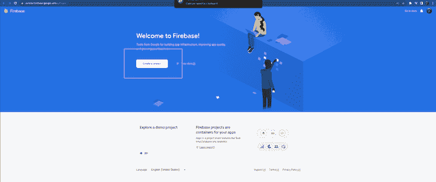
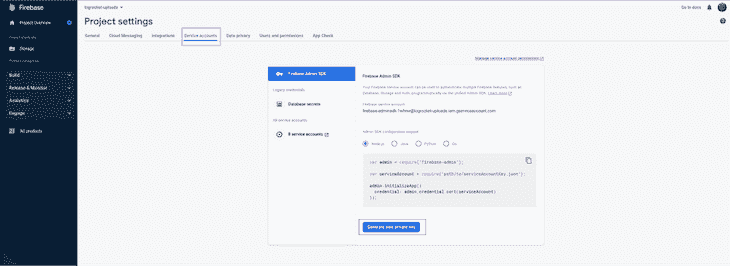
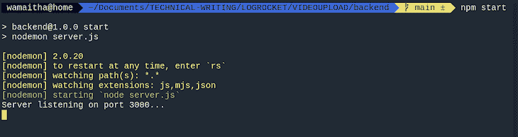
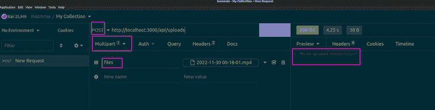
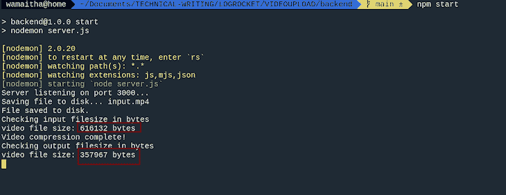
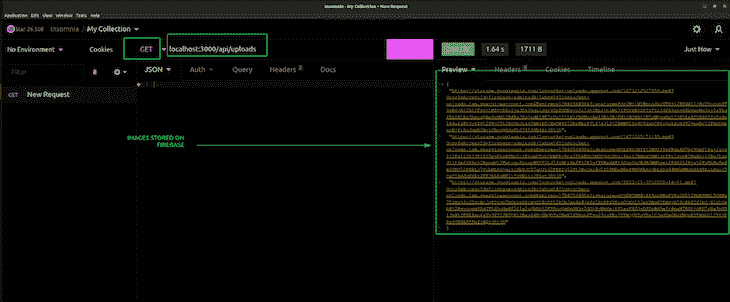
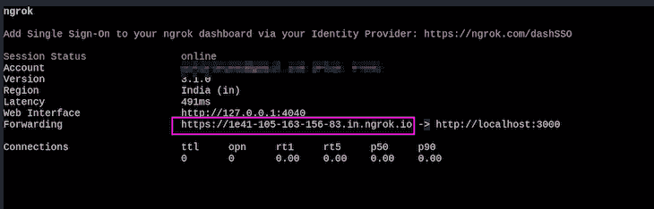
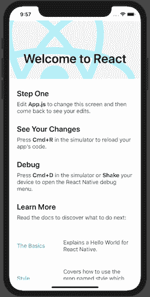

# 使用 Multer 和 React Native 构建视频上传和压缩应用程序

> 原文：<https://blog.logrocket.com/build-video-upload-compression-app-multer-react-native/>

React Native 是一个移动应用开发框架，允许开发人员在 Android 和 iOS 中构建原生渲染的应用。“一次编码，随处运行”的原则是框架的固有特性。React Native 也与 React 有许多相似之处，因此使用 React 的开发人员可以快速掌握 React Native。

除了所有这些伟大的特性，它都是在引擎盖下的 JavaScript。JavaScript 可用于在 Node.js 中编写后端代码。因此，JavaScript 开发人员处于一个独特的位置，能够构建应用程序、web 应用程序和服务器端代码。

在本指南中，我们将使用 Multer 构建一个全栈应用程序，用于在 React Native to Firebase 上上传视频，Multer 是一个处理文件上传的 Node.js 中间件。

我们的最终产品将是这样的:

向前跳:

先决条件

## 设置 Firebase

## Firebase 是谷歌支持的应用程序开发平台。它为构建和扩展应用程序提供了多种服务，包括实时数据库、认证和托管。

我们教程的第一步是创建一个 Firebase 帐户，如果你还没有的话。完成后，点击**创建项目**按钮:



给项目起一个名字，这个名字将在以后用来标识正在使用的存储桶。

一旦您创建了您的项目，您需要选择测试环境。请注意，在部署到生产环境时，您需要选择一个生产环境并限制对您的文件的访问。

在项目设置仪表板上，点击**服务账户**选项卡并生成私钥。将密钥保存到您的后端文件夹，命名为`serviceAccount.json`:



设置后端 Node.js 服务器

## 后端将保存与 React Native 接口的 API 逻辑。API 将有两个端点；一个用于从 Firebase 检索所有视频文件，另一个用于将图像上传到 Firebase。

后端文件夹结构如下:

`controllers`文件夹保存处理视频上传和检索的业务逻辑。`routes`文件夹指定了将流量导向右侧控制器的快速路由的结构。`package.json`将包含用于我们所有依赖项的版本，而`server.js`将是启动 Express 服务器和处理路由请求的入口点。最后，`serviceAccountKey.json`保存了我们之前下载的 Firebase 配置。

```
project_folder
|__backend
   |__controllers
    | controllers.uploadController.js
   |__routes
      | routes.uploadRoute.js
   | package.json
   | server.js
   | serviceAccountKey.json
```

后端所需的包有:

Cors:实现跨源资源共享的中间件

*   Express:用于构建服务器端应用程序的 web 框架
*   Multer:处理用于文件上传的多部分/表单数据的中间件
*   Firebase-admin:从服务器端环境与 Firebase 服务交互
*   Nodemon:重启节点应用程序的实用程序
*   Fluent-ffmpeg:一个使用 ffmpeg 处理多媒体文件的库
*   在后端文件夹中，使用 npm 通过以下命令安装软件包:

在`package.json`中，添加`“type” :”module”`字段。这使我们能够使用 import 语句来代替所需的语法。

```
npm install cors express multer firebase-admin nodemon fluent-ffmpeg
```

接下来，将启动脚本命令改为使用 nodemon 来运行`server.js`。Nodemon 监听所做的更改，并重新启动节点服务器。最终的`package.json`如下:

为上传创建 API 端点

```
{
 "name": "backend",
 "version": "1.0.0",
 "description": "Backend for the react native app for uploading videos",
 "main": "server.js",
 "type": "module",
 "scripts": {
   "test": "echo \"Error: no test specified\" && exit 1",
   "start": "nodemon server.js"
 },
 "author": "Wamaitha Nyamu",
 "license": "ISC",
 "dependencies": {
   "cors": "^2.8.5",
   "express": "^4.18.2",
   "firebase-admin": "^11.4.1",
   "fluent-ffmpeg": "^2.1.2",
   "multer": "^1.4.5-lts.1",
   "nodemon": "^2.0.20"

 }
}

```

## Server.js

### Server.js 将是后端的入口点。`server.js`文件有如下代码:

在上面的代码中，我们导入相关的库，初始化一个 Express app 实例，并传递 cors 和 express.json 中间件。然后，我们将`uploadRoute`挂载到`/api/uploads`路由，并在端口 3000 上启动服务器。

```
import express from 'express';
import cors from 'cors';
import uploadRoute from './routes/routes.uploadRoute.js';

const app = express();
app.use(cors())
app.use(express.json());
app.use('/api/uploads', uploadRoute)
app.listen(3000, () => {
   console.log('Server listening on port 3000...');
 });

```

路线

### Server.js 中的`uploadRoute`函数从`‘./routes/routes.uploadRoute.js`导入一个快速路由器，它有如下代码:

上面的代码从`controllers/controllers.uploadAttachment.js`导入了 Express 和两个函数。然后我们定义两个端点路由，分别使用`uploadAttachment`和`getAllAttachments`函数发布和获取。然后两者都作为路由器导出。

```
import express from 'express'
import {
   uploadAttachment,
   getAllAttachments
} from "../controllers/controllers.uploadController.js"
const router = express.Router()
router.route('/').post(uploadAttachment)
router.route('/').get(getAllAttachments)
export default router.

```

控制器

### 在“controllers/controllers . upload attachment . js”中，我们首先导入相关模块:

然后，我们定义了将被 Multer 用作文件过滤函数的`videoFilter`函数。该功能确保 Multer 只上传文件扩展名为. mp4，.avi 和. mkv。任何其他文件扩展名都将引发错误:

```
import multer from 'multer';
import firebase from 'firebase-admin';
import ffmpeg from 'fluent-ffmpeg';
import path from 'path';
import fs from 'fs';

```

接下来，我们定义一个助手函数`checkFileSize`，它接受一个视频`filePath`作为参数，并返回视频的字节大小。

```
const videoFilter = (req, file, cb) => {
   // Accept video files only
   if (!file.originalname.match(/\.(mp4|avi|mkv)$/)) {
       return cb(new Error('Only video files are allowed!'), false);
   }
   cb(null, true);
};

```

`fs`模块的`fs.statSync`方法用于为 filePath 指定的文件检索文件信息。文件大小存储在一个名为`fileSizeInBytes`的变量中，然后使用`console.log`方法记录到控制台。最后，该函数返回以字节为单位的文件大小:

然后，我们实例化`upload`，这创建了一个`multer`的实例。上传有两个参数:`fileFilter`和`storage`。`fileFilter`使用上一步定义的`videoFilter`功能。

```
const checkFileSize = async (filePath) => {

   const stats = fs.statSync(filePath);
   const fileSizeInBytes = stats.size;
   console.log(`Video file size: ${fileSizeInBytes} bytes`);
   return fileSizeInBytes;
}

```

`multer.memoryStorage()`创建 Multer 内置`memoryStorage`的新实例，它将上传的文件作为缓冲对象存储在内存中。该实例还指定 Multer 应该处理正在上传的单个文件，该文件在多格式数据中的字段名是`’files’`:

现在，我们想用两个配置选项初始化 Firebase SDK。`credential`指定存储在我们之前保存的`serviceAccountKey.json`文件中的 Firebase 身份验证凭证。

```
const upload = multer({
   fileFilter: videoFilter,
   storage: multer.memoryStorage(),
}).single('files');

```

`storageBucket`指定用于存储上传文件的 Firebase 存储桶的名称。这是我们命名为`logrocket-uploads.appspot.com`的桶:

控制器逻辑将包含在两个函数中:`uploadAttachment`和`getAllAttachments`。`uploadAttachment`函数接受两个参数:`req`和`res,`，它们分别是表示 HTTP 请求和响应的对象:

```
firebase.initializeApp({
   credential: firebase.credential.cert("./serviceAccountKey.json"),
   storageBucket: "logrocket-uploads.appspot.com"
});

```

上述函数利用 Multer upload 中间件来处理传入的文件，并将其作为缓冲区存储在内存中。上传时的错误会记录到控制台。成功上传后，缓冲区会以临时名称保存到文件系统上的一个文件中。

```
export const uploadAttachment = async (req, res) => {
   try {
       upload(req, res, async function (err) {
           if (err) {
               console.error(err)
               res.status(403).send({
                   message: "Error uploading document. Make sure it is a video file."
               })
           } else {

               const inputBuffer = req.file.buffer;

               //save buffer to file
               const inputFileExtension = path.extname(req.file.originalname);
               const today = new Date();
               const dateTime = today.toLocaleString();
               const inputFile = `${dateTime}-input${inputFileExtension}`;

               console.log("Saving file to disk...", inputFile);

               fs.writeFileSync(inputFile, inputBuffer);
               console.log("File saved to disk.");

               console.log(`Checking input filesize in bytes`);
               await checkFileSize(inputFile);

               ffmpeg(inputFile)
                   .output(req.file.originalname)
                   .videoCodec("libx264")
                   .audioCodec('aac')
                   .videoBitrate(`1k`)
                   .autopad()
                   .on("end", async function () {
                       console.log("Video compression complete!");

                       const bucket = firebase.storage().bucket();
                       const newFile = bucket.file(req.file.originalname);
                       await newFile.save(`./${req.file.originalname}`);

                       console.log(`Checking output filesize in bytes`);
                       await checkFileSize(`./${req.file.originalname}`);

                       fs.unlinkSync(inputFile);
                       fs.unlinkSync(req.file.originalname)
                       res.json("Files uploaded successfully.");
                   })
                   .run();
           }
       })

   } catch (error) {
       console.log(error)
       res.status(500).send({
           message: "Something went wrong while uploading..."
       })
   }
}

```

接下来，该函数通过调用`checkFileSize`以字节为单位检查文件大小，它将临时文件路径作为参数，读取文件，并返回文件大小。然后，该函数使用 ffmpeg 库通过将比特率降低到 1K 来压缩视频文件。ffmpeg 库有一个`end`事件，一旦压缩完成就会发出。

然后，压缩后的视频被上传到 Firebase，并使用`unlinkSync`方法从系统中删除临时文件。在压缩前后，我们调用`checkFileSize`方法将视频比特率记录到控制台。

第二个控制器功能是`getAllAttachments`。此函数将检索 Firebase 存储器上保存的所有文件:

`getAllAttachments`函数首先初始化 Firebase 存储桶，然后检索所有文件。这些文件以带有只读访问权限的签名 URL 的形式检索，到期日期为 2024 年 1 月 1 日。所有检索到的 URL 都存储在`fileList`数组中。

```
export const getAllAttachments = async (req, res) => {
   try {
       const bucket = firebase.storage().bucket();
       const options = {
           action: 'read',
           expires: '01-01-2024'
       };
       const fileList = [];
       const [files] = await bucket.getFiles();
       for (const file of files) {
           const [url] = await file.getSignedUrl(options);
           fileList.push(url);
       }
       res.json(fileList);
   } catch (error) {
       console.log(error)
       res.status(500).send({
           message: "Something went wrong."
       })
   }
}

```

`controller.uploadController.js`中的完整代码是:

使用邮递员测试

```
import multer from 'multer';
import firebase from 'firebase-admin';
import ffmpeg from 'fluent-ffmpeg';
import path from 'path';
import fs from 'fs';

const videoFilter = (req, file, cb) => {
   // Accept video files only
   if (!file.originalname.match(/\.(mp4|avi|mkv)$/)) {
       return cb(new Error('Only video files are allowed!'), false);
   }
   cb(null, true);
};

const checkFileSize = async (filePath) => {

   const stats = fs.statSync(filePath);
   const fileSizeInBytes = stats.size;
   console.log(`Video file size: ${fileSizeInBytes} bytes`);
   return fileSizeInBytes;
}

const upload = multer({
   fileFilter: videoFilter,
   storage: multer.memoryStorage(),
}).single('files');

firebase.initializeApp({
   credential: firebase.credential.cert("./serviceAccountKey.json"),
   storageBucket: "logrocket-uploads.appspot.com"
});

export const uploadAttachment = async (req, res) => {
   try {
       upload(req, res, async function (err) {
           if (err) {
               console.error(err)
               res.status(403).send({
                   message: "Error uploading document. Make sure it is a video file."
               })
           } else {

               const inputBuffer = req.file.buffer;

               //save buffer to file
               const inputFileExtension = path.extname(req.file.originalname);
               const today = new Date();
               const dateTime = today.toLocaleString();
               const inputFile = `${dateTime}-input${inputFileExtension}`;
               console.log("Saving file to disk...", inputFile);

               fs.writeFileSync(inputFile, inputBuffer);
               console.log("File saved to disk.");

               console.log(`Checking input filesize in bytes`);
               await checkFileSize(inputFile);

               ffmpeg(inputFile)
                   .output(req.file.originalname)
                   .videoCodec("libx264")
                   .audioCodec('aac')
                   .videoBitrate(`1k`)
                   .autopad()
                   .on("end", async function () {
                       console.log("Video compression complete!");

                       const bucket = firebase.storage().bucket();
                       const newFile = bucket.file(req.file.originalname);
                       await newFile.save(`./${req.file.originalname}`);

                       console.log(`Checking output filesize in bytes`);
                       await checkFileSize(`./${req.file.originalname}`);

                       fs.unlinkSync(inputFile);
                       fs.unlinkSync(req.file.originalname)
                       res.json("Files uploaded successfully.");
                   })
                   .run();
           }
       })

   } catch (error) {
       console.log(error)
       res.status(500).send({
           message: "Something went wrong while uploading..."
       })
   }
}

export const getAllAttachments = async (req, res) => {
   try {
       const bucket = firebase.storage().bucket();
       const options = {
           action: 'read',
           expires: '01-01-2024'
       };
       const fileList = [];
       const [files] = await bucket.getFiles();
       for (const file of files) {
           const [url] = await file.getSignedUrl(options);
           fileList.push(url);
       }
       res.json(fileList);
   } catch (error) {
       console.log(error)
       res.status(500).send({
           message: "Something went wrong."
       })
   }
}

```

## 在后端目录中使用`npm start`启动服务器。这将启动 nodemon，如下所示:



使用 postman 或您选择的另一个 API 测试工具(我在这里使用的是失眠症)，上传带有多部分表单数据选项的视频，如下所示。请记住以文件形式给出表单数据的值:



在终端上，您应该看到视频压缩日志:



我们可以从控制台日志中看到压缩后上传视频的字节大小减少了。

测试 GET 请求，它应该返回 Firebase 存储上的所有文件 URL:



ngrok

## ngrok 是一个创建到本地开发服务器的安全隧道的工具。这允许开发人员将本地 web 服务器、应用程序或服务公开给互联网，使其可被其他设备或客户端访问。

ngrok 生成一个可公开访问的 URL，该 URL 映射到本地开发服务器端口。我们的应用程序将使用 ngrok 端点与端口 3000 上的后端进行交互。在您各自的操作系统上安装 ngrok 后，使用以下命令在新终端的端口 3000 上启动会话:

这将弹出如下所示的界面:

```
Ngrok http 3000
```



提供的 URL 将是我们在应用程序中使用的 BASEURL。在生产环境中，您将在服务器上托管后端，并将一个域映射到后端服务。在 postman 上也可以使用相同的 URL 来测试 ngrok 隧道。

设置本地反应

## 现在，后端 API 正在运行，我们可以继续使用 React Native 构建前端应用程序。使用以下命令在新终端的项目根上启动 React 本地项目:

上面的命令用本地 iOS 和 Android 样板创建了一个普通的 React 本地应用程序模板。项目根目录上更新的文件夹结构应该是:

```
npx react-native init frontend
```

现在，切换到前端目录。在我们开始视频上传实现之前，您需要在您的笔记本电脑上设置您的开发服务器。React Native 有一个[有用的指南](https://reactnative.dev/docs/environment-setup)，告诉你如何设置开发服务器，以便在 Android 和 iOS 上开发 React Native 应用。我们开发的代码将适用于 iOS 和 Android。

```
Project_root
   |__backend
    …
   |__frontend
```

我们将使用顺风进行造型。在 React Native 中，我们必须安装 nativewind，这是一个使用 Tailwind CSS 创建通用样式系统的包，可以在任何平台上使用该应用程序。

使用以下命令安装 Tailwind CSS 和 nativewind:

使用以下命令初始化 Tailwind:

```
npm install tailwindcss nativewind
```

这将在根文件夹中创建一个`tailwind.config.js`文件。编辑`tailwind.config.js`如下图所示:

```
npx tailwindcss init.
```

将 nativewind 插件添加到`babel.config.js`:

```
// tailwind.config.js

module.exports = {
- content: [],
+ content: ["./App.{js,jsx,ts,tsx}", "./Components/**/*.{js,jsx,ts,tsx}"],
theme: {
  extend: {},
},
plugins: [],
}
```

然后，安装依赖项:

```
module.exports = {
  presets: ['module:metro-react-native-babel-preset'],
  plugins: ["nativewind/babel"],
};
```

`react-native-document-picker`是一个文档选择器，允许用户从用户的设备上选择文件。这个包适用于 Android 和 iOS。安装后无需进一步配置。

```
npm i react-native-document-picker react-native-video 

```

Android 设置

### 需要一些配置才能在 Android 上运行。

在`frontend/android/app/build.gradle`中，在依赖对象中添加以下行:

在`frontend/android/settings.gradle` **、**中添加以下代码:

```
dependencies{
    implementation "androidx.appcompat:appcompat:1.0.0"
    …
}
```

iOS 设置

```
include ':react-native-video'
project(':react-native-video').projectDir = new File(rootProject.projectDir, '../node_modules/react-native-video/android-exoplayer')
```

### 在 Mac 上，运行以下命令以确保`react-native-video`适用于 iOS:

排序完所有依赖项后，启动`react-native` metro:

```
npx pod-install
```

然后，在另一个终端上，使用以下命令运行应用程序，以便在 Android 上运行:

```
npx react-native start
```

您应该会看到 React 本机屏幕，如下所示:

```
 npx react-native run-android
```


在 iOS 上，使用以下方式运行应用程序:

您应该会在 iOS 上看到 React Native 屏幕:

```
npx react-native run-ios
```



创建加载器组件

## 创建一个组件文件夹，在其中，`Loader.js.`该文件包含加载屏幕的代码，当我们等待上传完成或从 Firebase 成功检索文档时，将显示该屏幕。

`Loader.js`有以下代码:

上面的代码创建了一个显示加载指示器的组件。`ActivityIndicator`是一个 React 本地组件，显示了一个循环加载器。使用顺风 CSS，我们将装载机放在`View`的中心。

```
import { ActivityIndicator, View,Text } from "react-native";

const Loader = () => {
   return (
       <View className="bg-white h-screen flex justify-center">

           <ActivityIndicator size="large" color="#4D7902" />
           <Text className="text-pink-900 font-bold text-center" >Loading...</Text>
       </View>
   )
}
export default Loader

```

创建上传和获取组件

## App.js 组件将保存从 Firebase 获取 URL 和上传视频的逻辑。在`App.js`中，我们首先从 React Native 导入以下模块:

ScrollView:可以容纳多个组件的可滚动容器

*   RefreshControl:用于刷新 ScrollView 中内容的组件
*   文本:显示文本的组件
*   视图:用于容纳其他组件的容器
*   Alert:向用户显示警报的组件
*   可按压:用于创建可触摸元素的组件
*   接下来，我们从`react-native-video`导入视频组件，从`react-native-document-picker`导入`DocumentPicker`组件。

然后，从 React 库中导入 [useEffect](https://blog.logrocket.com/guide-to-react-useeffect-hook/) 和 [useState](https://blog.logrocket.com/a-guide-to-usestate-in-react-ecb9952e406c/) 钩子，用于管理组件的状态，并在状态改变时触发副作用。

接下来，导入 Axios 库来发出服务器 HTTP 请求。

最后，加载器组件从`./Components/Loader.js`文件导入。API_ENDPOINT 常量是用我们为 API 生成的实际端点 ngrok URL 声明和赋值的:

在 App.js 中，我们首先声明并初始化状态变量，这些变量将用于表示整个组件中不同的状态变化。这方面的代码是:

```
import { ScrollView, RefreshControl, Text,  View, Alert, Pressable} from 'react-native';
import Video from 'react-native-video';
import DocumentPicker from 'react-native-document-picker'
import { useEffect, useState } from 'react'
import axios from 'axios';
import Loader from './Components/Loader.js';

const API_ENDPOINT = '<paste-ngrok-url-here>/api/uploads
'

const App = () => {
  // upload and fetch URLS logic goes here

};

Export default App;

```

接下来，我们添加一个`useEffect`钩子，它在组件挂载时触发副作用。钩子接受两个参数:一个回调函数和一个依赖数组。

```
const App = () => {
 const [uploading, setUploading] = useState(false)
 const [files, setFiles] = useState([])
 const [fetching, setFetching] = useState(false)
 const [refreshing, setRefreshing] = useState(false);

};
Export default App;

```

每当组件被更新时，回调函数就被执行，并且依赖数组被用来确定何时应该触发副作用。在这种情况下，依赖数组是 array，这意味着副作用只在组件第一次挂载时触发一次。

副作用是使用`getAllMedia function()`获取 Firebase 上上传的所有视频。

当获取承诺完成时，URL 会更新文件的状态:

在`useEffect`之后，我们定义了一个错误处理函数，它将负责抛出上传错误作为警告:

```
const App = () => {
 const [uploading, setUploading] = useState(false)
 const [files, setFiles] = useState([])
 const [fetching, setFetching] = useState(false)
 const [refreshing, setRefreshing] = useState(false); 

// —------------use effect —-----------------
useEffect(() => {
   getAllMedia().then((urls) => {
     setFiles(urls)
     setFetching(false)
   })
 }, [])

};
Export default App;

```

接下来，我们定义一个上传处理器。`handleUpload`函数是一个回调函数，用于处理将视频文件上传到服务器的过程。

```
const App = () => {
 const [uploading, setUploading] = useState(false)
 const [files, setFiles] = useState([])
 const [fetching, setFetching] = useState(false)
 const [refreshing, setRefreshing] = useState(false); 

useEffect(() => {
   getAllMedia().then((urls) => {
     setFiles(urls)
     setFetching(false)
   })
 }, [])

// —-------- error handler —------------
 const handleError = (e) => {
   if (DocumentPicker.isCancel(e)) {
     Alert.alert('Upload Cancelled')
   } else {
     Alert.alert('Unknown Error: ' + JSON.stringify(e))
   }
 }

};
Export default App;

```

`handleUpload`调用`DocumentPicker`组件，允许用户从他们的手机存储器中选择视频。选取的视频通过 ngrok 端点作为多部分表单数据发布到 Firebase。错误由`handleError`函数处理。

`handleUpload`功能代码如下:

接下来，我们定义`getAllMedia`函数。这个函数将发送一个 get 请求，返回一个包含所有已经上传到 Firebase 的文件的数组。该函数在发出 API 请求之前将获取状态设置为`true`，表示正在从 API 获取数据。如果请求过程中出现错误，将使用 alert 方法显示带有错误消息的警报:

```
// —-----upload handler —-
const handleUpload = async () => {
   try {

     setUploading(true)

     const pickerResult = await DocumentPicker.pickSingle({
       type: ['video/*'],
       presentationStyle: 'fullScreen',
       copyTo: 'cachesDirectory',
     })

     const body = new FormData();

     body.append('files', {
       uri: pickerResult.fileCopyUri,
       type: pickerResult.type,
       name: pickerResult.name,
     });
     const config = {
       headers: {
         'Content-Type': 'multipart/form-data',
         'Content-Disposition': 'form-data',
       }
     }

     const response = await axios.post(API_ENDPOINT, body, config)
     if (response.status === 200) {
       Alert.alert('Upload Successful')
     }
     if (response.status === 500) {
       Alert.alert('Server error')
     }
     if (response.status === 403) {
       Alert.alert('Error uploading document.')
     }
     setUploading(false)
   } catch (e) {
     console.log(e.response)
     handleError(e)

   }
 }

```

实现了所有的助手函数和核心逻辑之后，我们现在可以开始呈现组件了。呈现的内容将被分成两个逻辑单元:一个上传按钮和一个呈现 Firebase 中所有视频文件的列表视图:

```
const getAllMedia = async () => {
   try {
     setFetching(true)
     const response = await axios.get(API_ENDPOINT)
     return response.data

   } catch (e) {
     console.log(e)
     Alert.alert('Unknown Error: ' + JSON.stringify(e))
   }
 }

```

该视图包含一个触发`handleUpload`的上传按钮。当下拉时，`scrollView`通过调用`getAllMedia`并更新状态，从 Firebase 中重新提取所有视频。react-native-video 包中的视频组件遍历并呈现所有视频 URL。

```
const App = () => {
// other functions here

return (
   <View className="h-full p-10 flex justify-start text-md font-bold text-emerald-900 bg-white">
     <Pressable
       onPress={handleUpload} >
       <Text className=" bg-pink-900 text-white rounded-md p-3 text-center">Upload Media</Text>
     </Pressable>

     <ScrollView
       className="mt-10"
       refreshControl={
             <RefreshControl
               refreshing={refreshing}
               onRefresh={
                 () => {
                   setRefreshing(true);
                   getAllMedia().then((urls) => {
                     console.log(urls)
                     setFiles(urls)
                     setFetching(false)
                     setRefreshing(false);
                   })
                 }
               }
             />
       }>

       {uploading || fetching ? <Loader /> :
         <>
           {files.map((file, index) => {
             return (
               <View key={index} className="border border-pink-900 h-60 m-2 ">
                 <Video
                   className="absolute top-0 left-0 bottom-0 right-0"
                   key={index}
                   paused={false}
                   repeat={true}
                   source={{ uri: file }}
                   controls={true}
                 />
               </View>
             )
           })}
         </>
       }

     </ScrollView>
   </View>
 );
};
export default App;

```

`App.js`中的完整代码如下:

结论

```
import { ScrollView, RefreshControl, Text,  View, Alert, Pressable} from 'react-native';
import Video from 'react-native-video';
import DocumentPicker from 'react-native-document-picker'
import { useEffect, useState } from 'react'
import axios from 'axios';

import Loader from './Components/Loader.js';
const API_ENDPOINT = '<paste-ngrok-url-here>/api/uploads
'

const App = () => {
 const [uploading, setUploading] = useState(false)
 const [files, setFiles] = useState([])
 const [fetching, setFetching] = useState(false)
 const [refreshing, setRefreshing] = useState(false);

 useEffect(() => {
   getAllMedia().then((urls) => {
     setFiles(urls)
     setFetching(false)
   })
 }, [])

 const handleError = (e) => {
   if (DocumentPicker.isCancel(e)) {
     Alert.alert('Upload Cancelled')
   } else {
     Alert.alert('Unknown Error: ' + JSON.stringify(e))
   }
 }

 const handleUpload = async () => {
   try {

     setUploading(true)

     const pickerResult = await DocumentPicker.pickSingle({
       type: ['video/*'],
       presentationStyle: 'fullScreen',
       copyTo: 'cachesDirectory',
     })

     const body = new FormData();

     body.append('files', {
       uri: pickerResult.fileCopyUri,
       type: pickerResult.type,
       name: pickerResult.name,
     });

     const config = {
       headers: {
         'Content-Type': 'multipart/form-data',
         'Content-Disposition': 'form-data',
       }
     }

     const response = await axios.post(API_ENDPOINT, body, config)
     if (response.status === 200) {
       Alert.alert('Upload Successful')
     }
     if (response.status === 500) {
       Alert.alert('Server error')
     }
     if (response.status === 403) {
       Alert.alert('Error uploading document.')
     }
     setUploading(false)

   } catch (e) {
     console.log(e.response)
     handleError(e)

   }
 }

 const getAllMedia = async () => {
   try {
     setFetching(true)
     const response = await axios.get(API_ENDPOINT)
     return response.data

   } catch (e) {
     console.log(e)
     Alert.alert('Unknown Error: ' + JSON.stringify(e))
   }
 }

 return (
   <View className="h-full p-10 flex justify-start text-md font-bold text-emerald-900 bg-white">
     <Pressable
       onPress={handleUpload} >
       <Text className=" bg-pink-900 text-white rounded-md p-3 text-center">Upload Media</Text>
     </Pressable>

     <ScrollView
       className="mt-10"
       refreshControl={
         <RefreshControl
           refreshing={refreshing}
           onRefresh={
             () => {
               setRefreshing(true);
               getAllMedia().then((urls) => {
                 console.log(urls)
                 setFiles(urls)
                 setFetching(false)
                 setRefreshing(false);
               })
             }
           }
         />
       }>

       {uploading || fetching ? <Loader /> :
         <>
           {files.map((file, index) => {
             return (
               <View key={index} className="border border-pink-900 h-60 m-2 ">
                 <Video
                   className="absolute top-0 left-0 bottom-0 right-0"
                   key={index}
                   paused={false}
                   repeat={true}
                   source={{ uri: file }}
                   controls={true}
                 />
               </View>
             )
           })}
         </>
       }

     </ScrollView>
   </View>
 );
};
export default App;

```

## 在本文中，我们探讨了如何从 React 原生应用上传视频。在构建跨平台工具时，React Native 是一个强大的工具。使用相同的代码库，我们可以在不同的操作系统上运行两个独立的应用程序。学习母语本身就是一种超能力。这个项目的完整代码可以在 GitHub 上找到。

[LogRocket](https://lp.logrocket.com/blg/react-native-signup) :即时重现 React 原生应用中的问题。

## [LogRocket](https://lp.logrocket.com/blg/react-native-signup) 是一款 React 原生监控解决方案，可帮助您即时重现问题、确定 bug 的优先级并了解 React 原生应用的性能。

[](https://lp.logrocket.com/blg/react-native-signup)

LogRocket 还可以向你展示用户是如何与你的应用程序互动的，从而帮助你提高转化率和产品使用率。LogRocket 的产品分析功能揭示了用户不完成特定流程或不采用新功能的原因。

开始主动监控您的 React 原生应用— [免费试用 LogRocket】。](https://lp.logrocket.com/blg/react-native-signup)

Start proactively monitoring your React Native apps — [try LogRocket for free](https://lp.logrocket.com/blg/react-native-signup).