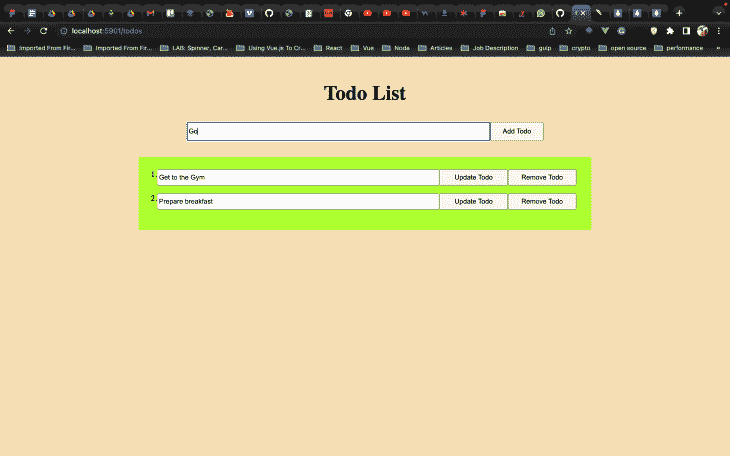
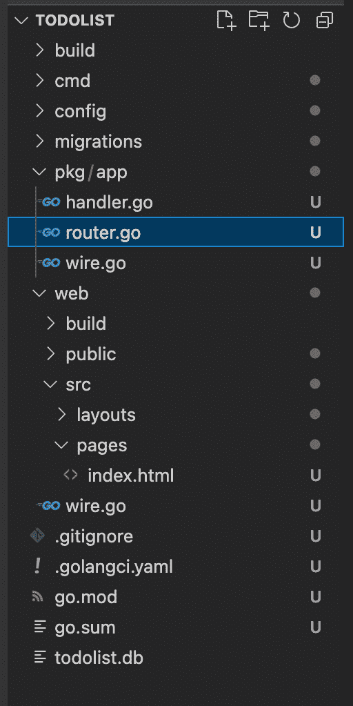
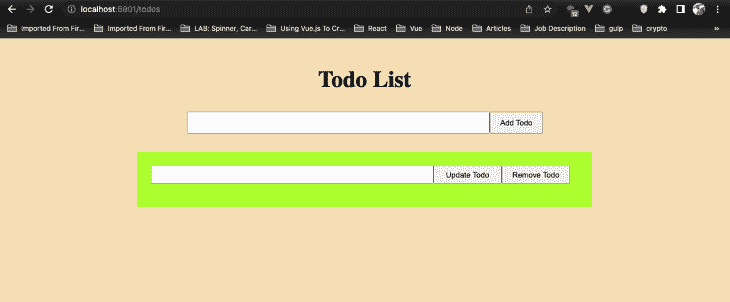
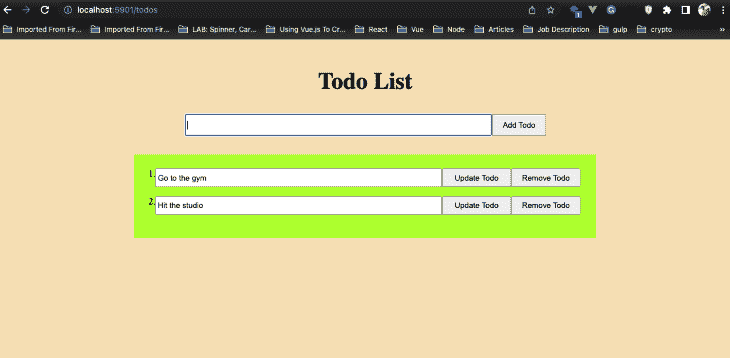

# 在 Go with Copper 中构建 web 应用程序

> 原文：<https://blog.logrocket.com/build-web-app-go-copper/>

Copper 是一个包罗万象的 Go 工具箱，用于创建具有较少样板文件的 web 应用程序，并高度关注开发人员的效率，这使得在 Go 中构建 web 应用程序更加有趣。

Copper 仍然依赖 Go 标准库来维持传统的 Go 体验，同时允许你在构建后端的同时构建前端应用程序，并在一个二进制文件中发布所有内容。它支持在前端使用 React 和 Tailwind 构建全栈 web 应用程序，并且它还支持构建 API，这些 API 可以更加灵活地与 Vue 和 Svelte 等其他前端框架一起工作。

在本文中，我们将看看如何在 Go 中使用 gocopper 框架构建一个 web 应用程序，这样您就可以看到如何在自己的项目中实现它。

## 先决条件

要学习本教程，您应该具备以下条件:

*   安装了 go 1.16+版本
*   已安装节点 v16+
*   构建 Golang 应用程序的经验

## 装置

为了开始使用 Copper，我们将在终端上运行以下命令:

```
$ go install github.com/gocopper/cli/cmd/[email protected]

```

运行以下命令以确保铜缆安装正常工作:

```
$ copper -h

```

如果`copper -h`不起作用，很可能意味着`$GOPATH/bin`不在你的`$PATH`里。将以下内容添加到`~/.zshrc`或`~/.bashrc`:

```
export PATH=$HOME/go/bin:$PATH

```

然后，重启您的终端会话并再次尝试`copper -h`。

## 配置

Copper 允许您使用`-frontend`和`-storage`参数来配置项目模板。

`-frontend`参数允许您使用以下前端框架和库来配置您的前端:

`-storage`参数允许您配置数据库堆栈，默认情况下是`sqlite3`。您可以选择将其设置为`postgres`、`mysql`，或者使用`none`完全跳过存储。

## **我们将构建什么:一个简单的待办事项应用**

我们将构建一个全栈 web 应用程序，允许我们在 SQLite 数据库上执行 CRUD 操作。基本上，我们将构建一个待办事项应用程序。这是完成后的应用程序的外观:



这个应用程序允许我们从数据库中获取、添加、更新和删除待办事项。事不宜迟，我们开始吧。

### 项目设置

我们将使用`go`前端堆栈创建一个使用 Go 模板的项目，如下所示:

```
copper create -frontend=go github.com/<your-username>/todolist

```

通过上面的命令，copper 创建了一个基本的 scaffold 项目，其中 Go 模板用于前端，而`sqlite3`用于数据库。

你的项目脚手架应该是这样的:



要启动应用服务器，请运行以下命令:

```
$ cd todolist && copper run -watch

```

打开 [http://localhost:5901](http://localhost:5901/) 看到铜欢迎页面。

### 更新布局文件

让我们用脚本标签更新`web/src/layouts/main.html`文件，如下所示:

```
<!DOCTYPE html>
<html lang="en">
  <head>
    <meta charset="UTF-8" />
    <meta name="viewport" content="width=device-width, initial-scale=1.0" />
    <title>Copper App</title>
    <link rel="stylesheet" href="/static/styles.css" />
  </head>
  <body>
    {{ template "content" . }}
    <script src="/static/index.js"></script>
  </body>
</html>

```

我们将在`static/index.js`文件中编写一些 javascript 来处理应用程序中的删除请求。

我们的待办事项应用程序要求用户将待办事项添加到数据库中。让我们用一个简单的表单和一个列出所有待办事项的部分创建一个新的待办事项页面。

导航到 pages 目录，使用以下内容创建一个名为`todos.html`的文件:

```
{{ define "content"}}
<div class="gr-container">
    <h2 class="heading">Todo List</h2>
    <form class="add-todo" action="/todos" method="post">
        <input type="text" name="todo">
        <button type="submit">Add Todo</button>
    </form>
    <div class="todo-list">
        <form class="todo-item" action="" method="post">
            <input type="text" name="todo">
            <button class="update" type="submit">Update Todo</button>
            <button class="delete" type="button">Remove Todo</button>
        </form>
    </div>
</div>
{{ end }}

```

### 设计我们的示例应用程序

导航到`web/public`目录，用以下内容更新`style.css`:

```
@import url('https://fonts.googleapis.com/css2?family=Work+Sans:ital,[email protected],700;1,400&display=swap');
html, body {
    margin: 0;
    background-color: wheat;
}
#app {
    /* background-color: whitesmoke; */
    padding: 40px 0;
    font-family: 'Work Sans', sans-serif;
    text-align: center;
    height: 100%;
    box-sizing: border-box;
}
.tagline {
    font-style: italic;
    font-weight: 400;
}
hr {
    margin: 40px auto;
    width: 60%;
    border-top: 1px solid #ddd;
}
.video {
    width: 60%;
    margin: 0 auto;
}
.todo-list {
    background-color: greenyellow;
    margin-top: 2rem;
    width: 60%;
    padding: 1.5rem;
}
.add-todo {
    width: 50%;
    display: flex;
    justify-items: center;
}
.add-todo input {
    width: 85%;
    height: 2rem;
}
.add-todo button {
    width: 15%;
    /* height: 1.5rem; */
}
.todo-item {
    display: flex;
    margin-bottom: 1rem;
}
.todo-item input {
    width: 65%;
    height: 1.6rem;
}
.update, .delete {
    width: 16%;
}
.heading {
    text-align: center;
    font-size: 2.5rem;
}
.gr-container {
    padding: 1rem;

    display: flex;
    flex-direction: column;
    align-items: center;
}

```

为了在浏览器上查看待办事项页面，我们将如下更新`pkg/app/router.go`文件:

```
func (ro *Router) Routes() []chttp.Route {
    return []chttp.Route{
        {
            Path:    "/",
            Methods: []string{http.MethodGet},
            Handler: ro.HandleIndexPage,
        },
        {
            Path:    "/todos",
            Methods: []string{http.MethodGet},
            Handler: ro.HandleTodosPage,
        },
    }
}
func (ro *Router) HandleTodosPage(w http.ResponseWriter, r *http.Request) {
    ro.rw.WriteHTML(w, r, chttp.WriteHTMLParams{
        PageTemplate: "todos.html",
    })
}

```

在这里，我们用`"/todos"`路径更新了我们的应用程序路径，还创建了`HandleTodosPage`处理程序，当用户在浏览器中点击`"/todos"`路径时，它将服务于`todos.html`页面。

重启应用服务器，打开[http://localhost:5901](http://localhost:5901/)/todos 查看待办事项页面。

待办事项页面应该是这样的:



### 实现创建当前待办事项的功能

为了实现 create 特性，我们设置了一个存储层，可以将待办事项保存到数据库中。

让我们运行下面的命令来创建`pkg/todos`包和一个`pkg/todos/queries.go`，我们可以用它来实现我们的 SQL 查询:

```
copper scaffold:pkg todos
copper scaffold:queries todos

```

接下来，我们将创建`Todo`模型及其数据库迁移。打开`pkg/todos/models.go`并定义`Todo`型号:

```
type Todo struct {
    Name string
    Rank int64 `gorm:"-"`
}

```

然后，打开`migrations/0001_initial.sql`并定义它的数据库模式:

```
-- +migrate Up
CREATE TABLE todos (
    name text
);
-- +migrate Down
DROP TABLE todos;

```

在您的终端中，运行`copper migrate`来创建表格。

现在我们的数据库中有了一个`Todo`模型和一个`todos`表，我们可以在`pkg/posts/queries.go`文件中编写我们的数据库查询。

让我们添加一个`SaveTodo`方法，它可以用来将新的待办事项插入到`todos`表中:

```
import (
    "context"
    ...
)
func (q *Queries) SaveTodo(ctx context.Context, todo *Todo) error {
    const query = `
    INSERT INTO todos (name)
    VALUES (?)`
    _, err := q.querier.Exec(ctx, query,
        todo.Name,
    )
    return err
}

```

这里，我们使用一个 SQL 查询将一个新的待办事项插入到数据库中。问号是查询中值的占位符。`q.querier.Exec`函数接受一个上下文对象、一个查询和尽可能多的要传递给占位符的参数。然后，占位符中的值按照它们在`q.querier.Exec`函数中出现的顺序插入。

现在，让我们转到`pkg/app/router.go`并使用`SaveTodo`方法来处理表单提交以创建新的待办事项。

创建一个新的路由处理器`HandleSubmitPost`，用于处理创建新待办事项的提交，如下所示:

```
func (ro *Router) HandleCreateTodos(w http.ResponseWriter, r *http.Request) {
    var (
        todo = strings.TrimSpace(r.PostFormValue(("todo")))
    )
    if todo == "" {
        ro.rw.WriteHTMLError(w, r, cerrors.New(nil, "unable to create todos: todo cannot be empty", map[string]interface{}{
            "form": r.Form,
        }))
        return
    }
    newtodo := todos.Todo{Name: todo}
    err := ro.todos.SaveTodo(r.Context(), &newtodo)
    if err != nil {
        ro.logger.Error("an error occured while saving todo", err)
        ro.rw.WriteHTMLError(w, r, cerrors.New(nil, "unable to create todos", map[string]interface{}{
            "form": r.Form,
        }))
        return
    }
    http.Redirect(w, r, "/todos", http.StatusSeeOther)
}

```

此功能创建一个新的待办事项。首先。我们从表单中获取待办事项值，并修剪用户可能添加的任何空白。然后，我们检查待办事项是否为空字符串，在这种情况下，我们会抛出一个错误。接下来，我们创建一个新的 to-do 对象，并调用`ro.todos.SaveTodo`函数将其保存到数据库中。如果在保存待办事项时出现错误，我们会抛出一个错误。最后，我们重定向到待办事项页面。

* * *

### 更多来自 LogRocket 的精彩文章:

* * *

用`HandleCreateTodos`更新`pkg/app/router.go`文件，如下所示:

```
import (
    "strings"
    "github.com/gocopper/copper/cerrors"
    "github.com/gocopper/copper/chttp"
    "github.com/gocopper/copper/clogger"
    "net/http"
    "github.com/emmanuelhashy/todolist/pkg/todos"
)

type NewRouterParams struct {
    Todos  *todos.Queries
    RW     *chttp.ReaderWriter
    Logger clogger.Logger
}

func NewRouter(p NewRouterParams) *Router {
    return &Router{
        rw:     p.RW,
        logger: p.Logger,
        todos:  p.Todos,
    }
}

type Router struct {
    rw     *chttp.ReaderWriter
    logger clogger.Logger
    todos  *todos.Queries
}

func (ro *Router) Routes() []chttp.Route {
    return []chttp.Route{
        {
            Path:    "/",
            Methods: []string{http.MethodGet},
            Handler: ro.HandleIndexPage,
        },
        {
            Path:    "/todos",
            Methods: []string{http.MethodGet},
            Handler: ro.HandleTodosPage,
        },
        {
            Path:    "/todos",
            Methods: []string{http.MethodPost},
            Handler: ro.HandleCreateTodos,
        },
    }
}

```

现在，我们的 todo 应用程序的创建功能应该工作了！我们可以在`todos`表中添加一个新的待办事项。

### 添加阅读功能以查看所有待办事项

为了实现 read 特性，我们将创建一个新的 SQL 查询来返回数据库中存在的所有 todos 的列表，并从那里开始向上查找。

用以下方法更新`pkg/todos/queries.go`,列出所有待办事项:

```
func (q *Queries) ListTodos(ctx context.Context) ([]Todo, error) {
    const query = "SELECT * FROM todos"
    var (
        todos []Todo
        err   = q.querier.Select(ctx, &todos, query)
    )
    return todos, err
}

```

这里，我们使用一个 SQL 查询来获取存储在数据库中的所有待办事项。因为我们没有更新 DB 中的值，所以我们使用了与`q.querier.Exec`相反的`q.querier.Select`方法。

接下来，更新`pkg/app/router.go`中的`HandleTodosPage`方法，以查询所有 todos 并将其传递给 HTML 模板:

```
func (ro *Router) HandleTodosPage(w http.ResponseWriter, r *http.Request) {
    todos, err := ro.todos.ListTodos(r.Context())
    if err != nil {
        ro.logger.Error("an error occured while fetching todos", err)
        ro.rw.WriteHTMLError(w, r, cerrors.New(nil, "unable to fetch todos", map[string]interface{}{
            "form": r.Form,
        }))
    }
    for i := range todos {
        todos[i].Rank = int64(i + 1)
    }
    ro.rw.WriteHTML(w, r, chttp.WriteHTMLParams{
        PageTemplate: "todos.html",
        Data:         todos,
    })
}

```

要使用数据并呈现所有待办事项列表，请按如下方式更新`web/src/pages/todos.html`:

```
{{ define "content"}}
<div class="gr-container">
    <h2 class="heading">Todo List</h2>
    <form class="add-todo" action="/todos" method="post">
        <input type="text" name="todo">
        <button type="submit">Add Todo</button>
    </form>
    <div class="todo-list">
        {{ range . }}
        <form class="todo-item" action="/{{.Name}}" method="post">
            {{.Rank}}.
            <input type="text" name="todo" value="{{.Name}}">
            <button class="update" type="submit">Update Todo</button>
            <button class="delete" type="button">Remove Todo</button>
        </form>

        {{ end }}
    </div>
</div>
{{ end }}

```

现在，您应该在待办事项页面中看到数据库中所有待办事项的列表。



### 更新待办事项

为了实现更新特性，我们将创建一个新的 SQL 查询来更新数据库中存在的待办事项。

用以下方法更新`pkg/todos/queries.go`:

```
func (q *Queries) UpdateTodo(ctx context.Context, oldName string, todo *Todo) error {
    const query = `
    UPDATE todos SET name=(?) WHERE name=(?)`
    _, err := q.querier.Exec(ctx, query,
        todo.Name,
        oldName,
    )
    return err
}

```

这里，我们使用一个 SQL 查询来更新数据库中的一个待办事项值。我们将新值和旧值分别传递给 SQL 查询中的占位符。

接下来，我们将在`pkg/app/router.go`中创建一个`HandleUpdateTodos`方法来更新现有的 todos:

```
func (ro *Router) HandleUpdateTodos(w http.ResponseWriter, r *http.Request) {
    var (
        todo    = strings.TrimSpace(r.PostFormValue("todo"))
        oldName = chttp.URLParams(r)["todo"]
    )
    if todo == "" {
        ro.rw.WriteHTMLError(w, r, cerrors.New(nil, "unable to update todos: todo cannot be empty", map[string]interface{}{
            "form": r.Form,
        }))
        return
    }
    newtodo := todos.Todo{Name: todo}
    ro.logger.WithTags(map[string]interface{}{
        "oldname": oldName,
        "newname": newtodo.Name,
    }).Info("Todo updated")
    err := ro.todos.UpdateTodo(r.Context(), oldName, &newtodo)
    if err != nil {
        ro.logger.Error("an error occured while saving todo", err)
        ro.rw.WriteHTMLError(w, r, cerrors.New(nil, "unable to update todos", map[string]interface{}{
            "form": r.Form,
        }))
        return
    }
    http.Redirect(w, r, "/todos", http.StatusSeeOther)
}

```

然后用`HandleUpdateTodos`方法更新`Routes`，如下所示:

```
func (ro *Router) Routes() []chttp.Route {
    return []chttp.Route{
        ...
        {
            Path:    "/{todo}",
            Methods: []string{http.MethodPost},
            Handler: ro.HandleUpdateTodos,
        },
    }
}

```

### 删除待办事项

为了实现删除特性，我们将创建一个新的 SQL 查询来删除数据库中存在的待办事项。

用以下方法更新`pkg/todos/queries.go`:

```
func (q *Queries) DeleteTodo(ctx context.Context, todo *Todo) error {
    const query = `
    DELETE from todos WHERE name=(?)`
    _, err := q.querier.Exec(ctx, query,
        todo.Name,
    )
    return err
}

```

接下来，我们将在`pkg/app/router.go`中创建`HandleDeleteTodos`方法来删除现有的待办事项:

```
type error struct {
    error string
}

func (ro *Router) HandleDeleteTodos(w http.ResponseWriter, r *http.Request) {
    var (
        todo = strings.TrimSpace(chttp.URLParams(r)["todo"])
    )
    if todo == "" {
        deleteError := error{error: "Unable to delete todo"}
        ro.rw.WriteJSON(w, chttp.WriteJSONParams{StatusCode: 500, Data: deleteError})
        return
    }
    newtodo := todos.Todo{Name: todo}
    err := ro.todos.DeleteTodo(r.Context(), &newtodo)
    if err != nil {
        ro.logger.Error("an error occured while deleting todo", err)
        deleteError := error{error: "Unable to delete todo"}
        ro.rw.WriteJSON(w, chttp.WriteJSONParams{StatusCode: 500, Data: deleteError})
        return
    }
    http.Redirect(w, r, "/todos", http.StatusSeeOther)
}

```

然后用`HandleDeleteTodos`方法更新`Routes`，如下所示:

```
func (ro *Router) Routes() []chttp.Route {
    return []chttp.Route{
        ...
        {
            Path:    "/{todo}",
            Methods: []string{http.MethodDelete},
            Handler: ro.HandleDeleteTodos,
        },
    }
}

```

为了总结我们的待办事项应用程序的删除特性，我们将在`web/public`目录中创建一个`index.js`文件，并添加以下函数:

```
function deleteTodo(name){
    fetch(`/${name}`, {method: "Delete"}).then(res =>{
        if (res.status == 200){
            window.location.pathname = "/todos"
        }
    }).catch(err => {
        alert("An error occured while deleting the todo", err.message)
    })
}

```

然后，更新`pages/todos.html`中的删除待办事项按钮，如下所示:

```
<button class="delete" type="button" onclick = "deleteTodo('{{.Name}}')" >Remove Todo</button>

```

我们已经使用 gocopper 在 Go 中成功构建了一个 web app。

如果你正确地遵循了上面的教程，你的待办事项应用应该能够执行基本的创建、读取、更新和删除操作。

这里是最终的[代码库](https://github.com/emmanuelhashy/gocopper-todoapp)的链接。

## 结论

本教程终于告一段落。我们研究了如何使用 Copper 在 Go 中创建一个 web 应用程序，并使用它成功地构建了一个待办事项应用程序。

Copper 利用`google/wire`来支持动态依赖注入。它附带了`clogger`包，可以在开发和生产环境中实现结构化日志记录。此外，它与`cerrors`包紧密协作，帮助为您的错误添加结构和上下文，从而显著改进错误日志。

我迫不及待地想看看你下一步会做什么，因为有很多方法可以让它变得更好。你可以在 Twitter 上关注我@5x_dev。

## 使用 [LogRocket](https://lp.logrocket.com/blg/signup) 消除传统错误报告的干扰

[](https://lp.logrocket.com/blg/signup)

[LogRocket](https://lp.logrocket.com/blg/signup) 是一个数字体验分析解决方案，它可以保护您免受数百个假阳性错误警报的影响，只针对几个真正重要的项目。LogRocket 会告诉您应用程序中实际影响用户的最具影响力的 bug 和 UX 问题。

然后，使用具有深层技术遥测的会话重放来确切地查看用户看到了什么以及是什么导致了问题，就像你在他们身后看一样。

LogRocket 自动聚合客户端错误、JS 异常、前端性能指标和用户交互。然后 LogRocket 使用机器学习来告诉你哪些问题正在影响大多数用户，并提供你需要修复它的上下文。

关注重要的 bug—[今天就试试 LogRocket】。](https://lp.logrocket.com/blg/signup-issue-free)