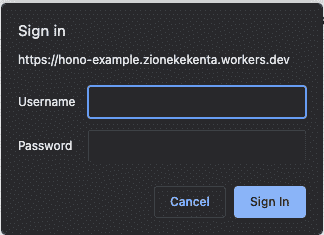
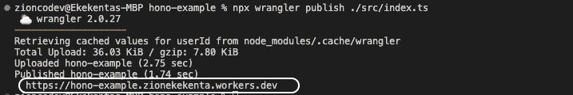

# 用 Hono 构建一个 web 应用程序

> 原文：<https://blog.logrocket.com/build-web-application-hono/>

给定大量的可用选项，为 web 应用程序选择正确的工具可能是一项挑战。在选择框架时，速度通常是首要考虑的因素。快速加载是 web 应用程序的一个优先考虑的问题，因为用户不喜欢过长的等待时间。

本文介绍了 [Hono](https://honojs.dev) ，这是一个新的、灵活的 web 应用程序框架，速度非常快。根据框架网站公布的[测试结果，Hono 比 Cloudflare Workers 的其他路由器快，如](https://honojs.dev) [Sunder](https://sunderjs.com) 、 [Itty Router](https://itty-router.dev/#/) 和 [Worktop](https://github.com/lukeed/worktop#readme) ，也比 Deno 和 Bun 的其他框架快。

在本文的教程部分，我们将演示如何使用 Cloudflare Workers 和 Hono 制作博客应用程序。

## 内容

## 先决条件

要充分利用本教程，请确保您具备以下条件:

## Hono 是什么？

Hono 是一个轻量级、简单、快速的 web 框架，适用于 Cloudflare Workers、Deno、Bun 和其他应用程序。这是一个既快速又灵活的现代 web 应用程序。它提供了对 TypeScript 的内置支持，并且易于在本地环境中开发。使用 Hono，很容易用 Deno、Bun 和 Cloudflare Workers 创建可发布的 web 应用程序。

## 为什么用 Hono？

Hono 有很多很酷的特性，这也是它受到很多开发者喜爱和使用的原因。以下是 Hono 的一些特点:

*   无线性环路的超快速路由器
*   对类型脚本的内置支持
*   使用服务人员和 Web 标准 API，没有依赖性
*   允许使用内置中间件、定制中间件和第三方中间件
*   与多个平台集成，如 Cloudflare Workers、Fastfly、[【电子邮件保护】](/cdn-cgi/l/email-protection)、Deno 和 Bun

## 演示:用 Hono 构建博客应用程序

让我们在探索 Hono 特性的同时创建一个 web 应用程序。我们将使用 Cloudflare Workers 设置项目，创建待办事项 API，执行 CRUD 操作，实现身份验证，并添加中间件。

### 入门指南

首先，让我们用 Cloudflare Workers 创建第一个 Hono 应用程序。

首先，为项目创建一个新文件夹，如下所示:

```
mkdir hono-app && cd hono-app

```

然后，使用 Cloudflare Workers 命令行工具 [Wrangler](https://developers.cloudflare.com/workers/wrangler/) 初始化一个新项目:

```
npx wrangler init -y

```

上述命令将生成以下文件夹结构:

```
hono-example
 ┣ src
 ┃ ┗ index.ts
 ┣ .gitignore
 ┣ package-lock.json
 ┣ package.json
 ┣ tsconfig.json
 ┗ wrangler.toml

```

### 安装荣誉

要设置应用程序，首先运行以下命令安装 Hono 包:

```
npm install hono

```

接下来，创建一个 Hono 服务器，如下所示:

```
import { Hono } from 'hono'
const app = new Hono()

app.get('/', (c) => c.text('Hello from Hono'))

app.fire()

```

在上面的代码中，我们导入了 Hono 包并初始化了一个新的 Hono app 实例。有了这个应用程序实例，我们可以访问 Hono 的所有可用功能。我们还导出了应用程序实例，以便 Cloudflare 工作人员可以在服务工作人员模式下运行该应用程序。

接下来，在项目根目录中运行以下命令来启动应用程序:

```
npx wrangler dev

```

该命令将在`localhost:8787`运行应用程序。你可以在你的浏览器上测试一下。

### 创建路线

Hono 让路由尽可能的灵活直观；这与使用 Express.js 这样的框架处理路由的方式非常相似。

让我们创建一个 API 路由来执行一些 CRUD 操作。我们将创建一个博客 API 来阅读和创建博客。

我们将首先为博客创建一个类型和一个变量。将以下代码添加到`index.ts`文件中:

```
type BLOG = {
  id: number,
  title: string,
  content: string
}

const blogs: BLOG[] = []

```

接下来，我们将使用以下代码定义 API 路由:

```
app.get('/api/blogs', (c) => c.json(blogs))

app.get('/api/blogs/:id', (c) => {
  const { id } = c.req.param()
  const blog = blogs.filter(data => data.id === parseInt(id))
  return c.json(blog)
})

app.post('/api/blogs', async (c) => {
  const body = await c.req.parseBody() as BLOG;
  if (!body) return c.json({ status: 401, message: "The request payload is required" })
  const newBlog = {
    id: blogs.length + 1,
    title: body.title,
    content: body.content
  }
  blogs.push(newBlog)
  return c.json({ data: newBlog })
})

```

和 Express.js 一样，Hono 提供了几种方法(例如`get`、`post`、`update`、`delete`)供我们进行操作。这些方法中的每一个都有一个将`c`作为参数的回调。`c`参数为用户提供了访问请求参数和有效负载以及响应请求所需的方法。

### 添加身份验证

Hono 提供了中间件来为我们的应用程序快速添加身份验证。Hono 提供了三种认证中间件:基本认证、承载认证和 JWT 认证。可以在[这里](https://honojs.dev/docs/builtin-middleware/)找到每种认证类型的详细信息。

在本演示中，我们将实现基本身份验证。首先，从 Hono 导入`basicAuth`中间件，并使用以下代码:

```
import { basicAuth } from 'hono/basic-auth'
...

app.use(
  '/api/*',
  basicAuth({
    username: 'clinton',
    password: '1234',
  })
)

```

这个中间件将防止未经授权的用户请求任何以`/api`开头的端点。此外，它将显示一个登录用户界面，用户必须登录该界面才能获得访问权限:



如果用户输入的用户名和密码与中间件中的用户名和密码匹配，Hono 将创建一个会话，并允许在后续请求中访问路由。

### 呈现静态文件

Hono 提供了`serveStatic`中间件，允许呈现位于中间件根选项中指定的目录中的静态文件。

首先，在项目的根目录下创建一个`assets`文件。然后，更新`wrangler.toml`文件以指定资产目录，如下所示:

```
[site]
bucket = "./assets"

```

接下来，我们需要创建资产文件或将资产文件添加到资产文件夹中。

在这个演示中，我们将呈现一个 HTML 页面。因此，在 assets 文件夹中用下面的标记创建一个`index.html`文件:

```
<!DOCTYPE html>
<html lang="en">
<head>
    <meta charset="UTF-8">
    <meta http-equiv="X-UA-Compatible" content="IE=edge">
    <meta name="viewport" content="width=device-width, initial-scale=1.0">
    <title>Document</title>
    <link rel="stylesheet" href="/static/style.css">
</head>
<body>
    <h4>Hello from Hono </h4>
</body>
</html>

```

现在，在`index.ts`文件中设置静态中间件，如下所示:

```
app.use('/static/*', serveStatic({ root: './' }))
app.get('/', serveStatic({ path: './index.html' }));

```

在上面的代码中，我们创建了一个 Hono 中间件，它将在`/static`端点上提供静态内容。我们还使用了`serverStatic`中间件来指定我们的资产目录的根位置。

### 处理 CORS

为了让我们的应用程序与前端框架交互，我们需要实现 CORS。Hono 为我们提供了一个`cors`中间件。

在`index.ts`文件中导入并设置中间件:

```
import { cors } from 'hono/cors'
app.use('/api/*', cors())

```

在上面的代码中，我们在应用程序中以`/api`开头的所有端点上实现了 CORS。通过这样做，当用户向这些端点发出请求时，不会有任何 CORS 阻塞。

### 部署应用程序

现在，让我们通过运行以下命令将应用程序部署到 Cloudflare:

```
npx wrangler publish ./src/index.ts

```

上述命令将提示您授权应用程序访问您的 Cloudflare 帐户。

授权应用程序后，等待部署完成。部署完成后，您将看到应用程序的 worker URL，如下所示:



复制链接并进行测试。

## 结论

在本教程中，我们探索了如何用 Hono 构建一个 web 应用程序。我们讨论了 Hono 是什么以及为什么开发者应该考虑使用这个框架。为了说明这一点，我们展示了如何使用 Cloudflare Workers 和 Hono 构建一个博客应用程序。

要了解更多关于 Hono 的特性，请访问官方文档。

现在你已经被介绍给 Hono 了，你将如何在你的下一个项目中使用它？

## 使用 [LogRocket](https://lp.logrocket.com/blg/signup) 消除传统错误报告的干扰

[](https://lp.logrocket.com/blg/signup)

[LogRocket](https://lp.logrocket.com/blg/signup) 是一个数字体验分析解决方案，它可以保护您免受数百个假阳性错误警报的影响，只针对几个真正重要的项目。LogRocket 会告诉您应用程序中实际影响用户的最具影响力的 bug 和 UX 问题。

然后，使用具有深层技术遥测的会话重放来确切地查看用户看到了什么以及是什么导致了问题，就像你在他们身后看一样。

LogRocket 自动聚合客户端错误、JS 异常、前端性能指标和用户交互。然后 LogRocket 使用机器学习来告诉你哪些问题正在影响大多数用户，并提供你需要修复它的上下文。

关注重要的 bug—[今天就试试 LogRocket】。](https://lp.logrocket.com/blg/signup-issue-free)