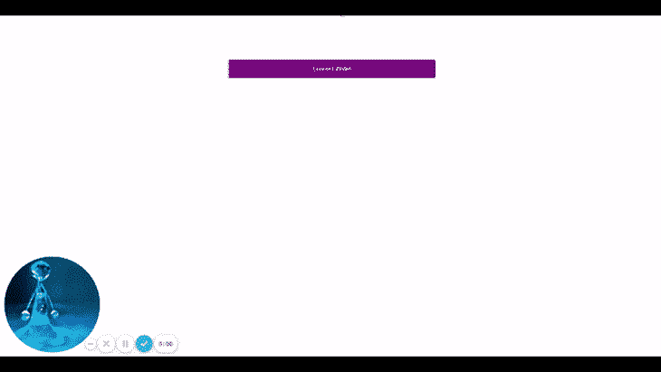

# 用 React、Ether.js 和 Ceramic - LogRocket Blog 构建一个 Web3 认证流

> 原文：<https://blog.logrocket.com/build-web3-authentication-flow-react-ether-js-ceramic/>

## 介绍

Web3 的一个关键方面是区块链钱包和公钥加密可以用来识别账户。在本文中，我们将通过以下步骤，探索如何使用区块链钱包，使用 Ether.js 库与区块链交互，创建一个一键式、加密安全的登录流:

### 密码安全的区块链有什么用？

如上所述，密码安全的区块链通过使用私钥签署一段数据来证明帐户的所有权，这是其本质的结果。这些加密签名也可用于将事务写入区块链。

我们将继续构建一个基于消息签名的身份验证机制，使用用户的公共地址作为他们的标识符。

### Web3 钱包是用来做什么的？

Web3 钱包用于 Web3 环境中的身份验证。在撰写本文时，有三个主要的 Web3 钱包选项:

1.  [MetaMask](https://metamask.io/)
2.  wallet connect
3.  [Web3Auth](https://web3auth.io/)

在本教程中，我们将使用元掩码。既然我们已经设计好了项目，让我们开始吧。

## 用陶瓷设置我们的 React 应用

要使用 Ceramic，我们需要 Node.js ≥ v14 和 npm ≥ v6，我们将用 Next.js 创建一个新的 React 应用程序。

```
yarn create next-app --typescript web3-auth

```

安装依赖项:

```
yarn add web3modal ethers @ceramicnetwork/http-client key-did-resolver @ceramicnetwork/3id-did-resolver key-did-provider-ed25519 @stablelib/random
@ceramicnetwork/stream-tile dids
```

Ceramic 依赖于用户账户的[分散标识符(DID)](https://www.w3.org/TR/did-core/) 标准，该标准与所有区块链钱包兼容。DIDs 是有用的，因为它们可以将陶瓷账户从任何 Web3 钱包地址或公钥中分离出来，作为确认账户真正所有者的一种方式。

## 用陶瓷承载数据

我们的应用程序将依靠[陶瓷数据网络](https://ceramic.network/)来存储、修改和检索数据。依靠 Ceramic 的数据模型，我们将创建一个基本的用户注册中心，注册中心的用户帐户将符合标准的 DID 规范。陶瓷客户端使认证账户能够在网络上进行交易。

### 创建陶瓷用户注册

下面是创建陶瓷用户注册的必要代码。`http-client`允许我们的应用程序通过 HTTP 连接到远程陶瓷节点来读写流。在整个项目中，将使用 TypeScript。

```
mkdir utils
touch client.tsx

import { CeramicClient } from "@ceramicnetwork/http-client";
import KeyDidResolver from "key-did-resolver";
import ThreeIdResolver from "@ceramicnetwork/3id-did-resolver";
import { Ed25519Provider } from "key-did-provider-ed25519";
import { randomBytes } from "@stablelib/random";
import { TileDocument } from "@ceramicnetwork/stream-tile";
import { DID } from "dids";

// set ceramic node URL
const API_URL = "https://ceramic-clay.3boxlabs.com";

// generate seed
const seed = randomBytes(32);

// create provider
const provider = new Ed25519Provider(seed);

// create ceramic instance
const ceramic = new CeramicClient(API_URL);

// set provider to ceramic
ceramic.did?.setProvider(provider);

await ceramic.did?.authenticate();

// DID methods to authenticate writes
const resolver = {
  ...KeyDidResolver.getResolver(),
  ...ThreeIdResolver.getResolver(ceramic),
};

// create a DID instance
const did = new DID({ resolver });

// set DID instance
ceramic.did = did;

const doc = await TileDocument.create(ceramic, { broadcast: "Hello" });

export const users: any = { doc };

```

## 在 React 中实现 Web3 认证流

`auth` API 检查用户的帐户是否存在于用户注册中心。如果还没有创建这样的用户，则会创建一个新用户，并为他们分配一个[密码随机数](https://en.wikipedia.org/wiki/Cryptographic_nonce)。

```
touch src/pages/api/auth.tsx
code src/pages/api/auth.tsx
import type { NextApiRequest, NextApiResponse } from "next";

import { users } from "../../utils/client";
export default async function auth(req: NextApiRequest, res: NextApiResponse) {
  const { address } = req.query;
  let user = users[address as string];

  // check if user exists in register
  if (!user) {
    user = {
      address,
      // update user nonce
      nonce: Math.floor(Math.random() * 10000000),
    };
    users[address as string] = user;
  } else {
    // create nonce for new user
    const nonce = Math.floor(Math.random() * 10000000);
    // assign nonce to new user
    user.nonce = nonce;
    users[address as string] = user;
  }
  res.status(200).json(user);
}

```

在我们的 auth 文件中生成的 nonce 被用作对来自客户端的请求进行签名的唯一字符串。这可以在服务器上对事务进行身份验证。一旦签名被创建，它就和请求一起被发送。

```
touch pages/api/confirm.tsx
code pages/api/confirm.tsx
```

nonce 非常重要，因为它用于解码服务器上的事务。一旦确认解码后的字符串与调用者的地址匹配，系统就可以确认交易是由同一用户发送的。

在`confirm.tsx`文件中，检查解码后的字符串，以确保它与调用者的地址匹配。

```
import type { NextApiRequest, NextApiResponse } from "next";
import { ethers } from "ethers";
import { users } from "../../utils/client";

export default function transactionCheck(
  req: NextApiRequest,
  res: NextApiResponse
) {
  let authenticated = false;

  const { address1, signature } = req.query;
  const user = users[address1 as string];
  const address = address1 as string;
  const decodedAddress = ethers.utils.verifyMessage(
    user.nonce.toString(),
    signature as string
  );
  if (address.toLowerCase() === decodedAddress.toLowerCase())
    authenticated = true;
  res.status(200).json({ authenticated });
}

```

## 使用 Web3Modal 添加多个提供者

[web 3 mode 库](https://github.com/Web3Modal/web3modal)是一个简单的 Web3/Ethereum 提供者解决方案，它能够在应用程序中增加对多个提供者的支持。Web3Modal 库支持我们将在这个项目中依赖的注入提供者，MetaMask 和 [Tor.us](https://tor.us/) 。

在`Home.module.css`文件中，为应用程序容器和登录按钮创建样式。

```
touch styles/Home.module.css
.container {
  width: 30rem;
  margin: 100px auto;
}

.button {
  width: 100%;
  margin: 0.2rem;
  padding: 0.8rem;
  border: none;
  background-color: purple;
  color: white;
  font-size: 16;
  cursor: pointer;
}
```

```
touch pages/index.tsx
import type { NextPage } from "next";
import React, { useState } from "react";
import { ethers } from "ethers";
import Web3Modal from "web3modal";
import styles from "../styles/Home.module.css";

const Home: NextPage = () => {
  const [account, setAccount] = useState("");
  const [connection, setConnection] = useState(false);
  const [loggedIn, setLoggedIn] = useState(false);

  async function getWeb3Modal() {
    let Torus = (await import("@toruslabs/torus-embed")).default;
    const web3modal = new Web3Modal({
      network: "mainnet",
      cacheProvider: false,
      providerOptions: {
        torus: {
          package: Torus,
        },
      },
    });
    return web3modal;
  }

  async function connect() {
    const web3modal = await getWeb3Modal();
    const connection = await web3modal.connect();
    const provider = new ethers.providers.Web3Provider(connection);
    const accounts = await provider.listAccounts();
    setConnection(connection);
    setAccount(accounts[0]);
  }

  async function Login() {
    const authData = await fetch(`/api/authenticate?address=${account}`);
    const user = await authData.json();
    const provider = new ethers.providers.Web3Provider(connection as any);
    const signer = provider.getSigner();
    const signature = await signer.signMessage(user.nonce.toString());
    const response = await fetch(
      `/api/verify?address=${account}&signature=${signature}`
    );
    const data = await response.json();
    setLoggedIn(data.authenticated);
  }

  return (
    <div className={styles.container}>
      {!connection && (
        <button className={styles.button} onClick={connect}>
          Connect Wallet
        </button>
      )}
      {connection && !loggedIn && (
        <>
          <button className={styles.button} onClick={Login}>
            Login
          </button>
        </>
      )}
      {loggedIn && <h2>Let's get started, {account}</h2>}
    </div>
  );
};

export default Home;

```

`connect`功能提示使用 Web3 模式的用户使用应用程序中指定的可用注入 Tor.us Web3 钱包登录。

`login`函数连接用户注册中心并更新用户的随机数。一旦在服务器上通过签名验证了 nonce，UI 就会更新。



## 结论

在本文中，我们构建了一个密码安全的登录流，并解释了如何使用用户的随机数来确认数字签名。我们还演示了如何使用 nonce 来证明帐户的所有权，从而提供身份验证。

## 使用 LogRocket 消除传统反应错误报告的噪音

[LogRocket](https://lp.logrocket.com/blg/react-signup-issue-free)

是一款 React analytics 解决方案，可保护您免受数百个误报错误警报的影响，只针对少数真正重要的项目。LogRocket 告诉您 React 应用程序中实际影响用户的最具影响力的 bug 和 UX 问题。

[ ](https://lp.logrocket.com/blg/react-signup-general) [  ](https://lp.logrocket.com/blg/react-signup-general) [LogRocket](https://lp.logrocket.com/blg/react-signup-issue-free)

自动聚合客户端错误、反应错误边界、还原状态、缓慢的组件加载时间、JS 异常、前端性能指标和用户交互。然后，LogRocket 使用机器学习来通知您影响大多数用户的最具影响力的问题，并提供您修复它所需的上下文。

关注重要的 React bug—[今天就试试 LogRocket】。](https://lp.logrocket.com/blg/react-signup-issue-free)