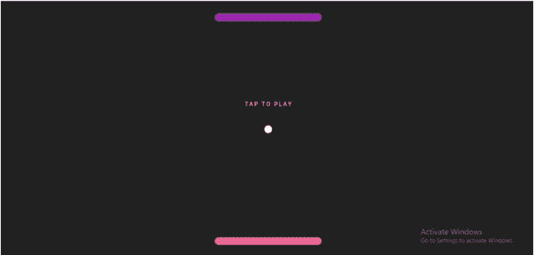

# 用 Flutter - LogRocket 博客构建 2D 游戏

> 原文：<https://blog.logrocket.com/building-2d-game-flutter/>

Flutter 的出现和成长带动了跨平台游戏设计的发展；只需几行设计和逻辑代码，就可以创建 Flutter 游戏，同时保持良好的 UI/UX。

Flutter 能够以高达 60FPS 的速度渲染。您可以利用这种能力来构建一个简单的 2D，甚至是 3D 游戏。请记住，在 Flutter 中开发更复杂的游戏并不是一个好主意，因为大多数开发人员会倾向于复杂应用程序的本地开发。

在本教程中，我们将重现最早的电脑游戏之一:乒乓。Pong 是一个简单的游戏，所以它是一个很好的起点。本文分为两个主要部分:游戏逻辑和用户界面，通过分别关注重要部分来使构建更加清晰。

在我们开始构建之前，让我们先回顾一下先决条件和设置。

## 先决条件

要理解本课并编写代码，您需要以下内容:

*   安装在您机器上的[颤振](https://blog.logrocket.com/whats-new-in-flutter-2-0/)
*   省道和扑动的工作知识
*   文本编辑器

## 入门指南

在这篇文章中，我们将使用`Alignment(x,y)`作为屏幕 X 和 Y 轴位置的`Vector(x,y)`的表示，这将有助于开发游戏的物理特性。我们还将为我们的一些变量创建无状态小部件，并在`homepage.dart`文件中声明它们，以使代码不那么庞大并且易于理解。

首先，创建一个颤振项目。清除`main.dart`文件中的默认代码，导入`material.dart`包，将[材质小部件](https://blog.logrocket.com/new-material-buttons-in-flutter/)包含在应用中。

接下来，创建一个名为`MyApp()`的类并返回`MaterialApp()`，然后创建一个`statefulWidget` `HomePage()`并将其传入`MaterialApp()`的`home`参数，如下所示:

```
import 'package:flutter/material.dart';
import 'package:pong/homePage.dart';
void main() {
 runApp(MyApp());
}
class MyApp extends StatelessWidget {
 @override
 Widget build(BuildContext context) {
  return MaterialApp(
   debugShowCheckedModeBanner:false,
   home: HomePage(),
  );
 }
}

```

## 游戏逻辑

在`HomePage()`内，我们需要编写一些函数和方法来处理数学和物理相关的操作。其中包括处理碰撞、加速或减速以及游戏中的导航。

但是首先，我们需要声明一些参数，这些参数将代表球、球员的位置排列以及双方球员的初始得分。参数的代码应该放在`_HomePageState`下面，我们将在后面的文章中提到:

```
//player variations
double playerX = -0.2;
double brickWidth = 0.4;
int playerScore = 0;
// enemy variable
double enemyX = -0.2;
int enemyScore = 0;
//ball
double ballx = 0;
double bally = 0;
var ballYDirection = direction.DOWN;
var ballXDirection = direction.RIGHT;
bool gameStarted = false;
...

```

然后，我们为球和砖块的移动方向提供一个枚举:

```
enum direction { UP, DOWN, LEFT, RIGHT }
...

```

为了让这个游戏运行，我们需要创建人工重力，以便当球击中顶部的砖块(0.9)或底部的砖块(-0.9)时，它会向相反的方向运动。否则，如果它没有击中任何一块砖，而是去了游戏场地的顶部(1)或底部(-1)，它将记录为玩家的损失。

当球击中左边(1)或右边(-1)的墙时，它会向相反的方向运动:

```
void startGame() {
 gameStarted = true;
 Timer.periodic(Duration(milliseconds: 1), (timer) {
  updatedDirection();
  moveBall();
  moveEnemy();
  if (isPlayerDead()) {
   enemyScore++;
   timer.cancel();
   _showDialog(false);
   // resetGame();
  }
   if (isEnemyDead()) {
   playerScore++;
   timer.cancel();
   _showDialog(true);
   // resetGame();
  }
 });
}
...

```

在上面的代码中，我们从一个函数`startGame()`开始，它将布尔值`gameStarted`变为`true`，之后我们调用一个持续时间为一秒的`Timer()`。

在计时器中，像`updatedDirection()`、`moveBall()`和`moveEnemy()`这样的函数与一个`if`语句一起传递，以检查任一玩家是否失败。如果是，分数累积，计时器取消，并显示一个对话框。

以下功能确保球不会超出`0.9`对齐，并且球在接触砖块时只会向相反的方向移动:

```
void updatedDirection() {
 setState(() {
  //update vertical dirction
  if (bally >= 0.9 && playerX + brickWidth>= ballx && playerX <= ballx) {
   ballYDirection = direction.UP;
  } else if (bally <= -0.9) {
   ballYDirection = direction.DOWN;
  }
  // update horizontal directions
  if (ballx >= 1) {
   ballXDirection = direction.LEFT;
  } else if (ballx <= -1) {
   ballXDirection = direction.RIGHT;
  }
 });
}
void moveBall() {
 //vertical movement
 setState(() {
  if (ballYDirection == direction.DOWN) {
   bally += 0.01;
  } else if (ballYDirection == direction.UP) {
   bally -= 0.01;
  }
 });
 //horizontal movement
 setState(() {
  if (ballXDirection == direction.LEFT) {
   ballx -= 0.01;
  } else if (ballXDirection == direction.RIGHT) {
   ballx += 0.01;
  }
 });
}
...

```

此外，如果球击中场地的左侧或右侧，它会向相反的方向运动:

```
void moveLeft() {
 setState(() {
  if (!(playerX - 0.1 <= -1)) {
   playerX -= 0.1;
  }
 });
}
void moveRight() {
 if (!(playerX + brickWidth >= 1)) {
  playerX += 0.1;
 }
}
...

```

`moveLeft()`和`moveRight()`功能有助于使用键盘箭头控制砖块从左向右移动。这些与`if`声明一起工作，以确保砖块不会超出场地两个轴的宽度。

功能`resetGame()`将球员和球返回到他们的默认位置:

```
void resetGame() {
 Navigator.pop(context);
 setState(() {
  gameStarted = false;
  ballx = 0;
  bally = 0;
  playerX = -0.2;
  enemyX =- 0.2;
 });
}
...

```

接下来，我们创建两个函数，`isEnemyDead()`和`isPlayerDead()`，它们返回一个布尔值。他们检查是否有一名球员输了(如果球击中了砖块后面的垂直部分):

```
bool isEnemyDead(){
 if (bally <= -1) {
  return true;
 }
 return false;
}
bool isPlayerDead() {
 if (bally >= 1) {
  return true;
 }
 return false;
}
...

```

最后，函数`_showDialog`在任一玩家获胜时显示一个对话框。它传递一个布尔值`enemyDied`，以区分玩家何时输了。然后，它宣布未输的玩家赢得了这一轮，并使用获胜玩家的颜色显示文本“再玩一次:”

```
void _showDialog(bool enemyDied) {
 showDialog(
   context: context,
   barrierDismissible: false,
   builder: (BuildContext context) {
    // return object of type Dialog
    return AlertDialog(
     elevation: 0.0,
     shape: RoundedRectangleBorder(
       borderRadius: BorderRadius.circular(10.0)),
     backgroundColor: Colors.purple,
     title: Center(
      child: Text(
       enemyDied?"Pink Wins": "Purple Wins",
       style: TextStyle(color: Colors.white),
      ),
     ),
     actions: [
      GestureDetector(
       onTap: resetGame,
       child: ClipRRect(
        borderRadius: BorderRadius.circular(5),
        child: Container(
          padding: EdgeInsets.all(7),
          color: Colors.purple[100],
          child: Text(
           "Play Again",
           style: TextStyle(color:enemyDied?Colors.pink[300]: Colors.purple[000]),
          )),
       ),
      )
     ],
    );
   });
}

```

## 用户界面

现在，我们将开始开发用户界面。

在`homePage.dart`文件中的小部件`build`内，添加以下代码:

```
return RawKeyboardListener(
 focusNode: FocusNode(),
 autofocus: false,
 onKey: (event) {
  if (event.isKeyPressed(LogicalKeyboardKey.arrowLeft)) {
   moveLeft();
  } else if (event.isKeyPressed(LogicalKeyboardKey.arrowRight)) {  
moveRight();
  }
 },
 child: GestureDetector(
  onTap: startGame,
  child: Scaffold(
    backgroundColor: Colors.grey[900],
    body: Center(
      child: Stack(
     children: [
      Welcome(gameStarted),
      //top brick
      Brick(enemyX, -0.9, brickWidth, true),
      //scoreboard
      Score(gameStarted,enemyScore,playerScore),
      // ball
      Ball(ballx, bally),
      // //bottom brick
      Brick(enemyX, 0.9, brickWidth, false)
     ],
    ))),
 ),
);

```

在代码中，我们返回`RawKeyboardListener()`，当我们在 web 上构建时，它将提供从左到右的移动。这也可以被复制用于触摸屏设备。

小部件`GestureDetector()`提供了`onTap`功能，用于调用上面在逻辑中编写的函数`startGame`。还编写了一个子元素`Scaffold()`，用于指定应用程序的背景颜色和主体。

接下来，创建一个名为`Welcome`的类，并传入一个布尔值来检查游戏是否已经开始。如果游戏尚未开始，文本“点击播放”将变得可见:

```
class Welcome extends StatelessWidget {

 final bool gameStarted;
 Welcome(this.gameStarted);
 @override
 Widget build(BuildContext context) {
  return Container(
    alignment: Alignment(0, -0.2),
    child: Text(
     gameStarted ? "": "T A P T O P L A Y",
     style: TextStyle(color: Colors.white),
    ));
 }
}

```

现在我们可以创建另一个类`Ball`，使用`Alignment(x,y)`来处理球的设计和它在场上每一点的位置。我们通过移动性的构造函数传递这些参数，就像这样:

```
class Ball extends StatelessWidget {
 final x;
 final y;
 Ball(this.x, this.y);
 @override
 Widget build(BuildContext context) {
  return Container(
   alignment: Alignment(x, y),
   child: Container(
    decoration: BoxDecoration(shape: BoxShape.circle, color: Colors.white),
    width: 20,
    height: 20,
   ),
  );
 }
}

```

现在让我们设计`Brick`类来处理砖块的设计、颜色、位置和玩家类型。

这里，我们使用一个数学方程(`Alignment((2* x +brickWidth)/(2-brickWidth), y)`)来传递 x 和 y 轴的位置:

```
class Brick extends StatelessWidget {
 final x;
 final y;
 final brickWidth;
 final isEnemy;
 Brick( this.x, this.y, this.brickWidth, this.isEnemy);
 @override
 Widget build(BuildContext context) {
  return Container(
    alignment: Alignment((2* x +brickWidth)/(2-brickWidth), y),
    child: ClipRRect(
     borderRadius: BorderRadius.circular(10),
     child: Container(
       alignment: Alignment(0, 0),
       color: isEnemy?Colors.purple[500]: Colors.pink[300],
       height: 20,
       width:MediaQuery.of(context).size.width * brickWidth/ 2,
       ),
    ));
 }
}

```

最后，`Score`类应该直接放在`homepage.dart`文件中的`build`小部件下面；它显示每个玩家的分数。

为变量`enemyScore`和`playerScore`创建一个构造函数来处理每个玩家的分数，为`gameStarted`创建一个构造函数来检查游戏是否已经开始。这将显示`Stack()`的内容，或者一个空的`Container()`:

```
class Score extends StatelessWidget {
 final gameStarted;
 final enemyScore;
 final playerScore;
 Score(this.gameStarted, this.enemyScore,this.playerScore, );
 @override
 Widget build(BuildContext context) {
  return gameStarted? Stack(children: [
   Container(
     alignment: Alignment(0, 0),
     child: Container(
      height: 1,
      width: MediaQuery.of(context).size.width / 3,
      color: Colors.grey[800],
     )),
   Container(
     alignment: Alignment(0, -0.3),
     child: Text(
      enemyScore.toString(),
      style: TextStyle(color: Colors.grey[800], fontSize: 100),
     )),
   Container(
     alignment: Alignment(0, 0.3),
     child: Text(
      playerScore.toString(),
      style: TextStyle(color: Colors.grey[800], fontSize: 100),
     )),
  ]): Container();
 }
}

```

下面的 gif 展示了游戏的一个测试:



## 结论

在这篇文章中，我们讨论了`alignment`、`RawKeyboardListener`、窗口小部件、布尔值、容器的 ClipRect 以及我们代码中的数学函数，所有这些都是用来重新创建游戏 Pong 的。游戏也可以通过增加球的数量或减少砖块的长度来改进，使其更加复杂。

我希望这篇文章是有益和有趣的，因为它是建立和记录的。随意使用文章中的原则来再造其他经典游戏，或者发明一个新的。您可以在 GitHub 上找到本文代码的链接。

## 使用 [LogRocket](https://lp.logrocket.com/blg/signup) 消除传统错误报告的干扰

[](https://lp.logrocket.com/blg/signup)

[LogRocket](https://lp.logrocket.com/blg/signup) 是一个数字体验分析解决方案，它可以保护您免受数百个假阳性错误警报的影响，只针对几个真正重要的项目。LogRocket 会告诉您应用程序中实际影响用户的最具影响力的 bug 和 UX 问题。

然后，使用具有深层技术遥测的会话重放来确切地查看用户看到了什么以及是什么导致了问题，就像你在他们身后看一样。

LogRocket 自动聚合客户端错误、JS 异常、前端性能指标和用户交互。然后 LogRocket 使用机器学习来告诉你哪些问题正在影响大多数用户，并提供你需要修复它的上下文。

关注重要的 bug—[今天就试试 LogRocket】。](https://lp.logrocket.com/blg/signup-issue-free)