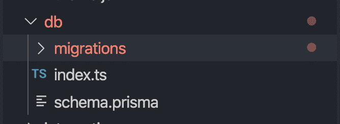
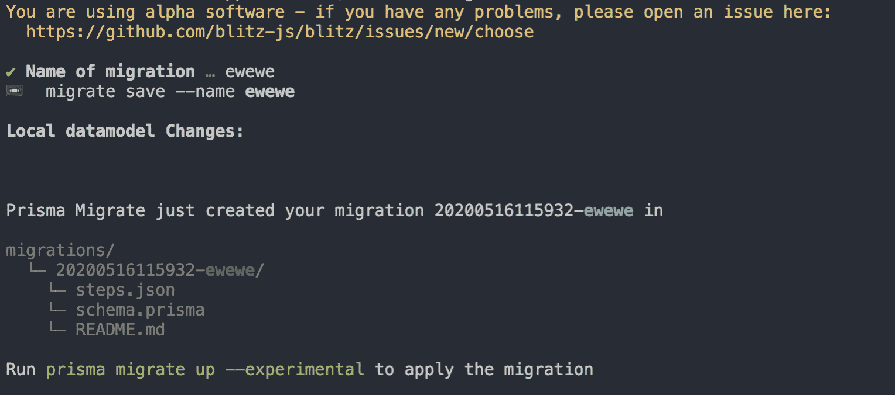
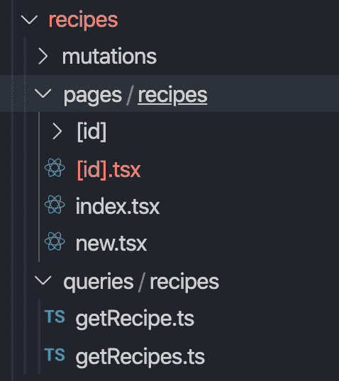
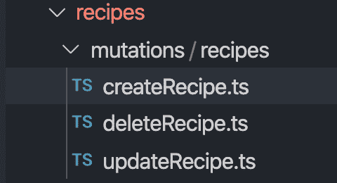

# 用 Blitz.js 构建全栈 React 应用

> 原文：<https://blog.logrocket.com/building-a-fullstack-react-application-with-blitz-js/>

## Blitz.js 是什么？

Blitzjs 是一个类似 Rails 的框架，用于构建 fullstack React 应用程序。基本上，它帮助你以一种简单有效的方式开发一个整体应用程序。Blitz.js 构建在 Next.js 之上。

### 为什么我们需要 Blitz.js

有时你可能需要在短时间内构建一个产品或[最小可行产品(MVP)](https://blog.logrocket.com/product-management/what-is-minimum-viable-product-mvp-how-to-define/) 。你可能最终会写一个重复的 CRUD API，一遍又一遍地设置后端和前端。

嗯，Blitz.js 会帮你避开那些痛点。它可以帮助你尽快建造一个整体或者 MVP。我感觉 Blitz.js 在那种情况下赢了。

是时候看看它的实际效果了。

注:如果你想了解 blitzjs 的概念或简介，请查看这篇文章。

### Blitz 安装和设置

```
$ npm install -g blitz
```

```
$ blitz new recipe-app
```

上面的命令安装 Blitz 并用 scaffold 代码引导应用程序。我们的应用程序目录将如下所示:

```
mysite
├── app
│   ├── components
│   │   └── ErrorBoundary.tsx
│   ├── layouts
│   └── pages
│       ├── _app.tsx
│       ├── _document.tsx
│       └── index.tsx
├── db
│   ├── migrations
│   ├── index.ts
│   └── schema.prisma
├── integrations
├── jobs
├── node_modules
├── public
│   ├── favicon.ico
│   └── logo.png
├── utils
├── .babelrc.js
├── .env
├── .eslintrc.js
├── .gitignore
├── .npmrc
├── .prettierignore
├── README.md
├── blitz.config.js
├── package.json
├── tsconfig.json
└── yarn.lock
```

要了解更多关于基础教程的内容，请查看官方文档。

好了，脚手架代码够了。在本教程中，我们将构建什么？好吧，让我给你演示一下。

### 演示


在这里，我们将构建一个简单的食谱应用程序，解释 Blitz.js 中的大多数概念。

在上面的例子中，我们有一个食谱列表和一个向列表添加食谱的表单。都是菜谱模式的问题。

让我们在生成代码之前为我们的应用程序建立一个数据库。我们将使用 Postgres 作为这个应用程序的数据库。Blitz.js 明确使用 Prisma 来管理我们应用程序的数据库。

### 为什么是 Prisma？

Prisma 帮助您从业务模型中生成数据库表。它还可以从模型中提供 GraphQL 模式。因此，很容易从域模型创建数据库表或 GraphQL。

### 数据库设置



在`schema.prisma`中添加以下代码:

```
datasource postgresql {
  provider = "postgres"
  url      = "postgresql://postgres:[email protected]:5432/docapp"
}
generator client {
  provider = "prisma-client-js"
}
model Recipe {
  id          Int      @default(autoincrement()) @id
  name        String
  imageUrl    String
  description String
  likes       Int
  addedAt     DateTime @default(now())
}
```

Datasource 定义了我们正在使用的数据库。这里，我们使用 Postgres 作为我们的数据源。

之后，我们将基于业务领域模型定义一个模型。这类似于我们设计数据库的方式。大多数时候，我们需要在创建数据库和表之前定义应用程序的模型。

这里，我们有一个包含数据库中所有字段的配方模型。一旦我们定义了模式，我们需要将它迁移到我们的 Postgres 数据库中。

Blitz 使用以下命令帮助我们做到这一点:

```
blitz db migrate
```



现在，我们需要为食谱创建所有的查询和变化。我们不需要手动为食谱创建查询和变化。Blitz 会为我们生成脚手架代码。

```
blitz generate all recipe
```

它将为我们的 recipes 域创建目录和文件。



*   **pages/recipes/index . tsx**–包含配方列表的业务逻辑
*   **pages/recipes/new . tsx**–包含添加新配方的功能
*   **页数/配方/[id]。tsx**–包含与我们在路线中传递的 id 相关的特定配方细节
*   **pages/recipe/[id]/edit . tsx**–包含根据 id 更新特定配方的逻辑

### 配方列表组件

在`page/recipe/index.tsx`中添加以下代码:

```
import { Suspense, Fragment, useState, useEffect } from "react"
import { Head, Link, useQuery } from "blitz"
import { Flex, Button, Box, Spinner } from "@chakra-ui/core"
import getRecipes from "app/recipes/queries/recipes/getRecipes"
import updateRecipe from "app/recipes/mutations/recipes/updateRecipe"
import RecipeItem from "app/components/RecipeItem"

const [recipesState, setRecipeState] = useState([])
  const [recipes] = useQuery(getRecipes)
  useEffect(() => {
    if (recipes.length > 0) {
      setRecipeState(recipes)
    }
  }, [recipes])

export const RecipesList = () => {
  return (
    <Fragment>
      {recipesState.map((recipe) => (
        <RecipeItem
          id={recipe.id}
          title={recipe.name}
          imageUrl={recipe.imageUrl}
          description={recipe.description}
          likes={recipe.likes}
          onLike={async (id, likes) => {
            //on recipe like logic comes here
          }}
        />
      ))}
    </Fragment>
  )
}
const RecipesPage = () => {
  return (
    <Flex flexDirection="column" bg="background" w="100vw" h="100vh">
      <Box marginLeft="auto" marginRight="30px">
        <p>
          <Link href="/recipes/new">
            <Button variantColor="blue" variant="outline" cursor="pointer">
              Create Recipe
            </Button>
          </Link>
        </p>
      </Box>
      <Flex p={8} flexWrap="wrap">
        <Suspense fallback={<Spinner size="xl" margin="auto" />}>
          <RecipesList />
        </Suspense>
      </Flex>
    </Flex>
  )
}
export default RecipesPage
```

这里，我们使用`useQuery` React 钩子从数据库获取数据，并使用`useState`设置数据状态:

```
import { Head, Link, useQuery } from "blitz"
import getRecipes from "app/recipes/queries/recipes/getRecipes"

const [recipes] = useQuery(getRecipes)
```

基本上，我们从 Prisma 客户端获取数据，Prisma 客户端与 Postgres 数据库连接并向我们提供数据。

如果您看到`pages/recipes/queries/recipes/getRecipes.ts`中的代码，您可以看到获取数据的查询:

```
import db, { FindManyRecipeArgs } from "db"
export default async function getRecipes(args: FindManyRecipeArgs) {
  const recipes = await db.recipe.findMany(args)
  return recipes
}
```

一旦我们获得了数据，我们就在应用程序中呈现它，就像在 React 应用程序中一样。在 list 组件中，我们有一个按钮，它路由到 create recipe 组件:

```
<Link href="/recipes/new">
  <Button variantColor="blue" variant="outline" cursor="pointer">
      Create Recipe
  </Button>
</Link>
```

### 创建配方

在`pages/recipes/new.tsx`中添加以下代码:

```
import { Head, Link, useRouter } from "blitz"
import { useState } from "react"
import createRecipe from "app/recipes/mutations/recipes/createRecipe"
import {
  FormControl,
  FormLabel,
  FormErrorMessage,
  Button,
  Input,
  Box,
  Stack,
  Image,
  Text,
  Spinner,
  Flex,
} from "@chakra-ui/core"
import { Field, Formik, Form } from "formik"
const NewRecipePage = () => {
  const router = useRouter()
  const [state, setState] = useState({
    name: "",
    description: "",
    imageUrl: "",
    uploadingState: "NONE",
  })
  const validationName = (value) => {
    let error
    // if (!value) {
    //   error = "Name is required"
    // }
    return error
  }
  const validateDescription = (value) => {
    let error
    // if (!value) {
    //   error = "Description is required"
    // }
    return error
  }
  const uploadFile = async (e) => {
    console.log("Uploading....")
    setState({ ...state, uploadingState: "UPLOADING" })
    const files = e.target.files
    const data = new FormData()
    data.append("file", files[0])
    data.append("upload_preset", "qy3oxqkx")
    const res = await fetch("https://api.cloudinary.com/v1_1/ganeshimaginary/image/upload", {
      method: "POST",
      body: data,
    })
    const file = await res.json()
    setState({ ...state, imageUrl: file.secure_url, uploadingState: "UPLOADED" })
  }
  const onChange = (e) => {
    setState({ ...state, [e.target.name]: e.target.value })
  }
  return (
    <Flex flexDirection="column" bg="background" w="100vw" h="100vh">
      <Box marginLeft="auto" marginRight="30px">
        <p>
          <Link href="/recipes">
            <Button variantColor="blue" variant="outline" cursor="pointer">
              Back
            </Button>
          </Link>
        </p>
      </Box>
      <Box
        rounded="lg"
        maxW="sm"
        margin="auto"
        display="flex"
        justifyContent={"center"}
        alignItems={"center"}
        height="100%"
      >
        <Formik
          initialValues={{ name: "", description: "", imageUrl: "" }}
          onSubmit={async (values, actions) => {
            await createRecipe({
              data: {
                name: state.name,
                description: state.description,
                imageUrl: state.imageUrl,
                likes: 0,
              },
            })
            router.push("/recipes")
          }}
        >
          {(props) => (
            <Form style={{ backgroundColor: "white", padding: "20px", borderRadius: "8px" }}>
              <Field name="name" validate={validationName}>
                {({ field, form }) => (
                  <FormControl isInvalid={props.errors.name && props.touched.name}>
                    <FormLabel htmlFor="name">Recipe Name</FormLabel>
                    <Input
                      {...field}
                      id="name"
                      placeholder="Enter Recipe name"
                      value={state.name}
                      onChange={onChange}
                      boxSizing="border-box"
                    />
                    <FormErrorMessage> {props.errors.name}</FormErrorMessage>
                  </FormControl>
                )}
              </Field>
              <Field name="description" validate={validateDescription}>
                {({ field, form }) => (
                  <FormControl isInvalid={props.errors.description && props.touched.description}>
                    <FormLabel htmlFor="description">Description</FormLabel>
                    <Input
                      {...field}
                      id="description"
                      value={state.description}
                      placeholder="Enter Description"
                      onChange={onChange}
                      boxSizing="border-box"
                    />
                    <FormErrorMessage>{props.errors.description}</FormErrorMessage>
                  </FormControl>
                )}
              </Field>
              <FormControl>
                <FormLabel>Upload Images</FormLabel>
                <Input type="file" name="file" onChange={uploadFile} boxSizing="border-box" />
                <Stack isInline>
                  {state.uploadingState === "NONE" ? (
                    <Text>Waiting to upload</Text>
                  ) : state.uploadingState === "UPLOADING" ? (
                    <Spinner />
                  ) : (
                    <Image size="100px" objectFit="cover" src={state.imageUrl} alt="recipe" />
                  )}
                </Stack>
              </FormControl>
              <Button
                mt={4}
                variantColor={"teal"}
                boxSizing="border-box"
                isLoading={props.isSubmitting}
                type="submit"
              >
                Submit
              </Button>
            </Form>
          )}
        </Formik>
      </Box>
    </Flex>
  )
}
export default NewRecipePage
```

这个组件中使用了很多包。让我们逐一分解一下:

*   [Charka UI](https://chakra-ui.com/)–Chakra 是专为 React 打造的设计系统。它为我们提供了 React 组件的基本组件，如 Box、Input、Modal 等。
*   [Formik](https://jaredpalmer.com/formik/)–Formik 使 React 应用程序中的表单验证和功能更加简单。
*   [Blitz](https://github.com/blitz-js/blitz)–就像我们之前讨论过的，我们在这里对所有操作都使用 Blitz。

主要是，我们这里有一个表格。提交后，我们将数据存储在 Postgres 数据库中，并发送回我们的食谱列表。

这里我们需要注意的一点是 Blitz.js 如何调用 API 和存储数据。一旦用户提交表单，我们调用`createRecipe`函数:

```
await createRecipe({
              data: {
                name: state.name,
                description: state.description,
                imageUrl: state.imageUrl,
                likes: 0,
              },
})
```

`createRecipe`功能将在`mutations/recipes/createRecipe.ts`内:

```
import db, {RecipeCreateArgs} from 'db'
export default async function createRecipe(args: RecipeCreateArgs) {
  const recipe = await db.recipe.create(args)
  return recipe
}
```

如果我们愿意，我们可以改变功能。它在数据库中创建数据并返回它。此外，闪电战为你创造了`delete`和`update`突变。



完成所有功能后，可以使用以下命令运行应用程序:

```
blitz start
```

或者这个命令:

```
npm run start
```

### 部署

要部署您的应用程序，您可以用部署 React 或 Nextj.s 应用程序的相同方式来构建和部署您的应用程序:

```
npm run deploy
```

## 结论

总之，Blitz.js 有助于在短时间内使用所有 codegen 和命令构建 fullstack 应用程序。我个人的观点是，如果你打算在应用程序中使用 Next.js，使用 Blitz.js 是有帮助的。

点击查看完整源代码[。](https://github.com/ganeshmani/recipe-app-blitzjs)

## 使用 LogRocket 消除传统反应错误报告的噪音

[LogRocket](https://lp.logrocket.com/blg/react-signup-issue-free)

是一款 React analytics 解决方案，可保护您免受数百个误报错误警报的影响，只针对少数真正重要的项目。LogRocket 告诉您 React 应用程序中实际影响用户的最具影响力的 bug 和 UX 问题。

[ ](https://lp.logrocket.com/blg/react-signup-general) [  ](https://lp.logrocket.com/blg/react-signup-general) [LogRocket](https://lp.logrocket.com/blg/react-signup-issue-free)

自动聚合客户端错误、反应错误边界、还原状态、缓慢的组件加载时间、JS 异常、前端性能指标和用户交互。然后，LogRocket 使用机器学习来通知您影响大多数用户的最具影响力的问题，并提供您修复它所需的上下文。

关注重要的 React bug—[今天就试试 LogRocket】。](https://lp.logrocket.com/blg/react-signup-issue-free)