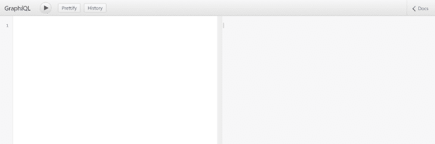
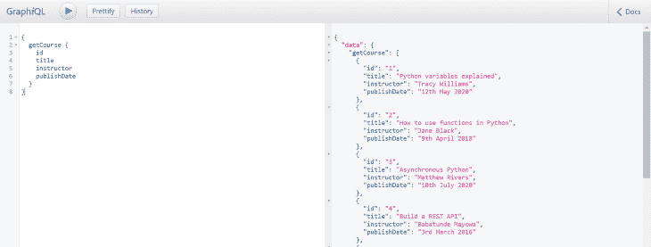

# 用 FastAPI 构建 GraphQL 服务器

> 原文：<https://blog.logrocket.com/building-a-graphql-server-with-fastapi/>

FastAPI 是一个用 Python 构建 web APIs 的高性能框架。它简单直观的本质使得使用很少的样板代码快速开发健壮的 web APIs 变得很容易。在本文中，我们将介绍 FastAPI 以及如何用它来设置 GraphQL 服务器。

从[官方文档](https://fastapi.tiangolo.com/)来看，使用 FastAPI 构建 web 应用程序减少了大约 40%的开发人员引起的错误，这是通过使用 Python 3.6 类型声明实现的。凭借其所有特性，包括交互式 API 文档的[自动生成](https://fastapi.tiangolo.com/tutorial/path-params/?h=+documenta#documentation)，用 Python 构建 web 应用程序从未如此简单。

## 设置我们的应用程序

在我们开始之前，让我们通过在我们的终端上运行以下命令来确认我们已经安装了 Python 3.6+:

```
python --version

```

如果这返回一个错误，[点击这里](https://www.python.org/downloads/)下载 Python 并安装在您的本地机器上。Python 3.4+安装默认带有 pip，但是，我们需要 Python 3.6+才能运行 FastAPI。Pip 是首选的 Python 包管理器，我们将使用它来安装 FasAPI 应用程序的支持模块。

安装 Python 和 pip 后，让我们在终端上运行以下命令，将 FastAPI 添加到我们的机器中:

```
pip install fastapi

```

我们还需要 Uvicorn，一个 ASGI(异步服务器网关接口)服务器来服务我们的应用程序。让我们在终端上运行以下命令来安装它:

```
pip install uvicorn

```

完成后，我们可以继续为我们的应用程序创建一个新目录。姑且称之为`fastapi-graphql`。在我们的新目录中，我们将创建一个名为`main.py`的新文件。这将是我们服务器的索引文件。

## GraphQL 基础:查询和模式

### 你想要什么

在 GraphQL 中，[查询](https://blog.logrocket.com/graphql-queries-in-simple-terms/)用于获取数据，就像 REST API 架构中的 GET 请求一样。然而，使用 GraphQL 查询，我们可以选择请求我们想要的东西。例如，让我们假设我们有一个教育课程的 API。对我们的 API 的查询如下所示:

```
{
  getCourse {
    id
    title
    instructor
    publishDate
  }
}

```

当我们发送这个查询时，我们应该收到一个响应，其中包含来自我们的 API 的课程及其属性，按以下顺序排列:`id`、`title`、`instructor`和`publishDate`:

```
{
  "data": {
    "getCourse": [
      {
        "id": "1",
        "title": "Python variables explained",
        "instructor": "Tracy Williams",
        "publishDate": "12th May 2020"
      },
      {
        "id": "2",
        "title": "How to use functions in Python",
        "instructor": "Jane Black",
        "publishDate": "9th April 2018"
      }
    ]
  }
}

```

可选地，我们可以要求我们的 API 返回一个课程列表，但是这次只使用`title`属性:

```
{
  getCourse {
    title
  }
}

```

我们应该得到类似这样的响应:

```
{
  "data": {
    "getCourse": [
      {
        "title": "Python variables explained"
      },
      {
        "title": "How to use functions in Python"
      }
    ]
  }
}

```

这种灵活性是用 GraphQL 构建的应用程序具有高度可扩展性的原因之一，它是通过 GraphQL 中的类型声明实现的。

### GraphQL 模式

[模式](https://blog.logrocket.com/speeding-up-changes-to-the-graphql-schema/)描述了我们的 GraphQL 服务，它包含什么数据，以及数据的格式。从我们的查询中，我们已经看到，我们可以指定哪些数据将被发送给我们，以及我们希望这些数据如何呈现。这是因为我们的 GraphQL API 已经包含了所有数据的模式，该模式包含了所有可用的字段、子字段及其数据类型。

为了演示这一点，我们将在根目录中创建一个`schemas.py`文件，我们将使用它来存放所有的数据字段。先说课程类型。这应该包含特定课程的所有信息，从我们上面的示例查询来看，一门课程包括字段`id`、`title`、`instructor`和`publish_date`。我们将继续更新我们的`schemas.py`文件，如下所示:

```
from graphene import String, ObjectType

class CourseType(ObjectType):
  id = String(required=True)
  title = String(required=True)
  instructor = String(required=True)
  publish_date = String()

```

在我们的`schemas.py`文件中，我们从从`graphene`导入类型`String`和`ObjectType`开始。Graphene 是一个用于构建 GraphQL 模式和类型的 Python 库。让我们在终端上运行以下命令来安装它:

```
pip install graphene

```

在我们成功地从`graphene`导入了`String`和`ObjectType`之后，我们继续用括号中的导入的`ObjectType`定义了一个类`CourseType`。我们将几乎所有的 GraphQL 类型都声明为对象类型。

我们做的下一件事是为我们的`CourseType`创建不同的字段，并且我们为每个字段使用了`String`类型。来自`graphene`的一些其他类型包括`Int`、`Enum`、`Date`、`List`和`Boolean`。

注意，我们还在`String`类型中为`id`、`title`和`instructor`添加了一个`required`参数。这意味着如果不包含这些字段，我们将无法向我们的 GraphQL 服务添加课程，尽管我们在进行查询时仍然可以排除它们中的任何一个。

## 设置临时数据库

现在我们有了模式，我们还需要一个存储和检索课程数据的地方。对于这个演示，我们将使用一个 JSON 数据库。然而，FastAPI 既支持[关系数据库](https://fastapi.tiangolo.com/tutorial/sql-databases/?h=+databases)也支持[非关系数据库](https://fastapi.tiangolo.com/advanced/nosql-databases/?h=+databases)，如 PostgreSQL、MySQL、MongoDB、ElasticSearch 等。

让我们在根目录中创建一个`courses.json`文件，并将下面的代码块粘贴到其中:

```
[
  {
    "id": "1",
    "title": "Python variables explained",
    "instructor": "Tracy Williams",
    "publish_date": "12th May 2020"
  },
  {
    "id": "2",
    "title": "How to use functions in Python",
    "instructor": "Jane Black",
    "publish_date": "9th April 2018"
  },
  {
    "id": "3",
    "title": "Asynchronous Python",
    "instructor": "Matthew Rivers",
    "publish_date": "10th July 2020"
  },
  {
    "id": "4",
    "title": "Build a REST API",
    "instructor": "Babatunde Mayowa",
    "publish_date": "3rd March 2016"
  }
]

```

我们将能够使用我们的 GraphQL API 来修改和检索这个文件中的数据。

## 创建我们的查询解析器

解析器是我们的 GraphQL 服务用来与我们的模式和数据源进行交互的。为了创建用于获取课程的查询解析器，我们将从在我们的`main.py`文件中导入`fastapi`开始:

```
from fastapi import FastAPI

```

接下来，让我们导入我们将在查询解析器中使用的相关类型，就像我们在`schemas.py`文件中所做的那样:

```
...
from graphene import ObjectType, List, String, Schema

```

注意，我们添加了两个新类型:`List`，我们将把它用作`CourseType`的包装器；和`Schema`，我们将使用它来执行操作。

我们还将从`graphql.execution.executors.asyncio`导入`AsyncioExecutor`，这将使我们能够在我们的 GraphQL 服务中进行异步调用；`GraphQLApp`出自`starlette.graphql`；我们`schemas.py`文件中的`CourseType`:

```
...
from graphql.execution.executors.asyncio import AsyncioExecutor
from starlette.graphql import GraphQLApp
from schemas import CourseType

```

最后，让我们导入内置的`json`包来处理我们的`courses.json`文件:

```
...
import json

```

我们的最终导入块应该如下所示:

```
from fastapi import FastAPI
from graphene import ObjectType, List, String, Schema
from graphql.execution.executors.asyncio import AsyncioExecutor
from starlette.graphql import GraphQLApp
from schemas import CourseType
import json

```

接下来，让我们通过将以下代码块添加到我们的`main.py`文件来创建我们的查询:

```
...
class Query(ObjectType):
  course_list = None
  get_course = List(CourseType)
  async def resolve_get_course(self, info):
    with open("./courses.json") as courses:
      course_list = json.load(courses)
    return course_list

```

在上面的块中，我们从从对象类型创建一个类`Query`开始，然后我们在`line 3`上初始化我们的`course_list`变量。这是我们存储课程数据的地方。

由于我们将在一个列表中返回不同的课程对象，我们使用从`graphene`导入的`List`类型来包装我们的`CourseType`，然后将它赋给`line 4`上的`get_course`变量。这将是我们查询的名称。

需要注意的是，当在 GraphQL 客户端中进行查询时，我们需要以 camel case 的形式提供名称，即`getCourse`而不是`get_course`。

接下来，我们在`line 5`上为`get_course`查询创建了一个解析器方法。解析器方法的名称应该以前缀`resolve`开头，后面跟着查询名称——在本例中是`get_course`——然后用下划线隔开。

resolver 方法还需要两个位置参数，这已经包含在方法定义中了。在`lines` `6-8`上，我们从我们的`courses.json`文件中加载数据，将其分配给`course_list`，然后返回变量。

## 启动基于 FastAPI 的 GraphQL 服务器

现在我们已经创建了 GraphQL 查询，让我们初始化 FastAPI 并将 GraphQL 服务分配给索引路由。

```
...
app = FastAPI()
app.add_route("/", GraphQLApp(
  schema=Schema(query=Query),
  executor_class=AsyncioExecutor)
)

```

接下来，让我们在终端上运行以下命令来启动 FastAPI 应用程序:

```
uvicorn main:app --reload 
```

我们应该会得到类似这样的成功消息:

```
Uvicorn running on http://127.0.0.1:8000 (Press CTRL+C to quit)
Started reloader process
Started server process
Waiting for application startup.
Application startup complete.

```

我们可以通过导航到`[http://127.0.0.1:8000](http://127.0.0.1:8000)`来测试我们的 GraphQL 服务器。我们应该会看到这样一个页面:



让我们将以下查询粘贴到左侧窗格中，并通过单击 run 按钮进行 API 调用:

```
{
  getCourse {
    id
    title
    instructor
    publishDate
  }
}

```

我们应该得到类似这样的响应:



## 仅获取一门课程

让我们探索一下如何通过查询来获取一门课程的数据。我们将添加一个`id`参数到我们的查询中，让我们的 GraphQL 服务器知道我们只需要匹配那个`id`的课程。为了实现这一点，让我们用下面的代码替换我们的`Query`类:

```
class Query(ObjectType):
  course_list = None
  get_course = Field(List(CourseType), id=String())
  async def resolve_get_course(self, info, id=None):
    with open("./courses.json") as courses:
      course_list = json.load(courses)
    if (id):
      for course in course_list:
        if course['id'] == id: return [course]
    return course_list

```

在新的`Query`类的`line 3`上，我们将`get_course`的值包装在一个`Field`类型中，这允许我们添加查询参数。这里，我们添加了一个类型为`String`的`id`参数。我们还在`resolve_get_course()`方法中包含了`id`参数，并给了它一个默认值`None`，使它成为可选的。

在`lines` `7-9`上，我们添加了一个条件，如果提供的话，它将只返回与`id`匹配的课程。在我们继续之前，我们还需要将`Field`型添加到我们的`graphene`进口中:

```
from graphene import ObjectType, List, String, Schema, Field

```

现在，我们可以通过以下查询只获取一个与`id`匹配的课程:

```
{
  getCourse(id: "2") {
    id
    title
    instructor
    publishDate
        }
}

```

我们应该得到这样的回应:

```
{
  "data": {
    "getCourse": [
      {
        "id": "2",
        "title": "How to use functions in Python",
        "instructor": "Jane Black",
        "publishDate": "9th April 2018"
      }
    ]
  }
}

```

## GraphQL 突变

我们已经看到了如何用 FastAPI 设置我们的 GraphQL 服务器并从中获取数据。现在，让我们看看如何使用 GraphQL 变体向我们的数据存储添加新的课程或更新现有的课程。让我们从将`Mutation`类型添加到我们的`graphene`导入开始:

```
from graphene import ObjectType, List, String, Schema, Field, Mutation

```

现在我们可以从`Mutation`类型创建一个名为`CreateCourse`的类:

```
class CreateCourse(Mutation):
  course = Field(CourseType)

  class Arguments:
    id = String(required=True)
    title = String(required=True)
    instructor = String(required=True)

```

在我们的`CreateCourse`类中，我们开始为我们的课程创建一个变量，我们将它包装在`Field`类中。这是我们将在成功创建课程后返回给用户的内容。

然后我们继续为我们的突变参数创建一个类。我们这里的论点是`id`、`title`和`instructor`。我们需要在进行`CreateCourse`突变时提供这些信息。

接下来，我们需要一个`mutate`方法来创建课程。在这里，我们将使用用户提供的参数在我们的数据存储中创建新的课程。在这种情况下，我们将改变我们的`courses.json`文件。然而，在生产应用程序中，您可能需要一个数据库，正如前面提到的，FastAPI 支持关系和非关系数据库。

让我们创建我们的`mutate`方法。注意，它必须被命名为`mutate`，因为这是我们的 GraphQL 服务所期望的:

```
class CreateCourse(Mutation):
  ...
  async def mutate(self, info, id, title, instructor):
    with open("./courses.json", "r+") as courses:
      course_list = json.load(courses)
      course_list.append({"id": id, "title": title, "instructor": instructor})
      courses.seek(0)
      json.dump(course_list, courses, indent=2)
    return CreateCourse(course=course_list[-1])

```

在我们的`mutate`方法的 return 语句中，我们调用了`CreateCourse`类，并用括号将新创建的课程赋给我们之前声明的`course`变量。这是我们的 GraphQL API 将作为对突变请求的响应返回给用户的内容。

* * *

### 更多来自 LogRocket 的精彩文章:

* * *

现在我们有了自己的`CreateCourse`类，让我们从`ObjectType`创建一个名为`Mutation`的新类。我们会把所有的突变储存在这里:

```
class Mutation(ObjectType):
  create_course = CreateCourse.Field()

```

完成后，我们可以将我们的`Mutation`类添加到我们的`app.add_route()`函数调用中的`Schema`:

```
app.add_route("/", GraphQLApp(
  schema=Schema(query=Query, mutation=Mutation),
  executor_class=AsyncioExecutor)
)

```

我们现在可以通过在 GraphQL 客户机中运行以下查询来测试这一点:

```
mutation {
  createCourse(
    id: "11" 
    title: "Python Lists" 
    instructor: "Jane Melody"
  ) {
    course {
      id
      title
      instructor
    }
  }
} 

```

我们应该得到这样的回应:

```
{
  "data": {
    "createCourse": {
      "course": {
        "id": "11",
        "title": "Python Lists",
        "instructor": "Jane Melody"
      }
    }
  }
}

```

## 处理请求错误

让我们看看如何通过为预先存在的 id 添加验证来处理应用程序中的错误。如果一个用户试图用一个已经存在于我们的数据存储中的 ID 创建一个课程，我们的 GraphQL 服务器应该用错误消息来响应:`Course with provided id already exists!`

就在我们将新课程添加到数据存储区的`CreateCourse` mutate 函数之前，让我们粘贴以下代码:

```
...
for course in course_list:
  if course['id'] == id:
    raise Exception('Course with provided id already exists!')

```

上面，我们遍历了我们的数据存储库`course_list`，并检查是否有一个现有的球场与即将到来的球场具有相同的`id`。如果我们有一个匹配，那么应该抛出一个异常。

根据我们为应用程序选择的数据库和 [ORM](https://fastapi.tiangolo.com/tutorial/sql-databases/?h=+orm#orms) ，检查是否有预先存在的值的过程可能会有所不同。但是，当出现异常时，GraphQL 总是会返回一个错误。随着代码的新变化，我们的`CreateCourse`变异类应该是这样的:

```
class CreateCourse(Mutation):
  course = Field(CourseType)

  class Arguments:
    id = String(required=True)
    title = String(required=True)
    instructor = String(required=True)
    publish_date = String()

  async def mutate(self, info, id, title, instructor):
    with open("./courses.json", "r+") as courses:
      course_list = json.load(courses)

      for course in course_list:
        if course['id'] == id:
          raise Exception('Course with provided id already exists!')

      course_list.append({"id": id, "title": title, "instructor": instructor})
      courses.seek(0)
      json.dump(course_list, courses, indent=2)
    return CreateCourse(course=course_list[-1])

```

现在，我们可以通过尝试使用预先存在的`id`创建一个新课程来测试这一点。让我们在 GraphQL 客户端中运行最后一个`CreateCourse`请求的精确变异:

```
mutation {
  createCourse(
    id: "11" 
    title: "Python Lists" 
    instructor: "Jane Melody"
  ) {
    course {
      id
      title
      instructor
    }
  }
}

```

我们应该得到这样的回应:

```
{
  "data": {
    "createCourse": null
  },
  "errors": [
    {
      "message": "Course with provided id already exists!",
      "locations": [
        {
          "line": 2,
          "column": 3
        }
      ],
      "path": [
        "createCourse"
      ]
    }
  ]
}

```

## 结论

在本文中，我们学习了 FastAPI 的基础知识，以及如何使用它来设置 GraphQL 服务器。这两种技术的结合给 web 开发带来了真正激动人心的体验。

使用 GraphQL，我们能够使复杂的查询相对容易编写，同时让 web 客户端能够准确地询问他们想要的内容。使用 FastAPI，我们可以用很少的样板代码构建健壮、高性能的 GraphQL 服务器。

这里有一个[链接](https://github.com/ebenezerdon/fastapi-graphql)到我们演示课程的回购，如果你需要任何帮助，请随时在 [LinkedIn](https://www.linkedin.com/in/ebenezerdon/) 上联系我。

## 监控生产中失败和缓慢的 GraphQL 请求

虽然 GraphQL 有一些调试请求和响应的特性，但确保 GraphQL 可靠地为您的生产应用程序提供资源是一件比较困难的事情。如果您对确保对后端或第三方服务的网络请求成功感兴趣，

[try LogRocket](https://lp.logrocket.com/blg/graphql-signup)

.

[](https://lp.logrocket.com/blg/graphql-signup)[https://logrocket.com/signup/](https://lp.logrocket.com/blg/graphql-signup)

LogRocket 就像是网络和移动应用的 DVR，记录下你网站上发生的每一件事。您可以汇总并报告有问题的 GraphQL 请求，以快速了解根本原因，而不是猜测问题发生的原因。此外，您可以跟踪 Apollo 客户机状态并检查 GraphQL 查询的键值对。

LogRocket 检测您的应用程序以记录基线性能计时，如页面加载时间、到达第一个字节的时间、慢速网络请求，还记录 Redux、NgRx 和 Vuex 操作/状态。

[Start monitoring for free](https://lp.logrocket.com/blg/graphql-signup)

.