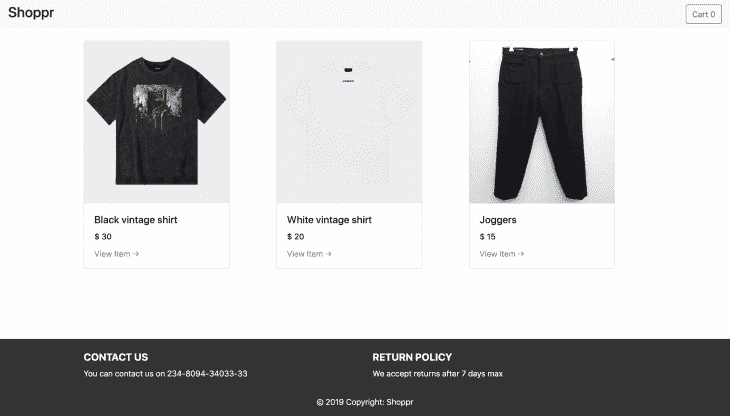
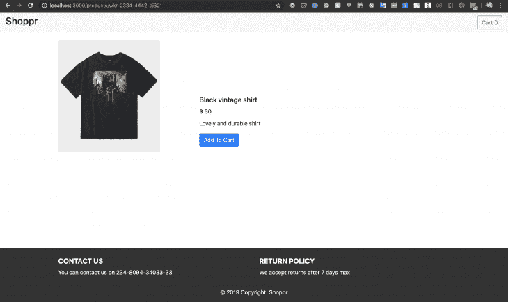
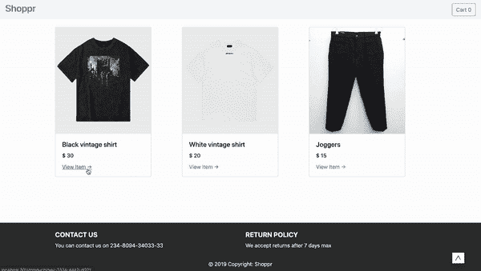
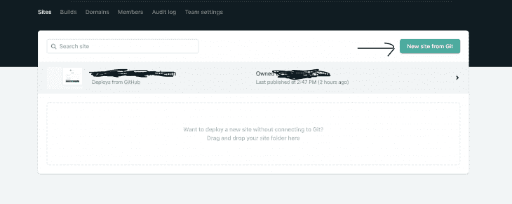
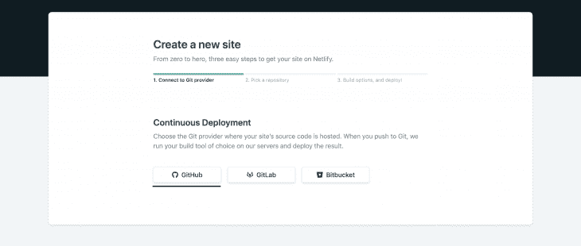
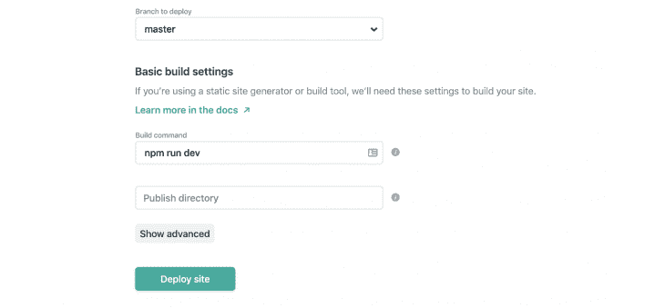
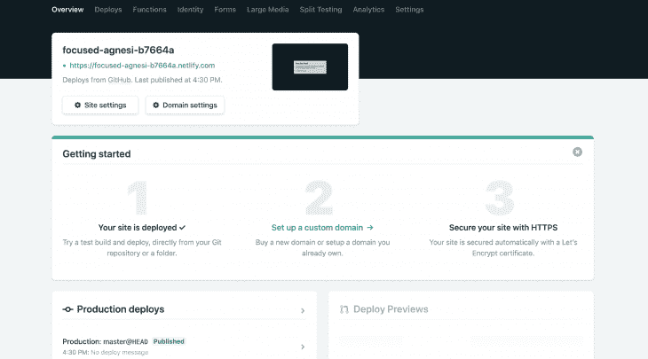

# 建立一个 JAMstack 电子商务网站

> 原文：<https://blog.logrocket.com/building-a-jamstack-e-commerce-website/>

JAMstack 已经成为热门词汇有一段时间了。在在线论坛和聊天频道中，你会经常看到类似的问题:

背后的理念是什么？果酱是由什么组成的？为什么有用？是针对某些框架的吗？怎样才能建立一个 JAMstack 网站？

我们将在本教程中回答这些问题。我们还将通过应用在 Next.js 框架中学到的技术来构建一个电子商务网站。

> 注意，要遵循本教程，您需要对 React 和 Node.js 有基本的了解。请确保在开始之前您已经安装了 Node 和 npm/yarn。

## 什么是 JAMstack？

JAMstack 是一种用于构建 web 应用程序的现代架构模式。JAM 代表 Javascript、API 和标记。它基于将前端表示层从任何动态功能中分离出来的思想。

有了 JAMstack，你就可以发布所有的网页表示标记，这样用户在站点加载后就可以立即看到信息。

然后使用 Javascript 动态地为应用程序添加功能——通常是通过 API。

使用 JAMstack 节省了开发人员的时间和精力，因为它不需要设置服务器或后端。

借助 Firebase、8base 和 Amazon Lambda 等支持前端框架连接的无服务器平台和 API，开发人员现在可以利用这些平台和其他可重用的 API 将后端、数据存储和处理、身份验证以及其他动态功能添加到他们的应用程序中。

## 为什么使用 JAMstack？

使用 JAMstack 有很多好处。实施后，它可以节省您的时间和管理费用。

使用 JAMstack，您可以:

### 更好的性能

通常，使用 JAMstack，预构建的标记和资产通过 CDN 提供。这意味着一旦您的代码被部署，CDN 就会得到更新。这保证了更快的加载速度，因为没有什么比通过 CDN 提供的预建文件更好的了。

### 更高的安全性

从技术上来说——因为没有数据库——它不可能被黑客入侵。JAMstack 消除了担心服务器或数据库漏洞的需要。您还可以利用专业第三方服务的领域专业知识。

### 更便宜、更容易扩展

静态文件的托管很便宜甚至免费。由于您的文件可以通过 CDN 在任何地方提供，因此扩展就是在更多地方提供这些文件。CDN 提供商将扩大规模，以应对其接收的流量。

### 更好的开发者体验

开发人员可以专注于适合他们技能的应用程序部分，而不必处理设置其他任何东西。它允许更有针对性的开发和调试，网站生成器的 CMS 选项的扩展消除了为内容和营销维护单独堆栈的需要。

## 构建 JAMstack 应用程序

随着时间的推移，许多开源静态网站生成器已经可用:GatsbyJS、Hugo、Nuxt.js、Next.js、Jekyll、Hexo、VuePress 等，所有这些都可以用于生成预构建的标记，这些标记可以作为静态 HTML 文件服务于您的网站。

大多数时候，内容是通过静态(最好是降价)文件或内容 API 来管理的。

我们将使用 Next.js 构建一个 JAMstack 网站来说明上面的一些观点。

Next.js 是由 [Zeit](https://zeit.co/) 搭建的 React 框架，根据[nextjs.org](https://nextjs.org/)的说法:

> 使用 Next.js，您可以使用 React 构建服务器端呈现和静态 web 应用程序。完全不需要用 webpack 或任何类似的东西进行任何配置。只需安装它并开始构建。

以下是 Next.js 带来的其他一些很酷的功能:

*   直观的基于页面的路由系统(支持动态路由)
*   尽可能自动静态优化页面
*   服务器端呈现具有分块数据要求的页面
*   自动代码分割加快页面加载速度
*   具有优化页面预取的客户端路由
*   API routes 使用无服务器功能构建您的 API，使用与页面相同的简单路由器

## 入门指南

首先，通过运行以下命令创建一个示例项目:

```
mkdir nextjs-shopping-cart
cd nextjs-shopping-cart
npm init -y
npm install --save react react-dom next
```

我们需要添加命令来启动 Next.js。打开您的`package.json`,用以下代码更新脚本对象:

```
// ./package.json
"scripts": {
    "dev"  : "next",
    "build": "next build",
    "start": "next start"
}
```

我们将从创建基础组件开始，这些组件是让我们的网站看起来更好的必要元素。

在应用程序的根目录下，用以下文件创建一个组件文件夹:

```
// components/Navbar.js
const Navbar = (props) => {
  return (
    <nav className="navbar navbar-light bg-light">
      <h3>Shoppr</h3>
        <a className="btn btn-outline-success my-2 my-sm-0">Cart</a>
    </nav>
  );
};
```

```
// components/Footer.js
const Footer = () => {
  const mystyle = {
      "position": "absolute",
      "bottom": "0",
      "width": "100%",
      "backgroundColor": "#333",
      "color":"#fff",
  };
  return (
      <footer style={mystyle} className="page-footer font-small bg-blue pt-4">
        <div className="container text-center text-md-left">
          <div className="row">
            <div className="col-md-6 mt-md-0 mt-3">
              <h5 className="text-uppercase font-weight-bold">Contact Us</h5>
              <p>You can contact us on 234-8094-34033-33</p>
            </div>
            <div className="col-md-6 mb-md-0 mb-3">
              <h5 className="text-uppercase font-weight-bold">Return Policy</h5>
              <p>We accept returns after 7 days max</p>
            </div>
          </div>
        </div>
        <div className="footer-copyright text-center py-3">© 2019 Copyright:
          <span> Shoppr</span>
        </div>
      </footer>
  );
};
export default Footer;
```

现在，我们需要为我们的应用程序创建一个共享布局。我们的应用程序需要一个包含 CSS 链接、元标签和其他相关信息的 head 部分。

在 components 文件夹中创建一个`Layout.js`文件，并向其中添加以下代码:

```
// components/Layout.js
import Head from 'next/head'
import Navbar from './Navbar.js'
import Footer from './Footer.js'

function Layout(props) {
  return (
    <div>
      <Head>
        <title>Shopping Cart</title>
        <meta name="viewport" content="initial-scale=1.0, width=device-width" />
        <link href="https://stackpath.bootstrapcdn.com/bootstrap/4.3.1/css/bootstrap.min.css" rel="stylesheet" integrity="sha384-ggOyR0iXCbMQv3Xipma34MD+dH/1fQ784/j6cY/iJTQUOhcWr7x9JvoRxT2MZw1T" crossorigin="anonymous"/>
      </Head>
      <Navbar/>
       <div className="container-fluid">{props.children}</div>
      <Footer/>
    </div>
  )
}
export default Layout
```

在这里，我们创建了一个通用布局组件，它将向所有子组件添加一个 HTML head 部分。我们还添加了导航栏和页脚，因为这两个组件在所有页面上都是一样的。

## 创建我们的主页

到目前为止，我们已经为我们的应用程序创建了基本组件和通用布局。我们需要通过创建一个利用它们的页面来看到这一点。该页面还将负责获取和显示我们的产品。

为了从 API 中获取数据，我们将使用`[isomorphic-unfetch](https://www.npmjs.com/package/isomorphic-unfetch)`库。在您的终端中运行以下命令进行安装:

```
npm install --save isomorphic-unfetch
```

安装后，创建一个`pages`目录，并在其中创建一个`index.js`文件，然后添加以下代码:

```
// pages/index.js
import Products from '../components/Products.js'
import fetch from 'isomorphic-unfetch'

const Index = (props) => (
      <Products products={props.products}/>
)

Index.getInitialProps = async function() {
  const res = await fetch('https://my-json-server.typicode.com/mood-board/demo/products');
  const data = await res.json();
  return {
    products: data
  };
};
export default Index
```

为了从一个组件的远程数据源获取数据，您将使用 Next.js 自带的`getInitialProps`函数。

在我们的代码中，我们从 API 接收产品列表，并将其设置为产品属性。然后，我们通过将产品列表作为道具传递给`products`组件来填充它。

在我们在浏览器上尝试之前，创建两个新组件:`products.js`、`product.js`并向其中添加以下代码:

```
// components/products.js
import React, { Component } from 'react';
import Product from './Product';

class Products extends Component {
  constructor(props) {
    super(props);
  }
  render() {
      return (
        <div>
          <div className="container mt-4">
            <div className="row">
       {this.props.products.map(item => <Product key={item.id} product={item}/>)}
            </div>
          </div>
        </div>
      )
  }
};
export default Products;
```

这里，我们通过产品组件传递要显示的项目。创建一个`Product.js`文件，并向其中添加以下代码:

```
// components/product.js
import Link from "next/link";

const Product = (props) => {
 return (
      <div className="col-sm-4">
          <div className="card" style={{width: "18rem"}}>
            
            <div className="card-body">
              <h5 className="card-title">{props.product.name}</h5>
              <h6 className="card-title">$ {props.product.price}</h6>
              <Link href="/products/[id]" as={`/products/${props.product.id}`}>
                  <a>View Item &rarr;</a>
              </Link>
            </div>
          </div>
      </div>
 );
}
export default Product;
```

现在，在您的浏览器中访问 [https://localhost:3000](https://localhost:3000) ，您将看到以下内容:



## Next.js 中的动态路由

我们的主页展示了我们所有的产品。我们需要为每个产品创建单独的页面，这样我们可以在将它们添加到购物车之前获得更多信息。

从我们的 API 结构中，我们可以用 URL `/api/products/{id}`检索单个产品。然而，我们事先不知道我们产品的 id，所以我们不能手动为它们创建页面。我们需要一种动态生成页面的方法。

Next.js 允许我们以一种独特的方式做到这一点。在 pages 文件夹中，创建一个子产品文件夹和一个文件名`[id].js`，然后向其中添加以下代码:

```
// pages/products/[id].js
import fetch from 'isomorphic-unfetch';
import ProductItem from '../../components/ProductItem'
const Productitem = props => {
  return (
        <ProductItem product={props.product}/>
  )
};
Productitem.getInitialProps = async function(context) {
  const { id } = context.query;
  const res = await fetch(`https://my-json-server.typicode.com/mood-board/demo/products/${id}`);
  const product = await res.json();
  return { product };
};
export default Productitem;
```

Next.js 允许我们通过一个叫做 context 的特殊对象自动获取 URL 值。

一旦我们从 URL 中获取了 id，我们就查询 API 来获取产品，并将其作为初始道具传递给我们的组件。

在我们在浏览器上检查它之前，在 components 文件夹中创建一个`ProductItem.js`并添加以下代码:

```
// components/productitem.js
const ProductItem = (props) => {
   return (
      <div className="container mt-4">
      <div className="row">
        <div className="col-sm-4">
            <div className="card" style={{width: "18rem"}}>
              
            </div>
        </div>
         <div className="col-sm-4 ">
              <div className="card-body" style={{marginTop: "135px"}}>
                <h5 className="card-title">{props.product.name}</h5>
                <h6 className="card-title">$ {props.product.price}</h6>
                <p>{props.product.description}</p>
                <button className="btn btn-large btn-primary">Add To Cart</button>
              </div>
        </div>
        </div>
      </div>
   );
}
export default ProductItem;
```

现在，当你点击主页上的链接时，你会看到:



## 添加购物车功能

最后，我们需要使用 [React 上下文 API](https://reactjs.org/docs/context.html) 和浏览器的本地存储将购物车功能添加到我们的应用程序中。

上下文使得通过组件树传递数据成为可能，而不必在每一层手动向下传递属性。

为了能够通过上下文全局共享状态，整个应用程序需要包装在上下文提供者中。Next.js 允许我们使用一个叫做`_app.js`的特殊文件来覆盖应用程序的默认包装器。

首先，让我们创建上下文文件。在 components 目录中创建一个名为`cartContext.js`的文件，并向其中添加以下代码:

```
// components/cartcontext.js
import { createContext } from 'react';

const CartContext = createContext();

export default CartContext;
```

这里，我们从 React 导入 createContext 函数。要创建一个新的[上下文](https://reactjs.org/docs/context.html)，我们需要做的就是调用 createContext()并将其附加到一个变量上。上下文也可以用默认值初始化，但是在我们的例子中不需要。

接下来，在 pages 目录中创建一个名为`_app.js`的文件，并添加以下代码:

```
// pages/_app.js
import App from 'next/app'
import Layout from '../components/layout.js'
import cartcontext from '../components/cartContext';

export default class MyApp extends App {

  state = {
      cart : [],
      carttotal : 0
  }

  componentDidMount = () => {
    const cart = JSON.parse(localStorage.getItem('cart'));
    const carttotal = JSON.parse(localStorage.getItem('total'));
    if (cart) {
      this.setState({
         cart,
         carttotal
      });
    }
  };

  addToCart = (product) => {
    this.setState({
        cart: [...this.state.cart, product]
    });
    localStorage.setItem('cart', JSON.stringify(this.state.cart));
  }

  calculateTotal = (price) => {
    this.setState({
      carttotal: this.state.carttotal + price
    });
    localStorage.setItem('total', JSON.stringify(this.state.carttotal));
  }

  render () {
    const { Component, pageProps } = this.props
    return (
      <cartcontext.Provider value={{cart: this.state.cart, addToCart: this.addToCart, total: this.calculateTotal, carttotal: this.state.carttotal}}>
        <Layout>
          <Component {...pageProps} />
        </Layout>
      </cartcontext.Provider>
    )
  }
}
```

这里，我们已经用新创建的上下文提供者包装了整个应用程序。这使得我们所有的组件都可以访问存储在上下文中的值。

与上下文提供者一起，我们发送了两个值(`cart`、`carttotal`)来保存购物车商品和总成本。

我们还传递了两个方法(`addToCart`、`total`)来添加到购物车并计算总价。

当我们的组件挂载(通过`componentDidMount()`)时，我们检索存储在本地存储中的值，并设置购物车的状态和总价。

每当触发`addToCart`和`calculateTotal`函数时，我们还更新存储在本地存储器中的记录。

为了在应用程序的不同部分使用数据，我们可以使用一行代码将`CartContext`组件导入到任何其他需要它的组件中:

```
const { cart } = useContext(CartContext);
```

我们需要在两个地方访问我们的组件:我们的`navbar`更新购物车商品计数，我们的`product-item`将商品添加到购物车。

打开`Navbar.js`并用以下代码更新它:

```
// components/Navbar.js
import React from 'react';
import { useContext } from 'react';
import CartContext from './cartContext';

const Navbar = (props) => {
  const { cart } = useContext(CartContext);
  return (
    <nav className="navbar navbar-light bg-light">
      <h3><a href="/">Shoppr</a></h3>
      <a href="/cart" className="btn btn-outline-primary my-2 my-sm-0">Cart {cart.length}</a>
    </nav>
  );
};
export default Navbar;
```

通过 React 提供的`useContext`挂钩，我们可以检索购物车中的商品，并在计数增加时显示出来。这样，购物者可以随时看到购物车中的商品数量。

接下来，打开`ProductItem.js`并用以下代码更新它:

```
// components/ProductItem.js
import Link from "next/link";
import { useContext } from 'react';
import CartContext from './cartContext';

const ProductItem = (props) => {
  const { addToCart, total } = useContext(CartContext);
   return (
      <div className="container mt-4">
        <div className="row">
          <div className="col-sm-4">
            <div className="card" style={{width: "18rem"}}>
            
            </div>
          </div>
          <div className="col-sm-4 ">
              <div className="card-body" style={{marginTop: "135px"}}>
                <h5 className="card-title">{props.product.name}</h5>
                <h6 className="card-title">$ {props.product.price}</h6>
                <p>{props.product.description}</p>
                <button className="btn btn-large btn-primary" onClick={() => {addToCart(props.product); total(props.product.price); }}>Add to Cart
                </button>
              </div>
          </div>
          </div>
      </div>
   );
}
export default ProductItem;
```

这里，我们已经检索了添加到购物车和计算价格所需的函数。当用户点击**添加到购物车**按钮时，我们触发它们。

最后，我们需要一个页面来显示我们的购物车商品。在 pages 目录中，创建一个名为`cart.js`的文件，并向其中添加以下代码:

```
// pages/cart.js
    import { useContext } from 'react';
    import CartContext from '../components/cartContext';

    const Cart = () => {
       const { cart, carttotal } = useContext(CartContext);
       return(
         <div>
          <h3 >Cart Items</h3>
          <div className="pb-5">
            <div className="container">
              <div className="row">
                <div className="col-lg-12 p-5 bg-white rounded shadow-sm mb-5">
                  <div className="table-responsive">
                    <table className="table">
                      <thead>
                        <tr>
                          <th scope="col" className="border-0 bg-light">
                            <div className="p-2 px-3 text-uppercase">Product</div>
                          </th>
                          <th scope="col" className="border-0 bg-light">
                            <div className="py-2 text-uppercase">Price</div>
                          </th>
                        </tr>
                      </thead>
                      <tbody>
                        {cart.map(item =>
                        <tr>
                          <th scope="row" className="border-0">
                            <div className="p-2">
                              
                              <div className="ml-3 d-inline-block align-middle">
                              <h5 className="mb-0"> <a href="#" className="text-dark d-inline-block align-middle">{item.description}</a></h5>
                              </div>
                            </div>
                          </th>
                          <td className="border-0 align-middle"><strong>$ {item.price}</strong></td>
                        </tr>
                        )}
                      </tbody>
                    </table>
                  </div>
                 <ul className="list-unstyled mb-4">
                    <li className="d-flex justify-content-between py-3 border-bottom"><strong className="text-muted">Total</strong>
                      <h5 className="font-weight-bold">$ {carttotal}</h5>
                    </li>
                  </ul>
                  <a href="#" className="btn btn-dark rounded-pill py-2 btn-block">Procceed to checkout</a>
                </div>
              </div>
            </div>
          </div>
         </div>
       )
    }
    export default Cart;
```

在这里，我们通过购物车上下文检索并显示购物车中的商品。



### 部署到网络

在本节中，我们将把我们的应用程序部署到 [Netlify](https://www.netlify.com/) 。

如果你还没有 [Netlify](https://www.netlify.com/) 的账户，你可以从[这里](https://app.netlify.com/start)创建一个新网站。

在仪表板上，点击 Git 中的**新站点:**



接下来，点击链接添加您的 GitHub 帐户:



在下一步中，我们需要添加启动应用程序的命令:



一旦站点部署完毕，我们就可以在`[https://focused-agnesi-b7664a.netlify.com/](https://focused-agnesi-b7664a.netlify.com/)`实时查看了。在您的情况下，URL 会有所不同。我们可以从项目概述部分查看我们网站的 URL:



现在，每当你向你的 GitHub 库推送新代码时，Netlify 将自动部署你的站点并更新它的 CDN，从而使你的网站的加载速度非常快。

## 结论

在本教程中，我们讨论了 JAMstack，并用它构建了一个示例应用程序。您应该注意到，JAMstack 仍然是一个不断发展的概念，并且只在某些情况下工作得最好。

在许多情况下，拥有一个具有正确创建的后端的全栈应用程序是必要的。要阅读更多关于 JAMstack 的内容，请点击这里查看文档。

示例应用程序可以在这里找到[。](https://github.com/samuelayo/netflify_jamstack)

## 使用 [LogRocket](https://lp.logrocket.com/blg/signup) 消除传统错误报告的干扰

[](https://lp.logrocket.com/blg/signup)

[LogRocket](https://lp.logrocket.com/blg/signup) 是一个数字体验分析解决方案，它可以保护您免受数百个假阳性错误警报的影响，只针对几个真正重要的项目。LogRocket 会告诉您应用程序中实际影响用户的最具影响力的 bug 和 UX 问题。

然后，使用具有深层技术遥测的会话重放来确切地查看用户看到了什么以及是什么导致了问题，就像你在他们身后看一样。

LogRocket 自动聚合客户端错误、JS 异常、前端性能指标和用户交互。然后 LogRocket 使用机器学习来告诉你哪些问题正在影响大多数用户，并提供你需要修复它的上下文。

关注重要的 bug—[今天就试试 LogRocket】。](https://lp.logrocket.com/blg/signup-issue-free)

## [LogRocket](https://lp.logrocket.com/blg/ecommerce-signup) :看看用户为什么不完成你的电子商务流程中的一个步骤的技术和 UX 原因。

[](https://lp.logrocket.com/blg/ecommerce-signup)

LogRocket 就像是一个网络和移动应用程序和网站的 DVR，记录你的电子商务应用程序上发生的一切。LogRocket 没有猜测用户不转化的原因，而是主动揭示了阻止你转化的根本原因，比如 JavaScript 错误或死点击。LogRocket 还可以监控应用的性能，报告客户端 CPU 负载、客户端内存使用等指标。

开始主动监控您的电子商务应用程序— [免费试用](https://lp.logrocket.com/blg/ecommerce-signup)。