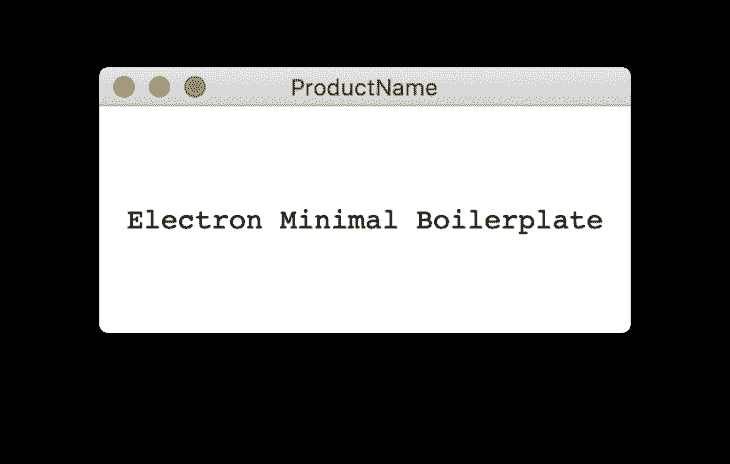

# 用电子和反应构建菜单栏应用程序

> 原文：<https://blog.logrocket.com/building-a-menu-bar-application-with-electron-and-react/>

在本文中，我将详细介绍如何使用 Electron.js 和 React 实现菜单栏应用程序。

虽然我选择使用 React，但是客户端当然可以使用任何其他框架或者只是普通的 JavaScript。

而且，本教程的目标操作系统是 macOS。

因此，如果您想在另一个操作系统(如 Windows 或 Linux)上尝试本教程，您可能需要对代码做一些小的调整，因为 Electron API 在不同的操作系统上有不同的显示。

## 设置项目

为了让那些不知道如何配置项目的人快速而容易地完成，我准备了一个带有 React.js 的电子样板。

您可以克隆或下载它来启动项目，也可以使用您自己喜欢的样板文件。

在这里找到我的:

> Transpiling JS 和 Style 林挺 CSS 模块支持 Sass 编译器 SVG loader 文件 URL Loader npm 运行客户端运行渲染器进程，然后 NPM 运行服务器运行主进程。npm run build 为生产构建，npm run dist 分发可执行文件。

电子基础

### 在我们开始之前，让我们快速回顾一下电子是如何构成的。

电子有两个过程:渲染器和 main。

您可以将它们分别视为客户端和服务器端。

渲染器进程顾名思义定义了在窗口内部渲染什么，主进程定义了创建什么窗口，以及与它们的交互和其他后端相关的事情。

这两个过程互不知晓。

为了让他们沟通，有 [ipcMain](https://www.electronjs.org/docs/api/ipc-main) 和 [ipcRenderer](https://www.electronjs.org/docs/api/ipc-renderer) 模块，基本都是`EventEmitters`。

稍后我将更详细地介绍这些模块。

现在，让我们从对`src/server/main.js`文件的基本导入开始。

注意，我指的是我在文章顶部提供的样板文件的目录结构，所以这可能会因您的设置而改变。

`electron-util`是一个有用的包，当你处于开发模式时，可以有条件地启用诸如 devTools 之类的东西。

导入前不要忘记安装`electron-util`:

创建窗口

```
const { app, BrowserWindow } = require('electron');
const { is } = require('electron-util');
const path = require('path');
```

## 在 electronic 中，BrowserWindow API 创建一个带有指定选项的浏览器窗口，并加载一个想要显示的 URL。

让我们创建一个名为`createMainWindow`的函数，并在其中创建一个`BrowserWindow`。

更多来自 LogRocket 的精彩文章:

* * *

### 我在`createMainWindow`函数之外声明`mainWindow`变量的原因是因为我们稍后将创建一个类来在 BrowserWindow 之外创建一个[托盘](https://www.electronjs.org/docs/api/tray)对象，所以我们需要全局访问该变量。

* * *

```
let mainWindow = null;

const createMainWindow = () => {
  mainWindow = new BrowserWindow({
    backgroundColor: '#FFF',
    width: 250,
    height: 150,
    webPreferences: {
      devTools: is.development,
      nodeIntegration: true,
    }
  });
  if (is.development) {
    mainWindow.webContents.openDevTools({ mode: 'detach' });
    mainWindow.loadURL('http://localhost:3000');
  } else {
    mainWindow.loadURL(`file://${path.join(__dirname, '../../build/index.html')}`);
  }
};
```

[API 文档](https://www.electronjs.org/docs/api/browser-window)帮助您找出所有可用的设置，所以我不会详细介绍。

然而，你会看到我们使用`is.development`从本地开发服务器打开 devTools 和 loadURL。如果构建文件夹是为生产而构建的，也可以使用它。

要创建 BrowserWindow 实例，我们需要等到应用程序准备就绪。

因此，我们需要使用`ready`事件，它是在电子完成初始化时发出的:

到目前为止，我们只创建了一个 BrowserWindow 并指定了要在其中显示的内容。

```
app.on('ready', () => {
  createMainWindow();
});
```

但是，我们没有运行任何渲染器进程。

如果您运行`npm run client`，这将在`localhost`端口`3000`上启动一个服务器，这是在开发模式下由`loadURL`方法加载的特定端口。

因为已经有一个呈现文本的组件，所以您可以继续在另一个终端实例中运行`npm run server`。

这将运行电子应用程序。您应该会看到以下应用程序窗口:



编辑`src/client/components/App/index.js`将重新渲染组件并自动更新主窗口的内容。

创建托盘对象

## 我们创建的主窗口出现在屏幕的中间，但是我们想在菜单栏中创建一个图标，并在单击它时切换这个窗口。

为此，我们首先需要创建一个`Tray`对象，它在菜单栏中显示指定的图标。

因为我们需要定位和切换我们的`mainWindow`对象，并且最好能够在右键单击`Tray`图标时显示系统菜单，所以创建一个将所有功能捆绑在一起的类会更方便。

所以，让我们在`src/server`下创建一个名为`TrayGenerator.js`的文件。

在`TrayGenerator`类中，我们需要以下函数以及一个接受`BrowserWindow`对象的构造函数，在我们的例子中是`mainWindow`变量:

`getWindowPosition`

*   `showWindow`
*   `toggleWindow`
*   `rightClickMenu`
*   `createTray`
*   `getWindowPosition()`

```
const { Tray, Menu } = require('electron');
const path = require('path');

class TrayGenerator {
  constructor(mainWindow) {
    this.tray = null;
    this.mainWindow = mainWindow;
  }
  getWindowPosition = () => {
  };

  showWindow = () => {
  };

  toggleWindow = () => {
  };

  rightClickMenu = () => {
  }

  createTray = () => {
  };
}

module.exports = TrayGenerator;
```

### 这个函数需要计算出托盘图标和 BrowserWindow 的位置和尺寸，以便找到使 BrowserWindow 相对于托盘图标居中和向右的 x 和 y 坐标。

在 BrowserWindow 和 Tray 对象上调用的`getBounds()`函数返回 x 和 y 位置，以及宽度和高度信息。

虽然托盘对象实例还没有分配给`this.tray`，但是它将在调用`getWindowPosition()`时被分配，所以假设它已经分配了适当的对象。

返回的 x 和 y 值保证主窗口位于托盘图标的下方居中位置。

```
getWindowPosition = () => {
  const windowBounds = this.mainWindow.getBounds();
  const trayBounds = this.tray.getBounds();
  const x = Math.round(trayBounds.x + (trayBounds.width / 2) - (windowBounds.width / 2));
  const y = Math.round(trayBounds.y + trayBounds.height);
  return { x, y };
};
```

`showWindow()`

### 该函数负责使用我们之前创建的函数`getWindowPosition()`来设置主窗口的位置。

首先，我们使用`setPosition`方法设置主窗口的位置。

然后我们通过使用`show`方法使它可见。

请注意，虽然默认情况下主窗口是可见的，但我们稍后会将其设置为不可见，因为我们不希望它在菜单栏应用程序运行时出现。

在 macOS 中，有多个桌面(工作区)，因此如果您点按托盘图标并显示窗口，然后切换到另一个桌面并再次点按那里的图标，您应该确保它不会聚焦先前打开的窗口。

为了处理这个问题，我们通过使用`setVisibleOnAllWorkspaces`方法使它在所有桌面上可见，然后聚焦在活动桌面上可见的那个。

我们通过将`false`传递给相同的方法来隐藏其余部分:

`toggleWindow()`

```
showWindow = () => {
  const position = this.getWindowPosition();
  this.mainWindow.setPosition(position.x, position.y, false);
  this.mainWindow.show();
  this.mainWindow.setVisibleOnAllWorkspaces(true);
  this.mainWindow.focus();
  this.mainWindow.setVisibleOnAllWorkspaces(false);
};
```

### 这是一个非常简单的函数。

我们使用`isVisible`方法来判断窗口是否可见。如果是，我们把它藏起来。

如果不是，我们就展示出来。

这个函数稍后将被附加到托盘对象的`click`事件监听器。

`rightClickMenu()`

```
toggleWindow = () => {
  if (this.mainWindow.isVisible()) {
    this.mainWindow.hide();
  } else {
    this.showWindow();
  }
};
```

### 这个函数为一个上下文菜单的选项创建一个数组，当右击托盘图标时会显示出来。

您可以在以下 API 文档中找到托盘和菜单上使用的`popUpContextMenu`和`buildFromTemplate`方法的详细信息，以及用于创建菜单的其他可用选项:

将图标和上下文菜单添加到系统的通知区域。进程:主托盘是一个 EventEmitter。平台注意事项 Linux 托盘图标默认使用状态通知项，当它在用户的桌面环境中不可用时，将使用 GtkStatusIcon。

> Add icons and context menus to the system’s notification area. Process: Main Tray is an EventEmitter. Platform Considerations Linux Tray icon uses StatusNotifierItem by default, when it is not available in user’s desktop environment theGtkStatusIcon will be used instead.

创建本地应用程序菜单和上下文菜单。过程:Main 创建一个新菜单。menu 类有以下静态方法:将 Menu 设置为 macOS 上的应用程序菜单。在 Windows 和 Linux 上，该菜单将被设置为每个窗口的顶部菜单。

> `createTray()`

最后一个方法通过传递托盘图标的路径来创建托盘实例。

```
rightClickMenu = () => {
  const menu = [
    {
      role: 'quit',
      accelerator: 'Command+Q'
    }
  ];
  this.tray.popUpContextMenu(Menu.buildFromTemplate(menu));
}
```

### 在`/server`下创建一个名为`assets`的文件夹，将 PNG 格式的图标文件放在那里。

图标文件名要以`Template`结尾是 macOS 的一个规则，因此选择了`IconTemplate`这个名字。

你需要两个带`@1x`和`@2x`后缀的版本，大小分别对应 16×16 和 32×32 像素。

需要在 macOS 上启用`setIgnoreDoubleClickEvents`方法，这样双击事件会被忽略，每个单独的点击都会被注册为单击。

现在我们需要使用`toggleWindow()`函数在每次点击托盘图标时切换主窗口。

同样，当右击托盘图标时，我们需要调用`rightClickMenu`来显示上下文菜单。

所以我们在托盘对象上使用了`click`和`right-click`事件监听器:

现在我们已经完成了`TrayGenerator`类。

是时候实例化它，然后对它调用`createTray`方法了。

```
createTray = () => {
  this.tray = new Tray(path.join(__dirname, './assets/IconTemplate.png'));
  this.tray.setIgnoreDoubleClickEvents(true);

  this.tray.on('click', this.toggleWindow);
  this.tray.on('right-click', this.rightClickMenu);
};
```

但是首先，在`main.js`文件的顶部导入`TrayGenerator`类:

然后通过传递`mainWindow`并调用其实例上的`createTray()`方法来初始化`TrayGenerator`，以生成一个托盘对象。

我们在调用了`createMainWindow()`之后就这样做了，它创建了一个`BrowserWindow`的实例并将其分配给了`mainWindow`变量。

```
const TrayGenerator = require('./TrayGenerator');
```

进一步调整

如果你运行`npm run client`然后`npm run server`，你会注意到主窗口仍然出现在屏幕中间，然后当你点击托盘图标时消失。

```
app.on('ready', () => {
  createMainWindow();
  const Tray = new TrayGenerator(mainWindow);
  Tray.createTray();
});
```

## 如果您再次单击托盘图标，它会根据我们的需要重新定位在图标下方。

这是因为我们最初没有隐藏主窗口。

因此，传递给 BrowserWindow 的以下选项确保:

–窗口最初不可见
–窗口没有框架
–不能将窗口置于全屏模式
–用户不能调整窗口大小

你可能已经注意到，虽然我们在菜单栏中有一个托盘图标，但应用程序图标在 dock 中仍然可见。

如果您不希望这样，您可以简单地调用下面的代码行来隐藏它:

```
show: false,
frame: false,
fullscreenable: false,
resizable: false,
```

因此，在所有的调整之后，`main.js`中的最终代码如下所示:

在主进程上保存数据

```
app.dock.hide();
```

无论您想存储一些用户偏好还是应用程序状态，都有一个非常方便的 npm 包`[electron-store](https://www.npmjs.com/package/electron-store)`来保存主进程上的数据。

```
// eslint-disable-next-line import/no-extraneous-dependencies
const { app, BrowserWindow } = require('electron');
const { is } = require('electron-util');
const path = require('path');
const TrayGenerator = require('./TrayGenerator');

let mainWindow = null;

const createMainWindow = () => {
  mainWindow = new BrowserWindow({
    backgroundColor: '#FFF',
    width: 300,
    height: 150,
    show: false,
    frame: false,
    fullscreenable: false,
    resizable: false,
    webPreferences: {
      devTools: is.development,
      nodeIntegration: true,
    }
  });
  if (is.development) {
    mainWindow.webContents.openDevTools({ mode: 'detach' });
    mainWindow.loadURL('http://localhost:3000');
  } else {
    mainWindow.loadURL(`file://${path.join(__dirname, '../../build/index.html')}`);
  }
};

app.on('ready', () => {
  createMainWindow();
  const Tray = new TrayGenerator(mainWindow);
  Tray.createTray();
});

app.dock.hide();
```

## 让我们使用这个包来存储一个用户首选项，这对于菜单栏应用程序很重要:“启动时启动”。

启动时自动启动

安装并导入包，然后在`main.js`中创建一个带有模式的存储:

### 我们要做的下一件事是能够切换这个值。

这可以在渲染器过程中完成，或者我们可以将此功能添加到我们之前创建的 contextMenu 中，这可以通过右键单击托盘图标来触发。

```
const Store = require('electron-store');
const schema = {
  launchAtStart: true
}
const store = new Store(schema);
```

让我们稍微修改一下`TrayGenerator`类，使它也接受一个存储对象，并显示一个“启动时启动”的切换选项。

我们添加了一个新的菜单项，它有这种类型的`checkbox`。

它的状态应该取决于`launchAtStart`键，它是我们在用来初始化存储的模式中定义的。

因此，为了获取这个值，我们在 store 对象上使用了`get`方法。

每当我们单击这个菜单项时，我们就获得复选框的值，并通过使用`set`方法将其存储为`launchAtStart`键的值。

因此，`TrayGenerator.js`文件的最终版本如下所示:

另外，在创建 TrayGenerator 实例时，不要忘记将`store`对象作为第二个参数。

现在你应该可以在右键菜单中看到“启动时启动”选项。

```
constructor(mainWindow, store) {
  this.tray = null;
  this.store = store;
  this.mainWindow = mainWindow;
}

rightClickMenu = () => {
  const menu = [
    {
      label: 'Launch at startup',
      type: 'checkbox',
      checked: this.store.get('launchAtStart'),
      click: event => this.store.set('launchAtStart', event.checked),
    },
    {
      role: 'quit',
      accelerator: 'Command+Q'
    },
  ];
  this.tray.popUpContextMenu(Menu.buildFromTemplate(menu));
}
```

虽然我们将 checkbox 的值存储在 name `launchAtStart`键下的 store 对象中，但是我们没有利用它将我们的应用程序添加到系统的登录项列表中。

```
const Tray = new TrayGenerator(mainWindow, store);
```

这是通过用一个对象调用`app`上的`setLoginItemSettings`方法来完成的，该对象具有值为`launchAtStart` store item 的`openAtLogin`的键。

渲染器和主进程之间的通信

到目前为止，我们只创建了一个窗口，并通过单击托盘图标来触发它。

```
app.setLoginItemSettings({
  openAtLogin: store.get('launchAtStart'),
});
```

## 然而，实际的应用程序存在于客户端，也就是渲染器进程。

使用 React 在 renderer 进程上构建和设计应用程序与构建常规 React 应用程序没有什么不同。

但是，当涉及到渲染器和主进程之间的通信时，这是通过电子 API 处理的。

ipcMain 和 ipcRenderer

这两个进程之间的通信通过`ipcMan`和`ipcRenderer`模块进行。

### ipcRenderer 可以监听和发送消息，而 ipcMain 只能监听来自 Renderer 进程的消息。

为了向特定的窗口发送消息，应该在特定的 BrowserWindow 对象上调用`webContents.send()`。

下面您可以看到通信的示例演示。

主流程= >渲染器流程:

渲染器进程= >主进程

*   IPC 在运行

```
// In main process
const { ipcMain } = require('electron');
mainWindow.webContents.send('MSG_FROM_MAIN', 'hello renderer');

// In renderer process
const { ipcRenderer } = window.require('electron');
ipcRenderer.on('MSG_FROM_MAIN', (event, data) => console.log(data));
```

*   让我们构建一个非常基本的 React 应用程序，并将它的状态数据存储在我们在上一节中创建的电子商店中。

```
// In renderer process
const { ipcRenderer } = window.require('electron');
ipcRenderer.send('MSG_FROM_RENDERER', 'hello main');

// In main process
const { ipcMain } = require('electron');
ipcMain.on('MSG_FROM_RENDERER', (event, data) => console.log(data));
```

### React 应用程序是一个基本的计数器，您可以通过单击按钮来增加或减少一个数字。


我只是分享组件代码以及样式，没有进入任何细节，因为它是非常基本的。我将详细介绍 IPC 连接。

当用户与应用程序交互并改变状态时，我们需要将这些信息发送到主进程进行存储。

正如我们之前讨论的，通过`ipcRenderer.send();`将数据从渲染器发送到主进程。

```
import React from 'react';
import styles from './styles.sass';
class App extends React.Component {
  constructor() {
    super();
    this.state = {
      counter: 0
    };
  }

  increase = () => {
    this.setState(prevState => ({ counter: prevState.counter + 1 }));
  }

  decrease = () => {
    const { counter } = this.state;
    if (counter) {
      this.setState(prevState => ({ counter: prevState.counter - 1 }));
    }
  }

  render() {
    const { counter } = this.state;
    return (
      <div className={styles.app}>
        <button
          type="button"
          className={styles.button}
          onClick={this.decrease}
        >
          -
        </button>
        <div className={styles.counter}>{counter}</div>
        <button
          type="button"
          className={styles.button}
          onClick={this.increase}
        >
          +
        </button>
      </div>
    );
  }
}
export default App;
```

```
body
  margin: 0
.app
  align-items: center
  display: flex
  font-family: monospace
  font-size: 16px
  height: 100vh
  justify-content: space-around
  padding: 0 40px

  .counter
    font-size: 20px

  .button
    align-items: center
    border: 1px solid black
    border-radius: 50%
    cursor: pointer
    display: flex
    font-size: 20px
    height: 50px
    justify-content: center
    outline: none
    width: 50px
```

从渲染器进程发送

让我们包括来自`Electron`的`ipcRenderer`。

### 现在，每次更新状态时，我们都需要发送一条消息。

在`increase`和`decrease`函数中，我们调用`setState`。

```
const { ipcRenderer } = window.require('electron');
```

它的回调函数是我们需要发送消息的地方。

由于我们将发送相同的消息和数据，我创建了一个名为`sendCounterUpdate`的函数，并通过传递状态变量`counter`作为参数在`setState`的回调中调用这个函数。

注意，如果使用对象析构作为`const {counter} = this.state`来传递`counter`状态，这将引用旧的状态，而不是最近更新的状态，因此使用`this.state.counter`作为`this.sendCounterUpdate`的参数。

现在消息被发送到主进程，但是我们没有任何机制来监听这个消息。

在渲染器进程中接收

```
sendCounterUpdate = (data) => {
      ipcRenderer.send('COUNTER_UPDATED', data);
    }

    increase = () => {
  this.setState(prevState => (
    { counter: prevState.counter + 1 }
  ), () => {
    this.sendCounterUpdate(this.state.counter);
  });
}

decrease = () => {
  const { counter } = this.state;
  if (counter) {
    this.setState(prevState => (
      { counter: prevState.counter - 1 }
    ), () => {
      this.sendCounterUpdate(this.state.counter);
    });
  }
}
```

将来自`Electron`的`ipcMain`包含在您的`main.js`文件中。

### 在`app`的`ready`事件的回调函数中，我们监听渲染器进程发送的特定消息，并将接收到的数据存储在商店的`counterValue`键中。

我们还必须将这个键添加到商店的模式中。

```
const { app, BrowserWindow, ipcMain } = require('electron');
```

因此，用初始值`0`更新`schema`变量如下:

现在消息被发送到主进程，但是我们没有任何机制来监听这个消息。

单独存储这个值没有任何用处。因此，每次初始化应用程序时，我们都需要将这个值发送回渲染器进程。

```
const schema = {
  launchAtStart: true,
  counterValue: 0
}
app.on('ready', () => {
  createMainWindow();
  const Tray = new TrayGenerator(mainWindow, store);
  Tray.createTray();

  ipcMain.on('COUNTER_UPDATED', (event, data) => {
    store.set('counterValue', data);
  });
});
```

我们还需要在渲染器进程中监听此消息。

从主进程发送

正如我们之前所讨论的，这是通过调用`mainWindow.webContent`上的`send`方法来实现的，其中`mainWindow`是我们想要向其发送消息的窗口。

### 在发送消息之前，我们需要确保我们创建的 browserWindow 实例(`mainWindow`)已经加载完毕。

如果我们不做这种检查，很可能我们的消息会在渲染器进程开始监听它之前被发送出去，结果我们可能会错过它。

`did-finish-load`事件在`mainWindow.webContents`上发出，保证渲染器进程已加载并准备就绪。

在`mainWindow.webContents.on('did-finish-load')`的回调函数中，我们发送一条`INITIALIZE_COUNTER`消息以及从存储中获取的`counterValue`数据。

在主进程上接收

在 React 应用中，我们使用`componentDidMount`生命周期钩子开始监听`INITIALIZE_COUNTER`消息，并在主进程发送该消息时用接收到的数据设置计数器状态，这在渲染器进程完成加载后只发生一次。

```
app.on('ready', () => {
  createMainWindow();
  const Tray = new TrayGenerator(mainWindow, store);
  Tray.createTray();

  ipcMain.on('COUNTER_UPDATED', (event, data) => {
    store.set('counterValue', data);
  });

  mainWindow.webContents.on('did-finish-load', () => {
    mainWindow.webContents.send('INITIALIZE_COUNTER', store.get('counterValue'));
  });
});
```

### 下面是`main.js`和 React 组件的最终版本

`Main.js`:

```
componentDidMount() {
  ipcRenderer.on('INITIALIZE_COUNTER', (event, counter) => {
    this.setState({ counter });
  });
}
```

反应组件:

分发应用程序

```
const { app, BrowserWindow, ipcMain } = require('electron');
const Store = require('electron-store');
const { is } = require('electron-util');
const path = require('path');
const TrayGenerator = require('./TrayGenerator');

const schema = {
  launchAtStart: true,
  counterValue: 0
};

const store = new Store(schema);
let mainWindow = null;

const createMainWindow = () => {
  mainWindow = new BrowserWindow({
    backgroundColor: '#FFF',
    width: 300,
    height: 150,
    show: false,
    frame: false,
    fullscreenable: false,
    resizable: false,
    webPreferences: {
      devTools: is.development,
      nodeIntegration: true,
    }
  });
  if (is.development) {
    mainWindow.webContents.openDevTools({ mode: 'detach' });
    mainWindow.loadURL('http://localhost:3000');
  } else {
    mainWindow.loadURL(`file://${path.join(__dirname, '../../build/index.html')}`);
  }
};

app.on('ready', () => {
  createMainWindow();
  const Tray = new TrayGenerator(mainWindow, store);
  Tray.createTray();
  ipcMain.on('COUNTER_UPDATED', (event, data) => {
    store.set('counterValue', data);
  });
  mainWindow.webContents.on('did-finish-load', () => {
    mainWindow.webContents.send('INITIALIZE_COUNTER', store.get('counterValue'));
  });
});

app.dock.hide();
```

完成实现后，最后一步是分发应用程序。

```
import React from 'react';
import styles from './styles.sass';
const { ipcRenderer } = window.require('electron');

class App extends React.Component {
  constructor() {
    super();
    this.state = {
      counter: 0
    };
  }

  componentDidMount() {
    ipcRenderer.on('INITIALIZE_COUNTER', (event, counter) => {
      this.setState({ counter });
    });
  }

  sendCounterUpdate = (data) => {
    ipcRenderer.send('COUNTER_UPDATED', data);
  }

  increase = () => {
    this.setState(prevState => (
      { counter: prevState.counter + 1 }
    ), () => {
      this.sendCounterUpdate(this.state.counter);
    });
  }

  decrease = () => {
    const { counter } = this.state;

    if (counter) {
      this.setState(prevState => (
        { counter: prevState.counter - 1 }
      ), () => {
        this.sendCounterUpdate(this.state.counter);
      });
    }
  }

  render() {
    const { counter } = this.state;

    return (
      <div className={styles.app}>
        <button
          type="button"
          className={styles.button}
          onClick={this.decrease}
        >
          -
        </button>
        <div className={styles.counter}>{counter}</div>
        <button
          type="button"
          className={styles.button}
          onClick={this.increase}
        >
          +
        </button>
      </div>
    );
  }
}

export default App;
```

## 发布一个电子应用程序有几个不同的包，但我个人使用的是`electron-builder`,这已经包含在样板文件中，我在本文开始时已经分享了。

如果您正在使用样板文件，您所要做的就是运行`npm run build`来创建 React 应用程序的生产版本，然后运行`npm run dist`来分发您的电子应用程序。

结论

那些使用他们自己的设置的人可以在这里得到更多关于[电子建造者的信息。](https://www.electron.build)

## 编码快乐！

使用 LogRocket 消除传统反应错误报告的噪音

是一款 React analytics 解决方案，可保护您免受数百个误报错误警报的影响，只针对少数真正重要的项目。LogRocket 告诉您 React 应用程序中实际影响用户的最具影响力的 bug 和 UX 问题。

## 自动聚合客户端错误、反应错误边界、还原状态、缓慢的组件加载时间、JS 异常、前端性能指标和用户交互。然后，LogRocket 使用机器学习来通知您影响大多数用户的最具影响力的问题，并提供您修复它所需的上下文。

[LogRocket](https://lp.logrocket.com/blg/react-signup-issue-free)

关注重要的 React bug—[今天就试试 LogRocket】。](https://lp.logrocket.com/blg/react-signup-issue-free)

[ ](https://lp.logrocket.com/blg/react-signup-general) [  ](https://lp.logrocket.com/blg/react-signup-general) [LogRocket](https://lp.logrocket.com/blg/react-signup-issue-free)

automatically aggregates client side errors, React error boundaries, Redux state, slow component load times, JS exceptions, frontend performance metrics, and user interactions. Then LogRocket uses machine learning to notify you of the most impactful problems affecting the most users and provides the context you need to fix it.

Focus on the React bugs that matter — [try LogRocket today](https://lp.logrocket.com/blg/react-signup-issue-free).