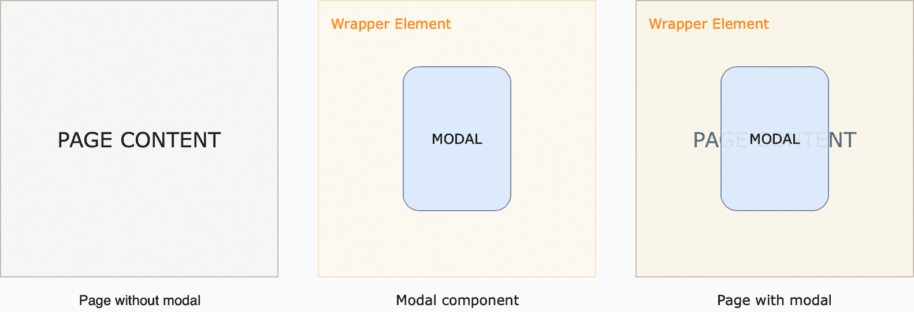

# 用 React-Router 构建 React 的模态模块

> 原文：<https://blog.logrocket.com/building-a-modal-module-for-react-with-react-router/>

模态对于在一个视图上显示另一个视图非常有用。

然而，当涉及到实现时，它们不仅仅是包装一切的绝对定位的`<div>`元素。尤其是当您需要动态 URL、页面刷新或移动设备上的简单滚动交互时。

在本文中，我们将讨论模态的各个方面，并确定满足创建动态 URL、页面刷新和其他特性的需求的解决方案。

在开始塑造模态组件之前，让我们从 **react-router** 包的一些基础开始。

我们将使用这个包中的四个组件:浏览器路由器、路由器、链路和交换机。

由于这不是一个 **react-router** 教程，我不会解释这些组件的作用。

然而，如果你想了解一些关于**反应路由器**的信息，你可以查看[的这个](https://reacttraining.com/react-router/web/guides/quick-start)页面。

### 基本路由

首先，通过 npm 安装`react-router-dom`。

```
npm install react-router-dom --save
```

在应用程序的最顶层，使用`<BrowserRouter/>`组件包装应用程序。

```
import { BrowserRouter } from "react-router-dom";

ReactDOM.render(
  <BrowserRouter>
    <App />
  </BrowserRouter>,
  document.getElementById('root')
);
```

在`<App/>`中，您将需要指定路线，以便当其中一个——或者没有一个——匹配时，您可以呈现特定的视图。

假设我们有三个不同的组件要渲染:`<Home/>`、`<About/>`和`<Contact/>`。我们将创建一个导航菜单，它将始终显示在应用程序的顶部。

来自`react-router-dom`的`<Link/>`或`<NavLink/>`组件用于导航目的，而`<NavLink/>`具有当当前 URL 匹配时适用于特定样式的特殊功能。

就功能而言，你可以使用任何一个。

下面是导航菜单的基本结构，它相应地改变 URL:

```
render() {
  return (
    <div className="app">
      <div className="menu">
        <Link className="link" to='/'>Home</Link>
        <Link className="link" to='/about'>About</Link>
        <Link className="link" to='/contact'>Contact</Link>
      </div>
    </div>
  );
}
```

我们要做的下一件事是实现匹配 URL 并呈现特定组件的机制。

`<Switch/>`呈现由它的`<Route/>`孩子指定的第一个匹配位置。当没有匹配时，返回最后一个`<Route/>`——通常是 404 页面。

```
render() {
  return (
    <div className="app">
      <div className="menu">
        <Link className="link" to='/'>Home</Link>
        <Link className="link" to='/about'>About</Link>
        <Link className="link" to='/contact'>Contact</Link>
      </div>
      <Switch>
        <Route exact path="/" component={Home} />
        <Route exact path="/contact/" component={Contact} />
        <Route exact path="/about" component={About} />
        <Route>{'404'}</Route>
      </Switch>
    </div>
  );
}
```

### 创建模态组件

到目前为止，我们已经实现了基本的路由结构。现在我们可以创建一个模态组件，并将其显示为一个覆盖图。

尽管有各种不同的方法来创建模态组件，我们将只讨论其中一种。

模态组件有一个跨越整个屏幕的包装元素——宽度和高度。

这个区域也作为一个`clickedOutside`探测器。那么实际的模态元素相对于该包装元素被定位。



下面是一个`<Modal/>`功能组件的例子，它使用`withRouter` HOC(高阶组件)来访问路由器历史记录，并调用`goBack()`方法来更改应用程序 URL，当点击`.modal-wrapper`关闭模态时。

`onClick={e => e.stopPropagation()}`用于阻止点击事件的传播，并触发`.modal-wrapper`上的`onClick`，当实际的`.modal`元素被激活时，它将关闭模态。

```
import React from 'react';
import { withRouter } from 'react-router-dom';

const Modal = () => (
  <div
    role="button"
    className="modal-wrapper"
    onClick={() => this.props.history.goBack()}
  >
    <div
      role="button"
      className="modal"
      onClick={e => e.stopPropagation()}
    >
      <p>
        CONTENT
      </p>
    </div>
  </div>
);

export default withRouter(Modal);
```

设计`.modal-wrapper`的样式同样重要。下面，您可以找到用于使其跨越整个屏幕并出现在内容上方的基本样式。

使用`-webkit-overflow-scrolling: touch`在 iOS 设备上启用弹性滚动。

```
.modal-wrapper {
  position: fixed;
  left: 0;
  top: 0;
  width: 100%;
  height: 100vh;
  overflow-y: scroll;
  -webkit-overflow-scrolling: touch;
}
```

### 打开模式视图

当特定的 URL 匹配时，我们创建的模态组件应该呈现在现有视图的顶部，这意味着我们必须以某种方式更改 URL，以便路由机制可以决定呈现什么。

我们知道`<Switch/>`呈现第一个匹配的位置，但是一个模态叠加需要两个`<Route/>`组件同时呈现。

这可以通过将模态`<Route/>`从`<Switch/>`中取出并有条件地渲染来实现。

在这种情况下，我们应该能够检测一个模态是否是活动的。

最简单的方法是传递一个状态变量和一个`<Link/>`组件。

与我们使用`<Link/>`组件创建导航菜单的方式一样，我们将使用它来触发一个模态视图。

下面显示的用法让我们定义一个状态变量，然后在`location` prop 中可用，我们可以使用`withRouter` HOC 在任何组件中访问它。

```
<Link
  to={{
    pathname: '/modal/1',
    state: { modal: true }
  }}
>
  Open Modal
</Link>
```

把这个放在你想放的任何地方。点击链接会将 URL 更改为`/modal/1`。

可能有几个不同名字的情态动词，如`modal/1`、`modal/2`等等。

在这种情况下，您不需要定义每个`<Route/>`来匹配单独的模态位置。为了在`/modal`路线下处理它们，使用下面的语法:

```
<Route exact *path*="/modal/:id">
```

这使您可以通过`match.params`属性灵活地获得模态组件中硬编码的`:id`参数的值。

它还允许您根据打开的模式进行动态内容呈现。

### 匹配模态位置

这一部分特别重要，因为它确定了在现有视图上显示模式的机制，即使打开模式时位置参数发生了变化。

当我们单击前面定义的`Open Modal`链接时，它会将位置路径更改为`/modal/1`，这与`<Switch/>`中的任何内容都不匹配。

所以我们必须在某处定义下面的`<Route/>`。

```
<Route exact path="/modal/:id" component={Modal} />
```

我们希望将`<Modal/>`组件显示为一个覆盖图。

然而，将它放在`<Switch/>`中会匹配它，并且只呈现`<Modal/>`组件。因此，不会有覆盖。

为了解决这个问题，我们需要用额外的条件在`<Switch/>`的内部和外部定义它。

* * *

下面，您将看到相同代码片段的修改版本。有几个变化。让我们快速列出它们:

*   构造函数中定义了一个`previousLocation`变量。
*   定义了一个`isModal`变量，它依赖于其他一些值。

*   `<Switch/>`正在使用一个`*location*`道具。

*   有两个`<Route` *`exact`* `*path*="/modal/:id" component={Modal} />`在`<Switch/>`内外都用，外面那个是有条件渲染的。

当一个模态被打开时，我们需要存储之前的位置对象，并将其传递给`<Switch/>`，而不是让它默认使用当前的位置对象。

这基本上欺骗了`<Switch/>`认为它仍然在先前的位置——例如`/`——即使位置在模态打开后变成了`/modal/1`。

这可以通过将`location`支柱设置在`<Switch/>`上来实现。

当没有打开的模式时，下面的代码片段用当前位置对象替换`previousLocation`。

当你打开一个模态时，它不会修改`previousLocation`。

因此，我们可以将它传递给`<Switch/>`,让它认为我们仍然在同一个位置，即使我们通过打开一个模态改变了位置。

我们知道，当一个模态被打开时，`location`对象中名为`modal`的状态变量将被设置为`true`。

我们可以检查位置对象的状态是否已定义，以及是否将状态变量`modal`设置为`true`。

然而，在刷新页面的情况下，仅仅这两项检查是不够的。

虽然模态必须自己闭合，`location.state && location.state.modal`仍然成立。

检查`this.previousLocation !== location`，我们可以确保刷新页面不会导致将`isModal`设置为`true`。

当模态路径被直接访问时，在我们的例子中是`modal/1`，那么没有检查是`true`。

现在我们可以使用这个布尔值来在`<Switch/>`外渲染`<Route/>`，并决定将哪个`location`对象传递给`<Switch/>`的`location`道具。

鉴于`<Modal/>`组件具有必要的样式，这导致两个不同的视图呈现在彼此之上。

```
constructor(props){
  super(props);
  this.previousLocation = this.props.location;
}

componentWillUpdate() {
  const { location } = this.props;
  if (!(location.state && location.state.modal)) {
    this.previousLocation = this.props.location;
  }
}  

render() {
  const { location } = this.props;
  const isModal = (
    location.state &&
    location.state.modal &&
    this.previousLocation !== location
  );

  return (
    <div className="app">
      <div className="menu">
        <Link className="link" to='/'>Home</Link>
        <Link className="link" to='/about'>About</Link>
        <Link className="link" to='/contact'>Contact</Link>
      </div>
      <Switch location={isModal ? this.previousLocation : location}>
        <Route exact path="/" component={Home} />
        <Route exact path="/contact/" component={Contact} />
        <Route exact path="/about" component={About} />
        <Route exact path="/modal/:id" component={Modal} />
        <Route>{'no match'}</Route>
      </Switch>
      {isModal
        ? <Route exact path="/modal/:id" component={Modal} />
        : null
      }
    </div>
  );
}
```

### 呈现不同的模式视图

到目前为止，我们已经实现了我们的模态，确保在用打开的模态刷新页面时，或者在直接访问模态路径时，不会呈现覆盖图。

相反，我们只在`<Switch/>`中渲染匹配的`<Route/>`。

在这种情况下，您想要应用的样式可能是不同的，或者您可能想要显示不同的内容。

这很容易通过将`isModal`变量作为道具传递给`<Modal/>`组件来实现，如下所示。

然后，根据属性的值，您可以应用不同的样式或返回完全不同的标记。

```
return (
  <div className="app">
    <div className="menu">
      <Link className="link" to='/'>Home</Link>
      <Link className="link" to='/about'>About</Link>
      <Link className="link" to='/contact'>Contact</Link>
    </div>
    <Switch location={isModal ? this.previousLocation : location}>
      <Route exact path="/" component={Home} />
      <Route exact path="/contact/" component={Contact} />
      <Route exact path="/about" component={About} />
      <Route exact path="/modal/:id" component={Modal} />
      <Route>{'no match'}</Route>
    </Switch>
    {isModal
      ? <Route exact path="/modal/:id">
          <Modal isModal />
        </Route>
      : null
    }
  </div>
);
```

### 防止在模式下滚动

当你在一些浏览器上打开模态时，它可能会让下面的内容在模态下滚动，这不是一个理想的交互。

在`body`上使用`overflow: hidden`是阻止整个页面滚动的第一次尝试。

然而，尽管这种方法在桌面上运行良好，但在移动 Safari 上却失败了，因为它基本上忽略了`body`上的`overflow: hidden`。

有几个不同的 npm 包试图在几乎所有平台上解决这个滚动锁定问题。

我发现[身体滚动锁](https://www.npmjs.com/package/body-scroll-lock)包非常有用。

从这个包中，您可以导入`disableBodyScroll`和`enableBodyScroll`函数，它们接受对您希望滚动持续的元素的引用作为输入。

当模式打开时，我们希望禁用整个页面的滚动，除了模式本身。

因此，当模态组件被挂载和卸载时，我们需要分别调用`disableBodyScroll`和`enableBodyScroll`函数。

为了获得对模态组件的父组件`<div>`的引用，我们可以使用 React 中的`createRef` API，并将其作为引用传递给父组件`<div>`。

下面的代码片段在模式打开时禁用滚动，在模式组件即将被卸载时再次启用滚动。

使用`this.modalRef`作为这些导入函数的输入可以防止模态组件的内容被滚动锁定。

在使用`disableBodyScroll`功能之前，我们需要做一个简单的检查。

这是因为当打开模式时，或者当直接访问模式路由时，如果页面被刷新，则模式组件可能会被装载。

在这两种情况下，都不应该禁用滚动。

我们已经将`isModal`变量作为道具传递给了`<Modal/>`组件来呈现不同的视图，所以我们可以使用这个道具来检查是否真的有模态。

下面是模态组件的修改版本:

```
import { disableBodyScroll, enableBodyScroll } from 'body-scroll-lock';

class Modal extends Component {
  constructor(props) {
    super(props);
    this.modalRef = React.createRef();
  }

  componentDidMount() {
    const { isModal } = this.props;

    if (isModal) {
      disableBodyScroll(this.modalRef.current);
    }
  }

  componentWillUnmount() {
    enableBodyScroll(this.modalRef.current);
  }

  render() {
    return (
      <div
        ref={this.modalRef}
        className="modal-wrapper"
        onClick={() => this.props.history.goBack()}
      >
        <div
          className="modal"
          onClick={e => e.stopPropagation()}
        >
        </div>
      </div>
    )
  }
}
```

### 结论

现在，您已经了解了模态视图是如何工作的，并且知道了在实现自己的集成时可能会遇到的一些问题。

对于完整的功能示例，请访问[这个](https://codesandbox.io/s/jolly-jones-cx4cw)代码沙盒项目。

## 使用 LogRocket 消除传统反应错误报告的噪音

[LogRocket](https://lp.logrocket.com/blg/react-signup-issue-free)

是一款 React analytics 解决方案，可保护您免受数百个误报错误警报的影响，只针对少数真正重要的项目。LogRocket 告诉您 React 应用程序中实际影响用户的最具影响力的 bug 和 UX 问题。

[ ](https://lp.logrocket.com/blg/react-signup-general) [  ](https://lp.logrocket.com/blg/react-signup-general) [LogRocket](https://lp.logrocket.com/blg/react-signup-issue-free)

自动聚合客户端错误、反应错误边界、还原状态、缓慢的组件加载时间、JS 异常、前端性能指标和用户交互。然后，LogRocket 使用机器学习来通知您影响大多数用户的最具影响力的问题，并提供您修复它所需的上下文。

关注重要的 React bug—[今天就试试 LogRocket】。](https://lp.logrocket.com/blg/react-signup-issue-free)