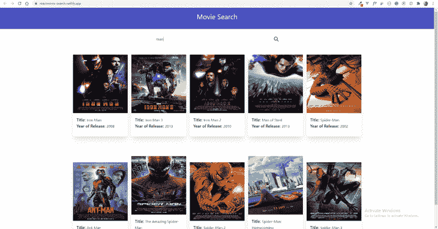

# 在 React 中构建电影搜索应用

> 原文：<https://blog.logrocket.com/building-a-movie-search-app-in-react/>

在本文中，我们将学习如何构建一个简单的 web 应用程序，让用户使用 [OMDb API](http://www.omdbapi.com/) 来搜索和显示他们喜欢的电影的信息。通过注册获得 API 密钥。

在本教程中，我们将使用 React 构建一个完整的[前端应用程序。对于 CSS，我们将使用 Tailwind CSS 和 Tailwind UI。你可以在这里](https://rapidapi.com/blog/how-to-use-an-api-with-react/)试试已经完成的 app [。](https://reactmovie-search.netlify.app/)



简单介绍一下该应用程序的工作原理，该应用程序允许用户搜索一部同名电影，并向用户提供同名电影的列表。

PS:本文假设您已经阅读并了解一点 React。它只是给你一个使用 React.js 的基本方法的概念——而不是教给你 React 中的所有东西或给你新的更新。

现在开始，让我们创建一个 React 应用程序:

```
npx create-react-app my-app
```

这将创建一个 React 应用程序。为了确保您的项目设置良好，运行`npm start`。如果一切正常，您应该会看到这一点。

接下来，让我们包括[顺风 CSS](https://tailwindcss.com/) 和[顺风 UI](https://tailwindui.com/documentation) 。下面是添加它们的步骤。

安装顺风和 UI。Tailwind 自带 CLI 工具来进行构建，所以我们只需要 Tailwind 包。

```
npm install tailwindcss
npm install @tailwindcss/ui
```

#### 将顺风添加到构建中

我们将在之前插入一个构建 Tailwind **的步骤，以避免在`package.json`中现有的启动和构建脚本被逐出 React 应用程序。这将是您的脚本:**

```
"scripts": {
  "build:tailwind": "tailwindcss build src/tailwind.css -o src/tailwind.output.css",
  "prestart": "npm run build:tailwind",
  "prebuild": "npm run build:tailwind",
  "start": "react-scripts start",
  "build": "react-scripts build",
  "test": "react-scripts test",
  "eject": "react-scripts eject"
}
```

`build:tailwind`脚本将编译我们的`src/tailwind.css`文件，并将其保存到`src/tailwind.output.css`——然后我们的应用程序将导入该文件。

#### 设置顺风源 CSS 文件

在 src 中创建一个名为`Tailwind.css`的文件，并将它粘贴到:

```
@tailwind base;
@tailwind components;
@tailwind utilities;
```

导入生成的 CSS 文件。

在`index.js`文件的顶部，导入 CSS 文件，如下所示:

```
import React from 'react';
import ReactDOM from 'react-dom';
import './tailwind.css';
import App from './App';
import * as serviceWorker from './serviceWorker';

ReactDOM.render(

  ,
  document.getElementById('root')
);

// If you want your app to work offline and load faster, you can change
// unregister() to register() below. Note this comes with some pitfalls.
// Learn more about service workers: https://bit.ly/CRA-PWA
serviceWorker.unregister();
```

现在，我们完成了我们的设置。让我们开始写一些代码。

### 创建组件

在这个项目中，我们将有三个组成部分。React 允许我们为 UI 的每个部分构建特定的组件。我们将构建一个让用户输入电影标题的`<Header>`组件和一个显示电影的`<Search>`组件。

*   `App.js`–这将是其他 2 个组件的父组件。它将基本上呈现其他两个文件
*   `Header.js`–一个简单的组件，呈现应用程序标题并接受标题属性
*   `Search.js`–包含带有搜索输入的表单，还包含处理输入元素和重置字段的函数。它还包含一个调用搜索函数并显示电影的函数

让我们开始在`src`目录中创建一个新文件夹。我们将把它命名为`components`,因为我们所有的组件都将放在那里。现在让我们创建`Header`和`Search`组件。然后，我们需要将它们导入到 App.js 文件中。

它看起来会像这样:

```
import React from 'react';
import Header from './Components/Header';
import './tailwind.css';
import SearchMovies from './Components/Search';
import Results from './Components/Results';

function App() {

  return (
      <div className="relative width-full">
        <div className="mx-auto overflow-hidden">
          <Header/>
          <SearchMovies/>
        </div>
      </div>
  );
}

export default App;
```

现在在`Header.js`文件中，添加以下代码:

```
import React from 'react';

class Header extends React.Component {
    render(){
        return ( 
          <nav className = "relative mx-auto bg-indigo-700 max-w-7xl py-4 px-4">
             <div class="container mx-auto">
                  <h1 class="text-white text-center text-3xl pb-4"> Movie Search </h1>
              </div>
          </nav>

        )
    }
}

export default Header
```

这基本上是一个呈现带有标题的标题视图的类组件。

一旦我们有了这些，下一件事就是处理`Search`组件。让我们添加下面的代码。

首先，我们将创建一个对 OMDB 进行 API 调用的函数:

```
import React, {useState} from 'react';
  function SearchMovies(){
    const [searching, setSearching] = useState(false);
    const [message, setMessage] = useState(null);
    const [query, setQuery] = useState('');
    const [movies, setMovies] = useState([]);
    const searchMovies = async(e) =>{
        e.preventDefault();
        setSearching(true);
        const url `http://www.omdbapi.com/?&apikey=e1a73560&s=${query}&type="movie"`;
         try{
            const response = await fetch(url);
            const data = await response.json();
            setMessage(null);
            setMovies(data.Search);
            setSearching(false);
         }catch(err){
            setMessage('An unexpected error occured.')
            setSearching(false);
         }
    }
```

在这个组件中，我们有一个名为`searchMovies`的函数。然后，我们使用`async-await`进行 API 调用，以确保我们从 API 中获得结果。之后，我们使用`try-catch`块获得 API 返回的响应。我们还用了一个叫做`useState`的[反应钩](https://reactjs.org/docs/hooks-intro.html)。

顾名思义，您可以在不编写类的情况下使用状态和其他 React 特性。`useState`钩子接受一个参数，这是初始状态，然后它返回一个包含当前状态的数组(与类组件的`this.state`相同)和一个更新它的函数。

加上我们的，我们有 4 个州。第一个是搜索状态，用于在进行搜索时处理搜索过程(当 search 设置为`true`时，它呈现一个`loading…`文本)。

第二个是消息状态，它在发出 API 请求时根据搜索结果(错误)呈现消息。第三个用于设置状态，确保输入被传递到 API URL。最后一个用于处理我们从服务器获得的电影数组。

功能`searchMovies`，如其所言，只是用户的输入。我们将它传递给 API URL，并向服务器发出请求以获得结果。

既然我们能够从 API 获取数据，我们需要在我们的应用程序中为用户显示它。我们将构建一个非常简单的搜索输入，允许用户键入他们喜欢的电影名称。我们将向 API 查询电影数据，并在我们的 UI 中显示响应。

```
return (
    <div className="container mx-auto pt-6">
       <div class="flex justify-center max-w-screen-sm mx-auto overflow-hidden px-10">
       <form class="w-full h-10 pl-3 pr-2 bg-white border rounded-full flex justify-between items-center relative" onSubmit={searchMovies}>
         <input type="text" name="query" placeholder="Search movies by name..."
                 class="appearance-none w-full outline-none focus:outline-none active:outline-none" value={query} onChange={(e) =>setQuery(e.target.value)}/>
         <button type="submit" class="ml-1 outline-none focus:outline-none active:outline-none">
         <svg fill="none" stroke="currentColor" stroke-linecap="round" stroke-linejoin="round" stroke-width="2" viewBox="0 0 24 24" class="w-6 h-6">
        <path d="M21 21l-6-6m2-5a7 7 0 11-14 0 7 7 0 0114 0z"></path></svg>
        </button>
       </form>
     </div>

     <div class="container mx-auto">{searching && !message ? ( <span> loading... </span>): message ? ( <div className = "message"> {message} </div>): (movies.map(movie => ( 
        <div class="inline-block px-2 w-64 h-64">
             <div class="bg-white rounded-lg overflow-hidden shadow-xl my-8 py-4"key={movie.imdbID}>
              
              <div class="p-4">
                  <p class="font-medium text-lg">Title: <span class="font-normal text-base leadin-relaxed">{movie.Title}</span></p>
                   <p class="font-medium text-lg">Year of Release: <span class="font-normal text-base">{movie.Year}</span></p></div>
                    </div>
                  </div> 
                )))}
            </div>
        </div>
    )
```

在`return`部分，我们有一个搜索输入，它接受一个名称并监听一个事件来进行搜索或调用 API。

然后我们有下一个`div`，它遍历从 API 返回的电影列表。它存储在`movies`变量中。然后，我们显示电影的详细信息，如名称、年份等。您可以显示任意多的详细信息。

你会发现，对于某些搜索，并不是所有的结果都附有图片。因此，为了让事情看起来更好，你必须过滤并只显示图像结果。

PS:只有当你打算向用户显示图像时，你才这样做。

## 结论

厉害！现在我们的应用什么都做了。总而言之，我们做了以下工作:

我们获得了 OMDb API 的 API 密钥。我们还构建了一个组件，让用户通过标题搜索电影，然后将电影标题存储在该组件的状态中。接下来，我们将该函数传递给搜索表单，这样当我们单击按钮或按回车键时它就会生效。然后，我们将响应存储在`Movies`状态中，并构建一个搜索组件来显示我们从 API 获得的响应数据。然后，我们向用户显示结果。

## 全面了解生产反应应用

调试 React 应用程序可能很困难，尤其是当用户遇到难以重现的问题时。如果您对监视和跟踪 Redux 状态、自动显示 JavaScript 错误、跟踪缓慢的网络请求和组件加载时间感兴趣，请尝试 LogRocket 。【T2[](https://www2.logrocket.com/react-performance-monitoring)

LogRocket 就像是网络应用程序的 DVR，记录 React 应用程序上发生的一切。您可以汇总并报告问题发生时应用程序的状态，而不是猜测问题发生的原因。LogRocket 还可以监控应用程序的性能，报告客户端 CPU 负载、客户端内存使用等指标。

LogRocket Redux 中间件包为您的用户会话增加了一层额外的可见性。LogRocket 记录 Redux 存储中的所有操作和状态。

现代化您调试 React 应用的方式— [开始免费监控](https://www2.logrocket.com/react-performance-monitoring)。