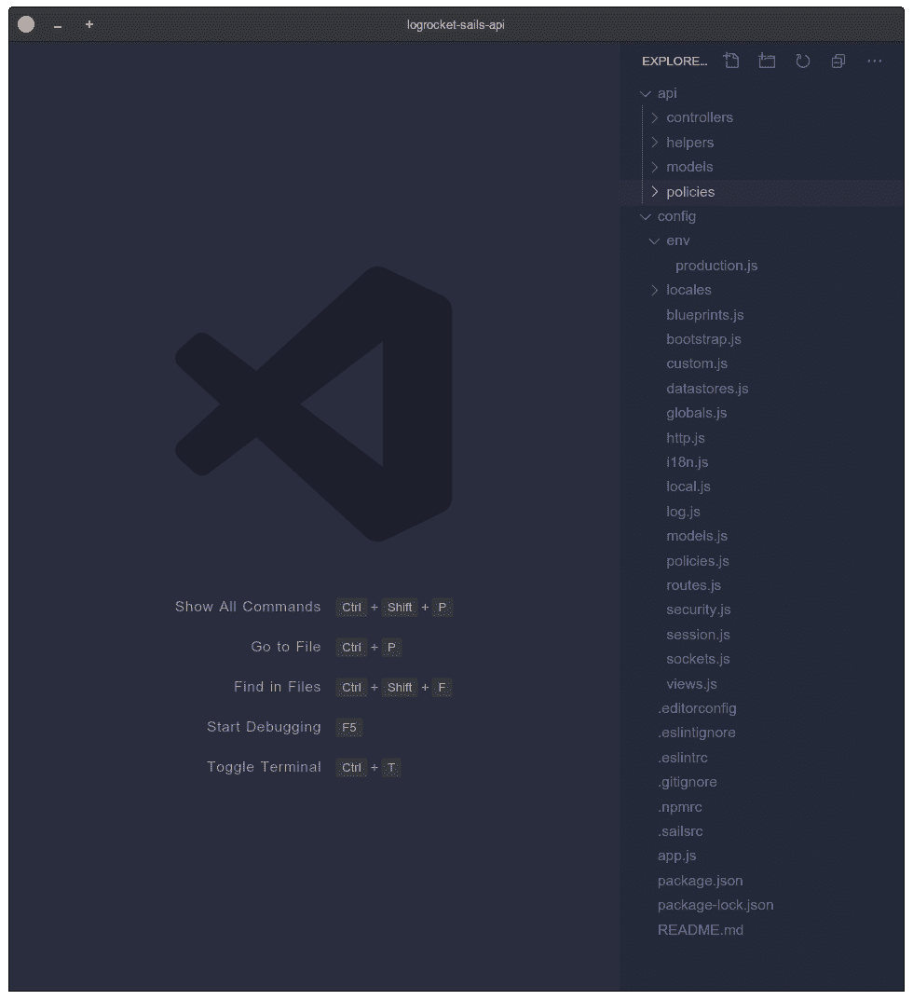
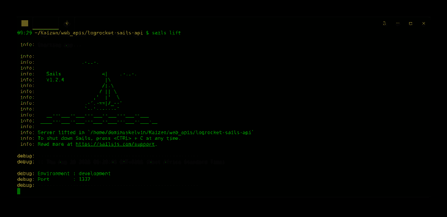
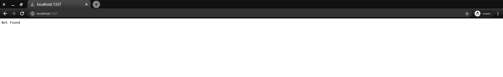
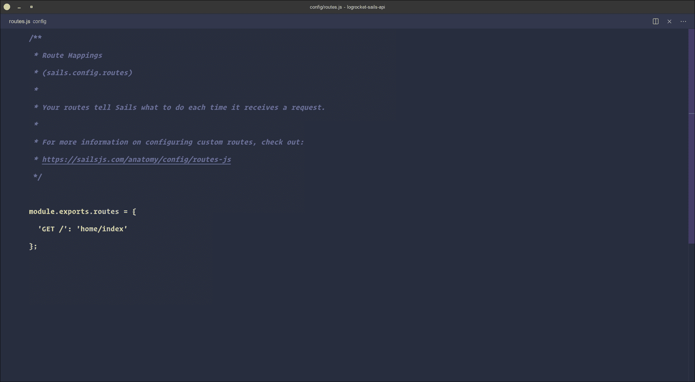
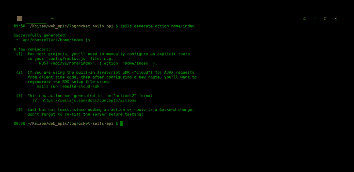
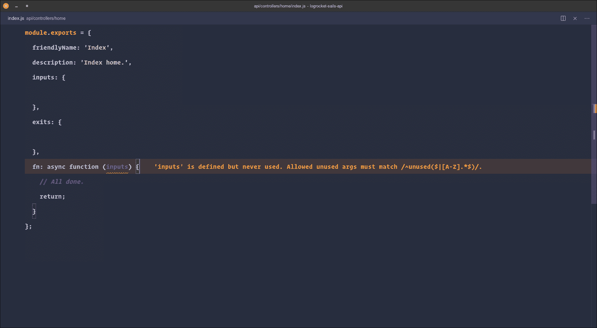
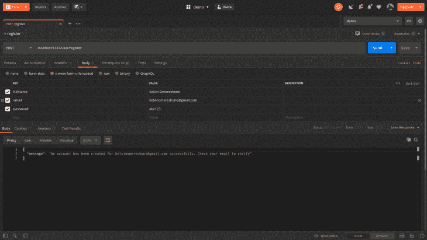
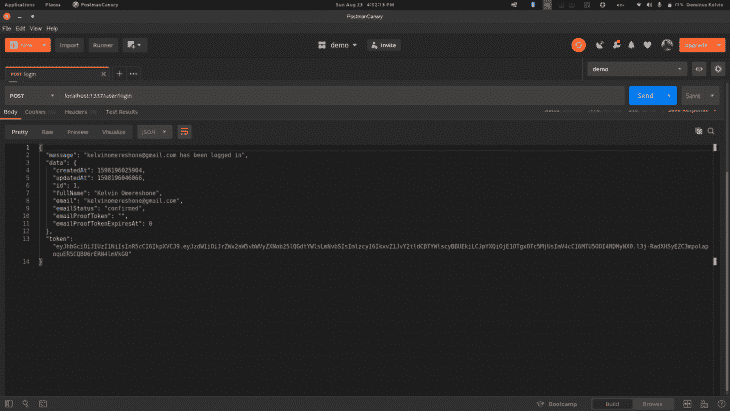
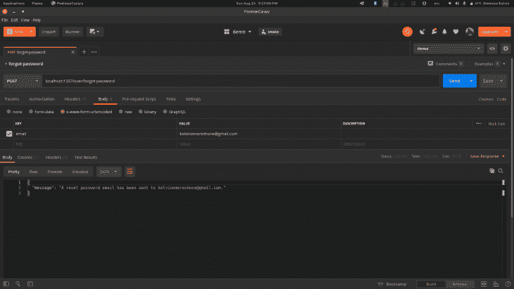
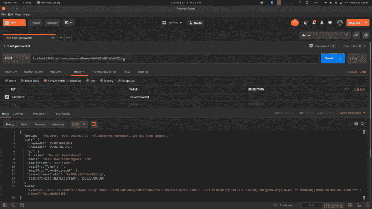

# 使用 Sails.js - LogRocket 博客构建 Node.js web API

> 原文：<https://blog.logrocket.com/building-a-node-js-web-api-with-sails-js/>

能够在服务器和客户端编写 JavaScript 对于小型和大型团队来说都是很好的杠杆。然而，对于普通开发人员来说，构建一个生产就绪的 Node.js Web API 来支持已经创建好的前端、Web 或移动应用程序并不容易。您将会遇到的一些开销有:

*   有太多的框架可供选择(Express、哈比神、Koa 等)。)
*   在没有任何明确指导方针的情况下，我们不得不研究和汇总项目所需的包
*   必须决定构建项目代码库的最佳实践
*   我们应该使用哪种 ORM，还是应该编写原始查询？🤔

在本文中，我们将学习如何使用 Sails.js 框架(Node.js 的 MVC 框架)构建一个生产就绪的 Node.js web API。我们将为 web API 服务构建用户管理端点。我们将构建端点来实现以下功能:

*   用户注册
*   用户登录
*   电子邮件确认
*   忘记/重置密码

我们将使用 Postman 测试我们的端点。最后，我们将在 Heroku 部署。我们先从介绍 Sails.js 开始。

## 先决条件

本教程假设读者对 Node.js 和服务器端开发相当熟悉。

## 什么是 Sails.js？

[Sails.js](https://sailsjs.com) 或 Sails 是一个实时 [MVC](https://en.wikipedia.org/wiki/Model%E2%80%93view%E2%80%93controller) 框架，用于构建生产就绪的企业 Node.js 应用程序。它是由[迈克·麦克尼尔](https://twitter.com/mikermcneil?lang=en)和风帆公司在 2015 年受 Ruby on Rails MVC 框架的启发而建造的。Sails 自带 websocket 支持，适合构建实时聊天应用、游戏等。船帆还配有:

*   一个名为 [Waterline](https://waterlinejs.org/) 的 ORM——node . js 的基于适配器的 ORM——让应用程序的数据层变得轻而易举
*   一个名为 sails 的 CLI 工具，可以帮助您构建新的 sails 应用程序、生成控制器操作、启动开发服务器、数据库迁移等等

Sails 正被像 [Postman](https://www.postman.com/) 、 [Paystack](https://paystack.com/) 和 [devmountain](https://devmountain.com) 这样的公司积极地用于构建他们的 Web APIs 以支持他们的各种客户。

> 注意:Sails 是在流行的 Express Node.js 框架之上构建的，所以如果您已经用 Express 构建了 Node.js 应用程序，应该会感觉很熟悉。

## 入门指南

要开始在 Sails 中构建我们的 web API，我们需要安装 Sails CLI 工具。我们将通过在终端中运行下面的命令来实现。

> 我假设你已经安装了 Node.js( [版本 13.12.0](https://nodejs.org/download/release/v13.12.0/) )

```
npm install -g sails
```

以上命令将在您的计算机上全局安装 Sails CLI 工具。要验证 Sails 是否已安装，请运行:

```
sails -v
```

如果一切顺利，上面的命令应该会返回一个版本号。

## 创建新的 Sails 应用程序

要创建一个新的 Sails 应用程序，运行`sails new`命令并传递应用程序的名称。该命令将生成一个新的 Sails 应用程序，并运行`npm install`为您安装所有的依赖项。

```
sails new <appname>
```

新的命令也接受可选标志，我们将使用`--no-frontend`标志告诉 Sails 不要生成“资产”、“视图”或“任务”文件夹。这正是我们想要的，因为我们正在构建一个 web API。让我们像这样运行命令:

```
sails new logrocket-sails-api --no-frontend
```

> 专业提示:您可以运行带有—fast 标志的新命令，只生成 sails 应用程序，跳过依赖项的安装

现在你可以`cd`进入`logrocket-sails-api`目录，在编辑器中打开应用程序。我们将使用 VS 代码，所以我们将运行`code .`来打开 VS 代码中的当前目录。

## 项目代码库结构



上面的截图描述了`sails new`命令为我们生成的代码库结构。让我们看一下这些文件和文件夹是什么:

*   这个目录是你花费大部分开发时间的地方。默认包含`controllers/`、`helpers/`、`models/`和`policies/`子目录
*   这个目录将包含你的 Sails 应用程序中的所有控制器
*   在 Sails 中，助手是一段遵循节点机器规范的可重用代码。`helpers/`目录将包含您在应用程序中定义的所有助手
*   这个目录将包含你的应用程序水线模型。水线模型通常只是一个包含数据库表的数据库模式的`.js`文件
*   策略是授权和访问控制的导航机制。您可以在这个文件夹中定义它们
*   `config/`–此目录包含您的 sails 应用程序的所有配置文件。一个特别值得注意的文件是`routes.js`配置文件，它用于声明 Sails 应用程序处理请求的路径
*   在这个配置文件中，你定义了你的数据库适配器，Waterline 将使用这个适配器(稍后会详细介绍)
*   `config/policies.js`–在这里，您可以定义策略以及策略将保护的动作或控制器

> 你可以在 [Sails 文档](https://sailsjs.com/documentation/anatomy)中阅读更多关于其他文件和文件夹的信息。

## 我们的第一个终点

现在，如果您通过运行`sails lift`启动 Sails 开发服务器，并访问`localhost:1337`，您将获得一个`404`，因为我们还没有为我们的应用程序定义任何路由。





> 专业提示:你可以通过运行`sails lift -- port <port-no>`来改变将要监听的左舷帆

让我们创建第一个端点。通常，您需要触摸`routes.js`并添加端点。`routes.js`文件接受一个字典/对象，其中键是路由端点，比如说`/`，值是将处理路由请求的控制器动作。路由关键字必须包含一个由 Sails 支持的 HTTP 动词(GET|POST|PATCH|DELETE ),然后是一个空格，后跟路由。

让我们为应用程序的`/`索引添加路线。打开`config/routes.js`并添加以下代码片段:

```
"GET /": "home/index"
```

上述路由意味着，对于 GET 请求，主控制器中的索引操作(方法)将处理该请求。

> 这是一个很好的时机来提一下，在 Sails 中，您可以灵活地将您的控制器动作(方法)放在一个单独的文件中，而不是将它们都定义在一个单独的控制器文件中。这种方法使动作更具可读性，因此每个动作文件都有重点。我们将采用这种方法，用目录来表示控制器和里面的`.js`文件作为动作。

您的`routes.js`文件应该如下所示:



我们已经完成了创建第一个端点的一半。下一步是创建`index`动作。我们将使用 Sails CLI `generate`命令在`controllers/home`目录中创建动作。运行以下命令:

```
sails generate action home/index
```



我们没有传入文件扩展名，因为 Sails 很聪明地包含了这一点。因此，您通常像对待 routes.js 中的 routes 属性一样传递参数

当我们运行上面的命令时，一个新的文件夹`home`将被添加到`controllers/`目录中，并且`index.js`动作应该在其中。下面是`index.js`动作的默认内容:



Sails 中动作和助手的格式遵循[节点机器](https://node-machine.org/)规范。一篇帮助你理解这个规范的文章可以在[这里](https://www.smashingmagazine.com/2020/05/understanding-machines-open-standard-javascript-functions/)找到。

我们想要做的是在向`/`端点发出请求时返回一个 JSON 响应。修改`home/index.js`,如下所示:

```
module.exports = {
  friendlyName: 'Index',
  description: 'Index home.',
  inputs: {
  },
  exits: {
  },
  fn: async function (_, exits) {
    // All done.
    exits.success({message: 'LogRocket Sails API'});
  }
};
```

默认情况下，Sails actions 使用`exits.success`为每个请求返回一个成功响应。因此，当用户访问`/`或我们的 Web API 时，带有`property`消息的 JSON 有效负载将作为响应被发送回来。

现在我们已经熟悉了，让我们继续实现我们的用户管理和认证特性。我们将从注册端点开始。

## 新用户注册端点

首先，让我们来说明我们希望如何处理这个端点:

*   设置数据库连接
*   在数据库中存储新的用户记录
*   向新用户发送电子邮件确认
*   注册成功后向用户发送回复
*   如果在注册过程中出现错误，可以选择发回错误

## 设置数据库连接

我们将使用 [PostgreSQL](https://www.postgresql.org/) 。你可以按照这个[教程](https://www.postgresql.org/docs/current/tutorial-install.html)为你的机器安装 PostgreSQL。

Sails 为 Waterline 提供了一个官方的 [PostgreSQL 适配器](https://www.npmjs.com/package/sails-postgresql),我们将按照安装任何 npm 包的方式安装它，方法是运行:

```
npm install sails-postgresql --save
```

安装适配器后，您需要在`config/datastore.js`中提供适配器名称和您的本地数据库连接 URL。

在此之前，您应该已经创建了 Postgres 数据库。点击这里查看[帮助](https://www.postgresql.org/docs/9.0/sql-createdatabase.html)。

通过取消注释该行来修改`config/datastore.js`:

```
// adapter: 'sails-mysql',
// url: 'mysql://user:[email protected]:port/database',
```

替换为:

```
adapter: 'sails-postgresql',
url: 'postgres://logrocket_sails_api:[email protected]:5432/logrocket_sails_api', // Replace with your own connection URL
```

PostgreSQL 的连接 URL 通常采用以下形式:

```
"postgres://{user}:{password}@{hostname}:{port}/{database-name}"
```

如果 Sails 开发服务器仍在运行，则终止它，并通过运行`sails lift`重新启动 Sails。

> 专业提示:如果你使用 VS 代码，你可以安装[帆船](https://marketplace.visualstudio.com/items?itemName=dominuskelvin.sailboat)——VS 代码的 Sails 工具，你可以从命令面板启动 Sails 开发服务器。

如果 Sails 运行没有任何错误，那么您的数据库已经成功连接。

让我们在下一步中继续创建我们的用户模式。

## 模式声明和用户模型

由于 PostgreSQL 是一个基于模式的数据库，如果没有明确定义的模式，我们将无法在这些表上创建表或新记录。Waterline 负责定义该模式，并为我们提供了只需设置 JavaScript 对象来定义它们的 API。

对于我们的用户表，我们需要以下几列:`full_name`、`email`、`email_status`、`email_proof_token`、`email_proof_token_expires_at`、`password`、`password_reset_token`和`password_reset_token_expires_at`。

* * *

### 更多来自 LogRocket 的精彩文章:

* * *

让我们通过运行以下命令来创建用户模型:

```
sails generate model user
```

Sails 将在`models/User.js`中创建一个名为`User.js`的模型文件。打开该文件，并在`[attributes](https://sailsjs.com/documentation/concepts/models-and-orm/attributes)`属性中添加以下代码:

```
fullName: {
      type: 'string',
      required: true,
      columnName: 'full_name'
    },
    email: {
      type: 'string',
      required: true,
      unique: true,
    },
    emailStatus: {
      type: 'string',
      isIn: ['unconfirmed', 'confirmed'],
      defaultsTo: 'unconfirmed',
      columnName: 'email_status'
    },
    emailProofToken: {
      type: 'string',
      description: 'This will be used in the account verification email',
      columnName: 'email_proof_token'
    },
    emailProofTokenExpiresAt: {
      type: 'number',
      description: 'time in milliseconds representing when the emailProofToken will expire',
      columnName: 'email_proof_token_expires_at'
    },
    password: {
      type: 'string',
      required: true
    }
passwordResetToken: {
      type: 'string',
      description:
        'A unique token used to verify the user\'s identity when recovering a password.',
      columnName: 'password_reset_token',
    },
    passwordResetTokenExpiresAt: {
      type: 'number',
      description:
        'A timestamp representing the moment when this user\'s `passwordResetToken` will expire (or 0 if the user currently has no such token).',
      example: 1508944074211,
      columnName: 'password_reset_token_expires_at',
    },
```

使用水线属性定义规范，我们定义了表示用户表中列的模型属性。

> 如果您没有用`columnName`属性为它们指定一个值，Sails 将使用属性键作为列名

查看关于水线[属性](https://sailsjs.com/documentation/concepts/models-and-orm/attributes)的文档，了解更多关于在 Sails 中设置模型属性的信息。

在结束之前，我们需要为我们的模型指定一个表名。这将告诉 Waterline 表格的名称。因此，我们将修改 User.js 并添加该属性:

```
tableName: "users"
```

`User.js`现在应该是这样的:

```
/**
 * User.js
 *
 * @description :: A model definition represents a database table/collection.
 * @docs        :: https://sailsjs.com/docs/concepts/models-and-orm/models
 */
module.exports = {
  tableName: "users",
  attributes: {
    fullName: {
      type: 'string',
      required: true,
      columnName: 'full_name'
    },
    email: {
      type: 'string',
      required: true,
      unique: true,
    },
    emailStatus: {
      type: 'string',
      isIn: ['unconfirmed', 'confirmed'],
      defaultsTo: 'unconfirmed',
      columnName: 'email_status'
    },
    emailProofToken: {
      type: 'string',
      description: 'This will be used in the account verification email',
      columnName: 'email_proof_token'
    },
    emailProofTokenExpiresAt: {
      type: 'number',
      description: 'time in milliseconds representing when the emailProofToken will expire',
      columnName: 'email_proof_token_expires_at'
    },
    password: {
      type: 'string',
      required: true
    }
  },
};
```

Sails 允许您在返回记录作为响应时定制要返回的字段。当返回用户记录时，我们将使用该功能删除密码字段。我们来补充一下。在`attributes:{}`之后添加以下内容:

```
customToJSON: function () {
    return _.omit(this, ["password"]);
  },
```

我们告诉 Sails，当将 User.js 模型的实例转换为 JSON 时，应该总是忽略`password`属性。

我们在`User.js`中要做的最后一件事是在存储密码之前对其进行加密。你可以在控制器动作中这样做，但是我们将使用水线生命周期钩子。Waterline 在其模型上提供了一个`beforeCreate`生命周期挂钩，允许您在创建任何记录之前执行一些任务。

为了加密我们的密码，我们将安装一个名为 [sails-hooks-organics](https://www.npmjs.com/package/sails-hook-organics) 的 sails 挂钩(挂钩是用于扩展 sails 能力的 Sails 机制)。这些钩子为散列密码、比较密码和创建随机字符串(我们的令牌将需要这些)提供了帮助。让我们安装它:

```
npm install sails-hook-organics --save
```

安装完成后，在`customToJSON`属性后添加以下代码:

```
// LIFE CYCLE
beforeCreate: async function (values, proceed) {
  // Hash password
  const hashedPassword = await sails.helpers.passwords.hashPassword(
    values.password
  );
  values.password = hashedPassword;
  return proceed();
},
```

让我们迁移我们的数据库吧！我们可以通过运行`sails lift`来重启 Sails。但是，Sails 会提示您输入一个迁移策略，该策略应该是以下策略之一:

*   Alter(擦除/删除并尝试重新插入所有数据(推荐))，
*   Drop(每次扬帆时擦除/丢弃我们所有的数据)，safe(不要自动迁移我们的数据，我们会自己迁移)

当您看到提示时，输入“alter ”,这是开发时推荐的。

> 专业提示:为了避免每次扬帆时都出现这个提示，您应该在`config/models.js`中通过取消注释该行来显式设置迁移策略:

```
// migrate: 'alter',
```

另外，取消`config/models.js`中的注释:

```
// schema: true,
```

最后，因为我们使用 snake_case 作为列名，所以我们将修改自动创建的属性，`config/models.js`中的`createdAt`和`updatedAt`，为它们添加`columnName`。它们应该是这样的:

```
createdAt: { type: 'number', autoCreatedAt: true, columnName: 'created_at'},
updatedAt: { type: 'number', autoUpdatedAt: true, columnName: 'updated_at'},
```

最后，运行`sails lift`让您的更改在数据库中生效。

## 设置注册端点和控制器

现在我们已经设置好了用户模型，并为查询做好了准备，让我们为创建新用户创建路由和控制器(动作)。我们将从宣布`routes.js`中的路线开始:

```
'POST /user/register': 'user/register'
```

运行以下命令创建注册操作:

```
sails generate action user/register
```

打开`user/register.js`动作文件。在 Sails 中，如果您的操作需要任何数据，例如 POST 请求，您可以在操作的输入字段中定义该数据。该定义的语法类似于我们之前在 User.js 模型中所做的属性定义。将以下代码添加到`inputs:{}`中，使其看起来像这样:

```
inputs: {
    fullName: {
      type: 'string',
      required: true,
    },
    email: {
      type: 'string',
      required: true,
      unique: true,
      isEmail: true,
    },
    password: {
      type: 'string',
      required: true,
      minLength: 6,
    },
  },

```

您可以看到 Sails 允许您通过设置一些验证属性来验证行中的每个输入。接下来，我们将设置一些`exits`，它们是端点的可能结果。回想一下，成功退出意味着请求成功，我们的 web API 将以 200 作为响应。但是，您可以自定义状态代码，因为这将创建一个新记录，我们希望返回 201。此外，由于电子邮件是一个唯一的字段，我们希望设置一个用户已经存在的电子邮件时的响应。最后，我们将有一个通用的错误出口，作为任何其他不可预见的错误的总括。将以下代码添加到`exits:{}`中，使其看起来像这样:

```
success: {
     statusCode: 201,
     description: 'New muna user created',
   },
   emailAlreadyInUse: {
     statusCode: 400,
     description: 'Email address already in use',
   },
   error: {
     description: 'Something went wrong',
   },
```

在你可以使用`fn`异步函数中的`exits`之前，一定要将`exit`作为参数传入，否则它将不起作用。

让我们继续讨论`fn`异步函数。我们将从声明一个 try-catch 块开始。在该块中，首先确保电子邮件全部小写:

```
const newEmailAddress = inputs.email.toLowerCase();
```

然后，我们将为此用户创建一个令牌，用于电子邮件验证:

```
const token = await sails.helpers.strings.random('url-friendly');
```

接下来使用模型方法`create()`。在用户模型上，我们将创建一个新记录，但在此之前，我们必须在`config/custom.js`中添加令牌的到期时间——您可以使用该文件来定义您希望在开发期间能够在应用程序中访问的值。所以去`config/custom.js`加上这个:

```
emailProofTokenTTL: 24 * 60 * 60 * 1000, // 24 hours
```

然后回到`user/register.js`，您现在可以创建新的用户记录:

```
let newUser = await User.create({
        fullName: inputs.fullName,
        email: newEmailAddress,
        password: inputs.password,
        emailProofToken: token,
        emailProofTokenExpiresAt:
          Date.now() + sails.config.custom.emailProofTokenTTL,
      }).fetch();
```

接下来，我们需要构建确认链接，该链接将被发送给用户:

```
const confirmLink = `${sails.config.custom.baseUrl}/user/confirm?token=${token}`;
```

看到我们没有在`config/custom.js`中定义`baseUrl`，我们的代码将会中断:

```
baseUrl: 'http://localhost:1337'
```

> 注意:确认端点尚不存在

接下来要做的是设置并发送我们的电子邮件:

```
const email = {
        to: newUser.email,
        subject: 'Confirm Your account',
        template: 'confirm',
        context: {
          name: newUser.fullName,
          confirmLink: confirmLink,
        },
      };
await sails.helpers.sendMail(email);
```

最后，我们将向用户发送一个响应，表明我们已经完成了新用户的创建:

```
return exits.success({
      message: `An account has been created for ${newUser.email} successfully. Check your email to verify`,
    });
```

让我们看看错误处理。在 catch 块中添加以下代码，首先检查错误是否是由于尝试使用现有电子邮件注册而导致的:

```
if (error.code === 'E_UNIQUE') {
        return exits.emailAlreadyInUse({
          message: 'Oops :) an error occurred',
          error: 'This email address already exits',
        });
}
```

最后，我们将使用`exits.error`来响应所有其他错误:

```
return exits.error({
      message: 'Oops :) an error occurred',
      error: error.message,
});
```

## 发送电子邮件

我们还不能测试上述注册，因为我们还没有为我们的应用程序设置发送电子邮件。就这么办吧。

我们将使用`nodemailer`来增强我们的电子邮件发送流程。我们还将使用 SendGrid 作为`nodemail`传输。为了创建我们的电子邮件，我们将使用`nodemailer`的 handlebar 插件将`.hbs`模板文件编译成电子邮件。让我们从安装这些包开始:

```
npm install nodemailer nodemailer-express-handlebars nodemailer-sendgrid --save
```

安装后，我们将生成一个发送网格 API 密钥，这是发送这些电子邮件所必需的。我们将在`config/local.js`中添加这个 API 键。

> local.js 将只在开发中可用，因此如果它不存在，您将需要创建`local.js`并提供您的 SendGrid API 密钥，以便在本地测试该应用程序

### 发送邮件助手

请注意，我们正在呼叫:

```
await sails.helpers.sendMail(email);
```

我们还没有创建这个助手。为此，我们将运行:

```
sails generate helper send-mail
```

这将在`helpers/`目录中创建`send-mail.js`。将内容替换为:

```
const nodemailer = require("nodemailer");
var nodemailerSendgrid = require("nodemailer-sendgrid");
const hbs = require("nodemailer-express-handlebars");
module.exports = {
  friendlyName: "Send mail",
  description: "",
  inputs: {
    options: {
      type: "ref",
      required: true,
    },
  },
  exits: {
    success: {
      description: "All done.",
    },
  },
  fn: async function (inputs) {
    const transporter = nodemailer.createTransport(
      nodemailerSendgrid({
        apiKey: sails.config.sendGridAPIkey || process.env.SENDGRID_API_KEY,
      })
    );
    transporter.use(
      "compile",
      hbs({
        viewEngine: {
          extName: ".hbs",
          partialsDir: "./views",
          layoutsDir: "./views",
          defaultLayout: "",
        },
        viewPath: "./views/",
        extName: ".hbs",
      })
    );
    try {
      let emailOptions = {
        from: "LogrocketSailsAPI <[email protected]>",
        ...inputs.options,
      };
      await transporter.sendMail(emailOptions);
    } catch (error) {
      sails.log(error);
    }
  },
};
```

这个助手将`option`作为唯一的参数，它将是一个对象，包含与发送电子邮件相关的信息，如主题、模板文件等。在`transporter.use`方法中，我们告诉`nodemailer`在视图目录中寻找`.hbs`文件，以确保这个目录被创建。

最后，我们将创建确认电子邮件模板`.hbs`文件。然后添加以下模板:

```
<!DOCTYPE html>
<html lang="en">
<head>
    <meta charset="UTF-8" />
    <meta name="viewport" content="width=device-width, initial-scale=1.0" />
    <title>Document</title>
    <style>
        body {
            padding: 10px 20px;
            font-family: Arial, Helvetica, sans-serif;
        }
        .cta {
            text-decoration: none;
            background-color: rgb(76, 119, 175);
            color: #fff !important;
            font-weight: bold;
            padding: 10px 20px;
            border-radius: 5px;
            margin: 0 auto;
        }
        footer {
            margin-top: 2rem;
        }
        p {
            margin: 30px 0;
        }
    </style>
</head>
<body>
    <section class="hero">
        <h1 class="title">Welcome, {{ name }}</h1>
    </section>
    <main>
        <p>Please confirm your account by clicking the button below:</p>
        <a class="cta" href="{{confirmLink}}" target="_blank">Confirm email</a>
        <p>Once confirmed, you'll be able to log in.</p>
    </main>
    <footer>
        <p>🖤 Love,</p>
    </footer>
</body>
</html>
```

请注意，我们使用把手插值来使用户可以使用`name`和`confirmLink`，这是我们在调用`sendMail`时作为电子邮件选项的一部分传递的。

全部完成！所以现在我们已经完成了注册过程。运行`sails lift`并打开 Postman 来测试这个端点。输入一个有效的电子邮件，你应该注册，一封电子邮件应该会发送给你。



电子邮件确认

## 打开`routes.js`并将以下条目添加到路线字典中:

`GET /user/confirm': 'user/confirm`

然后运行`sails generate action user/confirm`来支持确认动作。

我们希望这个路由接受一个名为`token`的查询参数，它是电子邮件的确认标记。所以我们将向`inputs:{}`添加一个单独的输入。让我们补充一下:

我们还将添加两个出口:

```
token: {
    type: 'string',
    description: "The confirmation token from the email.",
    example: "4-32fad81jdaf$329",
  },
```

在`fn`函数中，我们将首先检查请求是否不包含令牌参数:

```
success: {
      description: "Email address confirmed and requesting user logged in.",
    },
  invalidOrExpiredToken: {
    statusCode: 400,
    description:
      "The provided token is expired, invalid, or already used up.",
  },
```

之后，我们将从数据库中获取获得令牌的用户:

```
if (!inputs.token) {
      return exits.invalidOrExpiredToken({
        error: "The provided token is expired, invalid, or already used up.",
      });
    }
```

然后，我们将检查是否没有这样的用户，或者令牌是否已经过期:

```
var user = await User.findOne({ emailProofToken: inputs.token });
```

最后，我们将检查用户是否有一个`unconfirmed`的`emailStatus`，并继续将它更新到`confirmed`，并向调用者发回一个响应:

```
if (!user || user.emailProofTokenExpiresAt <= Date.now()) {
     return exits.invalidOrExpiredToken({
       error: "The provided token is expired, invalid, or already used up.",
     });
   }
```

为了测试这一点，运行`sails lift`，然后在 Postman 中创建一个新用户，使用您可以访问的有效电子邮件地址。然后检查确认电子邮件，并点击确认电子邮件按钮。

```
if (user.emailStatus === "unconfirmed") {
      await User.updateOne({ id: user.id }).set({
      emailStatus: "confirmed",
      emailProofToken: "",
      emailProofTokenExpiresAt: 0,
  });
  return exits.success({
    message: "Your account has been confirmed",
  });
}
```


如果一切顺利，应该会显示消息`Your account has been confirmed`。


我们的用户现在可以创建帐户并确认他们的密码，但他们还不能登录。让我们解决这个问题！

登录功能

## 为了实现登录特性，我们将在`routes.js`中声明以下路由:

然后，我们将通过在终端中运行`sails generate action user/login`来创建`login`动作。

```
POST /user/login': 'user/login
```

为了让用户能够登录，我们希望满足以下条件:

电子邮件地址必须已经注册

1.  电子邮件地址必须已经确认
2.  为了加强这一点，我们将在`policies/`目录中编写一个名为`can-login.js`的策略。以下是这项政策的内容:

这里，我们在用户模型上使用 Waterline 提供的`findOne`方法来获取`login`请求中提供的电子邮件。如果没有找到记录，我们将向调用者返回一个 404 消息。接下来，我们检查`emailStatus`是否是`unconfirmed`，如果是，那么用户还没有确认他/她的帐户，所以我们返回 401(未授权)。最后，如果前面的条件都不成立，我们允许请求通过`return proceed()`回调。

```
module.exports = async function (req, res, proceed) {
  const { email } = req.allParams();
  try {
    const user = await User.findOne({ email: email });
    if (!user) {
      res.status(404).json({
        error: `${email} does not belong to a user`,
      });
    } else if (user.emailStatus === 'unconfirmed') {
      res.status(401).json({
        error: 'This account has not been confirmed. Click on the link in the email sent to you to confirm.',
      });
    } else {
      return proceed();
    }
  } catch (error) {
    res.status(401).json({ error: error.message });
  }
};
```

制定政策

## 编写策略只是向操作添加防护的过程的一部分。另一部分是将策略映射到`config/policies.js`文件中的操作。为此，只需将以下代码片段作为条目添加到文件中的对象:

现在充实一下`user/login.js`动作。首先，我们将输入添加到`inputs: {}`对象:

```
"user/login": 'can-login'
```

我们还将添加以下出口:

```
email: {
    type: "string",
    required: true,
  },
password: {
  type: "string",
  required: true,
},
```

然后在`fn`函数中，我们将从一个`try/catch`块开始。在`try`块中，我们将尝试使用提供的电子邮件找到用户:

```
success: {
      description: "Login successful",
    },
  notAUser: {
    statusCode: 404,
    description: "User not found",
  },
  passwordMismatch: {
    statusCode: 401,
    description: "Password do not match",
  },
  operationalError: {
    statusCode: 400,
    description: 'The request was formed properly'
}
```

我们将检查是否没有找到用户，然后使用`notAUser`退出:

```
const user = await User.findOne({ email: inputs.email });
```

接下来，我们将使用第一部分中安装的`sails-hook-organics`挂钩提供的`checkPassword`方法来检查密码:

```
if (!user) {
   return exits.notAUser({
     error: `An account belonging to ${inputs.email} was not found`,
   });
}
```

然后我们将生成一个新的 JWT 令牌(我们还没有实现这一点):

```
await sails.helpers.passwords
    .checkPassword(inputs.password, user.password)
    .intercept('incorrect', (error) => {
      exits.passwordMismatch({ error: error.message });
});
```

然后，我们将使用用户记录在`req`流/对象上设置一个`me`对象:

```
const token = await sails.helpers.generateNewJwtToken(user.email);
```

最后，我们将返回成功退出，提供一条消息、作为数据的用户属性和 JWT 令牌:

```
this.req.me = user;
```

在`catch`块中，我们将首先使用 Sails 内置记录器记录任何错误:

```
return exits.success({
      message: `${user.email} has been logged in`,
      data: user,
      token,
});
```

然后我们将检查该错误是否是操作错误。如果是，我们将向用户返回一个带有`raw`消息的 JSON:

```
sails.log.error(error);
```

对于其他我们不知道的错误，我们将使用`error`出口返回一个`500`:

```
if (error.isOperational) {
  return exits.operationalError({
    message: `Error logging in user ${inputs.email}`,
    error: error.raw,
  });
}
```

我们不能完全测试登录特性，因为我们还没有创建`generateNewJwtToken`助手。

```
return exits.error({
       message: `Error logging in user ${inputs.email}`,
       error: error.message,
 });
```

用于认证的 JWT

## 我们将通过运行以下命令将`jsonwebtoken`包作为依赖项安装:

然后我们将创建`generateNewJwtToken`助手:

```
npm install jsonwebtoken --save
```

打开文件，要求顶部的`jsonwebtoken`包:

```
sails generate helper generate-new-jwt-token
```

这个助手将接受一个参数，即用户的电子邮件(我们使用电子邮件作为唯一标识符来创建 JWT 令牌)。因此，我们在输入字段中添加:

```
const jwt = require("jsonwebtoken");
```

现在让我们看看助手的身体。我们将从创建 JWT 发布令牌所需的有效负载对象开始:

```
subject: {
    type: "string",
    required: true
}
```

然后，我们将在`config/local.js`中添加一个名为`jwtSecret`的条目，它应该是一个字符串。

```
const payload = {
     sub: inputs.subject, // subject
     iss: "LogRocket Sails API" // issuer
};
```

我们没有将秘密直接存储在代码中，因为这不利于安全性。

> 由于`config/local.js`在我们生产时不可用，我们将在我们的服务器环境中添加一个名为`JWT_SECRET`的环境变量。因此，将下面一行添加到助手中:

上面的代码只是在开发时试图从`config/local.js`获取秘密，而在非开发(即生产)时从环境变量`JWT_SECRET`获取值。

```
const secret = sails.config.jwtSecret || process.env.JWT_SECRET;
```

最后，我们将创建令牌，并将其设置为 24 小时后到期:

最后，我们将令牌返回给调用者:

```
const token = jwt.sign(payload, secret, { expiresIn: "1d" });
```

测试我们的 web API

```
return token;
```

## 让我们使用已经创建的用户帐户来测试 Postman 中的登录特性。向端点提供电子邮件和密码，您应该会从 API 得到类似于下面截图中的响应:



忘记密码

## 这里有一个场景，一个用户回到一个使用我们的 API 的客户端，却想不起他们的帐户密码。让我们确保我们能帮上忙。为了实现忘记密码功能，我们将从`routes.js`中的路由声明开始:

让我们也创建动作文件:

```
'POST /user/forgot-password': 'user/forgot-password'
```

我们希望只有那些可以登录的人才能保护这个端点。我们已经实现了一个名为`can-login`的策略，所以我们可以重用它。在`config/policies.js`中添加以下条目:

```
sails generate action user/forgot-password
```

我们希望`forgot-password`的工作方式是，将声称忘记密码的用户的电子邮件发送到端点，我们将向用户的收件箱发送恢复链接。首先，让我们声明电子邮件输入:

```
'user/forgot-password': 'can-login'
```

我们添加`success`退出:

```
email: {
        description:
          "The email address of the user who wants to recover their password.",
        example: "[email protected]",
        type: "string",
        required: true,
    },
```

对于`fn`,我们首先尝试让用户匹配该电子邮件地址，如果不匹配，我们就不继续:

```
success: {
     description:
       "Email matched a user and a recovery email might have been sent",
 },
```

然后，我们创建一个将发送给用户的恢复令牌:

```
var user = await User.findOne({ email: inputs.email });
   if (!user) {
     return;
   }
```

然后，我们将令牌及其到期时间存储在数据库中:

```
const token = await sails.helpers.strings.random("url-friendly");
```

目前在`config/custom.js`中有`passwordResetTokenTTL`属性，让我们将它和值相加:

```
await User.update({ id: user.id }).set({
      passwordResetToken: token,
      passwordResetTokenExpiresAt:
        Date.now() + sails.config.custom.passwordResetTokenTTL,
});
```

回到`user/forgot-password.js`动作，我们将继续构建重置链接，现在我们将让它直接指向负责重置密码的端点。

```
passwordResetTokenTTL: 24 * 60 * 60 * 1000, // 24 hours
```

此链接取决于您希望客户端如何使用重置端点。由于我们不关注前端，我们将简单地复制重置令牌并在 Postman 中使用它

> 以下是片段:

然后，我们将使用我们尚未创建的名为`forgot-password.hbs`的电子邮件模板发送电子邮件。因此，在`views/`目录中创建`forgot-password.hbs`。向其中添加以下模板:

```
const recoveryLink = `${sails.config.custom.baseUrl}/user/reset-password?token=${token}`;
```

回到“忘记密码”操作，您将构建电子邮件选项，并使用它发送电子邮件:

```
<!DOCTYPE html>
<html lang="en">
<head>
    <meta charset="UTF-8" />
    <meta name="viewport" content="width=device-width, initial-scale=1.0" />
    <title>Document</title>
    <style>
        body {
            padding: 10px 20px;
            font-family: Arial, Helvetica, sans-serif;
        }
        .cta {
            text-decoration: none;
            background-color: rgb(76, 119, 175);
            color: #fff !important;
            font-weight: bold;
            padding: 10px 20px !important;
            border-radius: 5px;
            margin: 0 auto;
        }
        footer {
            margin-top: 2rem;
        }
        p {
            margin: 30px 0;
        }
    </style>
</head>
<body>
    <section class="hero">
        <h1 class="title">Forgot your password {{ name }}?</h1>
    </section>
    <main>
        <p>
            Someone requested a password reset for your account. If this was not
            you, please disregard this email. Otherwise, simply click the button
            below:
        </p>
        <a class="cta" href="{{recoverLink}}" target="_blank">Reset password</a>
    </main>
    <footer>
        <p>🖤 Love,</p>
    </footer>
</body>
</html>
```

最后，我们将向调用者发送一个成功退出的响应:

```
const email = {
      to: user.emailAddress,
      subject: "Reset Password",
      template: "forgot-password",
      context: {
        name: user.fullName,
        recoverLink: recoveryLink,
      },
    };
    try {
      await sails.helpers.sendMail(email);
    } catch (error) {
      sails.log(error);
    }
```

在我们测试忘记密码功能之前，让我们通过实现重置密码功能来总结一下。

```
return exits.success({
      message: `A reset password email has been sent to ${user.email}.`,
    });
```

重置密码

## 将以下条目添加到`routes.js`文件:

通过运行以下命令创建操作:

```
"POST /user/reset-password": "user/reset-password",
```

打开 reset-password.js 并添加以下两个输入，因为我们希望在请求中发送 reset 令牌和新令牌:

```
sails generate action user/reset-password
```

还要声明以下出口:

```
password: {
     description: "The new, unencrypted password.",
     example: "myfancypassword",
     required: true,
   },
   token: {
     description:
       "The password token that was in the forgot-password endpoint",
     example: "gwa8gs8hgw9h2g9hg29",
     required: true,
   },
```

在`fn`中，我们检查请求是否包含令牌，否则我们通过`invalidToken`出口快速退出:

```
success: {
     description:
       "Password successfully updated, and requesting user agent automatically logged in",
   },
   invalidToken: {
     statusCode: 401,
     description:
       "The provided password token is invalid, expired, or has already been used.",
   },
```

如果令牌有效，我们继续获取具有该令牌的用户记录:

```
if (!inputs.token) {
     return exits.invalidToken({
       error: "Your reset token is either invalid or expired",
     });
}
```

我们还将检查是否检索到用户记录，以及令牌是否尚未过期:

```
var user = await User.findOne({ passwordResetToken: inputs.token });
```

然后，我们将散列调用者提供的普通密码:

```
if (!user || user.passwordResetTokenExpiresAt <= Date.now()) {
    return exits.invalidToken({
      error: "Your reset token is either invalid or expired",
    });
  }
```

然后我们用`hashedPassword`更新用户记录，并重置`passwordResetToken`和`passwordResetTokenTTL`字段:

```
const hashedPassword = await sails.helpers.passwords.hashPassword(
      inputs.password
    );
```

为了授权用户，我们将创建一个 JWT 令牌:

```
await User.updateOne({ id: user.id }).set({
          password: hashedPassword,
          passwordResetToken: "",
          passwordResetTokenExpiresAt: 0,
    });
```

最后，我们将用户记录添加到`req`对象，并通过成功出口发回一个 200 响应，其中包含一条消息、用户信息和用于授权的 JWT 令牌:

```
const token = await sails.helpers.generateNewJwtToken(user.email);
```

让我们测试这两个端点。回到 Postman，使用您之前创建的帐户电子邮件点击忘记密码端点。转到您的收件箱，然后点击链接并复制令牌。之后，返回到 Postman，使用令牌和新密码点击重置密码端点。您应该从两个端点获得以下响应:

```
this.req.user = user;
return exits.success({
  message: `Password reset successful. ${user.email} has been logged in`,
  data: user,
  token,
});

```






尝试使用新密码登录，应该也能正常工作:


现在我们成功地实现了所有的端点。你可以带他们去邮差那里转一圈。最后，让我们向全世界提供我们的 web 服务。

部署

## 我们将在 Heroku PaaS 上部署我们的 API。在我们部署之前，我们需要做一些清理工作。让我们开始打开`config/production.js`，它将包含我们 API 的所有生产设置。

查找`http`属性下的行，`// trustProxy: true`并取消对它的注释，以允许从 Heroku 提供 Sails。

接下来，我们将通过替换 datastore 对象的 default 属性中的以下两个条目，用生产数据库覆盖开发数据库:

当我们将 PostgreSQL 数据库添加到您的应用程序时，Heroku 将设置一个 DATABASE_URL env 变量

```
adapter: "sails-postgresql",
url: process.env.DATABASE_URL,
```

> 还记得将`config/production.js`中的`baseUrl`替换为你的 Heroku 应用 URL，这样电子邮件也能正常工作。

完成后，创建一个 Heroku 帐户，您可以像在 Heroku 上部署任何 Node.js 应用程序一样部署您的 API。

确保添加 Heroku PostgreSQL 插件，因为您依赖于一个数据库。同样，设置环境变量`JWT_SECRET`和`SENDGRID_API_KEY`。

要将您的数据库模式放到 Heroku 上，您可以复制数据库 URL 并运行`sails lift`将表迁移到 Heroku 提供的数据库。Heroku 数据库将需要 SSL 来连接到它的数据库，所以将`ssl: true`添加到适配器属性中，如下所示:

最后，为了安全起见，你需要传递一组 URL，这些 URL 将被允许通过套接字连接到你的应用程序——这是因为 Sails 默认带有内置的 websockets 支持。虽然我们没有使用套接字。只需在`config/production.js`中找到`sockets`下的行，并取消对以下行的注释:

```
// config/datastore.js
  adapter: "sails-postgresql",
  url:"heroku-database-url",
  ssl: true
```

将该行替换为您的 Heroku 应用程序 URL:

```
// onlyAllowOrigins: [
    //   'https://example.com',
    //   'https://staging.example.com',
    // ],
```

之后，您可以在 Heroku 上部署由 Sails 提供支持的 Node.js web API！

```
onlyAllowOrigins: ['https://logrocketsailsapi.herokuapp.com'], // change to yours!
```

这是一个总结！

## 在本文中，我们探索了使用 Sails MVC 框架在 Node.js 中创建 web APIs 的能力和简易性。以下是一些有帮助的资源:

本文的[源代码](https://github.com/DominusKelvin/logrocket-sails-api)在 GitHub 上。另外[这里的](https://www.getpostman.com/collections/8db7150730252619bc9b)是一个供您测试端点的 Postman 集合。

200 只显示器出现故障，生产中网络请求缓慢

## 部署基于节点的 web 应用程序或网站是容易的部分。确保您的节点实例继续为您的应用程序提供资源是事情变得更加困难的地方。如果您对确保对后端或第三方服务的请求成功感兴趣，

.

[try LogRocket](https://lp.logrocket.com/blg/node-signup)

LogRocket 就像是网络和移动应用程序的 DVR，记录下用户与你的应用程序交互时发生的一切。您可以汇总并报告有问题的网络请求，以快速了解根本原因，而不是猜测问题发生的原因。

[](https://lp.logrocket.com/blg/node-signup)[https://logrocket.com/signup/](https://lp.logrocket.com/blg/node-signup)

LogRocket 检测您的应用程序以记录基线性能计时，如页面加载时间、到达第一个字节的时间、慢速网络请求，还记录 Redux、NgRx 和 Vuex 操作/状态。

.

[Start monitoring for free](https://lp.logrocket.com/blg/node-signup)

.