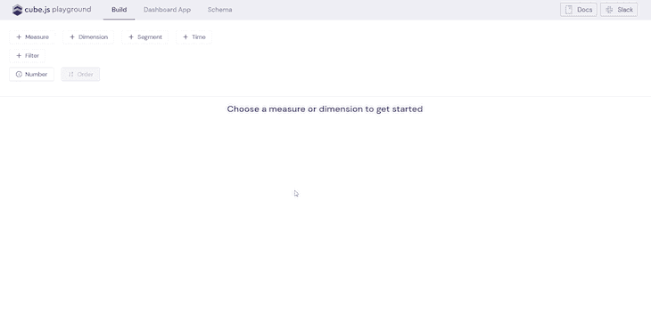
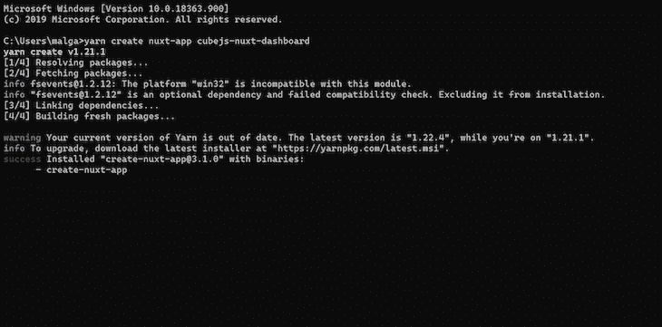
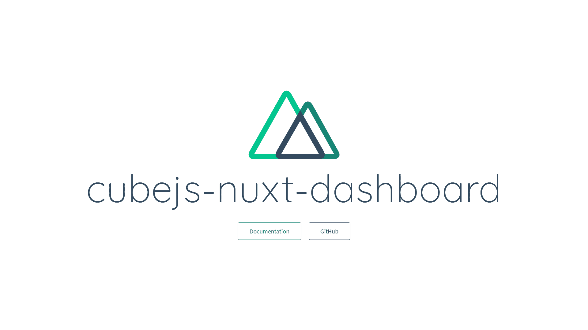
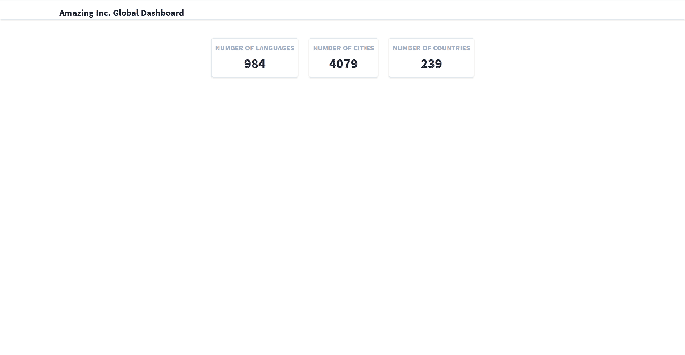

# 用 Cube.js 和 Highcharts 构建 Nuxt.js 仪表板应用程序

> 原文：<https://blog.logrocket.com/building-a-nuxt-js-dashboard-application-with-cube-js-and-highcharts/>

在当今世界，决策是由数据驱动的。数据是新的石油，数据在当今世界扮演的角色显而易见。

然而，数据本身并没有给我们带来太多好处。洞察力是真正的工具。从看似无意义的数据中快速获得洞察力的能力是一项日益重要的技能。

数据科学和数据分析等职业中的商业智能技能需求很大。作为一名数据科学家，你的工作是从数据中获得洞察力，看到大多数人看不到的东西，并以易于理解的格式呈现出来。

这就是图表的用武之地。

图表是处理数据不可或缺的一部分。它们有助于将大量数据压缩成易于理解的格式。由图表驱动的数据可视化往往可以轻松地向第一次查看数据的人显示见解，并向无法看到原始数据的其他人展示发现。

当我们试图自动化获得洞察力并以图表显示它们的过程时，出现了一个问题。

对于大多数组织来说，他们的数据到处都是(当然也是)非常独特的。这使得构建有意义的界面或仪表板来表示这些数据变得很麻烦。

这就是 [Cube.js](https://cube.dev/) 大放异彩的地方。

Cube.js 是一个开源分析框架，它提供由分析服务器基础设施支持的可视化无关前端 SDK 和 API。这是对“我们帮助您使用您喜欢的任何前端框架可视化数据，并为您提供一个强大的服务器来支持这一切”的巧妙描述

> 注意:我知道它只说分析，但是嘿，为什么就此打住。

在本教程中(如标题所示)，我们将构建一个 Nuxt.js 仪表板应用程序，用 Cube.js 和 Highcharts 显示来自数据库的见解。

我们完成的应用程序将如下所示:


激动人心！

看看 [GitHub 回购](https://github.com/malgamves/nuxt-dashboard)。

## 了解 Cube.js

Cube.js 是一个用于构建分析性 web 应用程序的开源模块化框架。它主要用于构建内部商业智能工具。

Cube.js 最大的优点是它能够在构建定制和大规模分析功能时最大限度地减少开发人员的工作量。它旨在处理大规模数据集，并通过提供任何(如果不是全部)所需的基础设施，使构建分析成为一种乐趣。

Cube.js 有一个非常简单的工作流程:

*   用 npm 或 Yarn 安装 Cube.js CLI
*   连接到您的数据库
*   定义您的数据模式
*   可视化结果

在开始在 Nuxt 中构建仪表板之前，我们将浏览每个步骤。

为了顺利阅读这篇文章，你需要提前在你的设备上安装一个 LTS 版本的[node . js](https://nodejs.org/en/download/)——要么是 [Yarn](https://yarnpkg.com/getting-started/install) 要么是 [npm](https://www.npmjs.com/get-npm) 和 [PostgreSQL](https://www.postgresql.org/download) 。同样值得一提的是，你需要对 JavaScript 和 Vue.js 有一个基本的了解。

让我们开始吧。

**安装 Cube.js CLI** 
运行`yarn global add cubejs-cli`安装 Cube.js CLI。这用于各种 Cube.js 工作流。

**连接您的数据库** 
我们将为我们的数据库使用世界国家、语言和城市数据的 SQL 数据转储。

在您的终端中运行以下命令，下载转储文件并将其添加到您定义的新数据库中:

```
createdb sample-data
curl https://raw.githubusercontent.com/malgamves/nuxt-dashboard/master/world.sql > world.sql
psql --dbname sample-data -f world.sql
```

然后，我们用`-d`标志设置一个新的 Cube.js 项目，以指定我们正在使用 PostgreSQL 数据库。

* * *

### 更多来自 LogRocket 的精彩文章:

* * *

为此，请在您的终端中运行以下命令:

```
cubejs create database -d postgres
```

项目设置完成后，将创建一个名为 database 的新文件夹。导航到它并编辑您的。环境文件。

你的。env 文件将如下所示:

```
CUBEJS_DB_HOST=<Host Name>
CUBEJS_DB_NAME=<Database Name>
CUBEJS_DB_USER=<Postgres User>
CUBEJS_DB_PASS=<Postgres Password>
...
```

如果您在本地工作，`CUBEJS_DB_HOST`应该是`localhost`，除非您更改了配置。

类似地，`CUBEJS_DB_NAME`将是`sample-data`，因为这是我们从数据转储中创建的新数据库。然后，根据您的凭证，给`CUBEJS_DB_USER`和`CUBEJS_DB_PASS`适当的值。

编辑完您的。env 文件，通过在终端中运行`yarn dev`来重启 Cube.js 服务器。然后你可以在浏览器中打开 [http://localhost:4000](http://localhost:4000) 。

Cube.js 有一个 web 应用程序，可以帮助我们探索数据、定义数据模式和建立数据模型。

你可以把它想象成某种沙箱，在构建我们的自定义可视化之前，可以进行一些可能的可视化实验。

> Cube.js 有多种部署后端的方式。这个[指南](https://cube.dev/docs/deployment)是一个很好的资源。目前，我们将在本地完成这项工作。

**定义数据模式**

如果您还没有找到，请导航到 [http://localhost:4000](http://localhost:4000) 。

在 Schema 选项卡下，勾选 public 下的所有三个框，单击 **+** ，然后选择**生成模式**。


这将生成一个 [cube.js 模式](https://github.com/cube-js/cube.js#3-define-your-data-schema)来将原始数据建模成有意义的业务定义。

现在剩下的就是可视化我们的数据了。

**可视化结果**

https://localhost:4000 上的 Cube.js 让我们可以访问某种沙盒应用程序来处理我们数据库中的数据。

我们希望将“国家语言计数”度量可视化，并观察“国家语言等同于官方语言”维度，以创建一个饼图。

因此，在构建部分，单击测量并选择“国家语言计数”。然后，点击 dimension 并选择“Count Language isofficial”。应该会出现一个带有值的表。但是，我们需要一个饼图，因此将图表类型从表格更改为饼图:



> 展望未来，区分度量和维度非常重要，因为这将有助于我们在 Nuxt 前端构建图表。

我们对图表和想要显示的数据有一个概念。现在，我们必须使用 Cube.js 客户端，用 Nuxt.js 在自定义前端显示图表。

## 连接到您的 Nuxt 前端

我们现在开始使用 Nuxt 前端。

在您的项目根目录中，通过运行`yarn create nuxt-app cubejs-nuxt-dashboard`将项目放在一起，初始化您的项目前端。

如果您对配置选项有问题，这将帮助您选择:



> 注意:一定要选择 Tailwind CSS 作为你的首选 UI 库，因为这是我们用于样式的库。



初始化 Nuxt 应用程序后，将创建一个名为`cubejs-nuxt-dashboard`的新文件夹。运行`cd cubejs-nuxt-dashboard`导航到它。

我们可以开始构建组成我们的应用程序的组件。在`./components`中，创建一个名为 containers 的新文件夹，然后创建一个名为 Base.vue 的文件，并在其中粘贴以下代码:

```
<template>
   <!-- Base Container to store all components -->
  <div class="container w-full mx-auto pt-10">
    <div class="w-full px-4 md:px-0 md:mt-8 mb-16 text-gray-800 leading-normal">
      <slot></slot>
    </div>
  </div>
</template>
```

Base.vue 将确保我们添加到其中的每个组件都保持在屏幕内，并且对齐良好。

导航条很好，所以我们将创建一个。

在`./layouts`中，创建一个名为 navbar.vue 的新文件，并在其中粘贴以下代码:

```
&lt;template&gt;
  &lt;nav id=&quot;header&quot; class=&quot;bg-white fixed w-full z-10 top-0 shadow&quot;&gt;
    &lt;div
      class=&quot;w-full container mx-auto flex flex-wrap items-center mt-0 pt-3 pb-3 md:pb-0&quot;
    &gt;
      &lt;div class=&quot;w-1/2 pl-2 md:pl-0&quot;&gt;
        &lt;a
          class=&quot;text-gray-900 text-base xl:text-xl no-underline hover:no-underline font-bold&quot;
          href=&quot;#&quot;
        &gt;
          &lt;i class=&quot;fas fa-sun text-orange-600 pr-3&quot;&gt;&lt;/i&gt; Amazing Inc. Global
          Dashboard
        &lt;/a&gt;
      &lt;/div&gt;
    &lt;/div&gt;
  &lt;/nav&gt;
&lt;/template&gt;
```

我们希望导航栏成为布局的一部分，出现在每个页面路径上，所以我们将它添加到`./layouts/default.vue`中。

我们导入 navbar 组件，并将其添加到布局中的`<nuxt />`上方，这里是`./pages`中所有页面的位置。您的 default.vue 文件应该如下所示:

```
<template>
  <div>
    <navbar />
    <nuxt />
  </div>
</template>

<script>
import Navbar from "~/layouts/navbar.vue";
export default {
  components: {
    Navbar
  },
  head: {
    title: "Amazing Inc. Global Dashboard"
  }
};
</script>
....
```

我们的导航条打开了。现在我们可以开始设置 Cube.js 客户机了。导航到`./pages`并将以下代码粘贴到 index.vue 中:

```
<template>
  <BaseContainer>
    <h1> Hi </h1>
  </BaseContainer>
</template>
<script>
// Importing Cube.js client libraries
import cubejs from "@cubejs-client/core";
import { QueryRenderer } from "@cubejs-client/vue";
import BaseContainer from "~/components/containers/Base.vue";

// Our Cube.js Key and API URL
const cubejsApi = cubejs(
  "Your API Key ",
  { apiUrl: "http://localhost:4000/cubejs-api/v1" }
);
export default {
  components: {
    QueryRenderer,
    BaseContainer,
  },
  data() {
    return {
      cubejsApi,
      // Defining Cube.js querys
      continentQuery: {
        measures: ["Country.count"],
        dimensions: ["Country.continent"]
      },
      cityQuery: {
        measures: ["City.count"]
      },
      languageCountQuery: {
        measures: ["Countrylanguage.count"]
      },
      countryQuery: {
        measures: ["Country.count"]
      },
      languageQuery: {
        measures: ["Countrylanguage.count"],
        dimensions: ["Countrylanguage.isofficial"]
      }
    };
  },
  methods: {},
  mounted() {}
};
</script>
```

在上面的代码中，我们初始化 Cube.js 客户端并导入`QueryRenderer`，我们将使用它将数据从 Cube.js 传递到图表中。

我们还添加了我们的 Cube.js API 键(您可以在`./database`中找到它)并定义了一些查询。注意前面的测量和尺寸的使用。

这些查询和与之相关联的字符串指定了您试图从数据库中获取的数据，以便您可以使用您选择的任何图表库直接可视化这些数据。

在初始化 Cube.js 并定义了 index.vue 中的可视化将使用的查询之后，我们必须创建组件来显示这些查询的结果。我们将从在卡片上显示来自只有测量的查询的数字开始。

通过研究数据库中的数据，您会注意到我们有国家、语言和城市数据。我们希望获得这些项目的计数，并显示每个项目。

在`./components`中，创建一个名为 CityCard.vue 的新文件，并在其中粘贴以下代码:

```
<template>
  <!-- A card to display cube.js data -->
  <div class="w-full  p-3">
    <div class="bg-white border rounded shadow p-2">
      <div class="flex flex-row items-center">
        <div class="flex-1 text-right md:text-center">
          <h5 class="font-bold uppercase text-gray-500">{{ title }}</h5>
          <h3 class="font-bold text-3xl">
            {{ chartdata }}
          </h3>
        </div>
      </div>
    </div>
  </div>
</template>
<script>
export default {
  props: {
    resultSet: {
      type: Object,
      required: true
    },
    title: {
      type: String,
      required: true
    }
  },
  computed: {
    chartdata() {
      // Storing cube.js query result
      const result = this.resultSet.loadResponse.data[0]["City.count"];
      return result;
    }
  }
};
</script>
```

在这个文件中，我们将`resultSet`和`title`作为道具。`resultSet`是来自我们的 Cube.js 查询的响应。

然后我们解析`chartdata()`中的响应，并返回一个包含我们想要显示的数字的结果。

类似地，我们创建另外两张名为`CountryCard.vue`和`LanguageCard.vue`的卡，并将上面的代码粘贴到其中，只是在`CountryCard.vue`中将“City.count”替换为“Country.count”，在`LanguageCard.vue`中替换为“Countrylanguage.count”。

在我们看到应用程序的外观之前，我们需要向我们的`./pages/index.vue`文件添加一些代码:

```
<template>
  <BaseContainer>
    <div class="flex justify-center">
      <!-- Using Cube.js Query Renderer to pass query results as props -->
      <query-renderer :cubejs-api="cubejsApi" :query="languageCountQuery">
        <template v-slot="{ loading, resultSet }">
          <LanguageCard
            title="Number of Languages"
            v-if="!loading"
            :result-set="resultSet"
          />
        </template>
      </query-renderer>
      <!-- Using Cube.js Query Renderer to pass query results as props -->
      <query-renderer :cubejs-api="cubejsApi" :query="cityQuery">
        <template v-slot="{ loading, resultSet }">
          <CityCard
            title="Number of Cities"
            v-if="!loading"
            :result-set="resultSet"
          />
        </template>
      </query-renderer>
      <!-- Using Cube.js Query Renderer to pass query results as props -->
      <query-renderer :cubejs-api="cubejsApi" :query="countryQuery">
        <template v-slot="{ loading, resultSet }">
          <CountryCard
            title="Number of Countries"
            v-if="!loading"
            :result-set="resultSet"
          />
        </template>
      </query-renderer>
    </div>
  </BaseContainer>
</template>
<script>
// Importing Cube.js client libraries
import cubejs from "@cubejs-client/core";
import { QueryRenderer } from "@cubejs-client/vue";
// Importing our application components
import BaseContainer from "~/components/containers/Base.vue";
import CityCard from "~/components/CityCard.vue";
import CountryCard from "~/components/CountryCard.vue";
import LanguageCard from "~/components/LanguageCard.vue";

...

export default {
  components: {
    QueryRenderer,
    BaseContainer,
    CityCard,
    CountryCard,
    LanguageCard
  },

...
};
</script>
```

现在应该是这样的:



Cube.js 已连接并正常工作，这意味着我们现在可以添加图表了。

我们将从饼状图开始。我们的图表将由一个名为[高度图表](https://www.highcharts.com/)的 JavaScript 图表库提供支持。导航至`./cubejs-nuxt-dashboard`并运行`yarn add vue2-highcharts`以安装 Highcharts。

在`./components`中，创建一个名为 PieChart.vue 的文件:

```
<template>
  <!-- An Pie chart using Highcharts -->
  <div class="w-full md:w-1/2 p-3">
    <vue-highcharts :options="chartdata" ref="pieChart"></vue-highcharts>
  </div>
</template>
<script>
// Importing Highcharts
import VueHighcharts from "vue2-highcharts";
export default {
  components: {
    VueHighcharts
  },
  props: {
    resultSet: {
      type: Object,
      required: true
    }
  },
  computed: {
    chartdata() {
      // Storing cube.js query result
      const result = this.resultSet.loadResponse.data;
      const setOne = [];
      result.forEach(function(item) {
        setOne.push(
          item["Countrylanguage.isofficial"].toString(),
          parseInt(item["Countrylanguage.count"])
        );
      });
      const setTwo = setOne.splice(0, 2);
      const pieData = [];
      pieData.push(setOne);
      pieData.push(setTwo);
      // This is the graphs data input,
      // edit this to change the graph
      const chartdata = {
        chart: {
          type: "pie",
          options3d: {
            enabled: true,
            alpha: 45
          }
        },
        title: {
          text: "Global Count of Official Languages"
        },
        plotOptions: {
          pie: {
            innerSize: 100,
            depth: 45
          }
        },
        series: [
          {
            name: "Number of languages",
            data: pieData
          }
        ]
      };
      return chartdata;
    }
  }
};
</script>
```

就像纸牌一样，我们有`resultSet`作为道具。`resultSet`是我们的 Cube.js 查询的响应。

然后我们解析`chartdata()`中的响应，执行一些数据操作，使我们收到的数据很容易添加到图表中。然后我们返回`chartdata`，它将被用作图表的数据输入。

我们的条形图也是如此。在`./components`中，创建一个名为 BarChart.vue 的文件，并在其中粘贴以下代码:

```
<template>
  <!-- An Bar chart using Highcharts -->
  <div class="w-full md:w-1/2 p-3">
      <vue-highcharts :options="chartdata" ref="barChart"></vue-highcharts>
  </div>
</template>
<script>
// Importing Highcharts
import VueHighcharts from "vue2-highcharts";
import Highcharts from "highcharts";
export default {
  components: {
    VueHighcharts,
  },
  props: {
    resultSet: {
      type: Object,
      required: true
    }
  },
  computed: {
    chartdata() {
      // Storing cube.js query result
      const result = this.resultSet.loadResponse.data;
      const data = [];
      const fin = [];
      const labels = [];
      result.forEach(function(item) {
        labels.push(item["Country.continent"]);
        data.push(parseInt(item["Country.count"]));
      });
      for (let i = 0; i < data.length; i++) {
        fin.push({
          Continent: labels[i],
          Count: data[i]
        });
      }
      // This is the charts data input,
      // edit this to change the chart
      const chartdata = {
        chart: {
          type: "bar"
        },
        title: {
          text: "Global Country Count by Continent"
        },
        xAxis: {
          categories: labels,
          title: {
            text: null
          }
        },
        yAxis: {
          min: 0,
          title: {
            text: "Number of Countries",
            align: "high"
          },
          labels: {
            overflow: "justify"
          }
        },
        plotOptions: {
          bar: {
            dataLabels: {
              enabled: true
            }
          }
        },
        legend: {
          layout: "horizontal",
          align: "right",
          verticalAlign: "top",
          x: -40,
          y: 80,
          floating: true,
          borderWidth: 1,
          backgroundColor:
            (Highcharts.theme && Highcharts.theme.legendBackgroundColor) ||
            "#FFFFFF",
          shadow: true
        },
        credits: {
          enabled: false
        },
        series: [
          {
            name: "Current Data",
            data: data
          }
        ]
      };
      return chartdata;
    }
  }
};
</script>
```

我们已经构建了两个图表组件。现在我们可以将它们添加到 index.vue 文件中:

```
<template>
  <BaseContainer>
    ...
    <div class="flex flex-row flex-wrap flex-grow mt-2">
      <!-- Using Cube.js Query Renderer to pass query results as props -->
      <query-renderer :cubejs-api="cubejsApi" :query="continentQuery">
        <template v-slot="{ loading, resultSet }">
          <Bar v-if="!loading" :result-set="resultSet" />
        </template>
      </query-renderer>
      <!-- Using Cube.js Query Renderer to pass query results as props -->
      <query-renderer :cubejs-api="cubejsApi" :query="languageQuery">
        <template v-slot="{ loading, resultSet }">
          <Pie v-if="!loading" :result-set="resultSet" />
        </template>
      </query-renderer>
    </div>
  </BaseContainer>
</template>
<script>
// Importing Cube.js client libraries
import cubejs from "@cubejs-client/core";
import { QueryRenderer } from "@cubejs-client/vue";
// Importing our application components
import BaseContainer from "~/components/containers/Base.vue";
import Bar from "~/components/BarChart.vue";
import Pie from "~/components/PieChart.vue";
import CityCard from "~/components/CityCard.vue";
import CountryCard from "~/components/CountryCard.vue";
import LanguageCard from "~/components/LanguageCard.vue";
...
export default {
  components: {
    Bar,
    Pie,
    QueryRenderer,
    BaseContainer,
    CityCard,
    CountryCard,
    LanguageCard
  },
  ...
};
</script>
```

您应该立即运行您的应用程序并…

菲尼托！


## 结论

我们刚刚使用 Nuxt.js 和 Cube.js 构建了一个应用程序。我们向 Cube.js 添加了一个数据库，并利用它的“沙箱”来处理数据，然后使用 Highcharts 创建自定义可视化。这是 Cube.js 功能的一个非常基本的例子，也是一个非常基本的数据库。

你可以用 Cube.js 做更多的事情——改变或使用其他数据库，改变图表库等等..

如果你想做点什么，一定要在我的推特上和我分享，或者只是打个招呼——不要有压力。我希望你喜欢这个教程。

下次见。

## 使用 [LogRocket](https://lp.logrocket.com/blg/signup) 消除传统错误报告的干扰

[](https://lp.logrocket.com/blg/signup)

[LogRocket](https://lp.logrocket.com/blg/signup) 是一个数字体验分析解决方案，它可以保护您免受数百个假阳性错误警报的影响，只针对几个真正重要的项目。LogRocket 会告诉您应用程序中实际影响用户的最具影响力的 bug 和 UX 问题。

然后，使用具有深层技术遥测的会话重放来确切地查看用户看到了什么以及是什么导致了问题，就像你在他们身后看一样。

LogRocket 自动聚合客户端错误、JS 异常、前端性能指标和用户交互。然后 LogRocket 使用机器学习来告诉你哪些问题正在影响大多数用户，并提供你需要修复它的上下文。

关注重要的 bug—[今天就试试 LogRocket】。](https://lp.logrocket.com/blg/signup-issue-free)