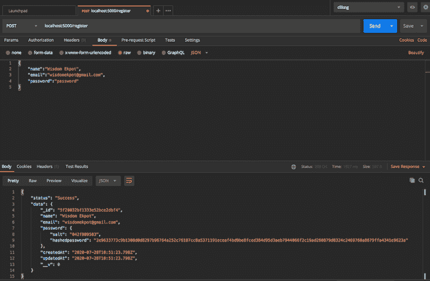
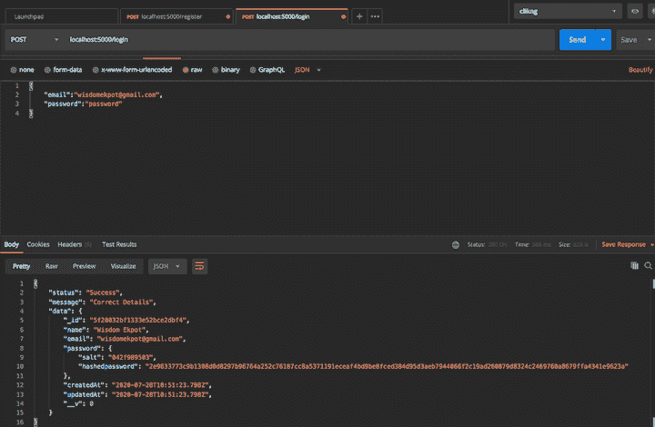

# 在 Node.js 中构建密码散列器

> 原文：<https://blog.logrocket.com/building-a-password-hasher-in-node-js/>

哈希是指使用算法将任意大小的数据映射到固定长度。这是一个单向函数，主要用于身份验证。

在本教程中，我们将向您展示如何构建一个密码散列器来散列和存储数据库中的用户凭证。

为此，我们将使用一种称为 salt hashing 的技术。salt 是一个随机的数据片段，用作散列数据或密码的单向函数的附加输入。Salts 用于保护存储中的密码，因此您可以避免在数据库中存储明文密码。

根据 salt 散列技术，我们将获取用户输入的密码和随机字符串(salt)，使用合适的加密散列算法对组合字符串进行散列，并将结果存储在数据库中。

## **先决条件**

要跟随本教程，您需要:

*   基本了解 Node.js
*   安装了代码编辑器，如 VS 代码
*   邮递员已安装
*   MongoDB 设置

## 编写散列函数

基本上，我们将有三个功能来执行以下任务。

1.  生成 salt(随机加密字符串)
2.  散列数据
3.  比较哈希值

要设置 Node.js 应用程序，您需要一个`package.json`文件来记录依赖关系。要创建它，请在您的终端上运行以下命令。

```
npm init -y

```

接下来，创建一个`index.js`文件。这是应用程序的根，我们将在这里编写所有的哈希代码。

```
touch index.js

```

这将创建`index.js`文件。

将以下内容添加到您的`index.js`文件中。

```
console.log(`Hello...I'm a nodejs developer`)

```

然后，在您的终端上运行`node index`。如果控制台上有`Hello...I'm a nodejs developer`字样，就可以开始了。

我们首先需要 Node.js 加密模块，然后创建一个简单的函数来记录控制台上的函数。

```
'use strict';
let crypto = require('crypto');
// logger 
let logger = func => {
    console.log(func);
};

```

下一步是创建一个函数来生成随机盐。这个函数将接受一个数字作为参数来定义盐的长度。我们将添加一个简单的验证器来检查数字是否大于 15。

```
let generateSalt = rounds => {
    if (rounds >= 15) {
        throw new Error(`${rounds} is greater than 15,Must be less that 15`);
    }
    if (typeof rounds !== 'number') {
        throw new Error('rounds param must be a number');
    }
    if (rounds == null) {
        rounds = 12;
    }
    return crypto.randomBytes(Math.ceil(rounds / 2)).toString('hex').slice(0, rounds);
};
logger(generateSalt(12))

```

在控制台上运行`node index`打印生成的随机字符串。`.toString('hex')`方法将字符串转换成十六进制格式，而`slice(0, rounds)`只返回所需值的数字。

接下来，我们将定义散列算法来执行散列和加盐逻辑。我们将使用`**crypto.createHmac(algorithm, key[, options])**`，它创建并返回一个使用给定的`algorithm`和`key`的`Hmac`对象。我们还将使用`sha512`算法。第二个参数将是关键，这是我们传递盐的地方。

```
let hasher = (password, salt) => {
    let hash = crypto.createHmac('sha512', salt);
    hash.update(password);
    let value = hash.digest('hex');
    return {
        salt: salt,
        hashedpassword: value
    };
};

```

有了这个定义，我们将编写我们的散列函数，它将调用 hasher 函数。我们将在这里执行所有的验证，比如确保 salt 是一个字符串，提供了一个简单的密码，并且在参数中提供了 password 和 salt。

```
let hash = (password, salt) => {
    if (password == null || salt == null) {
        throw new Error('Must Provide Password and salt values');
    }
    if (typeof password !== 'string' || typeof salt !== 'string') {
        throw new Error('password must be a string and salt must either be a salt string or a number of rounds');
    }
    return hasher(password, salt);
};
logger(hash('Wisdom', generateSalt(12)))

```

首先验证是否提供了 salt 和普通密码，然后检查 password 和 salt 是否都是字符串类型。

使用我们的日志功能来测试您的功能。运行`node index`将在控制台上打印散列密码和 salt。

* * *

### 更多来自 LogRocket 的精彩文章:

* * *

```
{
  salt: 'f844b09ff50c',
  hashedpassword: '2d2528d4534394d1e2702f53826d11c16ed4422f6bd466745cb4f1aa0e042b52b98fc5e65b86d73a6ce4807679b773fb955c4824b0471015354e1a872d42cb62'
}

```

复制并保存在一个变量中。我们稍后将使用它来测试比较密码功能。

在此之前，我们必须定义比较密码函数。这实际上将使用相同的算法来散列输入的密码，然后测试新的散列是否与存储的散列匹配。

```
let compare = (password, hash) => {
    hash = {
        salt: 'f844b09ff50c',
        hashedpassword: '2d2528d4534394d1e2702f53826d11c16ed4422f6bd466745cb4f1aa0e042b52b98fc5e65b86d73a6ce4807679b773fb955c4824b0471015354e1a872d42cb62'
    }
    if (password == null || hash == null) {
        throw new Error('password and hash is required to compare');
    }
    if (typeof password !== 'string' || typeof hash !== 'object') {
        throw new Error('password must be a String and hash must be an Object');
    }
    let passwordData = hasher(password, hash.salt);
    if (passwordData.hashedpassword === hash.hashedpassword) {
        return true;
    }
    return false
};
logger(compare('wisdom'))

```

这个函数接受输入的密码和一个散列作为参数。出于测试目的，我们将使用我们得到的 salt 和 hashed 密码来测试 compare password 函数。

我们将编写一些验证来检查是否提供了密码或哈希，以及密码的类型是否是字符串，哈希的类型是否是对象，其中包含 salt 值和哈希密码。

然后，我们将使用相同的`hasher`函数散列新输入的密码，然后检查新散列密码是否等于存储在数据库中的密码。如果匹配，则返回值`true`；否则，它将成为`false`。

要使用 hasher 函数，您必须通过在文件末尾添加以下内容来导出它。

```
 module.exports = {
    generateSalt,
    hash,
    compare
}

```

## 散列函数在起作用

现在我们可以开始使用 hasher 函数来注册和登录用户。我们将通过以下方式简化事情:

*   设置简单快速服务器
*   设置 MongoDB
*   创建必要的路线

让我们创建一个`test.js`文件。这是我们测试哈希模块的地方。

首先安装以下软件包。

*   用于设置我们的服务器和路线
*   `mongoose`对于 MongoDB 的连接和查询
*   `morgan`为伐木路线
*   `body-parser`接受 JSON 类型的请求

要安装这些，请打开您的终端并运行:

```
npm i express mongoose morgan body-parser --save

```

这将安装所有的包并在`package.json`文件中记录活动。

它还将创建一个`node_modules`文件夹，我们需要向其中添加一个`.gitignore`文件，这样它就不会在 Git 上被提交。

我们需要修改`test.js`中的代码。

```
const express = require('express');
const morgan = require('morgan');
const bodyParser = require('body-parser');
const mongoose = require('mongoose');
const port = process.env.PORT || 5000;
const app = express();

// Defining middlewares
app.use(morgan('dev'));
app.use(bodyParser.json());

mongoose.Promise = global.Promise;
// Connecting to the database
mongoose.connect('mongodb://localhost:27017/hasher', {
    useNewUrlParser: true
}).then(() => {
    console.log("Successfully connected to the database");
}).catch(err => {
    console.log('Could not connect to the database. Exiting now...', err);
    process.exit();
});

app.listen(port, () => {
    console.log('App is Running on port', port)
});

```

在这里，我们需要安装和配置所有的包。我们使用`mongoDB`ORM(mongose)连接到 MongoDB 本地服务器，然后使用 express 的实例监听一个`PORT`。

下一步是使用 Mongoose 定义我们的`User`模型。创建一个`user.model.js`文件并添加以下内容。

```
const mongoose = require('mongoose');
const userSchema = mongoose.Schema({
    name: {
        type: String,
        required: true
    },
    email: {
        type: String,
        required: true
    },
    password: {
        type:Object,
        required: true
    }
}, {
    timestamps: true
});
module.exports = mongoose.model('User', userSchema);

```

我们现在可以定义我们的注册和登录路径来测试 hasher。

我们将创建一个`user.routes.js`。为了简单起见，我们将在一个文件中编写我们的写逻辑和业务逻辑。

首先定义注册路由。

```
 module.exports = (app) => {
     const User = require('./user.model')
     const {
         generateSalt,
         hash,
         compare
     } = require('./index');
     let salt = generateSalt(10);
     app.post('/register', async (req, res) => {
         try {
             let user = new User({
                 name: req.body.name,
                 email: req.body.email,
                 password: await hash(req.body.password, salt) // dont remove the await
             })
             let response = await user.save();
             res.status(200).json({
                 status: "Success",
                 data: response
             })
         } catch (err) {
             //handle error
         }
     });
 }

```

接下来，在`test.js`文件中注册。这必须归入猫鼬构型。

```
require('./user.routes')(app);

```

现在我们可以测试注册路由。打开您的邮递员，按照您定义的模式向`/register`发出 post 请求。





在这里，我们将我们的`hashedpassword`和`salt`存储在数据库中。

接下来，实现登录路由。

```
 app.post('/login', async (req, res) => {
         try {
             let {
                 email,
                 password
             } = req.body;
             let user = await User.findOne({
                 email: email
             })
             if (!user) {
                 return res.status(400).json({
                     type: "Not Found",
                     msg: "Wrong Login Details"
                 })
             }
             let match = await compare(password, user.password);
             if (match) {
                 res.status(200).json({
                     status: "Success",
                     message: "Correct Details",
                     data: user
                 })
             }
         } catch (err) {
             // handle error
         }
     })

```

确保将其添加到`exports`对象中。移除`index.js`文件中比较函数中的`hash`对象。

```
// hash = {
    //     salt: 'f844b09ff50c',
    //     hashedpassword: '2d2528d4534394d1e2702f53826d11c16ed4422f6bd466745cb4f1aa0e042b52b98fc5e65b86d73a6ce4807679b773fb955c4824b0471015354e1a872d42cb62'
    // }

```

在 POSTMAN 上测试您的代码将产生以下结果。


我们的密码哈希器工作正常！

## 结论

在本指南中，我们演示了 salting 如何在 Node.js crypto 中工作。它仍然有一些缺陷，所以我不建议在生产中使用它。更好的工具，比如`Bcrypt`，更适合生产应用。

源代码可以在 [GitHub](https://github.com/Wisdom132/nodehasher) 上获得。

## 200 只显示器出现故障，生产中网络请求缓慢

部署基于节点的 web 应用程序或网站是容易的部分。确保您的节点实例继续为您的应用程序提供资源是事情变得更加困难的地方。如果您对确保对后端或第三方服务的请求成功感兴趣，

[try LogRocket](https://lp.logrocket.com/blg/node-signup)

.

[](https://lp.logrocket.com/blg/node-signup)[https://logrocket.com/signup/](https://lp.logrocket.com/blg/node-signup)

LogRocket 就像是网络和移动应用程序的 DVR，记录下用户与你的应用程序交互时发生的一切。您可以汇总并报告有问题的网络请求，以快速了解根本原因，而不是猜测问题发生的原因。

LogRocket 检测您的应用程序以记录基线性能计时，如页面加载时间、到达第一个字节的时间、慢速网络请求，还记录 Redux、NgRx 和 Vuex 操作/状态。

[Start monitoring for free](https://lp.logrocket.com/blg/node-signup)

.