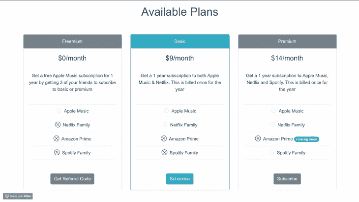
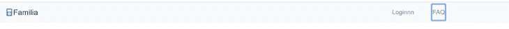
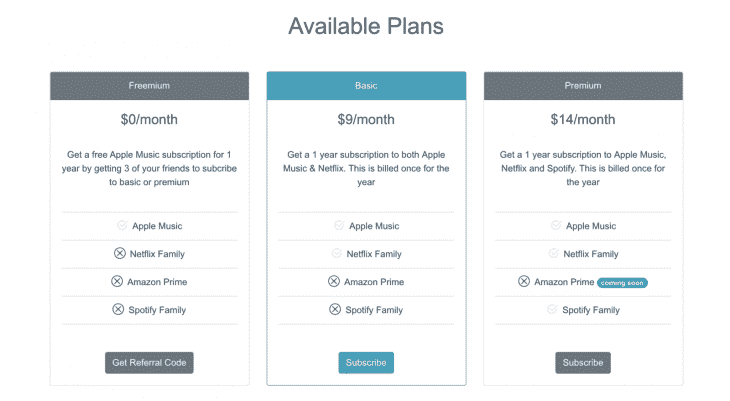

# 使用 BootstrapVue 在 Vue.js 中构建定价组件

> 原文：<https://blog.logrocket.com/building-a-pricing-component-in-vue-js-with-bootstrapvue/>

## 介绍

Vue.js 是由尤雨溪创建的 JavaScript 库，由核心团队和 260 多个社区成员共同维护。它是一个易于接近的核心库，只关注视图层，并拥有一个庞大的支持库生态系统，帮助您解决构建和维护大型单页面应用程序的复杂性。

在本文中，我们将介绍如何使用最流行的 Vue.js UI 库之一:BootstrapVue 来构建定价组件 UI。



## 开始之前…

本教程适合所有阶段的开发人员，包括初学者。下面是你在阅读本教程之前应该已经具备的一些东西:

## BootstrapVue

BootstrapVue 是一个 Vue JS UI 库，它允许您使用 Vue 在 web 上构建响应迅速、移动优先、ARIA 可访问的项目，利用市场上最大的 CSS 框架 Bootstrap 的最佳部分。

BootstrapVue 文档非常容易理解，就像 Bootstrap 文档本身一样易读。它还提供了足够的代码示例，帮助您开始使用您选择的任何组件。

## 构建我们的定价 UI 组件

科技产品的用户界面，尤其是初创公司的用户界面，几乎总是有一个非常相似的定价页面。BootstrapVue 提供了一种简单而直观的方式来创建组件，在本文中，我们将使用 card 组件来创建这些定价页面之一。

如果您从一开始就关注这篇文章，那么您已经安装了 vue-canvas starter 项目。启动 VS 代码并打开终端。选择一个新终端并运行下面的`v``ue add`命令来添加引导插件:

```
vue add bootstrap-vue
```

当它开始安装时，同意使用`babel/polyfill`，在更新了大约四个文件后，它将继续将`b``ootstrap-vue`插件添加到您的 Vue 项目中。现在，如果您导航到项目的根目录，您将看到一个新的插件文件夹，其中包含引导文件。内容应该是这样的:

```
import Vue from 'vue'
import BootstrapVue from 'bootstrap-vue'
import 'bootstrap/dist/css/bootstrap.min.css'
import 'bootstrap-vue/dist/bootstrap-vue.css'
Vue.use(BootstrapVue)
```

我们还必须在`b``ootstrap-vue`库中包含图标包，所以进入`src`文件并导入它们。您的`main.js`文件应该是这样的:

```
import '@babel/polyfill'
import 'mutationobserver-shim'
import Vue from 'vue'
import './plugins/bootstrap-vue'
import App from './App.vue'
import { BootstrapVueIcons } from 'bootstrap-vue'
import 'bootstrap-vue/dist/bootstrap-vue-icons.min.css'
Vue.use(BootstrapVueIcons)
Vue.config.productionTip = false
new Vue({
  render: h => h(App),
}).$mount('#app')
```

现在您已经在项目中设置了 Boostrap，我们将开始编写两部分的定价组件:标题和主体。

## 朗读者



我在 Bootstrap 文档中找到了 navbar 组件的代码，并修改它以适合我的设计。在模板部分内的`app.vue`文件中，将下面的代码块添加到带有应用程序 ID 的`div`标记内:

```
<div class="mt-0">
      <b-navbar toggleable="sm" type="light" variant="light" sticky>
        <b-navbar-toggle target="nav-text-collapse"></b-navbar-toggle>
<b-navbar-brand class="ml-0">
          <b-icon-music-player-fill class="h5 mr-0 mb-0 mt-0" style="color: #17a2b8;"></b-icon-music-player-fill>Familia
        </b-navbar-brand>
<b-collapse id="nav-text-collapse" is-nav>
          <b-navbar-nav>
            <b-nav-text class="aa" tabs align="right" v-b-modal.modal-3>Loginnn</b-nav-text>
            <b-nav-text class="ml-5" tabs align="right" v-b-modal.modal-7>FAQ</b-nav-text>
          </b-navbar-nav>
        </b-collapse>
      </b-navbar>
    </div>
```

您可以看到 BootstrapVue 库中的 Bootstrap 类仍然可用，这是一件很酷的事情，因为您不必忘记或学习任何新的东西来使用它。

## 身体



我们可以用来创建定价组件的最明显的 UI 元素是卡片。卡片可以有页眉、正文，甚至页脚，这基本上就是我们想要的定价层。将此复制到`app.vue`文件中的`header`代码块下:

```
<h1 class="mt-0">Available Plans</h1>
    <b-container align-v="center" class="container">
      <div class="mt-5">
        <b-card-group deck class="mb-3">
          <!-- card 1 -->
          <b-card
            border-variant="default"
            header="Freemium"
            header-bg-variant="secondary"
            header-text-variant="white"
            align="center"
            title="$0/month"
            tag="article"
            style="max-width: auto;"
            class="mb-5 mt-2">
            <br />
            <b-card-text>
              Get a free Apple Music subscription for 1 year by
              getting 3 of your friends to subcribe to basic or premium
            </b-card-text>
            <b-list-group flush>
              <b-list-group-item></b-list-group-item>
              <b-list-group-item>
                <b-icon-check2-circle class="h5 mr-2 mb-0 mt-0" animation="fade"></b-icon-check2-circle>Apple Music
              </b-list-group-item>
              <b-list-group-item>
                <b-icon-x-circle class="h5 mr-2 mb-0 mt-0"></b-icon-x-circle>Netflix Family
              </b-list-group-item>
              <b-list-group-item>
                <b-icon-x-circle class="h5 mr-2 mb-0 mt-0"></b-icon-x-circle>Amazon Prime
              </b-list-group-item>
              <b-list-group-item>
                <b-icon-x-circle class="h5 mr-2 mb-0 mt-0"></b-icon-x-circle>Spotify Family
              </b-list-group-item>
              <b-list-group-item></b-list-group-item>
            </b-list-group>
            <br />
            <b-button v-b-modal.modal-2 variant="secondary">Get Referral Code</b-button>
            <br />
          </b-card> 
<!-- card 1 ends here-->
    </b-container>
```

你可以看到我们有`header`部分，上面写着`Freemium`、`Basic`或`Premium`，还有价格和描述。最后，每层都有一个服务列表。我们使用图标来吸引人们对所提供功能的更多关注。要添加剩下的两张卡，复制下面的代码块，就在`card 1 ends here`注释下面。

```
<!-- card 2 -->
          <b-card
            border-variant="info"
            header="Basic"
            header-bg-variant="info"
            header-text-variant="white"
            align="center"
            title="$9/month"
            tag="article"
            style="max-width: auto;"
            class="mb-5 mt-2">
            <br />
            <b-card-text>
              Get a 1 year subscription to both
              Apple Music & Netflix. This is billed once for the year
            </b-card-text>
            <b-list-group flush>
              <b-list-group-item></b-list-group-item>
              <b-list-group-item>
                <b-icon-check2-circle class="h5 mr-2 mb-0 mt-0" animation="fade"></b-icon-check2-circle>Apple Music
              </b-list-group-item>
              <b-list-group-item>
                <b-icon-check2-circle class="h5 mr-2 mb-0 mt-0" animation="fade"></b-icon-check2-circle>Netflix Family
              </b-list-group-item>
              <b-list-group-item>
                <b-icon-x-circle class="h5 mr-2 mb-0 mt-0"></b-icon-x-circle>Amazon Prime
              </b-list-group-item>
              <b-list-group-item>
                <b-icon-x-circle class="h5 mr-2 mb-0 mt-0"></b-icon-x-circle>Spotify Family
              </b-list-group-item>
              <b-list-group-item></b-list-group-item>
            </b-list-group>
            <br />
            <b-button v-b-modal.modal-1 variant="info">Subscribe</b-button>
            <br />
          </b-card>
          <!-- card 3 -->
          <b-card
            border-variant="default"
            header="Premium"
            header-bg-variant="secondary"
            header-text-variant="white"
            align="center"
            title="$14/month"
            tag="article"
            style="max-width: auto;"
            class="mb-5 mt-2">
            <br />
            <b-card-text>
              Get a 1 year subscription to
              Apple Music, Netflix and Spotify. This is billed once for the year
            </b-card-text>
            <b-list-group flush>
              <b-list-group-item></b-list-group-item>
              <b-list-group-item>
                <b-icon-check2-circle class="h5 mr-2 mb-0 mt-0" animation="fade"></b-icon-check2-circle>Apple Music
              </b-list-group-item>
              <b-list-group-item>
                <b-icon-check2-circle class="h5 mr-2 mb-0 mt-0" animation="fade"></b-icon-check2-circle>Netflix Family
              </b-list-group-item>
              <b-list-group-item>
                <b-icon-x-circle class="h5 mr-2 mb-0 mt-0"></b-icon-x-circle>Amazon Prime
                <b-badge variant="primary" pill>coming soon</b-badge>
              </b-list-group-item>
              <b-list-group-item>
                <b-icon-check2-circle class="h5 mr-2 mb-0 mt-0" animation="fade"></b-icon-check2-circle>Spotify Family
              </b-list-group-item>
              <b-list-group-item></b-list-group-item>
            </b-list-group>
            <br />
            <b-button v-b-modal.modal-1 variant="secondary">Subscribe</b-button>
          </b-card>
        </b-card-group>
      </div>
```

现在，您可以将它保存为 UI 定价组件，以便下次需要任何技术产品时使用。

## 结论

在本文中，我们回顾了 BootstrapVue 库，它允许您在 Vue 项目中使用 Bootstrap。我们通过以功能性的方式组合卡片、列表组、图标和导航条元素，创建了一个定价组件。现在你可以浏览 [Bootstrap-vue 文档](https://bootstrap-vue.js.org)并创建更多的 UI 组件。

## 像用户一样体验您的 Vue 应用

调试 Vue.js 应用程序可能会很困难，尤其是当用户会话期间有几十个(如果不是几百个)突变时。如果您对监视和跟踪生产中所有用户的 Vue 突变感兴趣，

[try LogRocket](https://lp.logrocket.com/blg/vue-signup)

.

[](https://lp.logrocket.com/blg/vue-signup)[https://logrocket.com/signup/](https://lp.logrocket.com/blg/vue-signup)

LogRocket 就像是网络和移动应用程序的 DVR，记录你的 Vue 应用程序中发生的一切，包括网络请求、JavaScript 错误、性能问题等等。您可以汇总并报告问题发生时应用程序的状态，而不是猜测问题发生的原因。

LogRocket Vuex 插件将 Vuex 突变记录到 LogRocket 控制台，为您提供导致错误的环境，以及出现问题时应用程序的状态。

现代化您调试 Vue 应用的方式- [开始免费监控](https://lp.logrocket.com/blg/vue-signup)。