# 使用 Hasura 和 Next.js 构建产品搜索克隆应用程序

> 原文：<https://blog.logrocket.com/building-a-product-hunt-clone-app-using-hasura-and-next-js/>

本教程将演示如何使用 [Hasura](https://hasura.io/) 和 [Next.js](https://nextjs.org/) 创建产品策展应用 [Product Hunt](https://www.producthunt.com/) 的克隆。我们将向您展示如何使用 Hasura 进行身份验证和授权，以及如何利用 GraphQL 从 Next.js 前端应用程序中读取和写入数据。

我们将在三个应用程序的上下文中讨论这些任务:

1.  使用 Next.js 的前端
2.  使用 Hasura 的后端(使用 Postgres 数据库)
3.  使用 Node.js 进行身份验证

整个项目可以在 [GitHub](https://github.com/ghoshnirmalya/product-hunt-clone-using-nextjs-and-hasura) 上找到。

## Next.js 和 Hasura 是什么？

我使用 [Next.js](https://blog.logrocket.com/whats-new-in-next-js-9-2/) 已经一年多了，对整体开发者体验很满意，因为它支持许多令人兴奋的特性，比如开箱即用的[服务器端渲染](https://nextjs.org/features/server-side-rendering)。

Hasura 是一个引擎，它自动生成 GraphQL APIs，以及用于创建、更新和删除 Postgres 数据库中的表和列的迁移文件。

## Hasura 入门

让我们从引导后端应用程序开始。

首先，我们需要安装 [Hasura CLI](https://docs.hasura.io/1.0/graphql/manual/hasura-cli/index.html#installation) 。安装完成后，我们可以初始化存储 Hasura GraphQL 迁移的目录。

```
hasura init --directory backend --endpoint http://localhost:8080 --admin-secret secret

```

关于旗帜`--directory`、`--endpoint`和`--admin-secret`的更多细节，参见官方[哈苏拉文档](https://docs.hasura.io/1.0/graphql/manual/hasura-cli/hasura_init.html#options)。

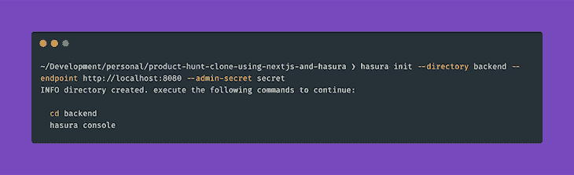

上述命令将创建一个后端目录。

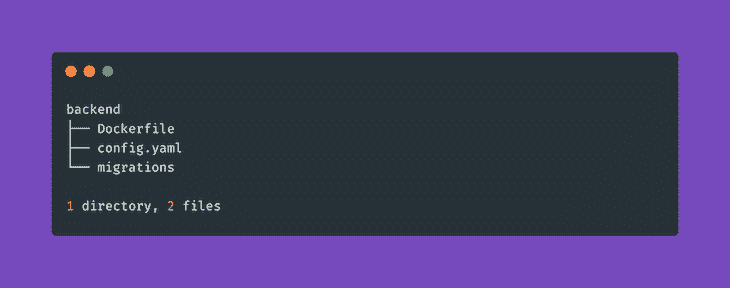

`config.yam`文件将包含以下内容。

```
// backend/config.yaml

admin_secret: secret
endpoint: http://localhost:8080

```

我们将使用 [Docker](https://blog.logrocket.com/docker-for-front-end-developers/) 来安装 Hasura。根据[官方文件](https://docs.docker.com/install/)，它支持 Mac、Windows 和 Linux。我们需要在后端目录中创建一个名为`Dockerfile`的新文件。

```
// backend/Dockerfile

FROM hasura/graphql-engine:v1.0.0
RUN mkdir /backend-app
WORKDIR /backend-app
COPY . /backend-app/

```

让我们也创建一个`.env`文件来存储 Hasura 的所有凭证。

```
// backend/.env

HASURA_GRAPHQL_DATABASE_URL=postgres://postgres:@db:5432/postgres
HASURA_GRAPHQL_ENABLE_CONSOLE=false
HASURA_GRAPHQL_MIGRATIONS_DIR=./migrations
ENDPOINT=http://localhost:8080
HASURA_GRAPHQL_ADMIN_SECRET=secret
HASURA_GRAPHQL_JWT_SECRET={"type": "RS256", "key": ""}

```

将凭证存储在环境文件中总是一个好主意。初始化身份验证应用程序后，我们将添加`HASURA_GRAPHQL_JWT_SECRET`。

这就是我们需要为后端应用程序编写的所有代码。当我们向数据库添加表和列时，迁移文件将自动生成。

## Next.js 入门

我们将在新的`frontend`目录中创建 Next.js 应用程序。我们也将对 Next.js 使用 Docker。

Next.js 有许多[例子](https://github.com/zeit/next.js/tree/canary/examples/with-docker)来引导我们的应用程序。我们将使用`[with-docker](https://github.com/zeit/next.js/tree/canary/examples/with-docker)`的例子。

```
yarn create next-app --example with-docker with-docker-app

```


上面的命令会生成一个`frontend`目录。

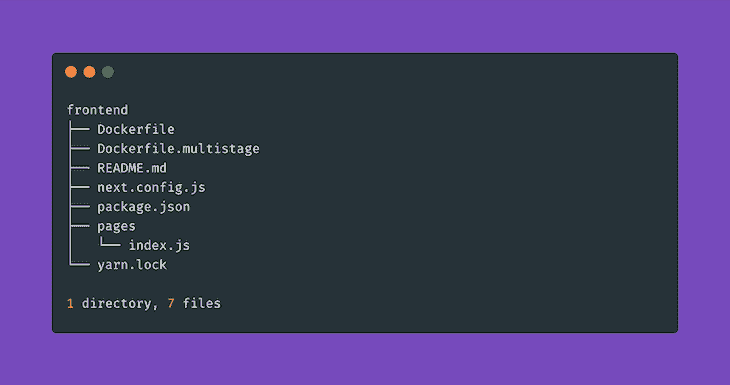

让我们用下面的内容来更新`Dockerfile`的内容。

```
// frontend/Dockerfile

FROM mhart/alpine-node:11.1.0
RUN mkdir /frontend-app
WORKDIR /frontend-app
RUN apk update && apk upgrade && apk add --no-cache bash git
COPY . /frontend-app/
RUN yarn install
EXPOSE 3000
CMD ["yarn", "dev"]

```

## 构建认证应用程序

我们将使用 [JWT](https://blog.logrocket.com/jwt-authentication-best-practices/) 、Hasura 声明和多个角色来设置我们的认证应用程序。我们将根据以下步骤使用[这个库](https://github.com/hasura/graphql-engine/tree/master/community/boilerplates/auth-servers/passportjs-jwt-roles)来初始化我们的应用程序。

1.  创建一个名为`authentication`的新目录

    ```
    mkdir authentication
    ```

2.  克隆存储库

    ```
    git clone https://github.com/hasura/graphql-engine
    ```

3.  访问`passportjs-jwt-roles`目录

    ```
    cd graphql-engine/community/boilerplates/auth-servers/passportjs-jwt-roles
    ```

4.  将该目录移动到我们刚刚创建的

    ```
    mv * ../../../../../authentication
    ```

    目录中
5.  在认证目录中创建一个内容为

    ```
    //authentication/.envDATABASE_URL=postgres://postgres:@db:5432/postgres
    ```

    的`.env`文件
6.  安装依赖项

    ```
    yarn install
    ```

7.  生成 RSA 密钥

    ```
    openssl genrsa -out private.pem 2048 openssl rsa -in private.pem -pubout > public.pem
    ```

8.  以转义格式打印密钥

    ```
    awk -v ORS='\n' '1' public.pem
    ```

9.  将输出添加到后端应用程序的`.env`文件中的`HASURA_GRAPHQL_JWT_SECRET`键中。

    ```
    // backend/.env  ... HASURA_GRAPHQL_JWT_SECRET={"type": "RS256", "key": "-----BEGIN PUBLIC KEY-----\nMIIBIjANBgkqhkiG9w0BAQEFAAOCAQ8AMIIBCgKCAQEAvdJnVbZrrfYGGrnZTQwq\nlOZGonXh5h6yDqN7Np1KRmz8EyZKulKn186StNt2TZJPyYdAcAH6vnB05LUS47VF\nv9eIaAn8952BnJe0NZ9o+90k03wADORNzzeNqmJWGn2YbBiJHNLDt21Zn9dbOWOE\nKjO7eWOuiKEYEyC/OW9+p+Z05ahCZvmWVzNu9ylnHb8wqlFpwaGIEBn4Cm5/C7Zs\nj6BgggZOKp0GN6XNsc8+4zU1h2CpcCjyDJcNN1mGTMSLQHNOLAI4FY/qLwJcSomf\n8d7vTn+8EsJl+Ur+73qIYKpGoGiJw6Y2qpviRCttR8QF21QlIynz71YZTMl1SBmV\nkwIDAQAB\n-----END PUBLIC KEY-----\n"}
    ```

我们的身份验证应用程序应该具有以下结构。

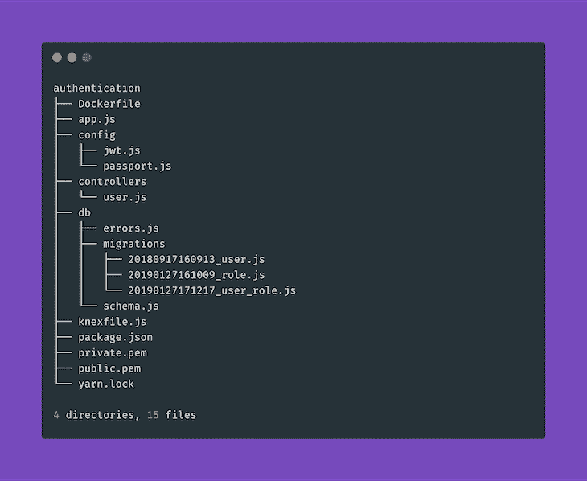

## 重构应用程序树

如果我们从根开始查看我们的应用程序结构，我们将会看到以下内容。

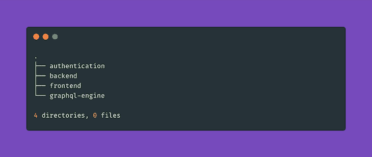

让我们从根目录中删除`graphql-engine`目录，因为我们不再需要它了。

```
rm -rf graphql-engine

```

接下来，我们将创建一个新的`docker-compose.yml`文件，它将负责用以下内容组成我们的应用程序。

```
// docker-compose.yml

version: "3"
services:
  backend:
    build:
      context: ./backend
    depends_on:
      - db
    env_file: ./backend/.env
    ports:
      - 8080:8080
    volumes:
      - ./backend:/backend-app
  frontend:
    build:
      context: ./frontend
    command: yarn dev
    depends_on:
      - backend
      - authentication
    volumes:
      - ./frontend:/frontend-app
      - ./frontend/package.json:/frontend-app/package.json
      - ./frontend/yarn.lock:/frontend-app/yarn.lock
    ports:
      - "3000:3000"
  authentication:
    build:
      context: ./authentication
    command: yarn start
    env_file: ./authentication/.env
    depends_on:
      - db
    ports:
      - "3030:3030"
    volumes:
      - ./authentication:/authentication-app
      - ./authentication/package.json:/authentication-app/package.json
      - ./authentication/yarn.lock:/authentication-app/yarn.lock
  db:
    image: postgres:11.3-alpine
    volumes:
      - db_data:/var/lib/postgresql/data
volumes:
  db_data:

```

我们的应用程序树应该如下所示:

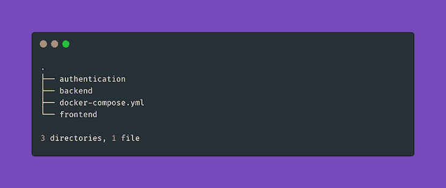

## 使用 Docker 启动我们的应用程序

一旦 Docker 安装并运行在我们的系统上，我们就可以运行下面的命令来启动我们的应用程序。

```
docker-compose up

```

有关上述命令的更多信息，请参见 [Docker 文档](https://docs.docker.com/compose/reference/up/)。

我们可以使用`[docker-compose ps](https://docs.docker.com/compose/reference/ps/)`命令检查是否所有的容器都启动并运行了。


请注意，容器的名称可以不同。

## 运行迁移以在我们的数据库中创建用户数据

在我们的身份验证应用程序中，迁移目录中有三个迁移:

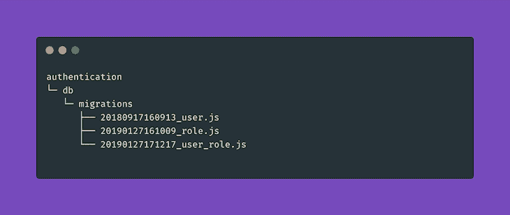

为了运行这些迁移，我们必须 [SSH 到我们的认证容器](https://phase2.github.io/devtools/common-tasks/ssh-into-a-container/)。我们可以通过运行下面的命令找出所有容器的名称。

```
docker-compose ps

```

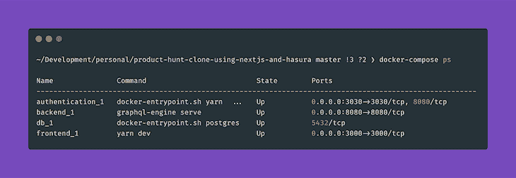

为了 SSH 到身份验证容器，我们需要运行以下命令。

```
docker exec -it authentication_1 /bin/bash

```

进入容器后，我们可以使用以下命令运行迁移。

```
bash-4.4# knex migrate:latest

```

它将运行来自身份验证应用程序的所有迁移。

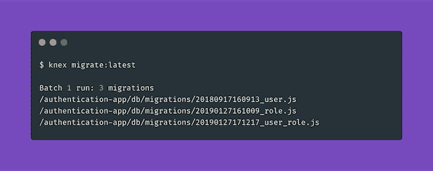

现在让我们看看上面的三个迁移是如何修改我们的数据库的。在我们从容器中退出后(使用命令`exit`，我们可以转到我们的`backend`目录，在那里我们将运行下面的命令来运行 [Hasura 控制台](https://docs.hasura.io/1.0/graphql/manual/hasura-cli/hasura_console.html)。

```
hasura console

```

这将在 [http://localhost:9695/](http://localhost:9695/) 上打开 Hasura 控制台。如果我们转到 Data 选项卡，我们将能够看到五个未跟踪的表。

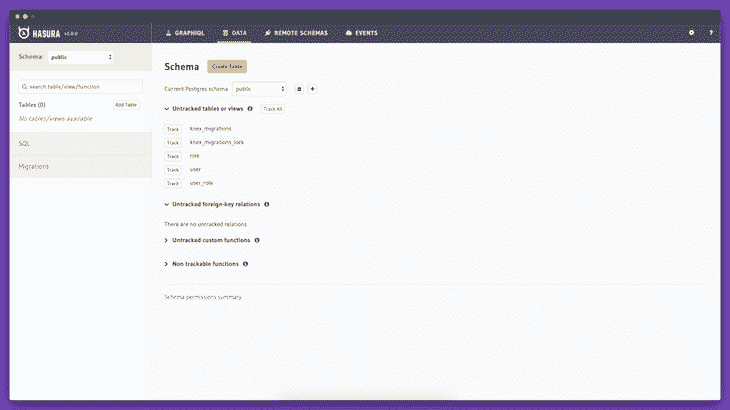

我们需要点击`role`、`user`和`user_role`旁边的**轨道**按钮。这些没有被跟踪，因为它们没有通过 GraphQL API 公开。

接下来，我们将单击**未跟踪的外键关系**旁边的**跟踪所有**按钮来跟踪所有关系。我们可以从每个表内的**关系**选项卡中查看每个表的关系。

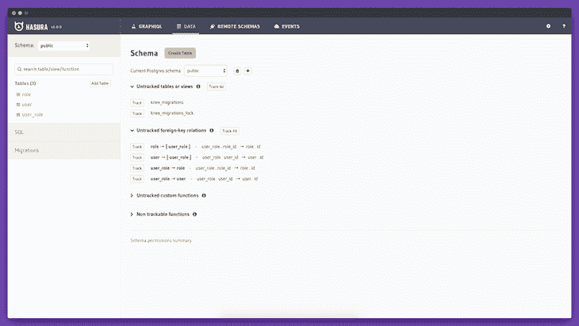

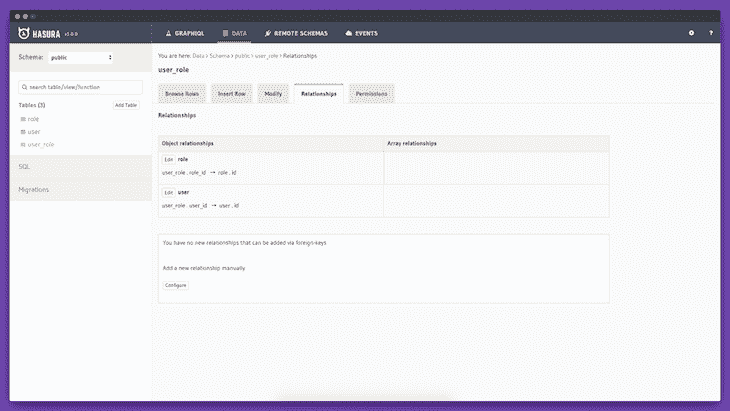

我们现在可以查看迁移创建的所有表。

`role`表有两列:

1.  `id` (uuid，主键，唯一；默认:`gen_random_uuid()`)
2.  `name`——(性格多变，独一无二)

`user`表格有五列:

1.  `id`——(uuid，主键，唯一；默认:`gen_random_uuid()`)
2.  `username`——(性格多变，独一无二)
3.  `password`——(性格多变)
4.  `created_at` —(带时区的时间戳，默认:`now()`)
5.  `active` —(布尔型，可空，默认:`true`)

`user_role`表格有三列:

1.  `id` — (uuid，主键，唯一，默认:`gen_random_uuid()`)
2.  `role_id` — (uuid，可空)
3.  `user_id` — (uuid，可空)

现在，如果我们访问 [Hasura GraphQL Explorer](http://localhost:9695/api-explorer) ，我们将能够使用 GraphQL 查询我们的数据库。

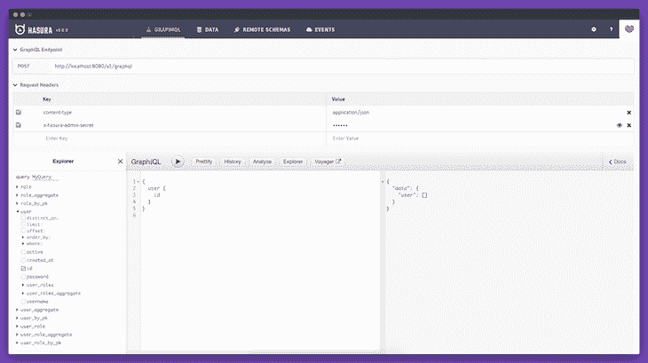

因为我们没有任何用户数据，所以响应是一个空的`user`数组。有趣的是，如果我们不将`x-hasura-admin-secret`键(其值为`secret`)与请求头一起发送，我们将无法查询任何数据。

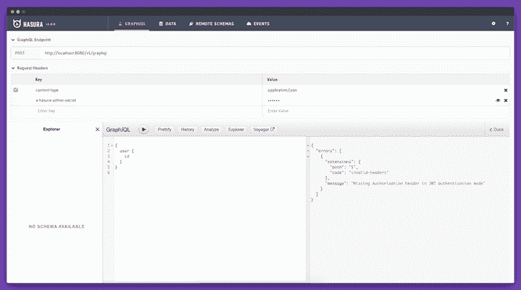

这是因为我们已经在`.env`文件中将`HASURA_GRAPHQL_ADMIN_SECRET`的值设置为`secret`，作为[保护 GraphQL 端点](https://docs.hasura.io/1.0/graphql/manual/deployment/heroku/securing-graphql-endpoint.html)的一部分。

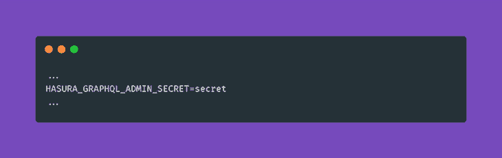

此外，我们需要记住，我们通过 Hasura 控制台所做的任何更改都会在我们的`migration`目录中创建迁移，该目录位于后端应用程序的目录中。

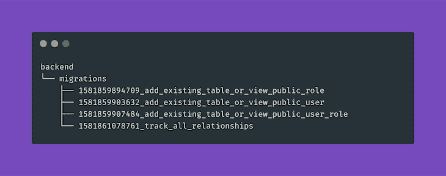

## 使用我们的认证应用认证用户

如果我们遵循我们的认证存储库的[文档](https://github.com/hasura/graphql-engine/tree/master/community/boilerplates/auth-servers/passportjs-jwt-roles#usage)，我们可以启动下面的 CURL 请求来创建一个新用户。

```
curl -H "Content-Type: application/json" \
     -d'{"username": "admin1", "password": "pass", "confirmPassword": "pass"}'\
     http://localhost:3030/signup

```

我们会得到如下回应。

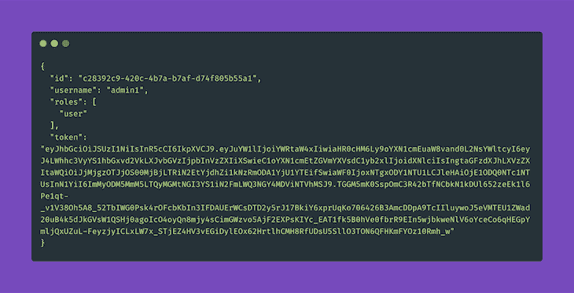

我们还可以做一个类似的 CURL 请求来登录一个现有的用户。

```
curl -H "Content-Type: application/json" \
     -d'{"username": "admin1", "password": "pass"}' \
     http://localhost:3030/login

```

我们会得到如下回应。

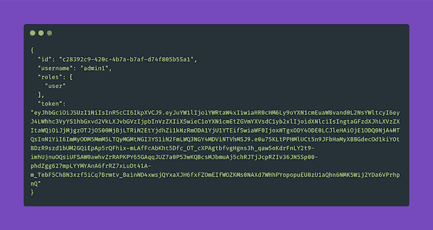

## 将身份验证应用程序与我们的前端应用程序集成

让我们将 Next.js 应用程序与身份验证应用程序连接起来。前端应用运行在 [http://localhost:3000/](http://localhost:3000/) 上。

我们将使用 [Chakra UI](https://chakra-ui.com/getting-started) 来构建我们的前端应用程序，使用 [Nookies](https://github.com/maticzav/nookies) 来处理 cookies。要安装它们，我们需要 SSH 到我们的前端容器。

```
docker exec -it frontend_1 /bin/bash

```

一旦我们进入容器，我们可以使用下面的命令安装这个包。

```
bash-4.4# yarn add @chakra-ui/core @emotion/core @emotion/styled emotion-theming nookies

```

我们需要在`pages`目录下创建一个名为`_app.js`的新文件，内容如下。

```
// frontend/pages/_app.js

import React from 'react'
import NextApp from 'next/app'
import { ThemeProvider, CSSReset, theme } from '@chakra-ui/core'

class App extends NextApp {
  render() {
    const { Component } = this.props
    return (
      <ThemeProvider theme={theme}>
        <CSSReset />
        <Component />
      </ThemeProvider>
    )
  }
}

export default App

```

让我们将 Chakra UI 中的`Button`组件添加到我们的索引页面。

```
// frontend/pages/index.js

import React from 'react'
import { Box, Button } from "@chakra-ui/core";

const IndexPage = () => {
  return (
    <Box
      w="100%"
      minH="100vh"
      p={4}
      d="flex"
      alignItems="center"
      justifyContent="center"
    >
      <Button>Hello World!</Button>
    </Box>
  )
}

export default IndexPage

```

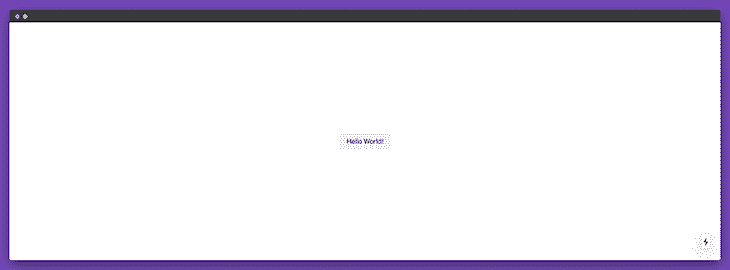

现在让我们创建注册表单。我们将有三个字段:用户名，密码和确认密码。

```
// frontend/components/forms/sign-up.js

import React, { useState } from "react";
import {
  Alert,
  AlertIcon,
  Box,
  Button,
  FormControl,
  FormLabel,
  FormHelperText,
  Input
} from "@chakra-ui/core";
import { setCookie } from "nookies";

const SignUpForm = () => {
  const [username, setUsername] = useState("");
  const [password, setPassword] = useState("");
  const [confirmPassword, setConfirmPassword] = useState("");
  const [error, setError] = useState(null);

  const handleSubmit = async e => {
    e.preventDefault();

  const response = await fetch("http://localhost:3030/signup", {
      method: "POST",
      body: JSON.stringify({
        username,
        password,
        confirmPassword
      }),
      headers: {
        "Content-type": "application/json; charset=UTF-8"
      }
    });

    const data = await response.json();

    if (response.status !== 200) {
      setError("Something went wrong! Please try again.");
    } else {
      setCookie({}, "X-Hasura-User-Id", data.id, {
        maxAge: 30 * 24 * 60 * 60,
        path: "/"
      });
      setCookie({}, "token", data.token, {
        maxAge: 30 * 24 * 60 * 60,
        path: "/"
      });
    }
  };

  const errorsNode = () => {
    if (!error) return false;
    return (
      <Alert status="error" mb={8} rounded="md" variant="left-accent">
        <AlertIcon />
        {error}
      </Alert>
    );
  };

  return (
    <Box
      w="100%"
      minH="100vh"
      p={4}
      d="flex"
      alignItems="center"
      justifyContent="center"
    >
      <Box w="500px" p={8} bg="gray.50" rounded="md">
        {errorsNode()}
        <FormControl mb={8}>
          <FormLabel htmlFor="username">Username</FormLabel>
          <Input
            type="text"
            id="username"
            aria-describedby="john"
            value={username}
            onChange={e => setUsername(e.target.value)}
          />
        </FormControl>
        <FormControl mb={8}>
          <FormLabel htmlFor="password">Password</FormLabel>
          <Input
            type="password"
            id="password"
            aria-describedby="*****"
            value={password}
            onChange={e => setPassword(e.target.value)}
          />
        </FormControl>
        <FormControl mb={8}>
          <FormLabel htmlFor="confirm-password">Confirm Password</FormLabel>
          <Input
            type="password"
            id="confirm-password"
            aria-describedby="*****"
            value={confirmPassword}
            onChange={e => setConfirmPassword(e.target.value)}
          />
          {!!confirmPassword && confirmPassword !== password && (
            <FormHelperText id="confirm-password">
              Passwords do not match
            </FormHelperText>
          )}
        </FormControl>
        <FormControl>
          <Button bg="#764ABC" color="white" onClick={handleSubmit}>
            Sign Up
          </Button>
        </FormControl>
      </Box>
    </Box>
  );
};

export default SignUpForm;

```

我们需要在索引页面中导入表单。

```
// frontend/pages/index.js

import React, { Component } from "react";
import SignUpForm from "../components/forms/sign-up";

export default class IndexPage extends Component {
  render() {
    return <SignUpForm />;
  }
}

```

上面的代码会在 [http://localhost:3000/](http://localhost:3000/) 上生成下面的表单。

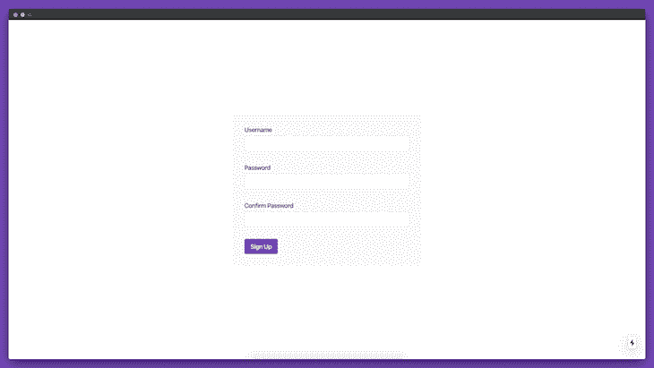

让我们仔细看看我们的`SignUpForm`组件的`handleSubmit`函数。

首先，我们将向[http://localhost:3030/sign up](http://localhost:3030/signup)发起一个`POST`请求，这是我们的注册 API 端点。如果我们从我们的 API 得到一个`success`响应，这意味着我们将响应中的用户的`id`和`token`存储在 cookies 中。如果我们检查我们的浏览器 cookies，我们会看到现在在我们的浏览器中设置了两个 cookies。

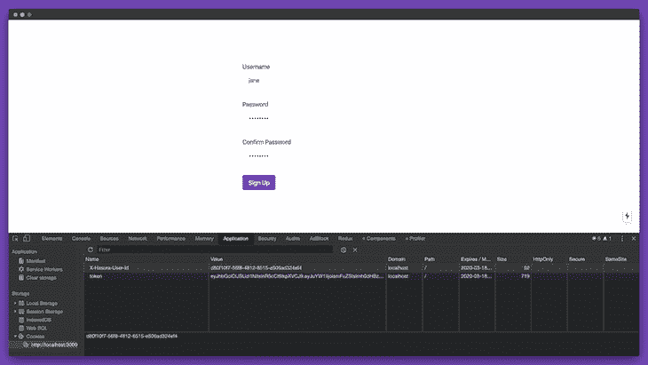

在 Hasura 中，[授权用户](https://docs.hasura.io/1.0/graphql/manual/auth/authorization/basics.html)需要用到`X-Hasura-User-Id` cookie。我们还可以存储用户的类型，但这在我们的应用程序中是不必要的。我们将在后端应用程序中建立授权时使用这个 cookie。

让我们创建一个类似的只有两个字段的登录表单:用户名和密码**。**

```
// frontend/components/forms/sign-in.js

import React, { useState } from "react";
import {
  Alert,
  AlertIcon,
  Box,
  Button,
  FormControl,
  FormLabel,
  Input
} from "@chakra-ui/core";
import { setCookie } from "nookies";

const SignInForm = () => {
  const [username, setUsername] = useState("");
  const [password, setPassword] = useState("");
  const [error, setError] = useState(null);

  const handleSubmit = async e => {
    e.preventDefault();

    const response = await fetch("http://localhost:3030/login", {
      method: "POST",
      body: JSON.stringify({
        username,
        password
      }),
      headers: {
        "Content-type": "application/json; charset=UTF-8"
      }
    });

    const data = await response.json();

    if (response.status !== 200) {
      setError("Something went wrong! Please try again.");
    } else {
      setCookie({}, "X-Hasura-User-Id", data.id, {
        maxAge: 30 * 24 * 60 * 60,
        path: "/"
      });
      setCookie({}, "token", data.token, {
        maxAge: 30 * 24 * 60 * 60,
        path: "/"
      });
    }
  };

  const errorsNode = () => {
    if (!error) return false;
    return (
      <Alert status="error" mb={8} rounded="md" variant="left-accent">
        <AlertIcon />
        {error}
      </Alert>
    );
  };

  return (
    <Box
      w="100%"
      minH="100vh"
      p={4}
      d="flex"
      alignItems="center"
      justifyContent="center"
    >
      <Box w="500px" p={8} bg="gray.50" rounded="md">
        {errorsNode()}
        <FormControl mb={8}>
          <FormLabel htmlFor="username">Username</FormLabel>
          <Input
            type="text"
            id="username"
            aria-describedby="john"
            value={username}
            onChange={e => setUsername(e.target.value)}
          />
        </FormControl>
        <FormControl mb={8}>
          <FormLabel htmlFor="password">Password</FormLabel>
          <Input
            type="password"
            id="password"
            aria-describedby="*****"
            value={password}
            onChange={e => setPassword(e.target.value)}
          />
        </FormControl>
        <FormControl>
          <Button bg="#764ABC" color="white" onClick={handleSubmit}>
            Sign In
          </Button>
        </FormControl>
      </Box>
    </Box>
  );
};

export default SignInForm;

```

让我们将该表单导入到我们的`login`页面中。

```
// frontend/pages/login.js

import React, { Component } from "react";
import SignInForm from "../components/forms/sign-in";

export default class SignInPage extends Component {
  render() {
    return <SignInForm />;
  }
}

```

现在，如果我们访问[http://localhost:3000/log in](http://localhost:3000/login)，我们应该能够看到我们的登录表单。

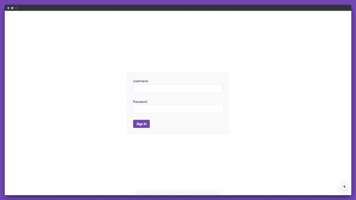

现在，让我们创建另一个显示产品列表的组件。目前，我们没有任何产品。所以让我们创造一些。

```
// frontend/components/lists/products.js

import React from "react";
import { Grid, Box } from "@chakra-ui/core";

const ProductsList = () => {
  return (
    <Box
      w="100%"
      minH="100vh"
      p={4}
      d="flex"
      alignItems="center"
      justifyContent="center"
    >
      <Box w="800px" p={8} bg="gray.50" borderRadius="sm">
        <Grid
          templateColumns={[
            "repeat(1, 1fr)",
            "repeat(1, 1fr)",
            "repeat(2, 1fr)"
          ]}
          gap={8}
        >
          <Box w="100%" h={24} bg="#764ABC" rounded="md" />
          <Box w="100%" h={24} bg="#764ABC" rounded="md" />
          <Box w="100%" h={24} bg="#764ABC" rounded="md" />
          <Box w="100%" h={24} bg="#764ABC" rounded="md" />
          <Box w="100%" h={24} bg="#764ABC" rounded="md" />
          <Box w="100%" h={24} bg="#764ABC" rounded="md" />
        </Grid>
      </Box>
    </Box>
  );
};

export default ProductsList;

```

我们将在`products`页面上展示这些组件。

```
// frontend/pages/products/index.js

import React, { Component } from "react";
import ProductsList from "../components/lists/products";

export default class ProductsPage extends Component {
  render() {
    return <ProductsList />;
  }
}

```

如果我们访问[http://localhost:3000/products](http://localhost:3000/products)，我们现在应该会看到下面的屏幕。

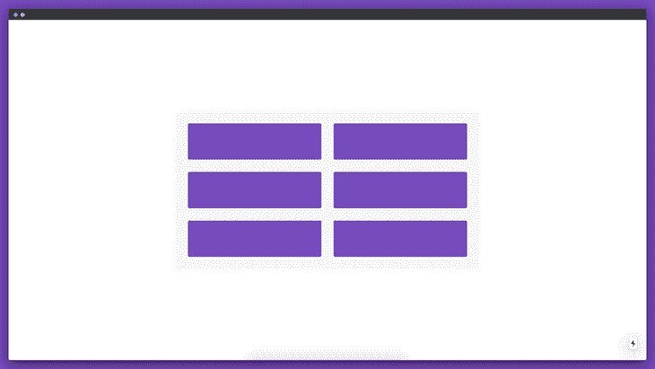

目前，我们只是显示占位符内容，而不是产品本身。下一步是创建一个表来存储我们后端应用程序中的产品。

## 在 Hasura 中创建产品储物表

让我们构建一个特性，使用 Hasura 从数据库中存储和检索产品。

如果我们将目录更改为我们的后端应用程序并运行`hasura console`命令，控制台将在 [http://localhost:9695/](http://localhost:9695/) 启动并运行。

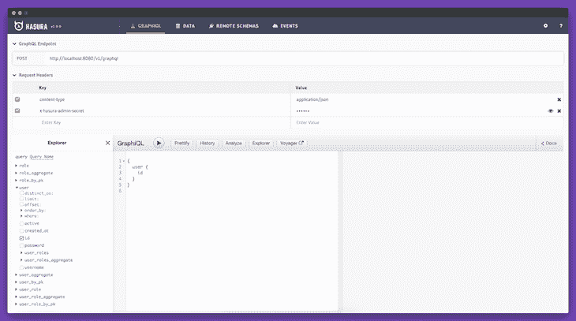

让我们单击**数据**选项卡，添加一个名为`product`的新表，它将包含以下六列。

1.  1.  `id` (uuid，主键，唯一，默认:`gen_random_uuid()`)
    2.  `name` (chara cter)
    3.  `description`(字符)
    4.  `created_at`(带时区的时间戳，默认:`now()`)
    5.  `updated_at`(带时区的时间戳，默认:`now()`)
    6.  `maker_id`  (uuid)

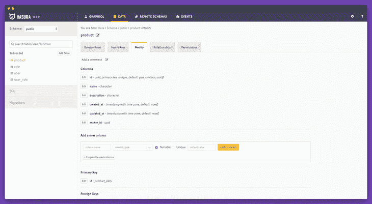

我们还需要添加产品和制造商(添加产品的用户)之间的关系。我们将使用这种关系来授权编辑该项。

要建立产品和用户模型之间的关系，我们需要做以下工作:

1.  点击产品模型内的**关系**选项卡
2.  点击**下方的配置按钮手动添加新关系**
3.  从**关系类型**下拉列表中选择**对象关系**
4.  键入“maker”作为关系名称
5.  从**参考模式**下拉菜单中选择**公共**
6.  选择**用户**作为**参照表**
7.  从下拉菜单的**中选择 **maker_id** ，从**到**下拉菜单中选择 **id****

我们现在已经定义了产品和用户模型之间的关系。

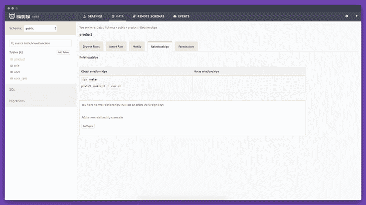

你可以在 [Hasura 文档](https://docs.hasura.io/1.0/graphql/manual/schema/relationships/index.html)中找到更多关于关系的信息。

现在让我们定义用户和产品模型之间的新关系。

1.  点击用户模型中的**关系**选项卡
2.  点击**下方的**配置**按钮手动添加新关系**
3.  从**关系类型**下拉列表中选择**阵列关系**
4.  键入“产品”作为**关系名称**
5.  从**参考模式**下拉菜单中选择**公共**
6.  选择**产品**作为**参照表**
7.  从下拉菜单的**中选择 **id** ，从**到**下拉菜单中选择 **maker_id****

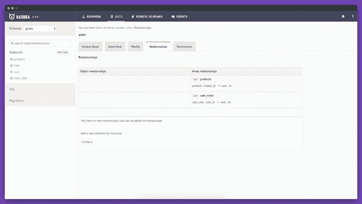

现在，如果我们访问 [Hasura GraphQL Explorer](http://localhost:9695/api-explorer) ，我们将能够使用 GraphQL 查询我们的产品。

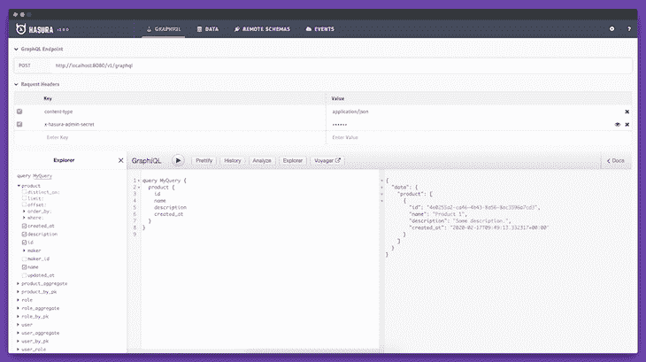

## 配置 Next.js 用 GraphQL 钩子获取 GraphQL 数据

是时候配置我们的 Next.js 应用程序从后端应用程序获取数据了。我们将使用 [GraphQL 钩子](https://github.com/nearform/graphql-hooks)从后端应用程序获取数据。

为了安装依赖项，我们需要 SSH 到我们的前端容器。

```
docker exec -it frontend_1 /bin/bash

```

一旦进入容器，我们可以使用下面的命令安装这个包。

```
bash-4.4# yarn add graphql-hooks graphql-hooks-memcache graphql-hooks-ssr

```

由于我们将使用 [SSR](https://github.com/nearform/graphql-hooks#SSR) ，我们必须创建两个实用程序文件。

```
// frontend/lib/with-graphql-client.js

import React from "react";
import initGraphQL from "./init-graphql";
import Head from "next/head";
import { getInitialState } from "graphql-hooks-ssr";

export default App => {
  return class GraphQLHooks extends React.Component {
    static displayName = "GraphQLHooks(App)";
    static async getInitialProps(ctx) {
      const { AppTree } = ctx;
      let appProps = {};
      if (App.getInitialProps) {
        appProps = await App.getInitialProps(ctx);
      }
      // Run all GraphQL queries in the component tree
      // and extract the resulting data
      const graphQLClient = initGraphQL();

      let graphQLState = {};

      if (typeof window === "undefined") {
        try {
          // Run all GraphQL queries
          graphQLState = await getInitialState({
            App: <AppTree {...appProps} graphQLClient={graphQLClient} />,
            client: graphQLClient
          });
        } catch (error) {
          // Prevent GraphQL hooks client errors from crashing SSR.
          // Handle them in components via the state.error prop:
          // https://github.com/nearform/graphql-hooks#usequery
          console.error("Error while running `getInitialState`", error);
        }
        // getInitialState does not call componentWillUnmount
        // head side effect therefore need to be cleared manually
        Head.rewind();
      }

      return {
        ...appProps,
        graphQLState
      };
    }

    constructor(props) {
      super(props);
      this.graphQLClient = initGraphQL(props.graphQLState);
    }

    render() {
      return <App {...this.props} graphQLClient={this.graphQLClient} />;
    }
  };
};

// frontend/lib/init-graphql.js

import { GraphQLClient } from "graphql-hooks";
import memCache from "graphql-hooks-memcache";
import unfetch from "isomorphic-unfetch";

let graphQLClient = null;

function create(initialState = {}) {
  return new GraphQLClient({
    ssrMode: typeof window === "undefined",
    url: "http://localhost:8080/v1/graphql",
    cache: memCache({ initialState }),
    fetch: typeof window !== "undefined" ? fetch.bind() : unfetch, // eslint-disable-line
    headers: {
      "x-hasura-admin-secret": "secret"
    }
  });
}

export default function initGraphQL(initialState) {
  // Make sure to create a new client for every server-side request so that data
  // isn't shared between connections (which would be bad)
  if (typeof window === "undefined") {
    return create(initialState);
  }
  // Reuse client on the client-side
  if (!graphQLClient) {
    graphQLClient = create(initialState);
  }

  return graphQLClient;
}

```

这两个文件出现在 Next.js 的`[with-graphql-hooks](https://github.com/zeit/next.js/tree/canary/examples/with-graphql-hooks)`示例中。

我们现在需要更新我们的`_app.js`文件，因为我们需要用`withGraphQLClient` [高阶函数](https://medium.com/javascript-scene/higher-order-functions-composing-software-5365cf2cbe99)包装我们的前端应用程序。

```
// frontend/pages/_app.js

import React from "react";
import NextApp from "next/app";
import { ThemeProvider, CSSReset, theme } from "@chakra-ui/core";
import { ClientContext } from "graphql-hooks";

import withGraphQLClient from "../lib/with-graphql-client";

class App extends NextApp {
  render() {
    const { Component, pageProps, graphQLClient } = this.props;
    return (
      <ThemeProvider theme={theme}>
        <CSSReset />
        <ClientContext.Provider value={graphQLClient}>
          <Component {...pageProps} />
        </ClientContext.Provider>
      </ThemeProvider>
    );
  }
}
export default withGraphQLClient(App);

```

## 在 Next.js 应用程序中显示产品数据

现在让我们更新我们的`ProductsList`组件，以显示我们数据库中的实际产品。

```
// frontend/components/lists/products.js

import React from "react";
import { Text, Grid, Box, Spinner, Alert, AlertIcon } from "@chakra-ui/core";
import { useQuery } from "graphql-hooks";

export const allProductsQuery = `
  query {
    product {
      id
      name
      description
    }
  }
`;

const ProductsList = () => {
  const { loading, error, data } = useQuery(allProductsQuery, {
    skipCache: true
  });

  if (loading) {
    return (
      <Box
        w="100%"
        minH="100vh"
        d="flex"
        alignItems="center"
        justifyContent="center"
      >
        <Spinner />
      </Box>
    );
  }

  if (error) {
    return (
      <Box
        w="100%"
        minH="100vh"
        d="flex"
        alignItems="center"
        justifyContent="center"
      >
        <Alert status="error" variant="left-accent">
          <AlertIcon />
          There was an error processing your request
        </Alert>
      </Box>
    );
  }

  return (
    <Box
      w="100%"
      minH="100vh"
      p={4}
      d="flex"
      alignItems="center"
      justifyContent="center"
    >
      <Box w="800px" p={8} bg="gray.50" borderRadius="sm">
        <Grid
          templateColumns={[
            "repeat(1, 1fr)",
            "repeat(1, 1fr)",
            "repeat(2, 1fr)"
          ]}
          gap={8}
        >
          {data.product.map(item => {
            return (
              <Box
                key={item.id}
                w="100%"
                p={12}
                bg="#764ABC"
                rounded="md"
                color="white"
              >
                <Text fontSize="xl" fontWeight="semibold" lineHeight="short">
                  {item.name}
                </Text>
                <Text mt={2}>{item.description}</Text>
              </Box>
            );
          })}
        </Grid>
      </Box>
    </Box>
  );
};

export default ProductsList;

```

在做了这个更改之后，如果我们访问[http://localhost:3000/products](http://localhost:3000/products)，我们应该能够从我们的后端看到实际的产品。

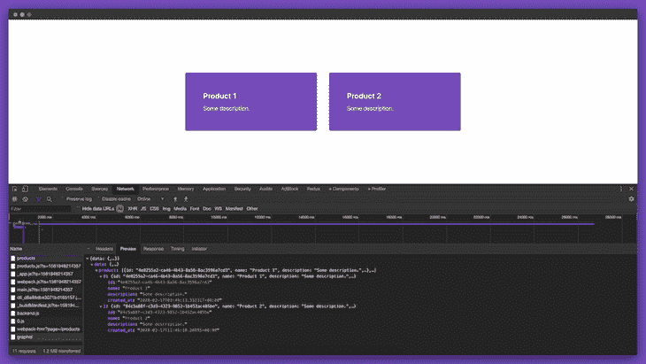

## 扩展 Next.js 应用程序以添加新产品

在这个阶段，我们可以构建一个表单来添加新产品。

```
// frontend/components/forms/add-new-product.js

import React, { useState } from "react";
import { Box, Button, FormControl, FormLabel, Input } from "@chakra-ui/core";
import { parseCookies } from "nookies";
import { useMutation } from "graphql-hooks";
import { withRouter } from "next/router";

export const insertProductMutation = `
  mutation ($name: bpchar!, $description: bpchar!, $maker_id: uuid!) {
    insert_product(objects: {description: $description, name: $name, maker_id: $maker_id}) {
      returning {
        id
        name
      }
    }
  }
`;

const AddNewProductForm = ({ router }) => {
  const [insertProduct] = useMutation(insertProductMutation);
  const [name, setName] = useState("");
  const [description, setDescription] = useState("");
  const maker_id = parseCookies()["X-Hasura-User-Id"];

  const handleSubmit = async e => {
    e.preventDefault();

    await insertProduct({
      variables: {
        name,
        description,
        maker_id
      }
    });
    setName("");
    setDescription("");
    router.push("/products");
  };

  return (
    <Box
      w="100%"
      minH="100vh"
      p={4}
      d="flex"
      alignItems="center"
      justifyContent="center"
    >
      <Box w="500px" p={8} bg="gray.50" rounded="md">
        <FormControl mb={8}>
          <FormLabel htmlFor="name">Name</FormLabel>
          <Input
            type="text"
            id="name"
            aria-describedby="john"
            value={name}
            onChange={e => setName(e.target.value)}
          />
        </FormControl>
        <FormControl mb={8}>
          <FormLabel htmlFor="description">Description</FormLabel>
          <Input
            type="text"
            id="description"
            aria-describedby="Description"
            value={description}
            onChange={e => setDescription(e.target.value)}
          />
        </FormControl>
        <FormControl>
          <Button bg="#764ABC" color="white" onClick={handleSubmit}>
            Save
          </Button>
        </FormControl>
      </Box>
    </Box>
  );
};

export default withRouter(AddNewProductForm);

```

在上面的表单中，我们使用了`X-Hasura-User-Id` cookie 来发送当前用户的 id。

现在我们只需要在页面中导入这个表单。

```
// frontend/pages/products/new.js

import React from "react";

import AddNewProductForm from "../../components/forms/add-new-product";

const CreateProductPage = () => {
  return <AddNewProductForm />;
};

export default CreateProductPage;

```

如果我们访问[http://localhost:3000/products/new](http://localhost:3000/products/new)，我们现在应该能够看到新的表单。

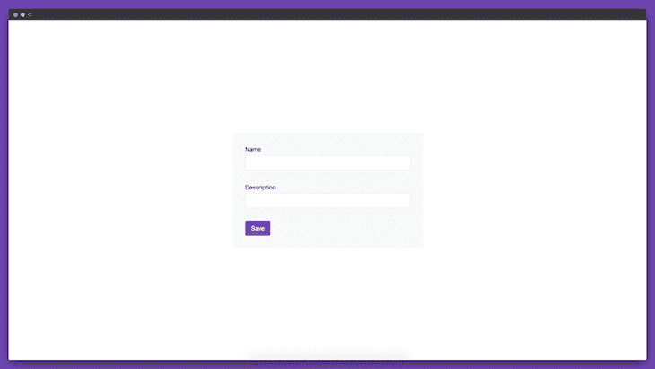

我们还可以增加新产品。

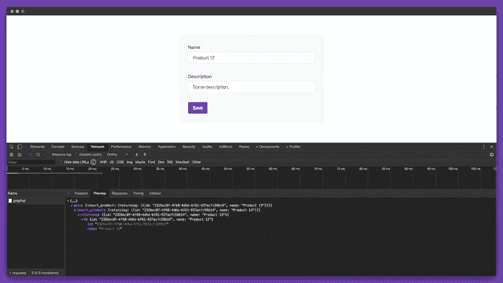

此外，我们可以在 ProductsList 组件中查看新产品。

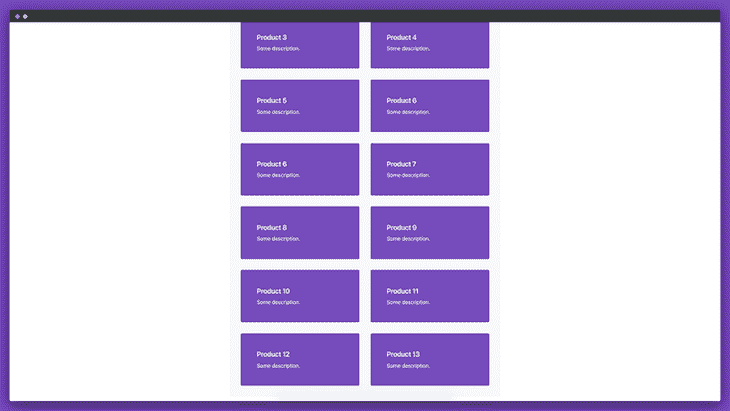

## 扩展 Next.js 应用程序以编辑产品

如果我们希望用户能够编辑产品呢？我们也可以为此创建一个表单。

```
// frontend/components/forms/edit-product.js

import React, { useState, useEffect } from "react";
import {
  Box,
  Button,
  FormControl,
  FormLabel,
  Input,
  Spinner
} from "@chakra-ui/core";
import { useManualQuery, useMutation } from "graphql-hooks";
import { withRouter } from "next/router";

export const singleProductQuery = `
  query ($id: uuid!){
    product_by_pk (id: $id) {
      id
      name
      description
      created_at
    }
  }
`;

export const updateProductMutation = `
  mutation ($name: bpchar!, $description: bpchar!, $productId: uuid!) {
    update_product(where: {id: {_eq: $productId}}, _set: {name: $name, description: $description}) {
      returning {
        id
        name
        description
      }
    }
  }
`;

const EditProductForm = ({ router }) => {
  const [name, setName] = useState("");
  const [description, setDescription] = useState("");
  const [fetchProduct, { loading, error }] = useManualQuery(singleProductQuery);
  const [updateProduct] = useMutation(updateProductMutation);

  useEffect(() => {
    const fetchProductThenSomething = async () => {
      const product = await fetchProduct({
        skipCache: true,
        variables: {
          id: router.query.productId
        }
      });
      setName(product.data.product_by_pk.name);
      setDescription(product.data.product_by_pk.description);
    };
    fetchProductThenSomething();
  }, []);

  if (loading) {
    return (
      <Box
        w="100%"
        minH="100vh"
        d="flex"
        alignItems="center"
        justifyContent="center"
      >
        <Spinner />
      </Box>
    );
  }

  if (error) {
    return (
      <Box
        w="100%"
        minH="100vh"
        d="flex"
        alignItems="center"
        justifyContent="center"
      >
        <Alert status="error" variant="left-accent">
          <AlertIcon />
          There was an error processing your request
        </Alert>
      </Box>
    );
  }

  const handleSubmit = async e => {
    e.preventDefault();
    await updateProduct({
      variables: {
        name,
        description,
        productId: router.query.productId
      }
    });
  };

  return (
    <Box
      w="100%"
      minH="100vh"
      p={4}
      d="flex"
      alignItems="center"
      justifyContent="center"
    >
      <Box w="500px" p={8} bg="gray.50" rounded="md">
        <FormControl mb={8}>
          <FormLabel htmlFor="name">Name</FormLabel>
          <Input
            type="text"
            id="name"
            aria-describedby="john"
            value={name}
            onChange={e => setName(e.target.value)}
          />
        </FormControl>
        <FormControl mb={8}>
          <FormLabel htmlFor="description">Description</FormLabel>
          <Input
            type="text"
            id="description"
            aria-describedby="Description"
            value={description}
            onChange={e => setDescription(e.target.value)}
          />
        </FormControl>
        <FormControl>
          <Button bg="#764ABC" color="white" onClick={handleSubmit}>
            Save
          </Button>
        </FormControl>
      </Box>
    </Box>
  );
};

export default withRouter(EditProductForm);

```

让我们在单独的页面中呈现该表单。

```
// frontend/pages/products/[productId]/edit.js

import React from "react";

import EditProductForm from "../../../components/forms/edit-product";

const EditProductPage = () => {
  return <EditProductForm />;
};

export default EditProductPage;

```

现在，如果我们访问任何产品页面(例如:[http://localhost:3000/products/:Product id/edit](http://localhost:3000/products/:productId/edit))，我们应该能够看到`EditProductForm`。

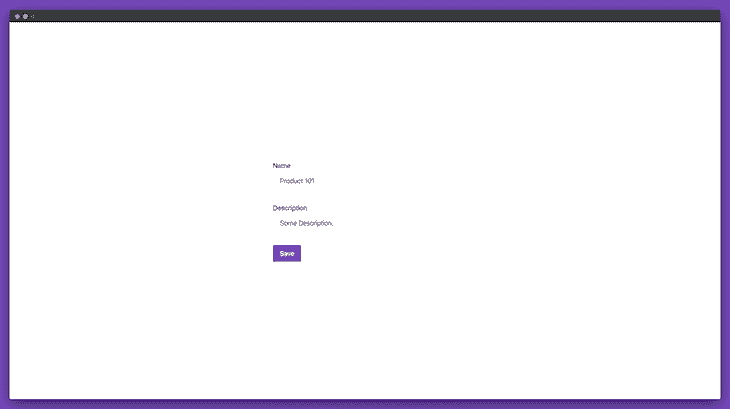

我们现在可以通过这个表单更新任何产品。

比方说，我们希望让制造商只更新他们创造的产品。为此，我们需要为`Product`模型定义定制权限。

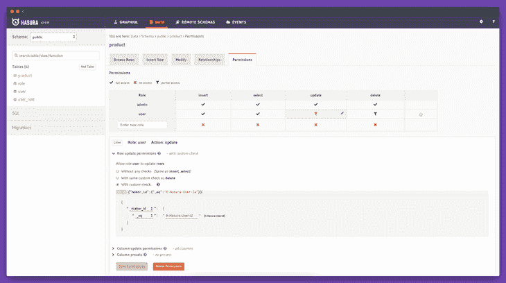

我们需要定义一个名为`user`的新角色。当`maker_id`等于`X-Hasura-User-Id`时，那么并且只有那时更新才被允许。

我们仍然需要对我们的 Next.js 应用程序进行一些修改，以允许制造商编辑他们创建的产品。我们只需要更新`SignInForm`和`SignUpForm`组件来存储`X-Hasura-User-Role` cookie。

```
// frontend/components/forms/sign-in.js

const handleSubmit = async e => {
    e.preventDefault();

    ...      

    setCookie({}, "X-Hasura-User-Id", data.id, {
        maxAge: 30 * 24 * 60 * 60,
        path: "/"
      });

      setCookie({}, "token", data.token, {
        maxAge: 30 * 24 * 60 * 60,
        path: "/"
      });

      setCookie({}, "X-Hasura-User-Role", data.roles[0], {
        maxAge: 30 * 24 * 60 * 60,
        path: "/"
      });
    }
  };

```

我们还需要更新`init-graphql.js`文件中的`create`函数。

```
// frontend/lib/init-graphql.js

function create(initialState = {}) {
  return new GraphQLClient({
    ssrMode: typeof window === "undefined",
    url: "http://localhost:8080/v1/graphql",
    cache: memCache({ initialState }),
    fetch: typeof window !== "undefined" ? fetch.bind() : unfetch, // eslint-disable-line
    headers: {
      "x-hasura-admin-secret": "secret",
      "x-hasura-role": parseCookies()["X-Hasura-User-Role"],
      "X-Hasura-User-Id": parseCookies()["X-Hasura-User-Id"]
    }
  });
}

```

如果我们再次登录，我们应该能够看到三个 cookie:`X-Hasura-User-Id`、`X-Hasura-User-Role`和`token`。

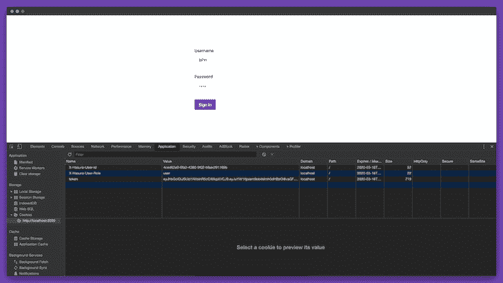

如果用户访问任何产品页面，他们将只能更新他们创建的产品。

## 结论

可以通过 Hasura 使用 GraphQL 订阅。您还可以使用 Hasura 在数据库事件上[触发 webhooks。](https://hasura.io/event-triggers)

现在你应该对如何在 Next.js 中使用 Hasura 有了基本的了解，整个项目可以在 [GitHub](https://github.com/ghoshnirmalya/product-hunt-clone-using-nextjs-and-hasura) 上找到供你参考。

请注意，我们构建的应用程序还没有准备好投入生产。有关部署 Hasura 应用程序的更多信息，请参见 [Hasura 文档](https://docs.hasura.io/1.0/graphql/manual/deployment/index.html)。同样，您可以在 [Next.js 文档](https://nextjs.org/learn/basics/deploying-a-nextjs-app)中阅读更多关于部署 Next.js 应用程序的信息。

## [LogRocket](https://lp.logrocket.com/blg/nextjs-signup) :全面了解生产 Next.js 应用

调试下一个应用程序可能会很困难，尤其是当用户遇到难以重现的问题时。如果您对监视和跟踪状态、自动显示 JavaScript 错误、跟踪缓慢的网络请求和组件加载时间感兴趣，

[try LogRocket](https://lp.logrocket.com/blg/nextjs-signup)

.

[](https://lp.logrocket.com/blg/nextjs-signup)[](https://lp.logrocket.com/blg/nextjs-signup)

LogRocket 就像是网络和移动应用的 DVR，记录下你的 Next.js 应用上发生的一切。您可以汇总并报告问题发生时应用程序的状态，而不是猜测问题发生的原因。LogRocket 还可以监控应用程序的性能，报告客户端 CPU 负载、客户端内存使用等指标。

LogRocket Redux 中间件包为您的用户会话增加了一层额外的可见性。LogRocket 记录 Redux 存储中的所有操作和状态。

让您调试 Next.js 应用的方式现代化— [开始免费监控](https://lp.logrocket.com/blg/nextjs-signup)。