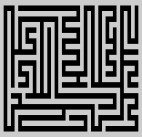
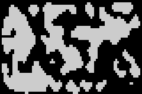
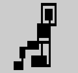
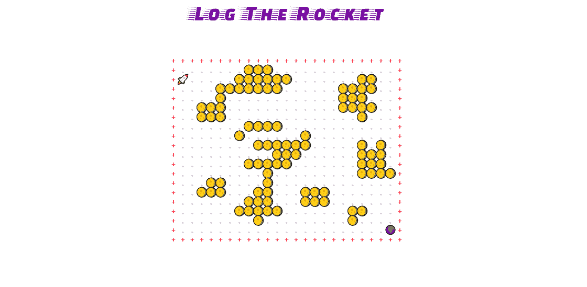

# 用 Rot.js - LogRocket 博客构建一个类似 rogue 的游戏

> 原文：<https://blog.logrocket.com/building-a-roguelike-game-with-rot-js/>

roguelike 游戏是角色扮演电子游戏的一个分支，通常以回合制游戏、随机生成的关卡和可玩角色的永久死亡为特征。这种类型的一个流行产品是《龙与地下城》,这是一个基于角色的游戏，在这个游戏中，一群角色在一个幻想的环境中开始想象中的冒险。

类似 Roguelike 的游戏有很多表现流行特征的。这经常刺激休闲和新手玩家争论类似 roguelike 游戏的“真实特征”。

我们的博客文章介绍了如何使用 Rot.js 创建一个，这是一个有助于在浏览器环境中开发 roguelike 游戏的库。

Rot.js 磨砺出的特性有:RNG(用于程序化生成关卡)、寻路(用于玩家和 AI)、FOV 计算和键绑定配置，仅举几例。

当我们看到网络上类似 roguelike 游戏的状态时，很明显许多类似 roguelike 的游戏已经被创造出来并在浏览器中可用。Rot.js 以其令人惊讶的易用功能将自己定位在对话的中心。

### Rot.js 怎么帮你？

> Rot.js 是一组 JavaScript 库，旨在为类似 roguelike 的开发浏览器环境提供帮助。

Rot.js 旨在帮助开发类似 rogue 的游戏的传统杂务。它是仿照“ [libtcod](https://github.com/libtcod/libtcod) ”开发的，它提供了一个简单的 API 来帮助开发者开发未来游戏的真实颜色、输入和实用程序。

Rot.js 为用户提供了非常强大的基于画布的显示、键盘映射和难以想象的随机地图生成能力。

用 Rot.js 制作的游戏太多了。这些可以作为灵感或展示的目的。

## Rot.js 的特性

我们将使用 Rot.js 构建一个简单的 roguelike 游戏。我们的目标是利用 Rotjs 提供的图形、RNG、调度和寻路 API。

### 显示

`ROT.Display()`提供基于画布的输出，可根据游戏规格进行配置。

使用这些值配置显示器:

*   `width`–水平尺寸，以字符为单位
*   `height`–垂直尺寸，以字符为单位
*   `fontSize`–单位为像素
*   `fontFamily`
*   `fg`–前景色
*   `bg`–背景颜色
*   `spacing`–间距系数
*   `layout`–布局算法；“矩形”或“十六进制”

这些是极其重要的，因为它们是用户所看到的，也是你的游戏如何展示的。

**磁贴地图** 
Rot.js 还允许开发者创建磁贴，这些磁贴可用于组织磁贴、堆叠或定制其颜色和外观以适应游戏。

瓷砖风格的图形是在 Gameboy 上的口袋妖怪等游戏中看到的图形。如果你想在游戏中使用高保真图形，这是合适的。用 Rot.js 很容易实现:你只需将字符引用到瓦片上。浏览一下[文档](http://ondras.github.io/rot.js/manual/#tiles)，更好地了解如何将`tileSet`分割成不同的区块。

**地图创建** 
rot . js 中有几个地图生成器工具，它们的使用方式是一样的:

*   `ROT.Map.`被实例化为一个对象以及它的大小和其他相关选项。
*   接下来，调用`create`函数，该函数采用回调函数。这个回调函数将被反复调用，并传入地图的信息。
*   对于您的回调函数来说，获取地图单元的`x`、`y`坐标和与生成的单元类型相对应的`value`非常重要。

Rot.js 附带了 3 种不同类型的生成器:[迷宫](http://ondras.github.io/rot.js/manual/#map/maze)、[蜂窝](http://ondras.github.io/rot.js/manual/#map/cellular)和[地牢](http://ondras.github.io/rot.js/manual/#map/dungeon)。这些可以被调整和随机化以适应你想要的游戏设计。

**迷宫生成器**



这一系列算法使用以下回调值:

Rot.js 的地图功能附带了 3 个不同的迷宫生成器:DividedMaze、李佳凌迷宫和埃勒的完美迷宫。

**元胞自动机生成器**



这些看起来像牛的地图被称为洞穴系统。可以使用 Rot.js 的 Cellular generator 创建它们。如上图所示，地图的形状不遵循任何特定的几何形状。

这种复杂性是通过`ROT.Map.Cellular` API 上的配置实现的。

与其他地图类型一样，元胞自动机接受高度和宽度参数。除此之外，我们还可以配置:`born`、`survive`、`topology`、`set(x, y, value)`、- `randomize(probabilty)`，在[文档](http://ondras.github.io/rot.js/manual/#map/cellular)中有详细说明。

**地牢生成器**



这个系列的地图生成器可以生成走廊和房间。

由 Rot.js 提供的地牢生成器有助于创建著名的类似 roguelike 游戏的地牢地图效果。在下面的实际例子中，我们将使用地下城生成器来创建地图。

### 随机生成

虽然内置的`Math.random()`函数为游戏开发目的提供了合适的结果，但它相当弱。最值得注意的是，不可能对生成器进行播种，以再现正确的值序列。

这就是`ROT.RNG`对象发挥其数学功能的地方:`getUniform()`、`getNormal(mean, stddev)`、`getPercentage()`、`getItem(array)`、`shuffle(array)`、`getWeightedValue()`、`getState()`和`setState()`。

### 异步和调度

Rot.js 提供了几个工具来帮助事件管理、日程安排、计时和相关的度量。

对于事件管理，Rot 提供了一个事件队列，帮助维护一个排序的优先级列表。事件队列为添加、删除和检索内容提供了一个基本的 API。

Rot.js 有 [3 个内置的调度策略](http://ondras.github.io/rot.js/manual/#timing/scheduler)(简单，速度，动作-持续时间)，每个都可以对应你正在构建的游戏。还有一点很重要，Rot.js 支持异步游戏引擎。

异步任务可以使用 JavaScript 中的本地异步 await 或 promises 来处理。`ROT.Engine`为基于承诺的异步控制流做好了准备:如果任何参与者从其`act()`方法返回一个“thenable ”,引擎会锁定自己，并等待该“thenable”被解析(通过其`then()`方法)。

### 寻路

游戏开发中的寻路或路径是两点间最短路线的绘制。是解决迷宫游戏的实用变种— [维基百科](https://en.wikipedia.org/wiki/Pathfinding#:~:text=Pathfinding%20or%20pathing%20is%20the,path%20on%20a%20weighted%20graph)。

Pathing 极大地帮助了 roguelike 游戏拥有更好的 AI、手感和交互。Rot.js 通过遵循 [Djikstra 的算法](https://en.wikipedia.org/wiki/Dijkstra%27s_algorithm)来实现路径，该算法基于查找图中两个节点之间的最短路径。

### 按键映射和用户输入

处理用户输入可以归结为监听正确的键盘事件(**按键**、**按键**、**按键**)并处理它们。Rot.js 不提供任何支持方法或对象；相反，它定义了一大组`ROT.KEYS.VK_*`常量来区分按下的键。

你可能想看看[的完整列表](http://ondras.github.io/rot.js/doc/modules/_constants_.html#keys)。此功能使用户能够使用从诸如“W-A-S-D”或任何其他键发出的键盘事件来“玩”游戏。

### JavaScript 函数扩展

Rot 在`ROT.Util`中有[非常方便的函数扩展](http://ondras.github.io/rot.js/manual/#util)，这可能有助于数字和字符串操作。

## 构建我们的 roguelike 游戏



## 目标

我们的目标是通过创建一个小游戏来学习 rogue，这个小游戏利用了 rogue 的主要功能，以便了解它们是如何工作的。这个游戏的名字是记录火箭。

要赢得这场游戏，玩家必须让火箭找到地球，并进入生成的蜂窝地图的下一个级别。太棒了，对吧？

### 我们从哪里开始？

我们在浏览器中，所以我们显然从基本的 HTML、CSS 和 JavaScript 文件开始。Rot.js 是一个 JavaScript 库，因此它是作为 HTML 文件中的一个基本脚本安装或导入的。

```
<body>
  <script src="src/index.js"></script>
    <div class="center" id="canvas"></div>
</body>
```

这里，`index.js`将包含 Rot.js 的脚本作为导入。当脚本运行时,' Rot.js '显示将通过行`let canvas = document.getElementById("canvas");`附加到 id 为 canvas 的元素。

您现在可以包含您的 CSS 文件，其中包含不同的导入字体(如果您需要的话)或其他使画布看起来更好的样式。

当编码一个游戏时，用这个简单的方法更容易:准备游戏对象(世界，游戏引擎，颜色，显示，玩家等)并用它们应该使用的属性初始化它们。

在我们的游戏中，我们有四个对象:`displayOptions`、`colors`、`Game`、`GameWorld`和`Player`。其中，我们有 3 个动态对象和一个静态对象(了解这一点将有助于我们正确构建 JavaScript 代码)。

我们的代码将如下所示:

```
const displayOptions = {
  // the display configuration for ROTJS (see above)
}

const colors = {
  // colors configuration for different characters
}

let Game = {
  // game attributes and functions
}

let GameWorld = {
  // attributes related to Map and play space
}

let Player = {
  // everything related to the player–the game won't play itself :)
}
```

我选择了一种对象方法来简化本教程。然而，任何经验丰富的 JavaScript 开发人员都会觉得，如果用[类语法](https://developer.mozilla.org/en-US/docs/Web/JavaScript/Reference/Classes)编写这些动态对象会更好(他们是对的)。

注意，动态对象使用`let`，这允许你重新分配对象的某些属性(因此它们被称为**动态**，与只读的`const`相反。

我们现在可以相应地填充我们的配置属性。我们从这些开始，因为它们使框架能够像上面看到的那样建立起来。它们将在整个编码过程中使用。

```
const displayOptions = {
  // Configure the display
  bg: "white", // background
  fg: "dimGrey", // foreground
  fontFamily: "Fira Mono", // font (use a monospace for esthetics)
  width: 25,
  height: 20, // canvas height and width
  fontSize: 18, // canvas fontsize
  forceSquareRatio: true // make the canvas squared ratio
};

// Object containing colors per tile
// you may add as much as you want corresponding to characters
// they will then be customly applied to each character
const colors = {
  ".": "lightgrey" // the moveable path
};
```

现在我们的游戏有了它需要的设置和配置，我们必须开始在我们的屏幕上显示东西。

全局游戏引擎的元素(负责使游戏“可玩”)将进入`Game`对象内部。

```
let Game = {
  map: [],
  win: false,
  // initialize the game at start time
  init: async function () {
    // we make the init function sleep to help load fonts
    await sleep(500).then(() => { 
      // pass the configuration defined as arguments
      Display = new ROT.Display(displayOptions);
      let canvas = document.getElementById("canvas");
      // append the created display to the HTML element
      canvas.appendChild(Display.getContainer());
    });
    Display.clear(); // remove anything displayed
    this.createLevel(); // create level
    Player.init(); // initialize the player attributes
    this.engine(); // start the game engine
    this.draw();
  },
  engine: async function () {
    // this is responsible of watching the player move and updating
    // the display accordingly. It is all we need as engine
    while (true) {
      await Player.act(); 
      this.draw();
    }
  },
  // we seperate the generating function so as to help recall it anytime,
  // in case we need a new generated level
  createLevel: function () {
    GameWorld.generate();
  },

  draw: function () {
    Display.clear();
    GameWorld.draw();
    Player.draw();
  },

  // when the game is over, we end it.
  endGame: function () {
    this.win = true;
    Display.clear();
    Display.draw(8, 8, "You logged the rocket!", "violet");
  }
};
```

上面是完整的`Game`对象。让我们简单介绍一下不同的功能。

*   通过传递选项并启动使游戏运行的不同功能来创建游戏显示
*   是贯穿整个游戏的东西。这里，我们只需要我们的玩家相应地移动和更新 UI
*   `createLevel`将使用我们上面举例说明的生成技术——特别是蜂窝地图生成器
*   使用 Rot.js 在适当的时候将所有东西绘制到用户界面上
*   一旦赢得游戏(火箭触地)，将会清除界面

现在我们的游戏引擎已经创建好了，我们要看看`GameWorld`。

在这个对象中，我们将使用 Rot.js 随机生成我们的地图，并使用一个小技巧来使墙壁阻挡玩家的移动。

```
let GameWorld = {
  map: [],
  moveSpace: [],
  generate: function () {
    let map = [];
    for (let i = 0; i < displayOptions.width; i++) {
      map[i] = [];
      for (let j = 0; j < displayOptions.height; j++) {
        map[i][j] = "+"; // create the walls around the map
      }
    }
    let freeCells = []; // this is where we shall store the moveable space
    // we create a cellular map using RotJS
    let digger = new ROT.Map.Cellular(
      displayOptions.width - 2,
      displayOptions.height - 2
    );
    // randomize(probability) set all cells to "alive" with a 
    // given probability (0 = no cells, 1 = all cells)
    digger.randomize(0.4);
    digger.create((x, y, value) => {
      if (value) {
        map[x + 1][y + 1] = "🌖"; // create the walls
      } else {
        freeCells.push({ x: x + 1, y: y + 1 });
        map[x + 1][y + 1] = "."; // add . to every free space just for esthetics
      }
    });

    // put the exit gate on the last free cell
    const lastFreeCell = freeCells.pop();
    map[lastFreeCell.x][lastFreeCell.y] = "🌍";
    this.map = map;
    this.freeCells = freeCells;
  },
  // make it impossible to pass through if across an obstacle
  isPassable: function (x, y) {
    if (GameWorld.map[x][y] === "+" || GameWorld.map[x][y] === "🌖") {
      return false;
    } else {
      return true;
    }
  },
  draw: function () {
    this.map.forEach((element, x) => {
      element.forEach((element, y) => {
        Display.draw(x, y, element, colors[element] || "red");
      });
    });
  }
};
```

上面是我们的`GameWorld`，包含了我们的地图生成器和地图选项。

*   是一切发生的地方。它负责在每次按照给定的配置重新渲染时使贴图不同
*   我们用两个 for 循环创建地图(`+`)周围的墙
*   我们使用`ROT.Map.Cellular`创建一个随机的细胞地图，宽度和高度都有限制，因此是-2。这是为了迫使地图进入预定义的墙壁
*   我们以 0.4 的概率随机化细胞图，使其具有活细胞([阅读文档](http://ondras.github.io/rot.js/manual/#map/cellular))
*   然后，我们从细胞地图中创建阻挡墙，并使其余的细胞“自由”步行空间
*   在生成的地图的最后一列和最后一行放一个出口门
*   将帮助我们了解玩家是否试图跨越障碍或墙壁以拒绝进入
*   draw 函数使用预定义的静态对象`color`来绘制和着色 ASCII 字符，并将其余部分默认为红色

最后我们创建了我们的`Player`:负责与游戏交互的那个。

```
let Player = {
  x: null,
  y: null,
  init: function () {
    let playerStart = GameWorld.freeCells[0]; // put the player in the first available freecell
    this.x = playerStart.x;
    this.y = playerStart.y;
  },
  draw: function () {
    Display.draw(this.x, this.y, "🚀", "black");
  },
  act: async function () {
    let action = false;
    while (!action) {
      await new Promise((resolve) => setTimeout(resolve, 100));
      let e = await new Promise((resolve) => {
        window.addEventListener("keydown", resolve, { once: true });
      });
      action = this.handleKey(e);
    } //Await a valid movement
    // make it end when the rocket reaches the earth
    if (GameWorld.map[this.x][this.y] === "🌍") {
      Game.endGame();
      Game.createLevel();
      this.init();
    }
  },
  handleKey: function (e) {
    var keyCode = [];
    //Arrows keys
    keyCode[38] = 0; // key-up
    keyCode[39] = 2; // key-right
    keyCode[40] = 4; // key-down
    keyCode[37] = 6; // key-left
    var code = e.keyCode;
    if (!(code in keyCode)) {
      return false;
    }
    let diff = ROT.DIRS[8][keyCode[code]];
    if (GameWorld.isPassable(this.x + diff[0], this.y + diff[1])) {
      this.x += diff[0];
      this.y += diff[1];
      this.justMoved = true;
      return true;
    } else {
      return false;
    }
  }
};
```

*   首先，我们在第一个可用的空当接龙上`init`我们的球员
*   画出玩家，在我们的例子中是一个火箭
*   在 Rot.js 的帮助下，我们让玩家做出与击键(输入映射)相对应的动作，并将键码附加到移动动作(左、右、上、下)
*   与此同时，我们让游戏引擎明白，当火箭到达地球时，游戏就被认为赢了

我们的最后几行帮助我们从浏览器中捕捉关键事件并加载游戏。这三条线是脚本和浏览器的深度连接。

```
// listen to keystrokes
window.addEventListener(
  "keydown",
  function (e) {
    // space and arrow keys
    if ([32, 37, 38, 39, 40].indexOf(e.keyCode) > -1) {
      e.preventDefault();
    }
  },
  false
);
// load the game
window.onload = Game.init();
// focus on the canvas
window.focus();
```

瞧啊。我们的游戏已经准备好了。你可以在下面的链接上尝试一下，在这里随意浏览完整的游戏代码，分叉它，做一些你想做的添加或任何事情。

> 使用 rot-js 的 blurdylan 的 rot-js-log-rocket

Rot.js 有助于每次创建一个随机地图，映射按键，并在浏览器中显示所有内容。

仅仅从这个小游戏中，我们就能够说明以下流氓特征: **RNG** 、**输入键映射**、**显示**。如果我们需要添加敌人和角色，我们可能会使用 Rot.js 寻路和调度能力。

## 结论

我们的游戏还有很多可以改进的地方:

*   让火箭在途中收集虫子(功能)
*   添加不同的游戏级别(功能)
*   一些游戏关卡不可玩(bug)
*   添加可能杀死火箭并结束游戏的流星
*   添加叙述，使游戏更引人入胜
*   更大的地图和更好的随机算法

游戏开发的美妙之处在于，你的创造力有多强，它就有多强。只要你使用正确的工具，你就可以建造任何你想要的东西。

像 Rot.js 这样的库使得使用 web 工具进行游戏开发变得更加容易。通过一个敏捷的库，有可能对以前极难掌握和产生的概念和技术提供高度的抽象。

## 使用 [LogRocket](https://lp.logrocket.com/blg/signup) 消除传统错误报告的干扰

[](https://lp.logrocket.com/blg/signup)

[LogRocket](https://lp.logrocket.com/blg/signup) 是一个数字体验分析解决方案，它可以保护您免受数百个假阳性错误警报的影响，只针对几个真正重要的项目。LogRocket 会告诉您应用程序中实际影响用户的最具影响力的 bug 和 UX 问题。

然后，使用具有深层技术遥测的会话重放来确切地查看用户看到了什么以及是什么导致了问题，就像你在他们身后看一样。

LogRocket 自动聚合客户端错误、JS 异常、前端性能指标和用户交互。然后 LogRocket 使用机器学习来告诉你哪些问题正在影响大多数用户，并提供你需要修复它的上下文。

关注重要的 bug—[今天就试试 LogRocket】。](https://lp.logrocket.com/blg/signup-issue-free)