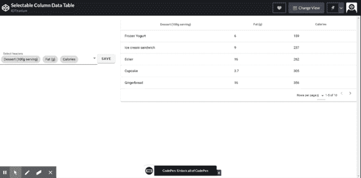
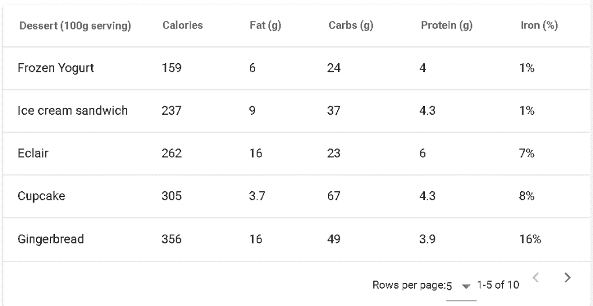

# 用 Vue.js 和 Vuetify - LogRocket Blog 构建一个可选择的标题数据表

> 原文：<https://blog.logrocket.com/building-a-selectable-header-data-table-with-vue-js-and-vuetify/>

在构建类似企业的应用程序时，数据表是绝对必要的。一般来说，它们可用于多种应用。本文旨在帮助您的用户更好地控制数据的显示方式。这将改善你的应用程序的用户体验。

为此，我们将构建一个数据表，其标题可以使用著名的 Vue.js 的材料设计框架进行修改:Vuetify。



## 它是如何工作的

用户可以选择希望表格在左侧显示哪些列，并且可以立即在右侧看到变化。

然后，他们可以单击保存按钮，保存他们在浏览器中选择的配置。因此，当用户重新加载该页面或稍后返回该页面时，用户选择的列保持不变。

### 我们需要什么

我将在我的演示中使用 CodePen，但是如果您在 Vue.js 项目中实现它，那么您可能已经安装了 Vue.js 和 Vue CLI。您可以使用 Vue CLI 安装 Vuetify，如下所示:

```
vue add vuetify
```

这将对您的项目进行必要的更改，使您能够使用 Vuetify。您可以在 [Vuetify 文档](https://vuetifyjs.com/en/getting-started/installation/#vue-cli-install)中阅读更多关于 Vuetify 安装的信息。

对于这个 CodePen 演示，我将使用 HTML 脚本标签直接导入 Vue 和 Vuetify:

```
<html>

<head>
  <link href="https://fonts.googleapis.com/css?family=Roboto:100,300,400,500,700,900" rel="stylesheet">
  <link href="https://cdn.jsdelivr.net/npm/@mdi/[email protected]/css/materialdesignicons.min.css" rel="stylesheet">
  <link href="https://cdn.jsdelivr.net/npm/[email protected]/dist/vuetify.min.css" rel="stylesheet">
  <meta name="viewport" content="width=device-width, initial-scale=1, maximum-scale=1, user-scalable=no, minimal-ui">
</head>

<body>

  <script src="https://cdn.jsdelivr.net/npm/[email protected]/dist/vue.js"></script>
  <script src="https://cdn.jsdelivr.net/npm/[email protected]/dist/vuetify.js"></script>
</body>

</html>
```

### 创建数据表

现在我们已经设置好了，我们可以开始写一些代码了。

首先，我们需要用来填充数据表的数据。我将使用来自 Vuetify 文档的样本数据。

在笔的 JavaScript 部分，我们将有以下代码:

```
new Vue({
      el: '#app',
      vuetify: new Vuetify(),
      data () {
      return {
        headers: [
          {
            text: 'Dessert (100g serving)',
            align: 'start',
            sortable: false,
            value: 'name',
          },
          { text: 'Calories', value: 'calories' },
          { text: 'Fat (g)', value: 'fat' },
          { text: 'Carbs (g)', value: 'carbs' },
          { text: 'Protein (g)', value: 'protein' },
          { text: 'Iron (%)', value: 'iron' },
        ],
        desserts: [
          {
            name: 'Frozen Yogurt',
            calories: 159,
            fat: 6.0,
            carbs: 24,
            protein: 4.0,
            iron: '1%',
          },
          {
            name: 'Ice cream sandwich',
            calories: 237,
            fat: 9.0,
            carbs: 37,
            protein: 4.3,
            iron: '1%',
          },
          {
            name: 'Eclair',
            calories: 262,
            fat: 16.0,
            carbs: 23,
            protein: 6.0,
            iron: '7%',
          },
          {
            name: 'Cupcake',
            calories: 305,
            fat: 3.7,
            carbs: 67,
            protein: 4.3,
            iron: '8%',
          },
          {
            name: 'Gingerbread',
            calories: 356,
            fat: 16.0,
            carbs: 49,
            protein: 3.9,
            iron: '16%',
          },
          {
            name: 'Jelly bean',
            calories: 375,
            fat: 0.0,
            carbs: 94,
            protein: 0.0,
            iron: '0%',
          },
          {
            name: 'Lollipop',
            calories: 392,
            fat: 0.2,
            carbs: 98,
            protein: 0,
            iron: '2%',
          },
          {
            name: 'Honeycomb',
            calories: 408,
            fat: 3.2,
            carbs: 87,
            protein: 6.5,
            iron: '45%',
          },
          {
            name: 'Donut',
            calories: 452,
            fat: 25.0,
            carbs: 51,
            protein: 4.9,
            iron: '22%',
          },
          {
            name: 'KitKat',
            calories: 518,
            fat: 26.0,
            carbs: 65,
            protein: 7,
            iron: '6%',
          },
        ],
      }
    },
})
```

这是我们将提供给数据表组件的数据，Vuetify 很容易提供这些数据。

在笔的 HTML 部分，我们将使用数据表 componen: `V-data-table`:

```
<v-row>
  <v-col md="8" sm="12">
    <v-data-table :headers="headers" :items="desserts" :items-per-page="5" class="elevation-1"></v-data-table>
  </v-col>
</v-row>
```

注意，绑定到 headers 属性的 headers 数组是在上面的 data 属性中定义的。这包含带有`text`和`value`键的对象。这是`v-data-table`要求的标题对象的格式。文本是将要显示的内容，值是每个标题的唯一值。这也作为每个报头的标识符。

甜点数组携带表的内容，它被绑定到 items props，后者告诉数据表要显示什么内容。其他事情如`items-per-page`决定了你想在一个页面中查看多少条记录。`class`道具增加了一个 CSS 类。

这样，我们的数据表应该如下所示:



### 使标题可选

在我们的 HTML 中，我们将使用另一个名为`v-autocomplete`的 Vuetify 组件。这基本上是一个具有搜索能力的选择下拉菜单。

```
<v-autocomplete :items="headers" v-model="headersSelected" return-object label="Select headers" multiple chips></v-autocomplete>
```

注意，我们正在将 headers 数组(前面定义的)传递给这个组件的 items prop。这意味着下拉列表将用表格的标题填充。这个组件的`v-model`被绑定到一个名为`headersSelected`的新变量。这意味着，由于所有的标题都在下拉列表中，任何选中的标题都将被推入`headersSelected`变量。我们将把它定义为一个空数组。

在 JavaScript 部分，我们将把它添加到 data 属性中:

```
...
headersSelected: [],
...
```

现在，我们可以回到 HTML 中的数据表组件，将`headers`属性绑定到`headersSelected`变量。这将允许数据表的标题是动态的。

```
...
<v-data-table :headers="headersSelected" :items="desserts" :items-per-page="5" class="elevation-1"></v-data-table>
```

现在，因为默认情况下`headersSelected`是一个空数组，所以我们需要在页面加载时用数据填充它，以使用户能够在第一次加载时看到数据。为此，我们将使用一种方法:

```
...
methods: {
        populateHeaders(){
          let headers = JSON.parse(localStorage.getItem('headers'))
          if(!headers){
            this.headersSelected = this.headers
          }else{
            this.headersSelected = headers
          }
        },
}
...
```

上面的方法检查`localStorage`是否存在`headers`属性。如果不可用，它会将默认的头(`this.headers`)分配给`headersSelected`变量。

然后，我们可以调用`created()`生命周期钩子中的方法。

```
created(){
        this.populateHeaders()
      },
```

现在，我们的表格标题将是可选的。接下来，我们将看看如何在`localStorage`中保存选择。但是首先，让我们来看看到目前为止完整的 HTML 和 JavaScript 代码。

```
<html>

<head>
  <link href="https://fonts.googleapis.com/css?family=Roboto:100,300,400,500,700,900" rel="stylesheet">
  <link href="https://cdn.jsdelivr.net/npm/@mdi/[email protected]/css/materialdesignicons.min.css" rel="stylesheet">
  <link href="https://cdn.jsdelivr.net/npm/[email protected]/dist/vuetify.min.css" rel="stylesheet">
  <meta name="viewport" content="width=device-width, initial-scale=1, maximum-scale=1, user-scalable=no, minimal-ui">
</head>

<body>
  <div id="app" data-app>
    <template>
      <v-row align="center">
        <v-col class="d-flex" cols="12" sm="12" md="4">
<!--Select dropdown -->
          <v-autocomplete :items="headers" v-model="headersSelected" return-object label="Select headers" multiple chips></v-autocomplete>
        </v-col>

        <v-col md="8" sm="12">
<!--Data table-->
          <v-data-table :headers="headersSelected" :items="desserts" :items-per-page="5" class="elevation-1"></v-data-table>
        </v-col>
      </v-row>

    </template>
  </div>

  <script src="https://cdn.jsdelivr.net/npm/[email protected]/dist/vue.js"></script>
  <script src="https://cdn.jsdelivr.net/npm/[email protected]/dist/vuetify.js"></script>
</body>

</html>
```

Javascript:

```
new Vue({
      el: '#app',
      vuetify: new Vuetify(),
      data () {
      return {
        headers: [
          {
            text: 'Dessert (100g serving)',
            align: 'start',
            sortable: false,
            value: 'name',
          },
          { text: 'Calories', value: 'calories' },
          { text: 'Fat (g)', value: 'fat' },
          { text: 'Carbs (g)', value: 'carbs' },
          { text: 'Protein (g)', value: 'protein' },
          { text: 'Iron (%)', value: 'iron' },
        ],
        desserts: [
          {
            name: 'Frozen Yogurt',
            calories: 159,
            fat: 6.0,
            carbs: 24,
            protein: 4.0,
            iron: '1%',
          },
          {
            name: 'Ice cream sandwich',
            calories: 237,
            fat: 9.0,
            carbs: 37,
            protein: 4.3,
            iron: '1%',
          },
          {
            name: 'Eclair',
            calories: 262,
            fat: 16.0,
            carbs: 23,
            protein: 6.0,
            iron: '7%',
          },
          {
            name: 'Cupcake',
            calories: 305,
            fat: 3.7,
            carbs: 67,
            protein: 4.3,
            iron: '8%',
          },
          {
            name: 'Gingerbread',
            calories: 356,
            fat: 16.0,
            carbs: 49,
            protein: 3.9,
            iron: '16%',
          },
          {
            name: 'Jelly bean',
            calories: 375,
            fat: 0.0,
            carbs: 94,
            protein: 0.0,
            iron: '0%',
          },
          {
            name: 'Lollipop',
            calories: 392,
            fat: 0.2,
            carbs: 98,
            protein: 0,
            iron: '2%',
          },
          {
            name: 'Honeycomb',
            calories: 408,
            fat: 3.2,
            carbs: 87,
            protein: 6.5,
            iron: '45%',
          },
          {
            name: 'Donut',
            calories: 452,
            fat: 25.0,
            carbs: 51,
            protein: 4.9,
            iron: '22%',
          },
          {
            name: 'KitKat',
            calories: 518,
            fat: 26.0,
            carbs: 65,
            protein: 7,
            iron: '6%',
          },
        ],
        headersSelected: [],
      }
    },
      methods: {
        populateHeaders(){
          let headers = JSON.parse(localStorage.getItem('headers'))
          if(!headers){
            this.headersSelected = this.headers
          }else{
          this.headersSelected = headers
          }
        },
      },
      created(){
        this.populateHeaders()
      },
    })
Vue.use(Vuetify);
```

### 保存选择

为了保存，我们需要一个按钮和方法。我们将使用 Vuetify，HTML 中的`v-btn`按钮组件:

```
<v-btn @click="save" class="mt-3">Save</v-btn>
```

`@click`是该组件的事件监听器。这将侦听该按钮被单击后将发出的单击事件，并将调用 save 方法。

现在，让我们定义保存方法:

```
methods: {
        ...
        save(){
          localStorage.setItem('headers', JSON.stringify(this.headersSelected))
        alert('Table format saved')
        }
}
```

请注意，我们将包含在`this.headersSelected`中的所选头保存为一个 JSON 字符串，并将键头保存到`localStorage`中。

这样，当点击保存按钮时，此时所选的标题被保存到`localStorage`中。如果用户做出另一个选择并单击保存，新的选择将覆盖先前的选择。

* * *

### 更多来自 LogRocket 的精彩文章:

* * *

## 结论

构建应用程序时，用户体验是一个重要的考虑因素。数据表通常用于向用户快速提供大量信息。让您的用户能够决定他们想要查看哪一列数据是改善他们体验的好方法。

就是这样！

完整代码和演示在这里:

> 没有描述

像用户一样体验您的 Vue 应用

## 调试 Vue.js 应用程序可能会很困难，尤其是当用户会话期间有几十个(如果不是几百个)突变时。如果您对监视和跟踪生产中所有用户的 Vue 突变感兴趣，

.

[try LogRocket](https://lp.logrocket.com/blg/vue-signup)

LogRocket 就像是网络和移动应用程序的 DVR，记录你的 Vue 应用程序中发生的一切，包括网络请求、JavaScript 错误、性能问题等等。您可以汇总并报告问题发生时应用程序的状态，而不是猜测问题发生的原因。

[](https://lp.logrocket.com/blg/vue-signup)[https://logrocket.com/signup/](https://lp.logrocket.com/blg/vue-signup)

LogRocket Vuex 插件将 Vuex 突变记录到 LogRocket 控制台，为您提供导致错误的环境，以及出现问题时应用程序的状态。

现代化您调试 Vue 应用的方式- [开始免费监控](https://lp.logrocket.com/blg/vue-signup)。

Modernize how you debug your Vue apps - [Start monitoring for free](https://lp.logrocket.com/blg/vue-signup).