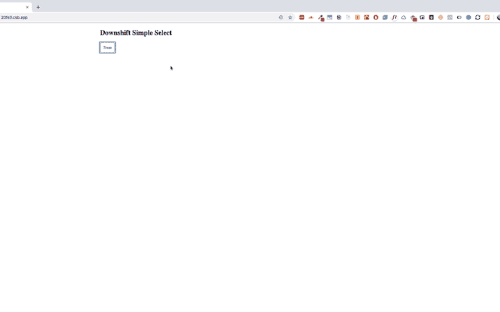
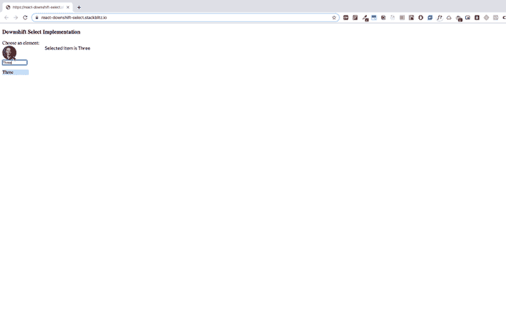
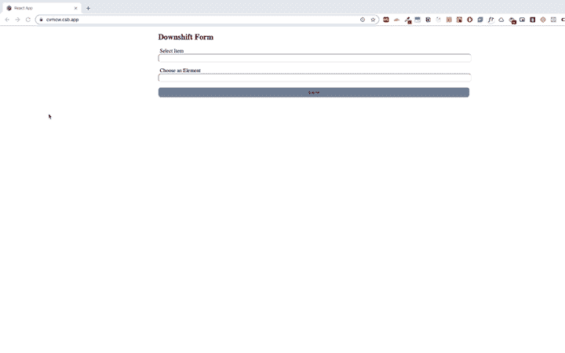
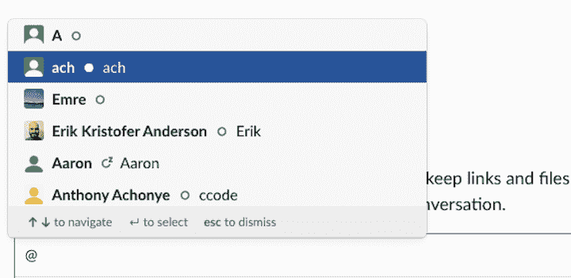
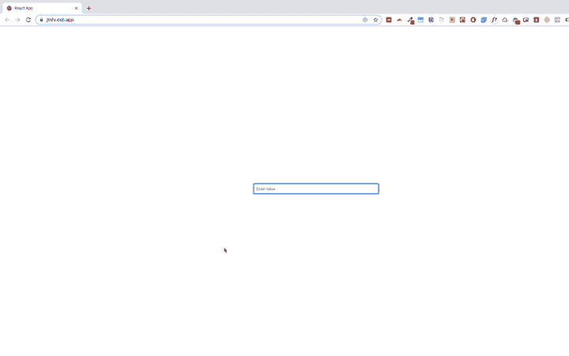

# 用降档构建可访问的组件

> 原文：<https://blog.logrocket.com/building-accessible-components-with-downshift/>

网络已经与我们的日常生活如此紧密地交织在一起，以至于我们几乎不再注意到它。你可能会用一个网络应用来做一些很平常的事情，比如在餐馆订座、打车、订机票，甚至是查询天气。

如果不与某种类型的 web 应用程序进行交互，我们大多数人都很难度过一天。这就是为什么让所有人都能访问您的应用程序如此重要，包括那些有听觉、认知、神经、身体、语言、视觉或其他残疾的人。

[网页可访问性](https://www.w3.org/WAI/standards-guidelines/wcag/)通常被称为 a11y，其中数字 11 代表省略的字母数。作为开发人员，我们不应该假设所有用户都以同样的方式与我们的应用程序交互。根据网络标准，如 [WAI-ARIA](https://www.w3.org/WAI/standards-guidelines/aria/) ，让每个人都能访问我们的网络应用是我们的责任。

让我们看一个真实世界的例子来说明网页可访问性的重要性。

考虑在没有鼠标的情况下使用这个 HTML 表单。如果你能很容易地完成你想要的任务，那么你可以考虑使用这种形式。

在本教程中，我们将演示如何使用[降档](https://github.com/downshift-js/downshift)来构建可访问的组件。降档是一个 JavaScript 库，用于在 React 中构建符合 WAI-ARIA 法规的灵活、增强的输入组件。

注意:我们将在降档中使用[反应钩](https://blog.logrocket.com/developing-responsive-layouts-with-react-hooks/)，因此所有组件都将使用降档钩制造。

## 选择组件

为了构建一个简单且可访问的 select 组件，我们将使用一个名为`useSelect`的 React 钩子，它是由降档提供的。



创建一个名为`DropDown.js`的文件，并添加以下代码。

```
 import React from "react";
import { useSelect } from "downshift";
import styled from "styled-components";
const DropDownContainer = styled.div`
  width: 200px;
`;
const DropDownHeader = styled.button`
  padding: 10px;
  display: flex;
  border-radius: 6px;
  border: 1px solid grey;
`;
const DropDownHeaderItemIcon = styled.div``;
const DropDownHeaderItem = styled.p``;
const DropDownList = styled.ul`
  max-height: "200px";
  overflow-y: "auto";
  width: "150px";
  margin: 0;
  border-top: 0;
  background: "white";
  list-style: none;
`;
const DropDownListItem = styled.li`
  padding: 5px;
  background: ${props => (props.ishighlighted ? "#A0AEC0" : "")};
  border-radius: 8px;
`;
const DropDown = ({ items }) => {
  const {
    isOpen,
    selectedItem,
    getToggleButtonProps,
    getMenuProps,
    highlightedIndex,
    getItemProps
  } = useSelect({ items });
  return (
    <DropDownContainer>
      <DropDownHeader {...getToggleButtonProps()}>
        {(selectedItem && selectedItem.value) || "Choose an Element"}
      </DropDownHeader>
      <DropDownList {...getMenuProps()}>
        {isOpen &&
          items.map((item, index) => (
            <DropDownListItem
              ishighlighted={highlightedIndex === index}
              key={`${item.id}${index}`}
              {...getItemProps({ item, index })}
            >
              {item.value}
            </DropDownListItem>
          ))}
      </DropDownList>
      <div tabIndex="0" />
    </DropDownContainer>
  );
};
export default DropDown;

```

在这里，我们有`styled-components`和`downshift`库。样式组件用于在 JavaScript 中创建 CSS。

我们还有一个`useSelect`钩子，它将 items 数组作为一个参数，并返回一些属性，包括以下内容。

*   [`isOpen`](https://github.com/downshift-js/downshift/tree/master/src/hooks/useSelect#isopen) 有助于维护菜单的状态。如果菜单被展开，`isOpen`将为真。如果是折叠的，它将返回 false
*   [`selectedItem`](https://github.com/downshift-js/downshift/tree/master/src/hooks/useSelect#isopen) 从列表中返回选中的项目
*   [`getToggleButtonProps`](https://github.com/downshift-js/downshift/tree/master/src/hooks/useSelect#gettogglebuttonprops) 提供了一个输入按钮，我们需要用我们的切换按钮绑定它(它可以是一个输入或一个按钮)
*   [`getMenuProps`](https://github.com/downshift-js/downshift/tree/master/src/hooks/useSelect#getmenuprops) 为菜单提供了道具。我们可以用一个 div 或 UI 元素来绑定它
*   [`getItemProps`](https://github.com/downshift-js/downshift/tree/master/src/hooks/useSelect#getitemprops) 返回我们需要绑定的道具与菜单列表项
*   [`highlightedIndex`](https://github.com/downshift-js/downshift/tree/master/src/hooks/useSelect#highlightedindex) 返回所选数组元素的索引，并使您能够在渲染时设置元素的样式

下面是`useSelect`提供的一些其他道具。

由于我们不能像这样渲染它，我们可以使用`itemToString`道具将它转换成一个字符串。

首先，呈现处理 select 组件的切换按钮的按钮。

```
{(selectedItem && selectedItem.value) || "Choose an Element"}
```

之后，用降档道具渲染菜单和菜单项。

```
<DropDownList {...getMenuProps()}>
        {isOpen &&
          items.map((item, index) => (
            <DropDownListItem
              ishighlighted={highlightedIndex === index}
              key={`${item.id}${index}`}
              {...getItemProps({ item, index })}
            >
              {item.value}
            </DropDownListItem>
          ))}
</DropDownList>

```

自动完成组件

## 除了具有搜索功能之外，Autocomplete 的工作方式与 select 组件相同。让我们看看如何使用降档来构建一个自动完成组件。



与降档不同，自动完成组件使用`useCombobox`钩子。

`useCombobox`将 items 数组以及我们在前一个组件中讨论过的一些其他道具作为输入。`useCombobox`提供以下道具。

```
import React,{ useState } from 'react';
import { IconButton,Avatar,Icon } from '@chakra-ui/core';
import { useCombobox } from 'downshift';
import styled from "styled-components";
const Input = styled.input`
  width: 80px;
  border: 1px solid black;
  display :  ${({ isActive }) => isActive ? 'block' : 'none'}
  border-bottom-left-radius: ${({ isActive }) => isActive && 0};
  border-bottom-right-radius: ${({ isActive }) => isActive && 0};
  border-radius: 3px;
`;

const SelectHook = ({
  items,
  onChange,
  menuStyles
}) => {
  const [inputItems, setInputItems] = useState(items);
  const {
    isOpen,
    getToggleButtonProps,
    getLabelProps,
    getMenuProps,
    getInputProps,
    getComboboxProps,
    highlightedIndex,
    getItemProps,
    onStateChange,
    onSelectedItemChange,
    selectedItem,
    itemToString
  } = useCombobox({ 
    items: inputItems,
    itemToString : item => (item ? item.value : ""),
    onInputValueChange: ({ inputValue }) => {
      let inputItem = items.filter(item => {

         return item.value.toLowerCase().startsWith(inputValue.toLowerCase())
      }
        );

      setInputItems(inputItem)
    },
    onStateChange : (state) => {
      console.log("state",state);
      if(state.inputValue){
          onChange(state.selectedItem);
      }
      if(!state.isOpen){
          return {
            ...state,
            selectedItem : ""
          }
      }

    }
     });

   return (
      <div>
       <label {...getLabelProps()}>Choose an element:</label> 
      <div {...getToggleButtonProps()}>
       <Avatar name="Kent Dodds" src="https://bit.ly/kent-c-dodds"/>
       </div>
      <div style={{ display: "inline-block" }} {...getComboboxProps()}>
        <Input {...getInputProps()} isActive={isOpen} />
      </div>
      <ul {...getMenuProps()} style={menuStyles}>
        {isOpen &&
          inputItems.map((item, index) => (
            <li
              style={
                highlightedIndex === index ? { backgroundColor: "#bde4ff" } : {}
              }
              key={`${item}${index}`}
              {...getItemProps({ item, index })}
            >
              {item.value}
            </li>
          ))}
      </ul>
    </div>
   )
}
export default SelectHook;

```

`getComboboxProps`是 select 组件中 input 元素的包装器，提供 combobox 降档支持。

*   当输入元素的值改变时，调用`onInputValueChange`。您可以通过此事件回调来管理组件本身中输入元素的状态
*   让我们分解组件，试着理解它的逻辑。

该组件有三个支柱:

`items`，代表输入元素数组

1.  `onChange`，当所选项目发生变化时调用
2.  `menuStyles`，这是可选的；你可以把它作为道具传递，也可以运行下面的

    ```
    const SelectHook = ({ items, onChange, menuStyles }) => { }
    ```

3.  现在我们有了状态值，它维护输入值和`useCombobox`钩子。

更多来自 LogRocket 的精彩文章:

* * *

### 一旦我们设置了钩子，我们就可以使用它为自动完成组件提供的所有属性。

* * *

```
const [inputItems, setInputItems] = useState(items);

  const {
    isOpen,
    getToggleButtonProps,
    getLabelProps,
    getMenuProps,
    getInputProps,
    getComboboxProps,
    highlightedIndex,
    getItemProps,
    onStateChange,
    onSelectedItemChange,
    selectedItem,
    itemToString
  } = useCombobox({ 
    items: inputItems,
    itemToString : item => (item ? item.value : ""),
    onInputValueChange: ({ inputValue }) => {
      let inputItem = items.filter(item => {

         return item.value.toLowerCase().startsWith(inputValue.toLowerCase())
      }
        );

      setInputItems(inputItem)
    },
    onStateChange : (state) => {
      if(state.inputValue){
          onChange(state.selectedItem);
      }
      if(!state.isOpen){
          return {
            ...state,
            selectedItem : ""
          }
      }

    }
     });

```

先从切换按钮道具说起。为任何想要用作 toggler 的元素设置它。

这给了我们一个输入元素，我们需要与下拉菜单一起呈现。

```
<div {...getToggleButtonProps()}>
   <Avatar name="Kent Dodds" src="https://bit.ly/kent-c-dodds"/>
 </div>

```

最后，我们有清单和清单项目，采取降档道具，如`getMenuProps`和`getItemProps`。

```
<div style={{ display: "inline-block" }} {...getComboboxProps()}>
    <Input {...getInputProps()} isActive={isOpen} />
</div>

```

导出到 create-react-app CLI 的 React 应用程序的启动项目。

```
<ul {...getMenuProps()} style={menuStyles}>
        {isOpen &&
          inputItems.map((item, index) => (
            <li
              style={
                highlightedIndex === index ? { backgroundColor: "#bde4ff" } : {}
              }
              key={`${item}${index}`}
              {...getItemProps({ item, index })}
            >
              {item.value}
            </li>
          ))}
</ul>

```

> 下拉表单

在这一节中，我们将演示如何在你的窗体中使用下拉菜单降档。

## 

这里我们有两个组件:`DownshiftInput.js`用于自动完成组件，而`App.js`用于处理表单。

首先，实现`DownshiftInput.js`。

这里我们实现了在自动完成组件中使用的相同逻辑，即`useCombobox`钩子。

我们在该组件中使用的道具包括:

```
import React, { useState } from "react";
import styled from "styled-components";
import { useCombobox } from "downshift";
const DropDownContainer = styled.div`
  width: 100%;
`;
const DropDownInput = styled.input`
  width: 100%;
  height: 20px;
  border-radius: 8px;
`;
const DropDownInputLabel = styled.label`
  padding: 5px;
`;
const DropDownMenu = styled.ul`
  max-height: "180px";
  overflow-y: "auto";
  width: "90px";
  border-top: 0;
  background: "white";
  position: "absolute";
  list-style: none;
  padding: 0;
`;
const DropDownMenuItem = styled.li`
  padding: 8px;
  background-color: ${props => (props.ishighlighted ? "#bde4ff" : "")};
  border-radius: 8px;
`;
const DownshiftInput = ({ items, onChange, labelName }) => {
  const [inputItems, setInputItems] = useState(items);
  const [inputValue, setInputValue] = useState("");
  const {
    isOpen,
    getInputProps,
    getLabelProps,
    getItemProps,
    getMenuProps,
    highlightedIndex
  } = useCombobox({
    items,
    itemToString: item => {
      return item && item.value;
    },
    onInputValueChange: ({ inputValue }) => {
      let inputItem = items.filter(item => {
        return item.value.toLowerCase().startsWith(inputValue.toLowerCase());
      });
      setInputItems(inputItem);
      setInputValue(inputValue);
    },
    onSelectedItemChange: ({ selectedItem }) => {
      onChange(selectedItem);
      setInputValue(selectedItem.value);
    }
  });
  return (
    <DropDownContainer>
      <DropDownInputLabel {...getLabelProps()}>{labelName}</DropDownInputLabel>
      <DropDownInput
        {...getInputProps({
          value: inputValue
        })}
      />
      <DropDownMenu {...getMenuProps()}>
        {isOpen &&
          inputItems.map((item, index) => (
            <DropDownMenuItem
              ishighlighted={highlightedIndex === index}
              key={`${item}${index}`}
              {...getItemProps({ item, index })}
            >
              {item.value}
            </DropDownMenuItem>
          ))}
      </DropDownMenu>
    </DropDownContainer>
  );
};
export default DownshiftInput;

```

`isOpen`，用于管理菜单的状态

`getInputProps`，应与输入元素绑定

*   `getLabelProps`用标签来绘制地图
*   `getItemProps`，用于将降档道具与菜单项绑定
*   `getMenuProps`，用于将降档映射到我们的菜单
*   `highlightedIndex`，返回高亮显示的元素索引
*   挂钩的降档事件回调包括:
*   `onInputValueChange`，从输入元素返回`inputValue`

`onSelectedItemChange`，当选择的项目改变时调用

*   `App.js`:
*   聊天提及

最后一步是建立一个聊天框提及功能。我们可以通过降档来做到这一点。

```
import React, { useState } from "react";
import "./styles.css";
import styled from "styled-components";
import DownshiftInput from "./DownshiftInput";
const Container = styled.div`
  width: 50%;
  margin: auto;
  top: 50%;
  /* transform: translateY(-50%); */
`;
const ContainerHeader = styled.h2``;
const Form = styled.form`
  /* border: 3px solid grey; */
`;
const FormButton = styled.button`
  width: 100%;
  padding: 8px;
  background-color: #718096;
  border-radius: 8px;
`;
export default function App() {
  const [state, setState] = useState({
    item: {},
    element: {}
  });
  const items = [
    { id: "1", value: "One" },
    { id: "2", value: "Two" },
    { id: "3", value: "Three" },
    { id: "4", value: "Four" },
    { id: "5", value: "Five" }
  ];
  const onItemChange = value => {
    setState({ ...state, item: value });
  };
  const onElementChange = value => {
    setState({ ...state, element: value });
  };
  const onSubmit = e => {
    e.preventDefault();
    console.log("submitted", state);
    alert(`item is:${state.item.value} and Element is ${state.element.value}`);
  };
  return (
    <Container>
      <ContainerHeader>Downshift Form</ContainerHeader>
      <Form onSubmit={onSubmit}>
        <DownshiftInput
          items={items}
          onChange={onItemChange}
          labelName="Select Item"
        />
        <DownshiftInput
          items={items}
          onChange={onElementChange}
          labelName="Choose an Element"
        />
        <FormButton>Submit</FormButton>
      </Form>
    </Container>
  );
}

```

这是成品的一个例子:

## 

在输入元素的顶部会打开一个下拉菜单。这是一个在消息中提到用户的便利功能。



为了将下拉菜单放置在输入的顶部，我们将使用 React Popper 和 Downshift。

在构建组件之前，让我们回顾一下与 Popper 相关的三个最重要的概念。

`Manager` —所有的反应弹出器组件都应该包装在管理器组件中

`Reference` —反应弹出器使用引用组件来管理弹出器。如果使用按钮作为引用，弹出器将根据按钮组件打开或关闭

管理应该在 Popper 上呈现的内容。Popper 基于不同的操作打开自定义组件，如按钮单击或输入更改

1.  让我们创建一个名为`MentionComponent.js`的组件，并添加以下代码。
2.  让我们逐一分解每个部分。与 React Popper 相关的一切都应该包装在`Manager`组件中。
3.  之后，`Reference`组件包装了`Input`元素。

这里我们从降档实现了`getInputProps`,并将其与一个输入元素绑定。

```
import React, { useState } from "react";
import { useCombobox } from "downshift";
import styled from "styled-components";
import { Popper, Manager, Reference } from "react-popper";
const Container = styled.div``;
const DropDownInput = styled.input``;
const DropDownMenu = styled.ul`
  max-height: "180px";
  overflow-y: "auto";
  width: "90px";
  border-top: 0;
  background: "blue";
  position: "absolute";
  list-style: none;
  padding: 0;
`;
const DropDownMenuItem = styled.li`
  padding: 8px;
  background-color: ${props => (props.ishighlighted ? "#bde4ff" : "")};
  border-radius: 8px;
`;
const MentionComponent = ({ items }) => {
  const [inputItems, setInputItems] = useState(items);
  const {
    isOpen,
    getInputProps,
    getItemProps,
    getMenuProps,
    highlightedIndex
  } = useCombobox({
    items,
    itemToString: item => {
      console.log("item", item);
      return item ? item.value : null;
    },
    onInputValueChange: ({ inputValue }) => {
      let inputItem = items.filter(item => {
        return item.value.toLowerCase().startsWith(inputValue.toLowerCase());
      });
      setInputItems(inputItem);
    }
  });
  return (
    <Container>
      <Manager>
        <Reference>
          {/* {({ ref }) => (

          )} */}
          {({ ref }) => (
            <div
              style={{
                width: "20%",
                margin: "auto",
                display: "flex",
                alignItems: "flex-end",
                height: "50vh"
              }}
              // ref={ref}
            >
              <DropDownInput
                ref={ref}
                {...getInputProps({
                  placeholder: "Enter Value",
                  style: {
                    width: "100%",
                    padding: "8px",
                    borderRadius: "6px",
                    border: "1px solid grey"
                  }
                })}
              />
            </div>
          )}
        </Reference>
        {isOpen ? (
          <Popper placement="top">
            {({
              ref: setPopperRef,
              style,
              placement,
              arrowProps,
              scheduleUpdate
            }) => {
              return (
                <DropDownMenu
                  {...getMenuProps({
                    ref: ref => {
                      if (ref !== null) {
                        setPopperRef(ref);
                      }
                    },
                    style: {
                      ...style,
                      background: "grey",
                      opacity: 1,
                      top: "10%",
                      left: "40%",
                      width: "20%"
                    },
                    "data-placement": placement
                  })}
                >
                  {isOpen &&
                    inputItems.map((item, index) => (
                      <DropDownMenuItem
                        ishighlighted={highlightedIndex === index}
                        key={`${item}${index}`}
                        {...getItemProps({ item, index })}
                      >
                        {item.value}
                      </DropDownMenuItem>
                    ))}
                </DropDownMenu>
              );
            }}
          </Popper>
        ) : null}
      </Manager>
    </Container>
  );
};
export default MentionComponent;

```

popper 本身包含菜单和带有降档道具的菜单项，如`getMenuProps`和`getItemProps`。

我们像在自动完成组件中一样使用降档挂钩`useCombobox`。除了我们将它包装在`popper.js`中之外，大部分逻辑是相同的。

```
 <Reference>
          {({ ref }) => (
            <div
              style={{
                width: "20%",
                margin: "auto",
                display: "flex",
                alignItems: "flex-end",
                height: "50vh"
              }}
              // ref={ref}
            >
              <DropDownInput
                ref={ref}
                {...getInputProps({
                  placeholder: "Enter Value",
                  style: {
                    width: "100%",
                    padding: "8px",
                    borderRadius: "6px",
                    border: "1px solid grey"
                  }
                })}
              />
            </div>
          )}
        </Reference>

```

摘要

现在，您应该已经掌握了使用降档在应用程序中构建可访问组件的基本工具和知识。总之，我们讨论了如何构建一个可访问的简单选择组件、可访问的自动完成和表单下拉列表，以及如何通过 Popper.js 使用降档。

```
{isOpen ? (
          <Popper placement="top">
            {({
              ref: setPopperRef,
              style,
              placement,
              arrowProps,
              scheduleUpdate
            }) => {
              return (
                <DropDownMenu
                  {...getMenuProps({
                    ref: ref => {
                      if (ref !== null) {
                        setPopperRef(ref);
                      }
                    },
                    style: {
                      ...style,
                      background: "grey",
                      opacity: 1,
                      top: "10%",
                      left: "40%",
                      width: "20%"
                    },
                    "data-placement": placement
                  })}
                >
                  {isOpen &&
                    inputItems.map((item, index) => (
                      <DropDownMenuItem
                        ishighlighted={highlightedIndex === index}
                        key={`${item}${index}`}
                        {...getItemProps({ item, index })}
                      >
                        {item.value}
                      </DropDownMenuItem>
                    ))}
                </DropDownMenu>
              );
            }}
          </Popper>
        ) : null}

```

在我看来，我们不应该将网页可访问性视为一种功能；我们应该把让每个人都能访问网络视为我们的责任。

使用 LogRocket 消除传统反应错误报告的噪音

## 是一款 React analytics 解决方案，可保护您免受数百个误报错误警报的影响，只针对少数真正重要的项目。LogRocket 告诉您 React 应用程序中实际影响用户的最具影响力的 bug 和 UX 问题。

自动聚合客户端错误、反应错误边界、还原状态、缓慢的组件加载时间、JS 异常、前端性能指标和用户交互。然后，LogRocket 使用机器学习来通知您影响大多数用户的最具影响力的问题，并提供您修复它所需的上下文。

关注重要的 React bug—[今天就试试 LogRocket】。](https://lp.logrocket.com/blg/react-signup-issue-free)

## Cut through the noise of traditional React error reporting with LogRocket

[LogRocket](https://lp.logrocket.com/blg/react-signup-issue-free)

is a React analytics solution that shields you from the hundreds of false-positive errors alerts to just a few truly important items. LogRocket tells you the most impactful bugs and UX issues actually impacting users in your React applications.

[ ](https://lp.logrocket.com/blg/react-signup-general) [  ](https://lp.logrocket.com/blg/react-signup-general) [LogRocket](https://lp.logrocket.com/blg/react-signup-issue-free)

automatically aggregates client side errors, React error boundaries, Redux state, slow component load times, JS exceptions, frontend performance metrics, and user interactions. Then LogRocket uses machine learning to notify you of the most impactful problems affecting the most users and provides the context you need to fix it.

Focus on the React bugs that matter — [try LogRocket today](https://lp.logrocket.com/blg/react-signup-issue-free).