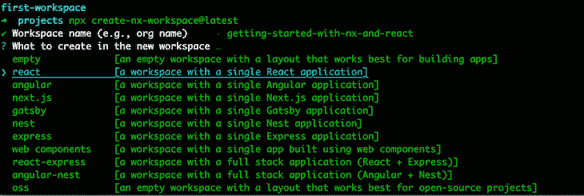
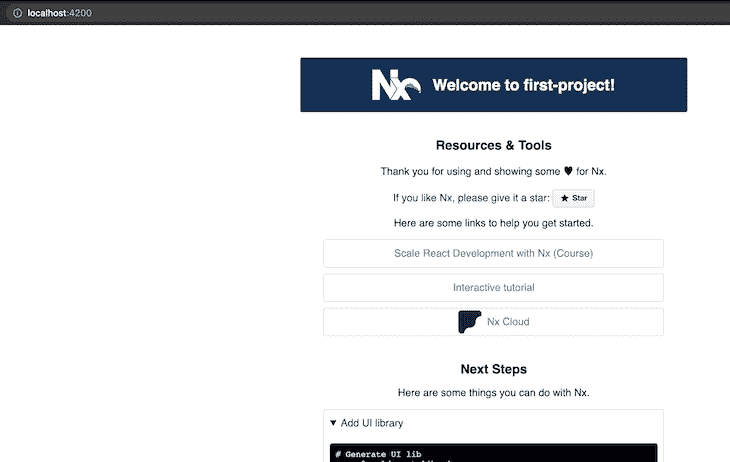
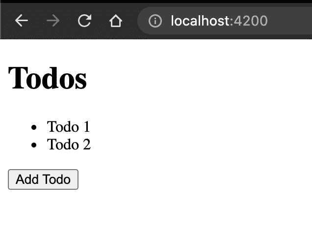
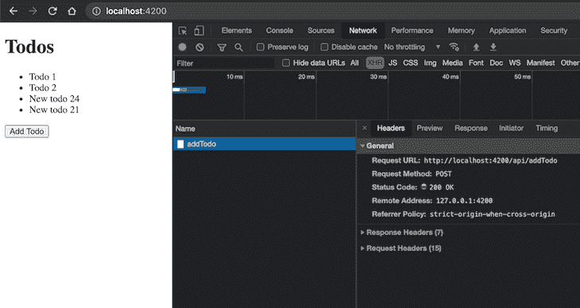
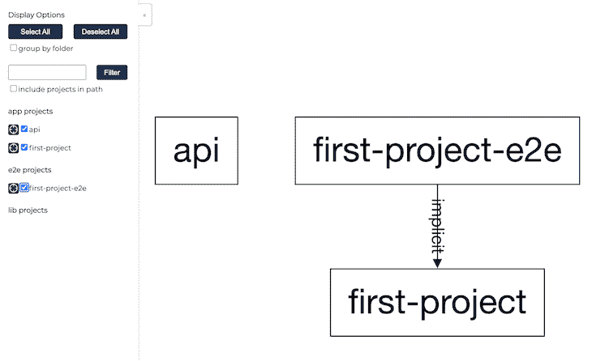

# 使用 React 和 Nx - LogRocket 博客构建应用程序

> 原文：<https://blog.logrocket.com/building-an-application-with-react-and-nx/>

构建工具对于任何 web 开发人员来说都是宝贵的资产。目前，许多优秀的构建工具可用于所有领先的 JavaScript 框架。Nx 是一个构建框架，允许你构建 monorepos 和 scaffold full 应用程序，这是最近越来越受欢迎的一个例子。

Nx 自动化了开发人员在构建应用程序时通常必须手动执行的许多步骤。它包括计算缓存、依赖图和构建自动化等特性，还包括一个与 Cypress 集成的[插件。](https://nx.dev/latest/angular/cypress/overview)

在这篇文章中，我们将使用 Nx 和 React 构建一个简单的待办事项列表应用程序。要跟进，请查看我在 GitHub 上的[示例项目。](https://github.com/andrewevans0102/getting-started-with-nx-and-react)

我们开始吧！

## 设置工作空间

首先，您需要创建一个 Nx 工作空间。您可以通过运行以下代码使用`npx`来实现这一点:

```
npx [email protected]

```

也可以[全局安装 Nx](https://www.npmjs.com/package/nx)。

当 CLI 运行时，它会创建一个工作区，该工作区基本上是项目的容器。当我们完成后，这个容器将成为一个 monorepo。



在搭建出项目的主要框架之前，CLI 会询问您一系列问题。我们正在构建一个 React 应用程序，因此文件结构看起来像下面的代码块:

```
├── README.md
├── apps
│   ├── first-project
│   └── first-project-e2e
├── babel.config.json
├── jest.config.js
├── jest.preset.js
├── libs
├── nx.json
├── package-lock.json
├── package.json
├── tools
│   ├── generators
│   └── tsconfig.tools.json
├── tsconfig.base.json
└── workspace.json

```

文件结构包括一个有两个文件夹的`apps`目录。一个是项目本身，另一个是用 Cypress 运行[端到端测试。](https://blog.logrocket.com/how-to-write-useful-end-to-end-tests-with-cypress/)

现在您已经有了一个搭建好的应用程序，您可以使用`npx nx serve first-project`来运行它。

您将收到以下输出:



## 创建 API

让我们在 React 项目旁边创建一个 API，我们可以用它来执行任何 REST 调用。Nx 的一个很酷的特性是它能够在一个命令中添加一个 API 到你的项目中。

我们将使用 Express 创建一个 [API。首先，您需要用 Nx CLI 安装`express`插件:](https://nx.dev/latest/react/tutorial/05-add-node-app#add-express-plugin-to-your-workspace)

```
npm install --save-dev @nrwl/express

```

现在，您可以使用以下命令创建 API:

```
npx nx g @nrwl/express:app api --frontendProject=first-project

```

文件夹结构应该类似于下面的代码:

```
├── README.md
├── apps
│   ├── api
│   ├── first-project
│   └── first-project-e2e
├── babel.config.json
├── jest.config.js
├── jest.preset.js
├── libs
├── nx.json
├── package-lock.json
├── package.json
├── tools
│   ├── generators
│   └── tsconfig.tools.json
├── tsconfig.base.json
└── workspace.json

```

## 搭建应用程序

现在我们已经有了构建模块，让我们看看到目前为止我们已经构建了什么！如果您查看`apps`文件夹，您会看到以下代码:

```
├── api
│   ├── jest.config.js
│   ├── src
│   │   ├── app
│   │   ├── assets
│   │   ├── environments
│   │   └── main.ts
│   ├── tsconfig.app.json
│   ├── tsconfig.json
│   └── tsconfig.spec.json
├── first-project
│   ├── jest.config.js
│   ├── proxy.conf.json
│   ├── src
│   │   ├── app
│   │   ├── assets
│   │   ├── environments
│   │   ├── favicon.ico
│   │   ├── index.html
│   │   ├── main.tsx
│   │   ├── polyfills.ts
│   │   └── styles.scss
│   ├── tsconfig.app.json
│   ├── tsconfig.json
│   └── tsconfig.spec.json
└── first-project-e2e
    ├── cypress.json
    ├── src
    │   ├── fixtures
    │   ├── integration
    │   ├── plugins
    │   └── support
    ├── tsconfig.e2e.json
    └── tsconfig.json

```

`api`项目是用`main.ts`搭建的全 Express app，一个`entrypoint`文件:

```
/**
 * This is not a production server yet!
 * This is only a minimal backend to get started.
 */
import * as express from 'express';
const app = express();
app.get('/api', (req, res) => {
  res.send({ message: 'Welcome to api!' });
});
const port = process.env.port || 3333;
const server = app.listen(port, () => {
  console.log(`Listening at http://localhost:${port}/api`);
});
server.on('error', console.error);

```

进入`first-project`文件夹。您将看到 React 应用程序采用传统的文件夹结构构建，常见于`assets`、`styles`、`index`、`main`和`app`文件中:

```
import { StrictMode } from 'react';
import * as ReactDOM from 'react-dom';
import App from './app/app';
ReactDOM.render(
  <StrictMode>
    <App />
  </StrictMode>,
  document.getElementById('root')
);

```

最后，如果您查看`first-project-e2e`文件夹，您会看到 Cypress 项目具有任何 Cypress 测试套件的传统结构:

```
├── cypress.json
├── src
│   ├── fixtures
│   ├── integration
│   ├── plugins
│   └── support
├── tsconfig.e2e.json
└── tsconfig.json

```

## 调用 API

到目前为止，我们已经构建了一个脚手架应用程序。现在，让我们添加一个显示 CLI 运行的功能！我打算用 React 和 Nx 构建一个简单的[待办应用。](https://nx.dev/latest/react/tutorial/01-create-application)

首先，将下面的代码复制到`apps/first-project/src/app/app.tsx`文件夹中:

```
import React, { useState } from 'react';
interface Todo {
  title: string;
}
export const App = () => {
  const [todos, setTodos] = useState<Todo[]>([
    { title: 'Todo 1' },
    { title: 'Todo 2' },
  ]);
  function addTodo() {
    setTodos([
      ...todos,
      {
        title: `New todo ${Math.floor(Math.random() * 1000)}`,
      },
    ]);
  }
  return (
    <>
      <h1>Todos</h1>
      <ul>
        {todos.map((t) => (
          <li className={'todo'}>{t.title}</li>
        ))}
      </ul>
      <button id={'add-todo'} onClick={addTodo}>
        Add Todo
      </button>
    </>
  );
};
export default App;

```

如果您从项目根目录运行`npm run start`,您将看到以下内容:



到目前为止，一切顺利！我们可以通过集成对 API 项目的调用来改进我们的代码。首先，创建一个名为`apps/api/src/app/todos.ts`的文件，并向其中添加以下代码:

```
import { Express } from 'express';

interface Todo {
  title: string;
}

const todos: Todo[] = [{ title: 'Todo 1' }, { title: 'Todo 2' }];

export function addTodoRoutes(app: Express) {
  app.get('/api/todos', (req, resp) => resp.send(todos));
  app.post('/api/addTodo', (req, resp) => {
    const newTodo = {
      title: `New todo ${Math.floor(Math.random() * 1000)}`,
    };
    todos.push(newTodo);
    resp.send(newTodo);
  });
}

```

上面的代码创建了我们的 API 需要的许多路线。现在，我们将通过修改`apps/api/src/main.ts`文件向我们的 API 注册路由，如下所示:

```
import * as express from 'express';
import { addTodoRoutes } from './app/todos';
const app = express();
app.get('/api', (req, res) => {
  res.send({ message: 'Welcome to api!' });
});
addTodoRoutes(app);
const port = process.env.port || 3333;
const server = app.listen(port, () => {
  console.log(`Listening at http://localhost:${port}/api`);
});
server.on('error', console.error);

```

运行`npx nx serve api`并点击`[http://localhost:3333/api/todos](http://localhost:3333/api/todos)`。您将看到以下内容:

```
[{"title":"Todo 1"},{"title":"Todo 2"}]

```

现在，让我们从我们的应用程序调用 API。我们将设置一个代理，以便 React 应用程序的 API 调用直接调用 API。

查看项目根目录下的`workspace.json`文件，在这里可以找到整个应用程序的配置。

接下来，我们需要在我们的`first-project` React 应用程序的`serve`目标中定位`proxyConfig`，它应该看起来像下面的代码块:

```
{
  "serve": {
    "builder": "@nrwl/web:dev-server",
    "options": {
      "buildTarget": "first-project:build",
      "proxyConfig": "apps/first-project/proxy.conf.json"
    },
    "configurations": {
      "production": {
        "buildTarget": "first-projects:build:production"
      }
    }
  }
}

```

在`apps/first-project/proxy.conf.json`的`proxyConifg`设置处打开文件，并添加以下代码。它将代理所有 API 调用来调用您的 API 项目:

```
{
  "/api": {
    "target": "http://localhost:3333",
    "secure": false
  }
}

```

现在，如果我们修改`first-rproject`文件夹中的`main.ts`文件，我们可以调用 API，而不是使用我们最初设置的本地状态。修改`apps/first-project/src/app/app.tsx`,看起来像下面的代码块:

```
import React, { useEffect, useState } from 'react';

interface Todo {
  title: string;
}

const App = () => {
  const [todos, setTodos] = useState<Todo[]>([]);

  useEffect(() => {
    fetch('/api/todos')
      .then((_) => _.json())
      .then(setTodos);
  }, []);

  function addTodo() {
    fetch('/api/addTodo', {
      method: 'POST',
      body: '',
    })
      .then((_) => _.json())
      .then((newTodo) => {
        setTodos([...todos, newTodo]);
      });
  }

  return (
    <>
      <h1>Todos</h1>
      <ul>
        {todos.map((t) => (
          <li className={'todo'}>{t.title}</li>
        ))}
      </ul>
      <button id={'add-todo'} onClick={addTodo}>
        Add Todo
      </button>
    </>
  );
};

export default App;

```

现在，我们的 React 应用程序正在调用 API，而不是依赖于本地状态。

让我们运行 API 和`frontendProject`！可以用`npx nx serve first-project`和`npx nx serve api`。你也可以使用一个 npm 包，比如同时使用和`[start-server-and-test](https://www.npmjs.com/package/start-server-and-test)`，来使用脚本自动运行 API。



## 用柏树测试

如前所述，Nx 在搭建应用程序时内置了 [Cypress](https://blog.logrocket.com/cypress-io-the-selenium-killer/) 测试。

要查看运行中的测试，修改位于`apps/first-project-e2e/src/support/app.po.ts`的测试文件，使其包含以下内容:

```
export const getTodos = () => cy.get('li.todo');
export const getAddTodoButton = () => cy.get('button#add-todo');

```

现在，修改位于`apps/first-project-e2e/src/integration/app.spec.ts`的文件，使其看起来像下面的代码:

```
import { getAddTodoButton, getTodos } from '../support/app.po';

describe('TodoApps', () => {
  beforeEach(() => cy.visit('/'));

  it('should display todos', () => {
    getTodos().should((t) => expect(t.length).equal(2));
    getAddTodoButton().click();
    getTodos().should((t) => expect(t.length).equal(3));
  });
});

```

运行`npx nx e2e first-project-e2e --watch`查看您的测试运行情况！

## Nx 的其他特性

Nx CLI 有许多功能超出了我们到目前为止所介绍的内容。其中最有用的是为你的项目生成依赖图的能力，这通过数据可视化简化了复杂的项目。我们简单的待办事项应用程序不需要这个，但是看到都一样很酷！

首先运行以下代码:

```
npx nx dep-graph 
```

您将收到类似下图的输出:



另一个非常酷的功能是 Nx 能够检测变化，并且只重建受项目最新修改影响的部分。下面是一些利用这个特性的示例命令，它们来自于 [Nx 文档](https://nx.dev/latest/react/core-concepts/affected)。

```
nx affected:apps # prints affected apps
nx affected:libs # prints affected libs
nx affected:build # builds affected apps and libs
nx affected:lint # lints affected apps and libs
nx affected:test # tests affected apps and libs
nx affected:e2e # e2e tests affected apps

```

最后，Nx 允许你[创建库](https://nx.dev/latest/react/tutorial/08-create-libs)和[计算缓存](https://nx.dev/latest/react/tutorial/10-computation-caching)来提高性能。我强烈推荐阅读更多关于这些和其他特性的内容！

## 后续步骤

在本教程中，我们通过搭建一个简单的待办应用程序，讲述了使用 React 和 Nx 的基础知识。我们项目的下一步是构建资产并部署它们。Nx 可以自动构建小型项目，也可以通过企业应用程序扩展到[大型项目。](https://nx.dev/latest/react/guides/monorepo-nx-enterprise#using-nx-at-enterprises.)

我希望你喜欢阅读这篇文章！我希望它已经启发了你去看看 Nx，并与 React 一起使用。我强烈建议查看 Nx 文档并阅读他们的一些指南以获取更多信息。

在 [andrewevans.dev](https://www.andrewevans.dev/) 上关注我，在 [@AndrewEvans0102](https://twitter.com/AndrewEvans0102) 的 Twitter 上与我联系。

## [LogRocket](https://lp.logrocket.com/blg/react-signup-general) :全面了解您的生产 React 应用

调试 React 应用程序可能很困难，尤其是当用户遇到难以重现的问题时。如果您对监视和跟踪 Redux 状态、自动显示 JavaScript 错误以及跟踪缓慢的网络请求和组件加载时间感兴趣，

[try LogRocket](https://lp.logrocket.com/blg/react-signup-general)

.

[ ](https://lp.logrocket.com/blg/react-signup-general) [](https://lp.logrocket.com/blg/react-signup-general) 

LogRocket 结合了会话回放、产品分析和错误跟踪，使软件团队能够创建理想的 web 和移动产品体验。这对你来说意味着什么？

LogRocket 不是猜测错误发生的原因，也不是要求用户提供截图和日志转储，而是让您回放问题，就像它们发生在您自己的浏览器中一样，以快速了解哪里出错了。

不再有嘈杂的警报。智能错误跟踪允许您对问题进行分类，然后从中学习。获得有影响的用户问题的通知，而不是误报。警报越少，有用的信号越多。

LogRocket Redux 中间件包为您的用户会话增加了一层额外的可见性。LogRocket 记录 Redux 存储中的所有操作和状态。

现代化您调试 React 应用的方式— [开始免费监控](https://lp.logrocket.com/blg/react-signup-general)。