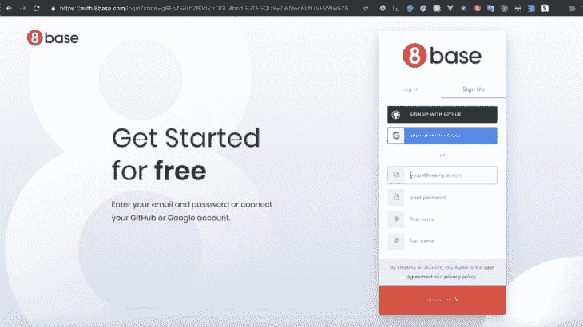
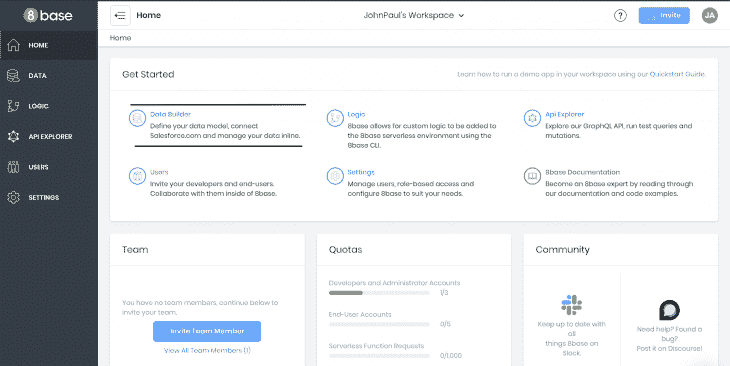
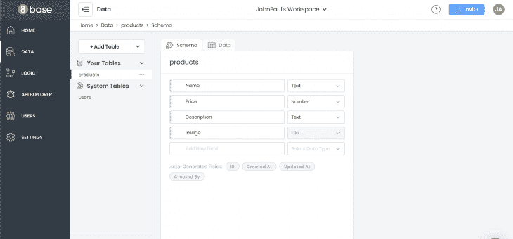
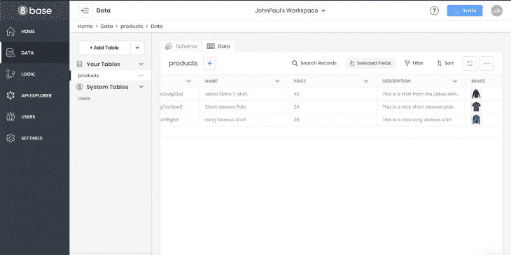
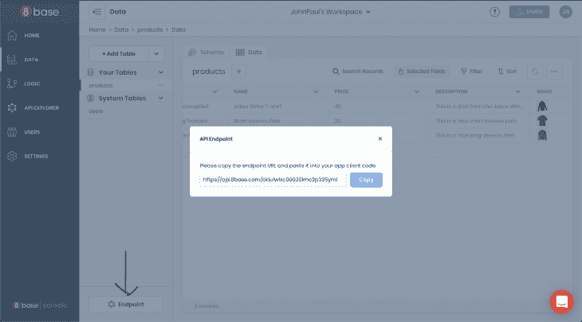
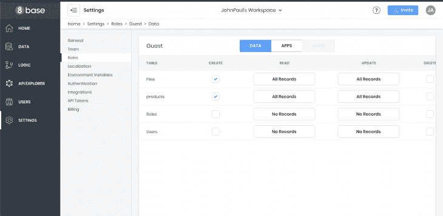
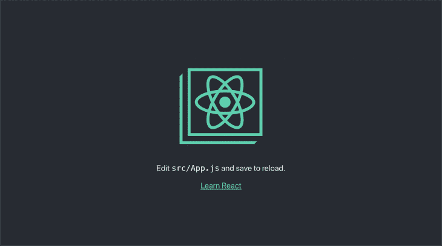
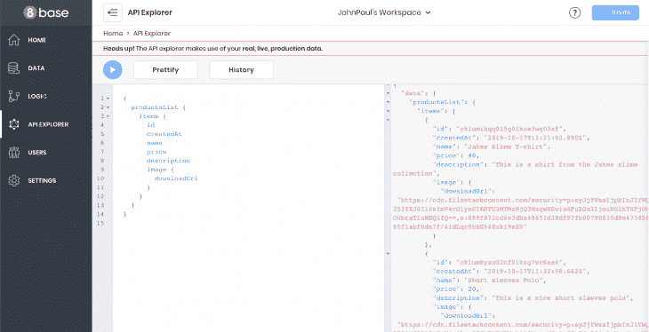
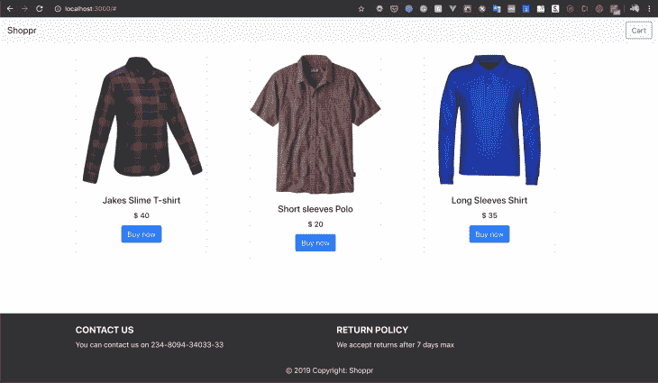
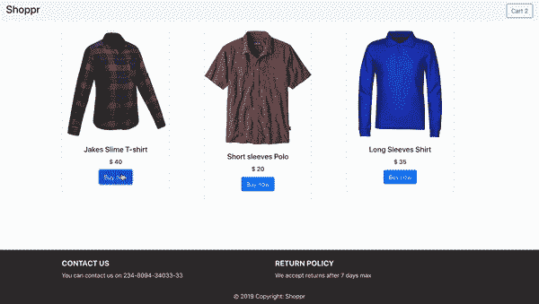

# 用 React 和 8base - LogRocket 博客建立一个电子商务网站

> 原文：<https://blog.logrocket.com/building-an-e-commerce-website-with-react-and-8base/>

2018 年，网购市场的总价值估计约为 2.84 万亿美元。亚马逊、沃尔玛和阿里巴巴等公司名列榜首。通过其庞大的平台，这些巨头为小企业也经营和拥有自己的电子商务商店打开了一个新的窗口。

在本教程中，我们将建立一个电子商务网站，前端使用 React，后端使用 8base。

> 注意:要学习本教程，需要对 React 和 Node.js 有基本的了解。请确保在开始之前安装了 Node 和 npm/yarn。我们还将在项目中使用一些 GraphQL 查询，所以熟悉一些 GraphQL 会有所帮助。

## 什么是反应？

[React](https://reactjs.org/) 是一个基于组件的 JavaScript 库，用于构建用户界面。它允许我们构建管理其状态的封装组件，然后将它们组合成复杂的 ui。

## 8base 是什么？

8base 是一个 GraphQL 后端，允许 javascript 开发人员使用全栈 JavaScript 快速交付企业应用程序。它是前端框架不可知的，因此它使开发人员能够创建面向客户的应用程序，无论他们选择什么。

我们将使用 8base 作为我们应用程序的后端数据库层。这是我们将为我们的电子商务网站存储产品的地方。

## 入门指南

8base 提供了大量的特性来帮助开发人员更快、更容易地构建高性能的应用程序。使用 8base 控制台，您可以使用简单的 GUI 构建您的后端，该 GUI 允许您执行以下操作:

*   定义数据模式:创建表/表关系
*   设置权限和授权角色
*   将多个项目组织到**工作区**
*   使用 API explorer 设计查询(基于 GraphQL)
*   管理文件

要开始使用 8base，请按照下列步骤操作:

*   在 [8base](https://auth.8base.com/login?state=g6Fo2SBrb283dEtrOGU4bndGUTFGQUVyZWNwcFlrNzVFVWw5Z6N0aWTZIHByblBCMU84VWREN1ZXLVJvVFRkclpYUjE0ai01cDJOo2NpZNkgcUdIWlZ1NUN4WTVrbGl2bTI4T1BMam9wdnNZcDBiYUQ&client=qGHZVu5CxY5klivm28OPLjopvsYp0baD&protocol=oauth2&response_type=token%20id_token&redirect_uri=https%3A%2F%2Fapp.8base.com%2Fauth%2Fcallback&scope=openid%20email%20profile&mode=signUp&nonce=x0M6LCwpVoLZ3u1HqwPuY.Qi1.YSBj6M&auth0Client=eyJuYW1lIjoiYXV0aDAuanMiLCJ2ZXJzaW9uIjoiOS4xMS4xIn0%3D) 上创建一个账户。你可以开始免费使用 8base。



*   注册完成后，点击 Data Builder 按钮导航到 [Data](https://app.8base.com/data/?source=post_page---------------------------) 菜单，然后点击“New Table”开始构建您的后端。



*   加载新表后，您将进入模式，开始定义字段。让我们四处看看，并注意一些事情。在左边，你会看到有`System Tables`和`Your Tables`。

每个新的 8base workspace 都自动预装了一些内置表格。这些表用于处理文件、设置和权限等事务，并且都可以通过 8base GraphQL API 进行访问。

*   继续创建一个表`Products`，它将包含以下字段:

**名称:" "**
类型:字段类型为文本。
描述:“这将是产品的名称”

**价格:**
类型:字段类型为数字。
描述:“该字段将保存我们产品的价格。”

**描述:“**”
类型:字段类型为文本。
描述:“该字段将保存我们产品的描述。”

**图像:" "**
类型:字段类型为文件。
描述:“该字段将保存我们产品的图像。”



*   我们需要一些示例帖子，所以让我们添加一些示例数据。在我们创建模式的模式菜单图标旁边，单击 Data 选项卡，通过设置标题和正文添加一个示例产品记录。



*   接下来，复制 API 端点 URL(位于左下角)——这是您的前端和 8base 后端之间通信的单一端点。



*   最后，在本教程中，我们将默认允许来宾开放访问，因此处理身份验证是可选的。要允许客人访问您的新产品表，请导航至`Settings > Roles > Guest,`并选中产品和文件下的相应框。

默认情况下，所有访问 API 端点的未经身份验证的用户都被分配 Guest 角色。

我们不会在本教程中讨论认证。您可以在这里看到如何更详细地处理认证[。](https://docs.8base.com/docs/authentication?utm_source=scotchio&utm_medium=blog&utm_campaign=codebeast&source=post_page---------------------------)



通过几个简单的步骤，我们已经使用 8base 完成了一个生产就绪的 CMS 后端的设置。让我们从应用程序的前端开始。

### 使用 React

要开始使用 React，我们必须首先安装它。启动并运行的最快方法是使用 [CRA](https://create-react-app.dev/) 。

如果您的开发机器上还没有安装它，请打开您的终端并运行以下命令:

```
npx create-react-app
```

### 生成 React 项目

一旦安装成功，您现在可以引导一个新的 react 项目。要创建我们的项目，请运行以下命令:

```
npx create-react-app shopping-cart
```

通过在项目根文件夹的终端中运行`npm start`来启动 React 应用服务器。



### 创建我们的布局

让我们开始为我们的项目创建布局。我们的应用程序将有 5 个不同的组件。

*   **导航条**:用来放置我们的导航和购物车图标
*   **产品**:显示产品列表。
    –**产品**:单个产品的加价
*   **页脚**:我们应用的页脚
*   **购物车**:存放购物车中的物品

我们将在我们的项目中使用 bootstrap，所以首先让我们包含它。在公共文件夹中打开您的`index.html`,并将以下链接标签添加到 head 部分:

```
// ./public/index.html
<link href="https://stackpath.bootstrapcdn.com/bootstrap/4.3.1/css/bootstrap.min.css" rel="stylesheet" integrity="sha384-ggOyR0iXCbMQv3Xipma34MD+dH/1fQ784/j6cY/iJTQUOhcWr7x9JvoRxT2MZw1T" crossorigin="anonymous">
```

现在我们可以在应用程序中使用引导类了。

接下来，创建一个组件文件夹，并在其中创建以下组件:Navbar.js、Products.js、Product.js、Footer.js、Cart.js。

打开 Navbar.js 并添加以下代码:

```
// src/components/Navbar.js
import React from 'react';

const Navbar = () => {
  return (
    <nav className="navbar navbar-light bg-light">
      <a className="navbar-brand">Shoppr</a>
        <button className="btn btn-outline-success my-2 my-sm-0" type="submit">Cart</button>
    </nav>
  );
};
export default Navbar;
```

打开 Footer.js 并向其中添加以下代码:

```
// src/components/Footer.js 
import React from 'react';
import '../App.css';

const Footer = () => {
  return (
      <footer className="page-footer font-small bg-blue pt-4">
        <div className="container text-center text-md-left">
          <div className="row">
            <div className="col-md-6 mt-md-0 mt-3">
              <h5 className="text-uppercase font-weight-bold">Contact Us</h5>
              <p>You can contact us on 234-8111-111-11</p>
            </div>
            <div className="col-md-6 mb-md-0 mb-3">
              <h5 className="text-uppercase font-weight-bold">Return Policy</h5>
              <p>We accept returns after 7 days max</p>
            </div>
          </div>
        </div>
        <div className="footer-copyright text-center py-3">© 2019 Copyright:
          <span> Shoppr</span>
        </div>
      </footer>
  );
};
export default Footer;
```

我们的页脚需要一些样式，所以我们将以下样式添加到`App.css`文件中:

```
// src/App.css
footer {
  position: absolute;
  bottom: 0;
  width: 100%;
  background-color: #333;
  color:#fff;
}
```

在我们创建我们的产品组件之前，我们需要查询 8base，以便向我们发送要显示的产品详细信息。让我们现在做那件事。

### 使用 GraphQL 连接到 8base 后端

为了将我们的应用程序连接到后端，我们需要安装几个 GraphQL 包。我们将使用的一个库是 [apollo-boost](https://www.npmjs.com/package/apollo-boost) ，它提供了一个使用 URI 连接到 GraphQL 后端的客户端。

URI 是由 8base 提供的端点，可在仪表板的[数据](https://app.8base.com/data)页面上获得。

在您的终端中运行以下命令来安装必要的软件包:

```
npm install apollo-boost graphql graphql-tag react-apollo
```

一旦成功，继续将 src 目录中的`index.js`文件更新为以下代码:

```
import React from 'react';
    import ReactDOM from 'react-dom';
    import './index.css';
    import App from './App';
    import { ApolloProvider } from "react-apollo";
    import ApolloClient from "apollo-boost";
    import * as serviceWorker from './serviceWorker';

    const client = new ApolloClient({
      uri: "<YOUR_8BASE_ENDPOINT>"
    });

    ReactDOM.render(
      <ApolloProvider client={client}>
        <App />
      </ApolloProvider>,
      document.getElementById('root')
    );

    serviceWorker.unregister();
```

我们已经用`ApolloProvider`包装了整个应用程序，它只需要一个道具，客户端。ApolloProvider 加载 8base 表模式，这使您可以访问应用程序中数据模型的所有属性。

### 展示我们的产品

我们已经能够将我们的表模式从 8base 加载到我们的应用程序中。下一步是获取和展示我们的产品。

在组件文件夹下创建一个`product-list`文件夹，然后创建一个`index.js`文件，并向其中添加以下内容:

```
// src/components/product-list/index.js
import gql from "graphql-tag";
import { graphql } from "react-apollo";

const PRODUCTS_QUERY = gql`
  query {
    productsList {
      items {
        id
        createdAt
        name
        price
        description
        image {
          downloadUrl
        }
      }
    }
  }
`;
export default PRODUCTS_QUERY;
```

这里，我们创建一个名为`PRODUCTS_QUERY`的常数来存储查询。`gql`函数用于解析包含 GraphQL 代码的普通字符串。

我们已经用一些数据填充了后端。为了测试我们的查询是否工作正常，8base 专门为此提供了一个方便的 GraphQL explorer。在 8base 仪表板的菜单中，单击 API explorer 图标并运行查询。



现在，我们确信我们的查询工作正常。让我们继续创建我们产品的组件。

打开您的`Products.js`组件，并向其中添加以下代码:

```
// src/components/Products.js
import React, { Component } from 'react';
import { Query } from 'react-apollo';
import PRODUCTS_QUERY from './product-list/index';
import Product from './Product';
import Navbar from './Navbar';

class Products extends Component {

   constructor(props) {
    super(props);
    this.state = {
      cartitems: []
    };
   }

   addItem = (item) => {
      this.setState({
          cartitems : this.state.cartitems.concat([item])
      });
    }

  render() {
    return (
      <Query query={PRODUCTS_QUERY}>
       {({ loading, error, data }) => {

          if (loading) return <div>Fetching</div>
          if (error)   return <div>Error</div>

          const items = data.productsList.items;
          return (
            <div>
              <Navbar/>
              <div className="container mt-4">
                <div className="row">
                   {items.map(item => <Product key={item.id} product={item} addItem={this.addItem} />)}
                </div>
              </div>
            </div>
          )
        }}
      </Query>
    );
  }

};
```

导出默认产品；这里，我们用`<Query/>`组件包装我们的产品，并将`PRODUCTS_QUERY`作为道具传递。

阿波罗给组件的`render prop function`注入了几个道具。这些道具本身提供了关于网络请求状态的信息:

1.  `loading`:只要请求仍在进行，并且还没有收到响应，这就是`true`。
2.  如果请求失败，这个字段将包含关于到底哪里出错的信息。
3.  `data`:这是从服务器接收的实际数据。它有代表一列`product`元素的`items`属性。

最后，我们遍历所有收到的项目，并将它们作为道具传递给我们的产品组件。在我们看到它的样子之前，让我们创建我们的`Product`组件。

打开您的`Product.js`,添加以下代码:

```
// src/components/Product.js
import React from 'react';

const Product = (props) => {
  return (
      <div className="col-sm-4">
          <div className="card" style={{width: "18rem"}}>
            
            <div className="card-body">
              <h5 className="card-title">{props.product.name}</h5>
              <h6 className="card-title">$ {props.product.price}</h6>
              <button className="btn btn-primary" onClick={() => props.addItem(props.product)}>Buy now</button>
            </div>
          </div>
      </div>
  );
}
export default Product;
```

我们的`Product.js`是一个功能组件，通过 props 接收产品细节并显示出来。

我们还调用 click 方法上的`addItem`函数，以便在单击时将当前产品添加到购物车中。

现在，我们所有的组件都设置好了，我们需要将它们导入到我们的`App.js`组件中，这是我们的基本组件。打开它，添加以下内容:

```
// src/App.js
import React from 'react';
import './App.css';
import Footer from './components/Footer';
import Products from './components/Products';

function App() {
  return (
    <div className="App">
      <Products />
      <Footer/>
    </div>
  );
}
export default App;
```

在您的浏览器中转至， [https://localhost:3000](https://localhost:3000) ，您将看到以下内容:



此时，我们有一个展示产品的商店，我们需要添加功能来将商品添加到我们的购物车中。

### 添加购物车功能

要添加我们的购物车功能，我们需要在组件中添加更多的方法。

将您的`products.js`更新为:

```
// src/components/products.js
import React, { Component } from 'react';
import { Query } from 'react-apollo';
import PRODUCTS_QUERY from './product-list/index';
import Product from './Product';
import Cart from './Cart';
import Navbar from './Navbar';

class Products extends Component {

  constructor(props) {
    super(props);
    this.state = {
      cartitems: []
    };
    this.addItem = this.addItem.bind(this);
  }

    addItem(item){
      this.setState({
          cartitems : this.state.cartitems.concat([item])
      });
    }

    showModal = () => {
      this.setState({ show: true });
    };

    hideModal = () => {
      this.setState({ show: false });
    };

  render() {

    return (
          <Query query={PRODUCTS_QUERY}>
           {({ loading, error, data }) => {

              if (loading) return <div>Fetching</div>
              if (error)   return <div>Error</div>

              const items = data.productsList.items;
              const itemssent = this.state.cartitems;

              return (
                <div>
                 <Navbar cart={itemssent} show={this.showModal} />
                 <Cart show={this.state.show} items={itemssent} handleClose={this.hideModal}>
                  </Cart>
                  <div className="container mt-4">
                    <div className="row">
                       {items.map(item => <Product key={item.id} product={item} addItem={this.addItem} />)}
                    </div>
                  </div>
                </div>
              )
            }}
          </Query>
      )
   };
};

export default Products;
```

用以下代码更新您的`Navbar.js`:

```
// src/components/Navbar.js
    import React from 'react';

    const Navbar = (props) => {
      return (
        <nav className="navbar navbar-light bg-light">
          <h3>Shoppr</h3>
            <button className="btn btn-outline-success my-2 my-sm-0" onClick={() => props.show()}>Cart {(props.cart.length)}</button>
        </nav>
      );
    };

    export default Navbar;
```

现在，创建一个`Cart.js`文件，并向其中添加以下代码:

```
import React from 'react';

const Cart = ({ handleClose, show, items }) => {

  return (
    <div className={show ? "modal display-block" : "modal display-none"}>
      <section className="modal-main">
        {items.map(item =>
           <div className="card" style={{width: "18rem"}}>
              
              <div className="card-body">
                <h5 className="card-title">{item.name}</h5>
                <h6 className="card-title">$ {item.price}</h6>
              </div>
            </div>
        )}
         Total items: {items.length}
        <button className="btn btn-warning ml-2" onClick={handleClose}>close</button>
      </section>
    </div>
  );

};

export default Cart;
```

我们需要一点风格来正确显示我们的购物车模态。打开您的`app.css`,添加以下代码:

```
.modal {
  position: fixed;
  top: 0;
  left: 0;
  width:100%;
  height: 100%;
  background: rgba(0, 0, 0, 0.6);
}

.modal-main {
  position:fixed;
  background: white;
  width: 80%;
  height: auto;
  top:50%;
  left:50%;
  padding: 10px;
  transform: translate(-50%,-50%);
}

.display-block {
  display: block;
}

.display-none {
  display: none;
}
```

现在打开您的购物车，向其中添加商品，并通过购物车按钮查看:



### 结论

在本教程中，我们已经创建了一个基本的电子商务商店。这里学到的概念可以帮助你创建强大的电子商务网站，而不用担心你的后端基础设施。你可以在这里了解更多关于 React [和 8base](https://reactjs.org) [的信息。你可以在这里找到本教程使用的代码](https://8base.com)。

快乐编码。

## [LogRocket](https://lp.logrocket.com/blg/ecommerce-signup) :看看用户为什么不完成你的电子商务流程中的一个步骤的技术和 UX 原因。

[](https://lp.logrocket.com/blg/ecommerce-signup)

LogRocket 就像是一个网络和移动应用程序和网站的 DVR，记录你的电子商务应用程序上发生的一切。LogRocket 没有猜测用户不转化的原因，而是主动揭示了阻止你转化的根本原因，比如 JavaScript 错误或死点击。LogRocket 还可以监控应用的性能，报告客户端 CPU 负载、客户端内存使用等指标。

开始主动监控您的电子商务应用程序— [免费试用](https://lp.logrocket.com/blg/ecommerce-signup)。