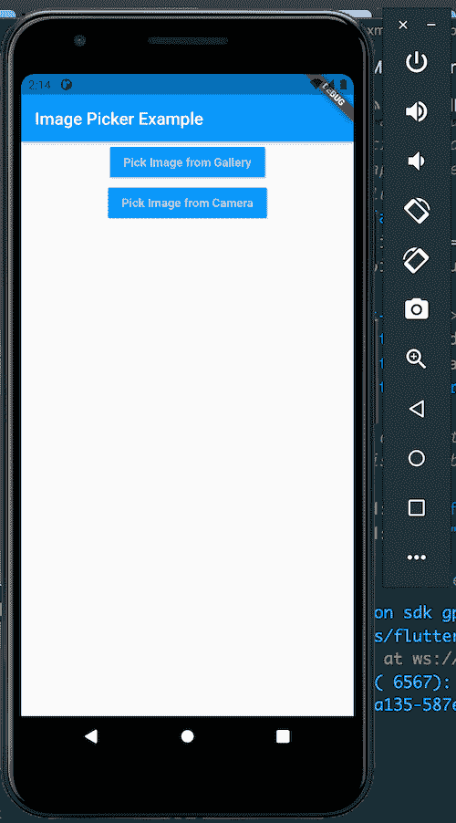
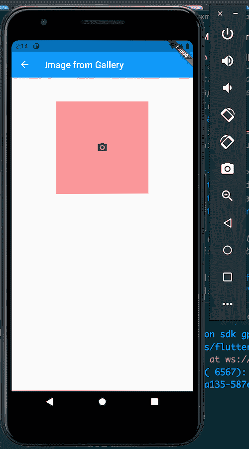
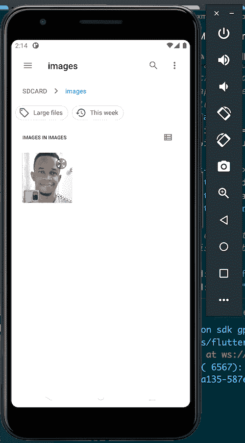
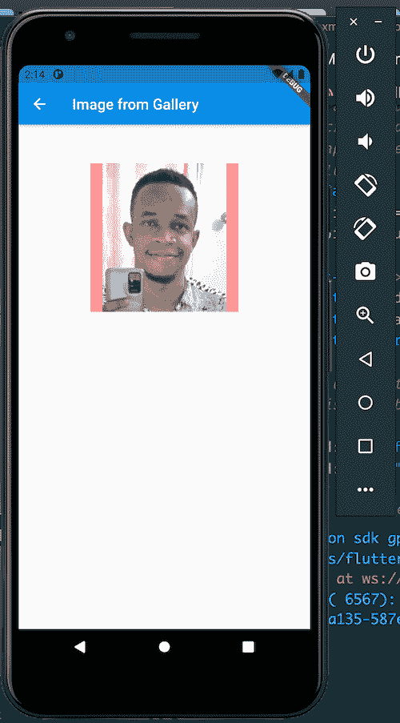
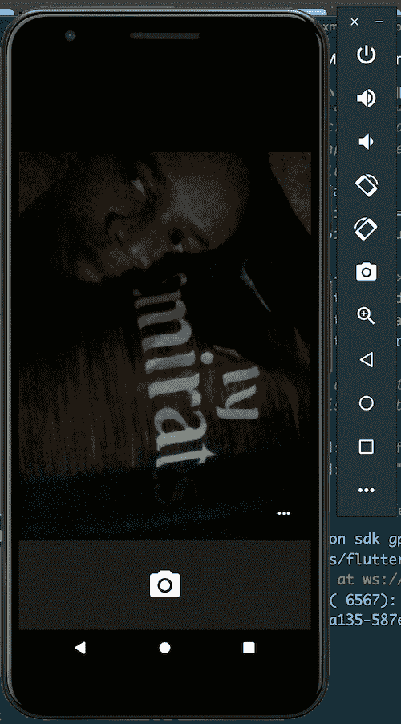
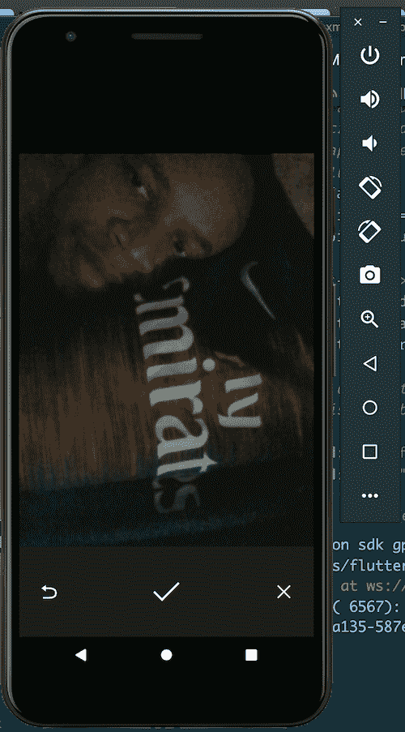

# 在 Flutter - LogRocket 博客中构建图像拾取器

> 原文：<https://blog.logrocket.com/building-an-image-picker-in-flutter/>

图像拾取器是任何应用程序中使用最广泛的组件之一。许多流行的应用程序，如脸书、Twitter、Instagram、WhatsApp 等。，有一个图像拾取器，使用户能够从他们的设备中选择文件，用作个人资料图片或与朋友分享。

移动应用程序中图像拾取器最常见的用例是为用户配置文件设置头像。在本教程中，我们将向您展示如何在 Flutter 中创建图像拾取器。我们将构建一个示例 Flutter 应用程序，使用户能够从图库中选择一张照片，或者从设备的相机中拍摄一张照片。

以下是我们将要介绍的内容:

## 什么是颤振`image_picker`？

从头开始在 Flutter 中编写一个图像拾取器小部件会很乏味。Flutter 附带了一个[图像拾取器插件](https://pub.dev/packages/image_picker)，用于从设备图库中拾取图像或从相机中拍摄新照片。

`image_picker`插件从它导出的`ImagePicker`类中公开了一些有用的方法:

```
import 'package:image_picker/image_picker.dart';

ImagePicker picker = ImagePicker();

```

`picker`实例有公共方法，我们将调用这些方法来打开图像选择对话框。我们来看看这些方法。

### `pickImage`

```
XFile? image = await picker.pickImage(source: ImageSource.gallery);

```

`pickImage`方法打开选择对话框并显示手机图库，从中选择图像。`source` arg 表示从哪里选取图像。

这里，`source`被设置为`ImageSource.gallery`，所以图像是从用户的图库中选择的。

```
XFile? image = await picker.pickImage(source: ImageSource.camera);

```

在上面的例子中，图像取自设备摄像头。这个方法打开相机，拾取用户抓拍的图片。`source: ImageSource.camera` arg 是打开设备摄像头的参数。

### `pickVideo`

```
XFile? image = await picker.pickVideo(source: ImageSource.gallery);

```

这个方法打开一个选择对话框，从手机的图库中选择一个视频。当你想从图片库或手机的摄像头中获取视频时，你可以使用`pickVideo`方法。参数`source: ImageSource.gallery`导致视频[从手机的图库](https://medium.com/fabcoding/adding-an-image-picker-in-a-flutter-app-pick-images-using-camera-and-gallery-photos-7f016365d856)中选取。

```
XFile? photo = await picker.pickVideo(source: ImageSource.camera);

```

这种方法允许用户从摄像机中选取视频。arg `source: ImageSource.camera`打开手机的摄像头，这样用户就可以录制视频。然后，录制的视频被用作选取的视频。

### `pickMultiImage`

```
List<XFile>? images = await picker.pickMultiImage(source: ImageSource.gallery);

```

`pickMultiImage`允许用户拾取多幅图像。arg `source: ImageSource.gallery`允许我们从手机的图库中挑选图片。

```
List<XFile>? photos = await picker.pickMultiImage(source: ImageSource.camera);

```

## 构建一个抖动图像拾取器应用程序

现在我们已经回顾了`image_picker`插件中的方法，让我们构建一个示例 Flutter 图像拾取器应用程序来看看它们在实践中是如何工作的。

在我们开始之前，确保您的机器上已经安装了以下工具和二进制文件。

*   [Flutter SDK](https://flutter.dev/docs/get-started/install) :我们将使用它来编译、创建和运行我们的 Flutter 项目。它有一个 CLI 工具`flutter`，使我们能够从终端完成这些事情
*   [VS Code](https://marketplace.visualstudio.com/items?itemName=Dart-Code.flutter) :这是可选的，但是对于编码颤振项目来说很棒。VS Code 有很棒的插件来增强你对 Flutter 的编码体验
*   [Android Studio](https://developer.android.com/studio) :这个二进制文件是一个用于构建和编译原生 Android 项目的 IDE。我们还可以使用 Android Studio 创建、编译和运行 Flutter 项目。但是大多数情况下，我们需要 Android Studio 来运行模拟器，并从 VS 代码中编译我们的 Flutter 项目

### 搭建一个颤动的项目

既然我们已经完成了必要工具和二进制文件的安装，是时候构建我们的 Flutter 图像拾取器示例应用程序了。

首先，让我们搭建一个颤振项目:

```
flutter create imagepickerprj

```

这将在名为`imagepickerprj`的文件夹中创建一个 Flutter 项目。一系列的命令将从我们的终端传下来。在终端的最后，您会看到运行新生成的项目的说明:

```
In order to run your application, type:

  $ cd imagepickerprj
  $ flutter run

To enable null safety, type:

  $ cd imagepickerprj
  $ dart migrate --apply-changes

Your application code is in imagepickerprj/lib/main.dart.

```

我们现在不运行它，但让我们将它移到文件夹中:

```
cd imagepickerprj

```

## 添加`image_picker`插件

下一步是将`image_picker`插件添加到我们的 Flutter 项目中。

打开`pubspec.yaml`文件，将`image_picker`添加到`dependencies`部分:

```
dependencies:
  flutter:
    sdk: flutter
  image_picker: ^0.8.2

```

如果你使用的是 VS 代码，一旦你保存了`pubspec.yaml`文件，它就会自动拉入`image_picker`。如果您没有使用 VS 代码，运行下面的命令来获取最新添加的依赖项:

```
flutter pub get

```

在我们的`imagepickerprj`项目中，我们的主文件位于`lib/`文件夹中。这是`main.dart`文件，是任何颤振项目/app 的入口点。所以这是我们开始添加大部分代码的地方。

Flutter 已经为我们设置了一些代码，但是除了在`MyApp`小部件中，我们不需要它。让我们从这里开始:

```
void main() {
  runApp(MyApp());
}

class MyApp extends StatelessWidget {
  // This widget is the root of your application.
  @override
  Widget build(BuildContext context) {
    return MaterialApp(
      title: 'Flutter Demo',
      theme: ThemeData(
        primarySwatch: Colors.blue,
      ),
      home: HomePage(),
    );
  }
}

```

我们的 Flutter 图像拾取器应用程序将有两个屏幕:

*   `HomePage`会列出两个按钮:`Pick Image from Gallery`和`Pick Image from Camera`。`Pick Image from Gallery`将打开一个`ImageFromGalleryEx`屏幕，我们可以从图库中选择一张图片，而`Pick Image from Camera`将打开一个`ImageFromGalleryEx`屏幕，我们可以从相机中拍摄一张图片，并将该图片用作选择的图片
*   `ImageFromGalleryEx`将处理从图库和相机中拾取图像。它将根据发送给它的源类型知道要处理什么。它还会显示拾取的图像

现在让我们给它们编码。

### `HomePage`

```
enum ImageSourceType { gallery, camera }

class HomePage extends StatelessWidget {
  void _handleURLButtonPress(BuildContext context, var type) {
    Navigator.push(context,
        MaterialPageRoute(builder: (context) => ImageFromGalleryEx(type)));
  }

  @override
  Widget build(BuildContext context) {
    return Scaffold(
        appBar: AppBar(
          title: Text("Image Picker Example"),
        ),
        body: Center(
          child: Column(
            children: [
              MaterialButton(
                color: Colors.blue,
                child: Text(
                  "Pick Image from Gallery",
                  style: TextStyle(
                      color: Colors.white70, fontWeight: FontWeight.bold),
                ),
                onPressed: () {
                  _handleURLButtonPress(context, ImageSourceType.gallery);
                },
              ),
              MaterialButton(
                color: Colors.blue,
                child: Text(
                  "Pick Image from Camera",
                  style: TextStyle(
                      color: Colors.white70, fontWeight: FontWeight.bold),
                ),
                onPressed: () {
                  _handleURLButtonPress(context, ImageSourceType.camera);
                },
              ),
            ],
          ),
        ));
  }
}

```

我们有一个 enum，`ImageSourceType`，它保存图像源类型、图库和相机。在`HomePage`小部件中，我们有一个方法，`_handleURLButtonPress`。这个方法使用 arg `type`，它带有`ImageSourceType`的任何值。它打开`ImageFromGalleryEx`小部件，将图像源类型传递给小部件类。

在`build`方法中，我们看到它呈现了两个按钮，正如我们之前所说的:`Pick Image from Gallery`和`Pick Image from Camera`。每个按钮上都设置了一个`onPressed`事件。当按钮被按下时，事件调用`_handleURLButtonPress`方法。

`Pick Image from Gallery`按钮将`ImageSourceType.gallery`传递给`ImageFromGalleryEx`小部件，告诉它我们将从图库中挑选一张图片。`Pick Image from Camera`按钮将`ImageSourceType.camera`传递给`ImageFromGalleryEx`小工具，告诉它打开手机的相机，将抓拍的照片作为选定的图像。

现在，让我们编写`ImageFromGalleryEx`小部件的代码。

### `ImageFromGalleryEx`

```
class ImageFromGalleryEx extends StatefulWidget {
  final type;
  ImageFromGalleryEx(this.type);

  @override
  ImageFromGalleryExState createState() => ImageFromGalleryExState(this.type);
}

class ImageFromGalleryExState extends State<ImageFromGalleryEx> {
  var _image;
  var imagePicker;
  var type;

  ImageFromGalleryExState(this.type);

  @override
  void initState() {
    super.initState();
    imagePicker = new ImagePicker();
  }

  @override
  Widget build(BuildContext context) {
    return Scaffold(
      appBar: AppBar(
          title: Text(type == ImageSourceType.camera
              ? "Image from Camera"
              : "Image from Gallery")),
      body: Column(
        children: <Widget>[
          SizedBox(
            height: 52,
          ),
          Center(
            child: GestureDetector(
              onTap: () async {
                var source = type == ImageSourceType.camera
                    ? ImageSource.camera
                    : ImageSource.gallery;
                XFile image = await imagePicker.pickImage(
                    source: source, imageQuality: 50, preferredCameraDevice: CameraDevice.front);
                setState(() {
                  _image = File(image.path);
                });
              },
              child: Container(
                width: 200,
                height: 200,
                decoration: BoxDecoration(
                    color: Colors.red[200]),
                child: _image != null
                    ? Image.file(
                          _image,
                          width: 200.0,
                          height: 200.0,
                          fit: BoxFit.fitHeight,
                        )
                    : Container(
                        decoration: BoxDecoration(
                            color: Colors.red[200]),
                        width: 200,
                        height: 200,
                        child: Icon(
                          Icons.camera_alt,
                          color: Colors.grey[800],
                        ),
                      ),
              ),
            ),
          )
        ],
      ),
    );
  }
}

```

这里，我们有`ImageFromGalleryEx`，一个有状态的小部件，和`ImageFromGalleryExState`，它保存了`ImageFromGalleryEx`小部件的状态。

在`ImageFromGalleryExState`小部件中，我们有以下变量:

*   `_image`保存从图库或相机中拾取的图像
*   `imagePicker`保存了`ImagePicker`类的实例
*   `type`保存小工具要使用的图像源的类型。它从`HomePage`小部件传递到小部件

我们还有一个`initState`方法，它首先被插入到小部件树中。我们使用这个方法来初始化和创建`ImagePicker`类的实例，然后将它赋给`imagePicker`变量。

在`build`方法内部是`Container`小部件，它是`Center`小部件的子部件。我们根据`_image`变量的条件来呈现`Image.file`。如果`_image`不为空或未定义，那么我们知道它有一个图像，然后我们通过向它传递`_image`变量来呈现`Image.file`小部件。

* * *

### 更多来自 LogRocket 的精彩文章:

* * *

这个`Image.file`是一个小部件，用于呈现设备本地存储器中的图像。
如果`_image`变量中没有任何内容，我们将呈现`Container`小部件。此`Container`显示一个摄像头图标。

`GestureDetector`是所有这些小部件的父级。它注册了一个`onTap`事件。当点击这个`GestureDetector`中的小部件时，这个事件被触发。`onTap`处理程序从`imagePicker`实例中调用`pickImage`方法。它从`type`变量中推导出图像的来源，并将其传递给`pickImage`方法。然后，它通过图像质量检查(`imageQuality: 50`)，最后通过首选摄像设备检查`preferredCameraDevice: CameraDevice.front`。这导致它选择我们手机的前置摄像头。

现在，`pickImage`返回一个`XFile`实例。我们从返回的`XFile`实例`image`中引用`image.path`，并将其传递给`File`以从中创建一个`File`实例。这个`XFile`实例是我们通过以下方式设置为`_image`状态的实例:

```
setState(() {
    _image = File(image.path);
});

```

这将导致`ImageFromGalleryExState`重新渲染，`Image.file`将在`_image`变量中显示图像。

现在我们已经完成了代码，让我们测试一下我们的应用程序。

## 测试我们的 Flutter 图像拾取器应用

打开 Android 模拟器，从终端运行以下命令:

```
flutter run

```

这将编译和构建项目，然后在您的 Android 模拟器中运行应用程序。

如果您使用的是 VS 代码，您可以运行上面的命令，或者在编辑器中右键单击`lib/main.dart`，然后单击`run Without Debugging`或`Start Debugging`。

该应用程序将在您的 Android 模拟器中打开。

`HomePage`:



从图库中挑选图像:





从相机中选取图像:




## 结论

我们在这个教程中学到了很多。我们首先介绍了 Flutter 图像拾取器组件的常见用例。然后，我们为 Flutter 引入了`image_picker`插件。我们演练了如何初始化`image_picker`插件的`ImagePicker`类，并回顾了`ImagePicker`类中的方法。

最后，我们构建了一个 Flutter 项目来演示如何在现实场景中使用`image_picker`插件。

在 [GitHub](https://github.com/flutter-prjs/imagepickerprj) 上找到这个项目的源代码。

## 使用 [LogRocket](https://lp.logrocket.com/blg/signup) 消除传统错误报告的干扰

[](https://lp.logrocket.com/blg/signup)

[LogRocket](https://lp.logrocket.com/blg/signup) 是一个数字体验分析解决方案，它可以保护您免受数百个假阳性错误警报的影响，只针对几个真正重要的项目。LogRocket 会告诉您应用程序中实际影响用户的最具影响力的 bug 和 UX 问题。

然后，使用具有深层技术遥测的会话重放来确切地查看用户看到了什么以及是什么导致了问题，就像你在他们身后看一样。

LogRocket 自动聚合客户端错误、JS 异常、前端性能指标和用户交互。然后 LogRocket 使用机器学习来告诉你哪些问题正在影响大多数用户，并提供你需要修复它的上下文。

关注重要的 bug—[今天就试试 LogRocket】。](https://lp.logrocket.com/blg/signup-issue-free)