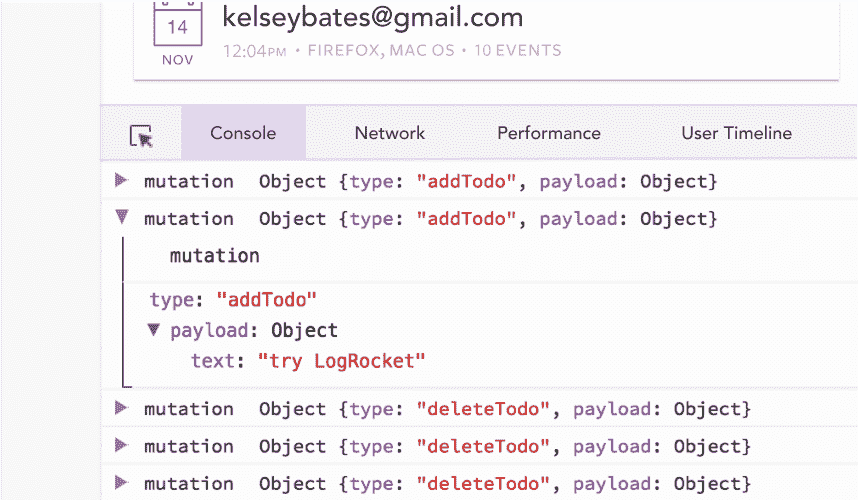

# 用 Vue 和传单构建交互式地图

> 原文：<https://blog.logrocket.com/building-an-interactive-map-with-vue-and-leaflet/>

## 介绍

布丁最近出版了一本奇妙的当地旅游指南。以那篇文章为灵感，今天我们将制作一张地图，标出旧金山的景点。

在本教程中，我们将使用以下工具:

*   传单:交互式地图的 JavaScript 库
*   Vue:一个渐进的 JavaScript 框架
*   [FourSquare API](https://developer.foursquare.com/) :一家位置数据&情报公司

几年前，我上了一门叫做数据新闻学的课。这门课程是为新闻专业的学生设计的，主要是向我介绍 HTML、CSS、JavaScript 和传单。

在一个学期里，我不仅学会了编程的基础，还构建了一个展示旧金山县学校的 web 应用程序。

我为什么要提这个？因为如果你了解 HTML、CSS 和 JavaScript 的基础知识，你可以拿起传单。

## 什么是传单？

传单是一个 JavaScript 库，用于创建移动友好的交互式地图。这是一个广泛使用的 JS 库，你可能在 NPR、WaPo 或 SFChronicle 上看到过传单。

当使用一个新的库或框架时，一个记录良好的 API 总是很有帮助的。幸运的是，fleet 是拥有易于理解的文档的库之一。

我最近开始大量使用地图，使用不同的工具(D3、传单和 Mapbox)，我想知道我们需要什么数据来创建一个地图。我将在这里谈论其中的一些。

这三种工具的一个共同之处是地图的占位符。我们需要一个`<div>`，通常带有一个`id`，在它上面我们将安装我们的地图。

我们还需要将中心(地图的地理中心和缩放级别)定义为初始地图缩放级别。

```
<div id="mapContainer"></div>

L.map("mapContainer").setView([37.7749, -122.4194], 13); //places the map in San Francisco.
```

如果你想绘制巴黎地图，但你只看到了水，那么很有可能你已经转换了中心坐标。总是仔细检查它们。

我们还需要创建一个层。

什么是层？如果您使用过谷歌地图，您可能会使用交通图层或卫星图层。您可以使用地形图层或默认图层。这些是可以放在地图上的不同种类的图层。

在我们的示例中，我们将使用地图框街道切片图层。要使用 Mapbox，我们需要请求一个访问令牌。在这里获取一个访问令牌[。](https://account.mapbox.com/access-tokens/)

有了令牌后，我们可以像这样将图层添加到地图中:

```
L.tileLayer('https://api.mapbox.com/styles/v1/{id}/tiles/{z}/{x}/{y}?access_token={accessToken}', { 
attribution: 'Map data (c) <a href="https://www.openstreetmap.org/">OpenStreetMap</a> contributors, <a href="https://creativecommons.org/licenses/by-sa/2.0/">CC-BY-SA</a>, Imagery (c) <a href="https://www.mapbox.com/">Mapbox</a>',
maxZoom: 18, 
id: 'mapbox/streets-v11', 
accessToken: 'myaccessToken' }).addTo(mapContainer);
```

这就是我们所需要的基本地图。

让我们看看如何使用 Vue 创建这个地图。

## Vue 和传单

Vue.js，在 [GitHub](https://github.com/vuejs/vue) 上有 168K 颗星，是一个基于 JavaScript 的前端框架，用于构建用户界面。

本文将假设您已经掌握了 Vue 的工作知识。如果你需要复习，[官方文档](https://vuejs.org/v2/guide/)维护得很好，很容易理解。

在我们开始编码地图之前，让我们安装一些依赖项。

让我们也安装传单。

按照这里的指示[，我们可以在终端中执行以下命令:](https://www.npmjs.com/package/leaflet)

```
npm install leaflet
```

如果你还记得，我们在开始的时候说过我们需要一个`div`来安装我们的地图。让我们在模板中添加一个`div`，并给它一个`mapContainer`的`id`。

```
<template>
 <div id="container">
   <div id="mapContainer"></div>
 </div>
</template>
```

在我们脚本中，我们将首先导入这样的传单:

```
import "leaflet/dist/leaflet.css";
import L from "leaflet";
```

确保导入 CSS。没有它，地图将无法正常工作。

* * *

### 更多来自 LogRocket 的精彩文章:

* * *

```
<script>
import "leaflet/dist/leaflet.css";
import L from "leaflet";

export default {
 name: "Map",
 data() {
   return{
     center: [37,7749, -122,4194]
   }}
 methods: {
   setupLeafletMap: function () {
     const mapDiv = L.map("mapContainer").setView(this.center, 13);
     L.tileLayer(
       "https://api.mapbox.com/styles/v1/{id}/tiles/{z}/{x}/{y}?access_token={accessToken}",
       {
         attribution:
           'Map data (c) <a href="https://www.openstreetmap.org/">OpenStreetMap</a> contributors, <a href="https://creativecommons.org/licenses/by-sa/2.0/">CC-BY-SA</a>, Imagery (c) <a href="https://www.mapbox.com/">Mapbox</a>',
         maxZoom: 18,
         id: "mapbox/streets-v11",
         accessToken:”XXX",
       }
     ).addTo(mapDiv);
   },
 },
 mounted() {
   this.setupLeafletMap();
 },
};
</script>

<style scoped>
#mapContainer {
 width: 80vw;
 height: 100vh;
}
</style>
```

一旦我们有了导入，我们将为组件命名。我们把它命名为地图。你可以给你的组件起任何你喜欢的名字。

我们需要一条信息来让这个应用程序工作——我们地图的中心。我们在数据项目中添加了一个中心属性。

然后我们将在我们的方法对象中创建一个函数`setupLeafletMap`。顾名思义，这个函数将在组件挂载时设置我们的地图。

我们使用了与之前相同的代码来初始化地图。

我们可以直接在挂载的函数中添加代码，但是为了保持代码有条理，我们创建了一个单独的函数，我们将在挂载的函数中调用它。

确保给你的`mapContainer`一些宽度和高度。运行`yarn serve`，应该会看到同样的地图。

## 数据

让我们在应用程序中添加一些数据，使其更具互动性。为了在地图上显示任何东西，我们需要该位置的坐标。幸运的是，我们可以从旧金山开放数据中心获得数据。

让我们在门户中搜索历史地标，然后单击查看数据。如我们所见，第一列定义了所有位置的几何图形。

其他列包含名称、街道名称、街道类型和地址以及其他详细信息。

通常，如果你点击每列顶部的三个点，它们会提供描述。

对于此数据集，缺少描述。

我们可以使用 API 端点，但是在本教程中，我们将下载 GEOJSON 数据。GeoJSON 基于 JSON，是一种用于编码各种地理数据结构的格式。

如果你想使用 API，点击导出，然后点击 SODA API。要使用 API，您需要一个访问令牌。获取访问密钥很简单。在这里创建一个账户[，点击右下方的管理链接。](https://datasf.org/opendata/)

在那里，按照步骤，复制您的密钥 ID 和密钥秘密。

让我们将下载的文件保存为 JSON，并将其导入到组件中:

```
import data from "./Historic-Landmarks.json";
```

我们需要的传单 API 叫做`L.geoJSON()`。

根据文档记载，“ [L.geoJSON()](https://leafletjs.com/reference-1.6.0.html#geojson) 允许您解析 geoJSON 数据并将其显示在地图上。”

让我们将数据传递给函数，并使用`addTo()`将其添加到地图中。

```
 L.geoJSON(data).addTo(mapDiv);
```

如果我们刷新页面，我们应该在地图上看到蓝色的多边形。每个多边形代表城市中的一个景点。

让我们来玩一些`geoJSON()`选项。我们没有每个位置的大量数据，所以只是为了看看样式选项如何工作，我们将使用列出的起息日来样式化我们的多边形。

我们将传递一个函数，该函数将 2000 年后列出的所有位置的样式设置为红色，其余的为蓝色。由于列出的日期是一个字符串，我们需要做一些转换和切片来获得年份。

让我们创建一个名为`styleMap`的函数。

```
styleMap(feature){
      const year = feature.properties.datelisted
            ? parseInt(feature.properties.datelisted.slice(0, 4))
            : 0;
          const color = year > 2000 ? "red" : "blue";
          return { color: color };
    },
```

如果我们想过滤数据，我们可以使用一个过滤选项。

最后，让我们添加一些交互。当用户点击多边形时，会出现一个弹出窗口。传单为我们提供了一个叫做`onEachFeature`的功能。

根据文件:

“`onEachFeature`选项是在将每个要素添加到 GeoJSON 图层之前对其进行调用的函数。使用此选项的一个常见原因是，单击要素时会将弹出窗口附加到要素上。

我们将创建另一个名为`onEachFeature`的函数。我们只想在弹出窗口中显示该名称，所以我们将查看它是否存在。如果是，我们将使用`layer.bindPopup()`并传入名称。

```
onEachFeature(feature, layer) {
      if (feature.properties && feature.properties.name) {
        layer.bindPopup(feature.properties.name);
    layer.on('mouseover', () => { layer.openPopup(); });
        layer.on('mouseout', () => { layer.closePopup(); });
      }
   },
```

如果我们刷新我们的应用程序，点击金门大桥，会出现一个弹出窗口，上面有这个名字。

让我们像这样传递我们的两个函数:

```
L.geoJSON(data , {onEachFeature: this.onEachFeature,style: this.styleMap,})
```

我们可以更新我们的弹出窗口，使其不仅仅是一个名字。最后，如果你想让你的地图做更多的事情，你可以添加点击事件。

## 结论

现在你应该对 fleet 如何与 Vue 协同工作有了一个基本的了解。传单可以让你在地图上做更多的事情。您可以将它与其他 API 结合起来，显示位置的详细信息，例如评论和图片。

Yelp、Foursquare 或 Google 是少数几个你可以使用的 API。如果你想开始使用 Foursquare API，在这里查看代码。

另一个想法是在你的地图上添加奇特的标记。看看《旧金山纪事报》的[火灾追踪器](https://www.sfchronicle.com/projects/california-fire-map/)。也许你可以尝试一下[交互式 Choropleth 地图](https://leafletjs.com/examples/choropleth/)。

一定要看看传单的灵感和更多的 API 教程。

## 像用户一样体验您的 Vue 应用

调试 Vue.js 应用程序可能会很困难，尤其是当用户会话期间有几十个(如果不是几百个)突变时。如果您对监视和跟踪生产中所有用户的 Vue 突变感兴趣，

[try LogRocket](https://lp.logrocket.com/blg/vue-signup)

.

[](https://lp.logrocket.com/blg/vue-signup)[https://logrocket.com/signup/](https://lp.logrocket.com/blg/vue-signup)

LogRocket 就像是网络和移动应用程序的 DVR，记录你的 Vue 应用程序中发生的一切，包括网络请求、JavaScript 错误、性能问题等等。您可以汇总并报告问题发生时应用程序的状态，而不是猜测问题发生的原因。

LogRocket Vuex 插件将 Vuex 突变记录到 LogRocket 控制台，为您提供导致错误的环境，以及出现问题时应用程序的状态。

现代化您调试 Vue 应用的方式- [开始免费监控](https://lp.logrocket.com/blg/vue-signup)。