# 用 React 和 RxDB - LogRocket 博客构建离线优先应用

> 原文：<https://blog.logrocket.com/building-an-offline-first-app-with-react-and-rxdb-e97a1fa64356/>


离线功能正成为应用程序用户体验中越来越重要的一部分。这不仅对于离线运行的应用程序很重要，对于在间歇性互联网连接下运行的 web 或移动 JavaScript 应用程序也很重要。

让一个应用程序在没有互联网连接的情况下工作包括两件事。首先，应用程序文件需要存储在本地。这可以通过[渐进式网络应用](https://developers.google.com/web/progressive-web-apps/)和[服务人员](https://developers.google.com/web/fundamentals/getting-started/primers/service-workers)来完成。

其次，必须使用某种形式的本地存储作为应用程序的主要数据源。此存储必须与远程数据源持续同步。幸运的是，有像 [PouchDB](http://pouchdb.com/) 这样的数据库，它们在本地存储数据，并且可以自动与服务器中的 [CouchDB](http://couchdb.apache.org/) 数据库同步。

在本教程中，我们将构建一个具有离线功能的匿名聊天应用程序。它看起来会像这样:

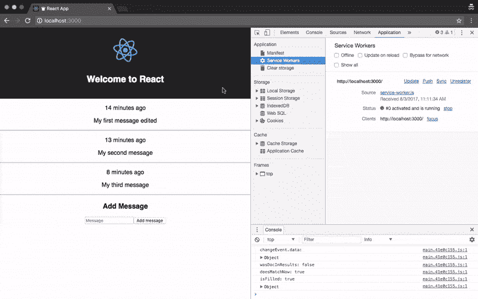

我们将使用 [Create React App](https://github.com/facebookincubator/create-react-app) 自动生成一个带有 React 和 [RxDB](https://github.com/pubkey/rxdb) 的[渐进式 web 应用](https://github.com/facebookincubator/create-react-app/blob/master/packages/react-scripts/template/README.md#making-a-progressive-web-app)，这是一个反应式、客户端和离线优先的数据库，将与服务器端 CouchDB 数据库同步。

您将需要:

*   节点版本 6 或更高版本。可以使用 [nvm](https://github.com/creationix/nvm#installation) 在节点版本之间切换。
*   支持 [IndexedDB](http://caniuse.com/#feat=indexeddb) 的现代浏览器。

作为参考，您可以在以下 GitHub 资源库中找到的完整源代码:

> 一个简单的匿名聊天应用程序，展示了如何使用 React 和 RxDB 创建离线应用程序，使用本地 IndexedDB 数据库。这个项目是用 Create React App 引导的。节点版本 6 或更高版本。您可以使用 nvm 在节点版本之间切换。支持 IndexedDB 的现代浏览器。

设置 React 应用程序

[](https://logrocket.com/signup/)

### 安装(或升级至最新版本)`create-react-app`:

然后，创建一个新的应用程序并`cd`进入其中:

```
npm install -g create-react-app
```

现在，让我们通过执行以下命令来安装项目的所有依赖项:

```
create-react-app offline-anonymous-chat
cd offline-anonymous-chat
```

下面是对每个依赖项的描述:

```
npm install --save concurrently moment pouchdb-adapter-http pouchdb-adapter-idb pouchdb-server react-toastify rxdb rxjs serve
```

[兼](https://www.npmjs.com/package/concurrently)。我们将需要它同时运行两个 npm 脚本。

*   [时刻](https://www.npmjs.com/package/moment)。我们将需要它来格式化消息的创建日期。
*   [pouchdb-adapter-http](https://www.npmjs.com/package/pouchdb-adapter-http) 。PouchDB 适配器，用于与外部 CouchDB(或类似 CouchDB 的)数据库通信。
*   [pouchdb-adapter-idb](https://www.npmjs.com/package/pouchdb-adapter-idb) 。PouchDB 适配器在浏览器中使用 IndexedDB。只需切换适配器，就可以在不同的环境中使用 PouchDB(和 RxDB)。
*   [pouchdb-server](https://github.com/pouchdb/pouchdb-server) 。这将作为我们的服务器端数据库。
*   [反应-适应](https://www.npmjs.com/package/react-toastify)。我们需要它在应用程序中显示数据库事件的通知。
*   [rxdb](https://github.com/pubkey/rxdb) 。这将作为我们的客户端数据库。
*   [rxjs](https://github.com/ReactiveX/rxjs) 。RxDB 以被动的方式处理数据，因此它依赖于 rxjs。
*   [发球](https://www.npmjs.com/package/serve)。当测试离线功能时，我们需要一个 HTTP 服务器来为我们的应用程序提供服务(稍后将详细介绍)。
*   接下来，编辑`package.json`文件中的`start`脚本。而不是:

应该是:

```
"start": "react-scripts start",
```

此外，我们应该添加`server`脚本:

```
"start": "concurrently "npm run server" "react-scripts start"",
```

这将在应用程序运行的同时执行 PouchDB 服务器。数据库文件将存储在`db`目录中。你可以在这里找到数据库服务器[的所有配置选项。](https://github.com/pouchdb/pouchdb-server#full-options)

```
"server": "pouchdb-server -d ./db",
```

执行`npm start`时，可以去 [http://localhost:3000](http://localhost:3000/) (如果不是自动打开的话)查看`create-react-app`生成的 app:

对于数据库，可以打开[http://localhost:5984/_ utils](http://localhost:5984/_utils)查看其 web 界面( [Fauxton](https://github.com/apache/couchdb-fauxton) ):

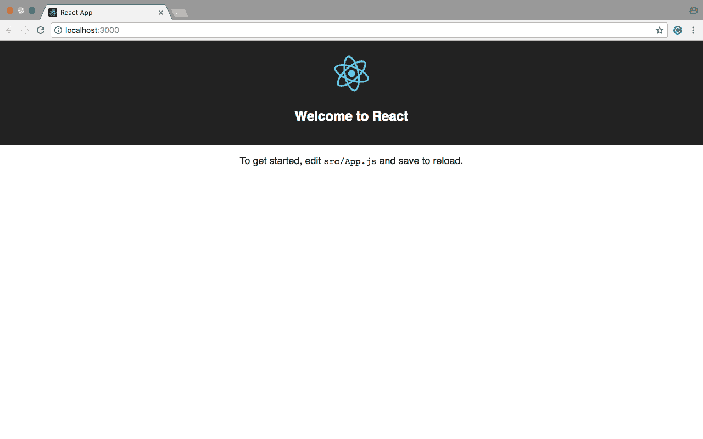

如您所见，只创建了两个供 PouchDB 内部使用的数据库。

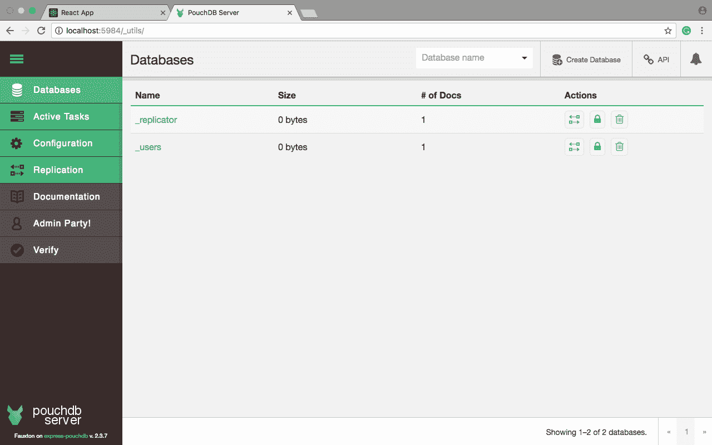

在下一节中，我们将为应用程序数据库创建模式。

创建数据库模式

### RxDB 依赖于 PouchDB(反过来，受 CouchDB 的启发)，这使它成为一个 [NoSQL](https://en.wikipedia.org/wiki/NoSQL) 文档数据库，类似于 [MongoDB](https://www.mongodb.com) 。

我们可以使用模式来定义数据的外观，并验证每个插入的文档。数据被组织成集合，每个集合都有自己的模式。

对于我们的应用程序，我们将使用一个名为`messages`的集合来存储消息的创建日期和消息本身。

模式是使用 [JSON 模式](http://json-schema.org/)标准定义的。出于我们的目的，用下面的[内容](https://jsfiddle.net/eh3rrera/Lj35tx2y/)创建文件`src/Schema.js`:

在上面的模式中:

版本号为零。如果版本大于零，您必须提供一个[数据迁移策略](https://pubkey.github.io/rxdb/data-migration.html)。

*   它有两个类型为`string`、`id`和`message`的属性。第一个是主键，它表示消息插入的日期，即从 [Unix 纪元](https://en.wikipedia.org/wiki/Unix_time)以来的毫秒数。
*   属性`message`是必需的。
*   你可以在这里了解更多关于模式的信息。

现在让我们配置本地数据库。

配置本地数据库

### 将进口后的[添加到`App.js`:](https://jsfiddle.net/eh3rrera/xLfxad7c/)

除了导入主 RxDB 模块和上一节中创建的模式之外，我们还要导入模块`QueryChangeDetector`。

由于 RxDB 是一个反应式数据库，您可以订阅查询以实时接收新结果，但每次执行查询都会影响性能，因此选项`QueryChangeDetector`通过从数据库事件中获取新结果来优化观察到的查询。

该选项目前处于测试阶段，默认情况下是禁用的，但是我们可以使用下面的[代码](https://jsfiddle.net/eh3rrera/74mjvqbc/)来启用它:

使用 JSFiddle 代码编辑器在线测试您的 JavaScript、CSS、HTML 或 CoffeeScript。

> Test your JavaScript, CSS, HTML or CoffeeScript online with JSFiddle code editor.

我们还可以启用调试，这样每次进行优化时，都会在控制台中显示一条消息。

接下来，将适配器配置为使用 IndexDB 作为存储引擎，并支持通过 [HTTP](https://jsfiddle.net/eh3rrera/em9bxtdv/) 同步到远程数据库:

并将远程数据库的 URL 和本地数据库的名称声明为常量:

使用 JSFiddle 代码编辑器在线测试您的 JavaScript、CSS、HTML 或 CoffeeScript。

> Test your JavaScript, CSS, HTML or CoffeeScript online with JSFiddle code editor.

在类内部，让我们声明一个方法来创建[数据库](https://jsfiddle.net/eh3rrera/3nah0syf/):

使用 JSFiddle 代码编辑器在线测试您的 JavaScript、CSS、HTML 或 CoffeeScript。

> Test your JavaScript, CSS, HTML or CoffeeScript online with JSFiddle code editor.

数据库是以异步方式创建的，但是我们将使用 [async/await](https://hackernoon.com/6-reasons-why-javascripts-async-await-blows-promises-away-tutorial-c7ec10518dd9) 来获得更简洁的代码，而不是使用回调或承诺。这里有一篇很好的[文章](https://ponyfoo.com/articles/understanding-javascript-async-await)，比较了编写异步代码的三种方法。

这样，我们创建数据库，传递一个名称、适配器和一个[密码](https://jsfiddle.net/eh3rrera/ev02qzup/)(必须至少有 8 个字符):

使用 JSFiddle 代码编辑器在线测试您的 JavaScript、CSS、HTML 或 CoffeeScript。

> Test your JavaScript, CSS, HTML or CoffeeScript online with JSFiddle code editor.

接下来，我们启用 [leader-election](https://pubkey.github.io/rxdb/LeaderElection.html) 算法，该算法确保始终只有一个选项卡管理远程数据访问(以防应用程序同时有多个选项卡)。当选领导人后，页面标题旁边的[将显示](https://jsfiddle.net/eh3rrera/pmrwr1xs/)一个皇冠:

使用 JSFiddle 代码编辑器在线测试您的 JavaScript、CSS、HTML 或 CoffeeScript。

> Test your JavaScript, CSS, HTML or CoffeeScript online with JSFiddle code editor.

然后，我们通过[模式](https://jsfiddle.net/eh3rrera/0szL2atb/)创建`messages`集合:

使用 JSFiddle 代码编辑器在线测试您的 JavaScript、CSS、HTML 或 CoffeeScript。

> Test your JavaScript, CSS, HTML or CoffeeScript online with JSFiddle code editor.

更多来自 LogRocket 的精彩文章:

* * *

### 最后，让我们设置复制特性并返回数据库[对象](https://jsfiddle.net/eh3rrera/y1s8okju/):

* * *

使用 JSFiddle 代码编辑器在线测试您的 JavaScript、CSS、HTML 或 CoffeeScript。

> Test your JavaScript, CSS, HTML or CoffeeScript online with JSFiddle code editor.

现在让我们将这个方法集成到我们的 React 应用程序中。

构建应用程序

### 让我们从添加组件的导入开始，以显示通知和处理[日期](https://jsfiddle.net/eh3rrera/1n7wwhp3/)的时刻库:

使用 JSFiddle 代码编辑器在线测试您的 JavaScript、CSS、HTML 或 CoffeeScript。

> Test your JavaScript, CSS, HTML or CoffeeScript online with JSFiddle code editor.

接下来，将下面的[构造函数](https://jsfiddle.net/eh3rrera/syeetpyf/)添加到该类中:

使用 JSFiddle 代码编辑器在线测试您的 JavaScript、CSS、HTML 或 CoffeeScript。

> Test your JavaScript, CSS, HTML or CoffeeScript online with JSFiddle code editor.

我们有两个属性作为组件的状态，一个用于新消息，一个数组用于存储所有消息。

我们还定义了一个数组来存储我们将要使用的订阅的处理程序，以便我们可以在必要时取消订阅，以及绑定函数来添加新消息和处理新消息的文本框更改。

在`componentDidMount`中，让我们调用方法`createDatabase`，然后订阅一个查询，返回按照`id`排序的所有消息:

使用 JSFiddle 代码编辑器在线测试您的 JavaScript、CSS、HTML 或 CoffeeScript。

> Test your JavaScript, CSS, HTML or CoffeeScript online with JSFiddle code editor.

方法`$()`将返回一个 [RxJS 可观察值](http://reactivex.io/rxjs/manual/overview.html#observable)，它将查询返回的数据的每一个变化进行流式处理。如果返回任何消息，将显示一个通知，并且状态会发生变化。

注意，我们还添加了对`subs`数组订阅的引用。这样，当组件将要被卸载时，我们将使用这些引用来取消订阅[观察对象](https://jsfiddle.net/eh3rrera/17Lnr51e/):

使用 JSFiddle 代码编辑器在线测试您的 JavaScript、CSS、HTML 或 CoffeeScript。

> Test your JavaScript, CSS, HTML or CoffeeScript online with JSFiddle code editor.

接下来，修改`render`方法，使其看起来像[这个](https://jsfiddle.net/eh3rrera/qka8apjs/):

使用 JSFiddle 代码编辑器在线测试您的 JavaScript、CSS、HTML 或 CoffeeScript。

> Test your JavaScript, CSS, HTML or CoffeeScript online with JSFiddle code editor.

如您所见，渲染逻辑很简单。

方法`renderMessages`将每个消息对象转换成一个`div`元素，在`moment`库(记住`id`代表以毫秒为单位的日期)和[消息](https://jsfiddle.net/eh3rrera/tsh9yvxu/)的帮助下显示消息的相对插入日期:

使用 JSFiddle 代码编辑器在线测试您的 JavaScript、CSS、HTML 或 CoffeeScript。

> Test your JavaScript, CSS, HTML or CoffeeScript online with JSFiddle code editor.

这是方法`handleMessageChange`的[定义](https://jsfiddle.net/eh3rrera/qc2x3360/):

使用 JSFiddle 代码编辑器在线测试您的 JavaScript、CSS、HTML 或 CoffeeScript。

> Test your JavaScript, CSS, HTML or CoffeeScript online with JSFiddle code editor.

为了添加消息，我们创建一个对象，并以如下方式将其插入数据库，为下一个[消息](https://jsfiddle.net/eh3rrera/desLds3f/)设置状态为空字符串:

使用 JSFiddle 代码编辑器在线测试您的 JavaScript、CSS、HTML 或 CoffeeScript。

> Test your JavaScript, CSS, HTML or CoffeeScript online with JSFiddle code editor.

最后，显示复制事件以了解正在发生的事情可能是一个好主意。方法`RxCollection.sync()`返回一个 [RxReplicationState](https://pubkey.github.io/rxdb/replication.html) 对象，该对象可用于观察事件和取消复制。

修改方法`createDatabase`的最后一部分，使其看起来像[这个](https://jsfiddle.net/eh3rrera/ca7559u3/):

使用 JSFiddle 代码编辑器在线测试您的 JavaScript、CSS、HTML 或 CoffeeScript。

> Test your JavaScript, CSS, HTML or CoffeeScript online with JSFiddle code editor.

这些事件中的一些会发出一个对象，这就是为什么在某些情况下它们会被打印在控制台中，而不是显示为通知。以下是对每个事件的描述:

`change$`。每次复制文档时触发。它可以发出一个描述变化的布尔值或对象。

*   `docs$`。发出每个复制的文档。
*   `active$`。根据复制是否正在运行，发出`true`或`false`。
*   `complete$`。根据复制是否完成发出`true`或`false`(实际上，只有一次复制会完成)。
*   `error$`。当复制过程中出现错误时触发。
*   此外，我们将这些订阅添加到了`subs`数组中，以便在必要时可以取消订阅。

仅此而已。让我们测试一下这个应用程序。

测试应用程序

### 执行`npm start`并转到`[http://localhost:3000](http://localhost:3000)`。您应该会看到类似这样的内容:

开始添加一些消息。请注意标题中的皇冠，它表示该选项卡是前导选项卡。如果您打开另一个选项卡，并关闭第一个，现在另一个应该有冠:

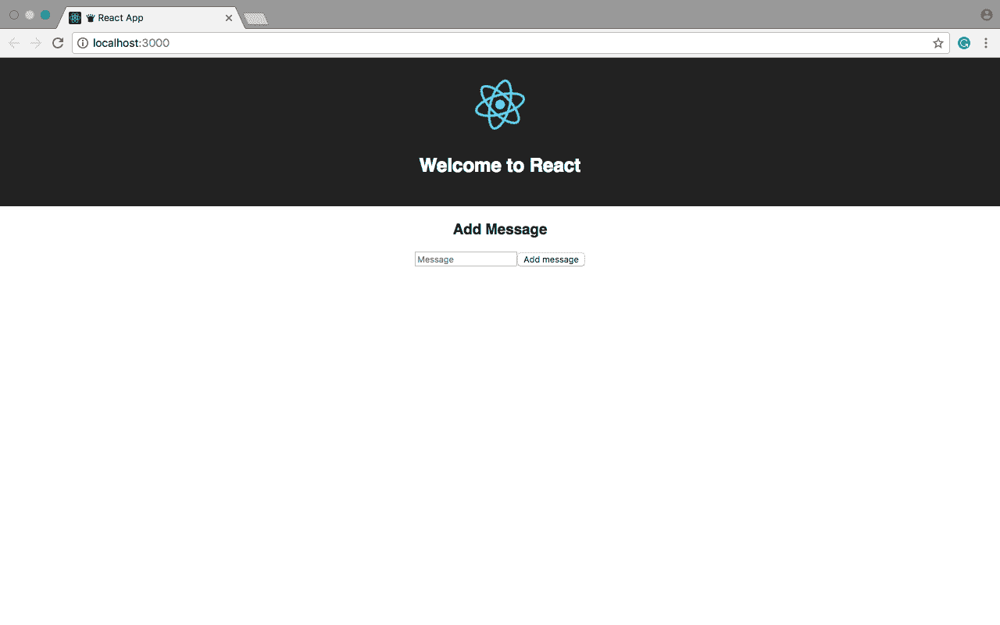

由于 RxDB 的反应性质(以及浏览器中的所有选项卡共享同一本地存储的事实)，数据库状态是实时广播的，这意味着一个选项卡中的更改将自动反映在另一个选项卡中:

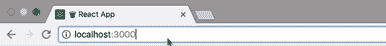

转到[http://localhost:5984/_ utils](http://localhost:5984/_utils)，现在您应该会看到应用程序的数据库:

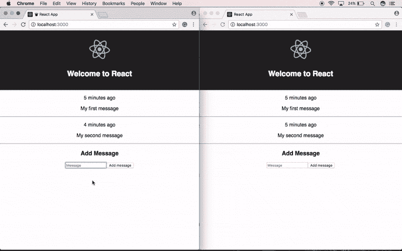

单击数据库名称，然后单击其中一个文档的铅笔图标进行编辑:

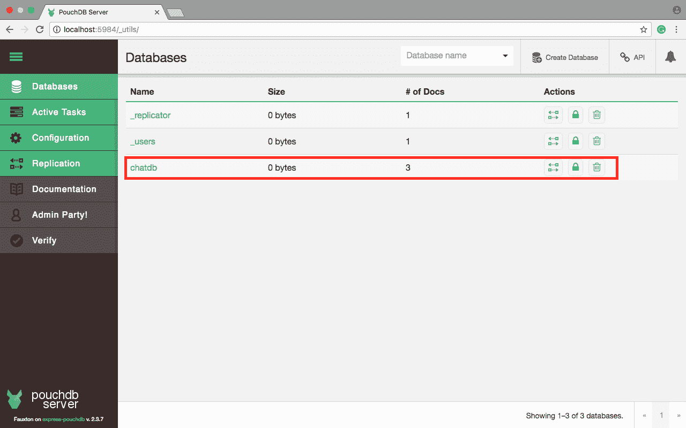

在数据库 web 界面上所做的更改应该会立即应用到应用程序中:

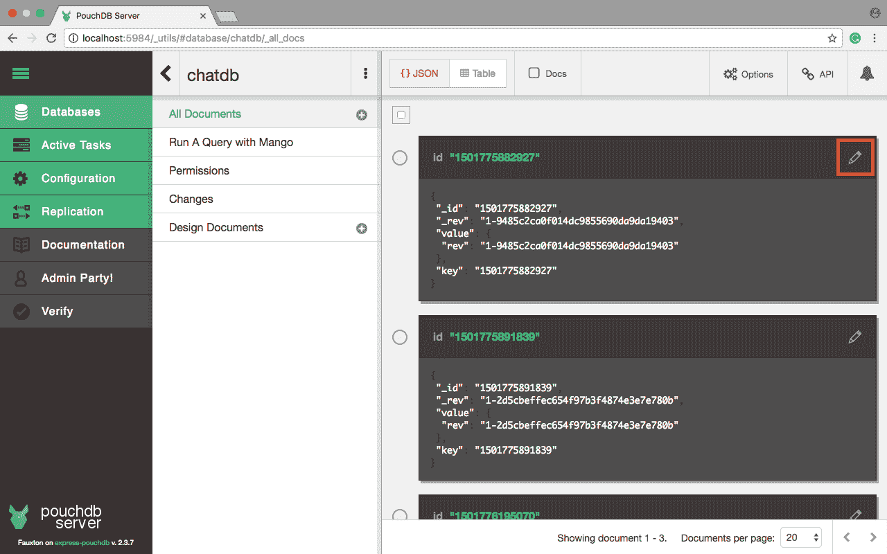

所以它看起来工作正常，但在离线模式下工作吗？

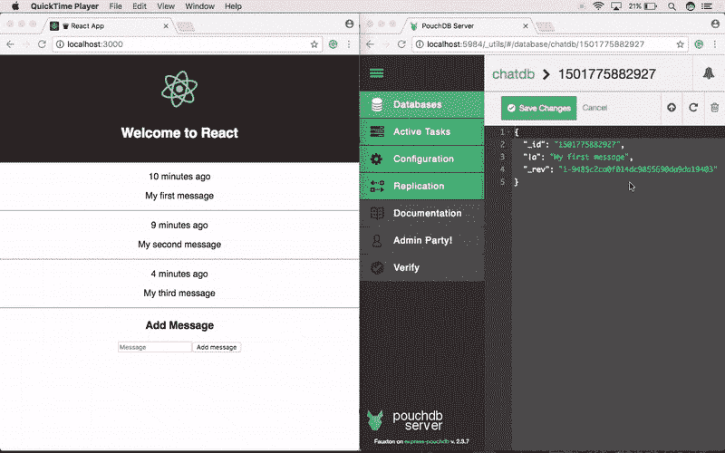

离线

### 由`create-react-app`生成的应用程序的生产版本是一个全功能、离线优先的渐进式 web 应用程序。

我们必须考虑一些因素，但基本上，我们只需要构建应用程序并为其提供服务。执行:

该命令创建一个包含应用程序生产版本的`build`目录。

```
npm run build
```

现在将以下脚本添加到`package.json`文件中:

并执行:

```
"http": "serve -p 3000 -s build",
"offline": "concurrently "npm run server" "npm run http""
```

由于该应用程序现在将安装一个服务人员和一个清单，如果你想稍后回到开发版本，你可能需要使用浏览器的匿名模式来测试它，以避免冲突。

```
npm run offline
```

再次转到`[http://localhost:3000](http://localhost:3000)`，应用程序将安装服务人员，浏览器将缓存文件。如果你使用的是 Chrome，你可以进入开发者工具-应用程序，选择清单和/或服务人员部分:

现在，通过从服务人员面板中选择*离线*选项，从*开发者工具* ' *网络*选项卡中选择离线选项，或者直接断开网络连接，即可离线。


当您重新加载应用程序时，您仍然可以插入信息:

插入一些消息后，重新联机。过一会儿，您应该会看到一些关于复制的通知:


如果转到数据库 web 界面，数据库应该包含新文档:

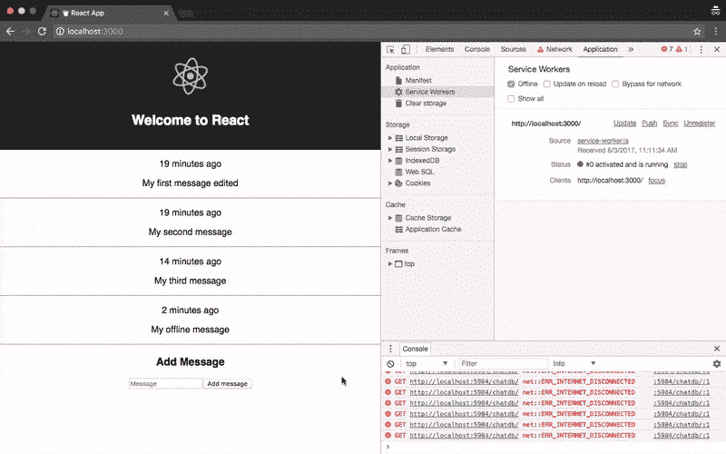

结论

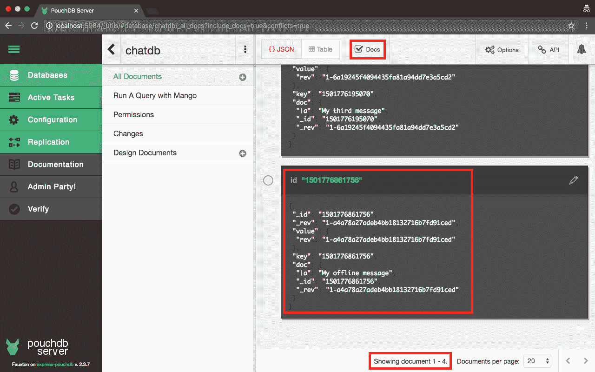

### RxDB 有很多这里没有提到的特性，比如[加密](https://pubkey.github.io/rxdb/rx-schema.html)、[中间件钩子](https://pubkey.github.io/rxdb/middleware.html)，或者[原子更新操作](https://pubkey.github.io/rxdb/rx-document.html#atomicupdate)。

您可以通过实现编辑和删除操作，或者通过将数据同步到一个 [CouchDB](http://couchdb.apache.org/) 服务器或者一个 [IBM Cloudant](https://www.ibm.com/analytics/us/en/technology/cloud-data-services/cloudant/) 数据库来扩展这个应用程序。

使用 LogRocket 消除传统反应错误报告的噪音

## 是一款 React analytics 解决方案，可保护您免受数百个误报错误警报的影响，只针对少数真正重要的项目。LogRocket 告诉您 React 应用程序中实际影响用户的最具影响力的 bug 和 UX 问题。

[LogRocket](https://lp.logrocket.com/blg/react-signup-issue-free)

自动聚合客户端错误、反应错误边界、还原状态、缓慢的组件加载时间、JS 异常、前端性能指标和用户交互。然后，LogRocket 使用机器学习来通知您影响大多数用户的最具影响力的问题，并提供您修复它所需的上下文。

[ ](https://lp.logrocket.com/blg/react-signup-general) [  ](https://lp.logrocket.com/blg/react-signup-general) [LogRocket](https://lp.logrocket.com/blg/react-signup-issue-free)

关注重要的 React bug—[今天就试试 LogRocket】。](https://lp.logrocket.com/blg/react-signup-issue-free)

Focus on the React bugs that matter — [try LogRocket today](https://lp.logrocket.com/blg/react-signup-issue-free).