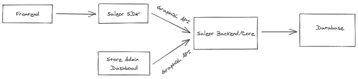
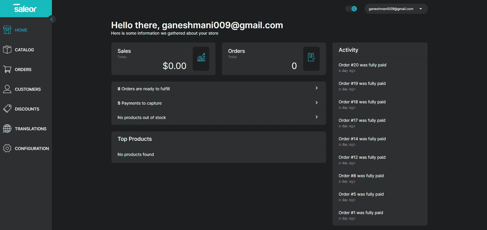
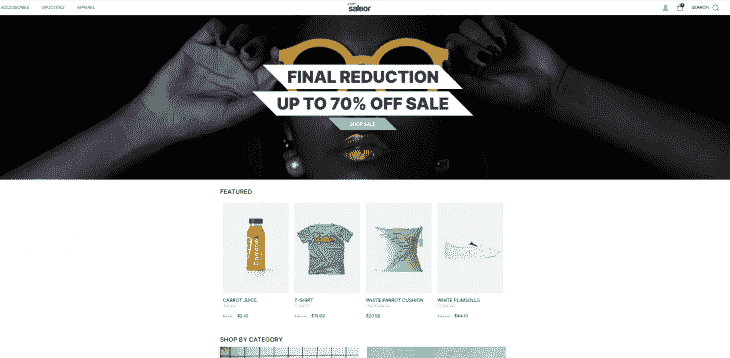
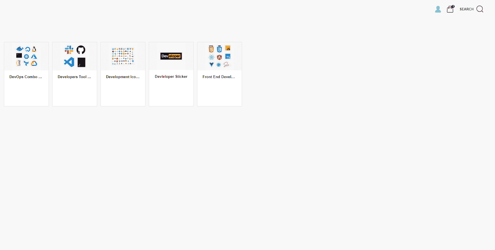
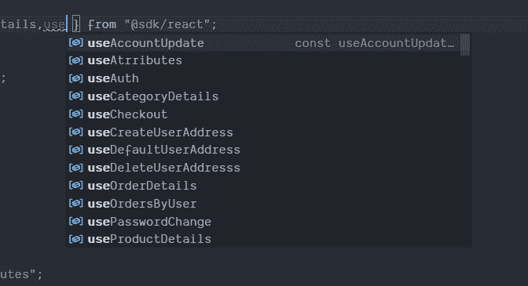
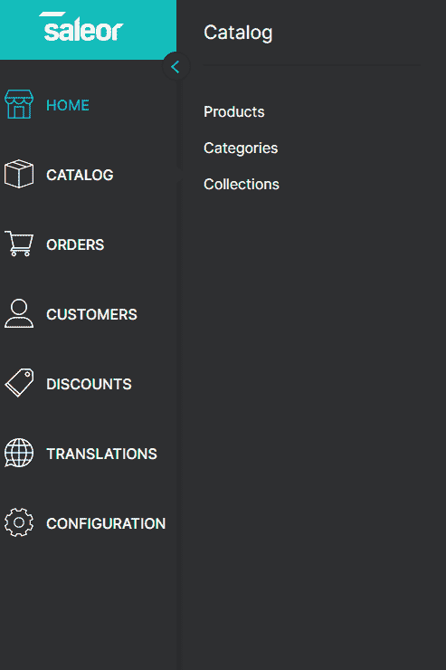
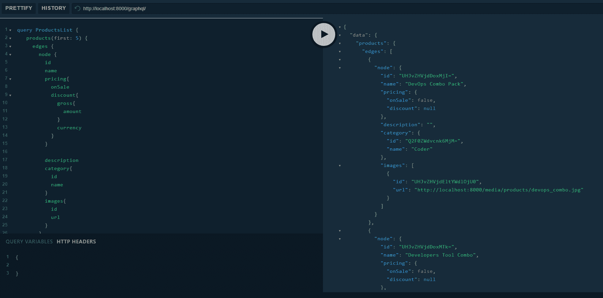
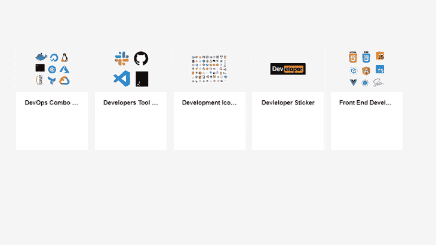
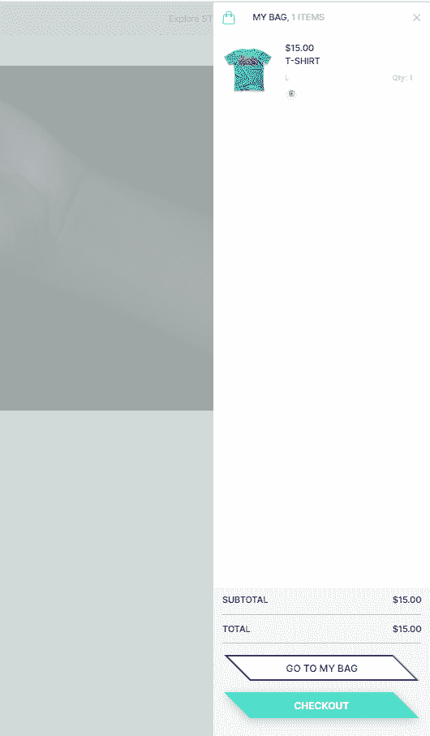
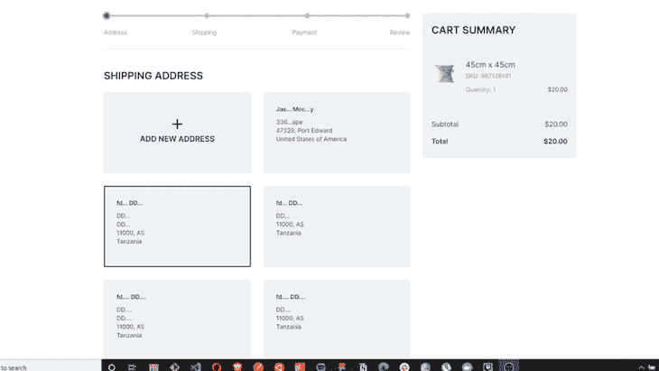

# 用 Saleor 建立网上商店

> 原文：<https://blog.logrocket.com/building-an-online-store-with-saleor/>

在现代 web 开发时代，无头解决方案成为构建任何产品的流行方式。例如，内容管理系统、电子商务解决方案等。在这篇文章中，我们将看到如何使用业界流行的无头电子商务产品 Saleor.io 来建立一个在线商店。

## Saleor.io 是什么？

Saleor 是一个无头的 GraphQL 电子商务平台，帮助企业主和开发团队在更短的时间内更快地构建产品。它为我们提供了以可扩展的方式运营电子商务商店所需的所有模块。

### 萨勒尔建筑

Saleor 包含三个重要模块，包括后端解决方案和基础设施、电子商务商店的管理仪表板和电子商务客户端解决方案。



我们的商店(或客户端)通过 Saleor SDK 与后端通信。同时，管理仪表板使用 GraphQL API 与后端通信。

在本教程中，我们将看到如何设置一个电子商务商店的销售或后端和管理仪表板。我们还将看到如何为电子商务应用程序构建店面(客户端)端。

## 安装和设置

注意:要在开发环境中设置和运行 Saleor，最好使用 [Docker](https://docs.docker.com/engine/install/) 。

我们将使用 Docker 在我们的开发环境中设置它。

```
git clone https://github.com/mirumee/saleor-platform.git --recursive --jobs 3
cd saleor-platform
docker-compose build
```

使用上面的命令，我们将在本地机器上构建 Docker 映像。

```
docker-compose run --rm api python3 manage.py migrate
docker-compose run --rm api python3 manage.py collectstatic --noinput
```

由于 Saleor 服务器运行在 Python 中，它为我们设置了服务器和数据库迁移。

```
//first command is optional
docker-compose run --rm api python3 manage.py populatedb 
docker-compose run --rm api python3 manage.py createsuperuser
```

之后，我们用虚拟数据填充数据库(这是可选的)，然后我们为管理仪表板创建一个超级用户。

最后，要运行服务，请使用以下命令:

```
docker-compose up
```

现在，如果你访问这个网址，你会看到这个:

`[http://localhost:3000/](http://localhost:3000/)`–客户端
`[http://localhost:8000/graphql/](http://localhost:8000/graphql/)`–graph QL 游乐场
`[http://localhost:9000/](http://localhost:9000/)`–管理仪表板





## 使用 Saleor 建立贴纸商店

现在，我们有了建立网上商店的基本销售设置。让我们通过定制 Saleor 店面来建立一个开发者贴纸商店。



以下是我们将重点关注的所有重要模块/功能:

*   基于类别列出产品
*   特色产品
*   搜索产品
*   用户–登录/注册
*   加入购物车
*   检验产品
*   支付

为了从我们的 GraphQL 服务器获取数据，我们需要一个 ApolloClient。这是因为`@saleor/sdk`内部使用 Apollo。

让我们在 React 应用程序中设置一个 Apollo 客户端。

```
npm install @saleor/sdk
```

```
import { SaleorProvider, useAuth } from "@saleor/sdk";

const config = { apiUrl: "http://localhost:8000/graphql/" };
const apolloConfig = {
  /* 
    Optional custom Apollo client config.
    Here you may append custom Apollo cache, links or the whole client. 
    You may also use import { createSaleorCache, createSaleorClient, createSaleorLinks } from "@saleor/sdk" to create semi-custom implementation of Apollo.
  */
};

const rootElement = document.getElementById("root");
ReactDOM.render(
  <SaleorProvider config={config} apolloConfig={apolloConfig}>
    <App />
  </SaleorProvider>,
  rootElement
);

const App = () => {
  const { authenticated, user, signIn } = useAuth();

  const handleSignIn = async () => {
    const { data, dataError } = await signIn("[email protected]", "admin");

    if (dataError) {
      /**
       * Unable to sign in.
       **/
    } else if (data) {
      /**
       * User signed in succesfully.
       **/
    }
  };

  if (authenticated && user) {
    return <span>Signed in as {user.firstName}</span>;
  } else {
    return <button onClick={handleSignIn}>Sign in</button>;
  }
};
```

现在，我们需要构建组件并使用 GraphQL 服务器来列出和更新服务器上的数据。

`@saleor/sdk`提供了许多现成的定制挂钩。这有助于我们节省大量开发时间来构建商店。其中一些是:

*   `useAuth`–处理认证机制的认证挂钩。它提供登录的用户信息，并检查用户是否是认证等。
*   `useCart`–它提供向购物车添加产品和从购物车中移除产品的功能。
*   `useSignOut`–将用户从商店中注销。
*   `useUserDetails`–返回登录用户的信息。
*   `useUserDetails`–它提供了结帐购物车中所有商品的功能。

有很多像这样的定制挂钩。我只是在这里指出一些重要的问题。您可以检查`@saleor/sdk`中的所有挂钩。



现在，我们将从服务器获取产品和产品类别。但是，如果您跳过了在安装时用虚拟数据填充数据库的步骤，您可能需要将`Products`和`Categories`添加到数据库中。

我们可以使用我们的商店管理仪表板来实现。转到管理仪表板中的`Catalog => Product`并添加产品。



对`Categories`也做同样的事情。这样，你可以让`Categories`和`Products`从服务器获取数据。

一旦您添加了它们，我们就可以编写 GraphQL 查询来获取产品和类别。

```
query ProductsList {
    products(first: 5) {
      edges {
        node {
          id
          name
          pricing{
            onSale
            discount{
              gross{
                amount
              }
              currency
            }
          }
          description
          category{
            id
            name
          }
          images{
            id
            url
          }
        }
      }
    }
    categories(level: 0, first: 4) {
      edges {
        node {
          id
          name
          backgroundImage {
            url
          }
        }
      }
    }
  }
```

它从服务器获取产品和类别。



您可以使用该数据列出我们商店中的所有产品和类别。

```
import React, { useRef, useState } from "react";
import {
  ProductsList_categories,
  ProductsList_shop,
  ProductsList_shop_homepageCollection_backgroundImage,
} from "./gqlTypes/ProductsList";
import { structuredData } from "../../core/SEO/Homepage/structuredData";
// import noPhotoImg from "../../images/no-photo.svg";
import ProductItem from '../../components/product/ProductItem'
import Boundary from './boundary'
const Page = ({ loading, categories, products, backgroundImage, shop }) => {
  const [columnCount, setColumnCount] = useState(10);
  const categoriesExist = () => {
    return categories && categories.edges && categories.edges.length > 0;
  };
  const productListWrapper = useRef(null);
  return (
    <>
      <script className="structured-data-list" type="application/ld+json">
        {structuredData(shop)}
      </script>
      <main className="content">
        <section className="product-list-wrapper">
          <Boundary>
            <div
              className="product-list"
              ref={productListWrapper}
              style={{ gridTemplateColumns: `repeat(${columnCount}, 160px)` }}
            >
              {products.edges.map((product, index) => {
                return (
                  <ProductItem
                    foundOnBasket={false}
                    product={product.node}
                    key={`product-skeleton ${index}`}
                  />
                )
              })}
            </div>
          </Boundary>
        </section>
      </main>
    </>
  );
};
export default Page;
```

到目前为止，我们已经有了产品和类别列表功能。现在，我们需要实现一种方法来将产品添加到购物篮中，并添加用户登录/注册功能。

## 添加到购物车功能



当用户点击添加到购物车按钮时，我们使用`@saleor/sdk`定制钩子`useCart`将商品添加到他们的购物车。

```
import React from 'react';
import { displayMoney } from './utils';
import { useCart } from "@sdk/react";
const ProductItem = ({
    product,
    onOpenModal,
    displaySelected,
    foundOnBasket
}) => {
    const { addItem, removeItem } = useCart()
    const onClickItem = () => {
        if (product.id) {
            onOpenModal();
            displaySelected(product);
        }
    };
    const onAddToBasket = () => {
        addItem(product.id, 1)
    };
    return (
        <div
            className={`product-card ${!product.id ? 'product-loading' : ''}`}
            style={{
                border: foundOnBasket ? '1px solid #cacaca' : '',
                boxShadow: foundOnBasket ? '0 10px 15px rgba(0, 0, 0, .07)' : 'none'
            }}
        >
            {foundOnBasket && <i className="fa fa-check product-card-check" />}
            <div
                className="product-card-content"
                onClick={onClickItem}
            >
                <div className="product-card-img-wrapper">
                    {product.images[0].url ? (
                        
                    ) : null}
                </div>
                <div className="product-details">
                    <h5 className="product-card-name text-overflow-ellipsis margin-auto">{product.name || null}</h5>
                    <p className="product-card-brand">{product.brand || null}</p>
                    <h4 className="product-card-price">{product.price ? displayMoney(product.price) : null}</h4>
                </div>
            </div>
            {product.id && (
                <button
                    className={`product-card-button button-small button button-block ${foundOnBasket ? 'button-border button-border-gray' : ''}`}
                    onClick={onAddToBasket}
                >
                    {foundOnBasket ? 'Remove from basket' : 'Add to basket'}
                </button>
            )}
        </div>
    );
};
export default ProductItem;
```

这里，我们实现了自定义钩子`useCart`。使用它，我们可以向购物车中添加商品，也可以从购物车中删除商品。

```
const { addItem, removeItem } = useCart()
```

## 展示车

要从购物车中获取所有商品，您可以使用相同的自定义挂钩:

```
const {
    items,
    removeItem,
    subtotalPrice,
    shippingPrice,
    discount,
    totalPrice,
  } = useCart();
```

它将所有添加到购物车的商品返回给我们。现在，我们可以使用`items`在我们的电子商务商店中展示它。



## 用户登录/注册

实现登录功能非常简单。我们需要使用来自`@saleor/sdk`的定制钩子`useSignIn`，它在成功登录后返回数据。

```
import "./scss/index.scss";
import * as React from "react";
import { useSignIn } from "@sdk/react";
import { maybe } from "@utils/misc";
import { Button, Form, TextField } from "..";
const LoginForm = ({ hide }) => {
  const [signIn, { loading, error }] = useSignIn();
  const handleOnSubmit = async (evt, { email, password }) => {
    evt.preventDefault();
    const authenticated = await signIn({ email, password });
    if (authenticated && hide) {
      hide();
    }
  };
  return (
    <div className="login-form">
      <Form
        errors={maybe(() => error.extraInfo.userInputErrors, [])}
        onSubmit={handleOnSubmit}
      >
        <TextField
          name="email"
          autoComplete="email"
          label="Email Address"
          type="email"
          required
        />
        <TextField
          name="password"
          autoComplete="password"
          label="Password"
          type="password"
          required
        />
        <div className="login-form__button">
          <Button type="submit" {...(loading && { disabled: true })}>
            {loading ? "Loading" : "Sign in"}
          </Button>
        </div>
      </Form>
    </div>
  );
};
export default LoginForm;
```

用户注册与登录功能略有不同。我们需要使用一个`GraphQL`突变，它是:

```
mutation RegisterAccount(
    $email: String!
    $password: String!
    $redirectUrl: String!
  ) {
    accountRegister(
      input: { email: $email, password: $password, redirectUrl: $redirectUrl }
    ) {
      errors {
        field
        message
      }
      requiresConfirmation
    }
  }
```

当用户注册成功后，它会将他们重定向到指定的 URL。

## 实施购物车结帐

就功能而言，购物车结账需要完成 4 个步骤。它们是:

*   从用户处获取地址
*   支付
*   确认
*   运输方式配置



与其他功能类似，我们可以使用一个定制钩子`useCheckout`，它提供了结帐所需的所有功能。

### 从用户处获取地址

我们需要从用户那里获得地址。您可以要求他们添加一个新地址，或者选择一个现有地址。为此，我们可以使用`useCheckout`中的函数:

```
const {
    checkout,
    setShippingAddress,
    selectedShippingAddressId,
  } = useCheckout();
```

### 支付

为了进行支付，Saleor 为我们提供了以下功能:

```
const {
    checkout,
    billingAsShipping,
    setBillingAddress,
    setBillingAsShippingAddress,
    selectedBillingAddressId,
    availablePaymentGateways,
    promoCodeDiscount,
    addPromoCode,
    removePromoCode,
    createPayment,
  } = useCheckout();
```

使用`createPayment`功能，我们可以完成订单的交易。

```
const handleProcessPayment = async (
    gateway,
    token,
    cardData
  ) => {
    const { dataError } = await createPayment(gateway, token, cardData);
    const errors = dataError?.error;
    changeSubmitProgress(false);
    if (errors) {
      setGatewayErrors(errors);
    } else {
      setGatewayErrors([]);
      history.push(CHECKOUT_STEPS[2].nextStepLink);
    }
  };
```

### 确认/审查

这只是为了让用户检查和验证到目前为止一切都是正确的。在此步骤中，您可以使用以下功能完成结账:

```
const { checkout, payment, completeCheckout } = useCheckout();
```

## 结论

总而言之，Saleor 是电子商务开发的强大 GraphQL headless。它提供了 SDK 提供的所有必需功能。因此，我们可以只关注电子商务商店的 UI。它帮助我们避免后端管理面板的复杂设置。

## [LogRocket](https://lp.logrocket.com/blg/ecommerce-signup) :看看用户为什么不完成你的电子商务流程中的一个步骤的技术和 UX 原因。

[](https://lp.logrocket.com/blg/ecommerce-signup)

LogRocket 就像是一个网络和移动应用程序和网站的 DVR，记录你的电子商务应用程序上发生的一切。LogRocket 没有猜测用户不转化的原因，而是主动揭示了阻止你转化的根本原因，比如 JavaScript 错误或死点击。LogRocket 还可以监控应用的性能，报告客户端 CPU 负载、客户端内存使用等指标。

开始主动监控您的电子商务应用程序— [免费试用](https://lp.logrocket.com/blg/ecommerce-signup)。