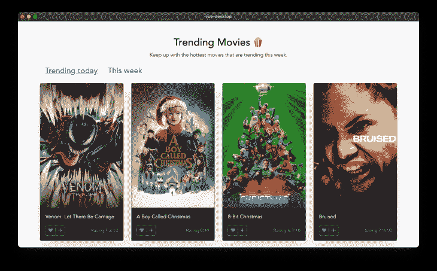
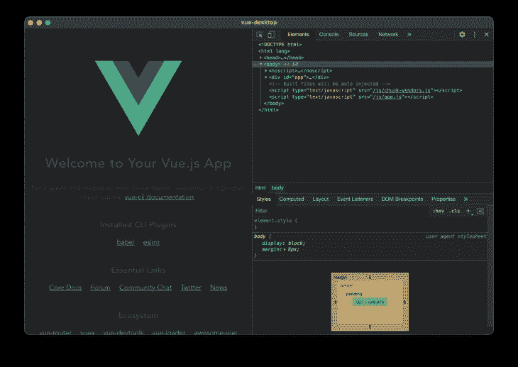
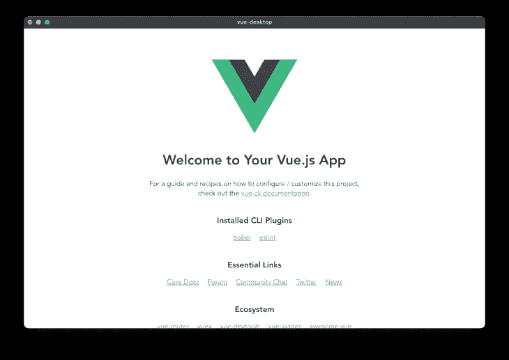
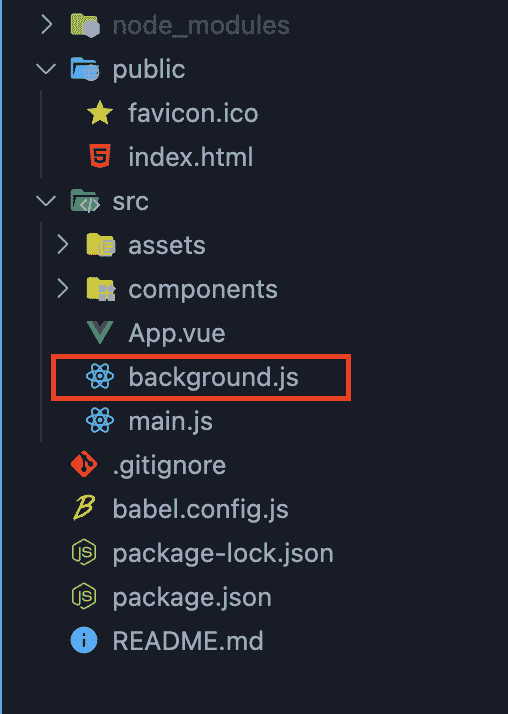
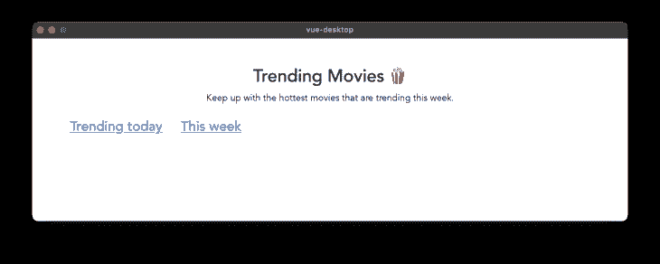

# 用电子和 Vue 构建一个应用程序

> 原文：<https://blog.logrocket.com/building-app-electron-vue/>

JavaScript 被认为是世界上最常用的编程语言之一，因为它不仅仅擅长操作前端元素；使用这种相同的语言，您可以创建跨平台的移动应用程序，开发 API 和后端基础设施，并创建桌面应用程序。

虽然已经有了许多针对所有这些方面的库和框架，但在使用 JavaScript 开发桌面应用程序时，Electron 脱颖而出，在这篇文章中，我们将了解如何使用 Vue 和 Electron 来创建我们的第一个跨平台桌面应用程序。

## 先决条件

本文假设以下先决条件:

*   对 JavaScript 的基本理解
*   基本熟悉 Vue
*   已安装 Node.js 和 npm
*   有电子工作经验者优先，但不是必需的

## 什么是电子？

Electron 是一个开源的 JavaScript 框架，用于使用 web 技术(HTML、CSS 和 JavaScript)构建原生的跨平台桌面应用程序。这意味着，如果您事先熟悉这些技术，您可以使用相同的代码库来开发用于 Windows、Linux 和 macOS 的桌面应用程序。

在幕后，Electron 将 Chromium 引擎与 Node.js 运行时结合在一起，作为一个独立的桌面程序来读取和运行您的代码库。而且，为了证明它的能力，使用 Electron 创建的流行桌面程序包括 Slack、VS Code 和 WhatsApp Desktop。

### 赞成的意见

以下是使用电子的一些优点:

*   单一代码库——有了电子版，你只需要一个单一的代码库就可以为不同的操作系统创建桌面应用程序
*   利用网络技能——如果你有使用基本网络堆栈(HTML、CSS 和 Javascript)的经验，开始使用 Electron 会非常容易
*   大社区——电子社区是一个相当大且活跃的社区，一个重要的因素是因为这个框架正在被顶级公司使用和支持

### 骗局

就像其他事情一样，用电子构建桌面应用程序也有一些缺点。其中一些包括:

*   更高的资源消耗——众所周知，与在其他环境中编写的应用程序(如 Java FX、Objective C 等)相比，用 Electron 编写的桌面应用程序会消耗更多的 CPU 和 RAM
*   更大的应用程序大小——如前所述，电子应用程序在构建过程中捆绑了 Chromium 引擎，这导致即使是简单的应用程序也有很大的应用程序大小

## 真空+电子

如果你以前使用过 Vue，那么开始使用 electronic 是相当简单的。这可以通过一个名为 Electron Builder 的 Vue CLI 插件来实现，在接下来的章节中，我们将通过构建一个示例应用程序来了解这个插件是如何工作的，这个示例应用程序从 [themoviedb API](https://www.themoviedb.org/) 返回一个完整的趋势电影列表。

下面是我们的电影应用程序的预览:



### 入门指南

因为电子构建器是一个 Vue CLI 插件。这意味着我们需要先安装 Vue CLI 本身，然后才能使用它。要执行此运行，请执行以下操作:

```
npm install -g @vue/cli
```

运行上面的命令将安装 Vue CLI 的最新稳定版本，您可以通过运行`vue -V`来验证它是否成功，它应该会打印出安装的 Vue 版本。

接下来，我们要创建一个新的 Vue 应用程序，所以继续运行下面的命令来创建一个名为 vue-desktop 的新应用程序:

```
vue create vue-desktop
```

最后一步是添加 Vue 电子构建器插件，我们可以通过运行以下命令来完成:

```
vue add electron-builder
```

这将询问您想要添加到这个 Vue 项目中的电子版本，一旦您完成了，您应该会看到一个成功的消息，表明已经安装了电子构建器。然后，您可以通过运行以下命令来启动该应用程序:

```
npm run electron:serve
```

您应该会看到类似下面截图的输出:



关闭开发工具，您应该会看到应用程序的完整预览，如下图所示:



### 文件结构

当您在首选文本编辑器中打开项目文件夹时，您应该会看到以下文件和目录，如下图所示。如果您过去使用过 Vue CLI，您会注意到文件结构非常相似。唯一的变化是添加了一个新的`background.js`文件，这个文件负责将我们的 Vue 应用程序作为一个独立的桌面应用程序运行。



在这个文件中，您可以配置应用程序启动窗口的默认宽度和高度，设置应用程序标题，添加自动更新功能，等等。

## 构建我们的电影应用程序

现在我们已经熟悉了 Vue Electron Builder，让我们开始构建我们的趋势电影应用程序。

第一步是打开`public/index.html`，在 head 部分添加一个 Bootstrap 和 Font Awesome 条目，如下面的代码所示:

```
...
<link
  href="https://cdn.jsdelivr.net/npm/[email protected]/dist/css/bootstrap.min.css"
  rel="stylesheet"
/>
<link
  rel="stylesheet"
  href="https://pro.fontawesome.com/releases/v5.10.0/css/all.css"
/>
...
```

接下来，在`src/components`文件夹中，创建一个名为`MovieCard.vue`的新文件，并将以下代码粘贴到其中:

```
<template>
  <main>
    <div class="card mb-4 shadow-lg border border-secondary bg-dark text-light">
      
      <div class="card-body">
        <p class="card-text">{{ movie.title }}</p>
        <div class="">
          <div class="d-flex justify-content-between align-items-center">
            <div class="btn-group">
              <button type="button" class="btn btn-sm btn-outline-secondary">
                <i class="fas fa-heart"></i>
              </button>
              <button type="button" class="btn btn-sm btn-outline-secondary">
                <i class="fas fa-plus"></i>
              </button>
            </div>
            <small class="ms-auto text-muted"
              >Rating {{ movie.vote_average }}/10</small
            >
          </div>
        </div>
      </div>
    </div>
  </main>
</template>
<script>
export default {
  name: "MovieCard",
  props: {
    movie: {
      type: Object,
      required: true,
    },
  },
};
</script>
```

这里，我们创建了一个`MovieCard`组件，它接受包含每部电影所有细节的道具。下一步是删除包含在`src/App.vue`中的所有代码，并用下面的代码更新:

```
<template>
  <div id="app">
    <div class="container">
      <div class="text-center">
        <h2 class="text-center mt-5">Trending Movies 🍿</h2>
        <p>Keep up with the hottest movies that are trending this week.</p>
      </div>

      <div class="my-4">
        <a href="#" class="mx-3 h4"> Trending today</a>
        <a href="#" class="mx-3 h4">This week</a>
      </div>
    </div>
  </div>
</template>
```

此时，如果我们运行我们的应用程序，我们应该有以下输出:



最后一步是定义一个从 TMDB API 获取最受欢迎的电影的方法。这个过程需要你[创建一个免费账户](https://www.themoviedb.org/)来取回你的 API 密匙。

为此，用以下代码更新`src/App.vue`:

```
<template>
  <div id="app">
    <div class="container">
      <div class="text-center">
        <h2 class="text-center mt-5">Trending Movies 🍿</h2>
        <p>Keep up with the hottest movies that are trending this week.</p>
      </div>

      <div class="my-4">
        <a href="#" @click="getTrendingMovies('day')" class="mx-3 h4">
          Trending today</a
        >
        <a href="#" @click="getTrendingMovies('week')" class="mx-3 h4"
          >This week</a
        >
      </div>

      <div class="row" v-if="movies.length > 0">
        <div class="col-md-3" v-for="(movie, i) in movies" :key="i">
          <movie-card :movie="movie" />
        </div>
      </div>
    </div>
  </div>
</template>

<script>
import MovieCard from "./components/MovieCard.vue";
export default {
  name: "App",
  components: {
    MovieCard,
  },
  data() {
    return {
      movies: [],
      apiKey: "YOUR_API_KEY_HERE",
    };
  },
  methods: {
    getTrendingMovies(category) {
      return fetch(
        `https://api.themoviedb.org/3/trending/movie/${category}?api_key=${this.apiKey}`
      )
        .then((response) => response.json())
        .then((data) => {
          this.movies = data.results;
        });
    },
  },
  mounted() {
    this.getTrendingMovies("day");
  },
};
</script>
```

这里，我们导入了之前在脚本部分创建的`MovieCard`组件，我们还添加了一个新方法`getTrendingMovies()`，它负责从 TMDB API 加载我们的电影，然后我们在挂载的钩子中运行这个函数。

对我们标记的一个小改动是将从 TMDB 返回的所有结果循环到我们的`MovieCard`组件中。

如果我们在这个阶段刷新我们的应用程序，一切都应该工作正常，您应该得到类似下图的输出:


### 更新应用程序图标

电子图标被设置为应用程序的默认图标，大多数情况下，您可能想要设置自己的自定义图标。您可以通过在`background.js` 中的`newBrowserWindow()`方法中添加一个新的图标条目来更新应用程序图标，如下所示:

```
...
const win = new BrowserWindow({
    width: 800,
    height: 600,
    title: "Trending movies",
[+] icon: "./path/to/icon.png",
...
```

## 构建应用程序

将我们的应用程序编译成独立的可执行文件非常简单。我们可以通过运行下面的命令来做到这一点:

```
npm run electron:build
```

请记住，生成的可执行应用程序取决于您使用的操作系统。然而，Electron Builder 允许您定义要为哪个(或哪些)平台生成可执行文件。可用选项包括 Mac、Win 和 Linux。

这意味着要构建应用程序的 Linux 版本，您将运行以下命令:

```
npm electron:build -- --linux nsis
```

## 结论

在本教程中，我们已经了解了如何使用 [Electron](https://blog.logrocket.com/advanced-electron-js-architecture/) 和 Vue 来创建一个跨平台的桌面应用程序。我们还构建了一个示例趋势电影应用程序来理解事情是如何工作的。完整应用程序的代码可以在 [GitHub](https://github.com/AsaoluElijah/vue-electron) 上找到。

如果你喜欢读这篇文章，请在下面留下评论！

## 像用户一样体验您的 Vue 应用

调试 Vue.js 应用程序可能会很困难，尤其是当用户会话期间有几十个(如果不是几百个)突变时。如果您对监视和跟踪生产中所有用户的 Vue 突变感兴趣，

[try LogRocket](https://lp.logrocket.com/blg/vue-signup)

.

[](https://lp.logrocket.com/blg/vue-signup)[https://logrocket.com/signup/](https://lp.logrocket.com/blg/vue-signup)

LogRocket 就像是网络和移动应用程序的 DVR，记录你的 Vue 应用程序中发生的一切，包括网络请求、JavaScript 错误、性能问题等等。您可以汇总并报告问题发生时应用程序的状态，而不是猜测问题发生的原因。

LogRocket Vuex 插件将 Vuex 突变记录到 LogRocket 控制台，为您提供导致错误的环境，以及出现问题时应用程序的状态。

现代化您调试 Vue 应用的方式- [开始免费监控](https://lp.logrocket.com/blg/vue-signup)。